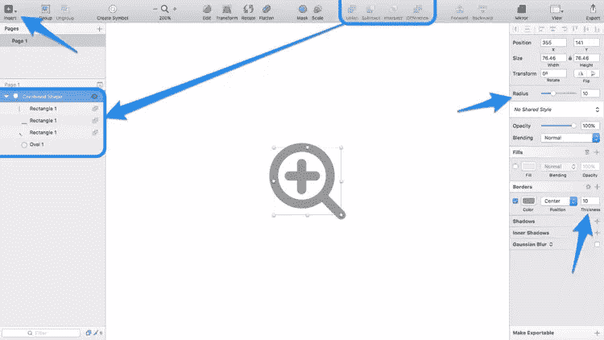
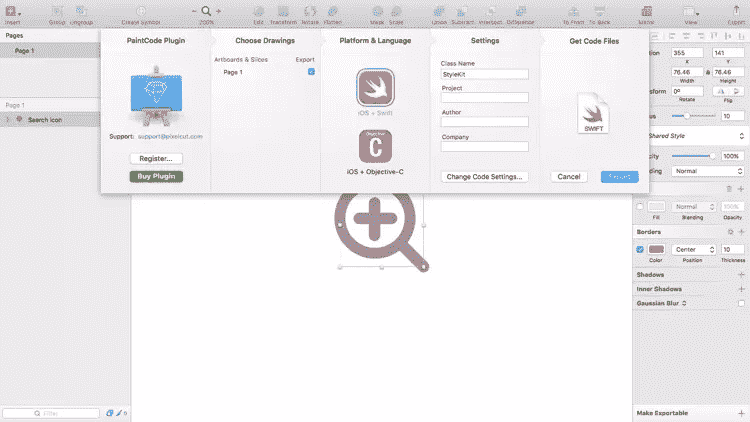
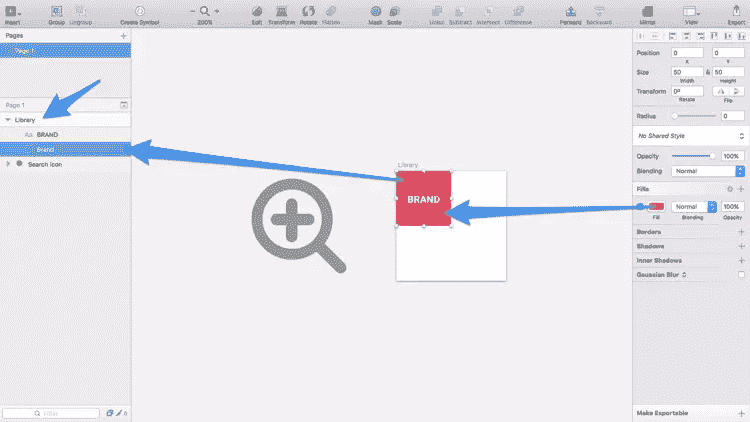
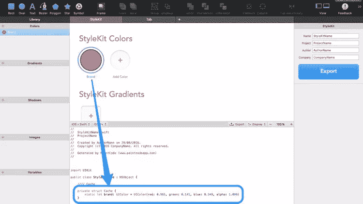

# PaintCode:如何用 Sketch App 制作 iOS 就绪的 App 图形

> 原文：<https://www.sitepoint.com/paintcode-how-to-make-ios-ready-app-graphics-with-sketch-app/>

 **特别赠品** : PaintCode 为 10 位幸运的 SitePoint 读者提供了素描许可证的代码生成器。全部细节在这篇文章的底部。

让我们从三个事实开始:

1.  你是设计师。
2.  设计师创造了很好的 UI 元素。
3.  iOS 应用程序*需要*漂亮的 UI 元素。

但是，如何让你的图形和用户界面元素“iOS 就绪”呢？

对于设计师来说，这通常是一个灰色地带。我们知道很多关于使用浏览器的知识，但是 iOS 的最佳图像格式是什么呢？我们需要什么分辨率？矢量还是像素？

## 符合油漆代码

PaintCode 2 是一个桌面应用程序，可以将矢量图形转换为 Objective-C 或 Swift 代码，而不是将其导出为 PNG 或 JPG 等标准图像格式。通常，您需要以@1x、@2x 和@3x 分辨率导出图像资源，但是通过将您的矢量图转换为代码，您可以使它们与分辨率无关。

## 为什么这是有利的？

通常，OS X 和 iOS 开发人员接收 PNG 格式的图像资产，应用程序根据设备的分辨率选择所需的图像版本。这些 png 是*预生成的*，这意味着你不能在运行时轻松地定制它们，当然你也不能在不损失质量的情况下扩展它们。

与使用图像精灵相比，使用本机代码渲染图像将使应用程序运行得更快，并且——由于 PaintCode 的新 [Sketch 插件](http://www.paintcodeapp.com/sketch)——UI 设计人员可以将他们的工作流程保留在 Sketch 中，同时仍然弥合设计人员与开发人员之间的差距。

Mac 用户可以以 99.99 美元的价格购买 PaintCode 2 ，但令人惊讶的是，Sketch 用户实际上并不需要完整的 PaintCode 2 应用程序，只需要 Sketch 的 PaintCode 插件。成本是一样的，但不同的是，Sketch 应用程序的粉丝将能够在几乎没有学习曲线的情况下制作 iOS 图形。

PaintCode 2 是为那些希望在应用程序本身中绘制和编辑矢量的人准备的，你现在可以使用[免费试用](https://www.paintcodeapp.com/)来探索它。

## 在草图中绘制矢量(如往常一样)

通过使用一系列椭圆(**键盘命令:O** )和线条( **L** )，创建一个“添加搜索词”图标。就像边框粗细一样，圆角可以通过改变*检查器*中的“角”选项来激活。记住使用布尔运算(*并集、减法、交集、差分*)来创建一个“组合形状”，如下图所示。

即使对于一个初学素描的用户来说，这也是轻而易举的事情。

## 使用 PaintCode 插件
将矢量转换成代码

如果你还没有，为 Sketch 安装 PaintCode 插件，这样我们就可以开始把我们的图标转换成 Objective-C/Swift 代码。

### 声明应该导出哪些对象

准备好之后，使用键盘快捷键 **command+option+R** 访问 Sketch 中 PaintCode 的“导出表”。就像 Sketch 的原生*导出*特性一样，“选择绘图”选项卡将显示文档中所有可导出的切片。如果画板不包含任何切片，则整个画板都是可导出的。如果没有画板，那么整个页面将是可导出的(就像我们的文档一样)。代码输出中使用了图层名称，所以要确保它们不像“Oval 1”那样随意。

### 选择一种语言并导出代码

在下一个选项卡(“平台和语言”)中，您需要选择您希望在导出中使用的语言(Objective-C 或 Swift ),目前不支持 OS X 应用程序，仅支持 iOS。这个选项和“设置”标签下可用的选项可能是你需要和你的开发者讨论的事情。

在最后一个选项卡“Get Code Files”中，您可以单击“export”按钮或将文件图标拖到桌面，将您的所有资源作为代码下载到一个文件中，也称为 StyleKit。

### 那么，什么是 StyleKit？

从 3.7 版本开始，Sketch 使用“符号页面”将所有常用组件放在一个画布中。样式工具包的工作方式类似；StyleKits 是代码类，所有转换后的设计资产都捆绑在其中，包括常用的颜色和阴影。PaintCode 将你的设计资产编译到这个类中，它按原样工作**。**

 **作为一名设计师，您不需要查看或手动调整这些代码，而是在 Sketch(或 PaintCode)中进行更改，然后重新导出 StyleKit。

然后，开发人员在 Xcode 中使用这个 StyleKit 来构建应用程序。

### 在样式套件中保存常用颜色

最重要的是，您可以使用 Sketch 创建一个常用颜色、渐变和阴影的库，这些颜色、渐变和阴影也可以在 StyleKit 中定义为代码，开发人员可以一次又一次地重用它们。首先创建一个叫做“库”的画板(**键盘命令:一个**)(必须这么叫)，然后在里面创建一个矩形(**键盘命令:R** )。

重命名图层来描述颜色(这将用于在代码中引用它)，并创建一个文本图层(**键盘命令:T** )来可视化地记录颜色。别担心，在导出过程中，PaintCode 插件会忽略文本层。

*注意:为了将阴影嵌入到样式工具包中，使用检查器将它们添加到形状上，并移除它的任何填充*。

在样式工具包中保存常用颜色

这里有一个在实际的 PaintCode 应用程序中创建的 StyleKit(以及它输出的代码)的示例，供那些对代码方面更感兴趣的人使用。

## 结论

PaintCode 2 允许设计人员将资源交付提升到一个新的水平，在这个阶段，可扩展的矢量资源和常见样式不仅被移交，而且已经集成到一个与分辨率无关的编码移动应用程序中。

这种类型的工作流程能改善设计师和开发者之间的关系吗？PaintCode 提供这样的工作流程吗？很想听听大家的看法。

## 获取 PaintCode 代码生成器的副本

如果你是一个 Sketch 用户，并且想为你的工具包添加 Sketch 代码生成器(价值$US99)，你可能会很幸运。我们有 10 个许可证要分发。若要进入，请使用您的 Twitter ID 进行身份验证。

[SitePoint 有 10 个 PaintCode 代码生成器，用于分发](https://gleam.io/bNMk7/sitepoint-has-10-paintcode-code-generator-for-sketch-licenses-to-give-away)**