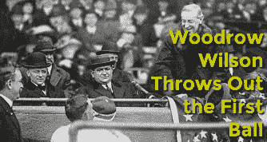
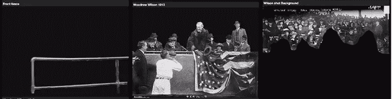

# 视差烧伤:用 SVG 将照片从 2D 转换为 3D

> 原文：<https://www.sitepoint.com/parallax-burns-converting-photographs-2d-3d-svg/>

上周我们谈到了 ZorroSVG，这是一个将你笨重的透明 PNG-32 转换成纤细灵活的 SVG 的工具。

这让我开始思考。

几周前，我谈到了本·伯恩斯效应在电影和电视中的应用。

图 1:视差本·伯恩斯效果(GIF 格式)

但还有另一种类似的、但稍微复杂一些的技术，它以不同的速率平移和/或缩放照片的不同层，给图像一种轻微的 3D 效果。有时这被称为一种“[视差-本·伯恩斯效应](https://www.youtube.com/watch?v=p4UvdzUWGiY)”，有时是“[2D 到 3D 效应](https://www.youtube.com/watch?v=3ZYkFkK3Htw)”，有时是“ [2.5D 效应](https://www.youtube.com/watch?v=FraYqnnkxrk)”。你可能会认为它是'*历史频道效果*，但它也可能是' [*VH1:音乐效果背后*](http://www.vh1.com/shows/behind-the-music/episode-guide) '。

这是一个经典的摄像师技巧，所以你在 Youtube 上找到的所有关于这种效果的教程都是针对 Adobe After Effects 用户的。

但是，如果我们可以在一个独立的 SVG 图形中完全模拟这种效果，会怎么样呢？

这是计划。

虽然(还)没有完全按照那种方式进行，但我认为分享我目前所拥有的可能是有用的。**让我明确一点**:这是一个人的起点，而不是一个成品。我知道它在 Opera 3 中不起作用。；)

我不想让*超级*代码太多，但是你应该能够通过代码笔来理解细节。

### 计划是…

1.  将一张照片分成三个重叠的图层——正面、中间和背景。
2.  使用 ZorroSVG 将这些图层转换成 SVG。
3.  手动将这些层重新组合成一个多层 SVG
4.  在 SVG 的中使用 CSS 动画*来获得视差贴图的效果。*

## 先拿

### 照片

图 2:伍德罗·威尔逊档案图像

我的第一个任务是找到一个好的图片。我从 Flickr (图 2)上找到了这张伍德罗·威尔逊的无版权保护的存档照片，这张照片很有深度。

将它放入 Photoshop 后，我修复了下半部分的损坏，然后将其分成三个独立的层(都是 PNG-32):

1.  [**前景**:前景中的栅栏](https://i.sli.mg/bn6JTu.png)
2.  [**中间地带**:威尔逊和他的贵宾同伴](https://i.sli.mg/iC7dWr.png)
3.  [**背景**:看台剩余部分](https://i.sli.mg/lZPsUt.png)

因为我们要移动这些层，所以我们需要创建一些额外的图像来填补空白。我用 Photoshop 的“内容感知填充”功能克隆了栅栏后面和威尔逊等人后面的新图像，虽然很粗糙，但也可以。

现在我们有了原始图像组件。

## SVG 标记

CodePen 允许你将 SVG 标记直接写入 HTML 面板，所以这是一个发挥 SVG 思想的好地方。让我们直接进入我的第一个“概念验证”测试:

见 [CodePen](http://codepen.io) 上 Alex ( [@alexmwalker](http://codepen.io/alexmwalker) )的笔 [SVG 视差灼伤](http://codepen.io/alexmwalker/pen/zqvxva/)。