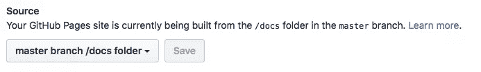

# 使用 Pages 捆绑 Hyperapp 应用程序并部署到 GitHub 页面

> 原文：<https://www.sitepoint.com/parcel-hyperapp-github-pages/>

在之前的一篇[帖子](https://www.sitepoint.com/hyperapp-todo-list)中，我们遇到了 Hyperapp，一个微型库，可以用来以类似 React 或 Vue 的方式构建动态的单页 web 应用。

在这篇文章中，我们将把事情提高一个档次。我们将在本地创建应用程序(我们之前在 CodePen 上工作)，学习如何使用[包](https://parceljs.org/)(类似于 webpack 或 Rollup 的模块捆绑器)捆绑它，并使用 [GitHub 页面](https://pages.github.com)将其部署到网络上。

不要担心，如果你没有完成第一个帖子的项目。这里提供了所有的代码(虽然我不会详细解释它是做什么的),并且概述的原则可以应用于大多数其他 JavaScript 项目。

如果你想看看我们最终会得到什么，你可以[在这里](https://sitepoint-editors.github.io/hyperlist/)查看完成的项目，或者从[我们的 GitHub repo](https://github.com/sitepoint-editors/hyperlist/) 下载代码。

## 基本设置

为了跟进，您需要安装 [Node.js 和 npm](https://nodejs.org/) (它们打包在一起)。我推荐使用一个版本管理器，比如 [nvm](https://github.com/creationix/nvm) 来管理你的节点安装([下面是如何操作](https://www.sitepoint.com/quick-tip-multiple-versions-node-nvm/))，如果你想要一些帮助来掌握 npm，那么看看我们的[初学者友好的 npm 教程](https://www.sitepoint.com/beginners-guide-node-package-manager/)。

我们将使用终端命令来创建文件和文件夹，但是如果你喜欢的话，也可以通过点击来完成。

首先，创建一个名为`hyperlist`的新文件夹:

```
mkdir hyperlist 
```

现在转到该目录，并使用 npm 初始化一个新项目:

```
cd hyperlist/
npm init 
```

这将提示您回答一些关于应用程序的问题。只需按下`enter`就可以接受其中任何一项的默认设置，但是可以随意添加你的作者姓名，并添加应用程序的描述。

这将在`hyperlist`目录中创建一个名为`package.json`的文件，如下所示:

```
{
  "name": "hyperlist",
  "version": "1.0.0",
  "description": "A To-do List made with Hyperapp",
  "main": "index.js",
  "scripts": {
    "test": "echo \"Error: no test specified\" && exit 1"
  },
  "author": "DAZ",
  "license": "MIT"
} 
```

现在我们需要安装 Hyperapp 库。这是使用 npm 和`--save`标志来完成的，这意味着`package.json`文件将被更新以包含它作为一个依赖项:

```
npm install --save hyperapp 
```

这可能会给出一些关于没有存储库字段的警告。不要担心这个问题，因为我们稍后会修复它。它应该更新`package.json`文件以包含以下条目(版本号可能略有不同):

```
"dependencies": {
  "hyperapp": "^1.2.5"
} 
```

它还将创建一个名为`node_modules`的目录，其中存储了所有 Hyperapp 文件，以及一个名为`package-lock.json`的文件。这用于跟踪使用 npm 安装的所有软件包的依赖关系树。

现在我们准备开始创建应用程序了！

## 文件夹结构

将所有源代码放在一个名为`src`的文件夹中是一种常见的惯例。在这个文件夹中，我们将把所有的 JavaScript 文件放到一个名为`js`的目录中。让我们现在创建这两个:

```
mkdir -p src/js 
```

在[之前的帖子](https://www.sitepoint.com/hyperapp-todo-list)中，我们了解到 Hyperapp 使用三个主要部分构建应用程序:状态、动作和视图。为了代码组织的利益，我们将把每个部分的代码放在一个单独的文件中，所以我们需要在`js`目录中创建这些文件:

```
cd src/js
touch state.js actions.js view.js 
```

别担心它们都是空的。我们将很快添加代码！

最后，我们将返回到`src`目录并创建我们的“入口点”文件。这些文件将链接到所有其他文件。第一个是`index.html`，它将包含一些基本的 HTML，另一个是`index.js`，它将链接到我们所有的其他 JavaScript 文件以及我们的 SCSS 文件:

```
cd ..
touch index.html index.js 
```

现在我们的文件夹结构已经就绪，我们可以开始添加一些代码并将所有文件连接在一起。前进！

## 一些基本的 HTML

我们将从向`index.html`文件添加一些基本的 HTML 代码开始。Hyperapp 负责创建 HTML，并可以将其直接呈现在`<body>`标签中。这意味着我们只需要设置包含在`<head>`标签中的元信息。除了`<title>`标签的值，你可以为每个项目使用相同的`index.html`文件。在您最喜欢的文本编辑器中打开`index.html`，并添加以下代码:

```
<!doctype html>
<html lang='en'>
  <head>
    <meta charset='utf-8'>
    <meta name='viewport' content='width=device-width, initial-scale=1'>
    <title>HyperList</title>
  </head>
  <body>
    <script src='index.js'></script>
  </body>
</html> 
```

现在是时候添加一些 JavaScript 代码了！

## ES6 模块

[原生 JavaScript 模块](https://www.sitepoint.com/understanding-es6-modules/)在 ES6(又名 ES2015)中引入。不幸的是，浏览器在本地采用 ES6 模块的速度很慢，尽管[的情况正在开始改善](https://www.sitepoint.com/using-es-modules)。幸运的是，我们仍然可以使用它们来组织我们的代码，而 Parcel 会将它们拼凑在一起。

让我们从在`state.js`文件中添加初始状态的代码开始:

```
const state = {
  items: [],
  input: '',
  placeholder: 'Make a list..'
};

export default state; 
```

这和我们在上一篇文章的[中使用的对象是一样的，但是在结尾有一个`export`声明。这将使导入该对象的任何其他文件都可以使用该对象。通过将它设为默认导出，我们不必在以后导入它时显式地命名它。](https://www.sitepoint.com/hyperapp-todo-list)

接下来，我们将向`actions.js`添加动作:

```
const actions = {
  add: () => state => ({
    input: '',
    items: state.items.concat({
      value: state.input,
      completed: false,
      id: Date.now()
    })
  }),
  input: ({ value }) => ({ input: value }),
  toggle: id => state => ({
    items: state.items.map(item => (
      id === item.id ? Object.assign({}, item, { completed: !item.completed }) : item
    ))
  }),
  destroy: id => state => ({
    items: state.items.filter(item => item.id !== id)
  }),
  clearAllCompleted: ({ items }) => ({
    items: items.filter(item => !item.completed)
  })
};

export default actions; 
```

同样，这与我们在上一篇文章中使用的对象相同，只是在末尾添加了`export`声明。

最后，我们将视图代码添加到`view.js`:

```
import { h } from 'hyperapp'

const AddItem = ({ add, input, value, placeholder }) => (
  <div class='flex'>  <input
      type="text"
      onkeyup={e => (e.keyCode === 13 ? add() : null)}
      oninput={e => input({ value: e.target.value })}
      value={value}
      placeholder={placeholder}
    />  <button onclick={add}>＋</button>  </div>
);

const ListItem = ({ value, id, completed, toggle, destroy }) => (
  <li class={completed && "completed"} id={id} key={id} onclick={e => toggle(id)}>  {value}  <button onclick={ () => destroy(id) }>x</button>  </li>
);

const view = (state, actions) => (
  <div>  <h1><strong>Hyper</strong>List</h1>  <AddItem
      add={actions.add}
      input={actions.input}
      value={state.input}
      placeholder={state.placeholder}
    />  <ul id='list'>  {state.items.map(item => (
        <ListItem
          id={item.id}
          value={item.value}
          completed={item.completed}
          toggle={actions.toggle}
          destroy={actions.destroy}
        />
      ))}  </ul>  <button onclick={() => actions.clearAllCompleted({ items: state.items }) }> Clear completed items </button>  </div>s
);

export default view; 
```

首先，这个文件使用`import`声明从我们之前使用 npm 安装的 Hyperapp 库中导入`h`模块。这是 Hyperapp 用来创建组成视图的虚拟 DOM 节点的函数。

该文件包含两个组件:`AddItem`和`ListItem`。这些只是返回 JSX 代码的函数，用于将视图的不同部分抽象成独立的构建块。如果您发现您正在使用大量的组件，那么将它们移动到一个单独的`components.js`文件中，然后将它们导入到`view.js`文件中可能是值得的。

注意，只有`view`函数在文件末尾被导出。这意味着只有这个函数可以被其他文件导入，而不是单独的组件。

现在我们已经添加了所有的 JavaScript 代码，我们只需要把它们都放在`index.js`文件中。这是使用`import`指令完成的。将以下代码添加到`index.js`:

```
import { app } from 'hyperapp'

import state from './js/state.js'
import actions from './js/actions.js'
import view from './js/view.js'

const main = app(state, actions, view, document.body); 
```

这将从 Hyperapp 库中导入`app`函数，然后导入我们刚刚创建的三个 JavaScript 文件。从这些文件中导出的对象或函数被分别分配给变量`state`、`actions`和`view`，因此它们可以在该文件中被引用。

最后一行代码调用`app`函数，启动应用程序运行。它使用从我们导入的文件中创建的每个变量作为前三个参数。最后一个参数是应用程序将在其中呈现的 HTML 元素——按照惯例是`document.body`。

## 添加一些风格

在我们继续构建我们的应用程序之前，我们应该赋予它一些风格。让我们转到`src`目录，为我们的 SCSS 创建一个文件夹:

```
mkdir src/scss 
```

现在我们将创建两个文件，其中包含我们在第 1 部分中使用的 SCSS 代码:

```
cd src/scss
touch index.scss _settings.scss 
```

我们使用一个名为`_settings.scss`的文件来存储我们的应用程序将使用的不同字体和颜色的所有 Sass 变量。如果您将来决定更新这些值，这将使您更容易找到它们。打开`_settings.scss`文件并添加以下代码:

```
// fonts
@import url("https://fonts.googleapis.com/css?family=Racing+Sans+One");
$base-fonts: Helvetica Neue, sans-serif;
$heading-font: Racing Sans One, sans-serif;

// colors
$primary-color: #00caff;
$secondary-color: hotpink;
$bg-color: #222; 
```

特定于应用程序的 CSS 放在`index.scss`中，但是我们需要确保在开始时导入`_settings.scss`文件，因为它包含的变量稍后会在文件中被引用。打开`index.scss`，添加以下代码:

```
@import 'settings';

* {
  margin: 0;
  padding: 0;
  box-sizing: border-box;
}

body {
  padding-top: 50px;
  background: $bg-color;
  color: $primary-color;
  display: flex;
  height: 100vh;
  justify-content: center;
  font-family: $base-fonts;
}

h1 {
  color: $secondary-color;
  & strong{ color: $primary-color; }
  font-family: $heading-font;
  font-weight: 100;
  font-size: 4.2em;
  text-align: center;
}

a{ color: $primary-color; }

.flex{
  display: flex;
  align-items: top;
  margin: 20px 0;

  input {
    border: 1px solid $primary-color;
    background-color: $primary-color;
    font-size: 1.5em;
    font-weight: 200;
    width: 50vw;
    height: 62px;
    padding: 15px 20px;
    margin: 0;
    outline: 0;

    &::-webkit-input-placeholder { color: $bg-color; }
    &::-moz-placeholder { color: $bg-color; }
    &::-ms-input-placeholder { color: $bg-color; }
    &:hover, &:focus, &:active { background: $primary-color; }
  }

  button {
    height: 62px;
    font-size: 1.8em;
    padding: 5px 15px;
    margin: 0 3px;
  }
}

ul#list {
  display: flex;
  flex-direction: column;
  padding: 0;
  margin: 1.2em;
  width: 50vw;
  li {
    font-size: 1.8em;
    vertical-align: bottom;
    &.completed{
      color: $secondary-color;
      text-decoration: line-through;
      button{
        color: $primary-color;
      }
    }
    button {
      background: none;
      border: none;
      color: $secondary-color;
      outline: none;
      font-size: 0.8em;
      font-weight: 50;
      padding-top: 0.3em;
      margin-left: 5px;
    }
  }
}

button {
  background: $bg-color;
  border-radius: 0px;
  border: 1px solid $primary-color;
  color: $primary-color;
  font-weight: 100;
  outline: none;
  padding: 5px;
  margin: 0;

  &:hover, &:disabled {
    background: $primary-color;
    color: #111;
  }

  &:active { outline: 2px solid $primary-color; }
  &:focus { border: 1px solid $primary-color; }
} 
```

如果你的 SCSS 开始变得更复杂，你可以把它分成单独的文件，然后把它们全部导入`index.scss`。

现在我们需要将这些文件链接到我们的应用程序。实际上，我们并不像通常使用 CSS 那样将链接放在 HTML 文件中。相反，我们将它放在`index.js`文件中。这是因为我们使用 SCSS，它需要被预处理成 CSS。Parcel 将为我们完成这项工作，并且将 HTML 文件链接到它创建的标准 CSS 文件。

要导入 SCSS 文件，我们只需更新我们的`index.js`文件，使其包含以下行:

```
import './scss/index.scss' 
```

现在我们所有的代码都完成了，是时候开始构建过程了！

## 巴比伦式的城市

Babel 将把现代 JavaScript 代码转换成大多数浏览器都能使用的代码。它还将负责将 JSX 代码重写为纯 JavaScript。

为了能够将巴别塔与 JSX 变换一起使用，我们需要将它与 JSX 插件一起安装:

```
npm install --save babel-plugin-transform-react-jsx babel-preset-env 
```

我们还需要创建一个`.babel.rc`文件，用来告诉 Babel 在处理 JSX 时使用 Hyperapp 中的`h`函数。以下代码将创建包含相关信息的文件:

```
echo '{ "plugins": [["transform-react-jsx", { "pragma": "h" }]] }' > .babelrc 
```

请注意，这是一个*隐藏文件*，所以在它被创建后，您可能看不到它！

## 包裹

不幸的是，我们的代码目前并不能在所有的浏览器中运行。我们需要使用一个构建过程将我们的 ES6+代码转换成 ES5，并将我们所有的 JS 文件合并成一个文件。让我们用[包](https://parceljs.org/)来做这件事。

Parcel 是一个模块捆绑器，类似于 webpack 或 Rollup，承诺零配置，速度快得惊人。它允许我们在单独的文件中编写现代 JavaScript，然后将它们捆绑成一个单一的、缩小的 JavaScript 文件，大多数浏览器都可以使用。它还支持多个 CSS，SCSS 和 PostCSS 文件开箱即用。

首先，让我们安装包裹:

```
npm install --save parcel-bundler 
```

包裹自带内置服务器。这意味着您可以继续开发和更改应用程序，而 Parcel 将在后台构建它，因此任何更改都会立即显示出来！

要启动服务器运行，请输入以下命令:

```
./node_modules/.bin/parcel src/index.html --out-dir docs 
```

这指定入口点是`index.html`文件。这是所有包裹需要知道的，因为它将遵循这个文件中的链接到`index.js`，然后遵循那个文件中的`import`指令。

它还指定使用一个名为`docs`的文件夹将所有静态文件输出到。默认情况下，这通常被称为`dist`——但是，正如您稍后将看到的，我们需要它被称为`docs`，以便我们可以将其与 GitHub 页面集成。

您还应该在终端窗口中看到一条消息，说明正在构建应用程序。您甚至可能会注意到，package 会为您安装 npm 模块`node-sass`，因为它会自动注意到我们一直在使用 SCSS 文件，但我们还没有安装`node-sass`。多酷啊。！

几秒钟后，您应该会看到类似以下内容的消息:

```
Server running at http://localhost:1234
✨  Built in 3.15s. 
```

服务器现在正在运行，如果你打开浏览器并进入 [http://localhost:1234](http://localhost:1234) ，你将能够看到应用程序正在运行。这将动态更新，因此您在代码中所做的任何更改都将立即反映在页面上(或者在短暂的停顿后重新构建代码)。它还热加载模块，因此它会在需要时自动安装任何 npm 模块，就像它对“node-sass”所做的那样。厉害！

一旦你对网站的外观满意了，就该构建静态网站了。首先，同时按住`Ctrl`和`c`停止服务器运行。然后在终端中运行以下命令:

```
./node_modules/.bin/parcel build src/index.html --out-dir docs --public-url ./ 
```

这将构建静态文件并将它们放在`docs`文件夹中。

如果您在`docs`文件夹中取一个峰值，您应该会找到一个名为`index.html`的文件。在你的浏览器中打开它，你会看到这个网站正在运行，只使用了`docs`文件夹中的静态文件。package 将所有相关代码捆绑在一起，使用 Babel 将我们的现代 JavaScript 转换成一个 JavaScript 文件，并使用 node-sass 将我们的 SCSS 文件预处理成一个 CSS 文件。打开它们，你可以看到代码也被最小化了！

## npm 脚本

npm 有一个叫做*脚本*的有用特性，它允许你用一个命令运行特定的代码。我们可以用它来创建几个脚本，来加速我们对 Parcel 的使用。

将以下内容添加到`package.json`文件的“脚本”部分:

```
"start": "parcel src/index.html --out-dir docs",
"build": "parcel build src/index.html --out-dir docs --public-url ./" 
```

现在，我们可以简单地运行以下命令来启动服务器:

```
npm start 
```

下面的命令将运行构建过程:

```
npm run build 
```

如果你从未使用过 npm 脚本，或者想复习一下，你可能想看看我们关于主题的[初学者友好教程。](https://www.sitepoint.com/guide-to-npm-as-a-build-tool/)

## 部署到 GitHub 页面

GitHub 是托管代码的好地方，它还有一个很棒的特性叫做 [GitHub Pages](https://pages.github.com) ，允许你在 GitHub 上托管静态站点。要开始，你需要确保你有一个 GitHub 账户，并且你已经在你的本地机器上安装了 [git](https://git-scm.com/) 。

为了确保我们不会提交不必要的文件，让我们将一个`gitignore`文件添加到`hyperlist`目录中:

```
touch .gitignore 
```

顾名思义，这个文件告诉 git 应该忽略哪些文件(或模式)。它通常用于避免提交对其他合作者没有用的文件(比如 ide 创建的临时文件等)。).

我建议添加以下项目，以确保它们不会被 git 跟踪(记住`gitignore`是一个隐藏文件！):

```
# Logs
logs
*.log
npm-debug.log*

# Runtime data
pids
*.pid
*.seed

# Dependency directory
node_modules

# Optional npm cache directory
.npm

# Optional REPL history
.node_repl_history

# Cache for Parcel
.cache

# Apple stuff
.DS_Store 
```

现在我们准备初始化`hyperlist`目录中的 git:

```
git init 
```

接下来，我们添加到目前为止已经创建的所有文件:

```
git add . 
```

然后我们将这些文件提交给版本控制:

```
git commit -m 'Initial Commit' 
```

现在我们的重要文件被 git 跟踪了，我们需要在 GitHub 上创建一个远程存储库。只需登录您的帐户，点击*新建存储库*按钮，然后按照说明进行操作。如果你卡住了，可以在这里查阅 GitHub 的文档:[创建一个回购](https://help.github.com/articles/create-a-repo/)。

完成这些之后，您需要在本地机器上添加远程 GitHub 存储库的 URL:

```
git remote add origin https://github.com/<username>/<repo-name>.git 
```

确保用正确的值替换`<username>`和`<repo-name>`。如果你想检查你做的一切是否正确，你可以使用`git remote -v`。

最后，我们需要将代码推送到 GitHub:

```
git push origin master 
```

这将把您的所有代码推到 GitHub 存储库中，包括在`docs`目录中的静态文件。GitHub 页面现在可以配置为使用这个目录中的文件。为此，登录 GitHub 上的存储库，进入存储库的*设置*部分，向下滚动到 *GitHub 页面*部分。然后在 *Source* 下，选择“master branch /docs folder”选项，如下图所示:

[](https://help.github.com/articles/configuring-a-publishing-source-for-github-pages/)

这意味着您现在可以在以下地址访问该应用程序:https://username.github.io/repo-name.

例如，你可以在 sitepoint-editors.github.io/hyperlist/看到我们的。

## 工作流程

从现在开始，如果您对应用程序进行任何更改，您可以遵循以下工作流程:

1.  启动开发服务器:`npm start`
2.  做出任何改变
3.  检查开发服务器上的更改是否有效
4.  按住`Ctrl` + `c`关闭服务器
5.  重建应用:`npm run build`
6.  准备提交的更改:`git add .`
7.  将所有更改提交到 git: `git commit -m 'latest update'`
8.  将更改推送到 GitHub: `git push origin master`。

我们可以通过创建一个 npm 脚本来一次性完成最后三个步骤，从而加快这个过程。将以下内容添加到`package.json`中的“脚本”条目:

```
"deploy": "npm run build && git add . && git commit -a -m 'latest build' && git push origin master" 
```

现在，如果您想在进行任何更改后部署代码，您需要做的就是运行以下命令:

```
npm run deploy 
```

## 就这些了，伙计们！

这就把我们带到了本教程的结尾。我使用了我们在本教程第 1 部分中创建的应用程序，但是对于大多数 JavaScript 项目来说，原理是相同的。希望我已经展示了使用 Parcel 构建一个静态 JS 站点并通过一个命令自动将其部署到 GitHub 页面是多么容易！

## 分享这篇文章