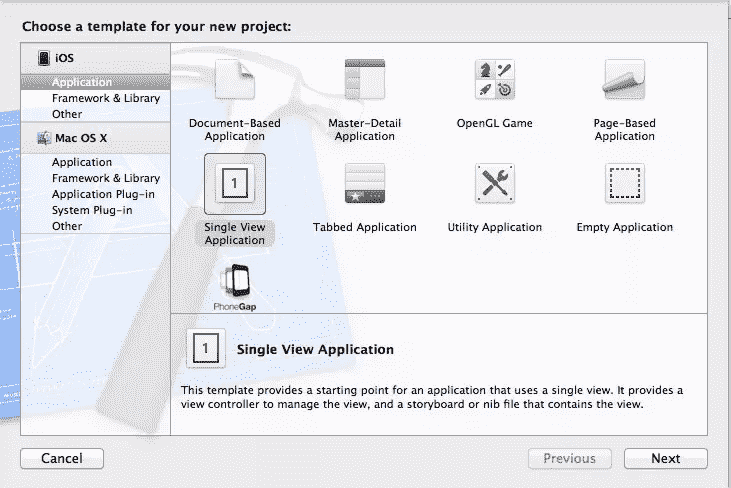
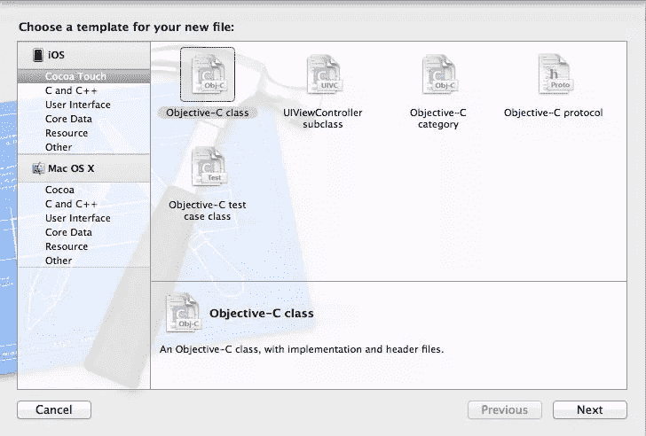

# 用 Objective-C 解析 XML 文件

> 原文：<https://www.sitepoint.com/parsing-xml-files-with-objective-c/>

也许最简单的应用程序是博客阅读器。通常情况下，你不会发现一个只显示提要的本地移动应用程序。通常，这是最好留给网站或基于网络的应用程序的任务。

从基础开始，RSS 提要通常是 XML，它使用特殊的标记来告诉页面正在显示什么类型的信息。例如，不是在文本中显示“作者:Joe Shmoe”，代码看起来更像

```
<author>Joe Shmoe</author>
```

第一种格式对在浏览器中查看 XML 文件的人更友好，另一种格式对搜索引擎和浏览器更友好。与纯文本相比，使用 XML 的另一个优点是可以很容易地将它分解成各个部分，而不仅仅是查看文本来分割文件。我们将会看到" [Books.xml](http://sites.google.com/site/iphonesdktutorials/xml/Books.xml.) "

那么我们如何在应用程序中做到这一点呢？让我们启动 XCode 并开始工作。首先，让我们创建一个新项目，我命名为我的 RSSFeed 注意，我在 Mac OSX 狮子上运行 XCode 4.2，这是最新版本。因此，对您来说，它可能看起来略有不同–当设置项目时，选择“单视图应用程序”作为项目类型，并确保没有选中自动引用计数(ARC)。这将为我们设置一个视图控制器、一个应用程序代理和一个 nib 文件。Nib 文件是应用程序可视化的一面。

[](https://www.sitepoint.com/wp-content/uploads/2012/01/newproject.jpg)

我们需要创建一个文件来保存我们正在查看的当前项目的信息，在本例中是一本书。所以我们需要创建一个 NSObject 的新子类。为此，请转到文件->新建->新建文件。在 iOS 下选择 cocoa touch 部分，然后选择 Objective-C class。

[](https://www.sitepoint.com/wp-content/uploads/2012/01/addclass.jpg)

我给我的书命名。基于 XML 文件，我们需要存储四项内容:作者、标题、摘要和图书索引。作者、标题和摘要都是字符串，而图书索引是整数。

这是一个非常简单的对象，只包含存储数据的变量，在 dealloc 函数之外不需要任何方法。就像在任何其他应用程序中一样，我们需要在头文件中创建变量，并为它们创建属性。然后在实现文件中，我们需要合成那些变量，并在 dealloc 函数中释放它们。这是它们应该有的样子。

```
// Book.h
#import <Foundation/Foundation.h>

@interface Book : NSObject {
    NSInteger bookID;
    NSString *author;
    NSString *title;
    NSString *summary;
}

@property (nonatomic, readwrite) NSInteger bookID;
@property (nonatomic, retain) NSString *author;
@property (nonatomic, retain) NSString *title;
@property (nonatomic, retain) NSString *summary;

@end
```

```
// Book.m
#import "Book.h"

@implementation Book

@synthesize author, title, summary, bookID;

- (void) dealloc
{
    [author release];
    [summary release];
    [title release];
    [super dealloc];
}

@end
```

现在我们已经设置好了，让我们创建解析器文件。我们需要通过同样的过程来创建一个新的基于 Objective-C 的类，称之为 rssParser。以下代码应添加到 rssParser.h 文件中:

```
#import <UIKit/UIKit.h>

@class Book, AppDelegate;

@interface rssParser : NSObject <NSXMLParserDelegate>{

    Book *book;
    AppDelegate *appdelegate;

    NSMutableString *curElem;

}

@property (nonatomic, retain) Book *book;
@property (nonatomic, retain) AppDelegate *appdelegate;
@property (nonatomic, retain) NSMutableString *curElem;

- (rssParser*) initXMLParser;

@end
```

正如您所看到的，这个文件使用了 UIKit 框架。在它下面是所谓的包装类。当您使用包装类时，您不仅允许您的类访问方法，还允许访问这些类的变量，在本例中是 Book 和 AppDelegate。为了访问这些变量和方法，我们需要创建这些类的实例。那是什么书*书；AppDelegate * appdelegate 完成。然后我们创建一个字符串来保存当前元素。就像之前一样，我们需要把属性相加，然后综合变量。

我知道现在这有点枯燥，但这是让一切正常工作的基本设置。您还将看到 initXMLParser 函数的方法声明，我们将在接下来讨论这个函数。现在我们必须连接 rssParser 类的实现文件中的各个部分。将下面的头添加到 rssParser.m 的顶部，将文件连接在一起:AppDelegate.h 和 Book.h，还记得我们声明的 initXMLParser 函数吗？这是组成这个函数的代码。

我相信您能够看出来，这个方法初始化了运行解析器所需的所有部分。首先初始化解析器本身，然后初始化 AppDelegate。让我们跳到 AppDelegate.h 和 AppDelegate.m 文件，在更好地了解这里发生了什么之前，再插入一点代码。从 AppDelegate.h 开始，添加以下代码:

```
- (rssParser *) initXMLParser
{
    [super init];

    appdelegate = (AppDelegate *)[[UIApplication sharedApplication] delegate];

    return self;
}
```

这不应该与文件最初创建时有太大的不同。实际上，添加到文件中的唯一几行代码是一个名为 books 的 NSMutableArray 的创建和属性。下面是不需要重新创建整个文件，只需要做三件事。

*   我们需要添加一个对 rssParser.h 文件的引用，以便能够访问它。
*   我们需要整合我们的图书阵列
*   将点点滴滴串联起来，让一切运转起来。

将以下内容添加到应用程序的 didFinishLaunchingWithOptions 函数中，紧接在该函数的第一行代码之后。

```
NSURL *url = [[NSURL alloc] initWithString:@"http://sites.google.com/site/iphonesdktutorials/xml/Books.xml"];
NSXMLParser *xmlparser = [[NSXMLParser alloc] initWithContentsOfURL:url];

rssParser *parser = [[rssParser alloc] initXMLParser];

[xmlparser setDelegate:parser];

BOOL success = [xmlparser parse];

if(success){
	NSLog(@"No Errors");
}
else{
	NSLog(@"Error Error Error!!!");
}
```

是时候解开密码了。任何时候你在 Objective-C 中处理一个文件，你都必须引用一个 NSUrl 数据类型的变量。由于我们使用的文件不包含在应用程序中，我们可以使用字符串初始化该 URL。现在我们需要创建一个解析器，但是注意:我们还没有使用 rssParser 类。Objective C 有一个名为 NSXMLParser 的内置 XML 解析类。我们能够使用我们创建的 URL 将文件传递给解析器，最终由应用程序进行处理。

为了更进一步，我们需要使用我们之前创建的 initXMLParser 函数初始化 rssParser 类。此外，还记得在 rssParser.h 中，我们必须将其声明为 XMLParserDelegate，这是我们将它应用于 XML 解析器的地方。

委托的目的是覆盖基本功能，为解析器提供自定义处理，但我们将在几分钟后深入讨论这一点。这里的最后几行代码检查解析是否成功，并在 XCode 的日志中添加一条消息作为证明。注意，我们使用 xmlparser 变量来调用解析函数。通常这是由基本功能运行的，但我们想定制它。所以现在我们需要跳回 rssParser.m 并添加函数来解析信息。该委托将重写来自 XMLParser 类的三个方法:didStartElement、foundCharacters 和 didEndElement。

```
-(void) parser:(NSXMLParser *)parser didStartElement:(NSString *)elementName namespaceURI:(NSString *)namespaceURI qualifiedName:(NSString *)qualifiedName attributes:(NSDictionary *)attributeDict
{
    if([elementName isEqualToString:@"Books"]) {
        //Initialize the array.
        appdelegate.books = [[NSMutableArray alloc] init];
    }
    else if([elementName isEqualToString:@"Book"]) {

        //Initialize the book.
        book = [[Book alloc] init];

        //Extract the attribute here.
        book.bookID = [[attributeDict objectForKey:@"id"] integerValue];

        NSLog(@"Reading id value :%i", book.bookID);
    }

    NSLog(@"Processing Element: %@", elementName);
}
```

这个函数处理当找到一个元素时做什么。在我们引用的 XML 文件中，“Books”是提要包装器的名称。因此，如果这是已经找到的元素，那么它就是文件的开始，所以我们初始化我们在 AppDelegate 中创建的 books 数组。“Book”(非复数)是在文件中声明一个单独的项。现在我们需要在 Book 对象中本地存储数据。还要注意，这个过程在 XCode 的日志文件中记录解析过程的开始。现在我们继续讨论 foundCharacters 方法。

```
- (void)parser:(NSXMLParser *)parser foundCharacters:(NSString *)string {

    if(!curElem)
        curElem = [[NSMutableString alloc] initWithString:string];
    else
        [curElem appendString:string];

    NSLog(@"Processing Value: %@", curElem);

}
```

这个函数只是用来在处理元素时存储元素的值，并将它们写入日志。对于元素的结尾:

```
- (void)parser:(NSXMLParser *)parser didEndElement:(NSString *)elementName
  namespaceURI:(NSString *)namespaceURI qualifiedName:(NSString *)qName {

    if([elementName isEqualToString:@"Books"])
        return;

    if([elementName isEqualToString:@"Book"]) {
        [appdelegate.books addObject:book];

        [book release];
        book = nil;
    }
    else
        [book setValue:curElem forKey:elementName];

    [curElem release];
    curElem = nil;
}
```

这个函数做了几件事。首先，它再次检查包装元素。这一次，如果找到了，就结束解析过程。如果解析器再次找到 book 元素，它将获取在该元素中找到的所有信息，并将其添加到 books 数组中，然后清除 curElem 中存储的值，供下一个元素使用。让我们从应用程序进程的角度来重新定义这个应用程序的功能。首先，当应用程序加载时，我们声明 XML 文件的位置，创建 XML 解析器的实例，并将 XML 文件推入解析器。

我们想要覆盖普通的解析功能，所以我们将委托设置为我们创建的 rssParser 委托。在这个委托中，我们覆盖了处理 XML 文件的三个函数:didStartElement、foundCharacters 和 didEndElement。在这些函数中，我们引用我们的 Book 对象来临时存储找到的任何信息，将流程写入输出日志，当元素被完全解析后，将数据集合添加到一个数组中，供以后使用。

继续运行您的代码，并在 XCode 中打开输出日志，看看您的代码是否成功运行。在这些日志的末尾，您应该会看到粗体文本的“No Error ”,您还会看到已经从 xml 文件处理的所有元素。从这一点来看，有许多方法可以显示您的 XML 提要，所以让您的创造力尽情发挥吧！

## 分享这篇文章