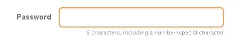
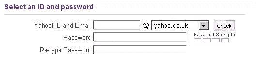
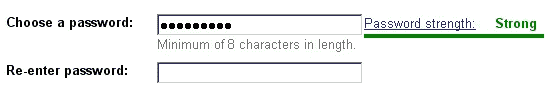
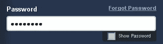
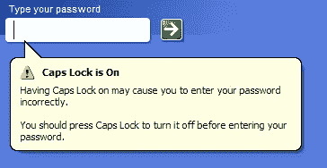

# 要避免的密码可用性风险

> 原文：<https://www.sitepoint.com/password-usability-perils-to-avoid/>

密码的可用性很简单，对吗？要求您的用户设置他们的密码；然后让他们在需要登录时输入密码。有什么不对的？实际上，相当多。我一直很惊讶有多少网站和应用程序用糟糕的密码可用性搬起石头砸自己的脚，例如:

*   抱歉，您的密码必须至少有八个字符长。
*   抱歉，您必须每半年更改一次密码。
*   抱歉，您的密码必须包含字母、数字和特殊字符的组合。

在帮助用户设置和输入密码时，要考虑的事情多得惊人，所以请继续阅读，找出避免最常见的密码可用性风险的方法。

## 设置密码的危险

通常，您会要求用户在注册过程中设置密码，或者在购买后进行交易(例如，创建帐户)。以下是密码设置中最常见的一些密码使用风险。

### 不要限制太多

密码可用性的黄金法则之一是避免限制过多。具有讽刺意味的是，过分的限制(例如要求一个由字母、数字、特殊字符和不同大小写组合而成的长密码)，往往会使您的站点不太安全，因为用户被迫写下他们的密码以便记住它们。下次你在办公室的时候，看看有多少包含密码的便利贴贴在显示器上！

当然，密码限制最终取决于网站或应用程序的安全性。例如，如果站点需要非常安全，三个字符的密码是不够的。不过，你为用户提供的灵活性越大，他们就越有可能设置一个他们能真正记住的密码。

### 让用户知道规则

当你试图为一个网站设置密码，但由于你不知道的规则，密码被视为无效，你难道不喜欢吗？更糟糕的是，它又被认为是不允许的，而且没有说明为什么会这样！不要让用户蒙在鼓里——让他们知道进入时的密码规则。概述最小密码长度，以及是否需要任何数字或特殊字符。重要的是，这些信息不应该隐藏在单独的帮助页面中；相反，应该把它放在密码输入字段的下面或旁边，如下面 MailChimp 的例子所示。

### 要求用户重新键入他们的密码

一个简单的方法，但是很多网站和应用程序都做不到。当要求用户设置密码时，要求他们立即重新输入密码是很重要的。这确保了他们输入的密码是他们认为已经输入的密码。重新登录应该在初始登录后立即进行，如下面的 Yahoo 注册示例所示。

### 显示密码强度

鼓励用户通过转发他们刚刚输入的密码的强度来设置安全的密码，而不是限制性的密码策略。例如，包含字母、数字和大小写的长密码可能显示为强密码，而仅包含字母的短密码可能表示弱密码。用户会本能地尝试使用更强的密码，尤其是如果你使用正反馈(比如显示一个小笑脸，或者使用红黄绿颜色代码)。很多大网站现在都在这么做，比如雅虎、易贝和谷歌；下面是谷歌账户注册过程的一个例子。

### 提供选择好密码的提示

大多数人都知道使用他们的名字或他们居住的街道作为密码是一个坏主意，但是为选择一个好的密码提供一些提示和指导也无妨。查看创建密码的[易贝帮助页面](http://pages.ebay.com/help/new/contextual/create_password.html)了解一些想法。

## 输入密码的危险

好了，您的用户已经设置了密码，现在您希望他们每次登录网站时都输入密码。听起来很简单，但是仍然有一些可用性风险需要你考虑。

### 允许用户解除密码屏蔽

绝大多数网站在登录时会屏蔽密码，因此密码永远不会显示在屏幕上。当然，这可以防止你旁边的爱管闲事的人窥探你的密码，但是如果登录失败，而你想检查你输入的密码是否正确，该怎么办呢？这就是为什么让用户解开密码是一个好主意；MailChimp 已经开始这样做了，如下例所示。

SitePoint 博客作者詹姆斯·爱德华兹发布了一篇关于如何做到这一点的有用文章:[更好的密码#2:“显示密码”](https://www.sitepoint.com/better-passwords-2-show-password/)。当然，默认情况下，密码应该总是被屏蔽，由用户决定透露密码是否安全。

### 当大写锁定打开时警告用户

你试图输入你的密码，却被拒绝，因为`Caps Lock`键是开着的——哎呀！当按下`Caps Lock`键时，如果用户试图输入密码，警告用户是有意义的，例如在这个来自微软 Vista 的例子中(参见——他们做对了一些事情！).

关于如何在你的网站上做到这一点的细节，请通读詹姆斯·爱德华兹的帖子，[更好的密码#3:大写锁定警告](https://www.sitepoint.com/better-passwords-3-caps-lock-warnings/)。

### 如果用户的帐户即将被锁定，则向用户发出警告

作为安全策略的一部分，您可以在一定次数的尝试失败后锁定帐户；这里的目的是阻止另一个人尝试不同的密码来访问一个帐户，尽管它经常发生在所述帐户的用户身上。记住这一点，在锁定用户帐户之前，最好警告他们下次登录尝试失败将会导致这种情况。因此，如果你要在三次登录失败后锁定一个帐户，你应该在用户第二次尝试后提醒他们。

## 忘记密码的危险

人们会忘记他们的密码。你对此无能为力，但是应该有一个途径让那些忘记密码的用户找回密码。如何最好地处理这种情况？

### 允许用户重置自己的密码

让用户自己重置密码是个好主意。这样，你就不需要干预了。通常，这是通过向注册的电子邮件帐户发送密码重置电子邮件来完成的。用户点击电子邮件中的链接，被定向到您的网站，并被要求设置新密码。

### 避免通过电子邮件发送密码

通过电子邮件向用户发送密码不是个好主意。电子邮件一般不太安全；它们可以被拦截——你不希望一些不择手段的人设法获取了你的用户的电子邮件，同时也获取了他们的密码。不要通过电子邮件发送密码，而是发送一个链接到设置新密码的页面，并确保该链接在合理的短时间内过期。

### 小心使用密码提示

允许用户包含一个提示来帮助他们回忆密码，这通常看起来是一个好主意。然而，这可能有点危险:用户可能简单地输入他们的密码(或它的派生密码)作为提示，或者使用一个让猜测他们的密码变得太容易的提示。如果您确实想使用密码提示，请考虑在显示之前要求用户提供一些附加信息，比如他们的邮政编码或出生日期。

### 允许用户编写自己的安全问题

如果出于某种原因，您无法发送密码重置电子邮件，使用安全问题可能是一个不错的选择。如果您确实使用此方法，请允许用户编写自己的问题。您的潜在安全问题列表可能与一些用户无关(例如，不是每个人都有常旅客号码)，用户更可能记得他们自己创建的问题的答案。提供好问题的例子(比如“你的第一只宠物叫什么名字？”)，并忽略答案的情况:你不希望一个用户因为输入了“spot”而不是“Spot”而得到错误的答案！

## 摘要

在设计您的密码认证系统时，请记住这些简单的准则，您的用户会感谢您的！

## 分享这篇文章