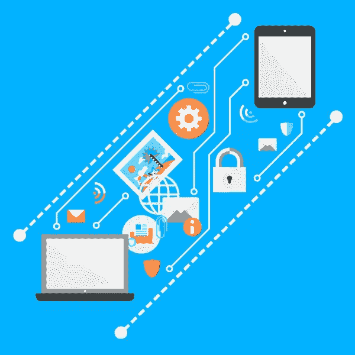

# 为什么无密码身份验证有效

> 原文：<https://www.sitepoint.com/passwordless-authentication-works/>

2014 年 12 月，我发表了[你会实现无密码登录吗？](https://www.sitepoint.com/implement-passwordless-login/)它对诸如[贾斯汀·巴思罗普的*密码过时*和](https://medium.com/@ninjudd/passwords-are-obsolete-9ed56d483eb#.83j6usoyi)[本·布朗的*是时候无密码登录了吗？*](http://notes.xoxco.com/post/27999787765/is-it-time-for-password-less-login)node . js 的[password 项目启发了其他人，包括](https://passwordless.net/) [PHP](https://github.com/stathisg/password-less-login) 和 [Ruby](https://github.com/alsmola/nopassword) 的选项。

我提到了考虑对客户项目进行[无密码](https://www.sitepoint.com/what-is-passwordless-authentication/)认证。我很高兴地说，它已经运行了几个月，是一个启示。稍后会详细介绍，但首先，让我们回顾一下…

## 什么是无密码认证？

我们使用的认证方法与互联网诞生之初设计的方法相同。不幸的是，密码越来越容易被破解:

*   人们很少创建强密码。[调查报告称](https://www.skyhighnetworks.com/cloud-security-blog/you-wont-believe-the-20-most-popular-cloud-service-passwords/)十分之一的账户使用前二十个最流行的密码。“123456”被超过 4%的账户使用；“密码”仍然是第二个最常用的。
*   人们在多个网站上使用同一个可怕的密码。如果你碰巧破解了某人的脸书登录，你可能就能进入他们的贝宝账户。您的单个密码只与您使用的最弱系统的安全性一样好。
*   企业黑客越来越普遍，并吸引了主流媒体的兴趣。这是一条让你扬名立万、实施报复或沉溺于敲诈勒索的捷径。很少有公司为网络恐怖主义行为做好准备，尽管通常声称有*“持续的复杂攻击”*，但许多违规行为都是由糟糕的开发技术导致的简单 SQL 注入。
*   从编码的角度来看，认证是乏味的，并且会出错。检查凭证是你的问题的开始:你需要确保安全没有漏洞，使用强(慢)算法散列字符串，允许用户重置忘记的密码，并回答困惑的用户打来的支持电话，这些用户似乎无法记住或正确键入一个短字符串。
*   生物识别或 OAuth 等替代解决方案依赖于硬件或合适的社交媒体账户。很少有网站很好地实现了这一点，对于一些用户来说，仍然需要恢复到电子邮件/密码方法。

无密码身份验证的前提是，当大多数用户拥有安全的个人消息帐户(如电子邮件和 SMS)时，密码是不必要的。应用程序可以利用这些系统:

1.  为了登录，用户访问一个站点并输入一个 ID，如电子邮件地址。
2.  他们会收到一条带有链接的消息；他们点击它并登录。

换句话说，应用程序会创建一个随机的一次性密码，并在用户需要访问时悄悄告诉他们。这与重设密码的过程类似——许多用户每次登录时都会这么做！电子邮件是一个显而易见的选择，但任何其他消息服务都可以使用，例如 SMS、Slack、Skype、即时消息甚至 Twitter direct messages。如果你不想依赖单一系统，可以提供多种选择。

确保只有一个人可以使用登录链接，这在幕后要复杂一些。一般流程如下:

1.  输入后，服务器会验证该电子邮件地址的帐户是否存在。
2.  服务器创建两个令牌，例如 24 个字符的十六进制 GUIDs，并将这两个令牌与这次登录尝试相关联。第一个令牌被发送回登录设备，通常作为浏览器 cookie。第二个令牌被编码在通过电子邮件发送给用户的链接中。
3.  当单击该链接时，服务器将接收这两个令牌，并针对单次登录尝试验证它们。或者，它可以进一步检查，以确保链接在几分钟内被单击，并且 IP 地址和浏览器用户代理字符串没有更改。
4.  如果一切都通过验证，就会启动一个真正的会话，用户就会登录。如果有任何失败，所有相关的令牌都将失效；不可能再用它们了。

无密码身份验证的优势:

*   这对用户来说相当简单。无需创建或存储密码。除了访问您的消息系统，您不需要社交媒体帐户或第三方软件。没有有效证件是不可能注册的。
*   这样更安全。没有存储密码，也没有黑客或猜测。即使有人截获了一条消息，他们也只有两个令牌中的一个，无法登录。
*   性价比很高。需要开发和部署的代码更少。登录代码主要由另一个具有健壮安全性的服务处理。您的支持团队从无休止的密码问题中解脱出来。

## 无密码认证可以用在哪里？

登录需要更长的时间，但是使用密码管理器也一样！无密码认证可以在会话超时时间相当长的应用程序上提供，或者在用户只需要偶尔访问的应用程序上提供。购物网站、社交网络、论坛、票务和内容管理系统都是很好的用例。

在消息传递系统上使用无密码身份验证会很奇怪，因为您需要另一个人登录！你也不希望你的银行仅仅依靠 AOL 来保证他们的安全，尽管二级识别过程可以补充它。

如果你正在创建一个新的应用程序，可以考虑无密码。然而，用许多当前有密码的用户来更新现有的应用程序会有更多的问题。我建议并行运行无密码认证，而不是一夜之间切换到新的登录过程。提供它作为一种选择——特别是对那些重设密码的用户——并在几个月后评估其接受程度，以确定它是否可行。

## 真实世界测试

我在一个新应用程序上实现了无密码身份验证，该应用程序由一个客户为数百名内部人员和外部客户使用。大约一半的用户拥有良好的 IT 技能并每天访问，因此他们的会话很少过期。另一半大多是每月登录一次或两次的经理——许多人忘记或输错了密码。

最大的问题:*客户必须被说服*。

“无密码”听起来不安全，很少有人会在其他地方看到它的使用。我很幸运:客户有一个懂技术的项目经理，他理解这个概念。即便如此，我还是同意在出现任何问题时添加密码。

从那以后，一切都一帆风顺。由于技术原因，我不得不集成自己的实现，而不是依赖第三方库。这花了不到一天的时间，而且不需要我们通常开发和测试的常规密码管理、散列和重置。

最大的收获:**用户了解无密码认证**。过程很简单，但是最好在各个阶段都提供简单的说明。例如:

*   登录链接已通过电子邮件发送给您。如果垃圾邮件没有到达，请检查您的垃圾邮件文件夹。
*   *请点击此链接登录…您有 10 分钟时间在同一浏览器中打开此链接。*

没有人感到困惑。没有人挣扎。没有人称赞这个系统，但也没有人抱怨；人们接受了这个过程，它没有妨碍他们。与密码相关的登录问题从每周三、四次减少到零。

## 结论

我不能说无密码认证在任何地方都有效，但是这种体验是非常积极的。我是个皈依者。从现在开始我所有的申请都不用密码了。有些客户可能会不高兴——但我会在他们的登录表单上弹出一个虚拟密码框，然后忽略它！

有没有实现无密码认证？这是一次好的还是坏的经历？

## 分享这篇文章