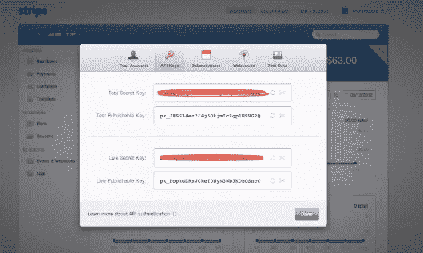

# 带条纹的铁轨支付

> 原文：<https://www.sitepoint.com/payments-in-rails-with-stripe/>

## 烦恼

过去处理付款是一件非常痛苦的事情。光看 PayPal 的 API 介绍就让我想尖叫。重定向、登录、结账；我只想处理一笔付款！

条纹是一个非常需要的新鲜空气呼吸到这个混乱，它不短的真棒。该 API 易于使用，有很好的文档记录，价格也很明确。管理界面也非常有用。

因此，让我们将 Stripe 集成到您的 Rails 应用程序中。

## 装置

首先，你需要获得一个 Stripe 账号和一个 API 的副本。从[报名](https://manage.stripe.com/register)开始。你甚至不需要提供信用卡的详细信息；你将进入一个“开发者模式”，这样我们所做的任何测试都没有任何意义。

然后，安装条纹宝石:

```
gem install stripe
```

## 前端

前端代码是我们将首先介绍的内容；在这个领域，一些错误可能会让你付出很大代价(例如，由于没有检查错误而导致的免费帐户)。

有些东西你需要从用户那里得到:

*   信用卡号码
*   信用卡 VC(安全代码)
*   信用卡月份和年份

而且，你可能也想得到一个电子邮件地址。

**不要为此创建模型。**

用户信用卡数据永远不会影响到您的数据库——Stripe 将更加安全。

因此，下面是一个简单表单的标记(应该放在视图中):

```
<div class=".payment-errors"></div>

<form action="REPLACE WITH AN ACTUAL URL HELPER" method="post" id="stripe-form">
    <div class="formset">
        <label>Card Number</label>
        <input type="text" size="20" autocomplete="off" class="credit-number" />
    </div>

    <div class="formset">
        <label>Security Code/CVC</label>
        <input type="text" size="4" autocomplete="off" class="credit-scurity" />
    </div>

    <div class="formset">
        <label>Expiration (MM/YYYY)</label>
        <input type="text" size="2" class="card-expiry-month"/>
        <span> / </span>
        <input type="text" size="4" class="card-expiry-year"/>
    </div>

    <button type="submit" class="submit">Submit Payment</button>
</form>
```

确保用对你的应用程序有意义的路线来替换动作。

注意一些事情。首先，信用卡号和安全码输入字段的自动完成功能被关闭；您的一些用户可能正在使用公共计算机。第二，那里的很多 div 只是为了设计样式；它们其实没多大关系。

接下来，我们需要 Stripe 的 Javascript API:

```
<script type="text/javascript" src="https://js.stripe.com/v1/"></script>
```

这也许应该放在你的布局中，这样它就不会被附加到 body 标签上，它将在特定控制器的所有操作中可用。

接下来，您将需要您的可发布密钥。现在，在我们继续之前，最好对公钥加密有一个非常全面的了解，这样你就不会只是盲目地粘贴代码。

当问题出现时，理解事物内部的工作原理会更容易解决问题。

## 旁门左道——密码学

公钥加密的工作原理是有两个密钥(密钥通常是字母数字串)——一个是公钥(用于加密)，一个是私钥(用于解密)。

所以，如果我想给你发消息，我会先找到你的公钥(因为它是 *public* )，然后用那个密钥加密我的消息。当你收到信息时，你可以用你的私钥解密。

那有什么用？嗯，如果我的信息在途中被忍者截获，他们就无法理解了。他们没有私钥！

这在互联网上尤其重要，因为基本上所有的数据包都可以被拦截，这意味着如果它们包含重要的信息，它们最好被加密！

请注意，我实际上并没有提到有人如何使用字母数字字符串(即密钥)来加密或解密消息；有不同的算法，如果你感兴趣，看看 RSA(涉及一些数学)。

这非常简单，但是，这是总体思路，也是 Stripe(和许多其他服务)所使用的。

## java 描述语言

要获得您的公钥，登录，然后点击“您的帐户”，然后“帐户设置”，最后是“API 密钥”标签



所以，现在，您需要一点 Javascript 来告诉 Stripe 您的密钥:

```
Stripe.setPublishableKey('PUBLISHABLE KEY');
```

当然，这应该与您的 Javascript 文件一起使用。

然后，我们需要一点 Javascript 来从 Stripe 获得一个*支付令牌*:

```
function stripeResponseHandler(status, response) {

    if (response.error) {
        $(".payment-errors").text(response.error.message);
    } 
    else {
        var form$ = $("#stripe-form");
        var token = response['id'];
        form$.append("<input type='hidden' name='stripeToken' value='" + token + "'/>");
        form$.get(0).submit();
    }
}

$(document).ready(function() {
  $("#stripe-form").submit(function(event) {
    $('.submit').attr("disabled", "disabled");

    Stripe.createToken({
        number: $('.credit-number').val(),
        cvc: $('.credit-security').val(),
        exp_month: $('.card-expiry-month').val(),
        exp_year: $('.card-expiry-year').val()
    }, stripeResponseHandler);

    // prevent the form from submitting with the default action
    return false;
  });
});
```

我正在使用 jQuery，但是，如果您不想这样做(出于某种奇怪的原因)，您可以很容易地替换 jQuery 特定的代码(它主要是 document.getElementById)。

这有点复杂(尤其是如果你不太熟悉 Javascript 的话)，但是，从整体来看，这是很容易理解的。基本上，我们将一个事件附加到 Stripe 表单上，这样当用户点击“提交”按钮时，一个匿名函数(即一个没有名字的函数)就会被触发。然后，我们禁用提交按钮，这样多次点击不会导致对服务器的多次请求(即向用户收费两次)。

使用 Stripe API，我们创建一个令牌。这是(稍微)棘手的部分。Stripe 不只是返回令牌；我们给出了一个名为 stripeResponseHandler 的函数，一旦得到响应就调用它。

### 旁支–响应处理程序

如果您不是 Javascript 开发人员，您可能不太熟悉响应处理程序。

基本上，不是让你的代码等待 Stripe 与它的服务器通信并返回一个令牌，而是让你的代码继续前进，当 Stripe 准备好了，就调用一个函数。

所以，现在，看看 stripeResponseHandler。这个函数非常简单——如果有错误，报告它们(通过给它们添加一个带有 payment-errors 类的 div，这是我们在表单标记中定义的),或者向服务器发出一个请求，用 stripe 令牌作为隐藏输入。

## 服务器端

好吧！所以，现在，我们准备向服务器移动，在服务器上，这个令牌将用于实际向用户收费。

现在，注意一些事情。首先，我们仍然没有向用户收取一分钱——我们只有代币。其次，信用卡信息甚至从未接触过服务器，更不用说数据库了。它被带到磁条，然后给你一个令牌，你可以充电。太棒了，对吧？

这一次，您将需要您的私钥，它可以从您获得公钥的同一个地方获得(帐户设置-> API 密钥选项卡)。

```
Stripe.api_key = "YOUR_API_KEY"

token = params[:stripeToken]

charge = Stripe::Charge.create(
  :amount => 1000, # amount in cents, again
  :currency => "usd",
  :card => token,
  :description => "something about your customer"
)
```

这应该放在你的一个控制器类中，在一个动作方法中。

代码极其干净，易于理解；我们正在设置密钥(它应该保持私密和安全！)，获取令牌(我们在 Javascript 中将其作为隐藏输入插入)，然后创建费用。

你的 API 密匙(如果你在多个动作中处理支付的话)也可以放在初始化文件中。

## 每月费用

现在，订阅怎么样？重复支付非常普遍，许多服务让重复支付变得不必要的困难。

首先，为了让订阅工作，你有一个设置和计划。有两种方法可以做到这一点，最简单的方法是使用仪表板，另一种方法是使用一些代码。

要创建一个新的计划，进入仪表板，然后进入计划，在那里，有一个漂亮的小“向导”会带你通过这个过程。

事实上，您甚至可以为您的用户指定一个试用期，因此，如果您希望他们有 15 天的空闲时间，您只需在仪表板上设置它-不需要任何代码！

所以，也许你称这个计划为“中等”(记住这个名字，它实际上很重要)。

现在，我们可以使用条带*客户*抽象:

感谢您的阅读，并祝愿您的应用为您带来成功，为我们所有人带来幸福。

## 分享这篇文章