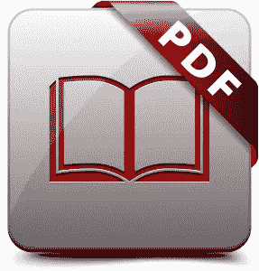
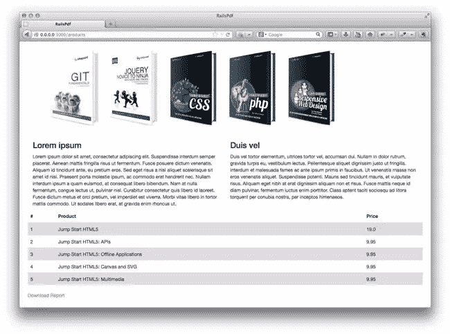

# Rails 中的 PDF 生成

> 原文：<https://www.sitepoint.com/pdf-generation-rails/>



下载 pdf 格式数据的能力是您在构建 web 应用程序时会遇到的常见需求。在 Rails 中有不同的方法可以实现这一点。我们将会看到生成 pdf 文档的两种主要方式:使用 Ruby 使用 DSL 来定义和样式化文档，或者使用一个库将 HTML 转换成 PDF。

今天我们将重点介绍三种流行的宝石:

*   [大虾](https://github.com/prawnpdf/prawn)(使用 DSL 方式)
*   [PDFKit](https://github.com/pdfkit/pdfkit) (使用发电机)
*   [Wicked PDF](https://github.com/mileszs/wicked_pdf) (也使用生成器)。

## HTML 转 PDF 还是 Ruby 生成？

这个问题的答案通常取决于偏好和项目需求。HTML 到 PDF 可以更快，尤其是如果您已经有一个视图显示您想要在 PDF 中显示的内容。在这种情况下，您不必编写那么多代码来生成 PDF 文件。但是，这种方法会增加控制文档布局的难度，尤其是在处理多页文档时。内容往往会被切断，并在页面之间分割。的确，通过一些 CSS 样式，您可以对分页符进行一些控制。然而，对于跨越几页并包含可变长度内容、页眉和页脚的更复杂的 PDF 文档，将很难控制每页的呈现方式。在这些情况下，使用对虾可能更有意义。

使用像大虾这样的库，您必须使用大虾的 DSL 自己完成所有的内容样式和定位。这样做的好处是可以更好地控制内容的显示方式和分页的位置。

我们将为下面显示的网页生成一个 PDF 文件，其中包含一些静态文本、图像和一些数据库记录的表格。



## 对虾

要使用大虾，在你的 gem 文件中包含宝石并运行`bundle install`

```
gem 'prawn'
```

在`config/initializers/mime_types.rb`文件中注册 PDF mime 类型。

```
Mime::Type.register "application/pdf", :pdf
```

现在我们需要设置控制器动作来响应 PDF 格式的请求。

对于我的产品控制器，我有一个`index`动作，我将修改它，如下所示。

```
class ProductsController < ApplicationController
  def index
    @products = Product.all

    respond_to do |format|
      format.html
      format.pdf do
        pdf = Prawn::Document.new
        send_data pdf.render, filename: 'report.pdf', type: 'application/pdf'
      end
    end

  end
end
```

当`.pdf`被附加到特定 url 的末尾时，上面将生成一个没有内容的 PDF 文件。我的情况是`http://localhost:3000/products.pdf`。

为了将 pdf 生成代码从控制器中分离出来，我创建了一个`app/pdfs`目录，并在文件`app/pdfs/report_pdf.rb`中添加了一个新类。

我更改了控制器代码以使用新的类。

```
class ProductsController < ApplicationController
  def index
    @products = Product.all

    respond_to do |format|
      format.html
      format.pdf do
        pdf = ReportPdf.new(@products)
        send_data pdf.render, filename: 'report.pdf', type: 'application/pdf'
      end
    end

  end
end
```

下面的代码显示了如何生成上面显示的网页的 PDF。我对它进行了注释，以展示我正在做的事情。

```
class ReportPdf < Prawn::Document
  def initialize(products)
    super()
    @products = products
    header
    text_content
    table_content
  end

  def header
    #This inserts an image in the pdf file and sets the size of the image
    image "#{Rails.root}/app/asseimg/header.png", width: 530, height: 150
  end

  def text_content
    # The cursor for inserting content starts on the top left of the page. Here we move it down a little to create more space between the text and the image inserted above
    y_position = cursor - 50

    # The bounding_box takes the x and y coordinates for positioning its content and some options to style it
    bounding_box([0, y_position], :width => 270, :height => 300) do
      text "Lorem ipsum", size: 15, style: :bold
      text "Lorem ipsum dolor sit amet, consectetur adipiscing elit. Suspendisse interdum semper placerat. Aenean mattis fringilla risus ut fermentum. Fusce posuere dictum venenatis. Aliquam id tincidunt ante, eu pretium eros. Sed eget risus a nisl aliquet scelerisque sit amet id nisi. Praesent porta molestie ipsum, ac commodo erat hendrerit nec. Nullam interdum ipsum a quam euismod, at consequat libero bibendum. Nam at nulla fermentum, congue lectus ut, pulvinar nisl. Curabitur consectetur quis libero id laoreet. Fusce dictum metus et orci pretium, vel imperdiet est viverra. Morbi vitae libero in tortor mattis commodo. Ut sodales libero erat, at gravida enim rhoncus ut."
    end

    bounding_box([300, y_position], :width => 270, :height => 300) do
      text "Duis vel", size: 15, style: :bold
      text "Duis vel tortor elementum, ultrices tortor vel, accumsan dui. Nullam in dolor rutrum, gravida turpis eu, vestibulum lectus. Pellentesque aliquet dignissim justo ut fringilla. Interdum et malesuada fames ac ante ipsum primis in faucibus. Ut venenatis massa non eros venenatis aliquet. Suspendisse potenti. Mauris sed tincidunt mauris, et vulputate risus. Aliquam eget nibh at erat dignissim aliquam non et risus. Fusce mattis neque id diam pulvinar, fermentum luctus enim porttitor. Class aptent taciti sociosqu ad litora torquent per conubia nostra, per inceptos himenaeos."
    end

  end

  def table_content
    # This makes a call to product_rows and gets back an array of data that will populate the columns and rows of a table
    # I then included some styling to include a header and make its text bold. I made the row background colors alternate between grey and white
    # Then I set the table column widths
    table product_rows do
      row(0).font_style = :bold
      self.header = true
      self.row_colors = ['DDDDDD', 'FFFFFF']
      self.column_widths = [40, 300, 200]
    end
  end

  def product_rows
    [['#', 'Name', 'Price']] +
      @products.map do |product|
      [product.id, product.name, product.price]
    end
  end
end
```

关于可用的 PDF 格式规则的更多信息，请查看对虾[手册](http://prawnpdf.org/manual.pdf)。

## PDFKit

对于 PDFKit，首先在 gem 文件中包含 gem

```
gem 'pdfkit'
```

并运行`bundle install`

您可以通过指向 html 文件或网站来生成 PDF 文档，如下所示。

```
# From https://github.com/pdfkit/pdfkit#usage

# PDFKit.new takes the HTML and any options for wkhtmltopdf
# run `wkhtmltopdf --extended-help` for a full list of options
kit = PDFKit.new(html, :page_size => 'Letter')
kit.stylesheets << '/path/to/css/file'

# Get an inline PDF
pdf = kit.to_pdf

# Save the PDF to a file
file = kit.to_file('/path/to/save/pdf')

# PDFKit.new can optionally accept a URL or a File.
# Stylesheets can not be added when source is provided as a URL of File.
kit = PDFKit.new('http://google.com')
kit = PDFKit.new(File.new('/path/to/html'))

# Add any kind of option through meta tags
PDFKit.new('<html><head><meta name="pdfkit-page_size" content="Letter"')
PDFKit.new('<html><head><meta name="pdfkit-cookie cookie_name1" content="cookie_value1"')
PDFKit.new('<html><head><meta name="pdfkit-cookie cookie_name2" content="cookie_value2"')
```

您还可以使用一个中间件解决方案，允许用户通过在 URL 末尾添加`.pdf`来生成网站上任何页面的 pdf。这就是我们在这里要用的。

要添加中间件，请在`/config/application.rb`文件中包含以下内容(这适用于 Rails 版本 3 和更高版本)。

```
module RailsPdf
  class Application < Rails::Application
      config.middleware.use PDFKit::Middleware
      .
      .
      .
  end
end
```

重启服务器，导航到一个页面，并在 URL 的末尾添加`.pdf`。你会得到一个 PDF 版本的网页。

也可以使用链接下载 PDF 格式的页面。在 haml 中:

```
= link_to 'Download Report', products_path(format: 'pdf')
```

要排除 pdf 文件中的链接，请向标签添加 id 或类名，并在 CSS 中为其设置显示属性。

```
@media print {
  .pdf_exclude {
        display: none;
  }
}
```

### 一些需要注意的事项

#### 我

如果您的系统上没有安装`wkhtmltopdf`,那么您将得到如下所示的类似错误

```
PDFKit::NoExecutableError in ProductsController#index

No wkhtmltopdf executable found at >> Please install wkhtmltopdf - https://github.com/pdfkit/PDFKit/wiki/Installing-WKHTMLTOPDF
```

关于如何安装`wkhtmltopdf`的说明，请查看这个[维基页面](https://github.com/pdfkit/PDFKit/wiki/Installing-WKHTMLTOPDF)。

安装`wkhtmltopdf`二进制文件的另一个选择是通过 gem `wkhtmltopdf-binary`。将它添加到你的 Gemfile 并运行`bundle install`

```
gem 'wkhtmltopdf-binary'
```

#### 二

如果内容在您不希望的地方被截断，例如一个表格被分成两页，您可以在表格呈现之前指定分页符，以便它出现在自己的页面上。

```
@media print {
  .page-break { 
    display: block; 
    page-break-before: always; 
  }
}
```

#### 罗马数字 3

对于你可能正在使用的任何外部文件(图片、样式表、javascript)的相对 URL 都不适用。如果您使用像`stylesheet_link_tag`这样的常规标签并试图生成一个文档，那么`wkhtmltopdf`将在加载资产时挂起。对资产使用绝对路径(文件路径或包含域的 URL)解决了这个问题。

另一个可能的解决方案是使用内嵌样式。例如，代替`stylesheet_link_tag`标签，您可以使用:

```
<style type="text/css">
    <%= Rails.application.assets.find_asset('application.css').to_s.html_safe %>
</style>
```

#### 注入静脉的

对于出现在网页上但你不想在 pdf 文档中显示的任何内容(例如，上面示例中的“下载 PDF”链接)，只需标记它并用 CSS 隐藏它。

```
@media print {
    .hide_in_pdf {
        display:none;
    }
}
```

## 邪恶的 PDF

要使用 Wicked PDF，首先安装 [wkhtmltopdf](https://github.com/pdfkit/pdfkit/wiki/Installing-WKHTMLTOPDF) 。或者，您可以将`wkhtmltopdf-binary` gem 包含在您的 gem 文件中来使用它。

将`wicked_pdf`添加到您的 gem 文件并运行`bundle install`。

```
gem 'wicked_pdf'
```

在`config/initializers/mime_types.rb`中注册 PDF mime 类型

```
Mime::Type.register "application/pdf", :pdf
```

像 PDFKit 一样，Wicked PDF 附带了一个中间件，允许用户通过在 URL 后面添加`.pdf`来获得您站点上任何页面的 PDF 视图。这是通过在`/config/application.rb`文件中添加`config.middleware.use WickedPdf::Middleware`来实现的。我不会在这里使用中间件。相反，我将为 PDF 创建模板和布局文件，并修改我的控制器操作来处理 PDF 格式的请求。

我修改了一下`ProductsController`如图。这里，我指定了 PDF 文件的名称和用来生成它的布局。有关可用选项的更多信息，请查看[自述文件](https://github.com/mileszs/wicked_pdf#advanced-usage-with-all-available-options)。

```
class ProductsController < ApplicationController
  def index
    @products = Product.all
    respond_to do |format|
      format.html
      format.pdf do
        render :pdf => "report", :layout => 'pdf.html.haml'
      end
    end
  end
end
```

下面是布局文件`app/views/layouts/pdf.html.haml`。

```
!!!
%html
  %head
  %title RailsWickedPdf
    = wicked_pdf_stylesheet_link_tag    "application", :media => "all"
    = wicked_pdf_javascript_include_tag "application"
    = csrf_meta_tags
  %body
    = yield
```

以及模板文件`app/views/products/index.pdf.haml`。

```
.container
  .row
    = wicked_pdf_image_tag('header.png')
  .row
    .col-xs-6
      %h3
        Lorem ipsum
      %p
        Lorem ipsum dolor sit amet, consectetur adipiscing elit. Suspendisse interdum semper placerat. Aenean mattis fringilla risus ut fermentum. Fusce posuere dictum venenatis. Aliquam id tincidunt ante, eu pretium eros. Sed eget risus a nisl aliquet scelerisque sit amet id nisi. Praesent porta molestie ipsum, ac commodo erat hendrerit nec. Nullam interdum ipsum a quam euismod, at consequat libero bibendum. Nam at nulla fermentum, congue lectus ut, pulvinar nisl. Curabitur consectetur quis libero id laoreet. Fusce dictum metus et orci pretium, vel imperdiet est viverra. Morbi vitae libero in tortor mattis commodo. Ut sodales libero erat, at gravida enim rhoncus ut.
    .col-xs-6
      %h3
        Duis vel
      %p
        Duis vel tortor elementum, ultrices tortor vel, accumsan dui. Nullam in dolor rutrum, gravida turpis eu, vestibulum lectus. Pellentesque aliquet dignissim justo ut fringilla. Interdum et malesuada fames ac ante ipsum primis in faucibus. Ut venenatis massa non eros venenatis aliquet. Suspendisse potenti. Mauris sed tincidunt mauris, et vulputate risus. Aliquam eget nibh at erat dignissim aliquam non et risus. Fusce mattis neque id diam pulvinar, fermentum luctus enim porttitor. Class aptent taciti sociosqu ad litora torquent per conubia nostra, per inceptos himenaeos.
  .row
    %table.table.table-striped
      %thead
        %th #
        %th Product
        %th Price
      %tbody
        - @products.each do |product|
          %tr
            %td
              = product.id
            %td
              = product.name
            %td
              = product.price
```

你会注意到在上面的两个文件中，我使用了下面的助手。

```
wicked_pdf_stylesheet_link_tag
wicked_pdf_javascript_include_tag
wicked_pdf_image_tag
```

如果使用外部文件，这些是必需的。`wkhtmltopdf`在 Rails 应用程序之外运行，因此您链接到的任何文件都必须包含一个绝对地址。

使用常规的`stylesheet_link_tag`和`javascript_include_tag`标签会导致应用程序在请求 PDF 时挂起。同样，如果使用常规的`img`标签，图像也不会被渲染。

## 结论

我们已经研究了三种不同的 PDF 生成方法。决定使用哪一个取决于多种因素，包括您偏好的语言(HTML 或 DSL)、使用一个库完成任务的难易程度、PDF 文档格式的复杂性以及其他考虑因素。我希望这篇文章能帮助你做出这个决定。

## 分享这篇文章