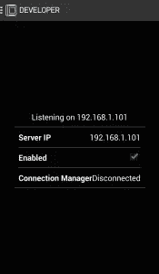
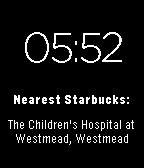

# 使用 JavaScript 开发 Pebble Watch

> 原文：<https://www.sitepoint.com/pebble-watch-development-javascript/>

最近几个月，越来越多像我这样的技术人员兴奋地将 Pebble 手表戴在手腕上。他们刚刚发布了 API 的第二版，不仅实现了 Pebble 应用商店，还引入了 JavaScript 框架。PebbleKit JavaScript 框架允许您使用 JavaScript 将数据和事件从 web 动态读入 Pebble watch 应用程序，反之亦然。这为 Pebble 应用程序带来了一个令人兴奋的新领域——我们现在可以轻松地将 Pebble watch 与任何数量的酷 web APIs 集成在一起。

本文将教您如何使用 PebbleKit JavaScript 框架向 Pebble 应用程序添加 JavaScript。我们将创建一个随时显示最近的星巴克地址的界面。为了获得这些数据，我们将使用 Foursquare API 来搜索附近的地点。如果你不是一个星巴克咖啡爱好者，改变搜索不同类型位置的功能会很简单！

本文是从一个希望从头开始的 JavaScript 开发人员的角度撰写的。由于 Pebble watch 应用程序本身在 C 上运行，因此会涉及到一些 C 编程。如果您对 C 不太熟悉，可以使用示例 C 代码并调整 JavaScript 来添加新功能并进行实验！

## 先决条件

如果您希望跟随本教程，您需要以下内容:

*   安装并运行 Pebble 应用程序的 Android 手机或 iPhone。
*   一块[鹅卵石手表](http://www.getpebble.com/)。
*   Foursquare API 的 API 凭证。
*   Wi-Fi 网络将您的应用程序传输到您的移动设备和 Pebble watch。
*   将 JavaScript 与一些 C 代码结合起来的勇气。

值得注意的一点是:你的 iPhone/Android 设备和你的电脑需要在同一个 Wi-Fi 网络上，这样你才能向它推送新的应用程序。

### 安装 Pebble SDK

我们需要在本地安装 Pebble SDK。下载和安装说明因操作系统而异，但 Pebble 的文档非常清楚地涵盖了这一点。所以，这里就不赘述了。

## 你的第一个项目

首先，为您的所有 Pebble 应用程序创建一个文件夹，并在终端窗口中导航到该文件夹:

```
mkdir /Users/patcat/pebble-dev/projects
cd /Users/patcat/pebble-dev/projects
```

接下来，使用下面的命令创建一个新项目。

```
pebble new-project --javascript find_me_starbucks
```

该命令用你的项目名创建一个新目录(如`find_me_starbucks`)。我们将在那个目录中工作，所以`cd`进入它。在项目目录中，您会注意到 Pebble 非常友好地为我们设置了一系列内容:

*   **appinfo . JSON**——对于节点开发者来说，这实际上类似于一个`package.json`文件。
*   **资源**–如果你的应用需要，在这里保存图片等。
*   你所有的代码都在这里。我们将从这里开始。
*   **wscript**–该文件告诉 Pebble SDK 如何构建您的应用程序。这个文件最好不要动，除非你知道你在做什么。

## 在 Pebble 设备上运行应用程序

接下来，我们将验证我们能否成功地将示例应用程序安装到 Pebble watch 上。确保您仍在项目文件夹中，并运行以下构建命令。

```
pebble build
```

它将在终端上运行，为你的应用程序上传到你的设备做好准备。如果这是你第一次进行 Pebble 开发，我们需要设置 Pebble watch 来接受我们的测试应用。为此:

*   在 **Android** 上，打开 Pebble app >设置>开发者选项，勾选启用开发者连接。
*   在 **iOS** 上，进入 iOS 设置应用> Pebble >启用开发者模式。

接下来，打开 Pebble 应用程序，打开菜单，点击新启用的“开发者”菜单项。您应该会看到一个屏幕，显示您的 Pebble 手表的 IP 地址。该屏幕如下图所示。



在终端中输入以下命令，用您的手机 IP 替换`IP_ADDRESS_OF_YOUR_PHONE`。

```
pebble install --phone IP_ADDRESS_OF_YOUR_PHONE
```

现在，您的 Pebble 手表应该已经安装了测试应用程序。它应该是一个默认应用程序，只检测您何时按下 Pebble watch 上的每个按钮。如果一切正常，我们可以进入下一步，找到附近的星巴克。如果出现问题，以下是一些需要检查的潜在事项:

*   确保您的手机和电脑都在同一个网络上。
*   确保您的 Pebble 手表有一个应用程序可用的插槽。如果没有，您需要先删除一个！
*   尝试重启手机并再次执行`pebble install`命令。请注意，在此过程中，您的 IP 地址可能会发生变化。

## `appinfo.json`文件

该文件是我们 Pebble 应用程序拼图中极其重要的一块。我们之前运行的命令设置了非常基本的部分，但是我们想要确切地知道什么是什么，以及我们需要在哪里进行一些调整。“给我找星巴克”的`appinfo.json`文件将如下所示:

```
{
  "uuid": "f614da96-1c67-4ab6-be80-903d63728080",
  "shortName": "Find Me Starbucks",
  "longName": "Find Me Starbucks",
  "companyName": "Patrick Catanzariti",
  "versionCode": 1,
  "versionLabel": "1.0.0",
  "watchapp": {
    "watchface": true
  },
  "appKeys": {
    "location": 0
  },
  "capabilities": ["location"],
  "resources": {
    "media": []
  }
}
```

以下是所有这些字段的详细含义:

*   **uuid**–这是 Pebble 为我们的项目生成的唯一 id。没有必要从为我们生成的东西中改变这一点。请**不要**使用上面列表中显示的那个。
*   **简称**–该名称出现在 Pebble watch 启动器上。
*   **long name**–名字出现在 Pebble watch 手机应用程序上。长名称“Find Me Starbucks”足够短，可以放在 Pebble watch 上，因此在这种情况下，两个名称是相同的。
*   **公司名称**–公司或开发商名称。
*   **Version code**–您将在每个版本中增加的版本号。
*   **版本标签**–版本标签。Pebble 推荐格式`Major.Minor.Bugfix`。
*   **watch app**–这里可以添加两个选项。
    *   无论这款应用是 watchface(用户无法与之互动，他们希望它能告诉他们时间)，还是一款用户可以与之互动的功能更全面的应用。我们正在用“给我找星巴克”应用程序制作一个手表界面。
    *   `only_shown_on_communication`–应用程序是否仅在从移动应用程序接收数据时可见。这是可选的，对于我们的 app 来说，不需要。
*   **appKeys**–我们将存储数据的键名，以便从我们的 JavaScript 传递到 Pebble watch。我很快会更详细地解释这一点，但正确理解这一点很重要。
*   **功能**–此字段允许您定义应用程序的权限，例如是否需要访问用户的位置，以及应用程序是否在移动应用程序上有配置窗口(例如`["location", "configurable"]`)。在 API 的第 2 版中，指定位置功能可能不是必需的，但是为了安全起见，我喜欢包含它。
*   **resources**–仅包含`media`对象，该对象列出了要与应用程序捆绑的所有媒体。接受的格式有`raw`、`png`、`png-trans`和`font`。对于本教程，我们不会使用任何图像，但如果您决定为您的应用程序(或应用程序本身中的图像)添加图标，您需要在此添加图像。

## “给我找星巴克”C 代码

`pebble new-project`命令在你的`src`文件夹中创建了一个 C 文件。打开那个文件(如果你一直遵循我的命名，它将是`src/find_me_starbucks.c`)。“给我找星巴克”的 C 代码比最初的模板要复杂一些。它使用了初始模板文件中的概念和一些新的概念。本文的重点是 JavaScript 方面，所以我们不会详细讨论。本文末尾提供了对 C 代码的解释作为奖励。这会给你更多的背景知识，所以你可以做一些小的调整来赞美你的 JS。

现在，我们将把下面的 C 代码复制并粘贴到`src/find_me_starbucks.c`文件中。它应该取代以前的一切:

```
#include <pebble.h>

static Window *window;
static TextLayer *text_layer;
static TextLayer *label_layer;
static TextLayer *time_layer;

static AppSync sync;
static uint8_t sync_buffer[64];

enum {
  OUR_LOCATION = 0x0
};

void sync_tuple_changed_callback(const uint32_t key,
        const Tuple* new_tuple, const Tuple* old_tuple, void* context) {

  switch (key) {
    case OUR_LOCATION:
      text_layer_set_text(text_layer, new_tuple->value->cstring);
      break;
  }
}

// http://stackoverflow.com/questions/21150193/logging-enums-on-the-pebble-watch/21172222#21172222
char *translate_error(AppMessageResult result) {
  switch (result) {
    case APP_MSG_OK: return "APP_MSG_OK";
    case APP_MSG_SEND_TIMEOUT: return "APP_MSG_SEND_TIMEOUT";
    case APP_MSG_SEND_REJECTED: return "APP_MSG_SEND_REJECTED";
    case APP_MSG_NOT_CONNECTED: return "APP_MSG_NOT_CONNECTED";
    case APP_MSG_APP_NOT_RUNNING: return "APP_MSG_APP_NOT_RUNNING";
    case APP_MSG_INVALID_ARGS: return "APP_MSG_INVALID_ARGS";
    case APP_MSG_BUSY: return "APP_MSG_BUSY";
    case APP_MSG_BUFFER_OVERFLOW: return "APP_MSG_BUFFER_OVERFLOW";
    case APP_MSG_ALREADY_RELEASED: return "APP_MSG_ALREADY_RELEASED";
    case APP_MSG_CALLBACK_ALREADY_REGISTERED: return "APP_MSG_CALLBACK_ALREADY_REGISTERED";
    case APP_MSG_CALLBACK_NOT_REGISTERED: return "APP_MSG_CALLBACK_NOT_REGISTERED";
    case APP_MSG_OUT_OF_MEMORY: return "APP_MSG_OUT_OF_MEMORY";
    case APP_MSG_CLOSED: return "APP_MSG_CLOSED";
    case APP_MSG_INTERNAL_ERROR: return "APP_MSG_INTERNAL_ERROR";
    default: return "UNKNOWN ERROR";
  }
}

void sync_error_callback(DictionaryResult dict_error, AppMessageResult app_message_error, void *context) {
  APP_LOG(APP_LOG_LEVEL_DEBUG, "... Sync Error: %s", translate_error(app_message_error));
}

static void handle_second_tick(struct tm* tick_time, TimeUnits units_changed) {
  static char time_text[] = "00:00";

  strftime(time_text, sizeof(time_text), "%I:%M", tick_time);
  text_layer_set_text(time_layer, time_text);
}

static void init_clock(Window *window) {
  Layer *window_layer = window_get_root_layer(window);
  GRect bounds = layer_get_bounds(window_layer);

  time_layer = text_layer_create(GRect(0, 20, bounds.size.w, bounds.size.h-100));
  text_layer_set_text_alignment(time_layer, GTextAlignmentCenter);
  text_layer_set_text_color(time_layer, GColorWhite);
  text_layer_set_background_color(time_layer, GColorClear);
  text_layer_set_font(time_layer, fonts_get_system_font(FONT_KEY_BITHAM_42_LIGHT));

  time_t now = time(NULL);
  struct tm *current_time = localtime(&now);
  handle_second_tick(current_time, SECOND_UNIT);
  tick_timer_service_subscribe(SECOND_UNIT, &handle_second_tick);

  layer_add_child(window_get_root_layer(window), text_layer_get_layer(time_layer));
}

static void init_location_search(Window *window) {
  Layer *window_layer = window_get_root_layer(window);
  GRect bounds = layer_get_bounds(window_layer);

  label_layer = text_layer_create((GRect) { .origin = { 0, 90 }, .size = { bounds.size.w, 100 } });
  text_layer_set_text(label_layer, "Nearest Starbucks:");
  text_layer_set_text_color(label_layer, GColorWhite);
  text_layer_set_text_alignment(label_layer, GTextAlignmentCenter);
  text_layer_set_background_color(label_layer, GColorClear);
  text_layer_set_font(label_layer, fonts_get_system_font(FONT_KEY_GOTHIC_14_BOLD));
  layer_add_child(window_layer, text_layer_get_layer(label_layer));

  text_layer = text_layer_create((GRect) { .origin = { 0, 115 }, .size = { bounds.size.w, bounds.size.h } });
  text_layer_set_text(text_layer, "Loading...");
  text_layer_set_text_color(text_layer, GColorWhite);
  text_layer_set_text_alignment(text_layer, GTextAlignmentCenter);
  text_layer_set_background_color(text_layer, GColorClear);
  text_layer_set_overflow_mode(text_layer, GTextOverflowModeFill);
  text_layer_set_font(text_layer, fonts_get_system_font(FONT_KEY_GOTHIC_14));
  layer_add_child(window_layer, text_layer_get_layer(text_layer));

  Tuplet initial_values[] = {
     TupletCString(OUR_LOCATION, "Loading...")
  };

  app_sync_init(&sync, sync_buffer, sizeof(sync_buffer), initial_values, ARRAY_LENGTH(initial_values),
      sync_tuple_changed_callback, sync_error_callback, NULL);
}

static void window_load(Window *window) {
  init_location_search(window);
  init_clock(window);
}

static void window_unload(Window *window) {
  text_layer_destroy(text_layer);
  text_layer_destroy(label_layer);
  text_layer_destroy(time_layer);
}

static void init(void) {
  window = window_create();
  window_set_window_handlers(window, (WindowHandlers) {
    .load = window_load,
    .unload = window_unload,
  });

  app_message_open(64, 64);

  const bool animated = true;
  window_stack_push(window, animated);
  window_set_background_color(window, GColorBlack);
}

static void deinit(void) {
  window_destroy(window);
}

int main(void) {
  init();

  APP_LOG(APP_LOG_LEVEL_DEBUG, "Done initializing, pushed window: %p", window);

  app_event_loop();
  deinit();
}
```

## JavaScript 代码

我们应用程序的大部分实际数据和有用性将来自我们的 JavaScript。这就是我们将让应用程序与所有未开发的网络潜力对话的地方。我们所有的 JavaScript 必须在一个文件中，这个文件应该已经存在于您的项目中的`src/js`下。您的 Pebble 应用程序必须将文件名命名为`pebble-js-app.js`。下面显示了`pebble-js-app.js`的初始内容，它简单地显示了一个“Hello world”消息。

```
Pebble.addEventListener("ready",
  function(e) {
    console.log("Hello world! - Sent from your javascript application.");
  }
);
```

这段代码监听一个`ready`事件，该事件在 Pebble 应用程序准备好接受命令时运行。类似于 jQuery 中使用`$(document).ready(function() {});`的思路。因为我们想定位 Starbucks，而不是打招呼，所以我们将用下面的代码覆盖这个文件的内容。稍后我将更详细地分解代码。

```
var locationOptions = {timeout: 15000, maximumAge: 60000}; 

function fetch_location_data(pos) {
  var req = new XMLHttpRequest(),
      version = Date.now(),
      clientId = 'BSFRMG541RT1SJBWRZ4NPV1F5QQKJ2B1OSMQ0EDTU3NR0ZAX',
      clientSecret = '4VFLSBVYEQAN0M0XNGERON0LYMSMG1AJRSXXAQURK5GJQBNB',
      latitude = pos.coords.latitude,
      longitude = pos.coords.longitude;

  req.open('GET', 'https://api.foursquare.com/v2/venues/search?client_id=' + clientId + '&client_secret=' + clientSecret + '&v=' + version + '&ll=' + latitude + ',' + longitude + '&query=starbucks', true);

  req.onload = function(e) {
    if (req.readyState == 4 && req.status == 200) {
      if (req.status == 200) {
        var response = JSON.parse(req.responseText);

        if (response && response.meta.code == '200' && response.response) {
          var venue = response.response.venues[0];

          Pebble.sendAppMessage({location: venue.location.address + ', ' + venue.location.city});
        }
      } else {
        console.log('Error');
      }
    }
  }

  req.send(null);
}

function fetch_location_error(err) {
  console.log(err);
  Pebble.sendAppMessage({location: 'Unable to retrieve location'});
}

Pebble.addEventListener('ready', function(e) {
  locationWatcher = window.navigator.geolocation.watchPosition(fetch_location_data, fetch_location_error, locationOptions);
});
```

### AppMessage 对象

我们以 JSON 对象的形式发送和接收消息，带有非常特殊的键。默认情况下，我们可以对每个键使用从 0 开始的索引向 Pebble 发送消息，如下所示:

```
{"0": "Your first value", "1": "Your second value", "2": "Your third value"}
```

然而，如果我们给键命名，代码会更容易阅读。我们在`appinfo.json`文件中这样做。我们在文件中存储了这些信息:

```
"appKeys": {
  "location": 0
}
```

这给了索引 0 一个名字`location`。现在，我们可以这样写我们的信息:

```
{"location": "Your first value"}
```

### 发送和接收消息

为了发送消息，我们使用了`Pebble.sendAppMessage()`函数。第一个参数是您正在发送的 JSON 消息。第二个和第三个参数分别是成功和错误回调。下面显示了一个示例`sendAppMessage()`调用。

```
Pebble.sendAppMessage({"0": "Your first value", "1": "Your second value", "2": "Your third value"},
  function(e) {
    console.log("Successfully delivered message with transactionId=" + e.data);
  },
  function(e) {
    console.log("Unable to deliver message with transactionId=" + e.data + ". Error is: " + e.error.message);
  }
);
```

### 地理定位

Pebble 位置 API 使用`window.navigator.geolocation.watchPosition()`函数来跟踪我们的位置。它接受三个参数，一个成功回调函数、一个错误回调函数和一个需要选项的 JSON 对象的变量。在我们的“找我星巴克”应用程序中，我们为地理位置搜索定义了两个选项，`timeout`和`maximumAge`:

```
var locationOptions = {timeout: 15000, maximumAge: 60000};
```

`timeout`是应用程序在放弃并返回错误之前等待的时间，以毫秒为单位。在上面的例子中，我们检查位置数据 15 秒钟，如果没有返回任何内容，就返回一个错误。`maximumAge`选项代表我们希望在应用程序中使用的缓存数据的年龄，以毫秒为单位。一旦位置数据比这旧，我们请求新的位置数据。在我们的代码中，我们每分钟都在检查新的位置数据(例如，每 60000 毫秒)。

我们运行`watchPosition()`函数，设置`fetch_location_data()`为成功回调，`fetch_location_error()`为错误回调:

```
Pebble.addEventListener('ready', function(e) {
  locationWatcher = window.navigator.geolocation.watchPosition(fetch_location_data, fetch_location_error, locationOptions);
});
```

如果 Pebble 无法确定我们的位置，则`fetch_location_error()`功能会返回一条消息，让用户知道发生了什么:

```
function fetch_location_error() {
  Pebble.sendAppMessage({location: 'Unable to retrieve location'});
}
```

下一节将解释`fetch_location_data()`回调，这就是神奇的地方。

### 发出 Ajax 请求

Ajax 请求遵循标准的`XMLHttpRequest`格式。在我们的“给我找星巴克”应用程序中，我们的`fetch_location_data()`回调从定义几个重要变量开始:

```
var req = new XMLHttpRequest(),
    version = Date.now(),
    clientId = 'BNBFMG541RT1SJBWRZ1NPS1F1QQKK2B19SMS0EDAU3DR7ZZA',
    clientSecret = '4AFKSBKJHQAKJHFBNGERON0LYMSMG1AKJ2KJHBWKS8KJHSDKHE',
    latitude = pos.coords.latitude,
    longitude = pos.coords.longitude;
```

`req`存储`XMLHttpRequest`对象。`version`是一个时间戳，按照 Foursquare API 的要求，为我们的 API 请求提供一个唯一的“版本”号。`clientId`和`clientSecret`是在你注册 Foursquare API 的时候给你的。它们对于您的应用程序来说是唯一的，代码示例中显示的那些不是真实的。访问 [Foursquare for Developers](https://developer.foursquare.com/) ，注册你的应用程序，并获得一组密钥供你使用。最后，`latitude`和`longitude`是 Pebble API 返回的物理地理位置坐标。

Foursquare 文档提供了一个场地搜索的例子。我们的应用程序通过请求下面的 URL 来修改这个例子。

```
https://api.foursquare.com/v2/venues/search?client_id=CLIENT_ID&client_secret=CLIENT_SECRET&v=1396158354368&ll=40.7,-74&query=starbucks
```

Foursquare API 以下面的格式返回数据(为了只显示我们将使用的数据，将其简化):

```
{
  "meta": {
    "code": 200
  },
  "response": {
    "venues": [
      {
        "id": "4a7ae3f0f964a52095e91fe3",
        "name": "Starbucks",
        "contact": {
          "phone": "2124826530",
          "formattedPhone": "(212) 482-6530",
          "twitter": "starbucks"
        }
...
```

然后我们使用`req.onload`函数读入返回的值。如果`req.status`是 200(表示成功)，那么我们将响应解释为 JSON，并验证 Foursquare 已经返回了 200 的`meta.code`(four square 的 API 的一部分)，并且具有值`response`。完成这项工作的代码如下所示。

```
req.onload = function(e) {
  if (req.readyState == 4 && req.status == 200) {
    if (req.status == 200) {
      var response = JSON.parse(req.responseText);
      if (response && response.meta.code == '200' && response.response) {
```

然后我们返回找到的第一个地点的 JSON:

```
var venue = response.response.venues[0];
```

使用`sendAppMessage()`功能，我们向我们的 Pebble 手表发送消息。`location`标签与我们之前在`appinfo.json`文件中设置的相匹配(它需要匹配才能进行通信):

```
Pebble.sendAppMessage({location: venue.location.address + ', ' + venue.location.city});
```

## 运行应用程序

一旦所有的 JavaScript 和 C 代码都准备好了，运行`pebble build`，然后运行`pebble install --phone IP_ADDRESS_OF_YOUR_PHONE`。如果一切顺利，你应该安装一个表盘，告诉你时间和最近的星巴克。下图显示了一个示例。



## 调试 Pebble 应用程序

使用`console.log()`作为调试技术是一种常见的做法。要从 Pebble watch 查看日志，请发出以下命令:

```
pebble logs --phone IP_ADDRESS_OF_YOUR_PHONE
```

JavaScript 日志可以与 C 日志区分开来，因为它们使用`pebble-js-app.js`作为文件名和行号。下面显示了一个 JavaScript 日志示例。

```
[INFO    ] find_me_starbucks__1/pebble-js-app.js:3 If this is coffee, please bring me some tea; but if this is tea, please bring me some coffee. Abraham Lincoln.
```

注意，如果需要调试一些 C 代码，可以使用`APP_LOG()`。这类似于 JavaScript 中的`console.log()`。该消息将显示在日志中，但看起来像这样:

```
find_me_starbucks.c:37 You can never get a cup of tea large enough or a book long enough to suit me. C.S. Lewis.
```

## 结论(有点)

恭喜你！你现在有了一个应用程序，它可以从 Foursquare 检索最近的星巴克位置，并将其显示在你的 Pebble 手表上，从而巧妙地鼓励咖啡因上瘾。

你可以用这个程序做更多的事情。我计划在未来扩展该应用程序，以允许自定义用户配置，例如，如果 Pebble 手表的所有者希望获得最近的“玩具反斗城”的通知，该怎么办？使用 PebbleKit JavaScript 框架，您可以在用户的手机上设置一个配置窗口，允许他们输入应用程序的首选项。这可能会出现在以后的文章中！

我希望我们能够激发您尝试 Pebble SDK，并在不久的将来进行您自己的小实验。有了 JavaScript 框架，它现在对你能想到的任何 API 都是完全开放的！如果你需要更多的灵感，看看 Pebble Mars watch face——你可以在 Pebble watchface 上获得好奇号火星车的流媒体图像。令人难以置信的对 Pebble SDK 的出色使用。

所有“给我找星巴克”的代码都可以在 GitHub 上找到。如果您将此代码用作更具启发性的 Pebble 应用程序的起点，请查看并告知我。我很想看看你能想出什么！

## 奖金部分:更多关于 C 代码

如果你想了解更多关于`find_me_starbucks.c`代码的内容，我写了一份快速指南。我们仍将关注相对较高层次的概述(我不会解释具体的 C 语法或类似的东西)，但这可能有助于那些只想了解一点他们正在修补的代码的 JavaScript 开发人员。

我将从精简版的 C 代码开始，当您第一次创建应用程序时，它会放在您的 Pebble 应用程序文件夹中，这只是为了使它更容易拼凑起来:

```
#include <pebble.h>

static Window *window;
static TextLayer *text_layer;

static void window_load(Window *window) {
  Layer *window_layer = window_get_root_layer(window);
  GRect bounds = layer_get_bounds(window_layer);

  text_layer = text_layer_create((GRect) { .origin = { 0, 72 }, .size = { bounds.size.w, 20 } });
  text_layer_set_text(text_layer, "Hello world");
  text_layer_set_text_alignment(text_layer, GTextAlignmentCenter);
  layer_add_child(window_layer, text_layer_get_layer(text_layer));
}

static void window_unload(Window *window) {
  text_layer_destroy(text_layer);
}

static void init(void) {
  window = window_create();
  window_set_window_handlers(window, (WindowHandlers) {
    .load = window_load,
    .unload = window_unload,
  });
  const bool animated = true;
  window_stack_push(window, animated);
}

static void deinit(void) {
  window_destroy(window);
}

int main(void) {
  init();

  APP_LOG(APP_LOG_LEVEL_DEBUG, "Done initializing, pushed window: %p", window);

  app_event_loop();
  deinit();
}
```

加载应用程序时，会调用`main()`功能。在`main()`内部，调用`init()`被认为是 Pebble 应用程序开发的最佳实践。我们在`init()`中建立了应用程序的大部分基础。然后我们使用`app_event_loop()`来阻止应用程序在`main()`中执行更多的代码，直到应用程序退出。因此，`deinit()`只在应用程序关闭时调用。

### Windows 操作系统

窗口是我们在 Pebble 应用程序中放入元素的容器。我们总是需要至少一个这样的应用程序才能运行。我们可以在一个应用程序中有多个窗口，但是在任何给定的时间只有一个是可见的。窗口是这样创建的:

```
window = window_create();
```

当特定窗口当前可见和不再可见时，运行窗口处理程序。我们将`window_load()`函数设置为在窗口显示时运行，将`window_unload()`函数设置为在窗口不可见时运行:

```
window_set_window_handlers(window, (WindowHandlers) {
  .load = window_load,
  .unload = window_unload,
});
```

我们的`window.load()`函数的前两行获取 Pebble 应用程序窗口的大小。我们用这个来确定应用程序中其他元素的大小和位置。

我们使用`window_stack_push(window, animated)`将窗口附加到应用程序上。第二个变量设置窗口切换是否是动画。

`text_layer_create()`和其他相关函数创建一个文本元素，设置其大小、原点、文本内容和对齐方式，然后将其添加到窗口中。

`text_layer_destroy(text_layer)`做了你所期望的，它从内存中删除了我们之前创建的层。当我们不再需要时，保持物品整洁。

### 内存管理

`deinit()`函数用于在应用程序执行完毕后进行清理。在 C 语言中，你需要销毁你创建的元素。如果你不这样做，它们会一直保存在 Pebble 手表的内存中。JavaScript 很可爱，它为我们处理了这个问题，但是当用 C 编码时，你需要自己处理这个问题。例如，当您不再需要一个窗口时，您应该销毁它:

```
window_destroy(window);
```

同样，文本层一旦超过使用期限，就应该销毁:

```
text_layer_destroy(text_layer);
```

### “给我找星巴克”代码

现在是时候重温本文前面的 C 代码了。我们添加了从 JavaScript 接收消息的功能，以及时钟功能。首先要注意的是，我们增加了几个文本层:

```
static TextLayer *text_layer;
static TextLayer *label_layer;
static TextLayer *time_layer;
```

同步功能是最大的更新。我们使用 Pebble SDK 的 [`AppSync`](https://developer.getpebble.com/2/api-reference/group___app_sync.html) 模块在手机应用程序和 Pebble 手表之间来回同步数据。这个实现从我们的 C 代码中的两个新变量开始。我们在变量`sync`中定义了`AppSync`模块，并设置了一个 64 字节长的缓冲区来存储消息:

```
static AppSync sync;
static uint8_t sync_buffer[64];
```

我们还开始为应用程序准备它将从我们的 JavaScript 接收的键/值对。我们只需要一个键/值对，代表最近的星巴克的位置。我们将把这个键/值对存储在第一个位置(C 称之为位置`0x0`)作为`OUR_LOCATION`。这基本上是将第一个键/值对命名为`OUR_LOCATION`的一种方式，而不需要说`0x0`。这更多是为了可读性，而不是功能性:

```
enum {
  OUR_LOCATION = 0x0
};
```

我们还准备在我们的`init()`函数中发送和接收消息。为了使用`AppSync`，我们需要运行`app_message_open`，它有两个参数，最大收件箱大小(它可以从我们的 JS 接收多少)和发件箱大小(它可以发送多少):

```
app_message_open(64, 64);
```

接下来，我们将继续讨论`init_location_search()`函数。与查找我们的位置和打印结果有关的一切都可以在这里找到。这个功能的很大一部分是设置文本层，并使它们看起来更漂亮。我们还设置了一个数组`initial_values`，它将`OUR_LOCATION`的初始键/值对定义为`"Loading..."`:

```
Tuplet initial_values[] = {
  TupletCString(OUR_LOCATION, "Loading...")
};
```

`app_sync_init()`将我们的初始值传入缓冲区，如果成功就运行`sync_tuple_changed_callback()`的回调函数，如果失败就运行`sync_error_callback()`的回调函数。用最基本的术语来说，我们的`sync_tuple_changed_callback()`函数传入一个从`app_sync_init()`收到的键/值对。我们关心的变量是`key`和`new_tuple`。`key`是返回的对的位置(例如`0x0`、`0x1`等)。)和`new_tuple`包含其内容(如`"L1, IMAX Cinema Complex, Darling Harbour"`)。我们将第一个也是唯一一个位置`0x0`命名为`OUR_LOCATION`，因此我们注意到了这一点，并在应用程序上设置文本来显示该值:

```
void sync_tuple_changed_callback(const uint32_t key,
    const Tuple* new_tuple, const Tuple* old_tuple, void* context) {

  switch (key) {
    case OUR_LOCATION:
      text_layer_set_text(text_layer, new_tuple->value->cstring);
      break;
  }
}
```

### 显示时间

我们的应用程序本质上仍然是一个时钟，所以它必须显示时间。我个人在`init_clock()`函数中完成所有这些工作(据我所知，这不是一个约定)。它的大部分再次只是定义文本层来显示信息，但也有一些其他部分没有价值。

我们以秒为单位获取当前时间作为 Unix 时间:

```
time_t now = time(NULL);
```

接下来，我们将它调整到本地时区:

```
struct tm *current_time = localtime(&now);
```

接下来，运行一次`handle_second_tick()`功能，然后每秒运行一次:

```
handle_second_tick(current_time, SECOND_UNIT);
tick_timer_service_subscribe(SECOND_UNIT, &handle_second_tick);
```

该功能使用标准的 [`strftime()`功能](http://pubs.opengroup.org/onlinepubs/007908799/xsh/strftime.html)格式化时间，并显示在手表的`time_layer`文本中:

```
static void handle_second_tick(struct tm* tick_time, TimeUnits units_changed) {
  static char time_text[] = "00:00";

  strftime(time_text, sizeof(time_text), "%I:%M", tick_time);
  text_layer_set_text(time_layer, time_text);
}
```

### 结论(认真地)

至此，你有望对 C 代码如何在大计划中发挥作用有更多的了解。Pebble 提供了大量关于所有这些内容的详细文档。几个很好的起点是:

*   [高级 Pebble 手表配置](https://www.sitepoint.com/advanced-pebble-watch-configuration/)–本文后续内容，包含更多高级信息。
*   [剖析 Pebble 应用程序](https://developer.getpebble.com/2/guides/anatomy-of-pebble-application.html)——解释`appinfo.json`文件和 C 代码的一些基本结构位。
*   [使用 PebbleKit JavaScript 框架](https://developer.getpebble.com/2/guides/javascript-guide.html)——JavaScript 方面的大量信息。
*   [Pebble SDK 的核心](https://developer.getpebble.com/2/api-reference/group___foundation.html)-如果您正在寻找有关 Pebble 应用程序的更全面的信息，请访问 Pebble 应用程序的更具技术性的 C 端文档。

## 分享这篇文章