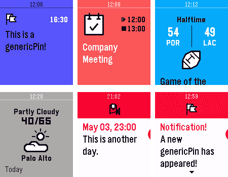

# 了解 Pebble 手表时间表

> 原文：<https://www.sitepoint.com/pebble-watch-timeline/>

今年早些时候，Pebble 发布了他们的第三代智能手表 [Pebble Time](https://getpebble.com/pebble_time) ，这是通过他们获得巨大成功的 [Kickstarter 活动](https://www.kickstarter.com/projects/597507018/pebble-time-awesome-smartwatch-no-compromises)获得的资金。Pebble Time 附带了一个名为 Timeline 的新功能，用于在时间线上按时间顺序向用户显示信息(如通知、新闻、提醒和事件)。以前，Pebble 要求开发人员编写用于在 Pebble 上显示信息的原生应用。现在，开发人员可以通过公共 REST API，使用 JSON 从他们自己的私有服务器直接将信息推送到时间轴上。

如果你对 Pebble Time 不熟悉，我建议你看看 Patrick Catanzariti 的这篇文章。

## 时间线是什么？

智能手机通知是即时的，代表了在那个时刻发生的交易。根据定义，他们不能早到或晚到。

Pebble Time 附带了一个名为 timeline 的新操作系统功能。时间轴为您的通知带来了另一个维度；时间的维度。时间线不应与通知历史混淆。Timeline 允许第三方向您发送过去的通知和未来的通知；您不需要立即知道，但可能希望稍后查找的通知。例如，您可能想要查找您早上什么时候离开家，或者日出是什么时候，或者股票市场早些时候开盘是多少个百分点，或者下一班离开肯尼迪镇的火车是什么时候。


*信用:卵石*

时间线的美妙之处在于，你可以将几乎任何信息放入其中，无论多么无关紧要，因为这些信息不会打断用户。例如，一个鸡蛋计时器应用程序可以在计时器停止时提醒用户，也可以将事件推到时间线上。你永远不知道用户什么时候会问自己，“我是什么时候为我今天早上烤的蛋糕设置定时器的？”。

当然，时间轴也可以保存重要的及时信息，比如火车时刻表或当地电影院的电影时间。用户不用提前五分钟得到火车发车的通知，而是可以在手表上提前查看下一趟和之后的火车。所有这些信息都被悄悄地推送到你的手表上，并浓缩到一个可滚动的界面中。

除了作为与您的生活相关的随机信息的出口，Pebble 还会自动将智能手机日历中过去和未来的事件填充到您的时间线中，以便您全面了解自己的一天。


*信用:卵石*

## 它是如何工作的？

Pebble 将时间线通知称为“大头针”。在 Pebble 的服务器上对 pin 进行统一管理，Pebble 设备被设置为定期连接并下载新的 pin 列表以显示在时间线上。Pebble 的服务器确保用户不会收到太多的 pin，并允许开发人员通过一个命令将 pin 推送给多个用户。

所有 pin 必须通过 Pebble 的服务器。即使是想要在本地设备上显示 pin 的本地应用程序，也必须首先将 pin 推送到服务器，并允许设备在其定期更新计划(15 分钟)中接收它。

pin 码的发行者可以更新和删除 pin 码，Pebble 的服务器会将更改内容推送到 Pebble 设备。

## 大头针的解剖

所有的 pin 都以 JSON 格式编写，并通过 HTTPS 推送到 Pebble 的服务器上。

最小 pin 的示例如下所示:

```
{
  "id": "xxxxxxxxx",
  "time": "2015-05-25T08:42:00Z",
  "layout": {
    "type": "genericPin",
    "title": "You left your house",
    "tinyIcon": "systemimg/NOTIFICATION_FLAG"
  }
}
```

1.  `id`是每个事件的随机唯一字符串，允许发行者更新和删除 pin。
2.  `time`决定了它应该出现在时间轴中的什么位置。
3.  `layout`包含将在屏幕上显示的信息。
4.  `type`定义 pin 是否应该格式化为通用、日历、体育、天气等。事件。
5.  `title`是屏幕上显示的文本。
6.  `tinyIcon`来自允许的图标列表。

## 获取您的 API 密钥

Pebble 要求您将现有的 Pebble 应用程序上传到 [Pebble 应用程序商店](https://help.getpebble.com/customer/portal/articles/1701779-pebble-appstore)，以便将 pin 码推送到 Pebble 的服务器。该应用程序实际上不需要做任何事情。

需要一个应用程序，因为用户需要有意下载你的应用程序，以表明他们想要订阅你的 pin。同样，用户删除您的应用程序会自动从您的 pin 中取消订阅。

如果你打算只为时间表开发，没有时间创建一个花哨的应用程序，那么前往 [CloudPebble](https://www.cloudpebble.net) (Pebble 的官方基于网络的应用程序开发环境)，使用他们的最小模板创建一个简单的应用程序，在线编译，然后将完成的应用程序下载到你的计算机上。将您的应用上传至 Pebble 的[开发者门户](https://dev-portal.getpebble.com)后，按照其网站上的说明获取您的应用特定的 API 密钥。

如需更多帮助，请参阅这篇关于如何[向应用商店](https://www.sitepoint.com/submit-pebble-app-app-store/)提交 Pebble 应用的文章。

当与 Pebble 的服务器通信时，您需要注意两种不同的认证令牌。第一个是您的应用程序特定的 API 密钥，您使用它向所有用户推送 pin。第二个是特定于每个用户和应用组合的用户令牌。将 pin 推送到 Pebble 时，您只能使用其中一个，这取决于您是要将 pin 推送到所有用户还是特定用户。

使用者代币只能由 Pebble 装置上执行的应用程式取得，不会以其他方式公开。这意味着，如果您的目标是特定用户，您将需要开发一款 Pebble 应用程序，该应用程序可读取用户令牌并从您的应用程序中推送 pin 码，或者将用户令牌传送回您的服务器。

## 向 Pebble 的服务器推送 Pin

pin 可以从您自己的服务器推送到 Pebble 的服务器，或者从安装在 Pebble 设备上的应用程序推送到 Pebble 的服务器。这是通过 HTTPS 完成的，该协议是一种得到广泛支持的开放协议。

下面是一个将 pin 从您的服务器推送给所有用户的示例(使用`XMLHttpRequest`进行说明):

```
var xhr = new XMLHttpRequest();
xhr.open(
  "PUT", 
  "https://timeline-api.getpebble.com/v1/user/pins/kennedytown-1395203", 
  true
);
xhr.setRequestHeader("Content-Type", "application/json");
xhr.setRequestHeader("X-API-Key", "fbbd2e4c5a8e1dbef2b00b97bf83bdc9");
xhr.send(JSON.stringify(
{
  "id": "kennedytown-1395203",
  "time": "2015-05-25T08:42:00Z",
  "layout": {
    "type": "genericPin",
    "title": "Last train at 11:40 PM out of Kennedy Town",
    "tinyIcon": "systemimg/SCHEDULED_EVENT"
  }
}
));
```

如果此代码在 Pebble 应用程序内运行，您应该使用用户令牌，因为 pin 仅适用于当前用户，并且您不希望在服务器外暴露您的应用程序 API 密钥。

在本例中，我们从您的应用程序中向当前用户推送 pin:

```
Pebble.getTimelineToken(
  function (userToken) {
    var xhr = new XMLHttpRequest();
    xhr.open(
      "PUT", 
      "https://timeline-api.getpebble.com/v1/user/pins/kennedytown-1395203", 
      true
    );
    xhr.setRequestHeader("Content-Type", "application/json");
    xhr.setRequestHeader("X-User-Token", userToken);
    xhr.send(JSON.stringify(
    {
      "id": "kennedytown-1395203",
      "time": "2015-05-25T08:42:00Z",
      "layout": {
        "type": "genericPin",
        "title": "Last train at 11:40 PM out of Kennedy Town",
        "tinyIcon": "systemimg/SCHEDULED_EVENT"
      }
    }
    ));
  },
  function (error) {}
);
```

向 Pebble 的服务器发出请求后，只需坐下来放松，等待 Pebble 设备进行自我更新并将 pin 放入时间线中。

## 自定义您的 pin 外观

大头针不仅仅是一个文本和图标，它更具有可定制性。之前的 JSON 有一个设置为`genericPin`的`type`属性。通过更改，您可以使用 6 针布局中的任何一种:



[引脚布局](https://developer.getpebble.com/guides/timeline/pin-structure/#pin-layouts)为:

1.  `genericPin` —用于一般信息
2.  `calendarPin` —用于日历事件
3.  `sportsPin` —用于显示不同团队的得分
4.  `weatherPin` —天气预报
5.  `genericReminder` —针对即将发生的提醒
6.  `genericNotification` —主要用于即时通知

每种接点类型都有自己的一组特性，可以进一步自定义外观。例如，体育布局允许您指定主队和客场队以及他们各自的分数。

您还可以通过将这些属性添加到`layout` JSON 来更改 pin 的`primaryColor`、`secondaryColor`和`backgroundColor`。这些值是 HTML 十六进制格式的颜色(例如`#0055FF`)。

## 添加 Pin 并提醒用户

虽然 pin 被设计成安静的，并且需要用户主动寻找信息，但是 pin 也可以提供破坏性的通知。通过向 pin 添加特性，您可以控制 pin 是在添加后立即警告用户，还是在每次更新数据时都警告用户。您还可以指定最多三个提醒，在事件临近时提醒用户。例如，您可以提醒用户足球比赛即将开始，当比分出来时提醒他们，如果比赛推迟了，提醒他们，同时在时间线中仍然可以看到所有这些信息。

要在创建 pin 后立即提醒用户，只需在将它推送到 Pebble 服务器之前，向您的 JSON 添加一个`createNotification`属性。当 Pebble 设备收到 pin 时，它会将其添加到时间表中，同时提醒用户:

```
{
  "id": "uidxxxxxxxxx",
  "time": "2015-05-25T08:42:00Z",
  "layout": {
    "type": "genericPin",
    "title": "You left your house",
    "tinyIcon": "systemimg/NOTIFICATION_FLAG"
  },
  createNotification: {
    "layout": {
      "type": "genericPin",
      "title": "You JUST left your house",
      "tinyIcon": "systemimg/GENERIC_CONFIRMATION"
    }   
  }
}
```

为了在 pin 更新后提醒用户，在 JSON 中添加一个`updateNotification`属性，并添加一个`time`属性来指示更新时间，如下所示:

```
{
  "id": "uidxxxxxxxxx",
  "time": "2015-05-25T08:42:00Z",
  "layout": {
    "type": "genericPin",
    "title": "You left your house",
    "tinyIcon": "systemimg/NOTIFICATION_FLAG"
  },
  updateNotification: {
    "time": "2015-05-25T08:59:00Z",
    "layout": {
      "type": "genericPin",
      "title": "The time you left your house has changed, how weird",
      "tinyIcon": "systemimg/GENERIC_CONFIRMATION"
    }  
  }
}
```

更新 pin 时，您不能只推送已更改的数据，您需要再次推送所有信息。

## 让 Pin 打开您的应用程序

您可以通过向您的 pin 添加一个`actions`属性来让您的 pin 打开您的 Pebble 应用程序。您可以指定多个操作，其中每个操作都分配有一个传递给应用程序的整数参数。当用户打开您的 pin 时，他们将看到一个菜单，其中列出了您指定的操作。当他们点击一个项目时，你的应用程序就会启动。

```
{
  "id": "uidxxxxxxxxx",
  "time": "2015-05-25T08:42:00Z",
  "layout": {
    "type": "genericPin",
    "title": "You left your house",
    "tinyIcon": "systemimg/NOTIFICATION_FLAG"
  },
  actions: [
    {
      "title": "Activate house alarm",
      "type": "openWatchApp",
      "launchCode": 15
    },
    {
      "title": "Deactivate house alarm",
      "type": "openWatchApp",
      "launchCode": 22
    }
  ]
}
```

## 摘要

在这篇文章中，我们仅仅触及了时间轴的基本功能。有许多我没有涉及的主题，读者可以选择自己探索，比如删除一个 pin、主题分组 pin 和错误处理。

时间线是一种简单的技术(类似于 RSS 提要)，但是更加个人化和可访问，并且有了正确的内容，可以成为不可或缺的功能。

### 相关链接

*   [Pebble 时间轴](https://developer.getpebble.com/guides/timeline/) —教程和示例。
*   [Pebble Time 对开发者来说意味着什么？](https://www.sitepoint.com/pebble-time-mean-developers)
*   [如何向 App Store 提交 Pebble 应用程序](https://www.sitepoint.com/submit-pebble-app-app-store/)

## 分享这篇文章