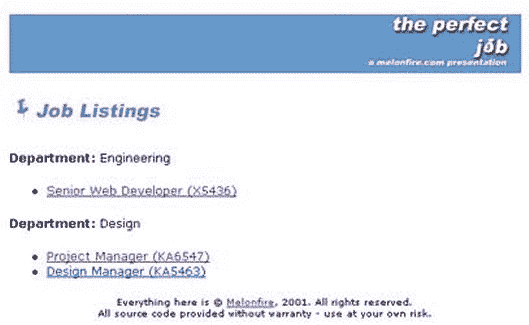
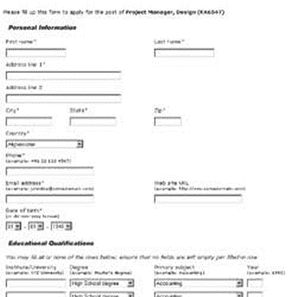
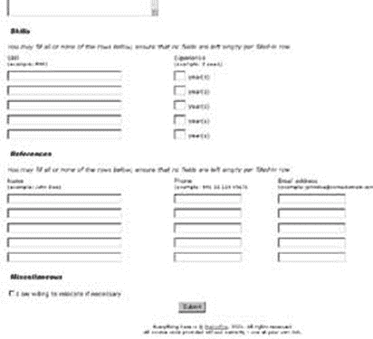

# 完美的工作——第一部分

> 原文：<https://www.sitepoint.com/perfect-job-1/>

 ****##### 禅宗与招聘艺术** 

这看起来并不难，但管理一个组织的人力资源部门实际上是一项相当困难的任务。当然，HR 们不必担心内存泄漏、垃圾收集或代码损坏；然而，他们的问题通常和任何软件程序员或界面设计师的问题一样引人注目和具有挑战性。

对于任何人力资源部门来说，最具挑战性的问题之一是招聘，即在组织内将潜在员工与空缺职位相匹配的艺术。这个过程很复杂:登一则广告，等待简历蜂拥而至，然后开始筛选潜在雇员的艰巨任务。接下来通常是对潜在候选人的面试和背景调查，或许还有一份工作邀请。

现在，在网络成为流行语之前，让潜在雇员了解一份工作的唯一方式是通过广告，要么是在报纸、杂志上，要么是在电视上。一旦收到大量回复，人力资源部门将不得不费力地在成堆的文件中寻找与空缺职位最匹配的人选。在这一过程中，你几乎总是会丢失或毁坏一些简历，承受多次纸张割伤，并对你可能拥有的任何社交生活的希望说再见。

然而，随着每个人和他们失聪的奶奶都连接到网络上，接触潜在的候选人变得容易多了。一家公司现在可以通过在线职业介绍所发布招聘广告，也可以在自己的网站上发布招聘信息。由于在线职业介绍所并不是出于好心，如果仅仅是出于经济原因，后一种选择通常是小公司更喜欢的。

当然，在网站上发布招聘信息只是冰山一角。一旦这些简历开始进来，仍然有任务将它们组织成类别，费力地通过所有数据筛选出面试候选人，并将被拒绝的申请归档以备将来使用。哦，是的…为了让事情变得有趣，通常还有一个时钟在背景中滴答作响。

在 PHP 和 mySQL 等强大的开源工具的帮助下，这个过程可以大大简化。在这篇文章的过程中，我将通过构建一个适合中小型企业的工作列表系统来演示如何实现。

这里的目标有两个:向初级和中级程序员介绍设计和实现基于 Web 的应用程序的过程；并为人力资源经理和其他感兴趣的人提供一个可能的解决方案。

向前！

##### 理想的世界

在进入语法和结构的本质之前，理解我正在解决的问题是很重要的，这样解决方案的功能需求就变得清晰了。简而言之，它们是:

1.  每次招聘电话都会吸引大量的简历。这些简历大部分都是打印出来的文件，很难从中寻找潜在的候选人。理想情况下，简历应该是电子版的。
2.  简历没有标准格式。不同的申请人使用不同的模板、风格和颜色，这使得阅读和整理大量数据变得更加困难。理想情况下，每份简历都应该是标准格式的，有标准的字段和一些数据结构。
3.  由于大量的回复，工作申请可能会被放错地方或销毁。理想情况下，每份简历一旦输入系统，都应该保存在那里，不会丢失任何数据，以便将来可以随时访问。
4.  在大量求职申请中搜索特定技能或能力是一个耗时的过程。理想情况下，简历数据库应该很容易根据预先定义的标准进行搜索。

理解了问题之后，决定解决方案的需求就变得更容易了。对上述问题的分析表明，如果我有一个系统，其中大部分问题都将得到解决:

1.  按工作分类的简历；

3.  在简历的内容上强加一个标准的结构；

5.  经过电子处理的简历；

7.  整合搜索引擎，轻松生成符合特定标准的数据库子集；

9.  一段时间内归档的应用程序；

11.  允许管理员轻松地在网站上添加和删除工作列表。

因此，这构成了应用程序的初始特性集，并作为未来开发活动的指南。

##### 入口点

在这一点上，我也提出了一些关于这个系统如何工作的想法。

从概念上讲，我可以把这个系统分成两部分:用户部分和管理部分。这是我计划在这个应用程序中构建的基本流程和规则的初稿。

1.  在用户部分，潜在工作申请人的入口点将是一个工作列表，它将显示组织内的空缺职位列表。反过来，这将使申请人能够选择具体的工作，并获得有关责任、资格、工资和其他基本信息的详细信息。
2.  申请人还可以选择在网上填写申请表，并向公司提供个人信息、资历、经验和其他通常在简历中可以找到的信息。这些数据将存储在数据库中，可供管理员访问和搜索。
3.  在管理部分，管理员可以选择添加、编辑和删除工作列表。
4.  管理部分还将包含一个搜索表单，以帮助管理员搜索特定技能或资格的存储应用程序。

版权所有[梅龙菲尔](http://www.melonfire.com/)，2000 年。保留所有权利。

##### 去数据库

写下需求之后，开始设计系统的架构就变得容易多了。这个设计过程的第一个(也是最重要的)部分是数据库设计，在这个过程中，我将设计保存应用程序数据的表。

现在是您下载源代码的好时机，这样您就可以在整篇文章中引用它(您需要一个能够运行 PHP 的 Web 服务器和一个 mySQL 数据库)。

我计划将工作列表存储在一个“列表”表中。

```
#  

# Table structure for table 'listing'  

#  

DROP TABLE IF EXISTS listing;  

CREATE TABLE listing (  

   jcode varchar(10) NOT NULL,  

   designation varchar(255) NOT NULL,  

   responsibilities text NOT NULL,  

   qualifications text NOT NULL,  

   cname varchar(255) NOT NULL,  

   cmail varchar(255) NOT NULL,  

   posted date DEFAULT '0000-00-00' NOT NULL,  

   fk_department tinyint(3) unsigned DEFAULT '0' NOT NULL,  

   fk_location tinyint(3) unsigned DEFAULT '0' NOT NULL,  

   fk_salary tinyint(3) unsigned DEFAULT '0' NOT NULL,  

   PRIMARY KEY (jcode),  

   KEY jcode (jcode)  

);  

#  

# jcode - unique identifier for each job listing  

# designation - job designation  

# responsibilities - job responsibilities  

# qualifications - job qualifications  

# cname - name of person posting job  

# cmail - email address of person posting job  

# fk_department - foreign key - which department is this job in? #   

fk_location - foreign key - which city is this job in? (for   

multi-location organizations) # fk_salary - foreign key - what is the   

expected compensation range for this job?  

#
```

让我们用几个虚拟条目来填充它。

```
#  

# Dumping data for table 'listing'  

#  

INSERT INTO listing (jcode, designation, responsibilities,   

qualifications, cname, cmail, posted, fk_department, fk_location,   

fk_salary) VALUES ( 'X5436', 'Senior Web Developer', 'Applicant will   

be responsible for developing Web applications and executing   

Web-related projects for corporate customers. ', 'Applicant should be   

familiar with scripting languages (PHP and Perl), databases (mySQL,   

PostgreSQL). Applicant should be comfortable with both Windows and   

*NIX operating system. Applicant will also be required to demonstrate   

a thorough knowledge of software design and engineering principles.',   

'Roger Rabbit', 'roger@site.com', '2001-05-22', '3', '4', '1');  

INSERT INTO listing (jcode, designation, responsibilities, qualifications,  

cname, cmail, posted, fk_department, fk_location, fk_salary) VALUES (  

'KA6547', 'Project Manager', 'Applicant will be responsible for managing  

projects within the organization. Responsibilities include developing  

project plans and schedules, tracking project progress, communicating with  

the customer, and ensuring that deadlines and deliveries are met.',  

'Applicant should be familiar with office applications like Word, Excel,  

Powerpoint and Project. Applicant should have prior experience  

with project management tasks, and must bring enthusiasm   

and professionalism to the post.', 'Bugs Bunny',   

'a@a.com', '2001-04-05', '4', '5', '11');
```

正如您所看到的，这个表通过外键引用了其他三个表中的信息——接下来让我们看看这些表，以及每个表的示例条目。

```
#  

# Table structure for table 'location'  

#  

DROP TABLE IF EXISTS location;  

CREATE TABLE location (  

   id tinyint(3) unsigned NOT NULL auto_increment,  

   location varchar(255) NOT NULL,  

   PRIMARY KEY (id)  

);  

#  

# id - unique record identifier  

# location - name of city where applicant will be posted  

#  

# Dumping data for table 'location'  

#  

INSERT INTO location (id, location) VALUES ( '1', 'New York'); INSERT   

INTO location (id, location) VALUES ( '2', 'London'); INSERT INTO   

location (id, location) VALUES ( '3', 'Paris'); INSERT INTO location   

(id, location) VALUES ( '4', 'Tokyo'); INSERT INTO location (id,   

location) VALUES ( '5', 'Bombay');  

#  

# Table structure for table 'department'  

#  

DROP TABLE IF EXISTS department;  

CREATE TABLE department (  

   id tinyint(3) unsigned NOT NULL auto_increment,  

   department varchar(255) NOT NULL,  

   PRIMARY KEY (id)  

);  

#  

# id - unique record identifier  

# department - name of department  

#  

# Dumping data for table 'department'  

#  

INSERT INTO department (id, department) VALUES ( '1', 'Human   

Resources'); INSERT INTO department (id, department) VALUES ( '2',   

'Accounting'); INSERT INTO department (id, department) VALUES ( '3',   

'Engineering'); INSERT INTO department (id, department) VALUES ( '4',   

'Design'); INSERT INTO department (id, department) VALUES ( '5',   

'Administration');  

#  

# Table structure for table 'salary'  

#  

DROP TABLE IF EXISTS salary;  

CREATE TABLE salary (  

   id tinyint(3) unsigned NOT NULL auto_increment,  

   salary varchar(255) NOT NULL,  

   PRIMARY KEY (id)  

);  

#  

# id - unique record identifier  

# salary - salary range  

#  

#  

# Dumping data for table 'salary'  

#  

INSERT INTO salary (id, salary) VALUES ( '1', 'Not specified'); INSERT   

INTO salary (id, salary) VALUES ( '2', '< USD 20,000'); INSERT INTO   

salary (id, salary) VALUES ( '3', 'USD 20,000-29,900'); INSERT INTO   

salary (id, salary) VALUES ( '4', 'USD 30,000-39,900'); INSERT INTO   

salary (id, salary) VALUES ( '5', 'USD 40,000-49,900'); INSERT INTO   

salary (id, salary) VALUES ( '6', 'USD 50,000-59,900'); INSERT INTO   

salary (id, salary) VALUES ( '7', 'USD 60,000-69,900'); INSERT INTO   

salary (id, salary) VALUES ( '8', 'USD 70,000-79,900'); INSERT INTO   

salary (id, salary) VALUES ( '9', 'USD 80,000-89,900'); INSERT INTO   

salary (id, salary) VALUES ( '10', 'USD 90,000-99,900'); INSERT INTO   

salary (id, salary) VALUES ( '11', '> USD 100,000');
```

这些是非常简单的表，每个表都有一个主键(id)和一个对应的值。如果您想知道为什么我将这些项目拆分到单独的表中，而不是将它们全部包含在“listing”表中，或者甚至将它们硬编码到最终应用程序中，原因非常简单:我希望管理员能够更容易地添加和编辑这些值。

通过将它们分成单独的表，想要定制应用程序(例如，更改工作地点的数量和名称，或者编辑各个部门的名称)的管理员可以这样做，而不必弄乱程序代码。这是称为“规范化”的过程的一部分，在设计具有两个或更多表的数据库时非常重要(本文末尾有一些关于规范化的好文章的链接)。

版权所有[梅龙菲尔](http://www.melonfire.com/)，2000 年。保留所有权利。

##### 五个 r

您在上面看到的四个表将使我能够构建列出空缺职务及其描述所需的页面。然而，一旦用户决定申请一份工作，他输入的数据需要存储在某个地方。因此，我创建了一些表来存储这些信息。

请注意，我计划在工作申请表中要求的信息可以大致分为五个部分(个人信息、教育、工作经历、技能和推荐人)，因此我构建的表格也遵循了这一细分。

```
#   

# Table structure for table 'r_user'   

DROP TABLE IF EXISTS r_user;   

CREATE TABLE r_user (   

   rid tinyint(3) unsigned NOT NULL auto_increment,   

   jcode varchar(10) NOT NULL,   

   fname varchar(255) NOT NULL,   

   lname varchar(255) NOT NULL,   

   dob date DEFAULT '0000-00-00' NOT NULL,   

   addr1 varchar(255) NOT NULL,   

   addr2 varchar(255),   

   city varchar(255) NOT NULL,   

   state varchar(255) NOT NULL,   

   zip varchar(10) NOT NULL,   

   fk_country tinyint(3) unsigned DEFAULT '0' NOT NULL,   

   phone varchar(25) NOT NULL,   

   email varchar(255) NOT NULL,   

   url varchar(255),   

   relo tinyint(4) DEFAULT '0' NOT NULL,   

   posted date DEFAULT '0000-00-00' NOT NULL,   

   PRIMARY KEY (rid),   

   KEY jcode (jcode),   

   KEY rid (rid)   

);   

#   

# rid - unique identifier for each application/resume, used to reference    

it throughout the application   

# jcode - job this application is for   

# fname - applicant's first name   

# lname - applicant's last name   

# dob - applicant's date of birth   

# addr1 - applicant's address   

# add2 - applicant's address   

# city - applicant's city   

# state- applicant's state   

# zip - applicant's zip code   

# fk_country - applicant's country; foreign key to "country" table   

# phone - applicant's phone number   

# email - applicant's email address   

# url - applicant's Web site   

# relo - whether applicant is willing to relocate   

# posted - date application was posted   

#
```

“`r_user`”表保存申请人的个人信息，每个申请包含一条记录；“`rid`”字段用作每个应用程序的唯一标识符。

```
#   

# Table structure for table 'r_education'   

#   

DROP TABLE IF EXISTS r_education;   

CREATE TABLE r_education (   

   rid tinyint(3) unsigned DEFAULT '0' NOT NULL,   

   institute varchar(255) NOT NULL,   

   fk_degree tinyint(3) unsigned DEFAULT '0' NOT NULL,   

   fk_subject tinyint(3) unsigned DEFAULT '0' NOT NULL,   

   year year(4) DEFAULT '0000' NOT NULL,   

   KEY fk_degree (fk_degree),   

   KEY fk_subject (fk_subject),   

   KEY rid (rid)   

);   

#   

# rid - which application is this information for?   

# institute - name of educational institution   

# fk_institute - degree type; foreign key to "degree" table   

# fk_subject - degree subject; foreign key to "subject" table # year -    

degree obtained in which year? #   

#   

# Table structure for table 'r_employment'   

#   

DROP TABLE IF EXISTS r_employment;   

CREATE TABLE r_employment (   

   rid tinyint(3) unsigned DEFAULT '0' NOT NULL,   

   employer varchar(255) NOT NULL,   

   fk_industry tinyint(3) unsigned DEFAULT '0' NOT NULL,   

   start_year year(4) DEFAULT '0000' NOT NULL,   

   end_year year(4) DEFAULT '0000' NOT NULL,   

   responsibilities text NOT NULL,   

   KEY rid (rid)   

);   

#   

# rid - which application is this information for?   

# employer - name of employer   

# fk_industry - employer's industry; foreign key to "industry" table #    

start_year - started work in...? # end_year - ended work in...?   

# responsibilities - free-form description of job    

responsibilities at this workplace   

#   

#   

# Table structure for table 'r_skill'   

#   

DROP TABLE IF EXISTS r_skill;   

CREATE TABLE r_skill (   

   rid tinyint(3) unsigned DEFAULT '0' NOT NULL,   

   skill varchar(255) NOT NULL,   

   experience tinyint(3) unsigned DEFAULT '0' NOT NULL,   

   KEY skill (skill),   

   KEY experience (experience),   

   KEY rid (rid)   

);   

#   

# rid - which application is this information for?   

# skill - name of skill   

# experience - years experience in this skill   

#   

#   

# Table structure for table 'r_reference'   

#   

DROP TABLE IF EXISTS r_reference;   

CREATE TABLE r_reference (   

   rid tinyint(3) unsigned DEFAULT '0' NOT NULL,   

   name varchar(255) NOT NULL,   

   phone varchar(25) NOT NULL,   

   email varchar(255),   

   KEY rid (rid)   

);   

#   

# rid - which application is this information for?   

# name - reference's name   

# phone - reference's phone number   

# email - reference's email address   

#
```

“`r_education`”、“`r_employer`”、“`r_skills`”和“`r_reference`”表分别保存教育、工作经历、技能和证明人。请注意，这些表可以包含每个申请人的多条记录(因为申请人可能会在一份申请中列出多项技能或证明资料)，这些记录通过唯一的“`rid`”字段相互链接。

版权所有[梅龙菲尔](http://www.melonfire.com/)，2000 年。保留所有权利。

##### 幸运十三

最后，我有一些存储国家列表、行业列表、主题列表等的辅助表。同样，它们被放在单独的表中，并通过外键进行链接，以简化应用程序的定制，满足不同的需求。他们在这里:

```
#    

# Table structure for table 'country'    

#    

DROP TABLE IF EXISTS country;    

CREATE TABLE country (    

   id tinyint(4) unsigned NOT NULL auto_increment,    

   country varchar(255) NOT NULL,    

   PRIMARY KEY (id)    

);    

#    

# id - unique record identifier    

# country - country name    

#    

#    

# Dumping data for table 'country'    

#    

INSERT INTO country (id, country) VALUES ( '', 'Afghanistan'); INSERT     

INTO country (id, country) VALUES ( '', 'Albania');    

#    

# Table structure for table 'degree'    

#    

DROP TABLE IF EXISTS degree;    

CREATE TABLE degree (    

   id tinyint(3) unsigned NOT NULL auto_increment,    

   degree varchar(255) NOT NULL,    

   PRIMARY KEY (id)    

);    

#    

# id - unique record identifier    

# degree - degree type    

#    

#    

# Dumping data for table 'degree'    

#    

INSERT INTO degree (id, degree) VALUES ( '1', 'High School degree');     

INSERT INTO degree (id, degree) VALUES ( '2', 'Undergraduate degree');     

INSERT INTO degree (id, degree) VALUES ( '3', 'Bachelor's degree');    

#    

# Table structure for table 'industry'    

#    

DROP TABLE IF EXISTS industry;    

CREATE TABLE industry (    

   id tinyint(4) unsigned NOT NULL auto_increment,    

   industry varchar(255) NOT NULL,    

   PRIMARY KEY (id)    

);    

#    

# id - unique record identifier    

# industry - industry type    

#    

#    

# Dumping data for table 'industry'    

#    

INSERT INTO industry (id, industry) VALUES ( '1', 'Advertising');     

INSERT INTO industry (id, industry) VALUES ( '2', 'Agriculture and     

Forestry');    

#    

# Table structure for table 'subject'    

#    

DROP TABLE IF EXISTS subject;    

CREATE TABLE subject (    

   id tinyint(3) unsigned NOT NULL auto_increment,    

   subject varchar(255) NOT NULL,    

   PRIMARY KEY (id)    

);    

#    

# id - unique record identifier    

# subject - subject name    

#    

#    

# Dumping data for table 'subject'    

#    

INSERT INTO subject (id, subject) VALUES ( '', 'Accounting'); INSERT     

INTO subject (id, subject) VALUES ( '', 'Actuarial Science'); 
```

源代码归档中的“jobs.sql”文件包含这些辅助表的一个更长的项目列表。

那是多少张桌子？乔，这是幸运数字 13！万岁！

版权所有[梅龙菲尔](http://www.melonfire.com/)，2000 年。保留所有权利。

##### 建立基础

数据库已经设计好了，是时候开始编写一些代码来与它交互了。第一个脚本“job_list.php”是应用程序的入口点，它简单地显示了按部门分类的可用工作列表。

```
<?     

// job_list.php - display list of open jobs     

// includes     

include("config.php");     

include("functions.php");     

?>     

<html>     

<head>     

<basefont face="Verdana" size="2">     

</head>     

<body bgcolor=white>     

<? $image="listings.jpg"; ?>     

<? include("header.inc.php"); ?>     

<?     

// generate list     

?>     

<? include("footer.inc.php"); ?>     

</body>     

</html>
```

通过该应用程序生成的每个页面都有一个特定的布局——顶部有一个蓝色横幅，右侧有一个徽标，还有一个标题(实际上是一个图像)。每一页的底部都有版权声明和免责声明。由于这些元素将在整个应用程序中保持不变，所以我将相应的 HTML 代码放在单独的页眉和页脚文件中，并简单地将它们放在每个页面上。

同样，通过将公共界面元素分离到单独的文件中，我使得定制应用程序的外观变得更加容易；只需更改这些文件，这些更改就会反映在所有页面上。

变量`$image`存储每个页面的图像标题的名称，并由“header.inc.php”使用——如您所见。

```
<!-- appears at the top of every page -->     

<table bgcolor="6583C3" width="100%" cellspacing="0" cellpadding="0">      

<tr> <td height=50 align=right>&nbsp;</td>     

</tr>     

</table>     

<p>     

" alt="" border="0">     

<p>     

<!-- end of header.inc -->
```

此外，另外两个文件“config.php”和“functions.php”也包含在每个页面的顶部——它们分别存储数据库访问信息和有用的函数。

```
<?     

// config.php - useful variables     

// database parameters     

// alter this as per your configuration     

$database="jobs";     

$user = "root";     

$pass = "";     

$hostname = "localhost";     

?>
```

回到“job _ list . PHP”——这是负责连接数据库并实际生成工作列表的代码。

```
<? include("header.inc.php"); ?>     

<?     

// open connection to database     

$connection = mysql_connect($hostname, $user, $pass) or die ("Unable      

to connect!");     

// get list of departments with open jobs     

$query = "SELECT DISTINCT id, department from department, listing      

WHERE department.id = listing.fk_department"; $result =      

mysql_db_query($database, $query, $connection) or die ("Error in     

query: $query. " . mysql_error());     

// iterate through resultset     

while(list($id, $department) = mysql_fetch_row($result))     

{     

// print department name     

echo "<b>Department:</b> $department";     

// look for jobs within the department and print as list     

 $query2 = "SELECT jcode, designation from listing WHERE      

listing.fk_department = '$id'";     

$result2 = mysql_db_query($database, $query2, $connection) or die      

("Error in query: $query2\. " . mysql_error());     

echo "<ul>";     

while(list($jcode, $dsg) = mysql_fetch_row($result2))     

{     

echo "<li><a href=job_details.php?jcode=$jcode>$dsg     

($jcode)</a>";     

}     

echo "</ul>";     

echo "<p>";     

}     

// clean up     

mysql_close($connection);     

?>     

<? include("footer.inc.php"); ?>
```

在这种情况下，我首先查询了“listing”表，以获得持有空缺职位的部门列表——注意关键字`DISTINCT`以消除重复条目。然后，对于这些部门中的每一个，我都打印了工作名称和工作代码，并将其链接到一个将显示更多信息的脚本。

它看起来是这样的:



版权所有[梅龙菲尔](http://www.melonfire.com/)，2000 年。保留所有权利。

##### 细节决定成败

脚本“job_details.php”旨在接受特定的工作代码，连接到数据库，并打印该工作的资格和职责等详细信息。如果用户对申请工作感兴趣，它还包括一个到工作申请表的链接。

```
<?      

// job_details.php - display job details      

// includes      

// check for missing parameters      

if (!$jcode || $jcode == "")      

{      

header("Location:error.php");      

exit;      

}      

// open connection to database      

$connection = mysql_connect($hostname, $user, $pass) or die ("Unable       

to connect!");      

// get job details      

// use a join to get data from different tables      

$query = "SELECT listing.designation, listing.jcode,       

department.department, location.location, salary.salary,       

listing.responsibilities, listing.qualifications, listing.cname,       

listing.cmail, listing.posted from department, listing, location,       

salary WHERE department.id = listing.fk_department AND location.id =       

listing.fk_location AND salary.id =      

listing.fk_salary AND listing.jcode = '$jcode'";      

$result = mysql_db_query($database, $query, $connection) or die ("Error in      

query: $query. " . mysql_error());      

// error check      

if (mysql_num_rows($result) <= 0)      

{      

header("Location:error.php");      

exit;      

}      

else      

{      

// obtain data from resultset      

list($designation, $jcode, $department, $location, $salary,       

$description, $qualification, $cname, $cmail, $posted) =       

mysql_fetch_row($result);      

// clean up      

mysql_close($connection);      

?>      

<!-- snip -->      

<!-- print job details -->      

<b>Designation:</b> <? echo $designation; ?>      

<p>      

<b>Department:</b> <? echo $department; ?>      

<p>      

<!-- snip -->      

<b>Posted on:</b> <? echo fixDate($posted); ?>      

<p>      

<!-- link to application form -->      

<a href="apply.php?jcode=<? echo $jcode; ?>">Apply online</a> for this       

job, or <a href="job_list.php">return to job listings</a>      

<!-- snip -->      

<?      

}      

?>
```

这个脚本做的第一件事是检查以确保通过`URL GET`方法向它传递了一个作业代码。如果没有这个作业代码，控制将通过 HTTP 重定向和`header()` 函数转移到通用错误处理程序。

假设有一个职务代码，接下来要做的就是确保它是有效的，并且数据库中确实存在这样的职务。执行查询以获得完整的工作描述(通过外键将“listing”表连接到其他辅助表)。如果查询返回值，则打印信息；如果没有，将再次调用错误处理程序。

`list()`函数用于分离返回行的各个元素，并将它们赋给正则变量；这些然后被印在适当的地方。最后，一个到“apply.php”脚本的链接将用户带到申请表，同样使用职务代码作为标识符。

注意`fixDate()`函数——它用于将 mySQL 的`DATE` 类型转换成可读性更好的类型，并从“functions.php”中读取。

```
<?      

// function to format mySQL DATE values      

function fixDate($val)      

{      

//split it up into components      

$arr = explode(" ", $val);      

$datearr = explode("-", $arr[0]);      

// create a timestamp with mktime(), format it with date() return       

date("d M Y", mktime(0, 0, 0, $datearr[1], $datearr[2], $datearr[0]));      

}      

?>
```

它看起来是这样的:


版权所有[梅龙菲尔](http://www.melonfire.com/)，2000 年。保留所有权利。

##### 全力以赴

工作申请表“apply.php”和相应的数据处理器“apply_rslt.php”构成了这个应用程序的核心。他们负责生成原始数据并将其适当地存储在数据库中；因此，在开发它们时必须特别小心。

与前面的脚本一样，“apply.php”必须首先检查以确保它收到了有效的作业代码。

```
<?       

// apply.php - generate application form       

// includes       

// error checks       

// open connection to database       

$connection = mysql_connect($hostname, $user, $pass) or die ("Unable        

to connect!");       

// get job details       

// use a join to get data from different tables       

$query = "SELECT designation, jcode, department from listing,        

department WHERE jcode = '$jcode' AND department.id =        

listing.fk_department"; $result = mysql_db_query($database, $query,        

$connection) or die ("Error in       

query: $query. " . mysql_error());       

// error check       

if (mysql_num_rows($result) <= 0)       

{       

header("Location:error.php");       

exit;       

}       

else       

{       

// obtain data from resultset       

list($designation, $jcode, $department) = mysql_fetch_row($result);       

mysql_free_result($result);       

?>
```

脚本的其余部分是常规形式；它包括文本字段和下拉选择列表，其中许多都是从前面讨论的辅助表中生成的。看一下个人信息部分。

```
 <table border="0" cellspacing="5" cellpadding="2">       

<form action="apply_rslt.php" method="post">       

<input type="hidden" name="jcode" value="<? echo $jcode; ?>"       

<!-- personal information section -->       

<tr>       

<td colspan=4></td>       

</tr>       

<tr>       

<td colspan=2>First name<font color="red">*</font></td>       

<td colspan=2>Last name<font color="red">*</font></td>       

</tr>       

<tr>       

<td colspan=2><input type="text" name="fname" size="20"        

maxlength="255"></td> <td colspan=2><input type="text" name="lname"        

size="20" maxlength="255"></td>       

</tr>       

<!-- snip -->       

<tr>       

<td colspan=4>Country<font color="red">*</font></td>       

</tr>       

<tr>       

<td colspan=4><select name="country">       

<?       

// get country list       

$query = "SELECT id, country from country";       

$result = mysql_db_query($database, $query, $connection) or die        

("Error in       

query: $query. " . mysql_error());       

while (list($id, $country) = mysql_fetch_row($result))       

 {       

echo "<option value=$id>$country</option>";       

}       

mysql_free_result($result);       

?>       

</select></td>       

</tr>       

<!-- snip -->       

<tr>       

<td colspan=4>Date of birth<font color="red">*</font><br><font        

size="-2">(in dd-mm-yyyy format)</font></td> </tr>       

<tr>       

<td colspan=4>       

<select name="dd">       

<? for ($x=1; $x<=31; $x++) { echo "<option value="" .        

sprintf("%02d", $x) . "">" . sprintf("%02d", $x) . "</option>";  } ?>       

</select> -       

<select name="mm">       

<? for ($x=1; $x<=12; $x++) { echo "<option value="" .       

sprintf("%02d", $x)       

. "">" . sprintf("%02d", $x) . "</option>";  } ?>       

</select> -       

<select name="yyyy">       

<!-- display from 1940 to (current year-10) -->       

<? for ($x=1940; $x<=(date("Y", mktime())-10); $x++) { echo "<option       

value=$x>$x</option>"; } ?>       

</select>       

</td>       

</tr>
```

如您所见，国家选择列表是从数据库中的“国家”表生成的，而出生日期下拉列表是用“for”循环生成的。

教育部分使用“学位”和“科目”表来构建可能的教育资格列表。

```
 <!-- education section -->       

<tr>       

<td colspan=4></td>       

</tr>       

<tr>       

<td colspan=4><i>You may fill all or none of the rows below; ensure        

that no fields are left empty per filled-in row</i></td>       

</tr>       

<tr>       

<td>Institute/University<br><font size=-2>(example: XYZ        

University)</td> <td>Degree<br><font size=-2>(example: Master's        

degree)</td> <td>Primary subject<br><font size=-2>(example:        

Accounting)</td> <td>Year<br><font size=-2>(example: 1992)</td> </tr>       

<?       

// get degree list       

$query = "SELECT id, degree from degree";       

$degree_result = mysql_db_query($database, $query, $connection) or die        

("Error in query: $query. " . mysql_error());       

// get subject list       

$query = "SELECT id, subject from subject";       

$subject_result = mysql_db_query($database, $query, $connection) or        

die ("Error in query: $query. " . mysql_error());       

for ($x=0; $x<5; $x++)       

{       

?>       

<tr>       

<td><input type="text" name="institute[]" size="20"        

maxlength="255"></td> <td><select name="degree[]"> <?       

while (list($id, $degree) = mysql_fetch_row($degree_result))       

{       

echo "<option value=$id>$degree</option>";       

}       

// same data, no need to query again       

mysql_data_seek($degree_result, 0);       

?>       

</select></td>       

<td><select name="subject[]">       

<?       

while (list($id, $subject) = mysql_fetch_row($subject_result))       

{       

echo "<option value=$id>$subject</option>";       

}       

// same data, no need to query again mysql_data_seek($subject_result,        

0); ?>       

</select></td>       

<td><input type="text" name="degree_year[]" size="4" maxlength="4"></td>       

</tr>       

<?       

}       

mysql_free_result($degree_result);       

mysql_free_result($subject_result);       

?>
```

如您所见，上面的代码将生成五行，供申请人输入最多五个不同的资格。您会注意到，尽管学位和科目下拉列表生成了五次，但对每一项的查询只执行了一次。

我将查询放在“for”循环之外，原因很简单:性能。没有理由为了获得相同的数据而重复执行相同的查询五次，因为这会增加服务器的开销。一个更好的选择是执行一次查询，存储结果集，并使用`mysql_data_seek()`函数根据需要迭代多次。这是一件小事，但值得注意的是它对应用程序整体性能的影响。

就业历史记录部分使用“行业”表生成行业列表；

```
<!-- employment history -->       

<tr>       

<td colspan=4></td>       

</tr>       

<tr>       

<td colspan=4><i>You may fill all or none of the sections below;        

ensure that no fields are left empty per filled-in section</i></td>        

</tr>       

<?       

// get industry list       

$query = "SELECT id, industry from industry";       

$ind_result = mysql_db_query($database, $query, $connection) or die        

("Error in query: $query. " . mysql_error());       

for ($x=0; $x<3; $x++)       

{       

// if first time, print example       

?>       

<tr>       

<td>Employer [<? echo ($x+1); ?>]       

<? if ($x == 0) { echo "<br><font size=-2>(example: ABC,        

Inc.)</font>"; } ?> </td>       

<td>Industry       

<? if ($x == 0) { echo "<br><font size=-2>(example:       

Advertising)</font>"; }       

?></td>       

<td>Start year       

<? if ($x == 0) { echo "<br><font size=-2>(example: 1996)</font>"; } ?>       

</td>       

<td>End year       

<? if ($x == 0) { echo "<br><font size=-2>(example: 1998)</font>"; } ?>       

</td>       

</tr>       

<tr>       

<td><input type="text" name="employer[]" size="15"        

maxlength="255"></td> <td><select name="industry[]"> <?       

// print industry list       

while (list($id, $industry) = mysql_fetch_row($ind_result))       

{       

echo "<option value=$id>$industry</option>";       

}       

// resultset pointer back to zero mysql_data_seek($ind_result, 0);       

?>       

</select></td>       

<td><input type="text" name="start_year[]" size="4" maxlength="4"></td>       

<td><input type="text" name="end_year[]" size="4" maxlength="4"></td>       

</tr>       

<tr>       

<td colspan=4>Responsibilities       

<? if ($x == 0) { echo "<br><font size=-2>(example: Managing projects        

and...)"; }?> </td>       

</tr>       

<tr>       

<td colspan=4><textarea name="rsp[]" cols="40"        

rows="8"></textarea></td> </tr>       

<?       

}       

mysql_free_result($ind_result);       

mysql_close($connection);       

?>
```

在这种情况下，申请者最多可以输入三个以前的职务；但是，因为我希望这个示例只打印一次，所以我在"`for`"循环中加入了一个小的"`if`"语句，以检查循环的第一次迭代。

如前所述，对于诸如雇佣历史和技能的项目，用户可以输入多个记录；这些记录中的每一条都作为单独一行存储在适当的表中，集合通过“rid”简历标识符相互链接。还要注意，上面表单中的许多多记录项是作为数组传递的，而不是普通的变量；这使得检查它们的无效数据更加容易。

应该注意的是，我将技能部分实现为一系列文本字段，从而允许用户自由输入他喜欢的任何内容。这里的另一种方法是编译一个详尽的技能列表，作为一个下拉列表，并允许用户从列表中选择。您在这里采用的方法将影响您为搜索引擎编写的搜索查询；到了那里，我会更深入地讨论这个问题。

这是成品的样子。






版权所有[梅龙菲尔](http://www.melonfire.com/)，2000 年。保留所有权利。

##### 测试次数

一旦提交了表单，脚本“apply_rslt.php”就会接管。该脚本的功能是通过确保所有必填字段都存在并且格式正确来验证输入到表单中的数据，并将这些数据输入到数据库中。

```
<?        

// apply_rslt.php - insert form data        

// includes        

// error checks        

// open connection to database        

$connection = mysql_connect($hostname, $user, $pass) or die ("Unable         

to connect!");        

// get job details        

// use a join to get data from different tables        

$query = "SELECT designation, jcode, department from listing,         

department WHERE jcode = '$jcode' AND department.id =         

listing.fk_department"; $result = mysql_db_query($database, $query,         

$connection) or die ("Error in        

query: $query. " . mysql_error());        

// obtain data from resultset        

list($designation, $jcode, $department) = mysql_fetch_row($result);        

mysql_free_result($result);        

// snip        

?>
```

和往常一样，必须进行错误检查，以确保职务代码(作为表单中的隐藏值传递)是有效的。

接下来，创建一个数组来保存错误消息，并验证各种必需的文本字段。如果发现错误，错误消息将被添加到数组中供以后显示。

```
<?        

// snip        

// set up error list array        

$errorList = array();        

$count = 0;        

// validate text input fields        

 if (empty($fname)) { $errorList[$count] = "Invalid entry: First         

name"; $count++; }        

if (empty($lname)) { $errorList[$count] = "Invalid entry: Last name";        

$count++; }        

// snip        

if (empty($email) || isEmailInvalid($email)) { $errorList[$count] =         

"Invalid entry: Email address"; $count++; }        

// snip        

?>
```

`empty()` 函数用于测试变量是否包含值，而`is_numeric()` 和`is_string()` 函数用于测试值是数字还是字符串。可以想象，在测试表单中的有效数据时，这些内置函数非常方便。

`isEmailInvalid()`函数是一个定制函数，用来测试电子邮件地址是否匹配标准模式。

```
<?        

// check if email address is valid        

function isEmailInvalid($val)        

{        

// regex for email validation        

$pattern =         

"/^([a-zA-Z0-9])+([.a-zA-Z0-9_-])*@([a-zA-Z0-9_-])+(.[a-zA-Z0-9_-]+)        

+/";        

// match?        

if(preg_match($pattern, $val))        

{        

 return 0;        

}        

else        

{        

return 1;        

}        

}        

?>
```

我还需要一个检查，以确保用户还没有申请这份工作(这是一个非常原始的检查，在用户的电子邮件地址的基础上执行。)

```
<?        

// snip        

 // check to ensure that user has not already applied for same job        

 if (!empty($email))        

 {        

 $query = "SELECT email from r_user WHERE email = '$email' AND jcode =        

'$jcode'";        

 $result = mysql_db_query($database, $query, $connection) or        

die ("Error in        

query: $query. " . mysql_error());        

if (mysql_num_rows($result) > 0)        

 {        

 $errorList[$count] = "Duplicate entry: An        

application for this job        

already exists with the same email address";        

$count++;        

}        

}        

 // snip        

?>
```

接下来，评估各种多项字段——教育、技能、证明人。

```
 <?        

// snip        

 // validate multiple-record items        

 /*        

 1\. get number of entries possible (rows)        

 2\. check to see if any text field in that row is filled up        

 3\. if yes, ensure that all other fields in that row        

are also filled        

4\. if no, go to next row and repeat        

 */        
 **##### 禅宗与招聘艺术** 

这看起来并不难，但管理一个组织的人力资源部门实际上是一项相当困难的任务。当然，HR 们不必担心内存泄漏、垃圾收集或代码损坏；然而，他们的问题通常和任何软件程序员或界面设计师的问题一样引人注目和具有挑战性。

对于任何人力资源部门来说，最具挑战性的问题之一是招聘，即在组织内将潜在员工与空缺职位相匹配的艺术。这个过程很复杂:登一则广告，等待简历蜂拥而至，然后开始筛选潜在雇员的艰巨任务。接下来通常是对潜在候选人的面试和背景调查，或许还有一份工作邀请。

现在，在网络成为流行语之前，让潜在雇员了解一份工作的唯一方式是通过广告，要么是在报纸、杂志上，要么是在电视上。一旦收到大量回复，人力资源部门将不得不费力地在成堆的文件中寻找与空缺职位最匹配的人选。在这一过程中，你几乎总是会丢失或毁坏一些简历，承受多次纸张割伤，并对你可能拥有的任何社交生活的希望说再见。

然而，随着每个人和他们失聪的奶奶都连接到网络上，接触潜在的候选人变得容易多了。一家公司现在可以通过在线职业介绍所发布招聘广告，也可以在自己的网站上发布招聘信息。由于在线职业介绍所并不是出于好心，如果仅仅是出于经济原因，后一种选择通常是小公司更喜欢的。

当然，在网站上发布招聘信息只是冰山一角。一旦这些简历开始进来，仍然有任务将它们组织成类别，费力地通过所有数据筛选出面试候选人，并将被拒绝的申请归档以备将来使用。哦，是的...为了让事情变得有趣，通常还有一个时钟在背景中滴答作响。

在 PHP 和 mySQL 等强大的开源工具的帮助下，这个过程可以大大简化。在这篇文章的过程中，我将通过构建一个适合中小型企业的工作列表系统来演示如何实现。

这里的目标有两个:向初级和中级程序员介绍设计和实现基于 Web 的应用程序的过程；并为人力资源经理和其他感兴趣的人提供一个可能的解决方案。

向前！

##### 理想的世界

在进入语法和结构的本质之前，理解我正在解决的问题是很重要的，这样解决方案的功能需求就变得清晰了。简而言之，它们是:

1.  每次招聘电话都会吸引大量的简历。这些简历大部分都是打印出来的文件，很难从中寻找潜在的候选人。理想情况下，简历应该是电子版的。

4.  简历没有标准格式。不同的申请人使用不同的模板、风格和颜色，这使得阅读和整理大量数据变得更加困难。理想情况下，每份简历都应该是标准格式的，有标准的字段和一些数据结构。

7.  由于大量的回复，工作申请可能会被放错地方或销毁。理想情况下，每份简历一旦输入系统，都应该保存在那里，不会丢失任何数据，以便将来可以随时访问。

10.  在大量求职申请中搜索特定技能或能力是一个耗时的过程。理想情况下，简历数据库应该很容易根据预先定义的标准进行搜索。

理解了问题之后，决定解决方案的需求就变得更容易了。对上述问题的分析表明，如果我有一个系统，其中大部分问题都将得到解决:

1.  按工作分类的简历；

3.  在简历的内容上强加一个标准的结构；

5.  经过电子处理的简历；

7.  整合搜索引擎，轻松生成符合特定标准的数据库子集；

9.  一段时间内归档的应用程序；

11.  允许管理员轻松地在网站上添加和删除工作列表。

因此，这构成了应用程序的初始特性集，并作为未来开发活动的指南。

##### 入口点

在这一点上，我也提出了一些关于这个系统如何工作的想法。

从概念上讲，我可以把这个系统分成两部分:用户部分和管理部分。这是我计划在这个应用程序中构建的基本流程和规则的初稿。

1.  在用户部分，潜在工作申请人的入口点将是一个工作列表，它将显示组织内的空缺职位列表。反过来，这将使申请人能够选择具体的工作，并获得有关责任、资格、工资和其他基本信息的详细信息。

4.  申请人还可以选择在网上填写申请表，并向公司提供个人信息、资历、经验和其他通常在简历中可以找到的信息。这些数据将存储在数据库中，可供管理员访问和搜索。

7.  在管理部分，管理员可以选择添加、编辑和删除工作列表。

10.  管理部分还将包含一个搜索表单，以帮助管理员搜索特定技能或资格的存储应用程序。

版权所有[梅龙菲尔](http://www.melonfire.com/)，2000 年。保留所有权利。  `##### 去数据库

写下需求之后，开始设计系统的架构就变得容易多了。这个设计过程的第一个(也是最重要的)部分是数据库设计，在这个过程中，我将设计保存应用程序数据的表。

现在是您下载源代码的好时机，这样您就可以在整篇文章中引用它(您需要一个能够运行 PHP 的 Web 服务器和一个 mySQL 数据库)。

我计划将工作列表存储在一个“列表”表中。

```
#  

# Table structure for table 'listing'  

#  

DROP TABLE IF EXISTS listing;  

CREATE TABLE listing (  

   jcode varchar(10) NOT NULL,  

   designation varchar(255) NOT NULL,  

   responsibilities text NOT NULL,  

   qualifications text NOT NULL,  

   cname varchar(255) NOT NULL,  

   cmail varchar(255) NOT NULL,  

   posted date DEFAULT '0000-00-00' NOT NULL,  

   fk_department tinyint(3) unsigned DEFAULT '0' NOT NULL,  

   fk_location tinyint(3) unsigned DEFAULT '0' NOT NULL,  

   fk_salary tinyint(3) unsigned DEFAULT '0' NOT NULL,  

   PRIMARY KEY (jcode),  

   KEY jcode (jcode)  

);  

#  

# jcode - unique identifier for each job listing  

# designation - job designation  

# responsibilities - job responsibilities  

# qualifications - job qualifications  

# cname - name of person posting job  

# cmail - email address of person posting job  

# fk_department - foreign key - which department is this job in? #   

fk_location - foreign key - which city is this job in? (for   

multi-location organizations) # fk_salary - foreign key - what is the   

expected compensation range for this job?  

#
```

让我们用几个虚拟条目来填充它。

```
#  

# Dumping data for table 'listing'  

#  

INSERT INTO listing (jcode, designation, responsibilities,   

qualifications, cname, cmail, posted, fk_department, fk_location,   

fk_salary) VALUES ( 'X5436', 'Senior Web Developer', 'Applicant will   

be responsible for developing Web applications and executing   

Web-related projects for corporate customers. ', 'Applicant should be   

familiar with scripting languages (PHP and Perl), databases (mySQL,   

PostgreSQL). Applicant should be comfortable with both Windows and   

*NIX operating system. Applicant will also be required to demonstrate   

a thorough knowledge of software design and engineering principles.',   

'Roger Rabbit', 'roger@site.com', '2001-05-22', '3', '4', '1');  

INSERT INTO listing (jcode, designation, responsibilities, qualifications,  

cname, cmail, posted, fk_department, fk_location, fk_salary) VALUES (  

'KA6547', 'Project Manager', 'Applicant will be responsible for managing  

projects within the organization. Responsibilities include developing  

project plans and schedules, tracking project progress, communicating with  

the customer, and ensuring that deadlines and deliveries are met.',  

'Applicant should be familiar with office applications like Word, Excel,  

Powerpoint and Project. Applicant should have prior experience  

with project management tasks, and must bring enthusiasm   

and professionalism to the post.', 'Bugs Bunny',   

'a@a.com', '2001-04-05', '4', '5', '11');
```

正如您所看到的，这个表通过外键引用了其他三个表中的信息——接下来让我们看看这些表，以及每个表的示例条目。

```
#  

# Table structure for table 'location'  

#  

DROP TABLE IF EXISTS location;  

CREATE TABLE location (  

   id tinyint(3) unsigned NOT NULL auto_increment,  

   location varchar(255) NOT NULL,  

   PRIMARY KEY (id)  

);  

#  

# id - unique record identifier  

# location - name of city where applicant will be posted  

#  

# Dumping data for table 'location'  

#  

INSERT INTO location (id, location) VALUES ( '1', 'New York'); INSERT   

INTO location (id, location) VALUES ( '2', 'London'); INSERT INTO   

location (id, location) VALUES ( '3', 'Paris'); INSERT INTO location   

(id, location) VALUES ( '4', 'Tokyo'); INSERT INTO location (id,   

location) VALUES ( '5', 'Bombay');  

#  

# Table structure for table 'department'  

#  

DROP TABLE IF EXISTS department;  

CREATE TABLE department (  

   id tinyint(3) unsigned NOT NULL auto_increment,  

   department varchar(255) NOT NULL,  

   PRIMARY KEY (id)  

);  

#  

# id - unique record identifier  

# department - name of department  

#  

# Dumping data for table 'department'  

#  

INSERT INTO department (id, department) VALUES ( '1', 'Human   

Resources'); INSERT INTO department (id, department) VALUES ( '2',   

'Accounting'); INSERT INTO department (id, department) VALUES ( '3',   

'Engineering'); INSERT INTO department (id, department) VALUES ( '4',   

'Design'); INSERT INTO department (id, department) VALUES ( '5',   

'Administration');  

#  

# Table structure for table 'salary'  

#  

DROP TABLE IF EXISTS salary;  

CREATE TABLE salary (  

   id tinyint(3) unsigned NOT NULL auto_increment,  

   salary varchar(255) NOT NULL,  

   PRIMARY KEY (id)  

);  

#  

# id - unique record identifier  

# salary - salary range  

#  

#  

# Dumping data for table 'salary'  

#  

INSERT INTO salary (id, salary) VALUES ( '1', 'Not specified'); INSERT   

INTO salary (id, salary) VALUES ( '2', '< USD 20,000'); INSERT INTO   

salary (id, salary) VALUES ( '3', 'USD 20,000-29,900'); INSERT INTO   

salary (id, salary) VALUES ( '4', 'USD 30,000-39,900'); INSERT INTO   

salary (id, salary) VALUES ( '5', 'USD 40,000-49,900'); INSERT INTO   

salary (id, salary) VALUES ( '6', 'USD 50,000-59,900'); INSERT INTO   

salary (id, salary) VALUES ( '7', 'USD 60,000-69,900'); INSERT INTO   

salary (id, salary) VALUES ( '8', 'USD 70,000-79,900'); INSERT INTO   

salary (id, salary) VALUES ( '9', 'USD 80,000-89,900'); INSERT INTO   

salary (id, salary) VALUES ( '10', 'USD 90,000-99,900'); INSERT INTO   

salary (id, salary) VALUES ( '11', '> USD 100,000');
```

这些是非常简单的表，每个表都有一个主键(id)和一个对应的值。如果您想知道为什么我将这些项目拆分到单独的表中，而不是将它们全部包含在“listing”表中，或者甚至将它们硬编码到最终应用程序中，原因非常简单:我希望管理员能够更容易地添加和编辑这些值。

通过将它们分成单独的表，想要定制应用程序(例如，更改工作地点的数量和名称，或者编辑各个部门的名称)的管理员可以这样做，而不必弄乱程序代码。这是称为“规范化”的过程的一部分，在设计具有两个或更多表的数据库时非常重要(本文末尾有一些关于规范化的好文章的链接)。

版权所有[梅龙菲尔](http://www.melonfire.com/)，2000 年。保留所有权利。`  `##### 五个 r

您在上面看到的四个表将使我能够构建列出空缺职务及其描述所需的页面。然而，一旦用户决定申请一份工作，他输入的数据需要存储在某个地方。因此，我创建了一些表来存储这些信息。

请注意，我计划在工作申请表中要求的信息可以大致分为五个部分(个人信息、教育、工作经历、技能和推荐人)，因此我构建的表格也遵循了这一细分。

```
#   

# Table structure for table 'r_user'   

DROP TABLE IF EXISTS r_user;   

CREATE TABLE r_user (   

   rid tinyint(3) unsigned NOT NULL auto_increment,   

   jcode varchar(10) NOT NULL,   

   fname varchar(255) NOT NULL,   

   lname varchar(255) NOT NULL,   

   dob date DEFAULT '0000-00-00' NOT NULL,   

   addr1 varchar(255) NOT NULL,   

   addr2 varchar(255),   

   city varchar(255) NOT NULL,   

   state varchar(255) NOT NULL,   

   zip varchar(10) NOT NULL,   

   fk_country tinyint(3) unsigned DEFAULT '0' NOT NULL,   

   phone varchar(25) NOT NULL,   

   email varchar(255) NOT NULL,   

   url varchar(255),   

   relo tinyint(4) DEFAULT '0' NOT NULL,   

   posted date DEFAULT '0000-00-00' NOT NULL,   

   PRIMARY KEY (rid),   

   KEY jcode (jcode),   

   KEY rid (rid)   

);   

#   

# rid - unique identifier for each application/resume, used to reference    

it throughout the application   

# jcode - job this application is for   

# fname - applicant's first name   

# lname - applicant's last name   

# dob - applicant's date of birth   

# addr1 - applicant's address   

# add2 - applicant's address   

# city - applicant's city   

# state- applicant's state   

# zip - applicant's zip code   

# fk_country - applicant's country; foreign key to "country" table   

# phone - applicant's phone number   

# email - applicant's email address   

# url - applicant's Web site   

# relo - whether applicant is willing to relocate   

# posted - date application was posted   

#
```

“`r_user`”表保存申请人的个人信息，每个申请包含一条记录；“`rid`”字段用作每个应用程序的唯一标识符。

```
#   

# Table structure for table 'r_education'   

#   

DROP TABLE IF EXISTS r_education;   

CREATE TABLE r_education (   

   rid tinyint(3) unsigned DEFAULT '0' NOT NULL,   

   institute varchar(255) NOT NULL,   

   fk_degree tinyint(3) unsigned DEFAULT '0' NOT NULL,   

   fk_subject tinyint(3) unsigned DEFAULT '0' NOT NULL,   

   year year(4) DEFAULT '0000' NOT NULL,   

   KEY fk_degree (fk_degree),   

   KEY fk_subject (fk_subject),   

   KEY rid (rid)   

);   

#   

# rid - which application is this information for?   

# institute - name of educational institution   

# fk_institute - degree type; foreign key to "degree" table   

# fk_subject - degree subject; foreign key to "subject" table # year -    

degree obtained in which year? #   

#   

# Table structure for table 'r_employment'   

#   

DROP TABLE IF EXISTS r_employment;   

CREATE TABLE r_employment (   

   rid tinyint(3) unsigned DEFAULT '0' NOT NULL,   

   employer varchar(255) NOT NULL,   

   fk_industry tinyint(3) unsigned DEFAULT '0' NOT NULL,   

   start_year year(4) DEFAULT '0000' NOT NULL,   

   end_year year(4) DEFAULT '0000' NOT NULL,   

   responsibilities text NOT NULL,   

   KEY rid (rid)   

);   

#   

# rid - which application is this information for?   

# employer - name of employer   

# fk_industry - employer's industry; foreign key to "industry" table #    

start_year - started work in...? # end_year - ended work in...?   

# responsibilities - free-form description of job    

responsibilities at this workplace   

#   

#   

# Table structure for table 'r_skill'   

#   

DROP TABLE IF EXISTS r_skill;   

CREATE TABLE r_skill (   

   rid tinyint(3) unsigned DEFAULT '0' NOT NULL,   

   skill varchar(255) NOT NULL,   

   experience tinyint(3) unsigned DEFAULT '0' NOT NULL,   

   KEY skill (skill),   

   KEY experience (experience),   

   KEY rid (rid)   

);   

#   

# rid - which application is this information for?   

# skill - name of skill   

# experience - years experience in this skill   

#   

#   

# Table structure for table 'r_reference'   

#   

DROP TABLE IF EXISTS r_reference;   

CREATE TABLE r_reference (   

   rid tinyint(3) unsigned DEFAULT '0' NOT NULL,   

   name varchar(255) NOT NULL,   

   phone varchar(25) NOT NULL,   

   email varchar(255),   

   KEY rid (rid)   

);   

#   

# rid - which application is this information for?   

# name - reference's name   

# phone - reference's phone number   

# email - reference's email address   

#
```

“`r_education`”、“`r_employer`”、“`r_skills`”和“`r_reference`”表分别保存教育、工作经历、技能和证明人。请注意，这些表可以包含每个申请人的多条记录(因为申请人可能会在一份申请中列出多项技能或证明资料)，这些记录通过唯一的“`rid`”字段相互链接。

版权所有[梅龙菲尔](http://www.melonfire.com/)，2000 年。保留所有权利。`  `##### 幸运十三

最后，我有一些存储国家列表、行业列表、主题列表等的辅助表。同样，它们被放在单独的表中，并通过外键进行链接，以简化应用程序的定制，满足不同的需求。他们在这里:

```
#    

# Table structure for table 'country'    

#    

DROP TABLE IF EXISTS country;    

CREATE TABLE country (    

   id tinyint(4) unsigned NOT NULL auto_increment,    

   country varchar(255) NOT NULL,    

   PRIMARY KEY (id)    

);    

#    

# id - unique record identifier    

# country - country name    

#    

#    

# Dumping data for table 'country'    

#    

INSERT INTO country (id, country) VALUES ( '', 'Afghanistan'); INSERT     

INTO country (id, country) VALUES ( '', 'Albania');    

#    

# Table structure for table 'degree'    

#    

DROP TABLE IF EXISTS degree;    

CREATE TABLE degree (    

   id tinyint(3) unsigned NOT NULL auto_increment,    

   degree varchar(255) NOT NULL,    

   PRIMARY KEY (id)    

);    

#    

# id - unique record identifier    

# degree - degree type    

#    

#    

# Dumping data for table 'degree'    

#    

INSERT INTO degree (id, degree) VALUES ( '1', 'High School degree');     

INSERT INTO degree (id, degree) VALUES ( '2', 'Undergraduate degree');     

INSERT INTO degree (id, degree) VALUES ( '3', 'Bachelor's degree');    

#    

# Table structure for table 'industry'    

#    

DROP TABLE IF EXISTS industry;    

CREATE TABLE industry (    

   id tinyint(4) unsigned NOT NULL auto_increment,    

   industry varchar(255) NOT NULL,    

   PRIMARY KEY (id)    

);    

#    

# id - unique record identifier    

# industry - industry type    

#    

#    

# Dumping data for table 'industry'    

#    

INSERT INTO industry (id, industry) VALUES ( '1', 'Advertising');     

INSERT INTO industry (id, industry) VALUES ( '2', 'Agriculture and     

Forestry');    

#    

# Table structure for table 'subject'    

#    

DROP TABLE IF EXISTS subject;    

CREATE TABLE subject (    

   id tinyint(3) unsigned NOT NULL auto_increment,    

   subject varchar(255) NOT NULL,    

   PRIMARY KEY (id)    

);    

#    

# id - unique record identifier    

# subject - subject name    

#    

#    

# Dumping data for table 'subject'    

#    

INSERT INTO subject (id, subject) VALUES ( '', 'Accounting'); INSERT     

INTO subject (id, subject) VALUES ( '', 'Actuarial Science'); 
```

源代码归档中的“jobs.sql”文件包含这些辅助表的一个更长的项目列表。`  `那是多少张桌子？乔，这是幸运数字 13！万岁！

版权所有[梅龙菲尔](http://www.melonfire.com/)，2000 年。保留所有权利。`  `##### 建立基础

数据库已经设计好了，是时候开始编写一些代码来与它交互了。第一个脚本“job_list.php”是应用程序的入口点，它简单地显示了按部门分类的可用工作列表。

```
<?     

// job_list.php - display list of open jobs     

// includes     

include("config.php");     

include("functions.php");     

?>     

<html>     

<head>     

<basefont face="Verdana" size="2">     

</head>     

<body bgcolor=white>     

<? $image="listings.jpg"; ?>     

<? include("header.inc.php"); ?>     

<?     

// generate list     

?>     

<? include("footer.inc.php"); ?>     

</body>     

</html>
```

通过这个应用程序生成的每个页面都有一个特定的布局——顶部有一个蓝色横幅，右边有一个徽标，还有一个标题(实际上是一个图像)。每一页的底部都有版权声明和免责声明。由于这些元素将在整个应用程序中保持不变，所以我将相应的 HTML 代码放在单独的页眉和页脚文件中，并简单地将它们放在每个页面上。`  `同样，通过将公共界面元素分离到单独的文件中，我使得定制应用程序的外观变得更加容易；只需更改这些文件，这些更改就会反映在所有页面上。

变量`$image`存储每个页面的图像标题的名称，由“header.inc.php”使用——正如您所看到的。

```
<!-- appears at the top of every page -->     

<table bgcolor="6583C3" width="100%" cellspacing="0" cellpadding="0">      

<tr> <td height=50 align=right>&nbsp;</td>     

</tr>     

</table>     

<p>     

" alt="" border="0">     

<p>     

<!-- end of header.inc -->
```

此外，另外两个文件“config.php”和“functions.php”也包含在每个页面的顶部——它们分别存储数据库访问信息和有用的函数。

```
<?     

// config.php - useful variables     

// database parameters     

// alter this as per your configuration     

$database="jobs";     

$user = "root";     

$pass = "";     

$hostname = "localhost";     

?>
```

回到“job _ list . PHP”——这是负责连接数据库并实际生成工作列表的代码。

```
<? include("header.inc.php"); ?>     

<?     

// open connection to database     

$connection = mysql_connect($hostname, $user, $pass) or die ("Unable      

to connect!");     

// get list of departments with open jobs     

$query = "SELECT DISTINCT id, department from department, listing      

WHERE department.id = listing.fk_department"; $result =      

mysql_db_query($database, $query, $connection) or die ("Error in     

query: $query. " . mysql_error());     

// iterate through resultset     

while(list($id, $department) = mysql_fetch_row($result))     

{     

// print department name     

echo "<b>Department:</b> $department";     

// look for jobs within the department and print as list     

 $query2 = "SELECT jcode, designation from listing WHERE      

listing.fk_department = '$id'";     

$result2 = mysql_db_query($database, $query2, $connection) or die      

("Error in query: $query2\. " . mysql_error());     

echo "<ul>";     

while(list($jcode, $dsg) = mysql_fetch_row($result2))     

{     

echo "<li><a href=job_details.php?jcode=$jcode>$dsg     

($jcode)</a>";     

}     

echo "</ul>";     

echo "<p>";     

}     

// clean up     

mysql_close($connection);     

?>     

<? include("footer.inc.php"); ?>
```

在这种情况下，我首先查询“listing”表以获得拥有空缺职位的部门列表——注意关键字`DISTINCT`以消除重复条目。然后，对于这些部门中的每一个，我都打印了工作名称和工作代码，并将其链接到一个将显示更多信息的脚本。

它看起来是这样的:


版权所有[梅龙菲尔](http://www.melonfire.com/)，2000 年。保留所有权利。`  `##### 细节决定成败

脚本“job_details.php”旨在接受特定的工作代码，连接到数据库，并打印该工作的资格和职责等详细信息。如果用户对申请工作感兴趣，它还包括一个到工作申请表的链接。

```
<?      

// job_details.php - display job details      

// includes      

// check for missing parameters      

if (!$jcode || $jcode == "")      

{      

header("Location:error.php");      

exit;      

}      

// open connection to database      

$connection = mysql_connect($hostname, $user, $pass) or die ("Unable       

to connect!");      

// get job details      

// use a join to get data from different tables      

$query = "SELECT listing.designation, listing.jcode,       

department.department, location.location, salary.salary,       

listing.responsibilities, listing.qualifications, listing.cname,       

listing.cmail, listing.posted from department, listing, location,       

salary WHERE department.id = listing.fk_department AND location.id =       

listing.fk_location AND salary.id =      

listing.fk_salary AND listing.jcode = '$jcode'";      

$result = mysql_db_query($database, $query, $connection) or die ("Error in      

query: $query. " . mysql_error());      

// error check      

if (mysql_num_rows($result) <= 0)      

{      

header("Location:error.php");      

exit;      

}      

else      

{      

// obtain data from resultset      

list($designation, $jcode, $department, $location, $salary,       

$description, $qualification, $cname, $cmail, $posted) =       

mysql_fetch_row($result);      

// clean up      

mysql_close($connection);      

?>      

<!-- snip -->      

<!-- print job details -->      

<b>Designation:</b> <? echo $designation; ?>      

<p>      

<b>Department:</b> <? echo $department; ?>      

<p>      

<!-- snip -->      

<b>Posted on:</b> <? echo fixDate($posted); ?>      

<p>      

<!-- link to application form -->      

<a href="apply.php?jcode=<? echo $jcode; ?>">Apply online</a> for this       

job, or <a href="job_list.php">return to job listings</a>      

<!-- snip -->      

<?      

}      

?>
```

这个脚本做的第一件事是检查以确保通过`URL GET`方法向它传递了一个作业代码。如果没有这个作业代码，控制将通过 HTTP 重定向和`header()` 函数转移到通用错误处理程序。

假设有一个职务代码，接下来要做的就是确保它是有效的，并且数据库中确实存在这样的职务。执行查询以获得完整的工作描述(通过外键将“listing”表连接到其他辅助表)。如果查询返回值，则打印信息；如果没有，将再次调用错误处理程序。

`list()`函数用于分离返回行的各个元素，并将它们赋给正则变量；这些然后被印在适当的地方。最后，一个到“apply.php”脚本的链接将用户带到申请表，同样使用职务代码作为标识符。

注意`fixDate()`函数——它用于将 mySQL 的`DATE` 类型转换成可读性更好的类型，并从“functions.php”中读取。

```
<?      

// function to format mySQL DATE values      

function fixDate($val)      

{      

//split it up into components      

$arr = explode(" ", $val);      

$datearr = explode("-", $arr[0]);      

// create a timestamp with mktime(), format it with date() return       

date("d M Y", mktime(0, 0, 0, $datearr[1], $datearr[2], $datearr[0]));      

}      

?>
```

它看起来是这样的:


版权所有[梅龙菲尔](http://www.melonfire.com/)，2000 年。保留所有权利。`  `##### 全力以赴

工作申请表“apply.php”和相应的数据处理器“apply_rslt.php”构成了这个应用程序的核心。他们负责生成原始数据并将其适当地存储在数据库中；因此，在开发它们时必须特别小心。

与前面的脚本一样，“apply.php”必须首先检查以确保它收到了有效的作业代码。

```
<?       

// apply.php - generate application form       

// includes       

// error checks       

// open connection to database       

$connection = mysql_connect($hostname, $user, $pass) or die ("Unable        

to connect!");       

// get job details       

// use a join to get data from different tables       

$query = "SELECT designation, jcode, department from listing,        

department WHERE jcode = '$jcode' AND department.id =        

listing.fk_department"; $result = mysql_db_query($database, $query,        

$connection) or die ("Error in       

query: $query. " . mysql_error());       

// error check       

if (mysql_num_rows($result) <= 0)       

{       

header("Location:error.php");       

exit;       

}       

else       

{       

// obtain data from resultset       

list($designation, $jcode, $department) = mysql_fetch_row($result);       

mysql_free_result($result);       

?>
```

脚本的其余部分是常规形式；它包括文本字段和下拉选择列表，其中许多都是从前面讨论的辅助表中生成的。看一下个人信息部分。

```
 <table border="0" cellspacing="5" cellpadding="2">       

<form action="apply_rslt.php" method="post">       

<input type="hidden" name="jcode" value="<? echo $jcode; ?>"       

<!-- personal information section -->       

<tr>       

<td colspan=4></td>       

</tr>       

<tr>       

<td colspan=2>First name<font color="red">*</font></td>       

<td colspan=2>Last name<font color="red">*</font></td>       

</tr>       

<tr>       

<td colspan=2><input type="text" name="fname" size="20"        

maxlength="255"></td> <td colspan=2><input type="text" name="lname"        

size="20" maxlength="255"></td>       

</tr>       

<!-- snip -->       

<tr>       

<td colspan=4>Country<font color="red">*</font></td>       

</tr>       

<tr>       

<td colspan=4><select name="country">       

<?       

// get country list       

$query = "SELECT id, country from country";       

$result = mysql_db_query($database, $query, $connection) or die        

("Error in       

query: $query. " . mysql_error());       

while (list($id, $country) = mysql_fetch_row($result))       

 {       

echo "<option value=$id>$country</option>";       

}       

mysql_free_result($result);       

?>       

</select></td>       

</tr>       

<!-- snip -->       

<tr>       

<td colspan=4>Date of birth<font color="red">*</font><br><font        

size="-2">(in dd-mm-yyyy format)</font></td> </tr>       

<tr>       

<td colspan=4>       

<select name="dd">       

<? for ($x=1; $x<=31; $x++) { echo "<option value="" .        

sprintf("%02d", $x) . "">" . sprintf("%02d", $x) . "</option>";  } ?>       

</select> -       

<select name="mm">       

<? for ($x=1; $x<=12; $x++) { echo "<option value="" .       

sprintf("%02d", $x)       

. "">" . sprintf("%02d", $x) . "</option>";  } ?>       

</select> -       

<select name="yyyy">       

<!-- display from 1940 to (current year-10) -->       

<? for ($x=1940; $x<=(date("Y", mktime())-10); $x++) { echo "<option       

value=$x>$x</option>"; } ?>       

</select>       

</td>       

</tr>
```

如您所见，国家选择列表是从数据库中的“国家”表生成的，而出生日期下拉列表是用“for”循环生成的。

教育部分使用“学位”和“科目”表来构建可能的教育资格列表。

```
 <!-- education section -->       

<tr>       

<td colspan=4></td>       

</tr>       

<tr>       

<td colspan=4><i>You may fill all or none of the rows below; ensure        

that no fields are left empty per filled-in row</i></td>       

</tr>       

<tr>       

<td>Institute/University<br><font size=-2>(example: XYZ        

University)</td> <td>Degree<br><font size=-2>(example: Master's        

degree)</td> <td>Primary subject<br><font size=-2>(example:        

Accounting)</td> <td>Year<br><font size=-2>(example: 1992)</td> </tr>       

<?       

// get degree list       

$query = "SELECT id, degree from degree";       

$degree_result = mysql_db_query($database, $query, $connection) or die        

("Error in query: $query. " . mysql_error());       

// get subject list       

$query = "SELECT id, subject from subject";       

$subject_result = mysql_db_query($database, $query, $connection) or        

die ("Error in query: $query. " . mysql_error());       

for ($x=0; $x<5; $x++)       

{       

?>       

<tr>       

<td><input type="text" name="institute[]" size="20"        

maxlength="255"></td> <td><select name="degree[]"> <?       

while (list($id, $degree) = mysql_fetch_row($degree_result))       

{       

echo "<option value=$id>$degree</option>";       

}       

// same data, no need to query again       

mysql_data_seek($degree_result, 0);       

?>       

</select></td>       

<td><select name="subject[]">       

<?       

while (list($id, $subject) = mysql_fetch_row($subject_result))       

{       

echo "<option value=$id>$subject</option>";       

}       

// same data, no need to query again mysql_data_seek($subject_result,        

0); ?>       

</select></td>       

<td><input type="text" name="degree_year[]" size="4" maxlength="4"></td>       

</tr>       

<?       

}       

mysql_free_result($degree_result);       

mysql_free_result($subject_result);       

?>
```

如您所见，上面的代码将生成五行，供申请人输入最多五个不同的资格。您会注意到，尽管学位和科目下拉列表生成了五次，但对每一项的查询只执行了一次。

我将查询放在“for”循环之外，原因很简单:性能。没有理由为了获得相同的数据而重复执行相同的查询五次，因为这会增加服务器的开销。一个更好的选择是执行一次查询，存储结果集，并使用`mysql_data_seek()`函数根据需要迭代多次。这是一件小事，但值得注意的是它对应用程序整体性能的影响。

就业历史记录部分使用“行业”表生成行业列表；

```
<!-- employment history -->       

<tr>       

<td colspan=4></td>       

</tr>       

<tr>       

<td colspan=4><i>You may fill all or none of the sections below;        

ensure that no fields are left empty per filled-in section</i></td>        

</tr>       

<?       

// get industry list       

$query = "SELECT id, industry from industry";       

$ind_result = mysql_db_query($database, $query, $connection) or die        

("Error in query: $query. " . mysql_error());       

for ($x=0; $x<3; $x++)       

{       

// if first time, print example       

?>       

<tr>       

<td>Employer [<? echo ($x+1); ?>]       

<? if ($x == 0) { echo "<br><font size=-2>(example: ABC,        

Inc.)</font>"; } ?> </td>       

<td>Industry       

<? if ($x == 0) { echo "<br><font size=-2>(example:       

Advertising)</font>"; }       

?></td>       

<td>Start year       

<? if ($x == 0) { echo "<br><font size=-2>(example: 1996)</font>"; } ?>       

</td>       

<td>End year       

<? if ($x == 0) { echo "<br><font size=-2>(example: 1998)</font>"; } ?>       

</td>       

</tr>       

<tr>       

<td><input type="text" name="employer[]" size="15"        

maxlength="255"></td> <td><select name="industry[]"> <?       

// print industry list       

while (list($id, $industry) = mysql_fetch_row($ind_result))       

{       

echo "<option value=$id>$industry</option>";       

}       

// resultset pointer back to zero mysql_data_seek($ind_result, 0);       

?>       

</select></td>       

<td><input type="text" name="start_year[]" size="4" maxlength="4"></td>       

<td><input type="text" name="end_year[]" size="4" maxlength="4"></td>       

</tr>       

<tr>       

<td colspan=4>Responsibilities       

<? if ($x == 0) { echo "<br><font size=-2>(example: Managing projects        

and...)"; }?> </td>       

</tr>       

<tr>       

<td colspan=4><textarea name="rsp[]" cols="40"        

rows="8"></textarea></td> </tr>       

<?       

}       

mysql_free_result($ind_result);       

mysql_close($connection);       

?>
```

在这种情况下，申请者最多可以输入三个以前的职务；但是，因为我希望这个示例只打印一次，所以我在"`for`"循环中加入了一个小的"`if`"语句，以检查循环的第一次迭代。

如前所述，对于诸如雇佣历史和技能的项目，用户可以输入多个记录；这些记录中的每一条都作为单独一行存储在适当的表中，集合通过“rid”简历标识符相互链接。还要注意，上面表单中的许多多记录项是作为数组传递的，而不是普通的变量；这使得检查它们的无效数据更加容易。

应该注意的是，我将技能部分实现为一系列文本字段，从而允许用户自由输入他喜欢的任何内容。这里的另一种方法是编译一个详尽的技能列表，作为一个下拉列表，并允许用户从列表中选择。您在这里采用的方法将影响您为搜索引擎编写的搜索查询；到了那里，我会更深入地讨论这个问题。

这是成品的样子。


版权所有[梅龙菲尔](http://www.melonfire.com/)，2000 年。保留所有权利。

##### 测试次数

一旦提交了表单，脚本“apply_rslt.php”就会接管。该脚本的功能是通过确保所有必填字段都存在并且格式正确来验证输入到表单中的数据，并将这些数据输入到数据库中。

```
<?        

// apply_rslt.php - insert form data        

// includes        

// error checks        

// open connection to database        

$connection = mysql_connect($hostname, $user, $pass) or die ("Unable         

to connect!");        

// get job details        

// use a join to get data from different tables        

$query = "SELECT designation, jcode, department from listing,         

department WHERE jcode = '$jcode' AND department.id =         

listing.fk_department"; $result = mysql_db_query($database, $query,         

$connection) or die ("Error in        

query: $query. " . mysql_error());        

// obtain data from resultset        

list($designation, $jcode, $department) = mysql_fetch_row($result);        

mysql_free_result($result);        

// snip        

?>
```

和往常一样，必须进行错误检查，以确保职务代码(作为表单中的隐藏值传递)是有效的。

接下来，创建一个数组来保存错误消息，并验证各种必需的文本字段。如果发现错误，错误消息将被添加到数组中供以后显示。

```
<?        

// snip        

// set up error list array        

$errorList = array();        

$count = 0;        

// validate text input fields        

 if (empty($fname)) { $errorList[$count] = "Invalid entry: First         

name"; $count++; }        

if (empty($lname)) { $errorList[$count] = "Invalid entry: Last name";        

$count++; }        

// snip        

if (empty($email) || isEmailInvalid($email)) { $errorList[$count] =         

"Invalid entry: Email address"; $count++; }        

// snip        

?>
```

`empty()` 函数用于测试变量是否包含值，而`is_numeric()` 和`is_string()` 函数用于测试值是数字还是字符串。可以想象，在测试表单中的有效数据时，这些内置函数非常方便。

`isEmailInvalid()`函数是一个定制函数，用来测试电子邮件地址是否匹配标准模式。

```
<?        

// check if email address is valid        

function isEmailInvalid($val)        

{        

// regex for email validation        

$pattern =         

"/^([a-zA-Z0-9])+([.a-zA-Z0-9_-])*@([a-zA-Z0-9_-])+(.[a-zA-Z0-9_-]+)        

+/";        

// match?        

if(preg_match($pattern, $val))        

{        

 return 0;        

}        

else        

{        

return 1;        

}        

}        

?>
```

我还需要一个检查，以确保用户还没有申请这份工作(这是一个非常原始的检查，在用户的电子邮件地址的基础上执行。)

```
<?        

// snip        

 // check to ensure that user has not already applied for same job        

 if (!empty($email))        

 {        

 $query = "SELECT email from r_user WHERE email = '$email' AND jcode =        

'$jcode'";        

 $result = mysql_db_query($database, $query, $connection) or        

die ("Error in        

query: $query. " . mysql_error());        

if (mysql_num_rows($result) > 0)        

 {        

 $errorList[$count] = "Duplicate entry: An        

application for this job        

already exists with the same email address";        

$count++;        

}        

}        

 // snip        

?>
```

接下来，评估各种多条目字段——教育、技能、证明人。

```
 <?        

// snip        

 // validate multiple-record items        

 /*        

 1\. get number of entries possible (rows)        

 2\. check to see if any text field in that row is filled up        

 3\. if yes, ensure that all other fields in that row        

are also filled        

4\. if no, go to next row and repeat        

 */        

 // check education listings        

 for ($x=0; $x<sizeof($institute); $x++)        

 {        

 if(!empty($institute[$x]) || !empty($degree_year[$x]))        

 {        

 if(empty($degree[$x]) || empty($degree_year[$x]) ||        

!is_numeric($degree_year[$x]))        

 {        

 $errorList[$count] = "Invalid entry:        

Educational qualifications, item "        

. ($x+1);        

$count++;        

 }        

 }        

 }        

 // similar checks for employment, skills and references        

// snip        

?>
```

在开发过程中，各种各样的错误检查可能会令人厌烦；然而，到目前为止，它们是这个脚本中最关键的部分。如果输入到表单中的数据没有被正确验证，您将开始在数据库中看到无效或不完整的数据；这会影响数据结构的完整性和搜索查询的效率。

让你的验证程序尽可能的严格，并尝试覆盖所有的基础。对此关注不够会导致失眠和头痛欲裂。写完之后，给你友好的邻居黑客几块钱，看看他是否能通过。

版权所有[梅龙菲尔](http://www.melonfire.com/)，2000 年。保留所有权利。

##### 把它归档

在所有验证结束时，检查`$errorList`数组的大小。如果大小为 0，则意味着没有检测到错误，数据库插入开始。

```
<?         

// no errors         

 if (sizeof($errorList) == 0)         

 {         

 // insert personal info         

 $query = "INSERT INTO r_user (jcode, fname, lname, dob, addr1, addr2,         

city, state, zip, fk_country, phone, email, url, relo, posted) VALUES         

('$jcode', '$fname', '$lname', '$dob', '$addr1', '$addr2', '$city',         

'$state', '$zip', '$country', '$phone', '$email', '$url',         

'$relo', NOW(''))";         

 $result = mysql_db_query($database, $query, $connection) or         

die ("Error in         

query: $query. " . mysql_error());         

// get resume id, for use in subsequent operations         

$rid = mysql_insert_id($connection);         

 // insert educational qualifications         

 for($x=0; $x<sizeof($institute); $x++)         

 {         

 if (!empty($institute[$x]) &&         

!empty($degree_year[$x]))         

{         

$query = "INSERT INTO r_education (rid,         

institute, fk_degree,         

fk_subject, year) VALUES ('$rid', '$institute[$x]', '$degree[$x]',          

'$subject[$x]', '$degree_year[$x]')";         

$result = mysql_db_query($database, $query,         

$connection) or die ("Error         

in query: $query. " . mysql_error());         

}         

}         

// and so on         

// print success code         

echo "Your application has been accepted.<p><a          

href=job_list.php>Return to job listings</a>";         

}         

else         

{         

 // or list errors         

 listErrors();         

 }         

?>
```

如果出现错误消息，调用`listErrors()`函数显示错误消息列表。不会插入数据库，用户可以选择返回上一页纠正错误。

```
<?         

// produce a list of errors after validating a form         

function listErrors()         

{         

// read the errorList array         

global $errorList;         

// print as list         

echo "The following errors were encountered: <br>";         

echo "<ul>";         

 for ($x=0; $x<sizeof($errorList); $x++)         

 {         

echo "<li>$errorList[$x]";         

 }         

echo "</ul>";         

// link to go back and correct errors         

echo "Click <a href=javascript:history.back();>here</a> to go back to          

the previous page and correct the errors"; }         

?>
```

此时，所有相关的用户信息都已经存储在各种数据库表中。这是用户流程的结尾；现在重点转移到数据检索和维护，这两者都是专门的管理功能。

在本文的第二部分，我将研究与添加、编辑和删除工作列表相关的管理脚本，以及一个筛选所有数据的基本搜索引擎。与此同时，下载代码，玩玩它，把你的想法/火焰/储蓄发给我...下次再来吃更多！

*注意:本文中的所有例子都已经在装有 Apache 1.3.12、mySQL 3.23 和 PHP 4.02 的 Linux/i586 上进行了测试。这些示例仅用于说明，并不适用于生产环境。YMMV！*

`>

 // check education listings        

 for ($x=0; $x<sizeof($institute); $x++)        

 {        

 if(!empty($institute[$x]) || !empty($degree_year[$x]))        

 {        

 if(empty($degree[$x]) || empty($degree_year[$x]) ||        

!is_numeric($degree_year[$x]))        

 {        

 $errorList[$count] = "Invalid entry:        

Educational qualifications, item "        

. ($x+1);        

$count++;        

 }        

 }        

 }        

 // similar checks for employment, skills and references        

// snip        

?>`

在开发过程中，各种各样的错误检查可能会令人厌烦；然而，到目前为止，它们是这个脚本中最关键的部分。如果输入到表单中的数据没有被正确验证，您将开始在数据库中看到无效或不完整的数据；这会影响数据结构的完整性和搜索查询的效率。

让你的验证程序尽可能的严格，并尝试覆盖所有的基础。对此关注不够会导致失眠和头痛欲裂。写完之后，给你友好的邻居黑客几块钱，看看他是否能通过。

版权所有[梅龙菲尔](http://www.melonfire.com/)，2000 年。保留所有权利。

##### 把它归档

在所有验证结束时，检查`$errorList`数组的大小。如果大小为 0，则意味着没有检测到错误，数据库插入开始。

```
<?         

// no errors         

 if (sizeof($errorList) == 0)         

 {         

 // insert personal info         

 $query = "INSERT INTO r_user (jcode, fname, lname, dob, addr1, addr2,         

city, state, zip, fk_country, phone, email, url, relo, posted) VALUES         

('$jcode', '$fname', '$lname', '$dob', '$addr1', '$addr2', '$city',         

'$state', '$zip', '$country', '$phone', '$email', '$url',         

'$relo', NOW(''))";         

 $result = mysql_db_query($database, $query, $connection) or         

die ("Error in         

query: $query. " . mysql_error());         

// get resume id, for use in subsequent operations         

$rid = mysql_insert_id($connection);         

 // insert educational qualifications         

 for($x=0; $x<sizeof($institute); $x++)         

 {         

 if (!empty($institute[$x]) &&         

!empty($degree_year[$x]))         

{         

$query = "INSERT INTO r_education (rid,         

institute, fk_degree,         

fk_subject, year) VALUES ('$rid', '$institute[$x]', '$degree[$x]',          

'$subject[$x]', '$degree_year[$x]')";         

$result = mysql_db_query($database, $query,         

$connection) or die ("Error         

in query: $query. " . mysql_error());         

}         

}         

// and so on         

// print success code         

echo "Your application has been accepted.<p><a          

href=job_list.php>Return to job listings</a>";         

}         

else         

{         

 // or list errors         

 listErrors();         

 }         

?>
```

如果出现错误消息，调用`listErrors()`函数显示错误消息列表。不会插入数据库，用户可以选择返回上一页纠正错误。

```
<?         

// produce a list of errors after validating a form         

function listErrors()         

{         

// read the errorList array         

global $errorList;         

// print as list         

echo "The following errors were encountered: <br>";         

echo "<ul>";         

 for ($x=0; $x<sizeof($errorList); $x++)         

 {         

echo "<li>$errorList[$x]";         

 }         

echo "</ul>";         

// link to go back and correct errors         

echo "Click <a href=javascript:history.back();>here</a> to go back to          

the previous page and correct the errors"; }         

?>
```

此时，所有相关的用户信息都已经存储在各种数据库表中。这是用户流程的结尾；现在重点转移到数据检索和维护，这两者都是专门的管理功能。

在本文的第二部分，我将研究与添加、编辑和删除工作列表相关的管理脚本，以及一个筛选所有数据的基本搜索引擎。与此同时，下载代码，玩玩它，把你的想法/激情/节省发送给我…下次再来获得更多！

*注意:本文中的所有例子都已经在装有 Apache 1.3.12、mySQL 3.23 和 PHP 4.02 的 Linux/i586 上进行了测试。这些示例仅用于说明，并不适用于生产环境。YMMV！*

## 分享这篇文章` 
```**