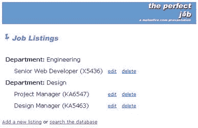
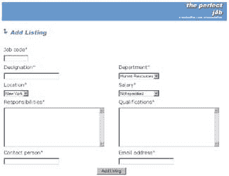
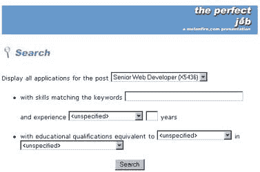

# 完美的工作——第二部分

> 原文：<https://www.sitepoint.com/perfect-job-2/>

 ****##### 未竟事业** 

在本文的第一部分中，我解释了一些通常与人力资源部门的数据管理相关的问题，并为一个基于 Web 的应用程序整理了一个功能规范，以简化任务。在构建了一个基本的数据库模式并将其规范化之后，我开始开发脚本来显示工作列表，接受用户应用程序，并将这些应用程序存储在数据库中。

虽然本文的第一部分描述了用户体验，但我还没有解决用新信息更新工作公告板、删除现有条目或搜索潜在候选人的问题——所有这些都是该应用程序初始功能集的一部分。因此，在这篇总结文章中，我将通过查看管理员在这样一个系统中需要完成的一些任务，并开发一些简单的脚本来完成这些任务，来结束本文。

##### 管理员喂！

如果您还记得，当我第一次将“listings”表放在一起时，我添加了几个虚拟条目，只是为了让事情运转起来。

现在，在应用程序开发的早期阶段，这很好……但是你不能期望你的客户每次需要更新工作列表时都会弹出一个 mySQL 提示。首先，他们可能不具备操作 mySQL 数据库所必需的技术敏锐度；另一方面，比起难看的命令行，他们可能更喜欢漂亮的 GUI。不管怎样，作为开发人员，您也有责任将这些功能打包到您的应用程序中。

因此，我将首先为管理员创建一个入口点，就像我为用户创建入口点一样。该页面将作为不同可用管理功能的菜单。

```
<?  

// admin.php - admin functions entry point 

// includes 

// open connection to database 

$connection = mysql_connect($hostname, $user, $pass) or die  

("Unable to connect!"); 

// get list of departments with open jobs 

$query = "SELECT DISTINCT id, department from department, listing WHERE  

department.id = listing.fk_department"; 

$result = mysql_db_query($database, $query, $connection) or die ("Error  

in query: $query. " . mysql_error()); 

// generate a table 

echo "<table border=0 cellspacing=5 cellpadding=5>"; 

// iterate through resultset 

while(list($id, $department) = mysql_fetch_row($result)) 

{ 

// print department name 

echo "<tr><td colspan=4><b>Department:</b> $department</td></tr>"; 

// look for jobs within the department and print as list,  

add edit and delete links 

$query2 = "SELECT jcode, designation from listing WHERE  

listing.fk_department = '$id'"; 

$result2 = mysql_db_query($database, $query2, $connection) or die  

("Error in query: $query2\. " . mysql_error()); 

while(list($jcode, $dsg) = mysql_fetch_row($result2)) 

{ 

echo "<tr><td width=10>&nbsp;</td><td>$dsg ($jcode)</td>  

<td><a href=edit.php?jcode=$jcode> 

<font size=-1>edit</font></a></td> <td><a href=delete.php?jcode=$jcode> 

<font size=-1>delete</font> 

</a></td></tr>"; 

} 

} 

echo "</table>"; 

?> 

<!-- snip --> 

<a href="add.php">Add a new listing</a> or <a href="search.php">search  

the database</a> 

<!-- snip -->
```

这是它的样子。



如您所见，除了每个作业旁边的编辑和删除链接之外，它几乎与用户入口点相同。其中的每一个都调用一个脚本来执行适当的功能。页面底部还包括添加新列表或在数据库中搜索潜在候选人的链接。

这里应该注意的是，对所有这些管理脚本的访问应该仅限于特权用户。最简单的方法是将它们移动到一个单独的目录中，并使用基于 Web 的身份验证来保护它。

版权所有[梅龙菲尔](http://www.melonfire.com/)，2000 年。保留所有权利。

##### 雪上加霜

脚本“add.php”显示一个表单，允许管理员向系统添加新的工作列表。该脚本分为两部分——一部分显示表单，另一部分处理输入其中的数据。`$submit` 变量用于决定执行脚本的哪一部分。

```
<?  

// form not yet submitted  

if (!$submit)  

{  

// open connection to database  

$connection = mysql_connect($hostname, $user, $pass) or die  

("Unable to connect!");  

?>  

<table border="0" cellspacing="5" cellpadding="2">  

<form action="<? echo $PHP_SELF; ?>" method="POST">  

<!-- input job details -->  

<tr>  

<td>Job code<font color="red">*</font></td>  

</tr>  

<tr>  

<td><input type="text" name="jcode" size="10" maxlength="10"></td>  

</tr>  

<tr>  

<td>Designation<font color="red">*</font></td>  

<td width=30>&nbsp;</td>  

<td>Department<font color="red">*</font></td>  

</tr>  

<tr>  

<td><input type="text" name="dsg" size="25"></td>  

<td width=30>&nbsp;</td>  

<td><select name="dpt">  

<?  

// get department list  

$query = "SELECT id, department from department";  

$result = mysql_db_query($database, $query, $connection) or die   

("Error in query: $query. " . mysql_error());  

while (list($id, $department) = mysql_fetch_row($result))  

{  

echo "<option value=$id>$department</option>";  

}  

mysql_free_result($result);  

?>  

</select></td>  

</tr>  

<tr>  

<td>Location<font color="red">*</font></td>  

<td width=30>&nbsp;</td>  

<td>Salary<font color="red">*</font></td>  

</tr>  

<tr>  

<td><select name="loc">  

<?  

// get location list  

$query = "SELECT id, location from location";  

$result = mysql_db_query($database, $query, $connection) or die   

("Error in query: $query. " . mysql_error());  

while (list($id, $location) = mysql_fetch_row($result))  

{  

echo "<option value=$id>$location</option>";  

}  

mysql_free_result($result);  

?>  

</select></td>  

<td width=30>&nbsp;</td>  

<td><select name="sal">  

<?  

// get salary list  

$query = "SELECT id, salary from salary";  

$result = mysql_db_query($database, $query, $connection) or die   

("Error in query: $query. " . mysql_error());  

while (list($id, $salary) = mysql_fetch_row($result))  

{  

echo "<option value=$id>$salary</option>";  

}  

mysql_free_result($result);  

mysql_close($connection);  

?>  

</select></td>  

</tr>  

<tr>  

<td>Responsibilities<font color="red">*</font></td>  

<td width=30>&nbsp;</td>  

<td>Qualifications<font color="red">*</font></td>  

</tr>  

<tr>  

<td><textarea name="rsp" cols="40" rows="8"></textarea></td>  

<td width=30>&nbsp;</td>  

<td><textarea name="qlf" cols="40" rows="8"></textarea></td>  

</tr>  

<tr>  

<td>Contact person<font color="red">*</font></td>  

<td width=30>&nbsp;</td>  

<td>Email address<font color="red">*</font></td>  

</tr>  

<tr>  

<td><input type="text" name="cname" size="25"></td>  

<td width=30>&nbsp;</td>  

<td><input type="text" name="cmail" size="25"></td>  

</tr>  

<tr>  

<td align=center colspan=3><input type=submit   

name=submit value="Add Listing"></td>  

</tr>  

</table>  

</form>  

<?  

}  

else  

{  

// form submitted, process it  

}  

?>
```

这是它的样子。



这里没有什么太复杂的——这只是一个简单的表单，有一些工作列表元素的文本字段，还有一些下拉框。您会注意到下拉列表中的项目是从数据库中生成的；你可能还记得上次的内容。

还要注意`<FORM>` 标签的 `ACTION` 属性，它指向一个名为`$PHP_SELF`的 PHP 变量。这是一个内置的 PHP 变量，它总是保存当前正在执行的脚本的名称；通过在这里包含它，我确保了同样的脚本也被调用来处理表单。

一旦表单被提交，相同的脚本被再次调用；然而，由于`$submit` 变量现在已经存在，脚本的后半部分开始起作用。

```
<?  

// form not yet submitted  

if (!$submit)  

{  

// generate form  

}  

else  

{  

// form submitted, process it  

// set up error list array  

$errorList = array();  

$count = 0;  

// validate text input fields  

if (empty($jcode)) { $errorList[$count] = "Invalid entry: Job code";   

$count++; }  

if (empty($dsg)) { $errorList[$count] = "Invalid entry: Designation";   

$count++; }  

if (empty($rsp)) { $errorList[$count] = "Invalid entry:   

Responsibilities"; $count++; }  

if (empty($qlf)) { $errorList[$count] = "Invalid entry: Qualifications";   

$count++; }  

if (empty($cname)) { $errorList[$count] = "Invalid entry: Contact name";   

$count++; }  

if (empty($cmail) || isEmailInvalid($cmail)) { $errorList[$count] =   

"Invalid entry: Email address"; $count++; }  

if (sizeof($errorList) == 0)  

{  

// open connection to database  

$connection = mysql_connect($hostname, $user, $pass) or die   

("Unable to connect!");  

// insert data  

$query = "INSERT INTO listing (jcode, designation, responsibilities,   

qualifications, cname, cmail, posted, fk_department, fk_location,   

fk_salary)   

VALUES ('$jcode', '$dsg', '$rsp', '$qlf', '$cname', '$cmail',   

NOW(), '$dpt', '$loc', '$sal')";  

$result = mysql_db_query($database, $query, $connection) or die   

("Error in query: $query. " . mysql_error());  

// clean up  

mysql_close($connection);  

echo "Entry successfully added.<p><a href=$PHP_SELF>Add   

another entry</a>, or   

<a href=job_list.php>return to job listings</a>";  

}  

else  

{  

listErrors();  

}  

}  

?>
```

此处使用的错误检查机制应该与上一篇文章中的工作申请表很相似……尽管此处的验证例程稍微简单一些，因为该表单远没有那么复杂。

一旦数据通过验证并被认为是可接受的，一个`INSERT`查询会将数据保存到“列表”表中，这样它会立即出现在工作列表页面上。
<font size="1" color="#aaaaaa" face="Verdana,Arial,Helvetica">版权[梅龙费尔](http://www.melonfire.com/)，2000 年。保留所有权利。</font>

##### 改变周围的事物

“edit.php”脚本几乎相同；它接受一个工作列表，连接到数据库，检索记录，并显示一个填写了值的表单。管理员现在可以更新列表并将其保存回数据库。

```
<?   

// edit.php - edit job listing   

// form not yet submitted   

if (!$submit)   

{   

// open connection to database   

$connection = mysql_connect($hostname, $user, $pass) or die    

("Unable to connect!");   

// get job details   

$query = "SELECT designation, jcode, fk_department,    

fk_location, fk_salary, responsibilities, qualifications,    

cname, cmail from listing WHERE jcode = '$jcode'";   

// snip   

list($designation, $jcode, $department, $location,    

$salary, $description, $qualification, $cname, $cmail,   

$posted) = mysql_fetch_row($result);   

// display form with values pre-filled   

?>   

<!-- snip -->   

<table border="0" cellspacing="5" cellpadding="2">   

<form action="<? echo $PHP_SELF; ?>" method="POST">   

<input type=hidden name="jcode" value="<? echo $jcode; ?>">   

<!--  job details -->   

<tr>   

<td>Designation<font color="red">*</font></td>   

<td width=30>&nbsp;</td>   

<td>Department<font color="red">*</font></td>   

</tr>   

<tr>   

<td><input type="text" name="dsg" size="25" value="<? echo    

$designation; ?>"></td>   

<td width=30>&nbsp;</td>   

<td><select name="dpt">   

<?   

// get department list   

$query = "SELECT id, department from department";   

$result = mysql_db_query($database, $query, $connection) or die    

("Error in query: $query. " . mysql_error());   

while (list($id, $dpt) = mysql_fetch_row($result))   

{   

echo "<option value=$id";   

// pre-select value   

if ($id == $department)   

{   

echo " selected";   

}   

echo ">$dpt</option>";   

}   

mysql_free_result($result);   

?>   

</select></td>   

</tr>   

<!-- and so on -->   

<tr>   

<td align=center colspan=3><input type=submit name=submit    

value="Update Listing"></td>   

</tr>   

</table>   

</form>   

<?   

}   

else   

{   

// form submitted, process   

}   

?>
```

一旦提交了表单，就会执行一个`UPDATE`查询，用新信息更新数据库。

```
<?   

// form not yet submitted   

if (!$submit)   

{   

// generate form   

}   

// form submitted, process   

else   

{   

// set up error list array   

$errorList = array();   

$count = 0;   

// validate text input fields   

if (sizeof($errorList) == 0)   

{   

// no errors   

// open connection to database   

$connection = mysql_connect($hostname, $user, $pass) or die    

("Unable to connect!");   

// update data   

$query = "UPDATE listing SET designation='$dsg',    

responsibilities='$rsp',    

qualifications='$qlf', cname='$cname', cmail='$cmail',    

fk_department='$dpt', fk_location='$loc', fk_salary='$sal' WHERE    

jcode='$jcode'";   

$result = mysql_db_query($database, $query, $connection) or die    

("Error in query: $query. " . mysql_error());   

// clean up   

mysql_close($connection);   

// redirect   

header("Location:admin.php");   

}   

else   

// errors, display   

{   

listErrors();   

}   

}   

?>
```

“delete.php”脚本是所有脚本中最简单的。它接受一个作业代码，连接到数据库，找到适当的记录，并将浏览器重定向回菜单。

```
<?   

// delete.php - delete job listing   

// includes and error checks   

// open connection to database   

$connection = mysql_connect($hostname, $user, $pass) or die    

("Unable to connect!");   

// delete record   

$query = "DELETE FROM listing WHERE jcode = '$jcode'";   

$result = mysql_db_query($database, $query, $connection) or die    

("Error in query: $query. " . mysql_error());   

mysql_close($connection);   

// redirect   

header("Location:admin.php");   

?>
```

正如我用这些脚本来修改“listing”表一样，如果您愿意，您可以开发额外的脚本来修改其他辅助表——“country”、“salary”等。也就是说，应该注意的是，并非所有的表格都会定期更改(例如，您多久更新一次国家列表？)一些表将建立初始记录集，并且将长期保持不变，而其他表可能每周改变；作为开发人员，您应该预测客户可能的需求，并适当地开发管理模块。

版权所有[梅龙菲尔](http://www.melonfire.com/)，2000 年。保留所有权利。

##### 拼命寻找 Perl 大师

接下来，搜索功能。这可能是此类系统中最常用的功能，因为它允许管理员快速提取一组符合预定义标准的应用程序。和以前一样，这个脚本有两个部分，一部分用于表单，另一部分用于处理器。

```
<?     

// search.php - search for specific applications    

// includes    

// open connection to database    

$connection = mysql_connect($hostname, $user, $pass) or die     

("Unable to connect!");    

if(!$submit)    

{    

// form not yet submitted, display form    

?>    

<html>    

<head>    

<basefont face="Verdana" size="2">    

</head>    

<body bgcolor=white>    

<? $image="search.jpg"; ?>    

<? include("header.inc.php"); ?>    

<form action="<? echo $PHP_SELF; ?>" method="post">    

Display all applications for the post     

<select name="jcode">    

<?    

// get list of open jobs    

$query = "SELECT DISTINCT jcode, designation from listing";    

$result = mysql_db_query($database, $query, $connection) or die     

("Error in query: $query. " . mysql_error());    

// and print    

while(list($jcode, $designation) = mysql_fetch_row($result))    

{    

echo "<option value=$jcode>$designation ($jcode)</option>";    

}    

mysql_free_result($result);    

?>    

</select>    

<p>    

<ul>    

<li>with skills matching the keywords    

<input type=text name=skills size=35>    

<p>    

and experience     

<select name=exp_modifier>    

<option value="">&lt;unspecified&gt;</option>    

<option value="=">equal to</option>    

<option value=">=">greater than or equal to</option>    

<option value="<=">less than or equal to</option>    

</select>    

<input type=text name=years size=2 maxlength=2>    

years    

<p>    

<li>with educational qualifications equivalent to    

<select name="degree">    

<option value="">&lt;unspecified&gt;</option>    

<?    

// get list of degrees    

$query = "SELECT id, degree from degree";    

$result = mysql_db_query($database, $query, $connection) or die     

("Error in query: $query. " . mysql_error());    

while(list($id, $degree) = mysql_fetch_row($result))    

{    

echo "<option value=$id>$degree</option>";    

}    

mysql_free_result($result);    

?>    

</select>    

in    

<select name=subject>    

<option value="">&lt;unspecified&gt;</option>    

<?    

// get list of subjects    

$query = "SELECT id, subject from subject";    

$result = mysql_db_query($database, $query, $connection) or die     

("Error in query: $query. " . mysql_error());    

while(list($id, $subject) = mysql_fetch_row($result))    

{    

echo "<option value=$id>$subject</option>";    

}    

mysql_free_result($result);    

?>    

</select>    

</ul>    

<center>    

<input type="submit" name="submit" value="Search">    

</center>    

</form>    

<?    

}    

else    

{    

// form submitted, search    

}    

// clean up    

mysql_close($connection);     

?>    

</body>    

</html>
```

下面是表单的样子。



我在这里实现了两个不同级别的搜索。第一层只是显示特定职位的所有申请，从下拉列表中选择。当你需要统计收到的对某个特定列表的回应的申请数量，或者不太确定你在寻找什么，只需要浏览一堆简历时，这就非常方便了。

通过指定候选人应具备的教育资格和/或技能和经验的类型，可以进一步完善该列表。虽然教育资格(学位和科目)可以从列表中选择，但技能可以输入到自由格式的文本字段中，由空格分隔。管理员还可以使用一组比较运算符来指定所需的专业知识水平。

版权所有[梅龙菲尔](http://www.melonfire.com/)，2000 年。保留所有权利。

##### 积木

提交表单后，将生成一个基本查询，返回特定职务的申请列表。然后，根据选择的标准，用 AND 子句进一步修改基本查询，以优化结果列表。

```
<?      

// search.php - search for specific applications     

// includes     

// open connection to database     

$connection = mysql_connect($hostname, $user, $pass) or die      

("Unable to connect!");     

if(!$submit)     

{     

// form not yet submitted, display form     

}     

else     

{     

// form submitted, search     

// check for missing parameters     

if (!$jcode || $jcode == "")     

{     

header("Location:error.php");     

exit;     

}     

// set up basic query and joins     

$query = "SELECT DISTINCT r_user.rid, r_user.lname,      

r_user.fname, r_user.email from r_user, r_skill, r_education      

WHERE r_user.jcode = '$jcode'";     

// if skills criteria selected     

if(!empty($skills) && !empty($exp_modifier) && !empty($years))     

{     

// modify query further     

$query .= " AND r_user.rid = r_skill.rid  AND (";     

// tokenize keyword list     

$keywords = split(" ", $skills);     

// iterate through list     

for ($x=0; $x<sizeof($keywords); $x++)     

{     

trim($keywords[$x]);     

// this searches for skill1 AND skill2 AND ...     

// make this OR if you want an OR-type search     

if($x != 0)     

{     

$query .= " AND";     

}      

$query .= " (r_skill.skill LIKE '%" . $keywords[$x] ."%' AND      

r_skill.experience " .  $exp_modifier . $years . " )";     

}     

$query .= ")";     

}     

// if education criterial selected     

if(!empty($degree) && !empty($subject))     

{     

// modify query further     

$query .= " AND r_user.rid = r_education.rid AND      

r_education.fk_degree = '$degree' AND     

r_education.fk_subject = '$subject'";     

}     

// execute query     

$result = mysql_db_query($database, $query, $connection) or die      

("Error in query: $query. " . mysql_error());     

// number of records found     

$count = mysql_num_rows($result);     

// uncomment for debug purposes - echo the query     

// echo $query . "<p>";     

?>     

<html>     

<head>     

<basefont face="Verdana" size="2">     

</head>     

<body bgcolor=white>     

<? $image="search.jpg"; ?>     

<? include("header.inc.php"); ?>     

Your search returned <? echo $count; ?> match(es)     

<p>     

<ul>     

<?     

// list matches     

while (list($rid, $lname, $fname, $email) = mysql_fetch_row($result))     

{     

echo "<li><a href=resume_details.php?rid=$rid>$lname,      

$fname &lt;$email&gt;</a>";     

}     

?>     

</ul>     

<?     

}     

// clean up     

mysql_close($connection);      

?>     

<? include("footer.inc.php"); ?>     

</body>     

</html>
```

请特别注意设置技能查询的部分。因为 skills 字段是由空格分隔的值列表，所以有必要首先拆分列表，并为每个值创建一个 SQL 子句。然后用 AND 连接词将这些子句连接在一起，以确保结果集包含指定的所有技能(如果您喜欢技能的任何一个，您可以将其改为 OR(T2))。

最终结果将是一个姓名和电子邮件地址的列表，链接到一个显示候选人详细信息的脚本。

当然，这只是搜索引擎的一种选择。有许多可能的配置，您可能需要根据您的具体要求进行修改。

例如，其中一个明显的缺陷是，它假设每个被选择的技能都有相同的专业水平——我不可能找到有三年 Perl 经验和五年 C++经验的候选人。为了实现这一点，我需要创建多个技能-经验字段对，并对每个字段进行查询。

还应该注意，对于这种关键字搜索技术，有一种替代方法。目前，我的申请表允许申请人以他们想要的任何格式输入技能(每个技能是一个文本字段，而不是一个列表。)相反，如果我有一份详尽的可用技能列表，我可以让候选人只需从列表框中选择，为收集的数据增加一个额外的完整性级别。这也将使搜索过程更加有效，因为它去掉了上面查询中的通配符和`LIKE` 子句。

这种方法的缺点是，由于你将候选人限制在一个预先定义的工作技能列表中，这个列表必须足够详尽，以涵盖所有的可能性。由于这似乎很难，我决定不采用这种方法，而是采用自由形式的方法…但是如果它对你有用，你可能会想考虑它。

版权所有[梅龙菲尔](http://www.melonfire.com/)，2000 年。保留所有权利。

##### 细节决定成败

“resume_details.php”脚本代表管理员体验的终点。其目的是将存储在各种表中的关于特定候选人的所有信息汇编成一个复合数据表，并以结构化格式显示出来。

```
<?       

// resume_details.php - build a resume      

// includes      

include("config.php");       

include("functions.php");       

// check for missing parameters      

if (!$rid || $rid == "")      

{      

header("Location:error.php");      

exit;      

}      

// open connection to database      

$connection = mysql_connect($hostname, $user, $pass) or die       

("Unable to connect!");      

// get personal information      

$query = "SELECT fname, lname, dob, addr1, addr2, city, state,       

zip, country, phone, email, url, relo, posted from r_user,       

country WHERE r_user.fk_country = country.id AND rid = '$rid'";      

$result = mysql_db_query($database, $query, $connection) or die       

("Error in query: $query. " . mysql_error());      

// error check      

if (mysql_num_rows($result) <= 0)      

{      

header("Location:error.php");      

exit;      

}      

else      

{      

// obtain data from resultset      

list($fname, $lname, $dob, $addr1, $addr2, $city, $state, $zip,       

$country, $phone, $email, $url, $relo, $posted) =       

mysql_fetch_row($result);      

?>      

<html>      

<head>      

<basefont face="Verdana" size="2">      

</head>      

<body bgcolor=white>      

<? $image="resume.jpg"; ?>      

<? include("header.inc.php"); ?>      

      

<br>      

<b>Name:</b> <? echo $fname . " " . $lname; ?>      

<p>      

<b>Date of birth:</b> <? echo fixDate($dob); ?>      

<p>      

<b>Address:</b><br> <? echo "$addr1<br>"; if($addr2)       

{ echo "$addr2<br>"; }       

echo "$city $zip<br>$state, $country"; ?>      

<p>      

<b>Phone:</b> <? echo $phone; ?>      

<p>      

<b>Email address: </b><a href="mailto:<? echo $email; ?>">      

<? echo $email; ?></a>      

<p>      

<b>Web site:</b> <? if($url) { echo "<a target=new       

href=$url>$url</a>"; }       

else { echo "None"; } ?>      

<p>      

<?      

// get education history      

$query = "SELECT institute, degree, subject, year from r_education,       

degree, subject WHERE r_education.fk_degree = degree.id AND       

r_education.fk_subject = subject.id AND rid = '$rid' ORDER BY year";      

$result = mysql_db_query($database, $query, $connection) or die       

("Error in query: $query. " . mysql_error());      

if(mysql_num_rows($result) > 0)      

{      

echo "<br>";      

while (list($institute, $degree, $subject, $year ) =       

mysql_fetch_row($result))      

{      

echo "<b>Institute:</b> $institute<br>";      

echo "<b>Degree:</b> $degree ($subject, $year)<p>";      

}      

}      

?>      

<?      

// get employment history      

$query = "SELECT employer, industry, start_year, end_year,       

responsibilities from r_employment, industry WHERE       

r_employment.fk_industry = industry.id AND       

rid = '$rid' ORDER BY end_year"; $result = mysql_db_query($database,       

$query, $connection) or die ("Error in query: $query. " . mysql_error());      

if(mysql_num_rows($result) > 0)      

{      

echo "<br>";      

while (list($employer, $industry, $start_year,       

$end_year, $responsibilities) = mysql_fetch_row($result))      

{      

echo "<b>Employer</b>: $employer ($start_year-$end_year)<br>";      

echo "<b>Industry</b>: $industry<br>";      

echo "<b>Responsibilities</b>: <br>$responsibilities<p>";      

}      

}      

?>      

<?      

// get skills      

$query = "SELECT skill, experience from r_skill WHERE       

rid = '$rid' ORDER BY experience";      

$result = mysql_db_query($database, $query, $connection) or die       

("Error in query: $query. " . mysql_error());      

if(mysql_num_rows($result) > 0)      

{      

echo "<br>";      

while (list($skill, $experience) = mysql_fetch_row($result))      

{      

echo "<b>$skill</b><br>";      

echo "$experience years experience<p>";      

}      

}      

?>      

<?      

// get references      

$query = "SELECT name, phone, email from r_reference WHERE rid = '$rid'";      

$result = mysql_db_query($database, $query, $connection) or die       

("Error in query: $query. " . mysql_error());      

if(mysql_num_rows($result) > 0)      

{      

echo "<br>";      

while (list($name, $phone, $ref_email) = mysql_fetch_row($result))      

{      

echo "<b>Name:</b> $name<br>";      

echo "<b>Phone:</b> $phone<br>";      

if ($ref_email) { echo "<b>Email address:</b>       

<a href=mailto:$ref_email>$ref_email</a><p>"; } else { echo "<p>"; }      

}      

}      

mysql_close($connection);      

?>      

      

<br>      

<b>Willing to relocate:</b> <? if($relo == 1) { echo "Yes"; }       

else { echo "No"; } ?>      

<p>      

Resume posted on <b><? echo fixDate($posted); ?></b>      

<p>      

<a href="javascript:history.back()">Go back to applicant list</a>, or       

<a href="search.php">search again</a>      

<? include("footer.inc.php"); ?>      

</body>      

</html>      

<?      

}      

?>
```

这里没有什么太复杂的东西——有五个主要部分，这个脚本查询相应的五个表来构建一个数据表，其中包含候选人的个人信息、就业历史、教育资格、推荐人和技能——实际上，这与“apply_rslt.php”脚本正好相反。该数据表包含人力资源经理联系候选人并开始招聘过程所需的所有信息。

版权所有[梅龙菲尔](http://www.melonfire.com/)，2000 年。保留所有权利。

##### 处理灰色区域

最后一个脚本——也是最简单的——是错误处理程序“error.php”。如果您查看源代码，您会注意到这个脚本的许多链接；非常简单，“error.php”截获错误，并将其转换为人类可读的错误消息，然后显示给用户。

```
<html>       

<head>       

<basefont face="Verdana" size="2">       

</head>       

<body bgcolor=white>       

<? $image="error.jpg"; ?>       

<? include("header.inc.php"); ?>       

There was an error accessing the page you requested. Please        

<a href="job_list.php">return to the main page</a> and try again.       

<? include("footer.inc.php"); ?>       

</body>       

</html>
```

##### 残局

这个案例研究到此结束。在整个开发过程中，我广泛使用了数据库规范化技术、PHP 的内置函数、HTTP 头和 mySQL 数据库查询。如果您是 PHP 新手，我希望这些努力对您有所启发，并帮助您更好地理解这些强大的开源工具。

如果您想进一步了解本文中描述的一些问题，这里有几个链接:

用 HTTP 认证保护网页:[http://www.apacheweek.com/issues/96-10-18#userauth](http://www.apacheweek.com/issues/96-10-18#userauth)

PHP 中可用的 mySQL 函数:[http://www.php.net/manual/en/ref.mysql.php](http://www.php.net/manual/en/ref.mysql.php)

我相信，像前面几页所描述的这种工具对任何组织的招聘工作都有极大的好处。通过以电子格式获取和存储信息，它减少了文书工作；通过在用户信息上强加一个结构，它使得定位信息更加容易和快速；通过使用数据库，它可以确保数据不会被破坏。

还应该注意的是，这是该应用程序的初始版本，我希望它会随着新功能的添加和旧功能的升级而进一步发展。随着应用程序的发展，审查设计和代码总是一个好主意——我计划在这条路上再做一点，并对数据库模式和脚本本身进行更改。这个过程应该与新功能的开发计划一起进行，以便新功能的添加不会增加开销和导致性能下降。

不过，在那之前，我会喝一杯冷饮，看一本好书来放松一下。

*注意:本文中的所有例子都已经在装有 Apache 1.3.12、mySQL 3.23 和 PHP 4.02 的 Linux/i586 上进行了测试。这些示例仅用于说明，并不适用于生产环境。YMMV！*

## 分享这篇文章**