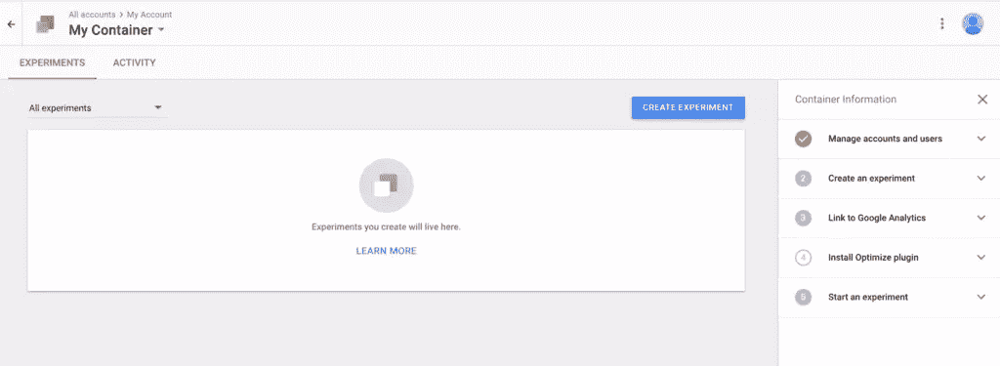
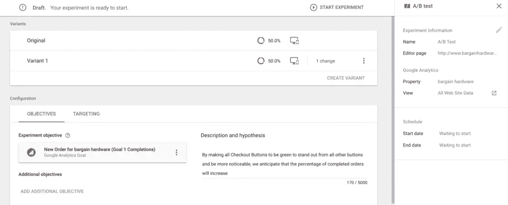
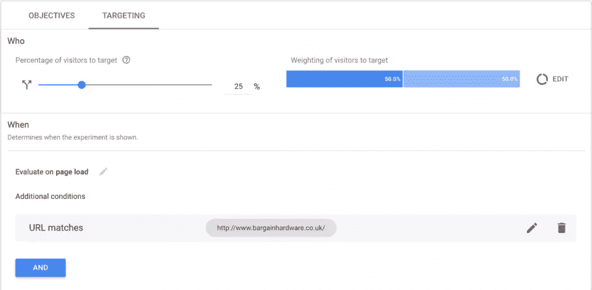
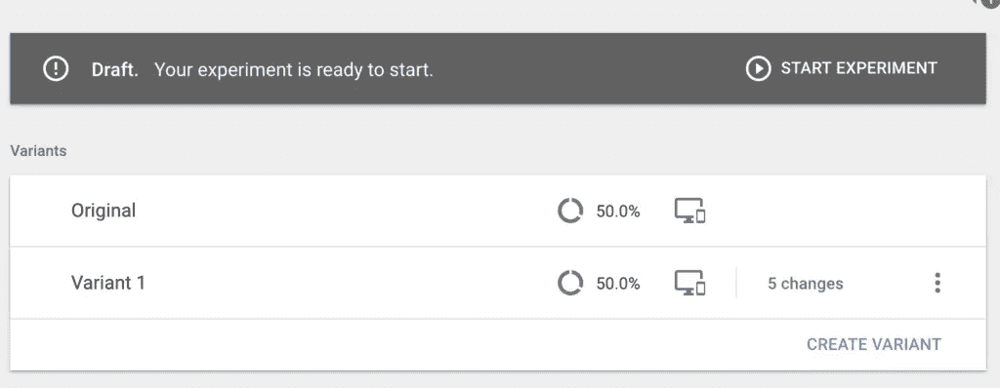
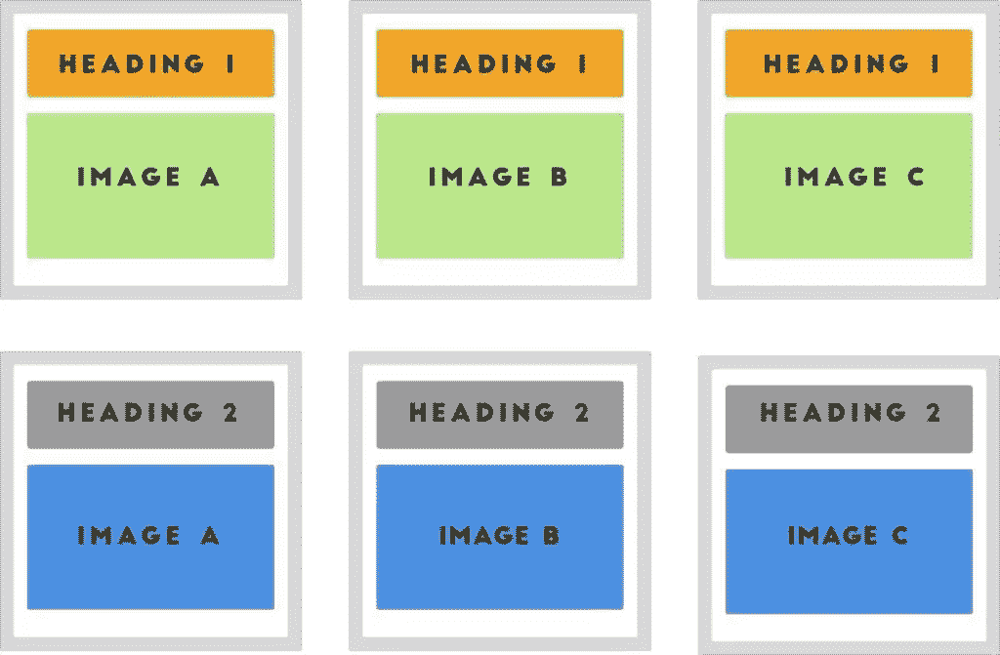
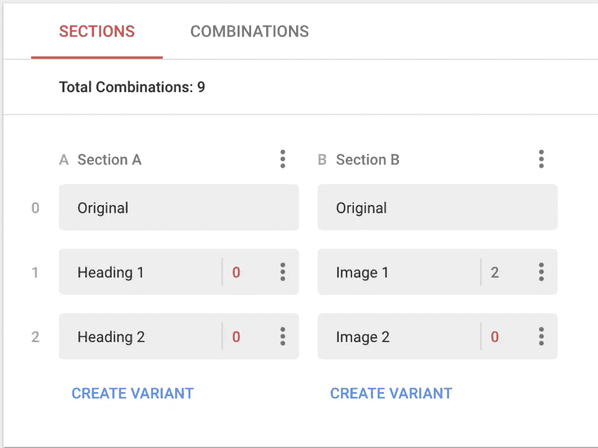
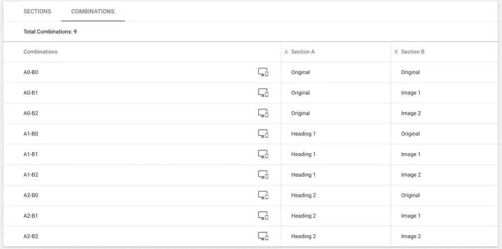
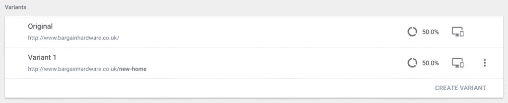

# 如何用谷歌优化执行 A/B 测试

> 原文：<https://www.sitepoint.com/perform-ab-testing-google-optimize/>

**[谷歌优化](https://www.google.com/analytics/optimize/)是谷歌针对网站的 A/B 测试工具。与大多数谷歌应用程序一样，谷歌优化免费提供了许多功能，当你的 A/B 测试需求变得更加复杂时，它会提供一个企业级功能。在本文中，我将向您展示如何使用 Google Optimize 通过试验各种变化来做出数据驱动的设计决策，以查看哪种转换更好。**

谷歌做得很好，通过消除对网络开发者的需求，使谷歌优化工具真正易于使用，使所有网站所有者都可以使用。更好的是，Google Optimize 直接与 Google Analytics 中定义的任何事件和目标集成，使评估指标变得更加容易。如果您已经正确设置了目标和事件，那么使用 Google Optimize 进行 A/B 测试就像使用 Google Optimize 界面创建网页变体一样简单，选择相关目标进行评估，进行网站实验，然后等待分析结果。

典型的工作流程如下所示:

1.  你使用[谷歌分析来识别次优 UX](https://www.sitepoint.com/finding-problem-areas-on-your-website-with-google-analytics)

2.  你使用[可用性测试来提出解决方案](https://www.sitepoint.com/how-analytics-can-explain-your-abandoned-checkouts)

3.  你使用谷歌优化来测试解决方案。

在本文中，我将向您展示如何使用 Google Optimize 测试解决方案。

## 入门指南

注册并登录后，您将看到上面的屏幕，它帮助您快速有效地进行设置，如右侧所示。简而言之，你只需要将你的账户链接到相关的谷歌分析账户，创建实验，然后，就像谷歌分析一样，在你的网站上插入一段代码。之后，你就可以开始 A/B 测试了。

谷歌优化将引导你完成整个过程。

## 谷歌优化的 A/B 测试

用 Google Optimize 创建你的第一个 A/B 测试真的很容易。点击右上角的*创建实验*按钮，然后选择右手边的 *A/B 测试*选项，这时你会看到一个屏幕，要求你为 A/B 测试创建变体，并定义将作为评估标准的谷歌分析“目标”。(也就是说，一个“目标”可以是用户购买一个项目，如果变体 B 导致更多的转化，那么这就是我们将永久实施的获胜变体。)

当创建变体时，Google Optimize 可视化编辑器将帮助您重新排序元素、更改副本和/或重写 HTML/CSS 代码的某些方面。你希望你的变奏有多复杂取决于你自己。

一旦你创建了你的变体，你将需要从“目标”标签中选择相关的谷歌分析目标(成为你的实验的目标)，并添加一个描述或假设来解释预期的结果，以便将来你可以参考你的历史实验，并快速理解做这些实验背后的原因。

在这个阶段，你的 A/B 测试已经基本准备好了，应该是这样的:

现在，从技术上来说，我们可以通过点击*开始实验*按钮来进行这个实验，但是我建议你首先定制你的目标，以确保你的实验到达预期的受众。您可以定义接受此实验的访问者的百分比，并选择目标访问者的细分市场。(例如，您可以只针对返回的用户或来自特定国家的用户。这将取决于用户在你的网站上面临的问题——例如，可能只有特定的用户群体遇到了上述问题。)

当测试一个可能对你的网站有负面影响的高度实验性的改变时，定制目标非常有用。与其冒失去流量和/或收入的风险，你可以只向 25%的访问者展示这种变化，而其余 75%的访问者将会看到通常的变化。为此，在左侧的 *Who* 滑块中选择您希望包括在您的实验中的访问者的总百分比，然后通过单击右侧的 *Edit* 按钮来拆分这些用户中有多少百分比去了哪个变体。

在目标部分，你也将有机会只在特定事件发生时展示实验。(例如，如果用户选择“德国”作为他们的位置，那么显示针对德国用户的结帐变体。)要做到这一点，你需要在数据层添加一个定制的 JavaScript 事件(符合 Google Tag Manager 数据层规范，你可以在这里读到)。有关数据层以及如何使用它们的更多信息，请阅读[此处](https://support.google.com/360suite/optimize/answer/6301794?hl=en)。这是一件有些复杂的事情，但是为了创建一个简单的 A/B 测试，您不需要了解它。

恭喜你，你的 A/B 测试已经准备好了。只需点击右上角的“开始实验”按钮！

*专业提示:使用 Google Optimize，可以在侧边栏的实验选项中指定实验的开始和结束日期，这样你就可以提前为特定时间的事件做准备——例如在黑色星期五和万圣节切换图像和营销文案。*

## 多元测试

Google Optimize 最近增加了对**多元测试**的支持，这允许你进行更详细的实验。起初，这些测试可能看起来有点复杂，但是一旦理解了这个概念，它们实际上非常简单——而且非常有用。简而言之，这些测试包含不止一个变量。

假设您有一个“大标题”和一个背景图片，其中 KPI 用于衡量点击主 CTA 的用户。为了达到最好的转化率，标题和背景图片都需要相关和吸引人。但是哪种标题和图片的组合效果最好呢？

当你有这么多问题/变量时，多元测试可以给你答案。此图描述了当您想要测试多个变量和组合时，多元测试是如何工作的。

进入你的谷歌优化账户主页，点击*创建实验*，但这次选择*多元*选项。从这里开始，创建多变量测试与创建 A/B 测试非常相似。

您将决定哪些元素将包含变体，以及这些变体将是什么。在上面的例子中，有两个标题和三个图片，我们想测试每一个可能的组合，看看哪个转换更好。这意味着总共会有六种变化。

接下来，点击*组合*标签。每个标题将与另一部分的变体配对。然后，使用可视化编辑器定制每个变体(就像您对 A/B 测试所做的那样)，选择将用于评估结果的相关目标，并点击*开始实验*开始您的测试。

## 重定向测试

重定向测试是简单的实验，可以将[x]数量的访问者发送到一个完全不同的 URL。如果您需要进行比可视化编辑器所允许的更大范围的更改，这将非常有用。要运行重定向测试，使用您自己的资源创建一个 web 页面的变体，并将其托管在一个完全不同的 URL 上。接下来，以与之前相同的方式创建一个实验，并从右边的栏中选择*重定向测试*选项开始。

同样的概念，我们只是重定向到一个新的网址。

## 结论

正如你所看到的，Google Optimize 为一个免费工具提供了一套非常全面的 A/B 测试工具，它真的很容易使用。此外，由于与谷歌分析的直接集成，定制受众定位非常简单。

Google Optimize 的付费版本提供了更多的多元测试功能，并且能够同时运行多个实验。当您的测试需求变得更加复杂时，升级是值得的，或者您可以尝试 A/B 测试中的领先工具，[optimized](https://www.sitepoint.com/optimizely-ab-testing-tools-knowing-which-is-right-for-you)。

## 分享这篇文章