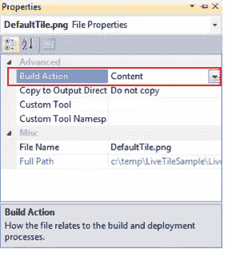
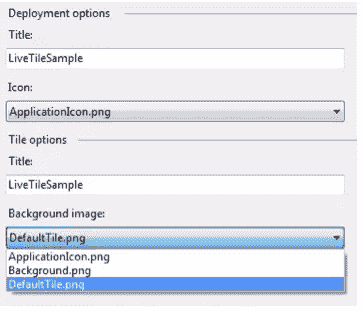

# 个性化 Windows Phone 7:动态磁贴

> 原文：<https://www.sitepoint.com/personalise-windows-phone-7-live-tiles/>

在我之前的帖子中，我讨论了 Windows Phone 7 平台上[开始屏幕和动态磁贴的重要性。从其他智能手机平台 Windows Phone 7 移植过来的应用程序通常不会创建默认的开始屏幕磁贴。一个静态的开始屏幕块只不过是一个应用程序图标，用户已经在应用程序列表中。因此，当您考虑 Windows Phone 7 应用程序时，您应该考虑如何更新磁贴以反映应用程序的状态。在这篇文章中，我们将介绍如何定义默认的开始屏幕区域，但更重要的是如何更新它。](https://www.sitepoint.com/get-pinned-windows-phone-7-live-tiles/)

默认的开始屏幕磁贴是当用户在应用程序列表中点击并按住您的应用程序，并选择“锁定开始”时，将显示在开始屏幕上的磁贴。当您创建新的 Windows Phone 7 应用程序时，项目模板将自动创建一个名为 Background.png 的图像，并配置您的应用程序使用它。正如您在图 1 中看到的，默认的开始屏幕磁贴相对来说很无聊，所以建议您更改它。

[](https://www.sitepoint.com/wp-content/uploads/2011/05/Figure111.png)

图 1

我们将开始定制这个图像，并将其保存为 DefaultTile.png(图 2 中的左图)。需要注意的一点是，图像的任何透明部分都将跟踪用户在 Windows Phone 7 设备上选择的强调颜色。这在图 2 的右图中示出，其中图块的背景被设置为透明而不是黑色，并且用户已经在设备上选择了绿色强调颜色。

[](https://www.sitepoint.com/wp-content/uploads/2011/05/Figure24.png)

图 2

将这个新创建的图像放入 Windows Phone 7 应用程序的项目文件夹中，与现有的 Background.png 放在一起。在 Visual Studio 中，右键单击解决方案资源管理器窗口中的 Windows Phone 7 项目，然后选择“添加>现有项”；找到新创建的图像并选择“添加”。默认情况下，Visual Studio 将添加“生成操作”属性设置为“资源”的图像。根据图 3，您需要将其更改为内容。

[](https://www.sitepoint.com/wp-content/uploads/2011/05/Figure32.png)

图 3

既然您已经将图像添加到了应用程序中，那么您需要确保它被选为默认的开始磁贴。在解决方案资源管理器窗口中右键单击 Windows Phone 7 项目，然后选择属性。选择 Application 选项卡应该会显示许多与应用程序的部署和安装相关的属性。图 4 展示了其中的两个部分:部署选项，它决定要在应用程序列表中显示的标题和图标；和 Tile options，它定义了当用户将应用程序锁定到开始时，在开始屏幕上显示的默认文本和背景图像。

[](https://www.sitepoint.com/wp-content/uploads/2011/05/Figure42.png)

图 4

在设计开始屏幕磁贴时，您应该知道标题文本将由 Windows Phone 7 操作系统呈现在背景图像的顶部。在某些情况下，您可能想要完全移除文本，因为它与您创建的图像冲突。不幸的是，如果您试图删除 Title 属性的值，或者将它设置为一个或多个空格，Visual Studio 会抱怨，坚持要求您指定一个标题值。

幸运的是，有一种方法可以解决这个问题，那就是直接修改 WMAppManifest.xml 文件(属性页面只是提供了这个文件的关键元素的漂亮的可视化表示)。如果通过在解决方案资源管理器窗口中双击 WMAppManifest.xml 文件来打开它，您将看到一个 PrimaryToken 元素。PrimaryToken 的子元素定义用作默认平铺的图像、计数和要使用的标题文本。在下面的代码片段中，Title 元素的值被设置为一个空格，它将显示在我们的新背景图像上书写的任何文本。

```
<PrimaryToken TokenID="LiveTileSampleToken" TaskName="_default">
    <TemplateType5>
        <BackgroundImageURI IsRelative="true" IsResource="false">DefaultTile.png</BackgroundImageURI>
        <Count>0</Count>
        <Title> </Title>
    </TemplateType5>
</PrimaryToken>
```

既然您已经指定了默认的起始图块，接下来您需要知道的是如何更新图块。这可以通过定义更新时间表来完成，操作系统将根据指定的时间表从远程服务器上的映像更新图块，或者通过图块推送通知来完成。

前者相对简单，只需要应用程序设置时间表。但是，它不允许应用程序立即或频繁更新切片，因为更新计划有一个最小阈值。

另一种方法是使用微软提供的通知服务向设备发送磁贴通知。这种配置比较复杂，但是可以让您很好地控制磁贴更新的时间，并且不仅可以更新背景图像，还可以更新磁贴上显示的标题和数量。

在本帖中，我们将介绍如何设置一个更新开始磁贴背景图片的时间表，关于推送通知的讨论留待以后的帖子。配置更新计划非常简单，只需创建“ShellTileSchedule”类的实例，设置适当的属性来定义计划，然后调用“Start”方法。

```
var schedule = new ShellTileSchedule();
    schedule.RemoteImageUri = new Uri("http://www.builttoroam.com/applicationstarttile.png");
    schedule.Recurrence = UpdateRecurrence.Interval;
    schedule.Interval = UpdateInterval.EveryHour;
    schedule.MaxUpdateCount = 24;
    schedule.StartTime = DateTime.Now;
    schedule.Start();
```

当您设置“ShellTileSchedule”时，您可以将其设置为在`Interval`循环或`Onetime`中从`RemoteImageUri`更新磁贴的背景图像。`Interval`可以设置为`EveryHour`、`EveryDay`、`EveryWeek`或`EveryMonth`。您还可以根据重复间隔指定图块更新的最大次数。如果你不指定`MaxUpdateCount`，图块将继续无限更新。

配置更新计划后，您需要调用 Start 方法来开始更新周期。“ShellTileSchedule”的一个限制是它不能立即更新起始磁贴。您可能需要等待一个小时左右才能进行第一次磁贴更新。

由于您只能为您的应用程序定义一个更新计划，如果您想要修改该计划，您只需创建另一个“ShellTileSchedule”实例并调用“Start”。新时间表将替换现有时间表。要取消起始图块的现有更新计划，只需创建一个新的“ShellTileSchedule”实例并调用“Stop”方法。

```
var schedule = new ShellTileSchedule();
    schedule.Stop();
```

在这篇文章中，你已经看到了如何创建和配置一个新的图像作为默认的开始磁贴。您还了解了如何为图块定义更新计划，该计划可用于定期更新应用程序的起始图块。下一次，我们将介绍如何使用推送通知来动态更新起始磁贴。

## 分享这篇文章