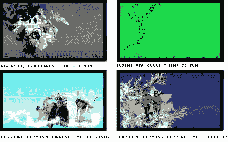

# 个性化媒体——看不见的视频

> 原文：<https://www.sitepoint.com/personalized-media-the-unseen-video/>

我喜欢好的，你知道什么是真正酷的 T2 吗？‘瞬间。

几年前，迈克·戴维森曾有过一个绝妙的想法，将他在普吉特海湾的实时照片直接上传到他的博客标题中。本质上，他的博客是在说“*黎明或黄昏，下雨，冰雹或阳光，这就是我此时此刻的位置*”——这是一个非常适合博客的想法。

跳转到 2006 年，丹尼尔·沙贝尔和费迪南德·韦罗瑟制作的看不见的视频巧妙地将这个想法转变为以你为中心，用户先生/女士，而不是他们自己，设计师先生/女士。

就其核心而言，“看不见的视频”只是一个庄严的、flash 驱动的音乐视频，用于迈克·米罗什的“*你让我感觉*”。然而，有趣的角度是，任何单次观看剪辑都是一次性的表演。

在加载过程中，应用程序首先通过 IP 数据库确定您的地理位置，然后使用该信息来确定您当地的时间和天气。这些信息然后被传递给 Flash，Flash 用它来影响调色板、装饰(花、花粉、雨、雪等)以及动画的角色和情绪。

根据费迪南和丹尼尔的说法:

> 他们总是不同的，但基本的动画总是在那里。根据天气情况，还有额外的雪、雨、花粉和云的动画。所有的视觉效果都是艺术和图形合成的。

在你第一次观看 15 分钟后重放该剪辑，会显示出编排上的细微差别。几个月后重放该剪辑会使其原始状态发生根本性的变化。

这是一个实验项目，但遗憾的是我们没有看到这个通用概念应用到更多的商业网站。如果 GAP(目前正在推广他们的春季系列)能够确定你是在寒冷的气候下浏览他们的网站，他们可能会用图形强调他们的冬季系列。也许一个加勒比海度假胜地在向加拿大北部的人推销时，可能会比南加州的人更强调它的温暖气候。

这并不是要取消选择 GAP 购物者很可能是在为他们的加勒比海之旅购物——但是，像任何商店橱窗一样，在任何给定时间你可以关注的商品数量是有限的。这种方法会增加你做出正确选择的机会。

有一个 [Flickr 流](http://www.flickr.com/groups/theunseenvideo/pool/)显示来自不同地点的结果，如果你得到一些有趣的东西，你甚至可能愿意贡献出来。

## 分享这篇文章