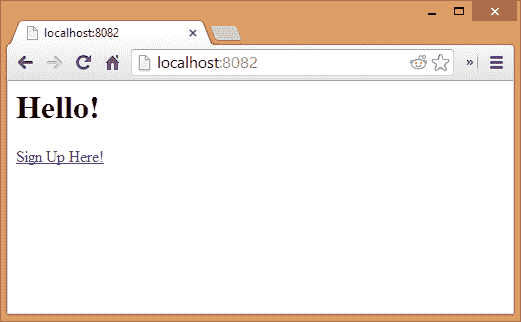
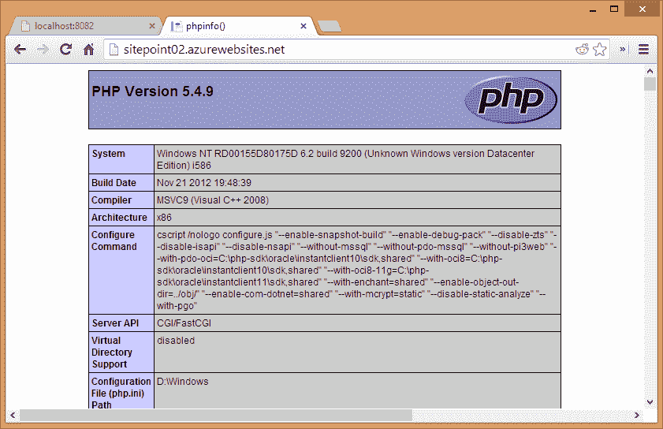
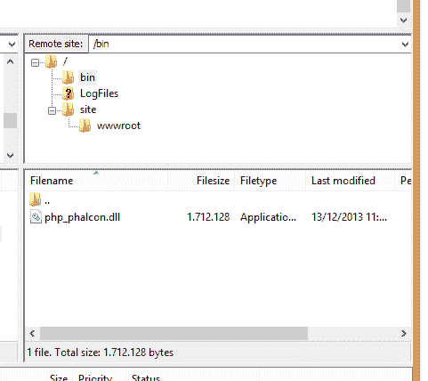
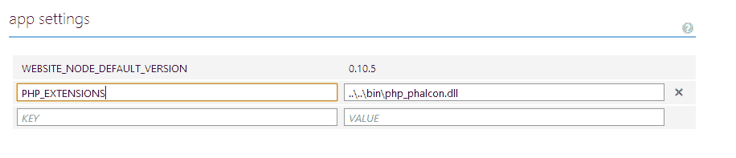
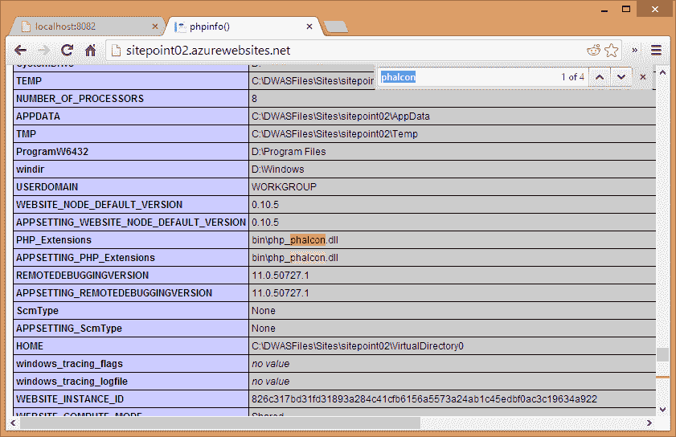
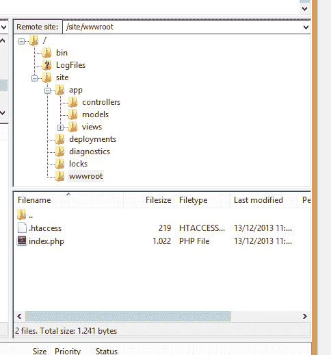
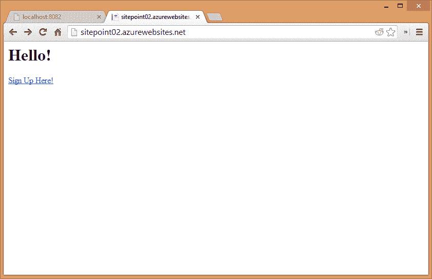

# Windows Azure 上的 Phalcon

> 原文：<https://www.sitepoint.com/phalcon-windows-azure/>

在我上一篇 [Windows Azure with PHP 文章](https://www.sitepoint.com/php-mysql-windows-azure-getting-started-deploying-git/)中，我们经历了在 Windows Azure 上部署一个 PHP+MySQL 应用的详细过程；但是每个 PHP 开发人员都知道不使用框架是没有意义的。重新发明轮子从来都不是一个好的选择，尤其是当你有这么多优秀的轮子可供选择的时候。

在本文中，我们将安装 Phalcon，这是我个人选择的框架。您可能会想“但是框架不就是类的集合吗？仅仅上传它们还不够吗？”。Phalcon 就不是这样了。Phalcon 是一个用 C 编写的 PHP 扩展，需要像任何其他扩展(mcrypt、xdebug 等)一样安装到 PHP 中——这使得它在各种共享主机环境中不可用，但这种复杂性也确保了使用它的人大多是专业人士。

要了解 Phalcon，请随意阅读我们之前关于这个主题的一些文章:
–[Phalcon 简介](https://www.sitepoint.com/phalconphp-yet-another-php-framework/)
–[谷歌应用引擎和对 Phalcon 的请求](https://www.sitepoint.com/google-app-engine-and-a-plea-for-phalcon/)
–[Zephir——在不了解 C 语言的情况下构建 PHP 扩展](https://www.sitepoint.com/zephir-build-php-extensions-without-knowing-c/)

## 准备的

使用[上一篇](https://www.sitepoint.com/php-mysql-windows-azure-getting-started-deploying-git/)文章的指导来建立一个新的空 PHP web 应用程序。或者，如果您不太喜欢上一篇文章中的应用程序，可以使用它。

鉴于 Windows Azure 是一个 Windows 环境，它的 PHP 扩展是。dll 文件。下载[Phalcon.dll](http://phalconphp.com/en/download/windows)。确保您获得 32 位版本(x86)，因为免费试用 Azure 帐户不支持 64 位环境。此外，获取名称中包含最新 PHP 版本的文件，该文件是 NTS(非线程安全的)。

不管您当前使用的是什么系统，也要确保您的本地环境中安装了 Phalcon。毕竟，在部署应用程序之前，我们需要一个地方来测试它。

克隆[示例应用](https://github.com/phalcon/tutorial)，将其放入您的 web 根目录，看看它是否工作。如果一切正常，您应该会在浏览器中看到以下屏幕:



如果你在配置时迷路了，Phalcon 文档提供了很好的教程，教你如何在每个流行的网络服务器上设置这个应用:[http://docs . phalconphp . com/en/latest/reference/install . html # installation-notes](http://docs.phalconphp.com/en/latest/reference/install.html#installation-notes)

你现在使用哪个操作系统或服务器并不重要——我几乎可以肯定你没有使用 IIS——所以最重要的是让应用程序正常工作。如果你进入上面的屏幕，在这里注册链接工作正常，并且在浏览器的地址栏中没有任何“index.php”工件的情况下重定向到正确的 url，我们就可以开始了。如果应用程序没有正常工作，尝试跟随他们的教程:[http://docs . phalconphp . com/en/latest/reference/tutorial . html # creating-a-project](http://docs.phalconphp.com/en/latest/reference/tutorial.html#creating-a-project)

## 安装 Phalcon 加长件

IIS 是 Azure 用来部署 PHP web 应用的服务器。鉴于 Phalcon 文档没有涵盖在服务器上设置框架，我们需要稍微做些临时准备。现在，如果你已经设置了一个 FTP 帐户，并且你的 Azure 应用已经启动并运行，我们就可以开始了。

首先，连接到应用程序的 FTP 服务器，并将`index.php`的内容更改为

```
<?php
phpinfo();
```

如果您现在在浏览器中访问应用程序的 URL，您应该会看到熟悉的 PHP 信息输出，列出已安装的扩展、环境细节等等。



现在让我们安装 Phalcon。首先在你的应用程序的根目录下创建一个`bin`目录。在 Azure 上，这是包含`index.php`的文件夹之上的两个文件夹——包含文件夹`LogFiles`和`site`的文件夹。将之前下载的 Phalcon.dll 文件上传到那个`bin`文件夹，这样你的目录结构看起来就像这样:



接下来，我们需要告诉 Azure 在哪里寻找扩展(就这一点而言，根本不需要寻找它)。进入 Azure 应用的“配置”部分，向下滚动到“应用设置”部分。在 KEY 下放入“PHP_EXTENSIONS ”,在 VALUE 下放入`..\..\bin\php_phalcon.dll`。小心道路上的反斜线！记住，我们用的是 Windows！



单击屏幕底部的保存完成，然后重新加载应用程序的 URL。如果您在显示的页面上搜索字符串“Phalcon ”,您应该得到类似于下面的输出:



费尔康已经安装好了。但是我们还远远没有完成。

## 上传和测试

接下来，让我们将代码上传到 Azure。我们不希望我们的应用程序的所有代码都在`wwwroot`文件夹中，因为该文件夹在网络上是公开的——每个人都可以访问它，所以需要考虑一些安全问题。而是将样本 app 的`public`文件夹的内容上传到`wwwroot`，将样本 app 的`app`文件夹上传到`site`文件夹，上一级。



刷新应用程序的 URL 应该会显示以下内容:



如果加载了此页面，这意味着安装了 Phalcon。然而，如果你尝试访问“在此注册”链接，你会得到*“你正在寻找的资源已被删除，已更名，或暂时不可用。”*错误信息。这是因为我们没有定义 URL 重写。鉴于我们现在在 IIS 上，Apache 的`.htaccess`文件无法工作。我们需要的是一个 Web.config 文件——相当于 IIS。

在你的应用程序的公共文件夹的根目录下(`public`在本地，`wwwroot`在 Azure)，创建文件`Web.config`，并给它以下内容:

```
<?xml version="1.0" encoding="utf-8" ?>
<configuration>
    <system.webServer>
        <rewrite>
            <rules>
                <rule name="Main Rule" stopProcessing="true">
                    <match url="(.*)" />
                    <conditions logicalGrouping="MatchAll">
                        <add input="{REQUEST_FILENAME}" matchType="IsFile" negate="true" />
                        <add input="{REQUEST_FILENAME}" matchType="IsDirectory" negate="true" />
                    </conditions>
                    <action type="Rewrite" url="index.php?_url=/{R:1}" />
                </rule>
            </rules>
        </rewrite>
    </system.webServer>
</configuration>
```

上述内容可以(也应该)根据每个应用程序进行调整，但本质上，这就是让`Web.config`文件表现得像`.htaccess`文件一样并使用`_url` GET 参数将所有请求重定向到`index.php`所要做的一切，就像 Phalcon 的说明一样。

请立即尝试访问“在此注册”链接。该页面应该会成功打开，显示一个注册表单。

## 结论

Azure 是一个非常通用的环境，允许部署定制的 PHP 运行时、扩展和所有类型的调整。掌握了安装最快的 PHP 框架的知识(这将显著降低你的 Azure 应用的运行成本！)，为什么不使用一款出色的 Phalcon 应用程序参加推动网络前进大赛呢？还有时间！

请在下面的评论中留下您的反馈，如果您喜欢这篇文章，请一如既往地分享它！

## 分享这篇文章