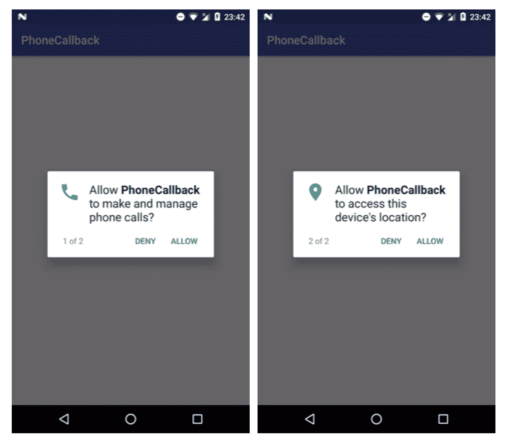
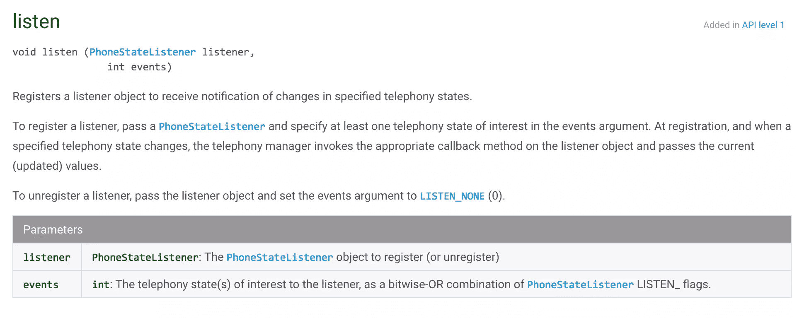
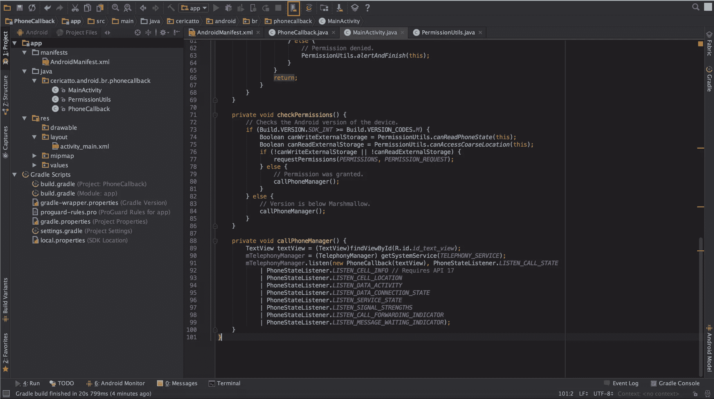
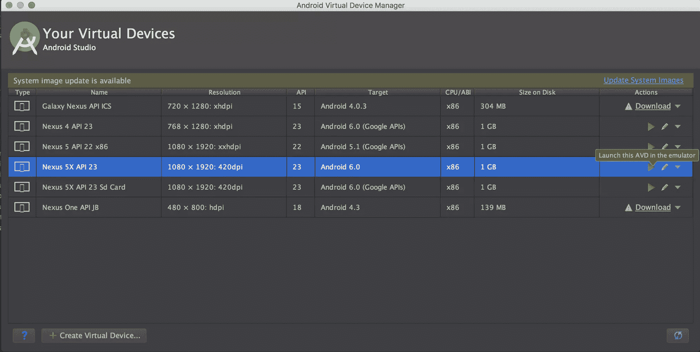
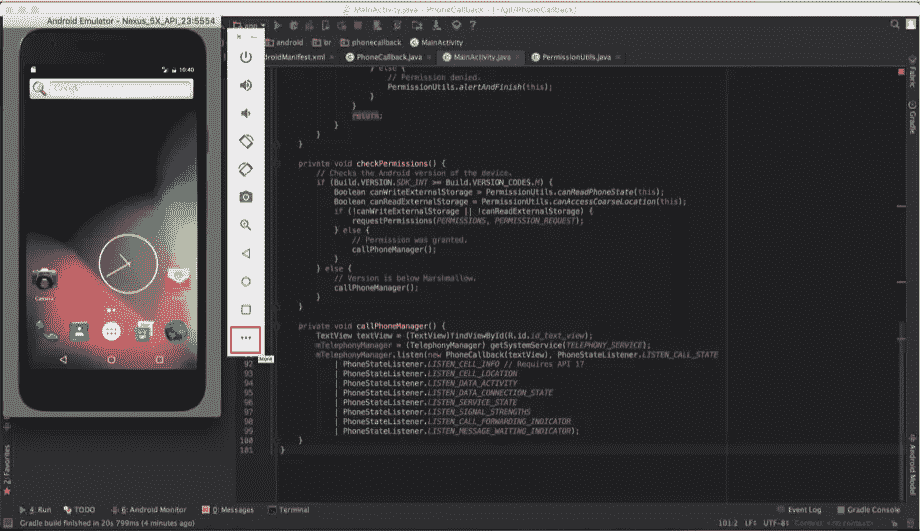
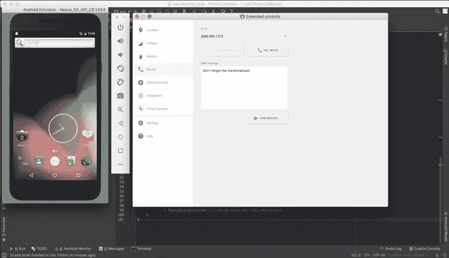
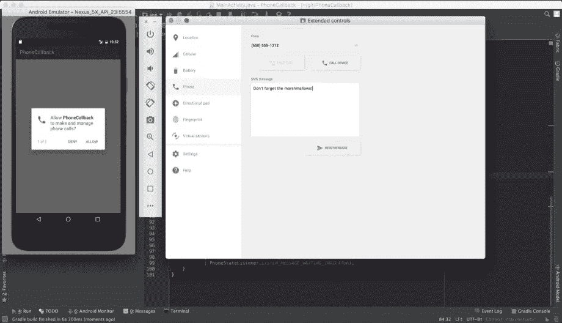
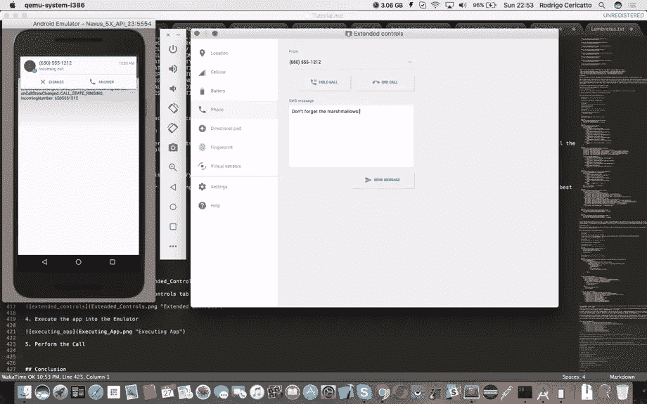

# 使用 TelephonyManager 在 Android 中进行电话回拨

> 原文：<https://www.sitepoint.com/phone-callbacks-in-android-using-telephonymanager/>

如果你是一个 Android 开发人员，你需要检测你的手机是处于空闲状态，摘机(接收状态)还是振铃状态，这个教程就是为你创建的。这里的目标是向你展示如何在 Android 中实现电话回叫，允许检测你的电话呼叫。

## 关于电话管理器

在本主题中，将要讨论的最重要的类是`TelephonyManager`。这个类使用一个名为`PhoneStateListener`的监听器监听电话服务更新。

类型为`TelephonyManager`的对象将被实例化，它将监听`Context.TELEPHONY_SERVICE`的更新。为了监控像`PhoneStateListener.LISTEN_DATA_CONNECTION_STATE`、`PhoneStateListener.LISTEN_CELL_INFO`等电话状态的更新，将创建一个名为`PhoneCallback`的类，从`PhoneStateListener`扩展而来。

使用`TelephonyManager`可以访问设备的电话服务，使用方法`TelephonyManager.listen(PhoneStateListener listener, int events)`可以监控电话正在接收的所有信息。

当观察到 TELEPHONY_SERVICE 的某个事件时，类`PhoneStateListener`接收回调。在本教程中，将使用标志`PhoneStateListener.LISTEN_CALL_STATE`。它会监控和监听电话的通话状态。

正如在 PhoneStateListener 文档中可以看到的(参见下面的“进一步阅读”一节)，还有其他常量可以设置到方法`TelephonyManager.listen`的参数`int events`中。例如:`LISTEN_SIGNAL_STRENGTHS`监听网络信号强度的变化(蜂窝)。但是在本教程中，将使用标志`LISTEN_CALL_STATE`，它监听设备调用状态的变化。

## 源代码！

为了展示这些回调是如何工作的，将创建一个 Android 应用程序。它会有一个 main `Activity`，一个封装`PhoneStateListener`回调的自定义类，一个管理 Android 以上版本需要声明的运行时权限的类(Marshmallow)。

首先，需要声明访问电话状态的权限。这个应用程序将使用哪些？要知道这个，有必要看一下`PhoneStateListener`这个类。这个类的源代码如下所示(针对 API 25)。

```
package android.telephony; 

import android.telephony.CellInfo; 
import android.telephony.CellLocation;
import android.telephony.ServiceState;
import android.telephony.SignalStrength;
import java.util.List;

public class PhoneStateListener {
    public static final int LISTEN_CALL_FORWARDING_INDICATOR = 8;
    public static final int LISTEN_CALL_STATE = 32;
    public static final int LISTEN_CELL_INFO = 1024;
    public static final int LISTEN_CELL_LOCATION = 16;
    public static final int LISTEN_DATA_ACTIVITY = 128;
    public static final int LISTEN_DATA_CONNECTION_STATE = 64;
    public static final int LISTEN_MESSAGE_WAITING_INDICATOR = 4;
    public static final int LISTEN_NONE = 0;
    public static final int LISTEN_SERVICE_STATE = 1;
    /** @deprecated */
    @Deprecated
    public static final int LISTEN_SIGNAL_STRENGTH = 2;
    public static final int LISTEN_SIGNAL_STRENGTHS = 256;

    public PhoneStateListener() {
        throw new RuntimeException("Stub!");
    }

    public void onServiceStateChanged(ServiceState serviceState) {
        throw new RuntimeException("Stub!");
    }

    /** @deprecated */
    @Deprecated
    public void onSignalStrengthChanged(int asu) {
        throw new RuntimeException("Stub!");
    }

    public void onMessageWaitingIndicatorChanged(boolean mwi) {
        throw new RuntimeException("Stub!");
    }

    public void onCallForwardingIndicatorChanged(boolean cfi) {
        throw new RuntimeException("Stub!");
    }

    public void onCellLocationChanged(CellLocation location) {
        throw new RuntimeException("Stub!");
    }

    public void onCallStateChanged(int state, String incomingNumber) {
        throw new RuntimeException("Stub!");
    }

    public void onDataConnectionStateChanged(int state) {
        throw new RuntimeException("Stub!");
    }

    public void onDataConnectionStateChanged(int state, int networkType) {
        throw new RuntimeException("Stub!");
    }

    public void onDataActivity(int direction) {
        throw new RuntimeException("Stub!");
    }

    public void onSignalStrengthsChanged(SignalStrength signalStrength) {
        throw new RuntimeException("Stub!");
    }

    public void onCellInfoChanged(List<CellInfo> cellInfo) {
        throw new RuntimeException("Stub!");
    }
}
```

创建一个扩展`PhoneStateListener`的自定义类，一些方法可以被覆盖。例如:

*   `public void onCallStateChanged(int state, String incomingNumber)` - >需要 READ_PHONE_STATE 权限。
*   `public void onCellLocationChanged(CellLocation location)` - >需要 ACCESS_COARSE_LOCATION 权限。
*   `public void onCallForwardingIndicatorChanged(boolean cfi)` - >需要 READ_PHONE_STATE 权限。
*   `public void onMessageWaitingIndicatorChanged(boolean mwi)` - >需要 READ_PHONE_STATE 权限。

## 许可

以上 2 个权限可见:READ_PHONE_STATE 和 ACCESS_COARSE_LOCATION。它们将在`AndroidManifest.xml`文件中声明。

注意上面的应用程序中使用的静态权限。但是随着 API 23(6.0 版——棉花糖),一个新的权限方案在 Android 中被创建。现在必须在运行时检查权限。为此，将创建一个类来封装所需的运行时权限。这个类将被称为`PermissionUtils`。

这个类实现了对在文件`AndroidManifest.xml`和方法`canAccessCoarseLocation()`和`canReadPhoneState()`中声明的两个权限的运行时检查(在它们内部使用方法`hasPermission()`)。此外，如果用户拒绝允许应用程序在运行时运行，方法`alertAndFinish()`会关闭应用程序。

下图显示了在运行时如何检查这些权限。



## 自定义 PhoneStateListener 类

在这个班里，所有的奇迹都发生了。如前所述，通过扩展类`PhoneStateListener`，一些方法可以被覆盖。

为了显示每个回调的内容，我们将使用类`Log`。

```
public class PhoneCallback extends PhoneStateListener {

    //--------------------------------------------------
    // Constants
    //--------------------------------------------------

    public static final String LOG_TAG = "PhoneCallback";

    //--------------------------------------------------
    // Attributes
    //--------------------------------------------------

    private final TextView mTextView;

    //--------------------------------------------------
    // Constructor
    //--------------------------------------------------

    public PhoneCallback(TextView textView) {
        mTextView = textView;
    }

    //--------------------------------------------------
    // Methods
    //--------------------------------------------------

    private String serviceStateToString(int serviceState) {
        switch (serviceState) {
            case ServiceState.STATE_IN_SERVICE:
                return "STATE_IN_SERVICE";
            case ServiceState.STATE_OUT_OF_SERVICE:
                return "STATE_OUT_OF_SERVICE";
            case ServiceState.STATE_EMERGENCY_ONLY:
                return "STATE_EMERGENCY_ONLY";
            case ServiceState.STATE_POWER_OFF:
                return "STATE_POWER_OFF";
            default:
                return "UNKNOWN_STATE";
        }
    }

    private String callStateToString(int state) {
        switch (state) {
            case TelephonyManager.CALL_STATE_IDLE:
                return "\nonCallStateChanged: CALL_STATE_IDLE, ";
            case TelephonyManager.CALL_STATE_RINGING:
                return "\nonCallStateChanged: CALL_STATE_RINGING, ";
            case TelephonyManager.CALL_STATE_OFFHOOK:
                return "\nonCallStateChanged: CALL_STATE_OFFHOOK, ";
            default:
                return "\nUNKNOWN_STATE: " + state + ", ";
        }
    }

    //--------------------------------------------------
    // PhoneStateListener
    //--------------------------------------------------

    @Override
    public void onCellInfoChanged(List<CellInfo> cellInfo) {
        super.onCellInfoChanged(cellInfo);
        Log.i(LOG_TAG, "onCellInfoChanged: " + cellInfo);
    }

    @Override
    public void onDataActivity(int direction) {
        super.onDataActivity(direction);
        switch (direction) {
            case TelephonyManager.DATA_ACTIVITY_NONE:
                Log.i(LOG_TAG, "onDataActivity: DATA_ACTIVITY_NONE");
                break;
            case TelephonyManager.DATA_ACTIVITY_IN:
                Log.i(LOG_TAG, "onDataActivity: DATA_ACTIVITY_IN");
                break;
            case TelephonyManager.DATA_ACTIVITY_OUT:
                Log.i(LOG_TAG, "onDataActivity: DATA_ACTIVITY_OUT");
                break;
            case TelephonyManager.DATA_ACTIVITY_INOUT:
                Log.i(LOG_TAG, "onDataActivity: DATA_ACTIVITY_INOUT");
                break;
            case TelephonyManager.DATA_ACTIVITY_DORMANT:
                Log.i(LOG_TAG, "onDataActivity: DATA_ACTIVITY_DORMANT");
                break;
            default:
                Log.w(LOG_TAG, "onDataActivity: UNKNOWN " + direction);
                break;
        }
    }

    @Override
    public void onServiceStateChanged(ServiceState serviceState) {
        super.onServiceStateChanged(serviceState);
        String message = "onServiceStateChanged: " + serviceState + "\n";
        message += "onServiceStateChanged: getOperatorAlphaLong " + serviceState.getOperatorAlphaLong() + "\n";
        message += "onServiceStateChanged: getOperatorAlphaShort " + serviceState.getOperatorAlphaShort() + "\n";
        message += "onServiceStateChanged: getOperatorNumeric " + serviceState.getOperatorNumeric() + "\n";
        message += "onServiceStateChanged: getIsManualSelection " + serviceState.getIsManualSelection() + "\n";
        message += "onServiceStateChanged: getRoaming " + serviceState.getRoaming() + "\n";
        message += "onServiceStateChanged: " + serviceStateToString(serviceState.getState());
        Log.i(LOG_TAG, message);
    }

    @Override
    public void onCallStateChanged(int state, String incomingNumber) {
        super.onCallStateChanged(state, incomingNumber);
        callStateToString(state);
        String message = callStateToString(state) + "incomingNumber: " + incomingNumber;
        mTextView.setText(message);
    }

    @Override
    public void onCellLocationChanged(CellLocation location) {
        super.onCellLocationChanged(location);
        String message = "";
        if (location instanceof GsmCellLocation) {
            GsmCellLocation gcLoc = (GsmCellLocation) location;
            message += "onCellLocationChanged: GsmCellLocation " + gcLoc + "\n";
            message += "onCellLocationChanged: GsmCellLocation getCid " + gcLoc.getCid() + "\n";
            message += "onCellLocationChanged: GsmCellLocation getLac " + gcLoc.getLac() + "\n";
            message += "onCellLocationChanged: GsmCellLocation getPsc" + gcLoc.getPsc(); // Requires min API 9
            Log.i(LOG_TAG, message);
        } else if (location instanceof CdmaCellLocation) {
            CdmaCellLocation ccLoc = (CdmaCellLocation) location;
            message += "onCellLocationChanged: CdmaCellLocation " + ccLoc + "\n";;
            message += "onCellLocationChanged: CdmaCellLocation getBaseStationId " + ccLoc.getBaseStationId() + "\n";;
            message += "onCellLocationChanged: CdmaCellLocation getBaseStationLatitude " + ccLoc.getBaseStationLatitude() + "\n";;
            message += "onCellLocationChanged: CdmaCellLocation getBaseStationLongitude" + ccLoc.getBaseStationLongitude() + "\n";;
            message += "onCellLocationChanged: CdmaCellLocation getNetworkId " + ccLoc.getNetworkId() + "\n";;
            message += "onCellLocationChanged: CdmaCellLocation getSystemId " + ccLoc.getSystemId();
            Log.i(LOG_TAG, message);
        } else {
            Log.i(LOG_TAG, "onCellLocationChanged: " + location);
        }
    }

    @Override
    public void onCallForwardingIndicatorChanged(boolean changed) {
        super.onCallForwardingIndicatorChanged(changed);
    }

    @Override
    public void onMessageWaitingIndicatorChanged(boolean changed) {
        super.onMessageWaitingIndicatorChanged(changed);
    }
}
```

这个类中实现的最重要的方法是方法`onCallStateChanged()`。此方法侦听呼叫状态的变化。例如，当电话开始响铃时，呼叫被挂起或结束。在这种方法中，可以检测以下状态:`TelephonyManager.CALL_STATE_IDLE`、`TelephonyManager.CALL_STATE_RINGING`或`TelephonyManager.CALL_STATE_OFFHOOK`。这些状态可以提供有关电话状态的信息。

## 主要活动类别

有了读取电话状态的权限和监听电话状态的自定义类，源代码现在只需要将它们调用在一起。这将在`MainActivity`类中完成。

```
public class MainActivity extends AppCompatActivity {

    //--------------------------------------------------
    // Constants
    //--------------------------------------------------

    private static final String[] PERMISSIONS = { Manifest.permission.READ_PHONE_STATE, Manifest.permission.ACCESS_COARSE_LOCATION };
    private static final int PERMISSION_REQUEST = 100;

    //--------------------------------------------------
    // Attributes
    //--------------------------------------------------

    private TelephonyManager mTelephonyManager;

    //--------------------------------------------------
    // Activity Life Cycle
    //--------------------------------------------------

    @Override
    protected void onCreate(Bundle savedInstanceState) {
        super.onCreate(savedInstanceState);
        setContentView(R.layout.activity_main);

        checkPermissions();
    }

    //--------------------------------------------------
    // Permissions
    //--------------------------------------------------

    @Override
    public void onRequestPermissionsResult(int requestCode, String[] permissions, int[] grantResults) {
        switch (requestCode) {
            case PERMISSION_REQUEST: {
                isPermissionGranted(grantResults);
                return;
            }
        }
    }

    private void isPermissionGranted(int[] grantResults) {
        if (grantResults.length > 0) {
            Boolean permissionGranted = grantResults[0] == PackageManager.PERMISSION_GRANTED;
            if (permissionGranted) {
                callPhoneManager();
            } else {
                PermissionUtils.alertAndFinish(this);
            }
        }
    }

    private void checkPermissions() {
        // Checks the Android version of the device.
        if (Build.VERSION.SDK_INT >= Build.VERSION_CODES.M) {
            Boolean canWriteExternalStorage = PermissionUtils.canReadPhoneState(this);
            Boolean canReadExternalStorage = PermissionUtils.canAccessCoarseLocation(this);
            if (!canWriteExternalStorage || !canReadExternalStorage) {
                requestPermissions(PERMISSIONS, PERMISSION_REQUEST);
            } else {
                // Permission was granted.
                callPhoneManager();
            }
        } else {
            // Version is below Marshmallow.
            callPhoneManager();
        }
    }

    private void callPhoneManager() {
        TextView textView = (TextView)findViewById(R.id.id_text_view);
        mTelephonyManager = (TelephonyManager) getSystemService(TELEPHONY_SERVICE);
        mTelephonyManager.listen(new PhoneCallback(textView), PhoneStateListener.LISTEN_CALL_STATE
            | PhoneStateListener.LISTEN_CELL_INFO // Requires API 17
            | PhoneStateListener.LISTEN_CELL_LOCATION
            | PhoneStateListener.LISTEN_DATA_ACTIVITY
            | PhoneStateListener.LISTEN_DATA_CONNECTION_STATE
            | PhoneStateListener.LISTEN_SERVICE_STATE
            | PhoneStateListener.LISTEN_SIGNAL_STRENGTHS
            | PhoneStateListener.LISTEN_CALL_FORWARDING_INDICATOR
            | PhoneStateListener.LISTEN_MESSAGE_WAITING_INDICATOR);
    }
}
```

在`onCreate()`方法中，将调用`checkPermissions()`方法。在这个方法中，将检查权限`Manifest.permission.ACCESS_COARSE_LOCATION`和`Manifest.permission.READ_PHONE_STATE`。

在应用程序的第一次执行中，如果应用程序没有访问这些权限的权限，将调用方法`requestPermissions(PERMISSIONS, PERMISSION_REQUEST)`。如果应用程序可以访问这些权限，那么就会调用`callPhoneManager()`。

方法`requestPermissions(PERMISSIONS, PERMISSION_REQUEST)`将控制流重定向到`onRequestPermissionsResult()`方法。该方法将向用户显示一个对话框，要求他们允许应用程序访问所请求的权限。如果用户允许权限，方法`callPhoneManager()`被调用。如果没有，`PermissionUtils.alertAndFinish()`就会被调用。该方法向用户显示一条消息(告诉用户他必须接受权限)并关闭应用程序。

所有这些流程都发生在应用程序第一次执行的时候。但是第二次会怎么样呢？如果用户第一次允许权限，第二次将不会进行权限检查，将调用方法`callPhoneManager()`。如果不允许，那么这个检查也不做，调用`PermissionUtils.alertAndFinish()`。如果用户在第一次执行时没有选择任何选项，那么请求权限的对话框将再次显示。

最后但同样重要的是，如果用户有允许的权限，方法`callPhoneManager()`被调用。这是调用我们的电话状态回调的方法。

```
private void callPhoneManager() {
        TextView textView = (TextView)findViewById(R.id.id_text_view);
        mTelephonyManager = (TelephonyManager) getSystemService(TELEPHONY_SERVICE);
        mTelephonyManager.listen(new PhoneCallback(textView), PhoneStateListener.LISTEN_CALL_STATE
            | PhoneStateListener.LISTEN_CELL_INFO // Requires API 17
            | PhoneStateListener.LISTEN_CELL_LOCATION
            | PhoneStateListener.LISTEN_DATA_ACTIVITY
            | PhoneStateListener.LISTEN_DATA_CONNECTION_STATE
            | PhoneStateListener.LISTEN_SERVICE_STATE
            | PhoneStateListener.LISTEN_SIGNAL_STRENGTHS
            | PhoneStateListener.LISTEN_CALL_FORWARDING_INDICATOR
            | PhoneStateListener.LISTEN_MESSAGE_WAITING_INDICATOR);
    }
```

在这个方法中，`TelephonyManager`被访问，调用`listen()`方法。请参见此方法的构造函数:



该方法在其第一个参数上接收一个带有`TextView`的构造函数(将用于打印手机的状态)。而在它的第二个参数上，它接收的所有事件都将被电话呼叫状态所监控。

## 使用模拟器执行调用

所有的源代码都准备好了。但是不需要执行电话呼叫来激活电话状态回叫。

这可以通过拨打电话或通过仿真器模拟呼叫来完成。让我们尝试在模拟器中执行一个调用:

要在模拟器中执行调用:

1)打开 Android 虚拟设备



2)选择仿真器



3)打开扩展控件



下面是打开的“扩展控件”选项卡的图像。



4)在模拟器中执行应用程序



5)执行呼叫



以下是通话结束后的日志消息:


日志消息显示，默认情况下，电话状态为空闲状态。然后，当发出呼叫时，状态变为振铃状态。

呼叫结束后，摘机状态为活动状态。在所有这些状态下，来电号码都会显示出来。

## 结论

本教程展示了如何在 Android 中创建一个应用程序来监控手机的通话状态。解释了关于电话监听程序的基本概念，以及监视这些监听程序回调的运行时权限。应用程序源代码是一部分一部分创建的，最后，我们看到了如何进行呼叫模拟。

仅此而已！

更多 Android 文章，看一下 SitePoint 网站。

## 进一步阅读

*   源代码:[https://github.com/sitepoint-editors/PhoneCallback](https://github.com/sitepoint-editors/PhoneCallback)
*   PhoneStateListener 文档:[https://developer . Android . com/reference/Android/telephony/PhoneStateListener . html](https://developer.android.com/reference/android/telephony/PhoneStateListener.html)

## 分享这篇文章