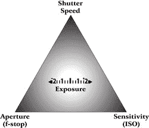
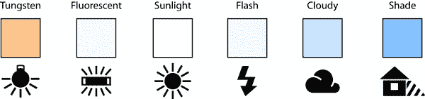
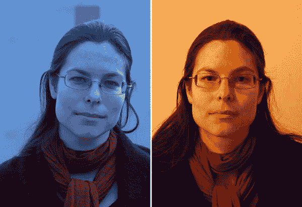
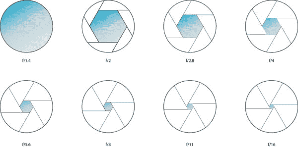
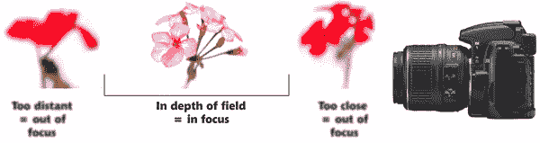
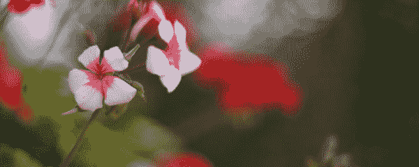
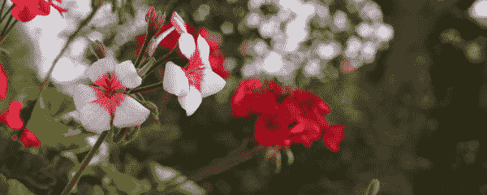
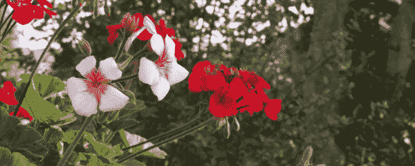
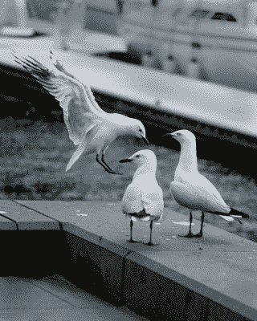
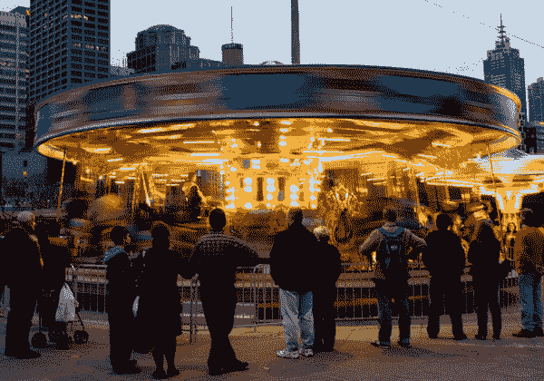

# 如何拍出非凡的照片，第一部分:曝光

> 原文：<https://www.sitepoint.com/photography-for-the-web-exposure/>

SitePoint 最新发布的新书《网络摄影》包含了丰富的信息，可以帮助你拍出令人惊艳的照片，并在网上分享。它将向你展示如何通过设计和拍摄你自己的照片来节省大量的库存图片。我们正在制作《网络摄影》的第一章和第二章，作为这本书的免费 PDF 样本的一部分。这篇文章是从那些章节中摘录的，集中在布局、照明和构图的基本原则上。请继续阅读，开始学习如何利用你的相机。或者[下载免费样本](https://www.sitepoint.com/books/photography1/samplechapters.php)在你方便的时候离线阅读。

## 曝光

作为摄影师，我们受到光线能做什么和我们有什么光线的限制。拍照时，我们开始捕捉适量的光线，以我们希望看到的方式描绘我们的主题。

你的相机捕捉到的光量被称为*曝光*。这个概念很简单，但实际上看起来很复杂。您的相机上有三个设置会影响它捕捉的光量，每个设置都会以不同的方式影响您照片的外观。相机可以为你选择那些东西，但它无法知道它所指向的场景应该是什么样子。当你理解了这些控制，你就可以看一个场景，决定照片应该是什么样子，并相应地设置你的相机。

控制相机拍摄的光量的三个因素是:

*   快门速度——相机的传感器暴露在光线下的时间，从几分之一秒到几秒钟不等。

*   光圈—让光线进入的孔的大小

*   *灵敏度*(通常指*ISO*)[[1](#ftn.id2308974)]—传感器对光线的敏感程度

这三个要素密不可分，如图 1[“曝光三角形”](#fig_basics_exposure_triangle "Figure 1. The exposure triangle")所示。换一个不跟其他平衡，曝光会受影响。

**图一。曝光三角**

更改这些设置中的任何一项都会改变您的相机捕捉的光线量。实现正确曝光的诀窍是平衡这三者。如果您选择增加其中一个设置，则其他一个或两个设置都必须减少以进行补偿。

这听起来很简单——降低一个设置，提高一个或两个设置来抵消这种变化；举起一个，放下另一个。你的相机里有一个测光表，当它们处于平衡状态时会显示出来。所以这很简单，只要你考虑到设置的次要影响。你说 *二级* 效果？没错。它们都有副作用，在你计划拍摄的时候需要考虑进去。

## 计量

在我们仔细研究控制曝光的三个因素及其次要影响之前，让我们考虑一下我们如何测量曝光以及我们如何选择哪个曝光是正确的。

你的眼睛会自动适应光线的变化。当你在一个阳光明媚的日子第一次从外面进来时，室内的光线看起来太暗了，几分钟后就足够亮了。灯光没有变化；你的眼睛已经适应了新的光线水平。

相机中的传感器只记录照射在上面的光线。除非你告诉它，否则它无法习惯光明或对黑暗更敏感。但是如果你的眼睛一直在适应周围的光线，你怎么知道它到底有多亮(或多暗)？

好吧，你的相机就在你身边。除了记录光线，它还可以测量光线。每个相机里都有一个测光表。如果你有单反相机，你应该在取景器中看到仪表，而紧凑型相机通常在液晶显示屏上显示仪表。大多数相机只有在设置为允许手动调整曝光的模式时才会显示曝光计，所以如果你看不到曝光计，请确保你退出了自动或预设模式(如果你需要了解如何打开曝光计的显示，请查阅手册)。

测光表显示的确切外观因相机而异，但基本概念在图 2[“典型的相机内曝光测光表”](#fig_basics_light_meter_scale "Figure 2. A typical in-camera exposure meter")中有所体现。标尺下方的指示器会根据当前的曝光设置和照射在传感器上的光量而移动。

**图二。典型的相机内曝光表**

测光表测量反射到相机中的光线，将其与相机曝光设置捕捉的光线量进行比较，并指示场景是太亮还是太暗。测光表上的中心点代表给你的图像一个介于明暗之间的色调的光量。

相机曝光表上的数字并不代表亮度的线性比例。+1 点代表两倍的光量。+2 标记是两倍，是中点的四倍。在另一个方向，-1 和-2 分别代表一半和四分之一的光量。

相机有几种方法来测量场景中的光线，这些方法被称为*测光模式*。简而言之，你的相机可以平均化场景中的光量，或者更加聚焦——只从场景中的一个点读取数据。当然，它要稍微复杂一些，更先进的相机有一系列的测光模式。对你的相机可能拥有的所有可能模式的详细解释超出了本书的范围，你的相机手册应该提供你需要的所有细节。更多关于测光的细节可以在[数码摄影学校的教程中找到。](http://digital-photography-school.com/)

大多数场景都有一系列的阴影，瞄准一个中间色调点往往会在很多情况下产生曝光良好的图像，但不是所有的情况。而且有些场景不需要平均亮度。如果你将相机对准一面光线充足的纯白色墙壁，并调整曝光，使测光表居中，照片中的墙壁看起来会呈灰白色。拍摄黑色时也有类似的效果；黑人会倾向于变成灰色。

仅仅依靠仪表让你的照片看起来正确是很危险的。你需要观察场景，自己判断是想要更暗还是更亮，然后相应地调整曝光。判断一个场景的最佳测光模式，从而达到你想要的效果，是一项需要练习的技能。

### 停止

当我们谈论进入相机的光线量时，我们是相对于相机测光表的中点来测量的，我们称之为光圈。

一个*光圈*是相机设置的一个变化，它将曝光移动两倍:它将捕获的光量增加一倍或一半。将快门速度从 1/100 秒切换到 1/200 秒，光线进入相机的时间会减半，因此捕捉到的光线也会减半。它减少了一站的曝光。

当我们使用对中测光表的设置拍照时，我们说我们正在拍摄一张“*测光为读数*”的照片如果我们设置相机拍摄时，测光表显示更高或更低的值，我们说我们曝光过度或曝光不足，不管测光表从中心读取多少次。当在一些半自动模式下拍摄时，这变得特别重要，我们将在后面看到。这些模式让你指定一个或两个控制设置，而相机计算另一个设置(参考我们的曝光三角形)来平衡。当你用完全手动控制拍摄时，测光表更像是一个顾问，告诉你你的图像有多亮。要告诉相机在半自动模式下计算更亮或更暗的曝光，你可以向上或向下拨动仪表指示器。这叫做*曝光补偿* 。

很多相机也允许*曝光*包围。使用此选项，相机可以连续拍摄多张照片，每张照片使用不同的曝光设置。如果你不确定如何最好地拍摄一个场景，包围曝光——这样你就可以读取一个测光，并在正负一站各一个——给你一个很好的机会来实现你想要的拍摄。你必须参考你的相机手册，看看这是否是一个可用的功能，以及如何启用它。

### 使用和理解可用的光线

当你无法控制场景中光线的位置或亮度时，你只能通过移动主体来控制光线落在主体上的方式。如果你想让一个人的脸被照亮，你最好避免背对着太阳拍摄他们。转动你的拍摄对象，让这个人面对光源。

在万里无云的晴天，你可能会觉得光线太刺眼。你的主体的一部分将被明亮地照亮，而其他部分将被深深的阴影覆盖。如果你能把主体移到阴影中，或者用一个物体投射出你自己的阴影，它能使刺目的光线变得柔和。

如果一个固定的人工光源不够亮，你的相机无法获得良好的曝光，你宁愿跳过使用闪光灯，试着将你的对象移近光线。如果可能，打开任何其他可用的灯。

在第三章中，我们将学习如何修改光线来满足我们的需求。在那之前，练习寻找最有效的光线。

### 白平衡

光线不足之后，摄影中光线最大的问题就是颜色不对。有时很明显你的光是有色的，你甚至可能希望它是有色的。当色彩更加微妙和不需要时，问题就出现了，这被称为*色偏* 。

你可能在普通的白炽灯下拍过照片，它们有强烈的黄橙色。当你拍照的时候，肉眼看上去场景不是黄色的，但是你的相机给你展示了一个黄色的图像。是相机的错吗？不。摄像机如实地记录了它所指向的东西。白炽灯真的是那种颜色。

当你被轻微变色的光线包围时，你的大脑足够聪明来补偿这种投射。你知道白色应该是什么样的，这就是你看到光的方式。你的相机不够智能。它会记录它被告知要记录的内容，所以你必须告诉它以稍微不同的方式记录场景。

你的相机会有一个叫做*白平衡*的控制或菜单选项。除了自动设置之外，你还可以找到*、 [ [2](#ftn.id2309839) ] 荧光灯、日光、闪光灯、阴天和阴暗环境的设置。当你被这些灯光包围时，它们在你眼中可能看起来都一样，但在颜色上有一些相当大的差异，如图[图 3 所示，“最常见的预设白平衡选项抵消了最常见的色偏源”](#fig_basics_whitebalance "Figure 3. The most common preset white balance options offset the most common sources of color casts")。*

 ***图 3。最常见的预设白平衡选项抵消了最常见的色偏来源**

开始拍摄前，将白平衡设置为最接近光源的设置。您可以稍后在电脑上校正色偏，但通常最好是在拍摄时用相机来校正。如果你不确定哪种设置最适合你的照明，试着拍摄一个你知道应该是白色的物体。检查你的 LCD 上的结果，选择一个物体最接近白色的。你可以将白平衡设置为自动，但是你要相信相机会猜对。如果它猜错了，偏色会更严重。[图 4，“白平衡错误会产生色彩问题”](#fig_basics_wrongbalance "Figure 4. Having the wrong white balance will create color problems")说明了这个问题。左边的照片是在日光下拍摄的，平衡设置为钨，结果太蓝；右边的照片显示了完全相反的情况——在白平衡设置为阳光的钨灯泡下拍摄——所以结果太黄了。

**图 4。错误的白平衡会产生色彩问题**

* *## 光圈和景深

正如我们在第一章中提到的，你的相机镜头覆盖了光圈:一个让光线进入相机的孔。光圈的宽度由可调光阑控制。扩大光圈让更多的光进来；缩小它能让更少的东西进来。在更便宜的小型相机上，你可能无法直接控制光圈，尽管它的设置可能会受到你选择的拍摄模式的影响。即使你不能直接控制它，它对你形象的影响也是重要的。

第一次看到光圈测量时，可能会觉得有点奇怪。它们用 *f-stops* 表示(与我们已经讨论过的普通的旧 stops 相反)，通常写为 f 和一个数字(例如 f16)，有时在它们之间有一个斜杠(`/`)字符。该数值不是光圈大小的绝对量度，而是镜头的相关焦距；因此，不管你用什么镜头，任何给定的 f-stop 的光圈都会让相同量的光进入。

关于光圈，需要记住的第一点是，f-stop 越小，光圈越大，进入相机的光线就越多。要增加曝光，请将光圈设置为较小的数值。要减少曝光，请增大光圈。这可能有助于把这个数字看作是一个衡量黑洞闭合程度的尺度。

aperture 的另一个需要花点时间来适应的方面是编号。标准镜头光圈通常是 f/1.4、f/2、f/2.8、f/4、f/5.6、f/8、f/11、f/16、f/22 等序列的子集。每个数字大致是前一个数字的 1.4 倍。这不是数学书呆子对我们这些在数字上更有挑战性的人开的大玩笑:1.4 是 2 的平方根，四舍五入以适应相机的显示屏。如果你把圆形光圈的宽度乘以 1.4，你就把光圈的面积扩大了一倍，让两倍的光进来。您可以在图 5[中看到这一点，“每个光圈数是前一个光圈数的一半”](#fig_basics_apertures "Figure 5. Each f-stop is half the area of the previous one")。

**图 5。每个光圈挡的面积是前一个**的一半

当你把光圈从 f/1.4 改为 f/2 时，相机的进光量减半。从 f/8 到 f/5.6，你就翻倍了。你不需要理解数学，但是学习光圈数的序列是一个非常好的主意。f/8 的亮度是 f/5.6 的一半，这似乎有悖常理，但充分了解这一点，让它成为你的第二天性，有一天可能会让你避免错过一个镜头。大多数相机允许你以半停步长调整光圈；有些允许光圈的三分之一，但如果你手动控制光圈，你会在相机的设置中找到光圈级数的一部分。

光圈的主要作用是控制通过镜头到达传感器的光量。作为次要效果，光圈控制景深。

正如我们在第一章中看到的，景深是在你聚焦的点前后聚焦的场景量。小景深意味着只有一部分图像是清晰的，其余部分是模糊的，如图 6“景深大小”所示。大景深能让你在对焦时，在被摄物体前后有更大的距离。大光圈给你浅景深；窄光圈给你一个深光圈。

**图 6。景深的大小**

有点模糊可能是件好事。如果你想在一个开满鲜花的花园里拍摄一朵花，或者在一个繁忙的背景前拍摄一幅肖像，限制你的景深，以便只有你的主体在焦点上，将主体从背景中分离出来。背景细节模糊不清，如果对焦会分散注意力，让你的主体站在更抽象的背景下。在下面的花卉图片中，在 f/22 ( [图 9，“又在 f/22”](#fig_basics_f22flowers "Figure 9. And again at f/22"))背景中的树木与前景中的花茎发生冲突，而在 f/1.8 ( [图 7，“f/1.8 的灌木丛上的花”](#fig_basics_f18flowers "Figure 7. Flowers on a bush at f/1.8"))很难看出有树。中间的一个光圈([图 8，“f/8 相同的花”](#fig_basics_f8flowers "Figure 8. The same flowers at f/8"))显示了一株植物上的所有花，但仍然模糊了背景。(自动人像模式以这种方式使用景深来隔离对象。)

当拍摄风景或一大群人的时候，你可能希望保持许多物体都在离相机不同距离的焦点上。你需要一个更窄的光圈来做到这一点，所以如果有必要增加曝光，你必须增加更多的光(对于风景照片来说很难)或者调整曝光三角形的其他角。

除了光圈之外，景深还涉及其他因素。例如，你离拍摄对象越近，任何给定光圈下的视场就越浅。之前的花卉样本都是在距离植物不到一米的地方拍摄的。如果把焦点放在背景中的树木上，景深可能会在 f/22 时扩展到无穷远。

**图 7。1.8 层的灌木丛上的花朵**

**图 8。同样的花在 f/8**

**图 9。并且再次在 f/22**

### 光圈优先

如果你认为图像的景深很重要——无论是深还是浅——你可能想在*光圈优先*模式下拍摄。在模式选择转盘上，它通常被缩写为 Av 、 Ap ，或者仅仅是 A ，或者在菜单中它可能被缩写或完整拼写。光圈优先模式是介于全自动模式和手动控制之间的几种拍摄模式之一。

**note:** Compact Cameras Might Lack an Aperture Priority Mode

一些紧凑型相机可能没有光圈优先模式，但它们会有预设模式，根据您拍摄的场景类型优先选择宽光圈或窄光圈。对于大光圈，选择人像模式；对于较窄的光圈，尝试横向。

光圈优先告诉相机调整快门速度，以平衡它与你的光圈设置。如果光靠快门速度无法平衡曝光，ISO 设置也可以调整。

如果需要浅景深，设置一个大光圈，相机应该提高快门速度，这样就不会过度曝光。

如果需要远距离对焦，可以在光圈优先模式下拨入窄光圈，相机会自动计算平衡它所需的快门速度。不过要小心:要经常检查相机选择的速度。如果快门速度太慢，你的图像可能会模糊。我们很快就会看到快门速度和模糊。

### 练习

我可以给你一些数字表来查找焦距、物距和光圈，以便找出在每种可能的环境和条件组合下你能获得多大的景深。我可以，但我不会。首先，那种桌子真的很无聊。在任何给定的例子中，当你看完所有的资料时，情况已经改变，设置不再适用，或者你的主题变得无聊并回家了。所以相反，我建议你出去练习。

掌控你相机的光圈。如果你可以将相机设置为手动，那么就这样做，然后在不同的光圈下用相同的快门速度在不同的光线下拍摄一系列照片。看看当你的眼睛调整时，停止曝光与你的眼睛所看到的相比，在相机中有多大的不同。

走近一个小物件，在不同的光圈下拍摄，看看景深如何改变场景的外观。尝试仅使用光圈设置控制曝光来拍摄一天，以找出相机的极限。了解在什么条件下可以使用宽光圈的室内照明进行拍摄。自己看看如何通过改变光圈和与拍摄对象的距离来影响景深。练习的时候你做的实验越多，你就越不需要在准备投篮之前停下来思考。

## 快门速度和运动模糊

快门速度通过限制光线照射传感器的时间来控制曝光。这是快门速度控制的主要效果。快速的快门速度可以冻结飞行中的鸟，如图[图 10，“快速的快门速度可以冻结飞行中的鸟”](#fig_basics_seagull "Figure 10. A fast shutter speed can freeze a bird in flight")。需要考虑的次要影响是运动模糊。快门打开的时间越长，物体在这段时间内移动的可能性就越大。在较慢的快门速度下，快速移动的物体模糊，而慢速移动的物体保持清晰，如图[11，“在较慢的快门速度下，快速移动的物体模糊，而慢速移动的物体保持清晰”](#fig_basics_carousel_blur "Figure 11. At slower shutter speeds, fast-moving objects are blurred, while slow-moving objects remain sharp")所示。对于大多数镜头，你将使用以秒为单位测量的快门速度。

**图 10。快速的快门速度可以冻结飞行中的鸟**

**图 11。在较慢的快门速度下，快速移动的物体变得模糊，而慢速移动的物体保持清晰**

对象或相机移动得越多，图像在帧中的像素间就越模糊。如果你拍照时手里拿着相机，它会抖动；真的没有办法避免。所以，如果你用太慢的快门速度拍摄，你会冒着即使是最稳定的物体也会被相机的抖动弄模糊的风险。这些动作很小——大多数时候你都不会注意到它们。他们很少会在快门打开和关闭之间移动你的相机超过几分之一度。变焦出现了问题。当你的视角只有几度时，一个小小的晃动就能产生相当大的不同。镜头的焦距越长，就越容易受到抖动的影响。

有很多方法可以解决这个问题，最好的方法是将相机放在一个不会移动的坚固物体上。三脚架是理想的，但是把它放在任何固体表面上比拿在手中更稳定。(我们将在第三章中讨论三脚架和你可以用它们做的有趣的事情)。

### 手持设备拍摄时减少抖动的技巧

另一种减少抖动影响的方法是提高快门速度。快门打开的时间越少，相机在关闭前移动的时间就越少。手持拍摄的通常准则是避免在小于 1 除以焦距的情况下拍摄。例如，如果你用 300 毫米的相机拍摄，尽量保持快门速度快于 1/300 秒；在 30 毫米时，你能以 1/30 秒的速度射击。显然，这将随着环境和个人条件的变化而变化。如果你非常疲劳或站在不稳定的地面上，你可能会比你休息好并站在坚实的地面上时更不稳定。

如果你的相机有目镜取景器，就用目镜取景器。当你使用液晶面板来取景时，你需要把相机拿得离你的身体比通过取景器看时远得多。你的胳膊伸得越远，抖得越厉害。

握紧你的相机。用双手抓住它，把你的手肘收进身体两侧。把相机靠在身上。你把相机拿得越近，它就越不容易移动。你可以通过支撑自己来进一步提高稳定性。如果可以的话，把你的手肘放在一个坚固的物体上；或许靠在墙上。

你的相机可能有一个*图像稳定器* 。这是移动传感器或镜头元件以帮助抵消振动的硬件。如果你的相机有图像稳定功能，放大时打开它。(不建议一直开着它，因为它会耗尽你的电池。)

### 快门优先

当快门速度是一个重要的考虑因素，并且你知道你希望你的快门打开多长时间时，你可能有自己的*快门优先*模式。有时它隐藏在你的控制中。一些相机公司在控制盘上用 S 来缩写它，一些用 T (代表时间)，或者 Tv 。查看您的相机手册，了解您的型号的控制细节。

当您设置快门优先时，您会告诉相机快门应该保持打开多长时间，相机会计算出所需曝光的光圈(如果光靠光圈无法平衡曝光，有时还会计算出 ISO)。

您可能还记得第一章中提到的预设场景模式。如果你有一个没有快门优先设置的小型相机，你很可能会发现一个运动模式或动作模式。这将加速快门以冻结移动的物体。有时也有一种叫做“孩子和宠物”的模式，它结合了快速快门和闪光灯。你可以用这个来定格一个快速移动的物体。

你可能也有一个夜景模式给你一个慢速快门，或者一个结合慢速快门和闪光灯的夜间人像模式。如果你想要模糊，这两种都可以实现，但明智的做法是做一点实验，看看它们在明亮的光线下表现如何。

#### 练习

感受快门速度如何影响照片的最好方法是拍摄大量移动的物体。尝试拍摄体育赛事、快速流动的交通或玩耍的儿童。看看在每种情况下需要多快的快门速度来定格动作。主体移动越快，你需要的快门速度越高；例如，一个足够快的快门速度可以定格一个奔跑的孩子，但仍然可以模糊一辆飞驰的汽车。

看看在手抖模糊图像之前，你可以将快门速度设置得多慢。从推荐的 1/焦距设置开始。如果你能拍出没有任何明显模糊的照片，就停下来降低快门速度，然后再试一次。不断降低速度，并注意相机抖动使照片过于模糊。发现你可以手持拍摄的极限是很重要的，最好是在你决定是否要带三脚架之前。

## ISO 和噪音

有时光线太差，不适合任何光圈和快门速度的组合。光线非常暗的场景(需要大光圈或快速快门(或两者都需要)，并且不能使用闪光灯)需要高 ISO 设置。例如，您可能想要使用相当快的快门速度来捕捉生日聚会上吹灭蛋糕上的蜡烛。不幸的是，即使是最宽的光圈也会阻止你在烛光下快速拍摄。一道闪光会洗掉景物，杀死金色的辉光。

当你需要更多的光线并且无法改变光圈或快门速度时，剩下的最后一个选择是改变传感器的灵敏度。相机的感光度，被称为 ISO，是由比快门和光圈更难控制的方式控制的，但你应该可以在相机的设置菜单中找到它。这在一定程度上是过去的遗留问题，当时所有的*照片都是用胶片拍摄的(请注意，那不是很久以前。胶片相机的感光度取决于胶片上感光化学物质的配方。要改变感光度，你就要改变胶片；这个决定不能凭一时冲动作出。现在，我们可以通过放大传感器数据，以电子方式改变相机的感光度。*

 *一些相机的 ISO 设置被隐藏在菜单中的另一个原因是，如果可以的话，大多数摄影师更喜欢避免改变感光度。除了增加照片的亮度之外，增加感光度还有引入和增加*噪点*——照片中可见的颗粒感的次要影响。通过放大来自传感器的信号，我们也放大了像素值之间的差异。增加足够多的差异，它们就会变得可见。颜色和色调之间的过渡看起来更粗糙。在低 ISO 设置下，这可能不明显，但随着 ISO 变高，图像呈现颗粒状外观，通常被认为是不吸引人的*。细节随着颜色和色调过渡的平滑度被噪声丢失。*

 *我们说一般，因为 ISO 噪声不一定都是不好的。有时你可能想让你的图像看起来更粗糙、更嘈杂。我们都是看着粗糙的新闻照片和电影长大的，通常是随着事件的展开拍摄的突发新闻。有时是因为目击者手中的廉价相机，有时是因为经验丰富的摄影记者使用非常高 ISO 的胶片，因为他们在速度很重要的情况下。与此同时，大多数广告和娱乐照片是干净和无噪音的。我们已经开始认为粒状图像更真实，而光滑和抛光的图像可能看起来是假的。

这并不意味着每次你想让图像看起来自然，你就应该把 ISO 调到 6400。看起来像高 ISO 的噪点可以很容易地在 Photoshop 中添加，但真正的噪点很难去除。如果你认为你想在图像中添加纹理，你应该认真考虑以后添加它的选择。

虽然快门和光圈优先模式在数码相机上非常普遍，但 ISO 优先模式在本文写作时还没有出现。一些相机制造商已经引入了 ISO 优先模式，但鉴于大多数摄影师偏好在最低 ISO 设置下拍摄，它不太可能变得非常受欢迎。**  **## 阳光 16 法则

既然我们已经讨论了快门速度、光圈和 ISO，让我来介绍一个有用的技巧。你不太可能会发现自己完全没有米的情况，但做好快速拍摄的准备总是个好主意。如果你按照下面的规则预设相机，如果你需要快速拍摄，你很可能已经准备好了。

在不使用测光表的情况下估算曝光量的一个很好的指导方针是*晴天 16* 法则。在一个阳光明媚的日子，当你的相机光圈设置为 f/16 时，将快门速度设置为与 ISO 设置相同的值，应该可以获得不错的曝光。在 ISO 100，以百分之一秒拍摄。由此，您可以针对不同的条件进行调整。最好保持尽可能低的 ISO，所以你需要做的就是平衡快门速度的增加和光圈的减少。快门速度加倍，光圈减半，等等。

判断亮度是否足以应用该规则是很容易的。远离阴影，云层大概是唯一能散射阳光的元素。看看你的影子。是否鲜明，锋芒毕露？你能看到影子吗？首先尝试[表 1 中的设置，“光圈导轨”](#tbl_basics_sunny16 "Table 1. Aperture guide")；看看你的预览，然后根据需要进行调整。

**表 1。光圈导轨**

<colgroup><col> <col> <col></colgroup> 
| 天气 | 阴影 | 孔 |
| --- | --- | --- |
| 阳光明媚 | 硬边的 | f/16 |
| 稍阴 | 边缘柔和但清晰 | f/11 |
| 中度多云 | 几乎看不见 | f/8 |
| 阴云 | 不可见 | f/5.6 |

## 下一步是什么？

既然你已经了解了一点关于曝光、光圈和快门速度的知识，是时候付诸实践了。首先下载网上摄影的 PDF 样本，包括本文的所有内容，以及第二章:摄影基础的其余部分。当你准备好将你的摄影技术提升到一个新的水平时，[购买这本书](https://www.sitepoint.com/blog/)，学习如何在线存储、编辑和分享你的照片。

* * *

[ [1](#id2308974) ] 以国际标准化组织(ISO)命名，该组织定义了测量标准，并设定了测量胶片和传感器灵敏度的标尺。

普通白炽灯泡使用金属钨制成的灯丝。这已经成为摄影行业中的通用术语，指的是任何一种由装有灼热金属丝的灯泡产生的光。** 

## **分享这篇文章***