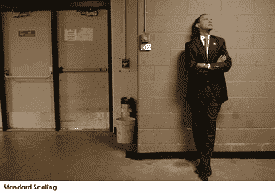
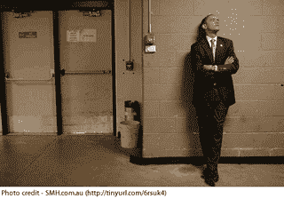
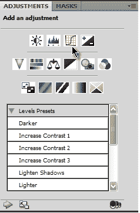
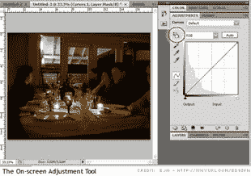
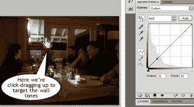
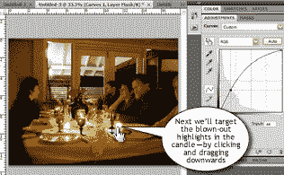
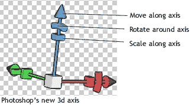
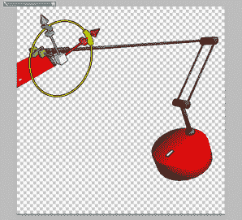
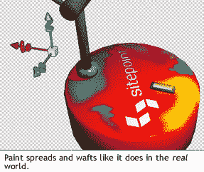

# 你只能在 Photoshop CS4 中做的 3 个很酷的技巧

> 原文：<https://www.sitepoint.com/photoshop-cs4-new-features/>

我不得不承认我也这么想过。新的 Photoshop 来了，我发现自己在想:“啊，得了吧，这个老女人现在肯定已经是第十二个版本了。这相当于狗年的 125 岁，不是吗？当然，经过这么长时间，井已经干了，她什么都没有，但噱头和客厅的把戏试图引诱我吗？”

虽然这可能是我进去的方式，但我很高兴地告诉大家，她仍然有能力给人惊喜和取悦。

让我们仔细看看。

##### 内容感知图像大小调整

这是 Adobe 的一个好故事。2007 年 8 月，当 Shai Avidan 和 Ariel Shamir 演示了一种新的图像大小调整的数学方法——被称为内容感知图像大小调整(CAIR ),在图形社区引起了一阵兴奋。Adobe 很快发现了这个机会，并立即将 Shai 加入了 Photoshop 团队。然而，找到一个好主意并将其整合到一个类似 Goliath 的 Photoshop 中是完全不同的事情，当它变得太难在广阔的世界中工作时，许多“哇，不是很酷”的想法已经被储存起来。幸运的是，CAIR 没有出现这种情况，Adobe 在将 CAIR 技术顺利整合到 Photoshop CS4 中时表现出了一些值得称赞的适应性。

如果你错过了最初关于 CAIR 的演讲，这是一个迷人的概念。传统的图像缩放方法同等地拉伸和压缩图像的所有部分，很少考虑图像内容。如下例所示，除了最小的尺寸调整，这给你带来了令人讨厌的非常明显的图像失真。

CAIR 采取了更聪明的方法。顾名思义，内容感知图像大小调整分析图像的内容，然后将所有图像调整限制在视觉重要性最低的区域。

例如，在下面的例子中，你可以看到应用程序对墙和门的不可描述的部分做了最大的改变，留下了重要的组成元素(奥巴马，开关和垃圾箱)几乎没有改变。

Adobe 对 CAIR 的实现非常巧妙。虽然一些早期版本依赖于用户的切割标记来保护细节，但 Photoshop CS4 通常只需打开“保护肤色”选项即可获得出色的效果。

简而言之，这是一个罕见的情况，你有一个新功能，有一个严重的惊喜因素，从第一天就非常有用。我已经有一段时间不记得在演示一项新的 Adobe 功能时在办公桌前吸引了一大群人，但 CAIR 做到了。虽然有些图片确实比其他图片更适合 CAIR，但我认为这确实是几乎所有 Photoshop 普通用户的杀手锏。

##### 调整图层

调整层并不是什么新东西，但是在 CS4 中它们变得更加强大和容易控制。

你会注意到的第一件事是，他们有自己的专用调色板，给你一个快速，一键点击的方法来应用级别，曲线，饱和度和色彩平衡，以及其他调整。点击一个按钮启动一个隐藏的控制子面板进行调整，而不是传统的弹出对话框。这让我觉得有点奇怪。我怀疑你很快就适应了，但我想不出还有哪个地方是这样处理 UI 的(下图说明了这个想法)。

现在，很明显曲线已经存在很久了，但是在这里应用它们的方式是新的，而且我认为相当酷——屏幕上的调整工具。让我们看一个快速的例子。

要使用这个工具，你只需应用一个曲线调整层，然后点击曲线面板左上角的小手按钮。当您将鼠标悬停在图像上时，您会看到滴管光标，它会向您显示图像的哪一部分落在曲线上。

有什么大不了的，对吧？总是这样。但是试着点击你想要变亮的图像的特定部分(在这个例子中，是墙壁)并向上拖动。你会看到这些色调立即变亮，你的曲线会实时反映这种调整。

在我们的示例中，由于之前的操作，蜡烛失去了一些亮度。要重新突出显示，我们只需直接点击并向下拖动即可。同样，曲线反映了你的调整。

现在，如果你已经是一个曲线高手，你可能看不到这个工具的吸引力。毕竟，只要你知道自己在做什么，还有其他方法可以达到同样的效果。然而，如果你是一个视觉思考者，可能发现很难将图形中发生的事情等同于你的图像中发生的事情，这是一个很好的连接器。对我来说，直接处理图像当然感觉更自然。

##### 3D 绘画

好吧，是的，CS3 里有 3D，但是让我们诚实的说:它并不是非常有用，不是吗？您跳到一个单独的小程序中使用一组有限的工具。这充其量是对 3D 的一个尚可的模仿。新的 3D 实现无疑大大提高了标准。

首先，没有跳出应用程序——所有的 3D 操作都在主工作区执行，与 2D 工具并排。您可以直接在 Photoshop (U3D、3DS、OBJ、DAE 和 KMZ)中打开 3D 文件，或者将 3D 图层添加到现有项目中。

其次，新的模型控制是一个很大的改进。虽然工具栏现在包含 3D 旋转、3D 移动和 3D 缩放工具，但 Adobe 还添加了一个不错的 3D 轴工具来覆盖您的模型，允许您在不离开工作区的情况下对其进行定向。

但也许最令人印象深刻的是 Adobe 能够让他们的 2D 工具在 3D 表面上运行的方式。拿起你的画笔工具，设置颜色，开始绘画。油漆扩散速率和角度都是可控的。

也不是以平色结尾。切换绘画模式，您可以使用凹凸，光泽度，不透明度，光泽，自发光和反射率进行绘画。

您甚至可以使用图层面板中的“向下合并”选项将 2D 图像(如徽标)应用到 3D 对象。在我看来这很棒。

在现实中，Photoshop 中的新 3D 工具可能值得一篇专门的文章；然而，我认为这足以说明，从 CS4 开始，3D 已经是一个成熟的 Photoshop 公民，而不是一个附加的附加产品。

##### 摘要

决定何时升级像 Photoshop 这样昂贵的应用程序总是很困难——尤其是如果你是自己掏腰包，而不是老板掏腰包的话。毫无疑问，你现在的版本昨天有效，明天也会继续有效。

然而，如果你正在考虑升级的问题，随着 CAIR 等功能的增加，这一次可能有比过去两三个版本更令人信服的理由来冒险。

## 分享这篇文章