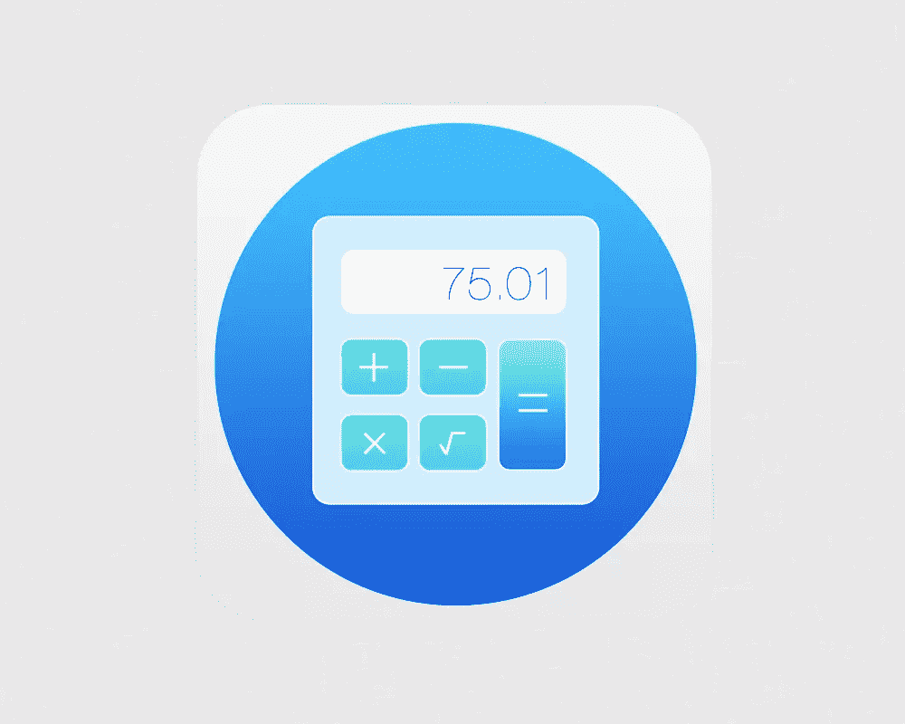
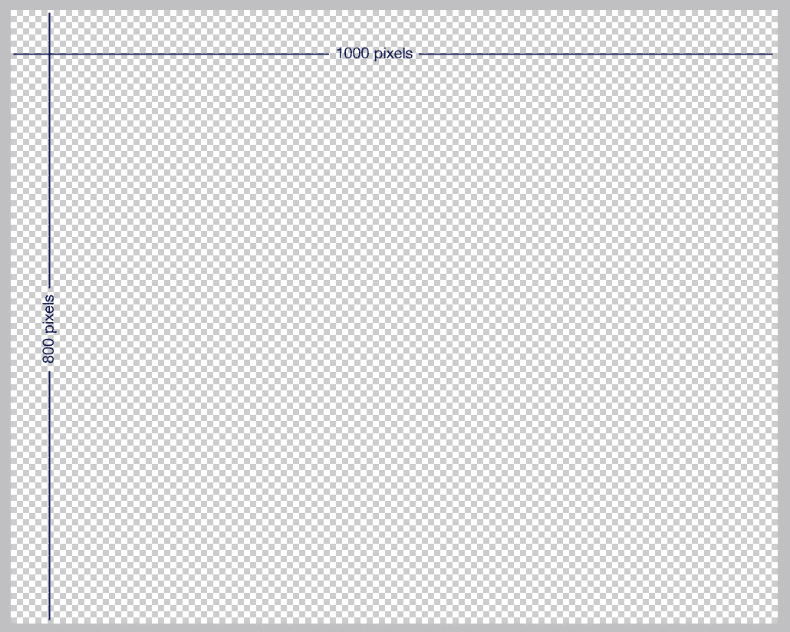
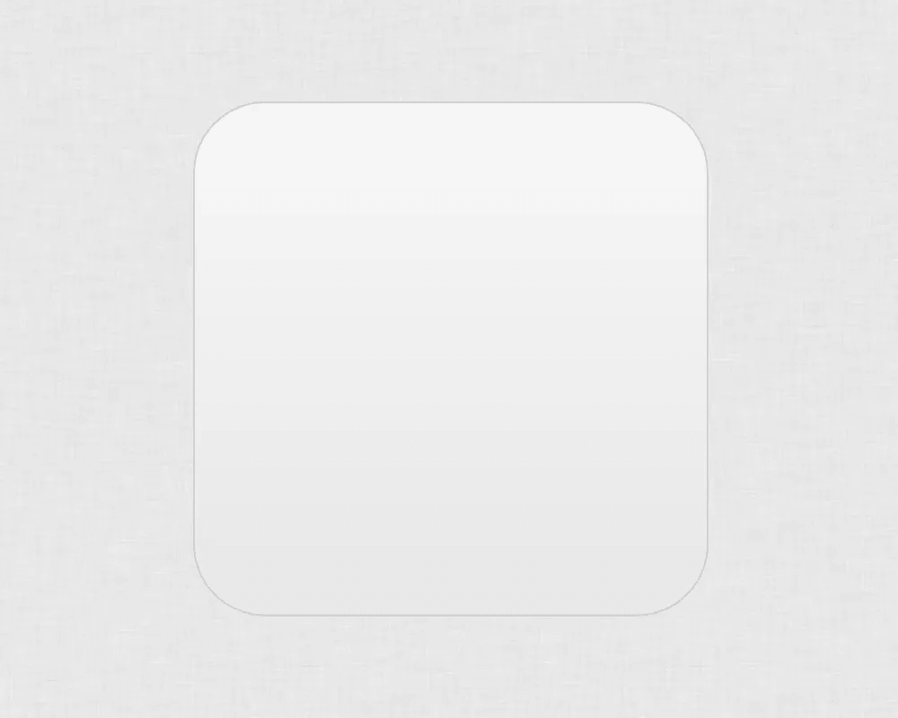
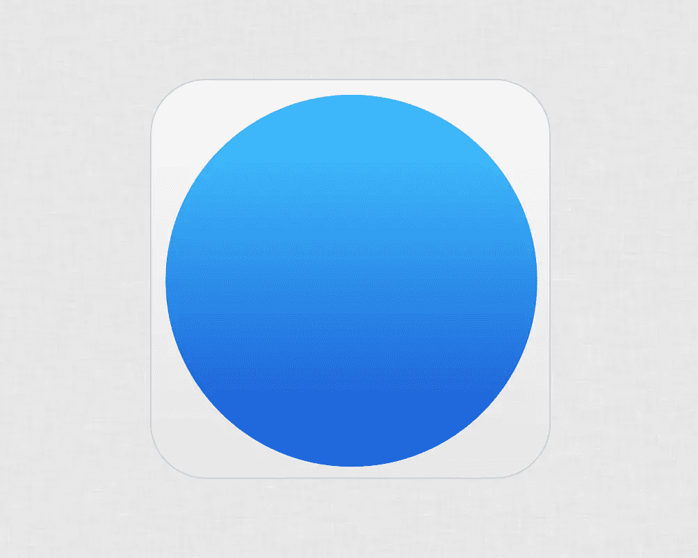
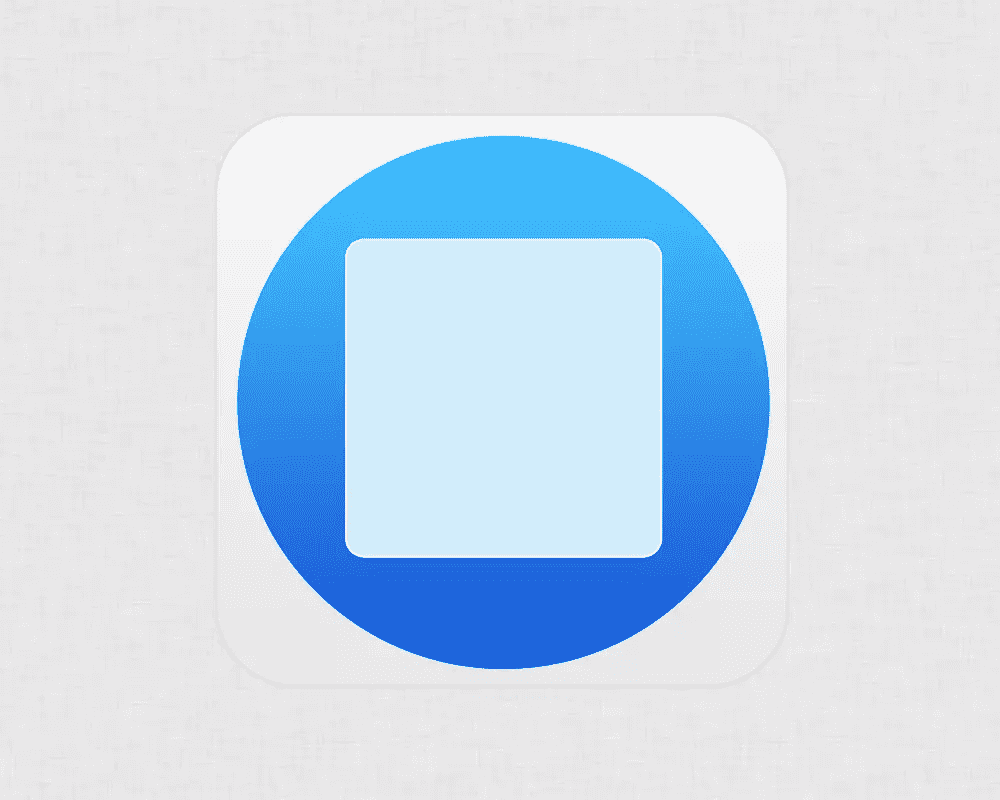
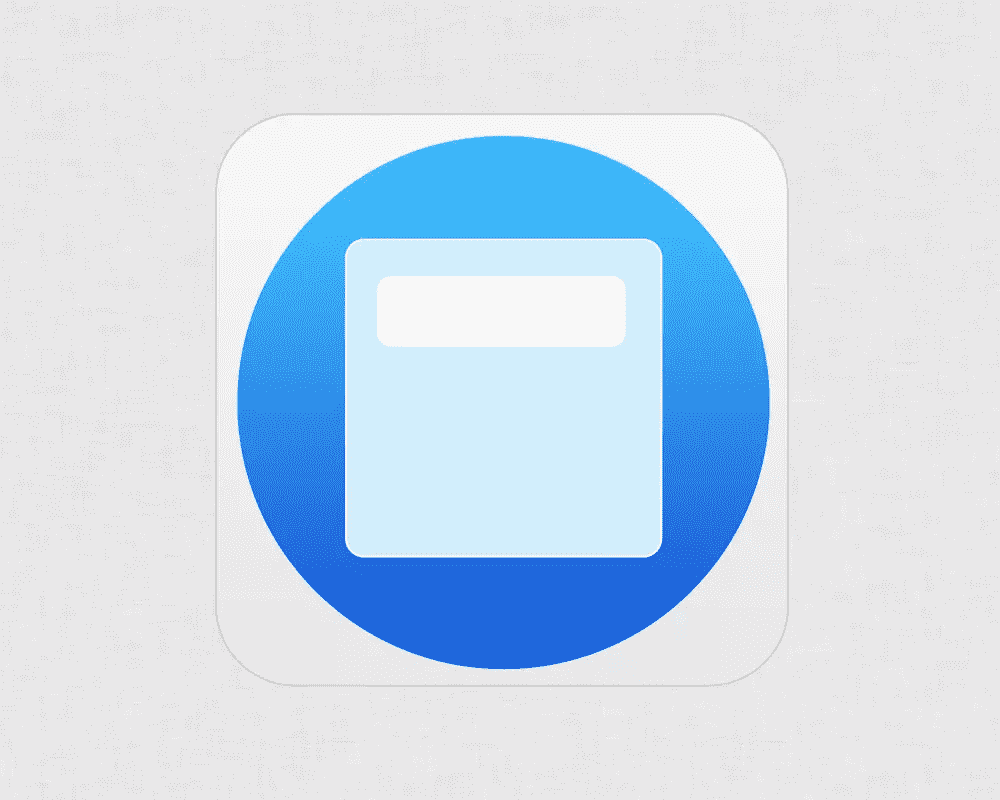
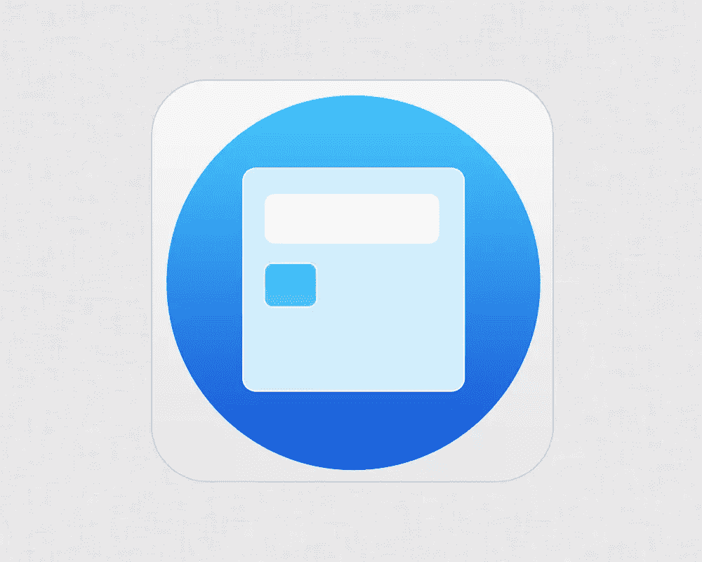
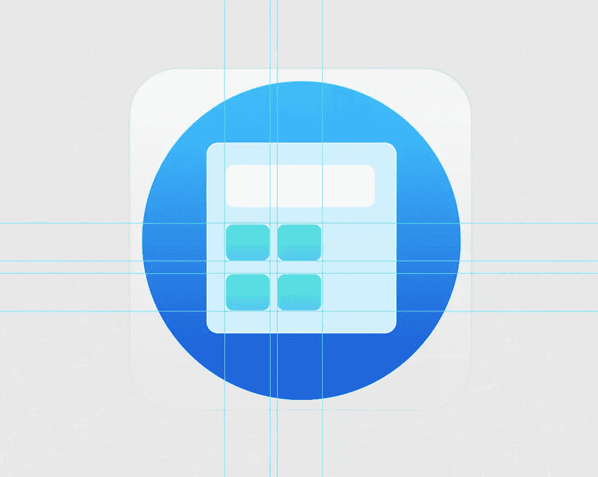
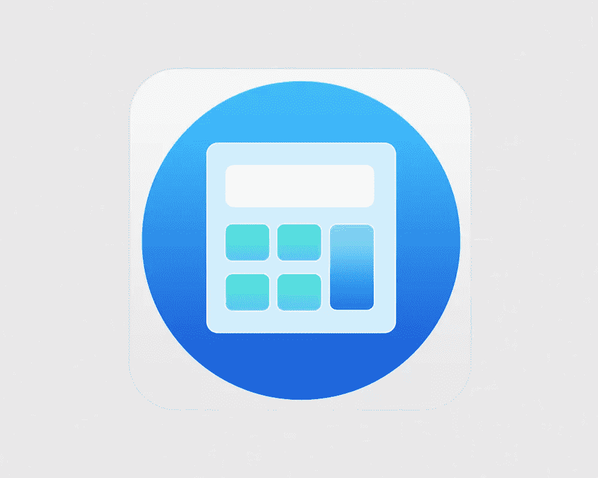
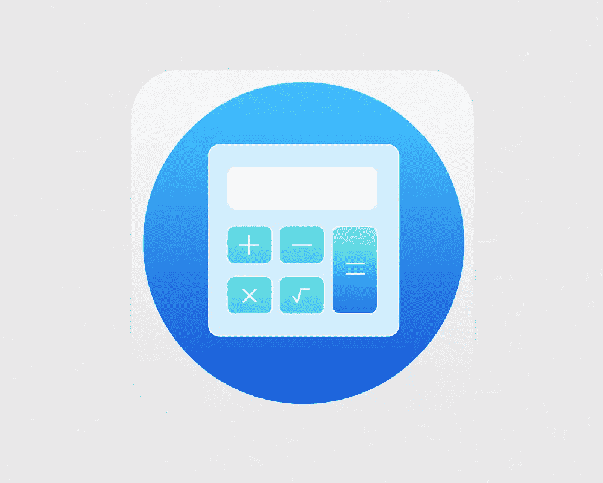

# Photoshop 101:设计一个*几乎*平面的计算器 App 图标

> 原文：<https://www.sitepoint.com/photoshop-design-flat-calculator-app-icon/>

现在是 2014 年:你认识的每个人都有一部可以上网的手机，似乎你与之交谈的每两个人中就有一个人梦想创建自己的排行榜冠军、销量百万的应用程序。这导致了各种不同的在线商店中应用程序的疯狂增长。

2013 年 10 月，苹果在 App Store 宣布了他们的第[百万款应用](http://www.theverge.com/2013/10/22/4866302/apple-announces-1-million-apps-in-the-app-store)。[谷歌的 Play](http://www.phonearena.com/news/Androids-Google-Play-beats-App-Store-with-over-1-million-apps-now-officially-largest_id45680) 商店已经在 6 月超过了这个数字。

即使是晚熟的 Windows Phone 商店在 11 月也有 20 万个应用程序。

几乎不用说，获得一个简单、醒目的应用程序图标对任何希望在这样一个竞争激烈的丛林中竞争的人来说都是“赌注”。

因此，在本教程中，我将向您展示如何使用 Adobe Photoshop 的强大功能创建一个优雅的计算器应用程序图标。

以下是我们的目标:

你要做的第一件事是创建一个新文档，你只需按“Ctrl + N”就可以完成。给画布 1000 x 800 像素的尺寸。你可以随意插入任何你想要的背景，在这种情况下，我选择了一个平面金属图案。

## 第二步

创建一个新层，选择半径设置为 40 像素的圆角矩形工具后，画一个正方形。像往常一样，如果你按住“Shift”按钮，将矩形展开，这就更容易了。

是时候添加一些样式了，所以双击图层打开“图层样式”面板。

转到“Stroke ”,插入以下值:

*   尺寸:2
*   位置:外部
*   混合模式:正常
*   不透明度:100%
*   颜色:#d0cfcf

移动到“渐变叠加”:

*   混合模式:正常
*   不透明度:100%
*   渐变:#e9e8e8 到#f6f6f6
*   风格:线性
*   角度:90 度
*   比例:100%

## 第三步

我们现在要创建蓝色的主圈。拿起椭圆工具，在圆角矩形内画一个圆。我再次建议按住“Shift”键来保持一个完美的圆。

你使用的颜色并不重要，因为我们要用渐变填充它。打开“图层样式”面板，进入“渐变叠加”。

*   列表项目
*   混合模式:正常
*   不透明度:100%
*   梯度:# 1b 59 D7 至# 41c2fe
*   风格:线性
*   角度:90 度
*   比例:100%

您应该会看到类似这样的内容:

## 第四步

让我们创建内部圆角矩形—计算器主体。要绘制形状，您将完全按照我们在步骤 2 中所做的来做，只有一点不同。我们将只用一种颜色填充形状，而不是添加渐变:#d1eefc。

打开“笔画”面板，输入以下参数:

*   尺寸:2
*   位置:外部
*   混合模式:正常
*   不透明度:100%
*   颜色:#ffffff

## 第五步

每个计算器都需要屏幕，我们的也不例外。无论如何，这是一个简单的步骤。

简单地用“圆角矩形工具”画一个圆角矩形。这次最好将圆角半径设置为 10 像素左右。

我用经典的“白色”(#ffffff)填充形状，但是浅灰色也可以。你的电话。

## 第六步

在这一步中，我们将制作较小的按钮。

我们将再次使用半径为 10 像素的圆形工具。

你必须画一个小的圆形，你可以画一个正方形或者长方形，随你喜欢。

然后打开“渐变叠加”面板，插入这些值:

*   混合模式:正常
*   不透明度:100%
*   梯度:# 5acbfb 至# 52edc7
*   风格:线性
*   角度:90 度
*   比例:100%

对于笔画，使用白色或浅色，并将大小设置为 2 像素。

现在我们已经创建了四个按钮中的一个。如果一切顺利，您应该会得到与此类似的结果。

## 第七步

现在，您应该继续创建其他按钮。

不要担心，你不必重复前面的步骤三次，你可以很容易地复制按钮级别，并将形状放置在最合适的位置。我建议你使用指南，以获得对称的结果。

## 第八步

带有“等号”的键可以像前面的键一样被创建。当然它有点大，我把它做得比其他按钮高两倍。

颜色也不同，实际上渐变从#1d77ef 到#87e7f5。

## 第九步

我们几乎完成了这项工作。我们只需添加一些细节，使计算器看起来更真实。

例如，可以在按钮上添加一些数学符号:你可以很容易地在网络上找到许多现成的符号。

与众不同的是，我决定创造自己的标志。在这种情况下，你必须选择“线条工具”，并将厚度设置为 2 像素。我使用的颜色是白色，#ffffff，但我建议你使用相同颜色的按钮笔画。

## 第十步

这是这个 Photoshop 教程的最后一步。是时候在屏幕上添加一些数字了。

所以，拿起“水平文本工具”写一些数字。我用的字体是' Helvetica 新超轻'，而颜色是常见的黑色，#000000。

就是这样！

我希望你喜欢它，并取得了很大的成绩。

## 分享这篇文章