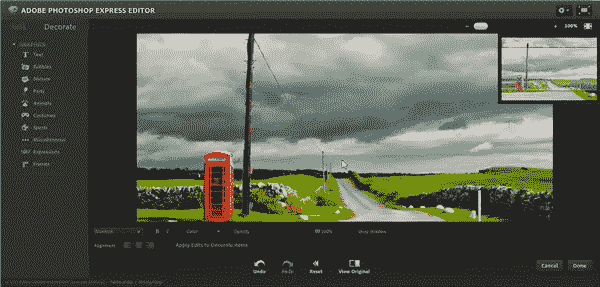
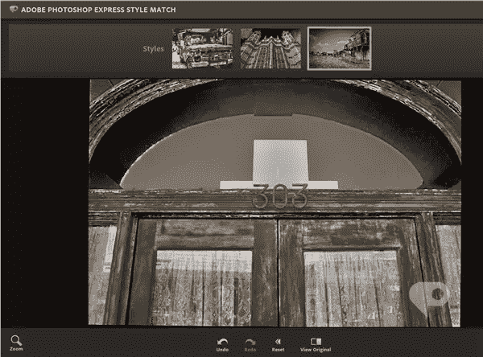
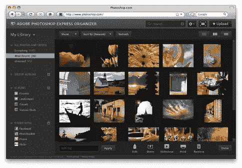

# Adobe 新推出的免费 Photoshop Express 应用程序

> 原文：<https://www.sitepoint.com/photoshop-express-free-photoshop-apps/>

上个月，Adobe 宣布发布了一系列新的网络应用程序,它们都被归入“Photoshop Express”的大类。这些应用程序包括:

*   Photoshop Express 编辑器
*   Photoshop 风格匹配
*   Photoshop 组织者

Photoshop Express Editor 应用程序用于修饰图片。功能包括基本命令，如裁剪和旋转，修复红眼和曝光，更改饱和度和“润色”,这非常像克隆图章工具，让您快速去除污点和小瑕疵。调整包括白平衡、锐化和柔焦，而高级功能是一系列过滤器，允许草图、失真、黑白和流行颜色等效果。一个“装饰”选项可以让你给照片添加文本、语音气泡和各种图形。如果你对任何类型的图形编辑器都有基本的经验，那么这个编辑器是简洁易用的。要使用 Express Editor，您不需要向 Adobe 注册。

Photoshop 样式匹配基于 Photoshop Elements 9 中的样式匹配功能。该应用程序可以让你拍一张照片，复制风格或外观，并将其应用到第二张照片上。

Organizer 应用程序允许您将照片分类到相册中，并与您的好友分享。这款应用需要注册一个 Photoshop.com 账户(免费)。只需点击几下，您就可以将照片发布到您的脸书、Flickr、Picasa 和 Photobucket 页面。

一个额外的幻灯片放映工具让你用你的照片制作交互式幻灯片，Photoshop Express Uploader 让你只需将文件拖到 Photoshop 相册，你就可以备份并准备好了。

Photoshop.com 免费提供 2GB 的存储空间，每个人都可以选择购买额外的在线存储空间，价格为 20GB，每年 20 美元。

你到底用不用 Photoshop.com？你对新的应用感兴趣吗？

## 分享这篇文章