# Photoshop 实力:4 个省时的混合模式技巧

> 原文：<https://www.sitepoint.com/photoshop-prowess-4-time-saving-blend-mode-tricks/>

俗话说得好:时间就是金钱。使用低效的设计技术会导致缓慢的工作，从而导致更少的客户，更低的时薪，以及更少的令人印象深刻的项目组合。知道节省时间的技巧会对你的工作和职业生涯产生微妙但非常积极的影响。

在 Photoshop 中，总是有多种方法来完成同一个目标；其中许多可以通过使用混合模式技巧来实现。很少有项目不能受益于[几分钟的混合模式亮度](https://www.sitepoint.com/the-essential-guide-to-blend-modes-in-photoshop/ "The Essential Guide to Blend Modes in Photoshop")；使用滤镜和混合模式，通常只需两三个步骤就可以完成十个普通 Photoshop 动作所实现的效果。这里有一些流行的技巧，使用混合模式技巧，以节省您的时间，并获得良好的效果。

### 提升你的形象

你不需要把锐化滤镜作为唯一的锐化工具。你可以使用下面的快速技巧来更好地控制图像的锐化。你可以在这里下载[下面的样图。](http://www.sxc.hu/browse.phtml?f=download&id=1400472)

[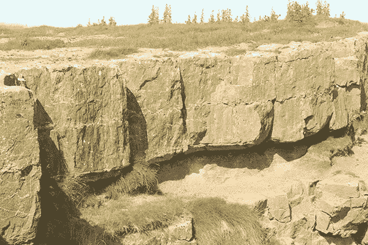](https://www.sitepoint.com/wp-content/uploads/2013/02/sharpening-blend-mode-before.jpg)

点击命令/Ctrl + "J "复制层。然后，进入“过滤器”>“其他”>“高通”这个滤镜有利于检测边缘，这将帮助我们锐化图像，使整个画布的对比度更加清晰。应用的锐化程度取决于几个因素:图像的分辨率，以及图像开始时的清晰度。我将半径设置为 2.5 像素左右。

[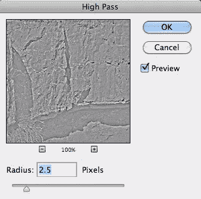](https://www.sitepoint.com/wp-content/uploads/2013/02/Screen-shot-2013-02-14-at-10.47.55-AM.png)

[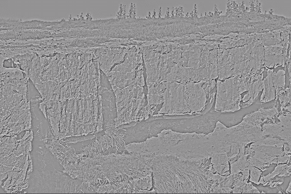](https://www.sitepoint.com/wp-content/uploads/2013/02/Screen-shot-2013-02-14-at-10.48.08-AM.png)

将混合模式设置为“叠加”正如你从下面的图片中看到的，有很多锐化应用到图像，只有少量应用到高通滤波器。如果这对于你来说是太多的锐化，一切都不会丢失，因为你可以通过层的面板简单地降低复制图像的不透明度。这使您可以更好地控制图像的锐化程度。

[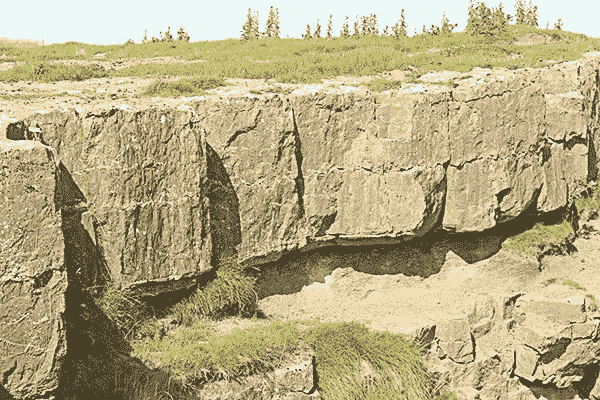](https://www.sitepoint.com/wp-content/uploads/2013/02/Screen-shot-2013-02-14-at-10.50.38-AM.png)

### 更改图像中的颜色

试图令人信服地改变图像中的颜色可能相当困难。您尝试使用色调/饱和度、颜色平衡和其他颜色处理功能，但要在不影响其他颜色的情况下改变一种颜色需要付出很大努力。还有另一种方法可以快速改变图像的颜色。假设您正在寻找巧克力拉布拉多犬的图像，但您只能找到黑色的图像。它的位置正好，但颜色不对。与其花 30 分钟寻找另一张图片，不如用下面的技巧。你可以在这里下载样图[。](http://www.sxc.hu/browse.phtml?f=download&id=1357711)

[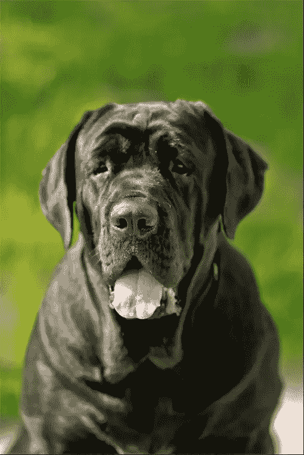](https://www.sitepoint.com/wp-content/uploads/2013/02/Screen-shot-2013-02-14-at-1.17.09-PM.png)

你可以无损地应用下一个技巧。单击“图层”面板中的“新建调整图层”图标，然后选择一个色调/饱和度调整图层。单击并拖动饱和度滑块至最左侧，以降低图像的饱和度。点击图层蒙版图标，使用黑色蒙版出背景，使狗后面的树叶和绿色植物再次可见。

[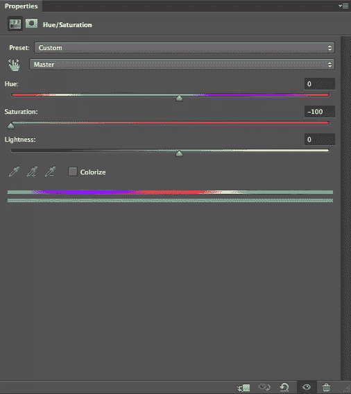](https://www.sitepoint.com/wp-content/uploads/2013/02/Screen-shot-2013-02-14-at-1.17.49-PM.png)

接下来，在色调/饱和度调整图层上方新建一个空白图层。选择一个中等大小的软边笔刷，大约 50 像素。单击颜色选择器图标，在“工具”面板中选择前景色。选择中等棕色(#52453c)。在这个新的空白层上刷狗的黑色区域。确保不要在任何不应该是棕色的地方画画，比如狗的眼睛、舌头或背景。

[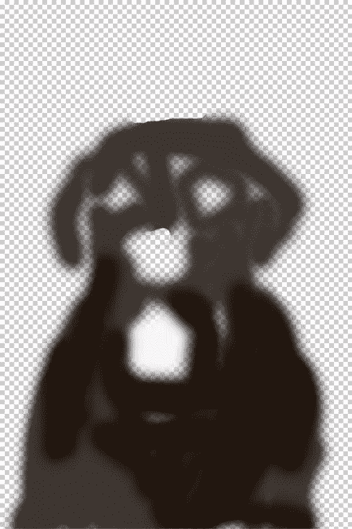](https://www.sitepoint.com/wp-content/uploads/2013/02/Screen-shot-2013-02-14-at-1.18.43-PM.png)

将混合模式更改为“颜色”这将在不永久改变图像的情况下给狗上色。因为狗的皮毛很黑，所以很难看出变化。然而，如果你想减轻狗的色调，只需复制绘制层，这次改变混合模式为“屏幕”你可以在下面的最终图像中看到更亮的结果。

[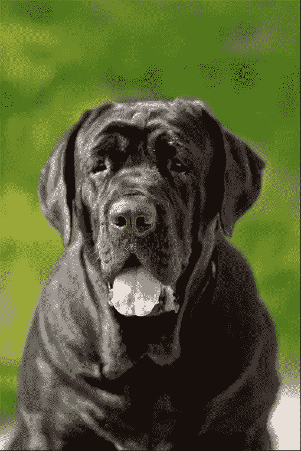](https://www.sitepoint.com/wp-content/uploads/2013/02/Screen-shot-2013-02-14-at-1.19.25-PM.png)

**最终图像:**

[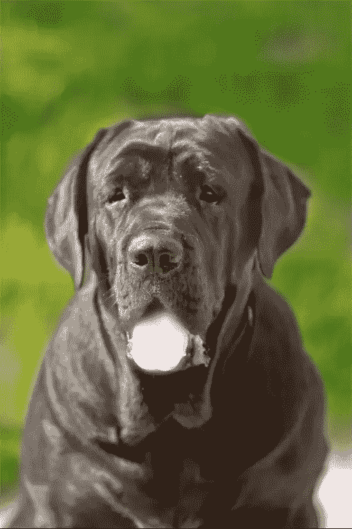](https://www.sitepoint.com/wp-content/uploads/2013/02/Screen-shot-2013-02-14-at-2.54.22-PM.png)

### 使用“差异”混合模式创建一个颜色效果

有几种混合模式可以完全忽略 50%的灰色，因此使用这些特定的混合模式可以产生一些独特的结果。下面的样本图片是一个城市的照片，你可以在这里下载[。](http://www.sxc.hu/browse.phtml?f=download&id=1340309)

[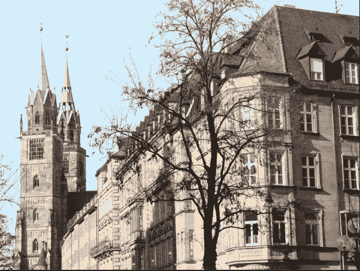](https://www.sitepoint.com/wp-content/uploads/2013/02/Screen-shot-2013-02-14-at-3.36.34-PM.png)

新建一个图层，填充 50%灰色。您可以通过按住 Shift 键并按 Delete 键，提示填充对话框出现来完成此操作。单击 50%灰色选项，然后单击确定。接下来，进入“滤镜”>“噪波”>“添加噪波”设置滑块为 12.5%，选择高斯。

[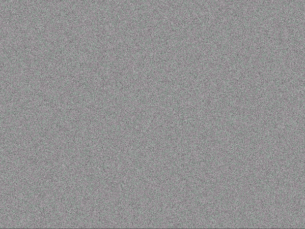](https://www.sitepoint.com/wp-content/uploads/2013/02/Screen-shot-2013-02-14-at-3.37.12-PM.png)

接下来，进入“滤镜”>“模糊”>“运动模糊”，设置角度为 65，距离为 10 像素左右。

[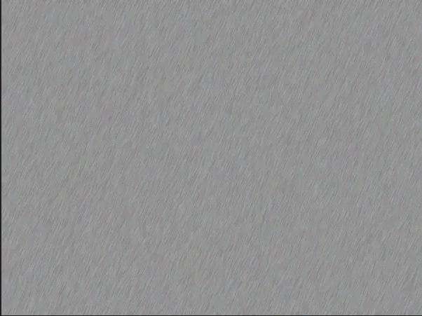](https://www.sitepoint.com/wp-content/uploads/2013/02/Screen-shot-2013-02-14-at-3.39.27-PM.png)

现在你所要做的就是将混合模式设置为“差异”您得到的效果类似于钢笔和墨水素描颜色效果。看起来像是有人在细节上着墨，用彩色铅笔在色彩上松散地画出阴影。这是为图画小说或类似艺术创作元素的一种非常快速的方式。

[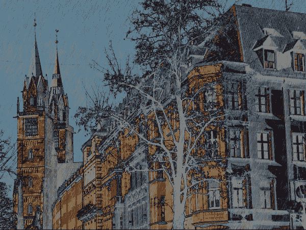](https://www.sitepoint.com/wp-content/uploads/2013/02/Screen-shot-2013-02-14-at-3.39.47-PM.png)

### 在图层样式中使用混合模式

通过在图层样式中使用混合模式技巧，你可以创造一些惊人的效果。正确的组合可以产生无与伦比的结果。要快速制作霓虹文字效果，新建一个图层，填充黑色。选择你喜欢的字体。我发现圆形字体非常适合霓虹效果。我喜欢最近非常流行的一种新字体，叫做 Lovelo 我用 Lovelo 线加粗。将文本居中，并使其为白色。

[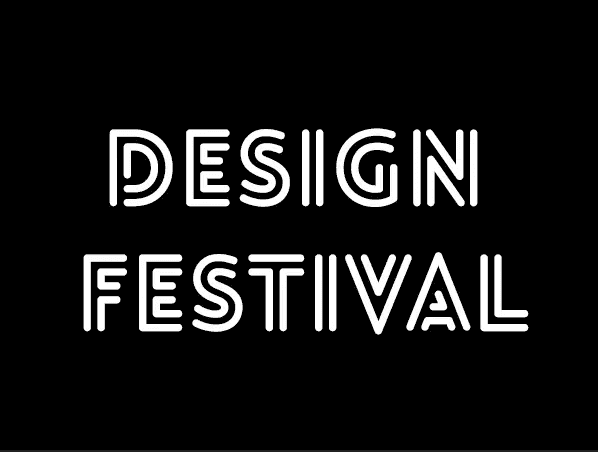](https://www.sitepoint.com/wp-content/uploads/2013/02/Screen-shot-2013-02-14-at-4.30.09-PM.png)

接下来，双击文本层，打开图层样式面板。选择“内发光”，选择更柔和的粉色(#ff00f0)。将源设置为“边缘”，大小设置为 4-5px 左右。你不想把它设置得太高，因为你想让白色作为光源透出来。将混合模式设置为“强光”

[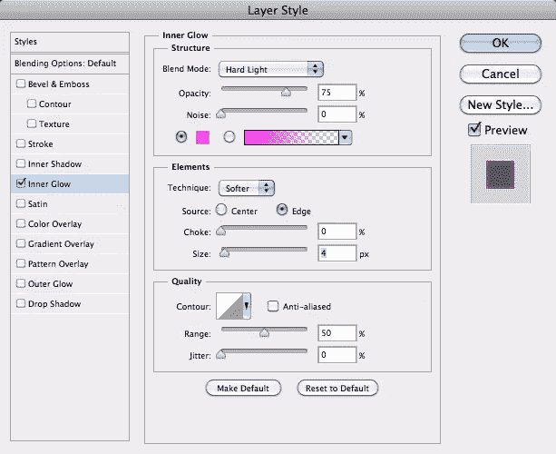](https://www.sitepoint.com/wp-content/uploads/2013/02/Screen-shot-2013-02-14-at-4.31.01-PM.png)

[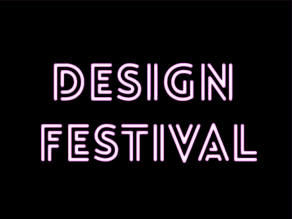](https://www.sitepoint.com/wp-content/uploads/2013/02/Screen-shot-2013-02-14-at-4.31.17-PM.png)

接下来，选择外部发光。选择一个强烈的红色(#ff0000)，设置大小为 10px 左右，设置混合模式为“屏幕”现在，您已经在几分钟内创建了一个霓虹发光文本效果。将正确的字体与正确的颜色、图层样式和混合模式结合起来，创建了一个很好的效果，几乎不需要任何时间。

[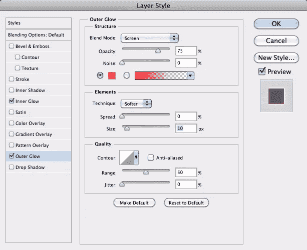](https://www.sitepoint.com/wp-content/uploads/2013/02/Screen-shot-2013-02-14-at-4.32.06-PM.png)

[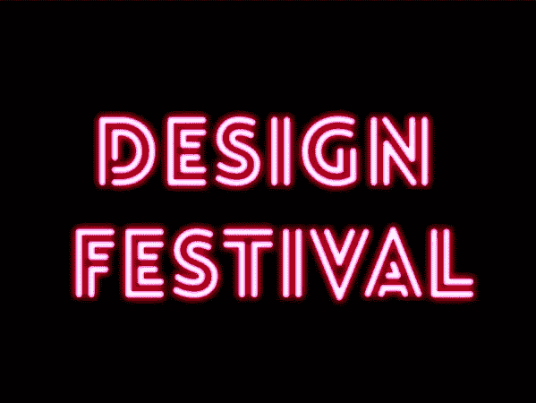](https://www.sitepoint.com/wp-content/uploads/2013/02/Screen-shot-2013-02-14-at-4.32.22-PM.png)

### 结论

能够快速编辑你的图像并创造出漂亮的效果将会使你的设计工作变得更加容易，并使你成为一名更加成功的设计师。了解混合模式的力量以及它们对不同颜色、黑白和灰色阴影的反应，将使您能够利用它们的行为来为您节省大量时间和挫折。

你有什么混合模式的技巧可以分享吗？你是混合模式专家还是需要访问[混合模式 101](https://www.sitepoint.com/the-essential-guide-to-blend-modes-in-photoshop/ "The Essential Guide to Blend Modes in Photoshop") ？

## 分享这篇文章