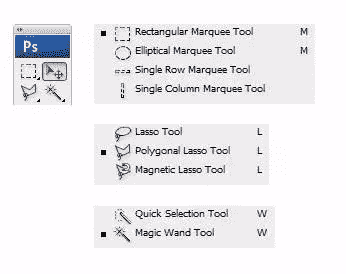
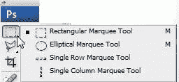
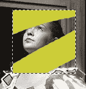
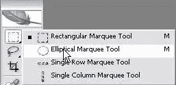
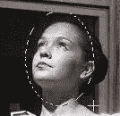
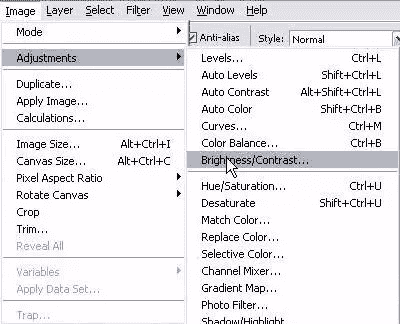
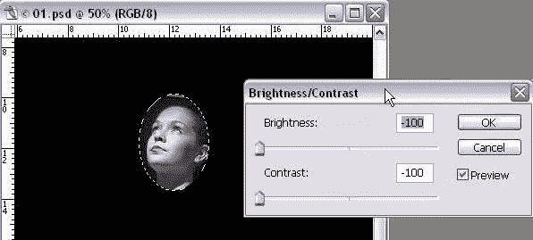

# Photoshop 中的选区，第 1 部分:几何工具

> 原文：<https://www.sitepoint.com/photoshop-selections-geometric-tools/>

知道如何选择，知道在 Photoshop 中使用哪些工具，是非常重要的基本技能。我向我的学生强调，在他们能够用 Photoshop 作文轰动世界之前，他们绝对必须掌握选择工具。

**注意:我们将在这里讨论的一些内容是*非常*基本的。如果你是一名 Photoshop 专业人员，你很可能以前就已经看过了。也就是说，我也会对这些基础知识进行全面的介绍。你永远不知道——毕竟你可能会学到一些东西。**

好了，让我们开始挑选吧！首先，你应该知道你可以根据**颜色**、**形状**和**大小**来选择你的图像。有四组工具可用于实现这一点:

1.  选取框工具
2.  套索工具
3.  快速选择和魔术棒
4.  钢笔工具

在这一系列文章中，我将演示如何使用所有这些工具——除了钢笔工具，钢笔工具非常重要，值得拥有一系列工具。

#### Photoshop 选择工具

上面列出的工具用于进行三种类型的选择:

*   几何选择
*   徒手选择
*   基于颜色的选择

今天我们来看看几何选择。

“几何”可能听起来有点可怕或数学化，但别担心，我们在这里讨论的都是形状。

#### 使用选框工具

您可以使用*矩形选框*工具来选择图像中的矩形或正方形区域。

1.  点击 Photoshop 工具箱中的*矩形选框*工具或者按键盘上的 **M** 。
2.  在图像上，单击并向右下方拖动指针，绘制一个矩形。释放鼠标按钮。

一条动画虚线(通常称为行进中的蚂蚁)表示其内部的区域被**选中**。当您选择一个区域时，它成为图像的**唯一可编辑区域。选区之外的区域受到保护。**

要移动选择:

1.  在您的矩形选择内移动指针，使指针显示为带有小矩形的箭头()。
2.  将所选内容拖到图像的另一部分。当您拖动选区时，只有选区边框会移动，而不是图像中的实际像素。

#### 取消选择选择

当您想要取消选择时，可以执行以下任一操作:

*   确保*矩形选框*工具仍处于选中状态，并在图像窗口中，单击选中区域之外的任何地方。
*   选择*选择* > *取消选择*。
*   使用键盘快捷键 **Ctrl-D** (Windows)或 **Command-D** (Mac)。

当你做任何这些事情，字幕将消失。

#### 将键盘组合与工具一起使用

有时，您可能需要将键盘键与工具结合使用，以使工具以某种方式运行。

1.  确保选择了*矩形选框*工具。将指针放在您想要选择的区域的中心。
    
2.  按下 **Alt-Shift** (Windows)或 **Option-Shift** (Mac)并单击向外拖动。这一次你会注意到，只要你按住 **Shift** 键拖动，选框就是一个完美的正方形。
    *   按住 **Alt** 强制选取框从中心向外画出。
    *   按住 **Shift** 将矩形约束为正方形。
3.  首先，释放鼠标按钮，然后释放键盘按键。
4.  Try using the *Paint Brush* tool to paint in the image window. Notice that the paint brush will only affect the selected area. The rest of the image is protected.

    

#### *椭圆选框*工具

*椭圆选框*工具允许您创建椭圆形或圆形选择选框。

1.  在*矩形选框*工具上按住**鼠标按钮**选择*椭圆选框*工具，打开隐藏工具弹出列表，选择*椭圆选框*工具。

3.  选择*椭圆选框*工具，拖出一个圆或椭圆。像以前一样，按住 **Alt** 强制选取框从中心向外画出。按住 **Shift** 将椭圆约束为正圆。

要**反转**选择，选择*选择* > *反转*或**Ctrl**+**Shift**+**I**(Windows)或**Cmd**+**Shift**+**I**(Mac)。

尽管动画选区边框看起来是一样的，但是仔细看，你会发现一个相似的边框现在出现在图像的四周。你得到了一个反向选择。这意味着图像的其余部分被选中并可以编辑，而圆圈内的原始区域未被选中并受到保护。为了进一步说明这一点，让我们使背景变暗。

1.  选择**图像>调整>亮度/对比度**
    
    亮度/对比度对话框将打开。确保选中“预览”复选框，以便您可以看到您的更改将如何影响图像。
2.  将亮度和对比度滑块都拖到-100。你会看到选定的区域已经变成黑色。
3.  单击“确定”将这些更改应用到您的映像。

#### 单像素选择工具

*单行选框*工具和*单列选框*工具分别用于选择 1 像素高的行或 1 像素宽的列。为网站创建重复背景时，单像素工具非常有用。

像以前一样，在工具箱中选择工具，然后在要选择的区域附近单击，然后将选取框拖动到准确的位置。根据图像的大小，可能看起来好像没有选取框，所以只需增加图像视图的放大倍数。

我希望这篇介绍对任何开始选择的人有用，或者作为那些已经有点生疏的人的复习。在本系列的下一部分中，我将讨论如何使用手绘工具，这将使您能够更好地控制选区的形状，以及如何在不丢失选区的情况下从一个手绘工具切换到另一个手绘工具的一些提示和技巧。

## 分享这篇文章