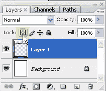
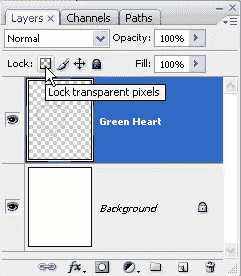
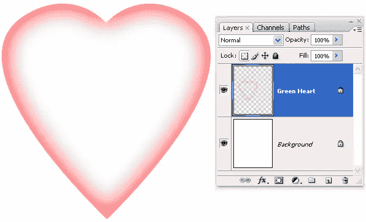

# Photoshop 提示:锁定透明像素

> 原文：<https://www.sitepoint.com/photoshop-tip-locking-transparent-pixels/>

如果你在 Photoshop 的图层面板上看，靠近面板的顶部，你会看到单词“锁”后面跟着四个符号。图标从左到右依次为锁定透明像素、锁定图像像素、锁定位置和锁定全部。今天的小技巧是关于第一个按钮，锁定透明像素，以及你如何在工作中使用它。

在 Photoshop 中，如果一个颜色块有很强的、清晰的边缘，那么改变它是非常容易的。你可以使用油漆桶或颜色替换工具来改变颜色，但如果你想改变一个边缘褪色或半透明的对象的颜色，你需要应用图层面板上的“锁定透明像素”按钮。

这里有一个例子。比方说，你有某种颜色的软边形状。以下面的绿色心形为例。它的外面是实心的，但里面会变得透明。

现在让我们说，我们想改变心从绿色到红色使用油漆桶。如果我们用红色作为前景色的油漆桶工具点击绿色部分，这就是我们得到的结果。

我们已经失去了褪色的边缘，它看起来很粗糙。

要解决这个问题，请单击 Photoshop 图层面板顶部附近的“锁定透明像素”按钮。重要的是要记住，这只适用于透明图层，如果对象是背景图层的一部分，它绝对没有效果。

一旦按钮被按下，透明像素被锁定，我们将只能操纵层的不透明部分。现在，当我们点击绿色的心，褪色的白色被保留。

这种效果对 web 和印刷工作都很有用。你以前用过吗？

## 分享这篇文章