# 使用 PHP 和 MySQL 构建自己的数据库驱动网站，第 1 部分:安装

> 原文：<https://www.sitepoint.com/php-amp-mysql-1-installation/>

这篇文章写于 2009 年，至今仍是我们最受欢迎的帖子之一。如果你渴望学习更多关于 PHP 的知识，你可能会发现这篇关于 CakePHP 的文章非常有趣。

在这本书里，我将指导你走出用纯 HTML 构建网页的静态世界。我们将一起探索数据库驱动网站的世界，发现令人眼花缭乱的动态工具、概念和它们所带来的可能性。无论你做什么，都不要往下看！

好吧，也许你应该往下看。毕竟，这本书的其余部分就在那里。但是记住，你被警告过！

在你建立你的第一个动态网站之前，你必须收集你工作需要的工具。在这一章中，我将向你展示如何下载和安装你需要的两个软件包。你能猜出它们是什么吗？我给你一个提示:他们的名字在这本书的封面上很显眼！它们当然是 PHP 和 MySQL。

如果您习惯于使用 HTML、CSS 甚至少量的 JavaScript 来构建网站，那么您可能习惯于将组成网站的文件上传到另一个位置。也许这是一个你已经付费的虚拟主机服务；也许是你的互联网服务提供商(ISP)提供的免费服务；也可能是你工作的公司 it 部门设置的网络服务器。在任何情况下，一旦你把文件拷贝到目的地，一个叫做网络服务器的软件程序就能找到并提供这些文件的拷贝，只要它们被像 Internet Explorer 或 Firefox 这样的网络浏览器所请求。您可能听说过的常见 web 服务器软件程序包括 Apache 和 Internet 信息服务(IIS)。

PHP 是一种服务器端脚本语言。你可以把它看作是你的网络服务器的一个插件，使它不仅仅是发送网络浏览器要求的文件的精确拷贝。安装了 PHP 之后，你的 web 服务器将能够运行一些小程序(称为 PHP 脚本),这些小程序可以完成从数据库中检索最新信息等任务，并在将网页发送给请求它的浏览器之前，用它来动态生成网页。这本书的大部分内容将集中在编写 PHP 脚本来实现这一点。PHP 完全免费下载和使用。

要让 PHP 脚本从数据库中检索信息，首先必须有一个数据库。这就是 MySQL 的用武之地。MySQL 是一个关系数据库管理系统，简称 RDBMS。我们将在后面讨论它的确切作用和工作原理，但简单地说，它是一个软件程序，能够有效地组织和管理许多信息，同时跟踪所有这些信息是如何相互关联的。MySQL 也使得这些信息很容易通过服务器端脚本语言如 PHP 来访问。MySQL 和 PHP 一样，在大多数情况下是完全免费的。

第一章的目标是为你建立一个配备了 PHP 和 MySQL 的 web 服务器。我将提供在最新的 Windows、Mac OS X 和 Linux 电脑上运行的逐步说明，因此无论您使用的是哪种电脑，您需要的说明都应该在这里。

## 你自己的网络服务器

如果你幸运的话，你当前主机的网络服务器已经安装了 PHP 和 MySQL。大多数都是这样——这也是 PHP 和 MySQL 如此受欢迎的原因之一。如果你的网站主机有这样的装备，好消息是你将能够发布你的第一个数据库驱动的网站，而不必购买支持正确技术的网站主机。

坏消息是你仍然需要自己安装 PHP 和 MySQL。这是因为你需要你自己的 PHP 和 MySQL 的网络服务器来测试你的数据库驱动的网站，然后你才发布给全世界看。

在开发静态网站时，您通常可以将 HTML 文件直接从硬盘加载到浏览器中，以查看它们的外观。当你这样做的时候，不需要网络服务器软件，这很好，因为网络浏览器可以自己理解 HTML 代码。

然而，当使用 PHP 和 MySQL 构建动态网站时，您的 web 浏览器需要一些帮助！网络浏览器无法理解 PHP 脚本；相反，PHP 脚本包含供精通 PHP 的 web 服务器执行的指令，以便生成浏览器可以理解的 HTML 代码。因此，除了公开托管网站的 web 服务器之外，您还需要自己的私有 web 服务器来开发您的网站。

如果你工作的公司有一个特别有用的 IT 部门，你可能会发现已经为你提供了一个开发 web 服务器。典型的设置是，您必须在由内部 web 服务器托管的网络驱动器上处理您站点的文件，该服务器可以安全地用于开发。当您准备好向公众部署网站时，您的文件将从该网络驱动器复制到公共 web 服务器。

如果你有幸在这种环境中工作，你可以跳过这一章的大部分内容。然而，你可能想问负责开发服务器的 IT 人员我在“问你的 Web 主机什么”一节中提到的同样的问题。这是因为当您开始使用 PHP 和 MySQL 支持时，您需要将这些关键信息放在手边，这些支持非常有用。

## Windows 安装

在这一节中，我将向您展示如何在 Windows XP、Windows Vista 或 Windows 7 计算机上开始运行配备 PHP 和 MySQL 的 web 服务器。如果您使用的是 Windows 以外的操作系统，您可以安全地跳过这一部分。

## 一体化安装

我通常建议您分别安装和设置您的 web 服务器、PHP 和 MySQL，并使用各自的官方安装包。这对初学者尤其有用，因为它让你强烈地感觉到这些部分是如何组合在一起的。但是，如果您很急，或者如果您需要建立一个临时开发环境，只使用一两天，下面的快速解决方案可能更好。

如果你想花时间分别安装拼图的每一块，你可以跳到“安装单独的软件包”一节。

WampServer(其中 Wamp 代表 Windows、Apache、MySQL 和 PHP)是一个免费的一体化程序，包括 Apache web server、PHP 和 MySQL 的最新版本的内置副本。让我带您看一下安装过程:

*   从[WAP server 网站](http://www.wampserver.com/en/)下载最新版本。下载文件后(截至本文撰写时，WampServer 2.0g 大小约为 16MB)，双击它启动安装程序，如下图所示。

    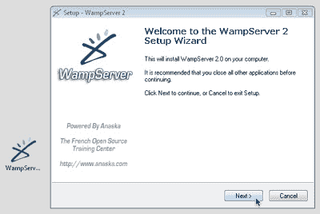

*   安装程序将提示您安装 WampServer 的位置。默认的 c:wamp 如图 1.2 所示，“默认的安装目录是一个好的选择”对于大多数目的来说是一个理想的选择，但是如果你对它的安装位置有强烈的感觉，请随意指定你的首选位置。

    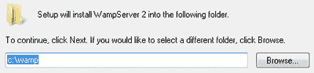

*   安装结束时，WampServer 会要求您选择默认浏览器。这是当您使用附带的系统托盘图标工具启动浏览器时，它将启动的 web 浏览器。如果你安装了 Firefox，它会询问你是否愿意将它作为你的默认浏览器。如果您回答“否”,或者安装了不同的浏览器，它将要求您为您要使用的浏览器选择可执行文件。如图 1.3，“默认选择 Internet Explorer 就可以了”，它为你选择了 Internet Explorer(explorer.exe)，这就可以了。如果您使用的是 Safari 或 Opera 等替代浏览器，您可以浏览找到。exe 文件，如果你想的话。

    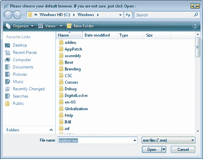

*   当安装 WampServer 时，它启动 Apache HTTP Server 的内置副本，这是一种用于 PHP 开发的流行 web 服务器。此时，Windows 可能会显示一个安全警报，如图 1.4 所示，“这个安全警报告诉您 Apache 正在执行它的任务”，因为 web 服务器试图开始监听来自外界的浏览器请求。

    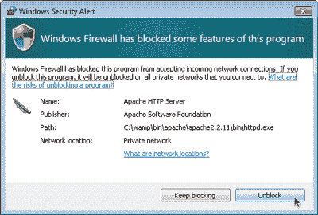

    如果您想绝对确保 Apache 拒绝来自外部世界的连接，并且只有在您自己的计算机上运行的 web 浏览器才能查看您的开发服务器上托管的 web 页面，请随意单击 Keep blocking。但是，WampServer 有自己的内置选项，可以在您需要时阻止与外界的连接，因此我建议您单击 Unblock，以便在需要时灵活地授予对开发服务器的访问权限。

*   接下来，如图 1.5 所示，“如果您知道，请填写您的互联网服务提供商的 SMTP 服务器地址”，WampServer 安装程序将提示您输入 SMTP 服务器和电子邮件地址。一个 PHP 脚本可以发送一封电子邮件，这些设置告诉它发送邮件的服务器，以及要使用的默认“发件人”地址。键入您的电子邮件地址，如果您记得您的互联网服务提供商的 SMTP 服务器地址，也请键入。不过，您可以暂时保留默认值，并在需要使用 PHP 脚本发送电子邮件时手动设置它。

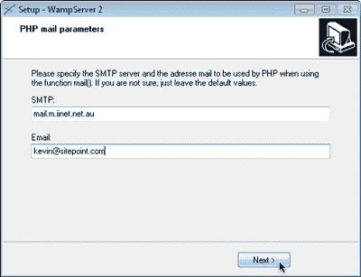

安装完成后，您就可以启动 WampServer 了。一个图标将出现在您的 Windows 系统托盘中。点击它可以看到下面显示的 WampServer 菜单。

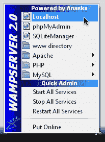

默认情况下，您的服务器只能由您自己的计算机上运行的 web 浏览器访问。如果您单击“联机”菜单项，外部世界将可以访问您的服务器。

要测试 WampServer 是否正常工作，请单击 WampServer 菜单顶部的 Localhost 菜单项。您的 web 浏览器将打开，显示您的服务器主页，如下所示。

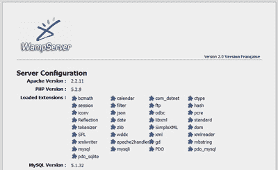

当您使用完 WampServer 后，您可以通过右键单击系统托盘图标并选择“退出”来关闭它(及其内置的服务器)。当您下一次准备在数据库驱动的网站上做一些工作时，只需再次启动它！

在本书的后面，您将需要使用内置于 WampServer 的 MySQL 服务器附带的一些程序。要正常工作，这些程序必须添加到您的 Windows 系统路径中。

要将 WampServer 附带的 MySQL 命令提示符程序添加到 Windows 系统路径中，请按照下列说明操作:

1.  打开 Windows 控制面板。找到并双击系统图标。
2.  针对您的 Windows 版本采取适当的步骤:
    *   在 Windows XP 中，切换到“系统属性”窗口的“高级”选项卡。
    *   在 Windows Vista 或 Windows 7 中，单击边栏中的“高级系统设置”链接。
3.  单击环境变量…按钮。
4.  在标记为“用户的用户变量”的列表中，查找名为 PATH 的变量。
    *   如果存在，请选择它并单击编辑…按钮。
    *   如果没有变量，请单击 New…按钮，并通过键入 PATH 填写变量名。
5.  将路径添加到 WampServer 的 MySQL bin 目录(确切的路径取决于您安装 WampServer 的位置以及它包含的 MySQL 版本。在我的系统上，路径是`C:wampbinmysqlmysql5.1.34bin`。使用 Explorer 查看您的 WampServer 安装文件，找出您系统上的确切路径。)作为变量值:
    *   如果变量值为空，只需键入路径。
    *   如果变量值字段中已经有文本，则添加一个分号(；)添加到值的末尾，然后在其后键入路径。
6.  在每个打开的窗口中单击确定按钮以应用您的更改。

## 安装单个软件包

如果您有时间的话，单独安装每个单独的包确实是一个不错的选择。通过这种方式，您可以了解所有的部分是如何组合在一起的，而且可以独立于其他软件包自由地更新每个软件包。最终，熟悉你将花费大量时间的任何软件的内部工作方式总是值得的。
安装 MySQL

正如我上面提到的，你可以免费下载 MySQL。只需进入 [MySQL 下载页面](http://dev.mysql.com/downloads/)，点击免费 MySQL 社区服务器的下载链接。这将把您带到一个页面，上面有一长串当前推荐的 MySQL 版本的下载链接(在撰写本文时，它是 MySQL 5.1)。

在列表顶部，您会看到 Windows 和 Windows x64 的链接。如果您确定您运行的是 64 位版本的 Windows，请按照 Windows x64 链接下载 Windows Essentials(AMD64/Intel EM64T)软件包(大约 28MB)。如果您知道您运行的是 32 位版本的 Windows，或者如果您完全不确定，请点击 Windows 链接并下载 Windows Essentials (x86)软件包(大约 35MB)——即使您运行的是 64 位版本的 Windows，它也可以工作。虽然有点晦涩，但下面显示的 Pick a mirror 链接是您需要单击来下载文件的链接。

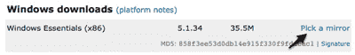

下载完文件后，双击它，像安装其他程序一样完成安装。当提示输入安装类型时，选择典型选项，除非您对 MySQL 的安装目录有特别的偏好。当您到达终点时，系统会提示您选择是否要立即配置 MySQL 服务器。选择此选项以启动配置向导(在我的测试中，我发现配置向导实际上无法自动启动，即使选中了此选项。如果您遇到同样的问题，只需在安装完成后从开始菜单启动 MySQL 服务器实例配置向导，并选择详细配置，我们将使用它来指定一些对确保与 PHP 兼容至关重要的选项。对于向导中的每个步骤，选择此处指示的选项:

1.  **服务器类型**

假设您在桌面计算机上设置 MySQL 用于开发目的，请选择开发人员机器。

*   **数据库使用情况**

除非您确实知道您将需要对事务的支持(因为这种支持对于大多数 PHP 应用程序来说通常是多余的)，否则只选择非事务数据库。

*   连接限制

选择决策支持(DSS)/OLAP 来优化 MySQL，以实现相对适中的连接数。

*   **网络选项**

取消选中启用严格模式选项，以确保 MySQL 与您可能需要在自己的工作中使用的旧 PHP 代码兼容。

*   **默认字符集**

选择对多语言的最佳支持，告诉 MySQL 假设您要使用 UTF-8 编码的文本，它支持当今网络上使用的所有字符。

*   **视窗选项**

允许 MySQL 作为自动启动的 Windows 服务安装；还可以选择在 Windows 路径中包含 Bin 目录，以便更容易地从命令提示符下运行 MySQL 的管理工具。

*   **安全选项**

取消选中修改安全设置选项。最好是在没有向导帮助的情况下学习如何设置这里提到的 root 密码，因此我将在“安装后设置任务”一节中向您展示如何自己设置。

一旦向导完成，您的系统现在应该完全配备了一个正在运行的 MySQL 服务器！

要验证 MySQL 服务器是否正常运行，请键入 Ctrl+Alt+Del 并选择打开任务管理器的选项。单击“显示所有用户的进程”按钮，除非它已被选中。如果一切正常，服务器程序(mysqld.exe)应该列在进程选项卡上。它也会在你重启系统时自动启动。

## 安装 PHP

下一步是安装 PHP。前往 PHP 下载页面，选择 Windows 二进制文件下的 PHP 5.2.x zip 包；避免安装程序版本，它更容易安装，但是缺少手工安装 PHP 所获得的灵活性。

***针对 PHP 5.3 的更新:*** 截止到 PHP 5.3，现在有四个不同版本的 PHP 可供选择。你想要标有 **VC6 x86 线程安全**的那个。

***PHP 4 怎么样？***

在撰写本文时，PHP 5 作为 PHP 的首选版本已经根深蒂固。在 PHP 5 最初发布后的几年里，许多开发人员选择坚持使用 PHP 4，因为它在稳定性和性能方面有着良好的记录，事实上，今天许多廉价的 web 主机还没有升级到 PHP 5。然而，这已经没有任何借口了；PHP 5 是更好的选择，PHP 4 的开发已经完全停止。如果你的虚拟主机还停留在 PHP 4 时代，你最好找一个新的虚拟主机！

PHP 是作为现有 web 服务器软件(如 Apache 或 Internet Information Services)的插件来运行的，因此在安装 PHP 之前，您必须先设置一个 web 服务器。

许多版本的 Windows 都带有微软强大的 Internet 信息服务(IIS) web 服务器，但并非所有版本都是如此。Windows XP Home、Windows Vista Home 和 Windows 7 Home Basic(以及其他)没有 IIS，因此如果您想开发数据库驱动的网站，您需要在这些版本的 Windows 上安装自己的 web 服务器。最重要的是，各种版本的 Windows 都带有不同版本的 IIS，其中一些在如何配置它们以使用 PHP 方面有很大的不同。

记住这一点，如果你还在考虑 IIS，你应该知道在现实世界中用 IIS 托管使用 PHP 构建的网站也是相对不常见的。一般来说，在运行某种 Linux 操作系统的服务器上托管 PHP 驱动的站点，并安装免费的 Apache web 服务器，成本更低，也更可靠。在 IIS 上托管 PHP 站点的唯一原因是，如果您的公司已经投资了 Windows 服务器来运行使用 ASP.NET(一种内置于 IIS 中的微软技术)构建的应用程序，并且您还想重用现有的基础设施来托管 PHP 应用程序。

尽管这绝不是一项要求，但通常最简单的方法是设置您的开发服务器，使其尽可能与您的 web 站点的公开部署环境相匹配。因此，我建议使用 Apache web 服务器——即使是在 Windows 计算机上进行开发。如果你坚持(或者你的老板坚持)使用 IIS 托管你的基于 PHP 的站点，你会在从 PHP 网站下载的 PHP zip 包中的`install.txt`文件中找到必要的安装说明。

如果您需要在您的计算机上安装 Apache，请浏览 Apache HTTP Server 项目的[,并查找被描述为最佳可用版本的 Apache(在撰写本文时，它的版本是 2.2.11，如下所示)。](http://httpd.apache.org/)

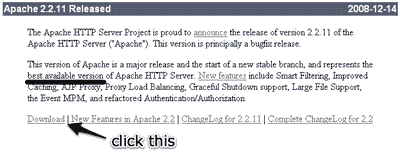

进入下载页面后，向下滚动找到各种可用版本的链接。您需要的是不带加密的 Win32 二进制文件，如下所示。

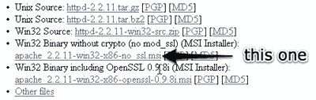

文件下载完成后，像往常一样双击它，启动安装向导。几个步骤之后，您将到达服务器信息屏幕。

如果您正在设置一个可以在网上公开访问的 web 服务器，这个屏幕上的选项将会非常重要。为了设置开发服务器，您可以键入任何您喜欢的内容。如果您知道电脑的网络名称，请键入该名称作为服务器名称。如果你像我一样，是个注重细节的人，请随意输入你的正确电子邮件地址。如果您的计算机上已经运行了一个 web 服务器(例如，如果您还在同一台计算机上设置了 IIS 来进行一些 ASP.NET 开发)，您可能需要在此屏幕上选择“仅用于当前用户，在端口 8080 上手动启动时”选项，以避免与在端口 80 上运行的现有 web 服务器发生冲突。

在下一个屏幕上，选择安装类型的典型选项，然后按照向导完成安装。完成后，您应该会在系统托盘中看到 Apache 服务监视器运行的新图标。如果您选择默认选项让 Apache 自动启动，状态指示器应该是绿色的，如下所示。

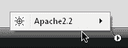

否则，您将需要手动启动 Apache，如下所示，然后才能使用它。

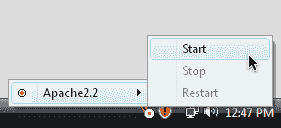

一旦您完成了当天的 web 开发工作，您还可以使用 Apache 服务监视器图标来停止 Apache 运行。

当 Apache 启动并运行后，打开您选择的 web 浏览器，在地址栏中键入`http://localhost`。如果您选择在端口 8080 上运行 Apache，您将需要键入`http://localhost:8080`。点击 Enter，您应该会看到如下所示的页面，确认 Apache 工作正常。

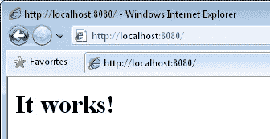

有了 Apache 的自立，现在就可以安装 PHP 了。请遵循以下步骤:

1.  将从 PHP 网站下载的文件解压缩到您选择的目录中。我推荐`C:PHP`，并且从现在开始我将参考这个目录，但是如果你喜欢的话，可以随意选择另一个目录。
2.  在 PHP 文件夹中找到名为`php.ini-dist`的文件，并复制一份副本。最简单的方法是右键单击文件图标并将其拖动一小段距离，放在同一个浏览器窗口中，然后从弹出菜单中选择“复制到此处”。这将为您留下一个名为`php - Copy.ini-dist`的新文件(取决于您使用的 Windows 版本)。找到这个新文件，并将其重命名为`php.ini`。Windows 将询问您是否确定要更改文件扩展名(从`.ini-dist`到`.ini`)；单击是。

***Windows 默认隐藏已知的文件扩展名***

*当您将文件重命名为`php.ini`时，您可能会注意到图标旁边出现的新文件名实际上只是 php。如果发生这种情况，这是因为您的 Windows 副本被设置为隐藏文件扩展名，如果它识别它。因为 Windows 知道`.ini`文件是配置设置文件，所以它隐藏了这个文件扩展名。*

可以想象，这个特性会造成一定程度的混乱。当你将来返回编辑`php.ini`文件时，能够看到它的完整文件名会有所帮助，这样你就可以把它与同一文件夹中的`php.gif`和`php.exe`文件区分开来。

要关闭文件扩展名隐藏，请打开 Windows 控制面板并搜索文件夹选项。打开“文件夹选项”窗口，切换到“视图”选项卡。在“文件和文件夹”下，取消选中“隐藏已知文件类型的扩展名”复选框，如下所示。

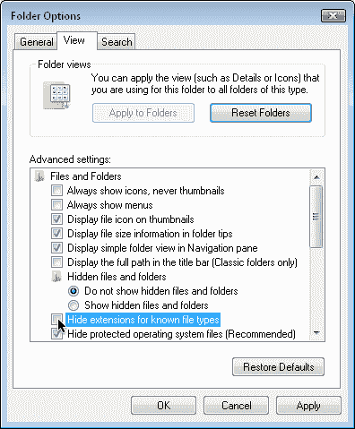

*   在您喜欢的文本编辑器中打开`php.ini`文件。如果您没有特别的偏好，只需双击文件在记事本中打开它。这是一个很大的文件，有很多令人困惑的选项，但是请查找以 doc_root 开头的行(记事本的 Edit > Find…特性会有所帮助)。开箱后，这一行看起来像这样:

`doc_root =`

在这一行的末尾，添加 web 服务器文档根目录的路径。对于 Apache 服务器，这是主 Apache web 服务器目录中的`htdocs`文件夹。如果您在默认位置安装了 Apache，那么路径应该是`"C:Program FilesApache Software FoundationApache2.2htdocs"`。如果你在别处安装了它，找到`htdocs`文件夹并输入它的路径:

`doc_root = "C:Program FilesApache Software FoundationApache2.2htdocs"`

在文件中再往下一点，查找以`extension_dir`开头的那一行，并将其设置为指向 PHP 文件夹的 ext 子文件夹:

`extension_dir = "C:PHPext"`

在文件中继续向下滚动，您会看到一串以`;extension=`开头的行。这些是 PHP 的可选扩展，默认情况下是禁用的。我们希望启用 MySQL 扩展，以便 PHP 可以与 MySQL 通信。为此，请删除`php_mysqli.dll`行开头的分号:

`extension=php_mysqli.dll`

***PHP _ MySQL，不是 php_mysql***

*在`php_mysqli.dll`线的正上方有一条`php_mysql.dll`线。`php_mysqli`中的`i`代表改良。您希望启用新的改进的 MySQL 扩展。没有`i`的那个已经过时了，它的一些特性与当前版本的 MySQL 不兼容。*

继续向下滚动文件，寻找以`;session.save_path`开头的一行。再次删除分号以启用这一行，并将其设置为 Windows 临时文件夹:

`session.save_path = "C:WindowsTemp"`

保存所做的更改并关闭文本编辑器。

这就是 PHP 的设置。现在，您可以设置 Apache 服务器，将其作为插件使用:

1.  以管理员身份运行记事本。这是必要的，因为默认情况下，Apache 配置文件只能由管理员编辑。为此，在开始菜单中找到记事本图标(在所有程序>附件下)并右键单击它。单击“以管理员身份运行”菜单项。
2.  在记事本中选择文件>打开…。浏览到 Apache 安装文件夹中的 conf 子文件夹(默认情况下是`C:Program FilesApache Software FoundationApache2.2conf`，并选择位于那里的`httpd.conf`文件。为了使该文件可供选择，您需要选择所有文件(*。*)从打开窗口底部的文件类型下拉菜单中选择。
3.  在该文件中查找以`DirectoryIndex`开头的现有行，如下所示:

```
 <IfModule dir_module>  
        DirectoryIndex index.html  
      </IfModule>
```

这一行告诉 Apache 在查找给定目录的默认页面时使用哪个文件名。将`index.php`添加到该行的末尾:

```
 <IfModule dir_module>  
        DirectoryIndex index.html index.php  
      </IfModule>
```

*   Apache 安装程序应该已经正确设置了这个又长又吓人的配置文件中的所有剩余选项。您需要做的就是在文件的最后添加以下几行:

```
 LoadModule php5_module "C:/PHP/php5apache2_2.dll"  
      AddType application/x-httpd-php .php  
      PHPIniDir "C:/PHP"
```

确保`LoadModule`和`PHPIniDir`行指向您的 PHP 安装目录，并注意在路径中使用正斜杠(/)而不是反斜杠()。

***PHP 和未来的 Apache 版本***

*从历史上看，Apache 服务器的主要新版本都需要上面的`LoadModule`行中提到的`.dll`文件的新版本。例如，如果你再看一下你的 PHP 安装目录，你会看到那里也有`php5apache.dll`和`php5apache2.dll`文件。这些文件分别用于 Apache 1.3 和 Apache 2.0。*

*当你读到这篇文章的时候，Apache 可能已经经历了另一个主要版本(例如 Apache 2.3)，这可能需要另一个新的`.dll`文件。例如，Apache 2.3 可能要求您使用名为`php5apache2_3.dll`的新文件。*

*如果您正在使用 Apache 的后续版本，并且如果您确实看到一个看起来可能与您的 Apache 版本相对应的`.dll`文件，请相应地尝试调整`LoadModule`行。如果 Apache 无法正确加载 PHP，您可以随时返回并编辑这个文件。*

*   保存更改并关闭记事本。*   使用 Apache 服务监视器系统托盘图标重新启动 Apache。如果一切顺利，Apache 将毫无怨言地再次启动。*   双击 Apache 服务监视器图标，打开 Apache 服务监视器窗口。如果 PHP 安装正确，该窗口的状态栏应该会显示您安装的 PHP 版本，如下图所示。*   单击确定关闭 Apache 服务监视器窗口。

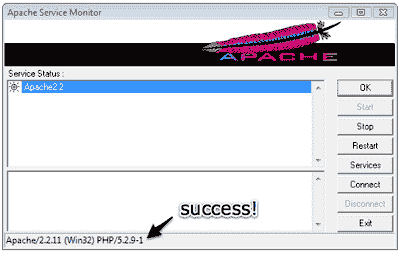

安装了 MySQL、Apache 和 PHP 之后，您就可以进入“安装后设置任务”一节了。

## Mac OS X 安装

Mac OS X 的与众不同之处在于，它是唯一一个将 Apache 和 PHP 作为每个标准安装的组件进行安装的消费者操作系统。也就是说，这些需要一些调整才能打开，并且您还需要安装 MySQL 数据库。

在这一节中，我将向您展示如何在运行 Mac OS X 版本 10.5 (Leopard)的 Mac 计算机上开始运行配备 PHP 和 MySQL 的 web 服务器。如果你使用的是 Mac 的替代品，你可以安全地跳过这一部分。

## 一体化安装

我通常建议您分别安装和设置您的 web 服务器、PHP 和 MySQL，并使用各自的官方安装包。这个过程对初学者特别有用，因为它让你强烈地感觉到这些部分是如何组合在一起的。但是，如果您很急，或者如果您需要建立一个临时开发环境，只使用一两天，那么快速而简单的解决方案可能更好。

如果你想花时间分别安装拼图的每一块，你可以跳到“安装单独的软件包”一节。

MAMP(代表 Mac、Apache、MySQL 和 PHP)是一个免费的一体化程序，包括 Apache web server、PHP 和 MySQL 的最新版本的内置副本。让我带您看一下安装过程:

1.  从[MAMP 网站](http://www.mamp.info/)下载最新版本。下载文件后(截至本文撰写时，MAMP 1.7.2 大小约为 130MB)，双击解压磁盘镜像(`MAMP_1.7.2.dmg`)，然后双击磁盘镜像挂载，如下图。

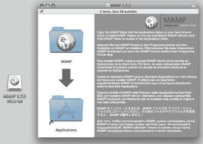

*   按照磁盘映像窗口中的指示，将“MAMP”文件夹图标拖到“应用程序”文件夹图标上，以便在您的系统上安装 MAMP。拷贝操作完成后，您可以将桌面上的 MAMP 图标拖到 dock 上的废纸篓图标以将其推出(它会变成推出图标)，然后删除磁盘映像，以及您下载的原始`.zip`文件。

浏览到你的应用程序文件夹，找到新的 MAMP 文件夹。打开它，双击里面的 MAMP 图标启动 MAMP。当 MAMP 启动时，将会发生以下情况。首先，MAMP 窗口如下所示。

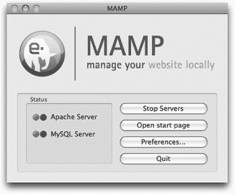

当内置的 Apache 和 MySQL 服务器启动时，这两个状态指示器将从红色变为绿色。接下来，MAMP 将打开您的默认 web 浏览器并加载 MAMP 欢迎页面，如下所示。

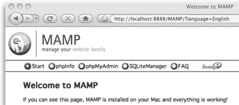

当你使用完 MAMP 后，你可以通过点击 MAMP 窗口中的退出按钮来关闭它(以及它的内置服务器)。当您下一次准备在数据库驱动的网站上做一些工作时，只需再次启动它！

在本书的后面，你将需要使用 MAMP 内置的 MySQL 服务器附带的一些程序。要正常工作，这些程序必须添加到您的 Mac OS X 系统路径。

要将 MAMP 附带的 MySQL 命令提示符程序添加到您的 Mac OS X 系统路径，请按照以下说明操作:

1.  打开终端窗口。(要打开“终端”窗口，请启动“终端”应用程序，您可以在“应用程序”文件夹的“实用工具”文件夹中找到它。)

如果您运行的是 **Mac OS X 10.5 (Leopard)或更高版本**，请键入以下命令:

```
 Machine:~ user$ sudo su   
            Password: (type your password)   
            sh-3.2# echo '/Applications/MAMP/Library/bin' >> /etc/paths.d/MAMP   
            sh-3.2# exit
```

***什么要打***

*`Machine:~ user$`部分(其中`Machine`是你的电脑名称)代表已经显示的提示。您只需要键入命令。*

如果您运行的是 **Mac OS X 10.4 (Tiger)或更早的**，请键入以下命令:

```
 Machine:~ user$ touch .profile   
            Machine:~ user$ open .profile
```

这应该能打开隐藏的。“文本编辑”中的描述文件。该文件包含一个终端命令列表，每当您打开一个新的终端窗口时，这些命令都会自动执行。如果您以前从未在系统上安装过命令提示符程序，该文件将完全为空。无论如何，将这一行添加到文件的末尾:

```
export PATH=$PATH:/Applications/MAMP/Library/bin
```

存储您的更改，并退出“文本编辑”。

*   关闭终端窗口，让更改生效。

## 安装单个软件包

如果您有时间的话，单独安装每个单独的包确实是一个不错的选择。您有机会了解所有的部分是如何组合在一起的，并且您可以独立于其他包来更新每个包。此外，熟悉你将花费大量时间的任何软件的内部工作方式总是值得的。

以下说明假定您正在运行 Mac OS X 10.5 (Leopard)或更高版本。如果你运行的是较早版本的 Mac OS OX，你应该坚持使用一体机选项。

## 安装 MySQL

如果你想自己编译 MySQL，苹果在它的 [Mac OS X 互联网开发者网站](http://developer.apple.com/internet/macosx/osdb.html)上有一个相当全面的在 Mac OS X 上安装 MySQL 的指南。然而，直接从 MySQL 网站获得预编译的二进制版本要容易得多。

首先访问[MySQL 下载页面](http://dev.mysql.com/downloads/)
。单击免费 MySQL 社区服务器的下载链接。这将把您带到一个页面，上面有一长串当前推荐的 MySQL 版本的下载链接(在撰写本文时，它是 MySQL 5.1)。

单击 Mac OS X(包格式)链接。您将看到下图所示的下载列表。你需要选择哪一个取决于你的操作系统版本和平台架构。如果您的系统运行的是 Mac OS X 版本 10.5 (Leopard)，您可以忽略 Mac OS X 10.4 链接。如果你知道你的 Mac 有 64 位处理器，你可以放心地选择 Mac OS X 10.5 (x86_64)版本。如果你完全不确定，你的最佳选择是 Mac OS X 10.5 (x86)版本——它只需要你有一台基于英特尔的 Mac(为了确保安全，请检查“关于这台 Mac”窗口中的处理器信息，你可以从苹果菜单访问它)。如果你有一台旧的基于 PowerPC 的 Mac，你需要一个 PowerPC 版本。32 位版本是最安全的选择，因为它也可以在 64 位系统上运行。


下载完`mysql-version-osxversion-platform.dmg`文件后，双击它来挂载磁盘映像。如下所示，它包含了`.pkg`格式的安装程序，以及一个`MySQLStartupItem.pkg`文件。双击安装程序，它将引导您完成 MySQL 的安装。

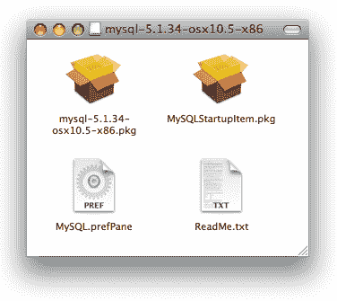

一旦 MySQL 安装完毕，您就可以启动 MySQL 服务器了。打开一个终端窗口(要打开终端窗口，请启动终端应用程序，您可以在“应用程序”文件夹的“实用工具”文件夹中找到它)，然后键入以下命令:

```
Machine:~ user$ sudo /usr/local/mysql/bin/mysqld_safe
```

***什么要打***

*`Machine:~ user$`部分(其中`Machine`是你的电脑名称)代表已经显示的提示。您只需要键入以粗体显示的命令。*

一旦你输入了命令，按回车键。

该命令以管理员权限运行`mysqld_safe`脚本。系统会提示您输入密码，然后会显示一条状态消息，确认 MySQL 正在运行。

MySQL 运行后，您可以通过键入 Ctrl+Z 停止该进程，然后键入以下命令让它继续在后台运行，从而将其切换到后台执行:

```
Machine:~ user$ bg
```

然后，您可以退出终端应用程序，MySQL 将继续作为服务器在您的系统上运行。当您想要关闭 MySQL 服务器时，请打开一个新的终端窗口并键入以下命令:

```
Machine:~ user$ sudo /usr/local/mysql/bin/mysqladmin shutdown
```

虽然你会因为记住这些命令而获得大量的极客信誉，但是有一种更简单的方法来控制你的 MySQL 服务器。回到前面显示的安装盘映像，您会注意到一个名为`MySQL.prefPane`的文件。连按它以在 Mac OS X 的“系统偏好设置”中安装一个新面板，下面显示的窗口将会打开。

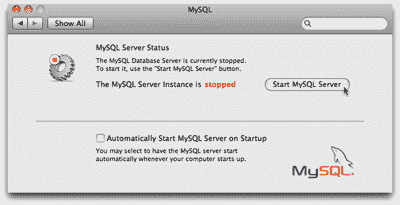

这个窗口会告诉你你的 MySQL 服务器是否正在运行，并让你通过点击一个按钮来启动和关闭它！

想必您会希望系统在启动时自动启动 MySQL 服务器，这样您就可以避免在重启系统时重复上述过程。“系统偏好设置”面板有一个复选框可以完成这项工作，但是要让这个复选框完成任何工作，您必须首先从安装盘映像安装`MySQLStartupItem.pkg`。

当你按照你想要的方式设置好一切后，你可以安全地把你桌面上的 MySQL 安装盘图标拖到垃圾桶，然后删除你下载的`.dmg`文件。

您想要做的最后一项任务是将`/usr/local/mysql/bin`目录添加到您的系统路径中。这样做可以让你在终端中运行像`mysqladmin`和`mysql`这样的程序(在本书后面我们会用到很多),而不用输入它们的完整路径。打开一个新的终端窗口，键入以下命令:

```
Machine:~ user$ sudo su   
Password: (type your password)   
sh-3.2# echo '/usr/local/mysql/bin' >> /etc/paths.d/mysql   
sh-3.2# exit
```

关闭终端窗口，然后打开一个新窗口，让更改生效。然后，在 MySQL 服务器运行的情况下，尝试从主目录运行`mysqladmin`程序:

```
Machine:~ user$ mysqladmin status
```

如果一切正常，您应该会看到一个关于您的 MySQL 服务器的简要统计列表。
安装 PHP

Mac OS X 10.5 (Leopard)内置了 Apache 2.2 和 PHP 5！要将它们用于开发，您只需打开它们:

1.  打开“系统偏好设置”(苹果菜单上的“系统偏好设置…”)。
2.  在主“系统偏好设置”菜单中，点按“互联网与网络”下的“共享”。
3.  确保选中了 Web 共享，如下所示。

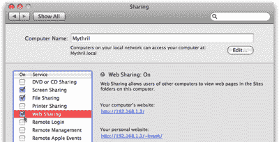

*   退出“系统偏好设置”。*   打开你的浏览器，在地址栏输入`http://localhost`,然后回车。您的浏览器应该显示如下所示的标准 Apache 欢迎消息。

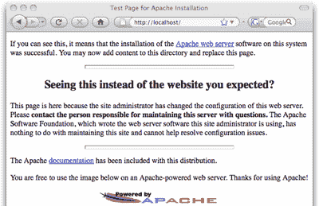

完成这个过程后，Apache 将在系统启动时自动运行。现在，您已经准备好通过启用 PHP 支持来增强该服务器:

1.  在 Finder 菜单栏中，选取“前往”>“前往文件夹(？+?+G)，并在单击 Go 之前键入`/private/etc/apache2/`。
2.  在打开的 Finder 窗口中，应该有一个名为`httpd.conf`的文件。这是 Apache 配置文件。默认情况下，它是只读的。右键单击该文件并选择“显示简介(？+I)打开文件的属性。向下滚动到`httpd.conf`信息窗口的底部，找到共享&权限设置。

默认情况下，此部分中的设置是禁用的。单击下图所示的小锁图标来启用它们。出现提示时，输入您的密码。

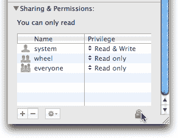

要使该文件可编辑，请将 Privilege 列中的值更改为 every one Read & Write，如下所示。

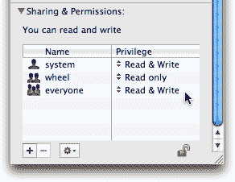

*   回到 apache2 文件夹的 Finder 窗口，右键单击文件夹窗口的背景并选择“显示简介”以打开文件夹的属性。与上一步一样，将“所有人”的“共享和权限”设置为“读和写”。*   最后，双击`httpd.conf`文件，在文本编辑中打开它。*   在`httpd.conf`文件中，搜索这一行:

```
 #LoadModule php5_module        libexec/apache2/libphp5.so
```

通过删除行首的散列字符(#)来启用此命令。

*   存储您的更改，并退出“文本编辑”。*   如果您喜欢自己收拾，可以返回并重置对`httpd.conf`文件和`apache2`文件夹的权限。这将防止计算机的其他用户对 Apache 配置进行更改。*   打开终端窗口，键入以下命令来重新启动 Apache:

```
 Machine:~ user$ sudo /usr/sbin/apachectl restart
```

出现提示时，键入您的密码。

*   再次在浏览器中加载`http://localhost`以确保 Apache 仍在运行。

您的计算机现在配备了支持 PHP 的 Apache web 服务器。如果您需要更改 Apache 的配置，您知道如何使用上面的说明编辑它的`httpd.conf`文件。然而，PHP 插件有自己的配置文件，名为`php.ini`，您需要编辑该文件来告诉 PHP 如何连接到您的 MySQL 服务器。

Mac OS X 内置了 PHP 版本，默认情况下没有`php.ini`文件——PHP 只是使用默认设置运行。为了修改这些设置，您需要打开终端并将`/private/etc/php.ini.default` 文件复制到`/private/etc/php.ini`:

```
Machine:~ user$ cd /private/etc   
Machine:etc user$ sudo cp php.ini.default php.ini   
Password: (type your password)
```

要使这个新的`php.ini`文件可供像您这样的用户编辑，请使用上述编辑`httpd.conf`的相同过程:在 Finder 中使用“前往”>前往文件夹打开`/private/etc`，修改`php.ini`文件和包含它的文件夹的权限，然后用“文本编辑”打开该文件。

向下滚动文件或使用编辑>查找>查找…(？+F)来定位`mysql.default_socket`选项。编辑 php.ini 文件的这一行，如下所示:

```
mysql.default_socket = /tmp/mysql.sock
```

进一步向下滚动找到`mysqli.default_socket`选项(mysqli，不是 mysql)，并进行同样的更改:

```
mysqli.default_socket = /tmp/mysql.sock
```

存储您的更改，退出“文本编辑”,并恢复文件和目录权限(如果您愿意)。最后，打开一个终端窗口，键入以下命令再次重启 Apache:

```
Machine:~ user$ sudo /usr/sbin/apachectl restart
```

出现提示时，键入您的密码。一旦 Apache 再次启动并运行，再次在浏览器中加载`http://localhost`以确保一切正常。

就是这样！安装了 MySQL、Apache 和 PHP 之后，您就可以进入“安装后设置任务”一节了。

## Linux 安装

这一节将向您展示在最新的 Linux 发行版中手动安装 Apache、PHP 和 MySQL 的过程。这些指令是在 [Ubuntu 8.10](http://www.ubuntu.com/) 下测试的；然而，他们应该会在其他发行版上工作，比如 [Fedora](http://fedoraproject.org/) 、 [Debian](http://www.debian.org/) 、 [openSUSE](http://www.opensuse.org/) 和 [Gentoo](http://www.gentoo.org/) ，不会有太多麻烦。所涉及的步骤将非常相似，几乎相同。

大多数 Linux 发行版都带有这样或那样的包管理器。Ubuntu 的[新立得软件包管理器](hhttps://help.ubuntu.com/community/SynapticHowto)是 Debian 软件包管理器 [APT](http://www.debian.org/doc/user-manuals#apt-howto) 的图形化前端。其他发行版使用旧的 RPM 包管理器。无论您使用哪种发行版，Apache、PHP 和 MySQL 的预打包版本都应该是现成的。这些预先打包的软件版本非常容易安装；不幸的是，它们也限制了您可以使用的软件配置选项。出于这个原因——也因为任何试图记录在所有流行的 Linux 发行版上安装打包版本的过程的尝试都注定要失败——我将向您展示如何手动安装它们。

如果您已经以打包的形式安装了 Apache、PHP 和 MySQL，请随意使用这些版本，并跳到“安装后设置任务”一节。如果遇到任何问题，可以随时卸载打包版本，回到这里手动安装。

## 安装 MySQL

从下载 MySQL 开始。只需进入 [MySQL 下载页面](http://dev.mysql.com/downloads/)，点击免费 MySQL 社区服务器的下载链接。这将把您带到一个页面，上面有一长串当前推荐的 MySQL 版本的下载链接(在撰写本文时，它是 MySQL 5.1)。

单击列表顶部附近的链接，转到 Linux(非 RPM 软件包)。现在您需要选择与您的系统架构相对应的包。如果你确定你运行的是 64 位版本的 Linux，那就下载 Linux (AMD64/Intel EM64T)包(大约 120MB)。如果你运行的是 32 位版本的 Linux，下载 Linux (x86)包(大约 115 MB)——即使你运行的是 64 位版本的 Linux，它也能工作。可能有点不清楚，但是下图中显示的 Pick a mirror 链接是您需要单击以下载文件的链接。

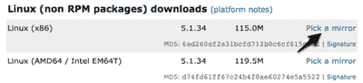

下载文件后，打开终端，以 root 用户身份登录:

```
user@machine:~$ sudo su
```

当然，系统会提示您输入密码。

将目录更改为`/usr/local`并解压缩下载的文件:

```
root@machine:/home/user# cd /usr/local    
root@machine:/usr/local# tar xfz ~user/Desktop/mysql-version-linux-platform.tar.gz
```

第二个命令假设您将下载的文件留在了桌面上，这是您的主目录中的桌面目录。您需要用您的用户名替换 user，用您下载的 MySQL 版本替换 version，用您下载的发行版的架构和编译器版本替换 platform 这是为了使命令与您下载的文件的路径和文件名完全匹配。例如，在我的电脑上，确切的命令如下所示:

```
root@mythril:/usr/local# tar xfz ~kyank/Desktop/mysql-5.1.34-linux-x86_64-glibc23.tar.gz
```

一两分钟后，您将返回到命令提示符。快速 ls 将确认您现在有一个名为 mysql-version-linux-platform 的目录。这是它在我电脑上的样子:

```
root@mythril:/usr/local# ls    
bin  games    lib  mysql-5.1.34-linux-x86_64-glibc23  share    
etc  include  man  sbin                               src
```

接下来，创建一个名为 mysql 的新目录的符号链接，以便更容易地访问该目录。然后输入目录:

```
root@machine:/usr/local# ln -s mysql-version-linux-platform mysql    
root@machine:/usr/local# cd mysql
```

虽然您可以作为根用户运行服务器，甚至可以作为您自己运行服务器(例如，如果您要将服务器安装在您的主目录中)，但是您通常应该在系统上设置一个特殊用户，其唯一目的是运行 MySQL 服务器。这将消除攻击者使用 MySQL 服务器作为侵入系统其余部分的任何可能性。要创建一个特殊的 MySQL 用户，请键入以下命令(仍然以 root 用户身份登录):

```
root@machine:/usr/local/mysql# groupadd mysql    
root@machine:/usr/local/mysql# useradd -g mysql mysql
```

现在将 MySQL 目录的所有权交给这个新用户:

```
root@machine:/usr/local/mysql# chown -R mysql .    
root@machine:/usr/local/mysql# chgrp -R mysql .
```

MySQL 现在已经安装好了，但是在它能够做任何有用的事情之前，它的数据库文件也需要安装。仍然在新的 mysql 目录中，键入以下命令:

```
root@machine:/usr/local/mysql# scripts/mysql_install_db --user=mysql
```

现在一切都准备好了，您可以第一次启动 MySQL 服务器了。从同一目录中，键入以下命令:

```
root@machine:/usr/local/mysql# bin/mysqld_safe --user=mysql &
```

如果您看到消息 mysql 守护进程结束，那么 MySQL 服务器被阻止启动。错误消息应该已经被写到 MySQL 的数据目录中一个名为`hostname.err`(其中 hostname 是您的机器的主机名)的文件中。您通常会发现这是因为另一个 MySQL 服务器已经在您的计算机上运行。

如果 MySQL 服务器启动时没有报错，该服务器将一直运行(就像您的 web 或 FTP 服务器一样),直到您的计算机关闭。要测试服务器是否正常运行，请键入以下命令:

```
root@machine:/usr/local/mysql# bin/mysqladmin -u root status
```

应该会显示一些关于 MySQL 服务器的统计信息。如果您收到一条错误消息，请检查`hostname.err`文件，看看 MySQL 服务器在启动时是否出现了故障。如果你追溯你的步骤以确保你遵循了上面描述的过程，而这并不能解决问题，那么在 [SitePoint 论坛](https://www.sitepoint.com/forums/)上的一个帖子将会帮助你在短时间内确定下来。

如果你想让你的 MySQL 服务器在系统运行时自动运行，你必须设置它。在 mysql 目录的 support-files 子目录中，您会发现一个名为`mysql.server`的脚本，它可以添加到您的系统启动例程中来完成这个任务。对于大多数 Linux 版本，您可以通过在`/etc/init.d`目录中创建一个到`mysql.server`脚本的链接，然后创建两个到那个脚本的链接:`/etc/rc2.d/S99mysql`和`/etc/rc0.d/K01mysql`。以下是需要键入的命令:

```
root@machine:/usr/local/mysql# cd /etc    
root@machine:/etc# ln -s /usr/local/mysql/support-files/mysql.server init.d/    
root@machine:/etc# ln -s /etc/init.d/mysql.server rc2.d/S99mysql    
root@machine:/etc# ln -s /etc/init.d/mysql.server rc0.d/K01mysql
```

就是这样！要测试这是否可行，请重新启动您的系统，并像上面一样用`mysqladmin`请求服务器的状态。

为了方便起见，您可能想做的最后一件事是将 MySQL 客户端程序——稍后您将使用它来管理您的 MySQL 服务器——放在系统路径中。为此，您可以在您的`/usr/local/bin`目录中放置指向`mysql`、`mysqladmin`和`mysqldump`的符号链接:

```
root@machine:/etc# cd /usr/local/bin    
root@machine:/usr/local/bin# ln -s /usr/local/mysql/bin/mysql .    
root@machine:/usr/local/bin# ln -s /usr/local/mysql/bin/mysqladmin .    
root@machine:/usr/local/bin# ln -s /usr/local/mysql/bin/mysqldump .
```

完成后，您就可以注销 root 帐户了。从现在开始，您可以从系统上的任何目录管理 MySQL:

```
root@machine:/usr/local/bin# exit    
user@machine:~$ mysqladmin -u root status
```

## 安装 PHP

如上所述，PHP 与其说是一个程序，不如说是一个 web 服务器插件模块。为 Apache 安装 PHP 插件实际上有三种方法:

*   作为一个 CGI 程序，Apache 每次需要处理 PHP 增强的网页时都会运行它
*   作为编译到 Apache 程序中的 Apache 模块
*   作为 Apache 每次启动时加载的 Apache 模块

第一个选项是最容易安装和设置的，但是它要求 Apache 在每次请求 PHP 页面时在您的计算机上将 PHP 作为一个程序启动。这种活动真的会降低 web 服务器的响应时间，尤其是当一次需要处理多个请求时。

第二个和第三个选项在性能方面几乎相同，但是第三个选项最灵活，因为您可以添加和删除 Apache 模块，而不必每次都重新编译它。出于这个原因，我们将使用第三个选项。

假设您的计算机上还没有运行 Apache，请浏览到 Apache HTTP Server 项目，寻找被描述为“最佳可用版本”的 Apache 版本(在撰写本文时，它是版本 2.2.11，如下所示)。


进入下载页面后，向下滚动找到各种可用版本的链接。你要的是 Unix 源码，如下图所示。`.tar.gz`或`.tar.bz2`相同；只需选择您习惯提取的归档格式。

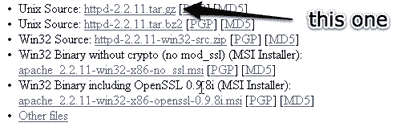

您刚才下载的实际上是 Apache 服务器的源代码。然后，第一步是将其编译成可执行的二进制安装。Pop 打开一个终端，导航到下载文件所在的目录，然后提取它，并导航到结果目录:

```
user@machine:~$ cd Desktop     
user@machine:~/Desktop$ tar xfz httpd-version.tar.gz     
user@machine:~/Desktop$ cd httpd-version
```

编译 Apache 的第一步是根据您的需求进行配置。大多数缺省值都可以满足您的需要，但是您需要启用 Apache 模块(如 PHP)的动态加载，这在缺省情况下是关闭的。此外，您可能应该启用 URL 重写特性，这是许多 PHP 应用程序所依赖的(尽管对于本书中的示例来说这是不必要的)。要进行这些配置更改，请键入以下命令:

```
user@machine:~/Desktop/httpd-version$ ./configure --enable-so --enable-rewrite
```

一长串的状态信息会出现在你的屏幕上。如果这个过程因为一个错误消息而停止，那么您的系统可能会丢失一些编译 Apache 所需的关键软件。一些 Linux 发行版缺少基本的开发库，甚至缺省情况下没有安装 C 编译器。安装这些程序将使您能够返回并成功运行该命令。然而，当前版本的 Ubuntu 应该具备所有需要的东西。

几分钟后，消息流应该会结束:

```
...     
config.status: creating build/rules.mk     
config.status: creating build/pkg/pkginfo     
config.status: creating build/config_vars.sh     
config.status: creating include/ap_config_auto.h     
config.status: executing default commands     
user@machine:~/Desktop/httpd-version$ 
```

现在您已经准备好编译 Apache 了。只需要一个词的命令 make:

```
user@machine:~/Desktop/httpd-version$ make
```

同样，此过程将需要几分钟时间来完成，并应以以下消息结束:

```
...     
make[1]: Leaving directory `/home/user/Desktop/httpd-version'     
user@machine:~/Desktop/httpd-version$ 
```

要安装新编译的 Apache 副本，请键入`sudo make install`(需要`sudo`，因为您需要 root 权限来写入安装目录)。

```
user@machine:~/Desktop/httpd-version$ sudo make install
```

出现提示时，输入您的密码。

这个命令一完成文件复制，Apache 的安装就完成了。导航到安装目录并使用`apachectl`脚本启动 Apache:

```
user@machine:~/Desktop/httpd-version$ cd /usr/local/apache2     
user@machine:/usr/local/apache2$ sudo bin/apachectl -k start
```

您可能会看到来自 Apache 的警告消息，抱怨它无法确定服务器的完全限定域名。那是因为大多数个人电脑都没有。别担心。

打开浏览器，在地址栏输入`http://localhost`。如果 Apache 已经启动并运行，您应该会看到如下所示的欢迎消息。

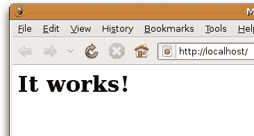

与 MySQL 服务器一样，您可能希望将 Apache 配置为在系统启动时自动启动。这样做的过程是相似的；只需从 Apache 安装中复制并链接`apachectl`脚本:

```
user@machine:/usr/local/apache2$ sudo su     
root@machine:/usr/local/apache2# cd /etc     
root@machine:/etc# ln -s /usr/local/apache2/bin/apachectl init.d/     
root@machine:/etc# ln -s /etc/init.d/apachectl rc2.d/S99httpd     
root@machine:/etc# ln -s /etc/init.d/apachectl rc0.d/K01httpd
```

为了测试这是否有效，重启你的电脑，然后再次点击浏览器中的`http://localhost`页面。

有了全新的 Apache 安装并运行后，现在就可以为它添加 PHP 支持了。首先，从 PHP 下载页面下载 PHP 完整的源代码包。同样，`.tar.gz`和`.tar.bz2`版本是相同的；只要下载你习惯提取的文件。

你下载的文件应该叫做`php-version.tar.gz`(或者`.bz2`)。Pop 打开一个新的终端窗口，导航到包含下载文件的目录，提取该文件，并移动到结果目录:

```
user@machine:~$ cd Desktop     
user@machine:~/Desktop$ tar xfz php-version.tar.gz     
user@machine:~/Desktop$ cd php-version
```

要将 PHP 作为 Apache 模块安装，您需要使用 Apache `apxs`程序。如果您按照上面的说明自己编译它，它将与 Apache 服务器一起安装；但是如果您使用随您的 Linux 发行版安装的副本，您可能需要安装 Apache 开发包来访问 Apache `apxs`。您应该能够通过使用 Linux 发行版中包含的软件包管理器来安装这个软件包。例如，在 Debian Linux 上，您可以使用 apt-get 安装它，如下所示:

```
user@machine:~$ sudo apt-get install apache-dev
```

现在，要安装 PHP，您必须以 root 用户身份登录:

```
user@machine:~/Desktop/php-version$ sudo su     
[sudo] password for user: (type your password)     
root@machine:/home/user/Desktop/php-version# 
```

第一步是配置 PHP 安装程序，告诉它您想要启用哪些选项，以及它应该在哪里找到它需要了解的程序(如 Apache `apxs`和 MySQL)。该命令应该如下所示(全部在一行中):

```
root@machine:/home/user/Desktop/php-version# ./configure --prefix=/usr/local/php --with-apxs2=/usr/local/apache2/bin/apxs --with-mysqli=/usr/local/mysql/bin/mysql_config
```

`--prefix`选项告诉安装程序您希望 PHP 安装在哪里(`/usr/local/php`是一个不错的选择)。

`--with-apxs2`选项告诉安装者在哪里可以找到上面提到的 Apache `apxs`程序。当使用你的 Linux 发行版的包管理器安装时，这个程序通常可以在`/usr/sbin/apxs`找到。但是，如果您按照上面的描述自己编译并安装了 Apache，那么它将位于 Apache 二进制目录中的`/usr/local/apache2/bin/apxs`。

选项告诉安装程序在哪里可以找到你的 MySQL 安装。更具体地说，它必须指向 MySQL 安装的 bin 目录中的`mysql_config`程序(`/usr/local/mysql/bin/mysql_config`)。

屏幕上会再次出现一系列状态信息。当它停止时，检查任何错误消息并安装它识别为丢失的任何文件。例如，在默认的 Ubuntu 8.10 安装中，你可能会看到一个错误，抱怨安装不完整。要纠正这个错误，打开新立得软件包管理器，然后找到并安装`libxml2-dev`软件包(`libxml2`应该已经安装了)。安装完成后，再次尝试`configure`命令。

在您看到几个测试屏幕滚动过去之后，您将返回到命令提示符，并得到一条令人欣慰的消息“谢谢您使用 PHP。”以下两个命令将编译并安装 PHP:

```
root@machine:/home/user/Desktop/php-version# make     
root@machine:/home/user/Desktop/php-version# make install
```

喝杯咖啡休息一下:这需要一些时间。

make install 命令完成后，PHP 将被安装在`/usr/local/php`中(除非您用上面配置脚本的`--prefix`选项指定了一个不同的目录)。现在你只需要配置它！

PHP 配置文件叫做`php.ini`。PHP 附带了两个样本文件`php.ini`，分别叫做`php.ini-dist`和`php.ini-recommended`。将这些文件从您的安装工作目录复制到`/usr/local/php/lib`目录，然后复制一份`php.ini-dist`文件并将其命名为`php.ini`:

```
root@machine:/home/user/Desktop/php-version# cp php.ini* /usr/local/ php/lib/     
root@machine:/home/user/Desktop/php-version# cd /usr/local/php/lib     
root@machine:/usr/local/php/lib# cp php.ini-dist php.ini
```

你现在可以删除编译 PHP 的目录——不再需要它了。

我们很快就会担心微调的问题。现在，我们需要调整 Apache 的配置，使其更加 PHP 友好。找到您的 Apache `httpd.conf`配置文件。这个文件通常可以在 Apache 安装(`/usr/local/apache2/conf/httpd.conf`)的`conf`子目录中找到。

要编辑此文件，您必须以 root 用户身份登录，因此从终端窗口启动您的文本编辑器，您仍然以 root 用户身份登录:

```
root@machine:/usr/local/php/lib# cd /usr/local/apache2/conf     
root@machine:/usr/local/apache2/conf# gedit httpd.conf
```

在这个文件中，查找以`DirectoryIndex`开头的行。这一行告诉 Apache 在查找给定目录的默认页面时使用哪个文件名。您将看到通常的`index.html`，但是您需要将`index.php`添加到列表中:

```
<IfModule dir_module>     
  DirectoryIndex index.html index.php     
</IfModule>
```

最后，直接到文件的底部，添加这些行来告诉 Apache 名称以`.php`结尾的文件应该被视为 PHP 脚本:

```
<FilesMatch .php$>     
  SetHandler application/x-httpd-php     
</FilesMatch>
```

应该可以了！保存您的更改，并使用以下命令重新启动 Apache 服务器:

```
root@machine:/usr/local/apache2/conf# /usr/local/apache2/bin/apachectl -k restart
```

如果一切按计划进行，Apache 应该启动，没有任何错误消息。如果你遇到任何麻烦，SitePoint 论坛中乐于助人的人(包括我自己)会很乐意帮助你。

## 安装后设置任务

无论您运行的是哪种操作系统，或者您是如何设置您的 web 服务器的——一旦安装了 PHP 并且 MySQL 服务器正在运行，您需要执行的第一个操作就是为 MySQL 分配一个 root 密码。

MySQL 只允许授权用户查看和操作存储在其数据库中的信息，因此您需要告诉 MySQL 谁是授权用户，谁是未授权用户。当 MySQL 第一次安装时，它配置了一个名为`root`的用户，这个用户甚至不需要输入密码就可以完成大多数任务。您的第一个任务应该是为 root 用户分配一个密码，这样就可以防止未经授权的用户篡改您的数据库。

***何苦呢？***

重要的是要认识到，MySQL 就像一个网络服务器，可以从同一网络上的任何计算机访问。如果你在一台连接到互联网的计算机上工作，那么，根据你所采取的安全措施，世界上任何人都可以连接到你的 MySQL 服务器。选择一个难以猜测的密码的需要应该是显而易见的！

要为 MySQL 设置 root 密码，可以使用 MySQL 自带的`mysqladmin`程序。如果您按照说明单独安装 MySQL(如本章前面所解释的)，那么`mysqladmin`程序应该在您的系统路径上。这意味着你可以弹出一个终端窗口(或者在 Windows 中，一个命令提示符)并输入程序的名称，而不必记住它在你的电脑上的安装位置。

如果你还没有尝试过，现在就开始尝试吧。打开一个终端或命令提示符，键入以下命令:(如果您使用的是 Windows，并且不熟悉命令提示符，请查看我的文章 [Kev 的命令提示符备忘单](https://www.sitepoint.com/article/command-prompt-cheat-sheet/)以获得快速速成课程。)

```
mysqladmin -u root status
```

当您按 Enter 键时，您应该会看到一两行关于您的 MySQL 服务器的基本统计信息，如下所示:

```
Uptime: 102261  Threads: 1  Questions: 1  Slow queries: 0  Opens: 15      
 Flush tables: 1  Open tables: 0  Queries per second avg: 0.0
```

如果你看到的是完全不同的信息，这可能是两种选择之一。首先，您可能会看到一条错误消息，告诉您`mysqladmin`程序无法连接到您的 MySQL 服务器:

```
mysqladmin: connect to server at 'localhost' failed      
error: 'Can't connect to MySQL server on 'localhost' (10061)'      
Check that mysqld is running on localhost and that the port is 3306\.      
You can check this by doing 'telnet localhost 3306'
```

这个消息通常意味着你的 MySQL 服务器没有运行。如果您将它设置为在系统启动时自动运行，请仔细检查设置是否正常工作。如果您通常手动启动您的 MySQL 服务器，请在再次尝试该命令之前继续这样做。

其次，如果你在 Mac 上使用 MAMP，你可能会看到以下错误信息:

```
mysqladmin: connect to server at 'localhost' failed      
error: 'Access denied for user 'root'@'localhost' (using password: NO)'
```

这个错误消息意味着您的 MySQL 服务器上的`root`用户已经设置了密码。原来，考虑到你的安全，MAMP 自带一个已经设置在内置 MySQL 服务器上的`root`密码。然而，这个密码是`root`——所以你可能还是想按照下面的说明修改它。

不管怎样，你现在应该能够运行`mysqladmin`程序了。现在，您可以使用它来设置 MySQL 服务器的 root 密码:

```
mysqladmin -u root -p password "newpassword"
```

将`newpassword`替换为您想用于 MySQL 服务器的任何密码。确保它是一个你能记住的密码，因为如果你忘记了你的 MySQL `root`密码，你可能需要删除你的整个 MySQL 安装并从头开始！正如我们将在第 10 章“MySQL 管理”中看到的，通常有可能从这样的不幸中恢复过来，但这绝对是一件痛苦的事情。

当您点击 Enter 时，系统会提示您输入 MySQL root 用户的当前密码。只需再次点击回车键，因为根用户此时没有密码，除非你已经使用 MAMP 在你的 Mac 上设置了 MySQL 在这种情况下，您应该键入 root，这是 MAMP 上默认的 root MySQL 密码。

让我为您分解这个命令，以便您可以理解每个部分的含义:

```
mysqladmin
```

当然，这是您希望运行的程序的名称。

```
-u root
```

这指定了您希望用来连接到 MySQL 服务器的 MySQL 用户帐户。在全新的服务器上，只有一个用户账号:`root`。

```
-p
```

这告诉程序提示您输入用户帐户的当前密码。在一个全新的 MySQL 服务器上，root 帐户没有密码，所以你只需在提示时按回车键。不过，最好养成包括这个选项的习惯，因为大多数时候你需要提供一个密码来连接到你的 MySQL 服务器。

`password "newpassword"`

这指示`mysqladmin`程序将用户帐户的密码更改为`newpassword`。在本例中，您指定的任何密码都将成为 MySQL root 用户的新密码。

现在，为了试用您的新密码，再次请求 MySQL 服务器在系统命令提示符下告诉您它的当前状态，但是这次包括`-p`选项:

```
mysqladmin -u root -p status
```

出现提示时，输入您的新密码。和以前一样，您应该会看到一两行关于 MySQL 服务器的统计数据。

由于 root 帐户现在受密码保护，尝试在没有`-p`开关的情况下运行该命令将会出现“拒绝访问”错误。

你完了！一切都设置好并运行后，您就可以编写您的第一个 PHP 脚本了。然而，在我们这样做之前，你可能想给你的虚拟主机写一封简短的电子邮件。

## 问你的虚拟主机什么

当您在自己的计算机上摆弄 PHP 和 MySQL 时，开始收集向公众发布您的第一个数据库驱动的网站时所需的信息可能是件好事。这里有一个你应该向你的网站主持人询问的细节概要。

首先，你需要知道如何将文件传输到你的网络主机上。你将上传 PHP 脚本到你的主机，就像你通常发送 HTML 文件，CSS 文件，和图片组成一个静态网站一样，所以如果你已经知道怎么做，就没有必要麻烦你的主机了。但是，如果您刚开始使用一台新的主机，您需要知道它支持什么文件传输协议(FTP 或 SFTP ),以及知道在连接您的 FTP 程序时使用什么用户名和密码。你还必须知道把文件放在哪个目录下，这样网页浏览器才能访问它们。

除了这些，你还需要找到一些关于你的主机为你设置的 MySQL 服务器的细节。重要的是要知道用来连接它的主机名(可能是本地主机)，以及您的 MySQL 用户名和密码，该用户名和密码可能与您的 FTP 凭证相同，也可能不同。您的 web 主机可能还会提供一个空数据库供您使用，这可以防止您干扰可能与您共享同一个 MySQL 服务器的其他用户的数据库。如果他们提供了这个，您应该建立数据库的名称。

## 您的第一个 PHP 脚本

让我帮你安装所有的东西是不公平的——但是在第三章:PHP 简介之前不要让你体验 PHP 脚本的样子。所以这里有一点点食物来刺激你的食欲。

打开您喜欢的文本或 HTML 编辑器，创建一个名为`today.php`的新文件。在文件中键入以下内容:

```
<!DOCTYPE html PUBLIC "-//W3C//DTD XHTML 1.0 Strict//EN"       
    "https://www.w3.org/TR/xhtml1/DTD/xhtml1-strict.dtd">       
<html  xml:lang="en" lang="en">       
  <head>       
    <title>Today&rsquo;s Date</title>       
    <meta http-equiv="content-type"       
        content="text/html; charset=utf-8"/>       
  </head>       
  <body>       
    <p>Today&rsquo;s date (according to this web server) is       
      <?php       

      echo date('l, F dS Y.');       

      ?>       
    </p>       
  </body>       
</html>
```

***用记事本在 Windows 中编辑 PHP 脚本***

Windows 用户应该注意，要在记事本中保存扩展名为. php 的文件，你需要选择所有文件作为文件类型，或者在另存为对话框中用引号将文件名括起来；否则，记事本会将文件保存为 today.php.txt，这将不起作用。

***用文本编辑*** 在 Mac OS X 中编辑 PHP 脚本

*建议 Mac OS X 用户在使用“文本编辑”编辑`.php`文件时要小心，因为它以富文本格式存储这些文件，带有不可见的。默认为 rtf 文件扩展名。要保存一个新的`.php`文件，您必须首先记住通过选择格式>生成纯文本(？+?+T)。*

“文本编辑”还有一个令人讨厌的习惯，那就是误认为存在。打开 HTML 文档的 php 文件，并试图将它们显示为格式化文本。要避免这种情况，必须在“打开”对话框中选中“忽略 rtf 命令”复选框。

试试免费的 IDE 吧！

从前面的警告中可以看出，当前操作系统提供的文本编辑器有点不适合编辑 PHP 脚本。有许多支持编辑 PHP 脚本的实体文本编辑器和集成开发环境(ide ),您可以免费下载。以下是一些在 Windows、Mac OS X 和 Linux 上运行的软件:

*   [NetBeans](http://www.netbeans.org/features/php/)
*   [阿普塔纳](http://www.aptana.com/php)
*   [Komodo Edit](http://www.activestate.com/komodo_edit/)

如果您希望避免键入所有代码，您可以从代码归档中下载这个文件——以及本书中的其余代码。有关如何下载代码档案的详细信息，请参见前言。

保存文件，并将其移动到本地 web 服务器的 web 根目录。

***我的服务器的 Web 根目录在哪里？***

*如果您使用的是手动安装的 Apache 服务器，web 根目录就是 Apache 安装中的 htdocs 目录(即 Windows 上的`C:Program FilesApache Software FoundationApache2.2htdocs`，Linux 上的`/usr/local/apache2/htdocs`)。*

对于 WampServer 内置的 Apache 服务器，web 根目录是您的 WampServer 目录中的 www 目录。通过从 Windows 系统托盘的 WampServer 菜单中选择 www directory 菜单项，可以快速找到它。

*如果你使用的 Apache 服务器内置在 Mac OS X 中，那么网络根目录就是`/Library/WebServer/Documents`。*

*MAMP 内置的 Apache 服务器在 MAMP 文件夹(`/Applications/MAMP/htdocs`)内的`htdocs`文件夹中有一个 web 根目录。如果您喜欢使用不同的文件夹作为您的 web 根目录，您可以在 MAMP 应用程序首选项的 Apache 选项卡上进行更改。*

打开您选择的 web 浏览器，在地址栏中键入`http://localhost/today.php`(或者如果 Apache 被配置为在非默认端口 80 上运行，则键入`http://localhost:port/today.php`)来查看您刚刚创建的文件。(如果您在 Windows 上安装了 Apache，您可能选择了在端口 8080 上运行它。如果您使用的是 MAMP，它默认配置为在端口 8888 上运行 Apache。)

***你必须输入网址***

你可能习惯于通过双击或者使用浏览器的文件>打开…功能来预览你的网页。这些方法告诉你的浏览器直接从你的电脑硬盘上加载文件，所以它们不能处理 PHP 文件。

*如前所述，PHP 脚本要求您的 web 服务器在将生成的 HTML 代码发送到浏览器之前，读取并执行它们包含的 PHP 代码。只有当你输入 URL ( `http://localhost/today.php`)时，你的浏览器才会向你的网络服务器请求文件，这样才会发生。*

下图显示了第一个 PHP 脚本生成的网页应该是什么样子。


很整洁，是吧？如果您在浏览器中使用查看源代码功能，您将看到的只是一个包含日期的普通 HTML 文件。PHP 代码(上面代码中`<?php`和`?>`之间的所有内容)在被发送到浏览器之前被 web 服务器解释并转换成普通文本。PHP 和其他服务器端脚本语言的美妙之处在于，web 浏览器可以保持无知——所有的工作都由 web 服务器来完成！

请放心，用不了多久，你就会对代码(比如这个例子)了如指掌。

如果缺少日期，或者如果您的浏览器提示您下载 PHP 文件而不是显示它，那么您的 web 服务器的 PHP 支持就有问题。如果可以，使用浏览器中的“查看源代码”来查看页面的代码。您可能会在页面中看到 PHP 代码。由于浏览器无法理解 PHP，它只是将`<?php ... ?>`视为一个长而无效的 HTML 标签，并将其忽略。仔细检查您是从 web 服务器而不是硬盘上请求文件的(也就是说，确保浏览器的地址栏显示以`http://localhost`开头的 URL)，并确保使用本章前面提供的说明在 web 服务器上正确安装了 PHP 支持。

## 满满的工具箱，脏脏的手

现在，您应该已经完全具备了一个支持 PHP 脚本的 web 服务器、一个 MySQL 数据库服务器，并对如何使用它们有了基本的了解。您甚至应该通过编写和成功测试您的第一个 PHP 脚本来弄脏您的手！

如果`today.php`脚本对你不成功，请访问 [SitePoint 论坛](https://www.sitepoint.com/forums/)，我们很乐意帮助你解决问题。

在[第 2 章:MySQL 简介](https://www.sitepoint.com/article/getting-started-mysql/)中，您将学习关系数据库的基础知识，并开始使用 MySQL。我还将向您介绍数据库的语言:结构化查询语言。如果你以前从未使用过数据库，这将会让你大开眼界！

正在创建 build/rules . MK
config . status:正在创建 build/pkg/pkginfo
config . status:正在创建 build/config _ vars . sh
config . status:正在创建 include/AP _ config _ auto . h
config . status:正在执行默认命令
user @ machine:~/Desktop/httpd-version $

现在您已经准备好编译 Apache 了。只需要一个词的命令 make:

```
user@machine:~/Desktop/httpd-version$ make
```

同样，此过程将需要几分钟时间来完成，并应以以下消息结束:

```
...     
make[1]: Leaving directory `/home/user/Desktop/httpd-version'     
user@machine:~/Desktop/httpd-version$ 
```

要安装新编译的 Apache 副本，请键入`sudo make install`(需要`sudo`，因为您需要 root 权限来写入安装目录)。

```
user@machine:~/Desktop/httpd-version$ sudo make install
```

出现提示时，输入您的密码。

这个命令一完成文件复制，Apache 的安装就完成了。导航到安装目录并使用`apachectl`脚本启动 Apache:

```
user@machine:~/Desktop/httpd-version$ cd /usr/local/apache2     
user@machine:/usr/local/apache2$ sudo bin/apachectl -k start
```

您可能会看到来自 Apache 的警告消息，抱怨它无法确定服务器的完全限定域名。那是因为大多数个人电脑都没有。别担心。

打开浏览器，在地址栏输入`http://localhost`。如果 Apache 已经启动并运行，您应该会看到如下所示的欢迎消息。


与 MySQL 服务器一样，您可能希望将 Apache 配置为在系统启动时自动启动。这样做的过程是相似的；只需从 Apache 安装中复制并链接`apachectl`脚本:

```
user@machine:/usr/local/apache2$ sudo su     
root@machine:/usr/local/apache2# cd /etc     
root@machine:/etc# ln -s /usr/local/apache2/bin/apachectl init.d/     
root@machine:/etc# ln -s /etc/init.d/apachectl rc2.d/S99httpd     
root@machine:/etc# ln -s /etc/init.d/apachectl rc0.d/K01httpd
```

为了测试这是否有效，重启你的电脑，然后再次点击浏览器中的`http://localhost`页面。

有了全新的 Apache 安装并运行后，现在就可以为它添加 PHP 支持了。首先，从 PHP 下载页面下载 PHP 完整的源代码包。同样，`.tar.gz`和`.tar.bz2`版本是相同的；只要下载你习惯提取的文件。

你下载的文件应该叫做`php-version.tar.gz`(或者`.bz2`)。Pop 打开一个新的终端窗口，导航到包含下载文件的目录，提取该文件，并移动到结果目录:

```
user@machine:~$ cd Desktop     
user@machine:~/Desktop$ tar xfz php-version.tar.gz     
user@machine:~/Desktop$ cd php-version
```

要将 PHP 作为 Apache 模块安装，您需要使用 Apache `apxs`程序。如果您按照上面的说明自己编译它，它将与 Apache 服务器一起安装；但是如果您使用随您的 Linux 发行版安装的副本，您可能需要安装 Apache 开发包来访问 Apache `apxs`。您应该能够通过使用 Linux 发行版中包含的软件包管理器来安装这个软件包。例如，在 Debian Linux 上，您可以使用 apt-get 安装它，如下所示:

```
user@machine:~$ sudo apt-get install apache-dev
```

现在，要安装 PHP，您必须以 root 用户身份登录:

```
user@machine:~/Desktop/php-version$ sudo su     
[sudo] password for user: (type your password)     
root@machine:/home/user/Desktop/php-version# 
```

第一步是配置 PHP 安装程序，告诉它您想要启用哪些选项，以及它应该在哪里找到它需要了解的程序(如 Apache `apxs`和 MySQL)。该命令应该如下所示(全部在一行中):

```
root@machine:/home/user/Desktop/php-version# ./configure --prefix=/usr/local/php --with-apxs2=/usr/local/apache2/bin/apxs --with-mysqli=/usr/local/mysql/bin/mysql_config
```

`--prefix`选项告诉安装程序您希望 PHP 安装在哪里(`/usr/local/php`是一个不错的选择)。

`--with-apxs2`选项告诉安装者在哪里可以找到上面提到的 Apache `apxs`程序。当使用你的 Linux 发行版的包管理器安装时，这个程序通常可以在`/usr/sbin/apxs`找到。但是，如果您按照上面的描述自己编译并安装了 Apache，那么它将位于 Apache 二进制目录中的`/usr/local/apache2/bin/apxs`。

选项告诉安装程序在哪里可以找到你的 MySQL 安装。更具体地说，它必须指向 MySQL 安装的 bin 目录中的`mysql_config`程序(`/usr/local/mysql/bin/mysql_config`)。

屏幕上会再次出现一系列状态信息。当它停止时，检查任何错误消息并安装它识别为丢失的任何文件。例如，在默认的 Ubuntu 8.10 安装中，你可能会看到一个错误，抱怨安装不完整。要纠正这个错误，打开新立得软件包管理器，然后找到并安装`libxml2-dev`软件包(`libxml2`应该已经安装了)。安装完成后，再次尝试`configure`命令。

在您看到几个测试屏幕滚动过去之后，您将返回到命令提示符，并得到一条令人欣慰的消息“谢谢您使用 PHP。”以下两个命令将编译并安装 PHP:

```
root@machine:/home/user/Desktop/php-version# make     
root@machine:/home/user/Desktop/php-version# make install
```

喝杯咖啡休息一下:这需要一些时间。

make install 命令完成后，PHP 将被安装在`/usr/local/php`中(除非您用上面配置脚本的`--prefix`选项指定了一个不同的目录)。现在你只需要配置它！

PHP 配置文件叫做`php.ini`。PHP 附带了两个样本文件`php.ini`，分别叫做`php.ini-dist`和`php.ini-recommended`。将这些文件从您的安装工作目录复制到`/usr/local/php/lib`目录，然后复制一份`php.ini-dist`文件并将其命名为`php.ini`:

```
root@machine:/home/user/Desktop/php-version# cp php.ini* /usr/local/ php/lib/     
root@machine:/home/user/Desktop/php-version# cd /usr/local/php/lib     
root@machine:/usr/local/php/lib# cp php.ini-dist php.ini
```

你现在可以删除编译 PHP 的目录——不再需要它了。

我们很快就会担心微调的问题。现在，我们需要调整 Apache 的配置，使其更加 PHP 友好。找到您的 Apache `httpd.conf`配置文件。这个文件通常可以在 Apache 安装(`/usr/local/apache2/conf/httpd.conf`)的`conf`子目录中找到。

要编辑此文件，您必须以 root 用户身份登录，因此从终端窗口启动您的文本编辑器，您仍然以 root 用户身份登录:

```
root@machine:/usr/local/php/lib# cd /usr/local/apache2/conf     
root@machine:/usr/local/apache2/conf# gedit httpd.conf
```

在这个文件中，查找以`DirectoryIndex`开头的行。这一行告诉 Apache 在查找给定目录的默认页面时使用哪个文件名。您将看到通常的`index.html`，但是您需要将`index.php`添加到列表中:

```
<IfModule dir_module>     
  DirectoryIndex index.html index.php     
</IfModule>
```

最后，直接到文件的底部，添加这些行来告诉 Apache 名称以`.php`结尾的文件应该被视为 PHP 脚本:

```
<FilesMatch .php$>     
  SetHandler application/x-httpd-php     
</FilesMatch>
```

应该可以了！保存您的更改，并使用以下命令重新启动 Apache 服务器:

```
root@machine:/usr/local/apache2/conf# /usr/local/apache2/bin/apachectl -k restart
```

如果一切按计划进行，Apache 应该启动，没有任何错误消息。如果你遇到任何麻烦，SitePoint 论坛中乐于助人的人(包括我自己)会很乐意帮助你。

## 安装后设置任务

无论您运行的是哪种操作系统，或者您是如何设置您的 web 服务器的——一旦安装了 PHP 并且 MySQL 服务器正在运行，您需要执行的第一个操作就是为 MySQL 分配一个 root 密码。

MySQL 只允许授权用户查看和操作存储在其数据库中的信息，因此您需要告诉 MySQL 谁是授权用户，谁是未授权用户。当 MySQL 第一次安装时，它配置了一个名为`root`的用户，这个用户甚至不需要输入密码就可以完成大多数任务。您的第一个任务应该是为 root 用户分配一个密码，这样就可以防止未经授权的用户篡改您的数据库。

***何苦呢？***

重要的是要认识到，MySQL 就像一个网络服务器，可以从同一网络上的任何计算机访问。如果你在一台连接到互联网的计算机上工作，那么，根据你所采取的安全措施，世界上任何人都可以连接到你的 MySQL 服务器。选择一个难以猜测的密码的需要应该是显而易见的！

要为 MySQL 设置 root 密码，可以使用 MySQL 自带的`mysqladmin`程序。如果您按照说明单独安装 MySQL(如本章前面所解释的)，那么`mysqladmin`程序应该在您的系统路径上。这意味着你可以弹出一个终端窗口(或者在 Windows 中，一个命令提示符)并输入程序的名称，而不必记住它在你的电脑上的安装位置。

如果你还没有尝试过，现在就开始尝试吧。打开一个终端或命令提示符，键入以下命令:(如果您使用的是 Windows，并且不熟悉命令提示符，请查看我的文章 [Kev 的命令提示符备忘单](https://www.sitepoint.com/article/command-prompt-cheat-sheet/)以获得快速速成课程。)

```
mysqladmin -u root status
```

当您按 Enter 键时，您应该会看到一两行关于您的 MySQL 服务器的基本统计信息，如下所示:

```
Uptime: 102261  Threads: 1  Questions: 1  Slow queries: 0  Opens: 15      
 Flush tables: 1  Open tables: 0  Queries per second avg: 0.0
```

如果你看到的是完全不同的信息，这可能是两种选择之一。首先，您可能会看到一条错误消息，告诉您`mysqladmin`程序无法连接到您的 MySQL 服务器:

```
mysqladmin: connect to server at 'localhost' failed      
error: 'Can't connect to MySQL server on 'localhost' (10061)'      
Check that mysqld is running on localhost and that the port is 3306\.      
You can check this by doing 'telnet localhost 3306'
```

这个消息通常意味着你的 MySQL 服务器没有运行。如果您将它设置为在系统启动时自动运行，请仔细检查设置是否正常工作。如果您通常手动启动您的 MySQL 服务器，请在再次尝试该命令之前继续这样做。

其次，如果你在 Mac 上使用 MAMP，你可能会看到以下错误信息:

```
mysqladmin: connect to server at 'localhost' failed      
error: 'Access denied for user 'root'@'localhost' (using password: NO)'
```

这个错误消息意味着您的 MySQL 服务器上的`root`用户已经设置了密码。原来，考虑到你的安全，MAMP 自带一个已经设置在内置 MySQL 服务器上的`root`密码。然而，这个密码是`root`——所以你可能还是想按照下面的说明修改它。

不管怎样，你现在应该能够运行`mysqladmin`程序了。现在，您可以使用它来设置 MySQL 服务器的 root 密码:

```
mysqladmin -u root -p password "newpassword"
```

将`newpassword`替换为您想用于 MySQL 服务器的任何密码。确保它是一个你能记住的密码，因为如果你忘记了你的 MySQL `root`密码，你可能需要删除你的整个 MySQL 安装并从头开始！正如我们将在第 10 章“MySQL 管理”中看到的，通常有可能从这样的不幸中恢复过来，但这绝对是一件痛苦的事情。

当您点击 Enter 时，系统会提示您输入 MySQL root 用户的当前密码。只需再次点击回车键，因为根用户此时没有密码，除非你已经使用 MAMP 在你的 Mac 上设置了 MySQL 在这种情况下，您应该键入 root，这是 MAMP 上默认的 root MySQL 密码。

让我为您分解这个命令，以便您可以理解每个部分的含义:

```
mysqladmin
```

当然，这是您希望运行的程序的名称。

```
-u root
```

这指定了您希望用来连接到 MySQL 服务器的 MySQL 用户帐户。在全新的服务器上，只有一个用户账号:`root`。

```
-p
```

这告诉程序提示您输入用户帐户的当前密码。在一个全新的 MySQL 服务器上，root 帐户没有密码，所以你只需在提示时按回车键。不过，最好养成包括这个选项的习惯，因为大多数时候你需要提供一个密码来连接到你的 MySQL 服务器。

`password "newpassword"`

这指示`mysqladmin`程序将用户帐户的密码更改为`newpassword`。在本例中，您指定的任何密码都将成为 MySQL root 用户的新密码。

现在，为了试用您的新密码，再次请求 MySQL 服务器在系统命令提示符下告诉您它的当前状态，但是这次包括`-p`选项:

```
mysqladmin -u root -p status
```

出现提示时，输入您的新密码。和以前一样，您应该会看到一两行关于 MySQL 服务器的统计数据。

由于 root 帐户现在受密码保护，尝试在没有`-p`开关的情况下运行该命令将会出现“拒绝访问”错误。

你完了！一切都设置好并运行后，您就可以编写您的第一个 PHP 脚本了。然而，在我们这样做之前，你可能想给你的虚拟主机写一封简短的电子邮件。

## 问你的虚拟主机什么

当您在自己的计算机上摆弄 PHP 和 MySQL 时，开始收集向公众发布您的第一个数据库驱动的网站时所需的信息可能是件好事。这里有一个你应该向你的网站主持人询问的细节概要。

首先，你需要知道如何将文件传输到你的网络主机上。你将上传 PHP 脚本到你的主机，就像你通常发送 HTML 文件，CSS 文件，和图片组成一个静态网站一样，所以如果你已经知道怎么做，就没有必要麻烦你的主机了。但是，如果您刚开始使用一台新的主机，您需要知道它支持什么文件传输协议(FTP 或 SFTP ),以及知道在连接您的 FTP 程序时使用什么用户名和密码。你还必须知道把文件放在哪个目录下，这样网页浏览器才能访问它们。

除了这些，你还需要找到一些关于你的主机为你设置的 MySQL 服务器的细节。重要的是要知道用来连接它的主机名(可能是本地主机)，以及您的 MySQL 用户名和密码，该用户名和密码可能与您的 FTP 凭证相同，也可能不同。您的 web 主机可能还会提供一个空数据库供您使用，这可以防止您干扰可能与您共享同一个 MySQL 服务器的其他用户的数据库。如果他们提供了这个，您应该建立数据库的名称。

## 您的第一个 PHP 脚本

让我帮你安装所有的东西是不公平的——但是在第三章:PHP 简介之前不要让你体验 PHP 脚本的样子。所以这里有一点点食物来刺激你的食欲。

打开您喜欢的文本或 HTML 编辑器，创建一个名为`today.php`的新文件。在文件中键入以下内容:

```
<!DOCTYPE html PUBLIC "-//W3C//DTD XHTML 1.0 Strict//EN"       
    "https://www.w3.org/TR/xhtml1/DTD/xhtml1-strict.dtd">       
<html  xml:lang="en" lang="en">       
  <head>       
    <title>Today&rsquo;s Date</title>       
    <meta http-equiv="content-type"       
        content="text/html; charset=utf-8"/>       
  </head>       
  <body>       
    <p>Today&rsquo;s date (according to this web server) is       
      <?php       

      echo date('l, F dS Y.');       

      ?>       
    </p>       
  </body>       
</html>
```

***用记事本在 Windows 中编辑 PHP 脚本***

Windows 用户应该注意，要在记事本中保存扩展名为. php 的文件，你需要选择所有文件作为文件类型，或者在另存为对话框中用引号将文件名括起来；否则，记事本会将文件保存为 today.php.txt，这将不起作用。

***用文本编辑*** 在 Mac OS X 中编辑 PHP 脚本

*建议 Mac OS X 用户在使用“文本编辑”编辑`.php`文件时要小心，因为它以富文本格式存储这些文件，带有不可见的。默认为 rtf 文件扩展名。要保存一个新的`.php`文件，您必须首先记住通过选择格式>生成纯文本(？+?+T)。*

“文本编辑”还有一个令人讨厌的习惯，那就是误认为存在。打开 HTML 文档的 php 文件，并试图将它们显示为格式化文本。要避免这种情况，必须在“打开”对话框中选中“忽略 rtf 命令”复选框。

试试免费的 IDE 吧！

从前面的警告中可以看出，当前操作系统提供的文本编辑器有点不适合编辑 PHP 脚本。有许多支持编辑 PHP 脚本的实体文本编辑器和集成开发环境(ide ),您可以免费下载。以下是一些在 Windows、Mac OS X 和 Linux 上运行的软件:

*   [NetBeans](http://www.netbeans.org/features/php/)
*   [阿普塔纳](http://www.aptana.com/php)
*   [Komodo Edit](http://www.activestate.com/komodo_edit/)

如果您希望避免键入所有代码，您可以从代码归档中下载这个文件——以及本书中的其余代码。有关如何下载代码档案的详细信息，请参见前言。

保存文件，并将其移动到本地 web 服务器的 web 根目录。

***我的服务器的 Web 根目录在哪里？***

*如果您使用的是手动安装的 Apache 服务器，web 根目录就是 Apache 安装中的 htdocs 目录(即 Windows 上的`C:Program FilesApache Software FoundationApache2.2htdocs`，Linux 上的`/usr/local/apache2/htdocs`)。*

对于 WampServer 内置的 Apache 服务器，web 根目录是您的 WampServer 目录中的 www 目录。通过从 Windows 系统托盘的 WampServer 菜单中选择 www directory 菜单项，可以快速找到它。

*如果你使用的 Apache 服务器内置在 Mac OS X 中，那么网络根目录就是`/Library/WebServer/Documents`。*

*MAMP 内置的 Apache 服务器在 MAMP 文件夹(`/Applications/MAMP/htdocs`)内的`htdocs`文件夹中有一个 web 根目录。如果您喜欢使用不同的文件夹作为您的 web 根目录，您可以在 MAMP 应用程序首选项的 Apache 选项卡上进行更改。*

打开您选择的 web 浏览器，在地址栏中键入`http://localhost/today.php`(或者如果 Apache 被配置为在非默认端口 80 上运行，则键入`http://localhost:port/today.php`)来查看您刚刚创建的文件。(如果您在 Windows 上安装了 Apache，您可能选择了在端口 8080 上运行它。如果您使用的是 MAMP，它默认配置为在端口 8888 上运行 Apache。)

***你必须输入网址***

你可能习惯于通过双击或者使用浏览器的文件>打开…功能来预览你的网页。这些方法告诉你的浏览器直接从你的电脑硬盘上加载文件，所以它们不能处理 PHP 文件。

*如前所述，PHP 脚本要求您的 web 服务器在将生成的 HTML 代码发送到浏览器之前，读取并执行它们包含的 PHP 代码。只有当你输入 URL ( `http://localhost/today.php`)时，你的浏览器才会向你的网络服务器请求文件，这样才会发生。*

下图显示了第一个 PHP 脚本生成的网页应该是什么样子。


很整洁，是吧？如果您在浏览器中使用查看源代码功能，您将看到的只是一个包含日期的普通 HTML 文件。PHP 代码(上面代码中`<?php`和`?>`之间的所有内容)在被发送到浏览器之前被 web 服务器解释并转换成普通文本。PHP 和其他服务器端脚本语言的美妙之处在于，web 浏览器可以保持无知——所有的工作都由 web 服务器来完成！

请放心，用不了多久，你就会对代码(比如这个例子)了如指掌。

如果缺少日期，或者如果您的浏览器提示您下载 PHP 文件而不是显示它，那么您的 web 服务器的 PHP 支持就有问题。如果可以，使用浏览器中的“查看源代码”来查看页面的代码。您可能会在页面中看到 PHP 代码。由于浏览器无法理解 PHP，它只是将`<?php ... ?>`视为一个长而无效的 HTML 标签，并将其忽略。仔细检查您是从 web 服务器而不是硬盘上请求文件的(也就是说，确保浏览器的地址栏显示以`http://localhost`开头的 URL)，并确保使用本章前面提供的说明在 web 服务器上正确安装了 PHP 支持。

## 满满的工具箱，脏脏的手

现在，您应该已经完全具备了一个支持 PHP 脚本的 web 服务器、一个 MySQL 数据库服务器，并对如何使用它们有了基本的了解。您甚至应该通过编写和成功测试您的第一个 PHP 脚本来弄脏您的手！

如果`today.php`脚本对你不成功，请访问 [SitePoint 论坛](https://www.sitepoint.com/forums/)，我们很乐意帮助你解决问题。

在[第 2 章:MySQL 简介](https://www.sitepoint.com/article/getting-started-mysql/)中，您将学习关系数据库的基础知识，并开始使用 MySQL。我还将向您介绍数据库的语言:结构化查询语言。如果你以前从未使用过数据库，这将会让你大开眼界！

如果你喜欢读这篇文章，你会爱上[可学的](https://learnable.com/)；向大师们学习新技能和技术的地方。会员可以即时访问 SitePoint 的所有电子书和交互式在线课程，如 [PHP & MySQL 初学者网络开发](https://learnable.com/courses/php-mysql-web-development-for-beginners-13)。

## 分享这篇文章