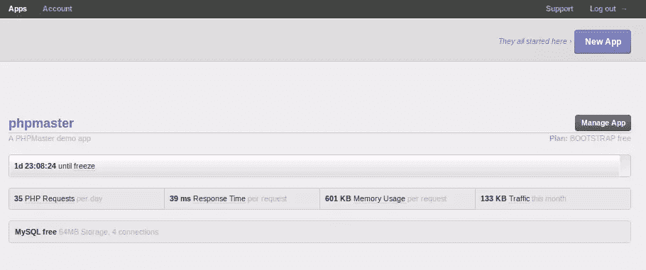
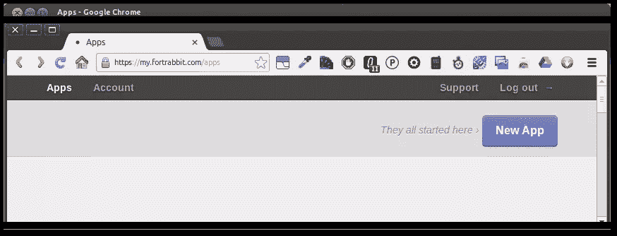
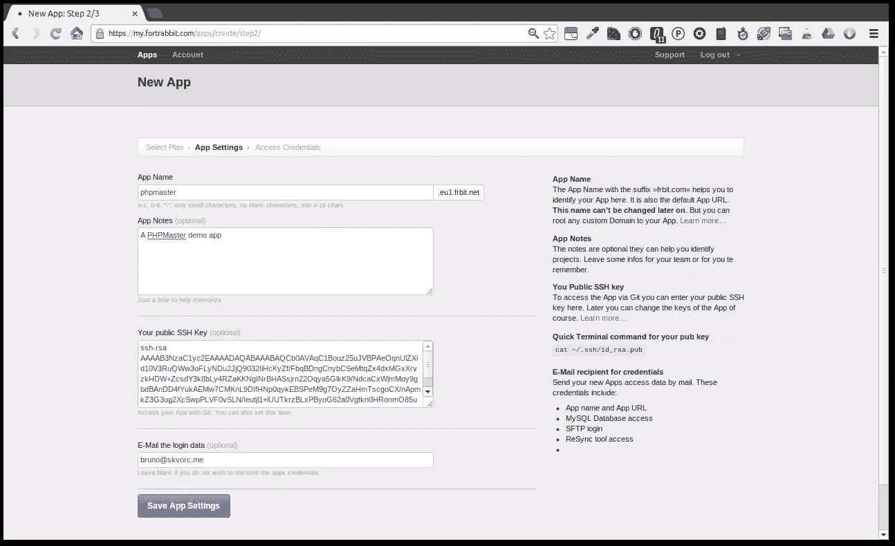
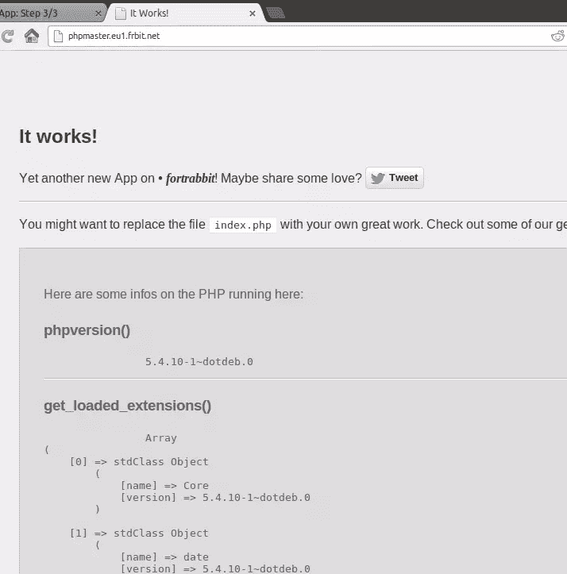
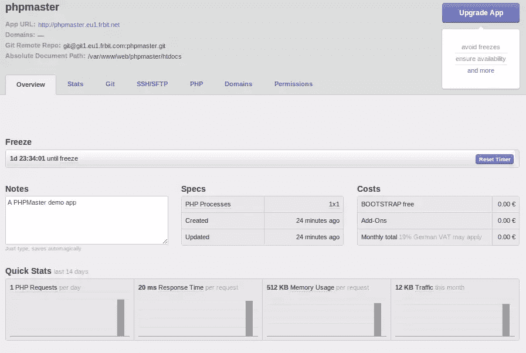
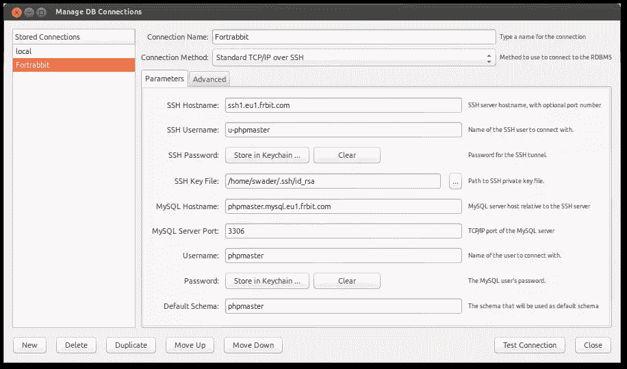
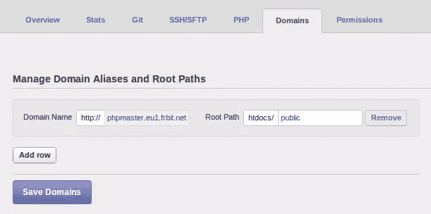

# PHP 即服务 Fortrabbit

> 原文：<https://www.sitepoint.com/php-as-a-service-fortrabbit/>

PaaS(平台即服务)并不是一个新概念。事实是，托管公司在销售共享服务器上包含 PHP 的共享托管服务时，早已提供了 PaaS。然而，这与 PaaS 业务的工作方式有着根本的不同。

在本文中，我们将看看平台服务提供商领域的新来者——Fortrabbit——并建立一个简单的 PHP/MySQL 应用程序，它可以在几分钟内公开访问。

假设有 LAMP 栈的基础知识，你还需要对 Git 有一个基本的掌握(如果你没有[这里有一个像样的介绍](http://try.github.com/levels/1/challenges/1 "Code School - Try Git")，你需要生成 SSH 密钥并准备好使用(如果你没有，参考[GitHub](https://help.github.com/articles/generating-ssh-keys "Generating SSH Keys - github:help")的这个资源)。该演练面向 Unix(因此 OS X 和 Linux 用户都可以)，但稍加修改也可以应用于 Windows 环境。

## fort rabbit——谁、为什么和如何

Fortrabbit 是一家年轻的 PaaS 公司，他们说主机业务已经崩溃，太多关于价格倾销，太少关于质量。为了解决这个问题，他们做了一个 PHP 专属业务，迎合开发者最常见的需求。他们的主机方案是分层的，从业余爱好者(免费方案)到企业(点击一个按钮就可以获得高可用性升级)。

通过单个仪表板，您可以查看所有应用程序，而不管您在其中的角色是什么。



无论您何时选择部署，应用程序都可以公开可见，因此您可以随时向客户展示您正在构建的内容。一旦应用程序完成，您就可以将所有权转移给客户，从那时起，客户将负责支付。您甚至可以保留应用程序的“项目经理”角色，以便能够执行未来的修复和升级。整个自由职业过程被简化为几分钟。

部署与 Git、SSH、SFTP、ReSync 和 Composer 一起工作。您对您的应用程序拥有完全的 SSH 访问权限，并且可以随意使用它。框架和内容管理系统是受支持的，并且可以很容易地开箱安装，对 Phalcon 的支持~~也即将推出~~(版本 0.9)！

## 演示应用程序

让我们启动并运行一个简单的 Hello World 应用程序。从 Github 克隆[示例库](https://github.com/phpmasterdotcom/PHPAsAServiceFortrabbit "phpmasterdotcom/PHPAsAServiceFortrabbit - GitHub")。它只不过是一个简单的 CodeIgniter 框架应用程序，针对我们这里的目的稍加修改。控制器读取 URL 输入来查找 ID 参数，如果没有找到，就将其设置为 1，否则就使用提供的 ID 参数。这个 ID 参数决定了我们获取哪个数据库行，从而决定输出是打印“Hello World”还是“Hello Bruno”。

查看`db`目录中的 SQL 导入脚本创建一个名为“sitepoint”的数据库。此外，相应地修改`application/config`目录中的`database.php`文件，这样您的应用程序就可以访问数据库。在我的例子中，用户名是 root，我没有密码。

通过为应用程序创建虚拟主机来测试应用程序。为了举例，我们假设您将主机命名为*for rabbit . site point . test*。因此，在你的浏览器中输入 fortrabbit.sitepoint.test/*应该会说“你好，世界！”而 fortrabbit.sitepoint.test/welcome/index/id/2*应该说“你好布鲁诺！”。一切都好吗？太好了！让我们把它云起来。**

## 设置 Fortrabbit 应用程序

去 Fortrabbit 注册一个账号。拥有帐户后，请点击仪表板上的“新建应用程序”按钮:



在下一个屏幕上选择 Bootstrap Free 计划，然后单击购买。请注意“冻结”限制-在一定时间的不活动后，你的应用程序将被冻结和不可用，你必须重新登录才能“解冻”。这既是为了节约资源，也是为了防止用户不付费就霸占他们的服务。就当是无限制的免费试用吧。

在下一个屏幕上，输入应用程序名称和您的公共 SSH 密钥。我们需要这个来推广我们的应用程序。参见下图，以供参考。



你必须等待下一个屏幕上的设置完成，几分钟后你的应用程序就准备好了。您将收到一封电子邮件，其中包含管理和访问您的应用程序所需的所有凭据和 URL。事实上，从电子邮件/最终配置屏幕访问测试 URL 将产生一个与此类似的屏幕:



显示了您正在运行的堆栈的完整报告，这是一个随时可以变成有用的东西的工作应用程序。

## 仪表盘

在最终的配置屏幕上点击“带我去我的应用”后，应用仪表盘将带您进入进行适当管理的地方。在这里你可以看到你还有多少时间，直到应用程序被冻结，并可以随意重置计时器。你所做的就是证明你的活动和应用程序保持活跃，就这么简单。这里还定义了你的应用计划的优势和成本，以及一些快速统计数据和购买的附加组件列表(例如，Memcache 是你需要额外付费的附加组件)。



stats 选项卡将为您提供应用程序性能的详细概述，Git 选项卡允许您重新访问初始配置的公共 SSH 密钥输入。SSH/SFTP 选项卡仅列出访问凭据。

PHP 选项卡允许您设置一些配置指令和 PHP 选项，domains 选项卡提供了定义新域和子域的简单方法，因此您可以拥有一个指向您的应用程序的自定义域，并去掉长的 *eu.frbit* 后缀。还有 permissions 选项卡，它允许您为应用程序定义一个新的所有者，以便进行转移、添加团队成员等等(尽管免费的 bootstrap 计划只支持一个人操作)。

## 部署

Fortrabbit 还很年轻，还没有安装 MySQL 的 web GUI，所以没有 PHPMyAdmin。当然，你可以自己安装，但是还有一个非常实用的选择。MySQL Workbench 支持通过 SSH 的远程隧道连接，所以假设您已经安装了它(您确实应该安装它)，打开一个新的连接并定义所有需要的参数:



现在，您可以通过本地客户端访问远程数据库，编辑数据库再简单不过了。由于 Fortrabbit MySQL 用户/通行证组合与我们的本地设置不同，我们需要一种方法来适应这种情况，而不必不断更新数据库配置。幸运的是，有一个简单的方法可以做到这一点。在`application/config/database.php`的结尾，我们放置了以下代码(相应地替换您的用户名和密码):

```
<!--?php <br ?-->if (isset($_SERVER['APP_NAME'])) {
    // This means we're on Fortrabbit, and need different credentials.
    // Local setups don't have the "APP_NAME" environment variable
    $db['default']['hostname'] = 'sitepoint.mysql.eu1.frbit.com';
    $db['default']['username'] = 'sitepoint';
    $db['default']['password'] = 'xxxxxxxx';
}
```

这是因为 Fortrabbit 为每个名为`APP_NAME`的应用程序定义了一个环境变量，而我们的本地机器上没有这个变量。每当我们在本地测试时，我们的应用程序都会像以前一样访问本地数据库。当我们在线测试时，用户名、密码和主机切换到 Fortrabbit 凭证。请注意，您可以在 PHP 选项卡下的应用程序仪表板中定义任意数量的环境变量。

下一步是将 SQL 文件导入数据库。在我们与 MySQL 的连接仍然打开的情况下，从`db`文件夹中导入提供的 SQL 文件。

现在让我们最终部署我们的应用程序。这是分几个步骤完成的，有多种可能的方法；我们只讲一个。

### 步骤 1:克隆你当前的 Fortrabbit 应用

在终端中，输入`git clone git@git1.eu1.frbit.com:sitepoint.git`，这将从您的 Fortrabbit 应用程序中克隆一个空的存储库。当你访问应用程序的 URL 时，你实际上看到了一些内容，而回购是空的，这可能很奇怪，但这是因为它里面已经有一个隐藏的`index.php`文件，最初它被忽略了。当您第一次提交时，这个`index.php`文件被覆盖(如果您在项目的根目录下添加了这样一个文件)。

### 步骤 2:将内容添加到文件夹，添加到 Git

接下来，我们将本地应用程序的全部内容移到这个目录中。然后用下面的命令将目录的内容添加到存储库中:`git add *`，当然，还要提交(`git commit -am 'Initial commit'`)

### 第三步:实时推送应用

使用`git push origin master`命令实时推送您的应用程序。仅在第一次推送时需要`origin master`零件，后续推送不需要。

### 步骤 4:更改域设置

在“域”标签下的“管理应用程序”屏幕中，在输入字段的原始 URL 后添加`public`,如下所示:



这是因为服务器在`public`中寻找应用程序根，而不是不可用的顶层文件夹。

就是这样！现在通过其 URL 访问您的应用程序，您应该会看到它就像在本地一样工作。将参数( */welcome/index/id/2* )附加到 URL 部分，并查看字符串的变化。这向我们展示了 URL 重写和数据库连接的正常工作。

## 免费赠送

在*aaS 服务的海洋中，Fortrabbit 以可用性、简单性、可接近性以及全程参与的员工脱颖而出。本着这种慷慨和雄心勃勃的精神，Fortrabbit 与 SitePoint 合作进行了一次令人敬畏的赠送活动！

五名幸运的读者将赢得价值 100 欧元的优惠券代码，可兑换为 Fortrabbit 服务。要获得资格，1) [试用 for rabbit](http://fortrabbit.com/)并在下面发表评论让我们知道你的经历，或者 2)关注 [@phpmasterdotcom](https://twitter.com/phpmasterdotcom) 并在 Twitter 上以标签 *#phpmaster* 分享这篇文章，所有**在 2 月 20 日**之前完成。此后不久将随机选出五名获胜者。评论获奖者将收到电子邮件通知(请务必在联系表单中提供有效的电子邮件地址！)和 Twitter 的直接消息获奖者。

祝你好运！

## 分享这篇文章