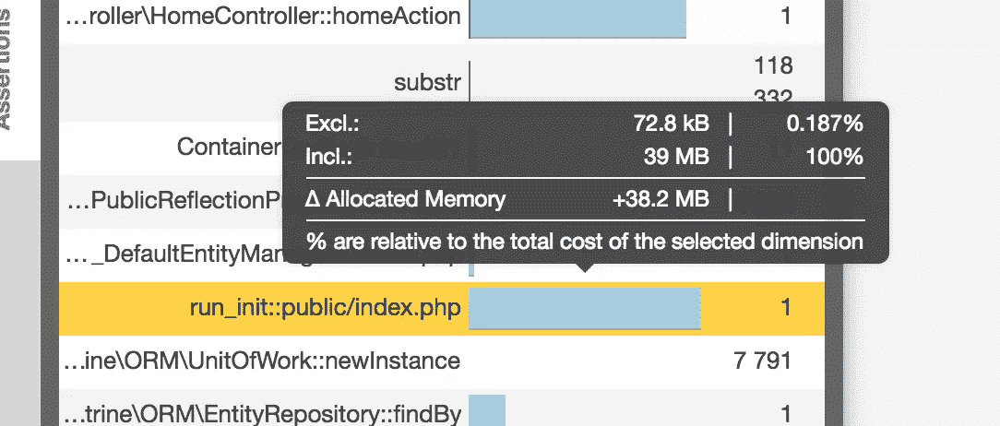
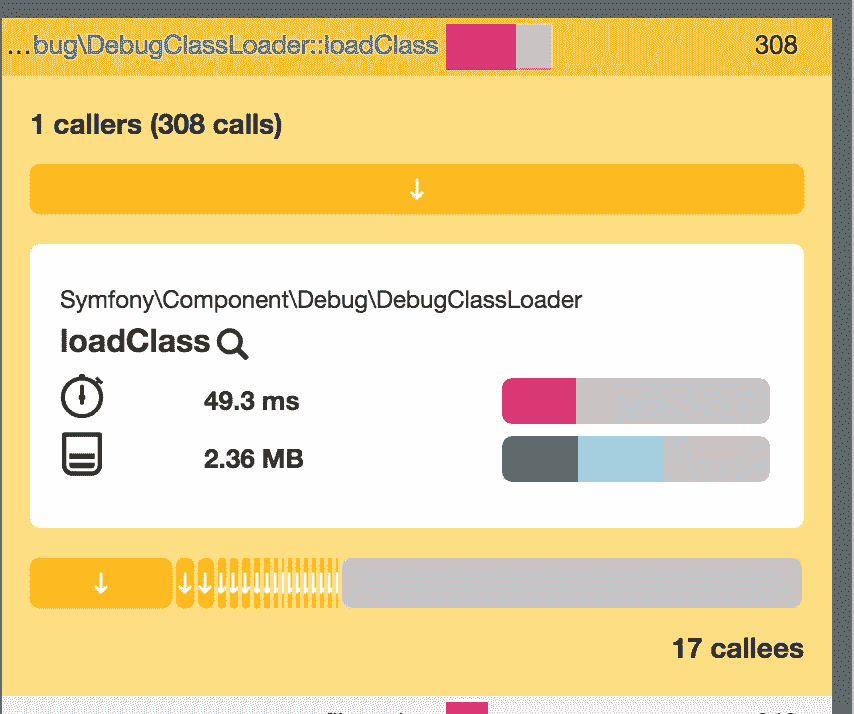

# Blackfire 的 PHP 级性能优化

> 原文：<https://www.sitepoint.com/php-level-performance-optimization-blackfire/>

本文是构建一个示例应用程序——一个多图片画廊博客——的系列文章的一部分，用于性能基准测试和优化。(点击此处查看[回购](https://github.com/sitepoint-editors/multi-image-gallery-blog/)。)

* * *

在过去的几个月里，我们介绍了 Blackfire 以及使用它来检测应用程序性能瓶颈的方法。在这篇文章中，我们将把它应用到我们刚刚开始的项目中，尝试找到我们可以用来提高应用程序性能的低点和低挂的果实。

如果你正在使用[家园改进版](https://www.sitepoint.com/quick-tip-get-homestead-vagrant-vm-running/)(你应该这样做)，Blackfire 已经安装了。

虽然在深入研究 Blackfire 之前先了解它是很有用的，但是应用本文中的步骤不需要任何先验知识；我们将从零开始。

## 设置

以下是评估 Blackfire 生成的图表时有用的术语。

*   ***参考资料*** :我们通常需要运行我们的第一个资料作为参考资料。这个概要文件将是我们的应用程序的性能基线。我们可以将任何概况与参考进行比较，以衡量绩效成就。

*   ***独占时间*** :在一个要执行的函数/方法上花费的时间，不考虑其外部调用所花费的时间。

*   *:执行一个功能所花费的总时间，包括所有的外部调用。*

**   ***热路径*** :热路径是我们的应用程序在概要分析期间最活跃的部分。这些可能是消耗更多内存或占用更多 CPU 时间的部分。* 

 *第一步是在[黑火](https://blackfire.io)注册一个账户。在克隆项目后，[账户](https://blackfire.io/account)页面会有需要放入`Homestead.yaml`的令牌和 id。所有这些值在底部都有一个占位符:

```
# blackfire:
#     - id: foo
#       token: bar
#       client-id: foo
#       client-token: bar 
```

在取消对行的注释并替换值之后，我们需要安装 [Chrome companion](https://blackfire.io/docs/integrations/chrome) 。

Chrome companion 只有在需要手动触发分析时才有用——这将是你的大多数用例。还有其他可用的集成，完整的列表可以在[这里](https://blackfire.io/docs/integrations/index)找到。

## 逆火优化

我们将测试主页:登陆页面可以说是任何网站最重要的部分，如果加载时间太长，我们肯定会失去我们的访问者。在 Google Analytics 开始记录反弹之前，它们就已经消失了！我们可以测试用户添加图像的页面，但是只读性能远比写性能重要，所以我们将关注前者。

这个版本的应用程序会加载所有的图库，并按年代排序。

测试很简单。我们打开想要进行基准测试的页面，在浏览器中单击扩展的按钮，然后选择“Profile！”。

下面是结果图:

[https://blackfire.io/profiles/bc36d339-4c09-42e9-bce3-46b66bd11743/embed](https://blackfire.io/profiles/bc36d339-4c09-42e9-bce3-46b66bd11743/embed)

事实上，我们在这里可以看到，执行时间**含**到**不含**在 PDO 执行上是 100%。具体来说，这意味着整个深粉色部分都花在了这个函数中，尤其是这个函数不等待任何其他函数。这是被等待的函数。其他方法调用的浅粉色条可能比 PDO 的要大得多，但是这些浅粉色部分是依赖函数的所有较小浅粉色部分的总和，这意味着单独看，这些函数不是问题所在。黑暗的需要先处理；他们是最重要的。

此外，切换到 RAM 模式显示，虽然整个调用使用了几乎高达 40MB 的 RAM，但绝大多数是在树枝渲染中，这是有意义的:毕竟，它显示了大量数据。



在图中，**热路径**具有粗边框，通常表示瓶颈。**密集节点**可以是热路径的一部分，但也可以完全在热路径之外。密集节点是由于某种原因而花费大量时间的节点，也同样可以指示问题。

通过查看最有问题的方法并点击相关节点，我们可以确定 PDOExecute 是最有问题的瓶颈，而`unserialize`相对于其他方法使用了最多的 RAM。如果我们应用一些检测工作，并遵循相互调用的方法流，我们会注意到这两个问题都是由于我们在主页上加载了整个图库集这一事实引起的。PDOExecute 在内存和 wall time 中花费了很长时间来找到它们并对它们进行排序，而 Doctrine 花费了很长时间和无尽的 CPU 周期来将它们转换成可渲染的实体，并使用`unserialize`在`twig`模板中遍历它们。解决方案似乎很简单——在主页上添加分页功能！

通过在`HomeController`中添加一个`PER_PAGE`常量并将其设置为类似于`12`的值，然后在获取过程中使用这个分页常量，我们阻塞了对最新的 12 个图库的第一次调用:

```
$galleries = $this->em->getRepository(Gallery::class)->findBy([], ['createdAt' => 'DESC'], self::PER_PAGE); 
```

当用户滚动到页面的末尾时，我们将触发一个延迟加载，因此我们需要向 home 视图添加一些 JS:

```

    {{ parent() }}

    <script> $(function () {
            var nextPage = 2;
            var $galleriesContainer = $('.home__galleries-container');
            var $lazyLoadCta = $('.home__lazy-load-cta');

            function onScroll() {
                var y = $(window).scrollTop() + $(window).outerHeight();
                if (y >= $('body').innerHeight() - 100) {
                    $(window).off('scroll.lazy-load');
                    $lazyLoadCta.click();
                }
            }

            $lazyLoadCta.on('click', function () {
                var url = "{{ url('home.lazy-load') }}";
                $.ajax({
                    url: url,
                    data: {page: nextPage},
                    success: function (data) {
                        if (data.success === true) {
                            $galleriesContainer.append(data.data);
                            nextPage++;
                            $(window).on('scroll.lazy-load', onScroll);
                        }
                    }
                });
            });

            $(window).on('scroll.lazy-load', onScroll);
        }); </script>
 
```

因为注释被用于路线，所以很容易在`HomeController`中添加一个新方法，以便在被触发时延迟加载我们的图库:

```
/**
 * @Route("/galleries-lazy-load", name="home.lazy-load")
 */
public function homeGalleriesLazyLoadAction(Request $request)
{
    $page = $request->get('page', null);
    if (empty($page)) {
        return new JsonResponse([
            'success' => false,
            'msg'     => 'Page param is required',
        ]);
    }

    $offset = ($page - 1) * self::PER_PAGE;
    $galleries = $this->em->getRepository(Gallery::class)->findBy([], ['createdAt' => 'DESC'], 12, $offset);

    $view = $this->twig->render('partials/home-galleries-lazy-load.html.twig', [
        'galleries' => $galleries,
    ]);

    return new JsonResponse([
        'success' => true,
        'data'    => $view,
    ]);
} 
```

## 比较

现在，让我们通过重新运行分析器，将升级后的应用程序与之前的版本进行比较。

[https://blackfire.io/profiles/c477a76b-aed7-4b55-abe8-7ac87d2a3e47/embed](https://blackfire.io/profiles/c477a76b-aed7-4b55-abe8-7ac87d2a3e47/embed)

果然，我们的网站使用的内存少了 10 倍，加载速度也快了很多——也许不是 CPU 时间，正如图中秒表所示，而是 impression。重装现在几乎是即时的。

该图现在向我们展示了 DebugClass 是资源最密集的方法调用。



发生这种情况是因为我们处于开发模式，这个类装入器通常比生产类装入器慢得多，因为它没有大量缓存类。这是必要的，这样可以立即测试代码中所做的更改，而不必清除 APC 缓存或任何其他正在使用的缓存。

如果我们仅仅为了这个测试而切换到`prod`模式，我们会看到一个明显的不同:

[https://blackfire.io/profiles/553d29d2-6df8-4a71-9df6-642ab9c52f78/embed](https://blackfire.io/profiles/553d29d2-6df8-4a71-9df6-642ab9c52f78/embed)

## 结论

我们的应用程序的速度现在令人难以置信——加载页面只有 58 毫秒，而且看不到类加载器。请注意，这一切都发生在拥有数千个虚拟数据条目的虚拟机中。在这一点上，我们可以对我们的应用程序的生产状态感到非常乐观:主页上几乎没有什么优化了；其他的都可以归为微优化。

定期重新运行这些性能测试对于任何应用程序的开发周期都非常重要，将它们集成到应用程序的测试管道中，就像 CD/CI 流程一样，会非常有帮助且富有成效。我们稍后会看到这个选项，但是需要注意的是，Blackfire 的高级订阅实际上提供了这个内置的功能。[来看看](https://blackfire.io/docs/cookbooks/tests)！

现在，重要的是我们已经安装了 Blackfire，并且它可以很好地帮助我们找到瓶颈，并在我们添加更多功能时识别新的瓶颈。欢迎来到持续性能测试的世界！

## 分享这篇文章*