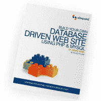

# 使用 PHP & MySQL 建立你自己的数据库驱动的网站，第四版

> 原文：<https://www.sitepoint.com/php-mysql-tutorial-2/>

## 谁应该阅读这个系列？

本系列文章的目标读者是希望向服务器端编程迈进的中级和高级 web 设计人员。预计您会对简单的 HTML 感到舒适，因为我将使用它而不做太多解释。我们不假设也不要求您了解层叠样式表(CSS)或 JavaScript，但是如果您了解 JavaScript，您会发现这将使学习 PHP 变得轻而易举，因为这些语言非常相似。

在本系列结束时，您可以期望对构建数据库驱动的网站有所了解。如果您遵循这些示例，您还将学习 PHP(一种让您轻松访问数据库的服务器端脚本语言，等等)和结构化查询语言(SQL——与关系数据库交互的标准语言)的基础知识，MySQL 是当今最流行的免费数据库引擎。最重要的是，你将拥有一切你需要的东西，开始你自己的数据库驱动的网站！

## 这个系列有什么？

这一系列包括以下 4 章。从头到尾按顺序阅读，以获得对主题的完整理解，或者如果你需要复习某个特定主题，可以跳过。

[第一章:安装](https://www.sitepoint.com/article/php-amp-mysql-1-installation/)

在开始构建数据库驱动的网站之前，您必须首先确保拥有合适的工具。在第一章中，我将告诉您在哪里可以获得您需要的两个基本组件:PHP 脚本语言和 MySQL 数据库管理系统。我将指导您完成 Windows、Linux 和 Mac OS X 上的设置过程，并向您展示如何测试 PHP 在您的 web 服务器上的可操作性。

[第 2 章:MySQL 入门](https://www.sitepoint.com/article/getting-started-mysql/)

尽管我确信您会急于开始构建动态 web 页面，但我将首先介绍数据库的一般知识，特别是 MySQL 关系数据库管理系统。如果您以前从未使用过关系数据库，这绝对是一个有启发性的章节，将会激起您对未来的兴趣！在这个过程中，您将建立一个简单的数据库，以便在后面的章节中使用。

[第三章:PHP 简介](https://www.sitepoint.com/article/mysql-3-getting-started-php/)

这才是真正有趣的地方。在这一章中，我将向你介绍 PHP 脚本语言，你可以用它来构建动态网页，向你的访问者展示最新的信息。有编程经验的读者可能只需要快速浏览一下这一章，因为我会从头开始解释这门语言的本质。然而，这是初学者必读的一章，因为本书的其余部分很大程度上依赖于这里介绍的基本概念。

[第 4 章:在 Web 上发布 MySQL 数据](https://www.sitepoint.com/article/publishing-mysql-data-web/)

在这一章中，你将把 PHP 和 MySQL 结合在一起，你将在前面的章节中分别看到，来创建你的第一个数据库驱动的网页。您将探索使用 PHP 从数据库中检索信息并将其实时显示在 Web 上的基本技术。我还将向您展示如何使用 PHP 创建基于 web 的表单，以便动态地向 MySQL 数据库添加新条目和修改其中的现有信息。

## 这本书

这一系列的四个章节实际上只是本书的第一部分。 [**使用 PHP 建立自己的数据库驱动网站& MySQL**](https://www.sitepoint.com/books/phpmysql4/) 不仅包含以上四章，还包含八章，涵盖了高级数据库概念、完整内容管理系统的设计、MySQL 服务器管理等等！这本书还包括一套完整的附录，使其成为 PHP 和 MySQL Web 开发的理想参考。更多信息，请参见[图书第](https://www.sitepoint.com/books/phpmysql4/)页。

如果你更喜欢阅读前四章的 Adobe Acrobat PDF 版本，你可以[免费下载前四章。](https://www.sitepoint.com/books/phpmysql4/samplechapters.php)

## 您的反馈

如果你对本系列中的任何信息有疑问，快速回复的最佳机会是在[SitePoint.com 论坛](https://www.sitepoint.com/forums/)上发布你的问题。

如果你不能通过论坛找到你的答案，或者如果你因为任何其他原因希望与我联系，[最好写在这里](https://www.sitepoint.com/books/contact.php)。我们有一个人员充足的电子邮件支持系统来跟踪您的查询，如果我们的支持人员无法回答您的问题，他们会直接发送给我。特别欢迎您提出改进建议以及发现任何错误的通知。

所以，事不宜迟，让我们开始吧！

[Chapter 1: Installation](https://www.sitepoint.com/blog/)

如果你喜欢读这篇文章，你会爱上[可学的](https://learnable.com/)；向大师们学习新技能和技术的地方。会员可以即时访问 SitePoint 的所有电子书和交互式在线课程，如 [PHP & MySQL 初学者网络开发](https://learnable.com/courses/php-mysql-web-development-for-beginners-13)。

**Go to page:** [1](/php-mysql-tutorial) | [2](/php-mysql-tutorial-2/)

## 分享这篇文章