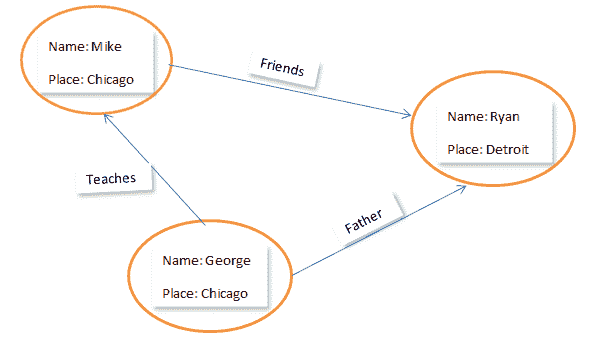

# PHP 和 Neo4j:图形数据库简介

> 原文：<https://www.sitepoint.com/php-neo4j-introduction-graph-databases/>

长期以来，数据通常以表格形式存储，以便增加索引和可读性。如今，随着图形数据库的迅速普及，这种趋势正在发生变化。事实上，称它们为“数据库管理系统的未来”不会错。

不熟悉图形和数据库的世界？不要担心，在这篇介绍性文章结束时，您将拥有关于该主题的坚实的理论知识——足以轻松地完成本系列的其余部分——实际实现。

### 什么是图？

在数据结构的世界中，图形是以可视化方式存储数据的最普通的形式。图形以节点(数据块)的形式存储数据，其中一个节点指向另一个节点。我们可以从另一个数据块访问任何数据块。

### 什么是图形数据库？

从技术上讲，图数据库是一种以**节点、边和关系**的形式存储数据的方式，这些节点、边和关系提供了无索引邻接。

现在让我们理解这一点——数据以*节点*的形式存储，每个节点(或数据块)都与另一个节点相连，这种连接称为*边缘*。在这些边上还提到了一些词来进一步定义一个节点和另一个节点之间的连接——这种描述被称为*关系*。由于每个节点都可以直接查找它所连接的节点(都是通过边连接的，还记得吗？)，这消除了通过“索引”搜索数据块的需要，因此有术语**“无索引邻接”**。

今天，像脸书这样的大多数社交网站使用图形数据库来存储他们的海量数据。

## 图形数据库的使用

当要存储的数据是关联的，也就是说当两个数据块之间的关系非常重要时，图形数据库就有了用武之地。当两个数据块之间存在关系时，关系数据库(表格形式)就不那么好了，尤其是当这种关系比实际的数据块更重要时。图形数据库是描述任何形式数据的一种非常直观和富有表现力的方式——就像我们在白板上写东西一样。它们让您可以按原样表示相关数据——作为由一组关系连接的一组对象，每个对象都有自己的一组描述性属性。

我们在以下情况下使用它们…

*   **…处理连接的数据。**例如，社交网络平台——除了个人信息，数据库还依赖于两个人的联系方式，因为如果两个朋友不是朋友，而只是熟人，那么他们之间可见的数据量将会不同。

*   **…遍历优于索引。**这意味着我们将“浏览”数据库的一部分，而不是直接跳到一个部分。例如，从一家工厂出口一辆汽车的许可要求该车有一个引擎和内饰(不是真的，但请原谅我)。在管理层，该程序将包括检查所有具有上述特性的车辆。如果公司使用图形数据库来存储这些数据，他们将检查每个节点(car ),如果没有，则丢弃并继续前进。

*   解决旅行推销员问题。这些是非常常见的问题，当有多个选项可用时，需要计算从 A 点到 B 点的最小可能路径。如果目的地以图形数据库的形式存储，使用各种最小距离算法可以找出具有最小成本的路径。

*   **…要搜索的下一个项目取决于上一个项目。**例如，一个全球性企业的数据库，它记录了一个小甜饼是如何由小麦制成的。他们将看到小麦是如何通过农民、卡车、工厂、搅拌机、烤箱、包装，最后进入超市的。这里，所有阶段可以通过节点彼此连接，因此从一个阶段移动到另一个阶段将是容易的。

### 例子

在这个例子中，迈克有一个叫乔治的老师，他的儿子瑞安是他的朋友。这已经通过在圆中的边和属性上书写关系来表示。这与数据在图形数据库中的实际存储方式非常接近。如果我们用一个表格来描述这种关系，就不会那么容易了。

### 图形数据库的真实使用案例

图形数据库在现实世界中变得非常流行。以下是图表数据库在世界领先公司中得到应用的一些领域:

*   Google 使用图形数据库的概念来计算搜索结果的显示顺序。有向图用于将万维网页面作为节点连接在一起，并将彼此的超链接作为边。每个图的输出边的数量被指定为该边的权重。因此，根据一条边相对于其他边的权重来决定页面排名。

*   **数据管理**:思科，世界领先的网络组织之一，最近采用了分层管理系统，该系统集中基于 Neo4j 数据库的图形工具。与 Oracle RAC 相比，这为他们提供了非常快速的数据访问。他们也在产品层次上实施这一概念，以便实时为用户服务。

*   社交互联:像脸书、Twitter、LinkedIn、Viadeo、Glassdoor 这样的网站正在以图表数据库的形式存储他们的联系。从用户的角度来看，推荐很重要。与关系数据库相比，关系和连接可以得到很好的管理和实时访问。

*   **网络管理**:SFR、Telenor、Huwai、JustDial 等电信公司已经转向图形数据库，以对其由高度互联的计划、客户和团体组成的网络进行建模。图表有助于他们分析网络和数据中心，还可以将他们从传统耗时的身份验证过程中解救出来。最重要的是，通过使用图表，故障案例也包括在内，恢复计划总是在一个节点之外，这显然可以在任何危险发生时节省大量时间。

*   **安全和访问管理**:Adobe 的 creative cloud 使用图形数据库结构来链接认证细节，从而授予管理员和用户对内容的访问权限。

*   **生物信息学** : Era7 是一家处理 DNA 测序的公司，即存储蛋白质、酶等信息。这是在 Bio4j 的帮助下完成的，Bio4j 是一个生物信息学图形数据库系统。它储存了关于基因、蛋白质和其他复杂相关信息的信息。Bio4j 具有 Neo4j(世界领先的图形数据库)的所有特性，因此具有很高的可伸缩性和灵活性。

### 结论

我希望您现在能更好地理解图形数据库背后的理论。很快，我们将详细了解如何在 PHP 中使用世界领先的图形数据库 Neo4j。

如果你想了解某个特定的用例，请在评论中提出来！

## 分享这篇文章