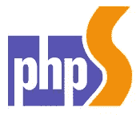

# 你可能错过的 PHP 新闻——2014 年 8 月、9 月

> 原文：<https://www.sitepoint.com/php-news-may-missed-august-september-2014/>

到目前为止，您应该对这种文章类型很熟悉了。每隔几周(几个月？)，我总结了 PHP 世界中所有我认为您应该知道的“流行但不够流行”的新闻，并链接了包含更多信息的来源。其中一些可能是我们已经在 SitePoint 上讨论过的事情，但值得转发，另一些可能被更受欢迎的消息掩盖了(比如，我不知道， [PHP 5.6 即将发布](https://www.sitepoint.com/php-5-6-0-released/))。

让我们看看有什么新的。

## HHVM 宣布 LTS

HHVM，我们之前在一定程度上提到过，已经宣布了长期支持版本。这意味着您现在可以放心地用 HHVM 部署您的产品代码，因为他们“承诺”在可预见的未来保持所述版本的活力。PHP 社区中怀疑该项目的寿命的怀疑论者现在可以放心了，他们的代码将继续工作，BC 安全，至少还有一段时间。你可以在这里阅读更多关于这个[的内容。](http://hhvm.com/blog/6083/hhvm-long-term-support)

## 2.6 版本的地理编码器

Geocoder 是一个帮助您构建地理感知应用程序的库，它已经到了 2.6 版。这听起来很小，但考虑到我们增加了的[，这真的不是。有什么地理感知的 PHP 应用程序想和我们分享吗？让我们知道——我们很乐意出版和推广你的作品，只要它遵循最佳实践，人们可以从中学习！](https://github.com/geocoder-php/Geocoder/blob/master/CHANGELOG.md)

## 面向初学者的 Zend Framework 2

我们自己的 [Matthew Setter](https://www.sitepoint.com/author/msetter/) 出版了他自己的 Zend 框架书，名为 [Zend 框架 2 基础](https://leanpub.com/zendframework2-for-beginners)。在这篇文章中，他探索了 behemoth 框架的错综复杂的深度，涵盖了一个 Zender 初学者需要熟悉的框架的所有内容，足以让他自己继续下去。Matthew 全心全意地投入了这篇手稿，所以如果你对 Zend Framework 2 有一点点兴趣的话，一定要试一试。

## 版本扫描 1.0

由[克里斯·科尼特](https://twitter.com/enygma)开发的[版本扫描](https://github.com/psecio/versionscan)工具达到了它的 1.0 里程碑。我们在这里稍微介绍了一下这个工具[，但是本质上，你用它来扫描你的 PHP 版本中已知的未修复的错误和问题，从而衡量你的安装的默认安全性和成熟度。如果您曾经不确定是否应该花时间将生产服务器上的版本更新到最新版本，请使用这个工具来帮助自己。](https://www.sitepoint.com/quick-tip-make-sure-php-version-safe-versionscan/)

## Recki-CT 和 JitFu

安东尼·费拉拉最近发布了他的 20%项目，称之为 ReckiCT。解释它和/或争论使用它是否有意义，因为它现在似乎比本机实现慢，这超出了本文的范围，所以如果你想学习如何安装它并尝试一下，请查看[快速提示](https://www.sitepoint.com/quick-tip-install-recki-ct-vagrant-ubuntu-box/)。

如果你完全不知道这是什么，这是一个用 PHP 编写的编译器，它产生优化的 PHP 代码，其速度可与最近的实现相媲美——一个不同之处是你没有脱离 PHP 语法，不像其他大多数解决方案，如 Zephir。据称，你可以使用 Recki 来优化你的应用程序，而无需改变整个底层运行时间(不像 HHVM)。

点击阅读更多[。](https://github.com/google/recki-ct)

## 拉勒韦尔 5 台新闻

Laracon 结束了，新版本([现在是 5.0 而不是 4.3](https://twitter.com/taylorotwell/status/510159205995520000) )给我们带来了一些有趣的东西。首先，目录结构发生了变化 app 文件夹现在只包含三个文件夹:Console、HTTP 和 Providers。在控制台下，您将拥有应用程序的所有 CLI 方面。HTTP 将包含你在浏览器中访问网站时发生的一切，你将使用提供商来注册过滤器、服务等。模型现在进入应用程序目录的根目录，所有的类都以 [PSR-4](https://www.sitepoint.com/battle-autoloaders-psr-0-vs-psr-4/) 命名。您可以通过运行`php artisan app:name X`将应用程序的主根名称空间从 App 重命名为 X(其中 X 是您想要的任何名称)。这将遍历所有文件，并根据需要重命名应用程序名称。此外，名称空间可以在`config/namespaces.php`中定制配置。

您还可以让参数从 IoC 容器自动注入到控制器方法中，这在验证东西时非常有用——它大大减少了代码量。添加了新的生成器，因此可以自动为您编写一些文件。还有通过 [FlySystem](https://www.sitepoint.com/abstract-file-systems-flysystem/) 的多文件系统支持、合同、用于超快速路由注册的路由缓存和用于非常容易的社交网络认证的 sociate，但是 Jeffrey Way 非常非常好地涵盖了所有这些[，是免费的](https://laracasts.com/series/whats-new-in-laravel-4-3)。

## Phalcon 2.0 beta 2

说到流行框架的新版本，越来越令人惊奇的 Phalcon 已经发布了 beta 2，并且正在寻找用户反馈。安装它，测试它，投入工作，看看你能用它做什么——它现在几乎已经用 Zephir 完全重写了(API 还是一样的),所以你也可以在进一步的转换和测试中助一臂之力。阅读他们的[官方博客帖子](http://blog.phalconphp.com/post/95931229730/phalcon-2-beta-2-available)了解更多信息！

## PhpStorm 8.0 增加了 Z 射线和 PHP 5.6 支持！

即将发布的 PHPStorm 版本不仅将全面支持 PHP 5.6，而且 PHPStorm 的开发者 Jebrains 也已经与 Zend Technologies 达成协议，将 Z-Ray 包含在下一个版本中。如果你对 Z-Ray 不清楚，它是 Zend 服务器的一部分，在某种程度上我们已经在之前[报道过，你可以在](https://www.sitepoint.com/getting-know-zend-server-7/)[这个链接](http://files.zend.com/help/Zend-Server/zend-server.htm#developing_with_z-ray.htm)找到更多关于它的信息。

用 JetBrains PhpStorm 产品经理 Alexey Gopachenko 的话说:

与 Zend Server 的集成，特别是与 Z-Ray 的集成，提供了前所未有的可见性，允许开发人员在开发代码时看到代码是如何运行的。这种“X 射线”洞察力使开发人员处于控制之中，更快地转化为更高质量的代码。Zend Server Z-Ray 和 PhpStorm 的组合在整个开发周期中对开发人员和管理人员来说都是真正的双赢，尤其是面向企业的项目。”

关于 Zend 服务器的更多信息，请参见[http://zend.com/server](http://zend.com/server)。Zend Server Developer Edition 的起价为 195 美元，在有限的时间内，PhpStorm 用户可以用优惠券代码 PHPSTORM 节省 20%的正常价格。

要在互动在线演示中快速查看 Z-Ray 的运行情况，请参见[http://www.zend.com/en/products/server/z-ray-use-cases](http://www.zend.com/en/products/server/z-ray-use-cases)。

如果你试用了它，请告诉我们，我们很乐意发表一些详细的见解，来抵消你的 Zend 服务器账单；)

## 注销

这一次就这样了，如果你觉得我错过了什么，请告诉我！

## 分享这篇文章