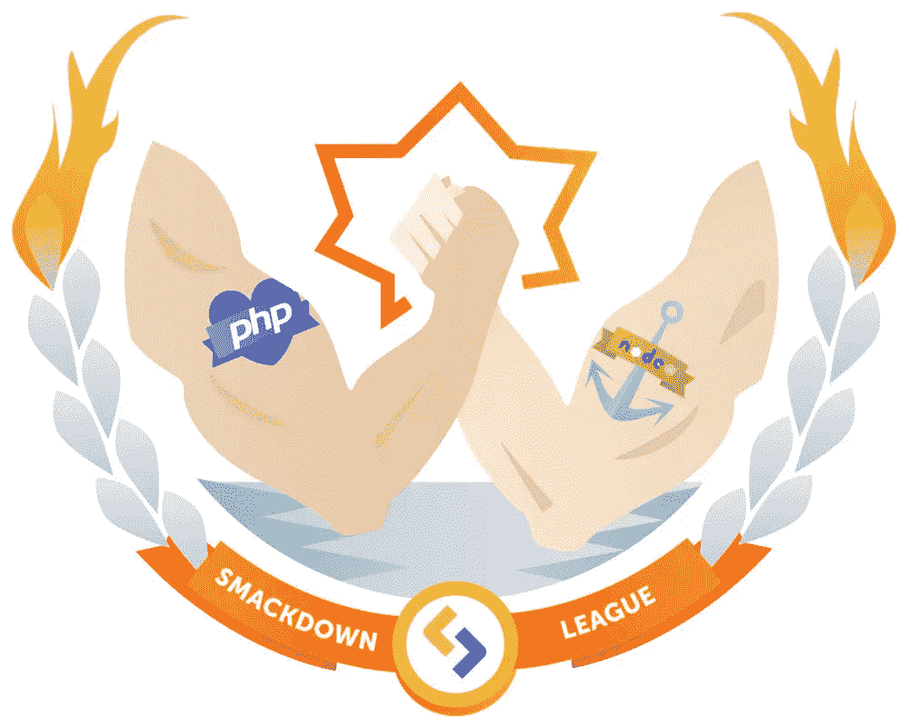

# PHP vs Node.js 对攻:答辩权

> 原文：<https://www.sitepoint.com/php-vs-node-js-smackdown-right-of-reply/>

在 SitePoint 最近的 [PHP vs Node.js 对决](https://www.sitepoint.com/sitepoint-smackdown-php-vs-node-js/)中，Craig Buckler 让这些开发学科在一系列十个挑战中相互竞争，以确定哪个是整体赢家。

正如克雷格在文章中指出的，这些比较总是有些争议。作为一个有趣的跟进，我们请 Bruno kvorc(SitePoint 的 PHP 编辑器)和 James Hib bard(SitePoint 的 JavaScript 编辑器之一)对每一轮进行评论。

这是他们的详细评估…

* * *

## 第一轮:开始

第一轮的挑战是看你能多快地用每种语言建立一个“Hello World”网页。这包括设置服务器环境所需的时间。

据 Craig 估计，PHP 赢得了这一轮，部分原因是它“概念上更简单”，而且“对新开发人员来说不那么令人生畏”。

### 布鲁诺:

PHP 在“入门”方面胜出，纯粹是因为更多的主机让入门变得如此容易。这是领养的问题，而不是别的。如果更多的主机绕过使用 Node 命令行的需要，直接使用文件上传和控制面板中的一个简单的“重新加载应用程序”按钮，它们将是平等的。然而，在 PHP 中，让某些内容显示在屏幕上的实际语法要简单得多——尤其是对于编程新手来说。

### 詹姆斯:

在本地发展时，我看不出两者有什么巨大的区别。要在你的浏览器中运行 PHP 脚本，你需要安装某种类型的服务器栈；要运行节点脚本，您需要安装节点，最好是 web 框架，如 [express](https://www.npmjs.com/package/express) 。然而，正如 Craig 所说，PHP 在概念上更简单。节点的进入壁垒更高。没有争论。

## 第 2 轮:帮助和支持

[第 2 轮](https://www.sitepoint.com/sitepoint-smackdown-php-vs-node-js/#r2)考察了每种语言获得帮助和支持的难易程度。PHP 这一轮胜出，主要是因为它的长寿。

### 布鲁诺:

布鲁诺对此保持沉默。

### 詹姆斯:

我同意这一点。Node.js 是一项较年轻的技术，所以目前，可用的帮助较少。然而，随着节点的成熟，这将变得越来越不需要考虑。

## 第三轮:语言语法

[Round 3](https://www.sitepoint.com/sitepoint-smackdown-php-vs-node-js/#r3) 比较了理解和使用 PHP 和 JavaScript 语法的容易程度。克雷格把这一轮判给了 JavaScript。

### 布鲁诺:

在这一点上我强烈反对。虽然 PHP 确实有其怪癖，但其中许多已经在最近得到了纠正，许多奇怪的东西将在最新版本中被删除。另一方面，在 JS 世界里有[这个](http://bocoup.com/weblog/es2015-nightmarefile/)和[这个](https://uploads.sitepoint.com/wp-content/uploads/2015/06/1435405133B83LZQLIYAAHVzJ.png)。

关于[第三条](https://www.sitepoint.com/sitepoint-smackdown-php-vs-node-js/#bull33) ( *说你的大脑不需要切换模式，因为你可以在客户端和服务器端使用 JS*，我不同意。服务器环境与客户端环境完全不同，需要切换大脑模式*。还有一些新的语法你不能在浏览器中使用，反之亦然，所以这有点像切换语言。*

 *[Bullet 4](https://www.sitepoint.com/sitepoint-smackdown-php-vs-node-js/#bull34) ( *认为理解 JS 会让你更想用它*)这也是我不同意的地方。使用 JS 和 PHP 多年后，我越是使用 JS，就越不喜欢它——尽管这纯粹是个人喜好。

### 詹姆斯:

我喜欢 JavaScript。我知道[它有它的怪癖](https://www.destroyallsoftware.com/talks/wat)，我也知道它有[的一些缺陷](https://github.com/stevekwan/best-practices/blob/master/javascript/gotchas.md)，但是 ECMAScript 2015 将会解决很多这方面的问题，并为语言带来一些[令人兴奋的新特性](http://es6-features.org/)。JavaScript 既强大又灵活，可以适应许多不同风格的编程。与 PHP 相反，我喜欢写 JavaScript。这是 Node 应得的。

## 第 4 轮:开发工具

[第 4 轮](https://www.sitepoint.com/sitepoint-smackdown-php-vs-node-js/#r4)考虑了每种技术可用的工具，多亏了 npm，Node 以微弱优势胜出。

### 布鲁诺:

虽然 Composer 最初是受 npm 的启发，但它现在比它好得多，如果你不得不安装同一个库的两个版本，它也不会破坏你的系统，不像 npm。与 npm 不同的是，Composer 可以安装递归依赖，这是 npm 无法做到的——但这是绝对必要的，应该是开始构建包管理器的人的第一个想法。

npm 也有非常糟糕的错误消息，我喜欢称之为“核心开发人员友好的”——因为只有编写它们的人才能理解它们。最后， [npm 玩不好流浪汉](https://samuelstenton.com/fix-npm-install-issues-within-a-vagrant-box-on-windows/)，有效阻碍你在[正常上手](https://www.sitepoint.com/re-introducing-vagrant-right-way-start-php/)——更别说他们不重视自己用户的欲望。[这里的](https://github.com/joyent/node/issues/6960)是一个已经存在多年的 bug，使得它基本上无法在 Windows 上使用——这可不是一个微不足道的用户群。PHP 也有自己的愚蠢错误，但是这些错误在几年内不会疏远整个操作系统。

诚然，Composer 没有和 PHP 捆绑在一起，但我认为不应该。这样的优惠不应该给一个软件包管理器，从字面上看，是一个独立的应用程序。如果有一天，有人真的为 Node 做了一个*好的*包管理器，把它换成当前的包管理器将是官僚主义的地狱，更不用说让人们进行转换了。再说安装的话字面意思就是终端里一行，或者下载一个安装程序。

认为作曲家的影响力较小的说法显然是错误的。Composer 已经影响了从 PHP 开发以来加入 PHP 列车的所有新 PHP 开发人员，以及大多数必须将其添加到当前工作流程中的优秀人员。Composer 存在之前就有很多 PHP 用户，并不代表它的影响就小。自从它被制作出来，就产生了巨大的影响。像“在社区内影响较小”这样的绝对主义言论不应该在没有事实支持的情况下做出。

我不能否认大多数 PHP 开发人员会在某一点上安装 Node，这是事实。可悲的是，很多好的工具都是先开发节点的，但是我仍然对无节点开发环境抱有希望，因为有了像 [BowerPHP](https://www.sitepoint.com/bower-vs-bowerphp/) 这样的项目。

### 詹姆斯:

我很高兴这个去了 Node。

我喜欢 npm。它易于安装，易于使用，并且有成千上万的软件包可以满足几乎任何需求。我还喜欢 npm 允许您在包的全局和本地安装之间进行选择的事实(与 Ruby 等语言相反，在 Ruby 等语言中，gem 的标准安装是与 Ruby 版本一起安装)。工具也很棒。像 Bower 和 Grunt 这样的工具在我的工作流程中有着固定的位置，并且已经多次提高了我的工作效率。

另外值得一提的是 [npm v3 出 beta](https://github.com/npm/npm/releases/tag/v3.0.0) 。这解决了 Bruno 提出的许多问题，例如嵌套 node_modules 方法的错误。

整场比赛的引言:

> PHP 开发人员可能希望/需要在某个时候安装 Node.js。反之则不然。

## 第 5 轮:环境

[第 5 轮](https://www.sitepoint.com/sitepoint-smackdown-php-vs-node-js/#r5)讨论了可以在哪里使用和部署这些技术，以及支持哪些平台和生态系统。克雷格没有明确表示他的要求，但这看起来像一个节点湿帆。

### 布鲁诺:

Craig 说他会比较 PHP 和 Node 的 web 优势(一般 web 开发挑战)，然后说 JS 无处不在。首先，我们比较的是 **Node.js** ，而不是 js 本身。其次，我们正在比较它们可以运行的语言和环境。说一只猴子比一条鱼好是因为这条鱼不会爬树，这是愚蠢的。但是猴子和鱼都会游泳，所以让我们来比较一下它们游得有多好。

在 web 开发环境中，PHP 轻而易举地胜出。PHP 中有用于桌面开发的[工具](https://www.sitepoint.com/3-ways-develop-cross-platform-desktop-apps-php/)——是的，没错，你可能不会使用它们。但是你**肯定会**用 PHP 的[命令行方面](https://www.sitepoint.com/symfony-console-beyond-the-basics-helpers-and-other-tools/)。

### 詹姆斯:

我再次同意克雷格的观点。使 Node.js 如此受欢迎的几个特性(速度、可扩展性、与 JSON 的亲和力、低资源使用率)也使它非常适合许多其他类型的应用，例如为物联网设备供电。我是说，[谁不爱机器人](http://nodebots.io/)？

Node 还催生了一些项目，如 [NW.js](https://github.com/nwjs/nw.js) (一个基于 Chromium 和 Node.js 的应用运行时)，它允许你用 HTML 和 JavaScript 编写原生应用。激动人心的时刻！

## 第六轮:整合

第 6 轮着眼于与数据库和驱动程序的集成，PHP 胜出主要是因为它的年龄。

### 布鲁诺:

整合是平局。PHP 在这方面有年龄优势，给了它更多的选择，但这也意味着它遭受了一些严重过时的集成，如`mysql`扩展——我们只是在 PHP7 中设法摆脱了它，但它已经[无法使用](https://www.sitepoint.com/migrate-from-the-mysql-extension-to-pdo/)多年了。

### 詹姆斯:

我不确定我同意这一点。整个回合的措辞似乎模糊不清，我原本希望能找到一个“更古老、更不受欢迎的技术”的例子。这也是一个很好的机会来强调 Node 的一大优势——它会说 JSON。JSON 可能是网上最重要的数据交换格式，也是与许多最新的 NoSQL 数据库交互的通用语言。JSON 非常适合 JavaScript 程序使用，这意味着当您使用 Node 时，数据可以在各层之间流畅地流动，而不需要重新格式化。从浏览器到服务器到数据库，你可以有一个语法。

## 第 7 轮:托管和部署

第 7 轮考察了将新应用部署到实时网络服务器有多容易，在 Craig 看来，PHP 在这一点上是明显的赢家。

### 布鲁诺:

布鲁诺再次保持沉默，没有什么要补充的。

### 詹姆斯:

这是 Node 需要迎头赶上的一个领域。每个廉价的虚拟主机公司都提供一个 PHP 包，其中包含 MySQL。要查看某种输出，您所要做的就是创建一个扩展名为`.php`的文件，在<之间插入一些有效语句。然后呢。>，上传文件，用浏览器点击它。对于节点来说，情况就不一样了。当然，节点托管有许多选择，但是它们总是需要更多的设置和命令行访问，这对于初学者来说可能是令人不快的。毫无疑问，PHP 轻松赢得了这一轮。

## 第 8 轮:绩效

[第八回合](https://www.sitepoint.com/sitepoint-smackdown-php-vs-node-js/#r8)专注于速度；尽管这通常可以归结为开发团队的经验和细心，Craig 指出了 Node 在许多方面的优势。

### 布鲁诺:

误解比比皆是。首先，有[这个帖子](https://philsturgeon.uk/blog/2013/11/benchmarking-codswallop-nodejs-v-php/)使得所有的绩效讨论变得毫无意义。任何和所有的性能增益/损失都完全取决于**开发人员的经验和应用程序的类型。但是，即使这篇文章不能让你相信脱离上下文的绩效讨论是愚蠢的，这里还是有一些我自己的观点:**

*   PHP 正在获得一个多线程的内置服务器。这将使完全绕过外部服务器成为可能，但不推荐(目前)。还有像 Nginx 这样的超高速服务器，它们使得启动 PHP 和向它发送请求的整个过程变得不明显。
*   像 HHVM 和 Appserver 这样的项目为 PHP 添加了强大的异步和多线程功能，PHP7 本身也在这方面进行了一些强大的升级。
*   PHP 的单请求应用程序寿命是最大的脚踝重量，是的，如果你正在寻找原始速度；但是这也很容易被绕过，不仅仅是像 Craig 所说的 Memcached 和类似的解决方案，还有像 Ajax 这样的方法。顺便说一下，默认情况下，服务器端 JS 应用程序也是单请求的。更重要的是，这种单请求生存期也是一个优势，因为它在每次使用时都会重建应用程序，从而避免内存问题，清理垃圾，并保持精简和干净。您上一次在后端或前端使用稳定、长时间运行、无内存泄漏的 JavaScript 应用程序是什么时候？

绩效讨论是，也将永远是平局。(除非你处理的是 Java——那么 Java 总是输！；) )

### 詹姆斯:

Node 被吹捧为高性能、低延迟应用程序的运行时选择，并且已经进入了几家财富 500 强公司的代码堆栈。由于其非阻塞 I/O 机制和谷歌 Chrome V8 引擎技术，它已经成为“快速”和“可扩展”的代名词。网上有很多关于 Node 如何给公司带来巨大的性能提升并提高开发人员生产力的故事。我很高兴看到这一点去节点，但理解这是一个有争议的点。

## 第 9 轮:程序员激情

[第 9 轮](https://www.sitepoint.com/sitepoint-smackdown-php-vs-node-js/#r9)Craig 观察了开发者对 PHP 和 Node 的热情，在他看来，Node 轻而易举地胜出。

### 布鲁诺:

你绝对找错地方了，克雷格。PHP 社区非常热情，非常活跃。每年有超过 20 个大型会议，一些令人惊奇的话题会被讨论。随着 HHVM 和 PHP7 的出现，打水漂的时代已经结束了。

此外，我要说的是，奇怪的是，Node 的开发人员仍然没有了解版本号是如何工作的(在撰写本文时是 v0.12.5 版)，即使经过了 6 年的开发。这种不成熟和不顾一切的“玩安全”(哎呀，你用了不稳定的东西，你的错让你的公司破产了 lol)，加上关键但被忽视的古老错误，疏远了整个操作系统的用户群，这将使任何认真的开发人员远离编程语言的生态系统。

我不喜欢 Node。我的不喜欢是基于主要围绕 npm 的负面经历。这在未来可能会改变，但现在，每当我不得不以任何身份使用 Node 时，我都充满了恐惧和绝望。我们都有自己的偏好，但保持客观并为工作选择合适的工具很重要。但是同样重要的是要承认，有时候选择正确的工具会导致首先选择错误的工具，因为你*还不知道*。所以别听克雷格的。不要听吉姆的。别听我的。尝试一下——看看什么有效，找出什么感觉好，然后使用它。最终，让你感觉高效和令人敬畏的环境是最好的，而不是让你的加载时间缩短一毫秒的环境。

### 詹姆斯:

节点发热。Nodeland 现在正在进行大量的创新。虽然激情是主观的，但我很高兴 Node 赢得了这一轮。

## 第 10 轮:未来

第 10 轮着眼于两种语言的未来，克雷格宣布这是一场平局，因为两种语言在现阶段都有很好的未来。

### 布鲁诺:

Bruno 不得不赶去写更多的 PHP 并为 SitePoint 编辑令人难以置信的 [PHP 文章。](https://www.sitepoint.com/php/)

### 詹姆斯:

*詹姆斯也渴望回到他心爱的 [JavaScript 频道](https://www.sitepoint.com/javascript/)，但还是说出了这些离别的话:*

平局是这一轮的公平结果。Node 是一颗冉冉升起的新星，但要取代 PHP 还需要一些巨大的努力。

总结一下，如果你唯一的工具是锤子，那么每个问题看起来都像钉子。Node 并不是每个场景的完美选择，事实上很多时候不使用它是有意义的。但是，什么节点做得好，就做得很好。这取决于你做出明智的选择，并为这项工作选择最好的工具。

* * *

那么，现在 Bruno 和 James 已经说了，你**和**有什么要说的吗？

## 分享这篇文章*