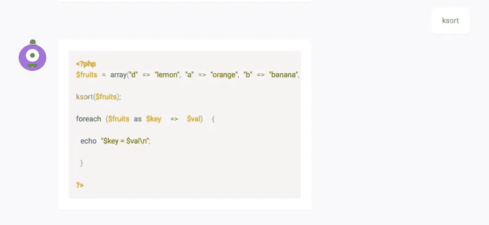
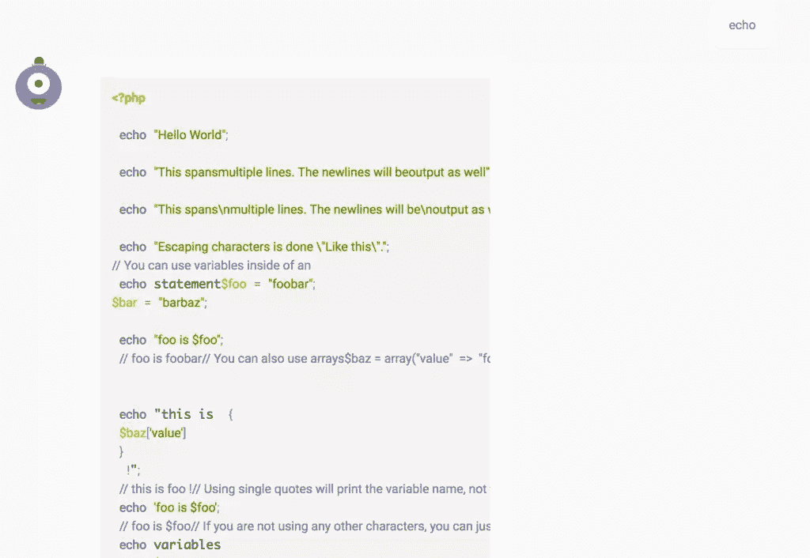
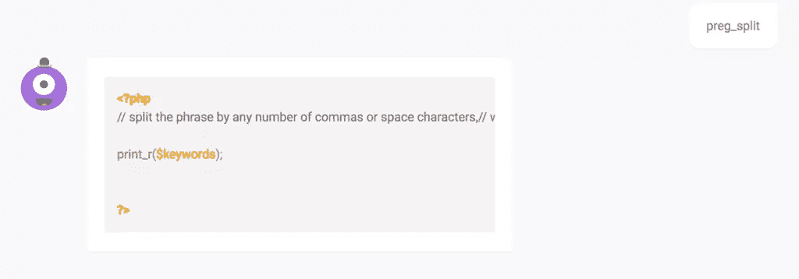
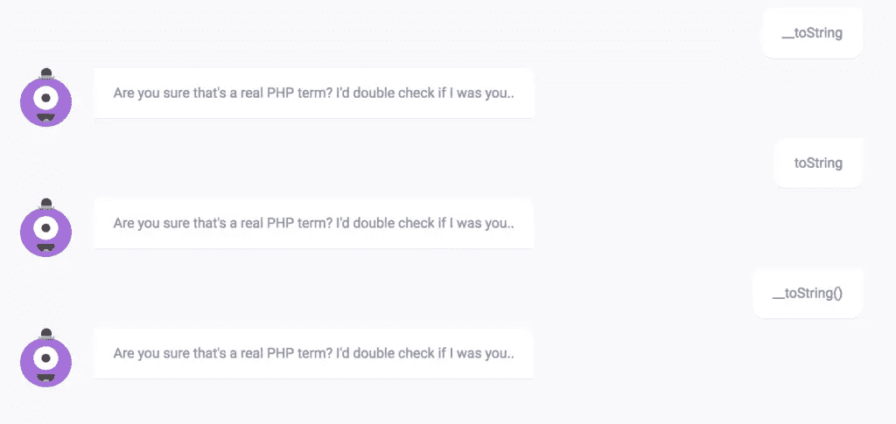
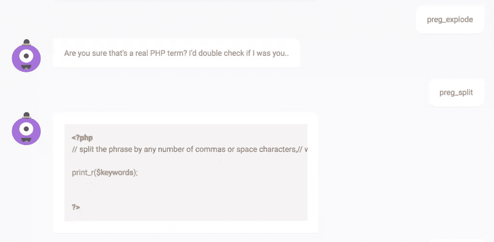
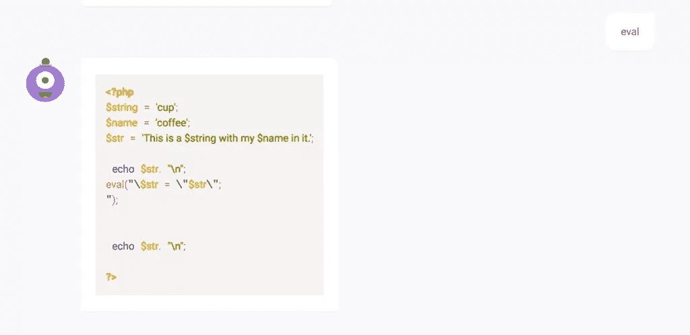

# PHP Bot Help You 能帮助你更快地查找文档吗？

> 原文：<https://www.sitepoint.com/phpbot-can-php-bot-help-look-documentation-faster/>

前几天我遇到了 [PHPBot](https://www.phpbot.org/) (不要与 [Botman](http://botman.io/) 或 [Fondbot](https://github.com/fondbot/framework) 混淆)——一个“聊天机器人”，它可以帮助你查找 PHP 手册条目并为它们生成示例代码。

如果你在 Twitter 上关注我，你会知道我不相信聊天机器人是聊天机器人——作为一个出于商业和个人目的开发了一些聊天机器人的人，作为一个生活在 IRC 自动回复脚本时代的人，我认为聊天机器人不仅仅是一种旨在打动当今 Snapchat 一代的营销时尚。然而，时不时会出现一个真正有用的。会是这个吗？让我们来看看。

## 概念

这个想法是，您使用页面上的文本输入来输入一个与 PHP 相关的术语(如“ksort”)，应用程序将回复一个解释和一些示例代码，如下所示:

不同的查询会产生不同的响应。所以，如果你问它`echo`:

## 有用

虽然这在理论上听起来很有趣，但实际上有点离谱。

### 知识库和错误

机器人能提供的知识最多也是有限的。例如，向它请求`preg_split`复制了来自[手动条目](http://php.net/manual/en/function.preg-split.php)的第一个例子，但是没有识别出换行符，把事情弄糟了:

魔法方法似乎不被支持:

有些查询会失败，完全是因为手册中没有机器人可以找到的例子:

### 自动完成/建议

对于它无法识别的查询，或者用户刚刚开始输入的查询，最好有某种自动完成或自动更正下拉菜单——或者至少，当询问错误的内容时，机器人应该能够推断出我们的意思并给出建议。例如，`preg_split`与`explode`相同，只是它使用正则表达式来拆分字符串，这个名字很愚蠢，当我们请求使用`preg_explode`时，机器人能够识别这一点，这将是一个很好的特性添加。

### 复制/粘贴友好性

机器人返回的片段只是代码突出显示的文本块，但它们不太适合复制粘贴。这些行也不换行，所以你永远不知道你在复制什么，而且这个机器人有时会错误地格式化一个例子，弄乱新的行，使它更不便于粘贴:

返回数据的标准化形式将使项目受益匪浅。PSR-2 格式的纯文本输出是跨平台友好的，可以被任何定制的客户端使用(见下面的 API)。

### 应用程序接口

该应用程序不提供 API 访问，因此只能在单独的选项卡/浏览器中使用。在我们工作的任何时候都有超过 20 个标签打开的时代，然而另一个标签并不太有用——它作为浏览器扩展会更好，真的，但如果它有 API 就更好了。

能够用任何第三方工具、客户端或 IDE 来实现它实际上是非常令人兴奋的，并且会极大地增强像 PhpStorm 这样的 IDE 中的类模板和代码片段这样的工具！

### 源代码

目前，PHPBot 是闭源的。我认为这是因为它很快就被破解了，它只不过是一个爬虫，如果它能找到一个相关的例子，它就会从被查询的方法中抓取相关的例子。这是可以理解的，但我会鼓励作者尽快清理代码并将其开源，以便我们作为一个社区可以挖掘并让它做作者没有想到的事情。

## 结论

PHPBot，虽然不太像一个机器人，更像是 PHP 手册的一个“交互式”搜索域，但它的使用范围有限。现在，它的知识库很小，里面的例子也没什么用。这是一个可爱的实验，但仅此而已。

在这个时候，我会很快推荐一个类似于 [DevDocs](https://www.sitepoint.com/look-devdocs-io/) 的东西，它包含完整的手册，可以离线工作，因此速度非常快。PHPBot 确实显示了作为一个有趣的工具/实验的潜力，但直到它开放其源代码并允许人们贡献示例代码来生成，以及在传统聊天机器人中实现其响应的 API，这些聊天机器人可以与 CLI 工具、ide 甚至 IM 应用程序客户端集成——然后，拥有一个可以与个人的本地工具完全集成的交互式、响应性、用户可升级的手册将成为游戏规则的改变者。

应该注意的是，这款应用目前还处于测试阶段，作者打算更进一步。我在推特上和他聊过[，他对功能请求和反馈非常开放，所以去给他一些吧！](https://twitter.com/rhysbeingsocial)

你检查过了吗？你觉得怎么样？

## 分享这篇文章