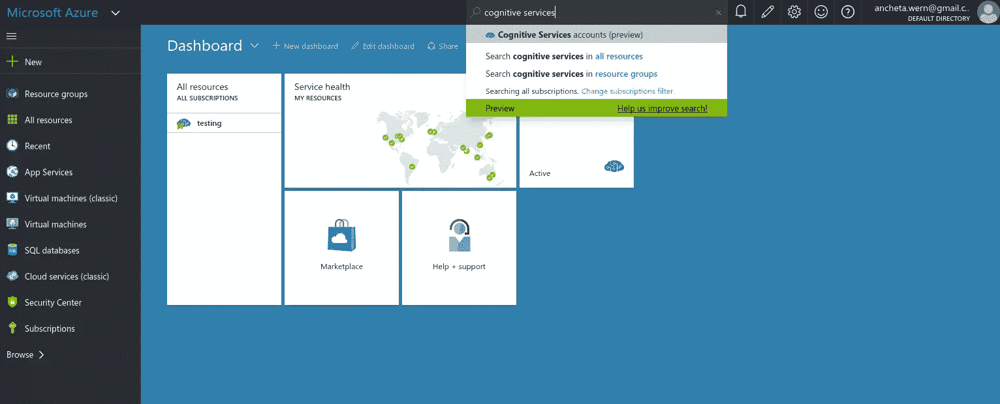
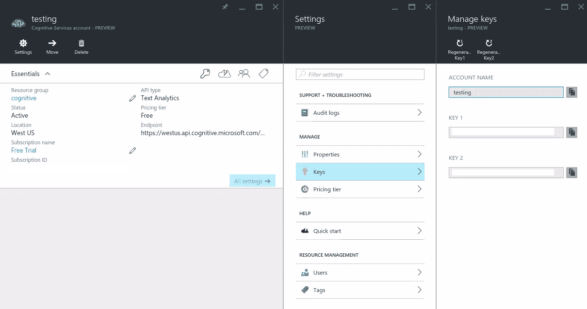
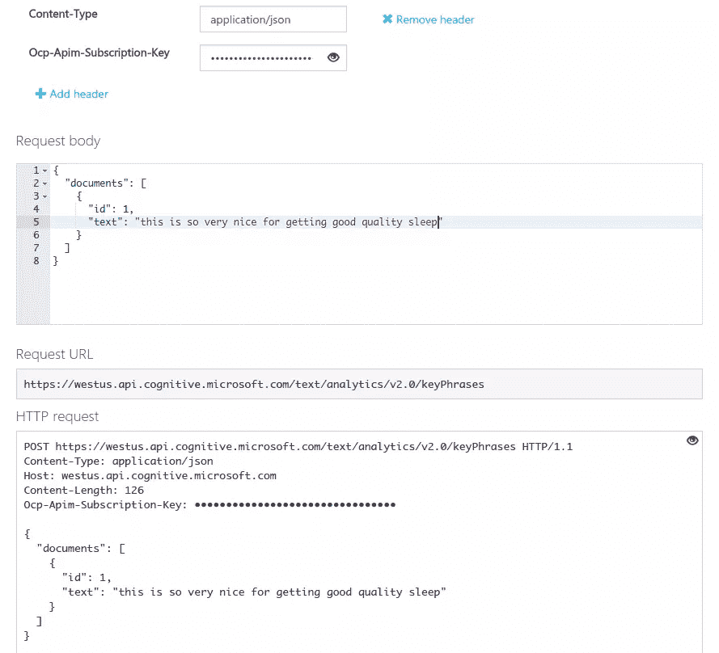
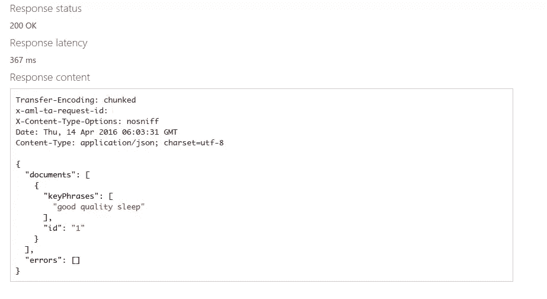
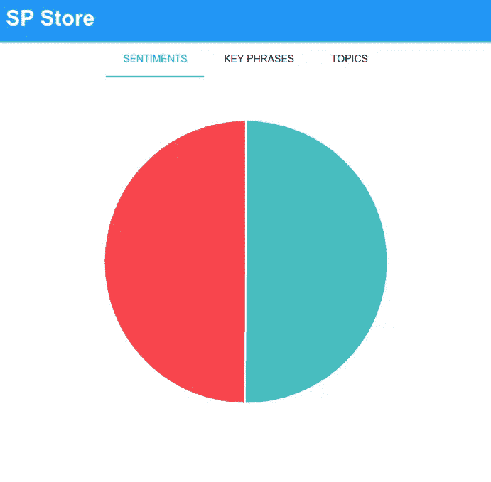
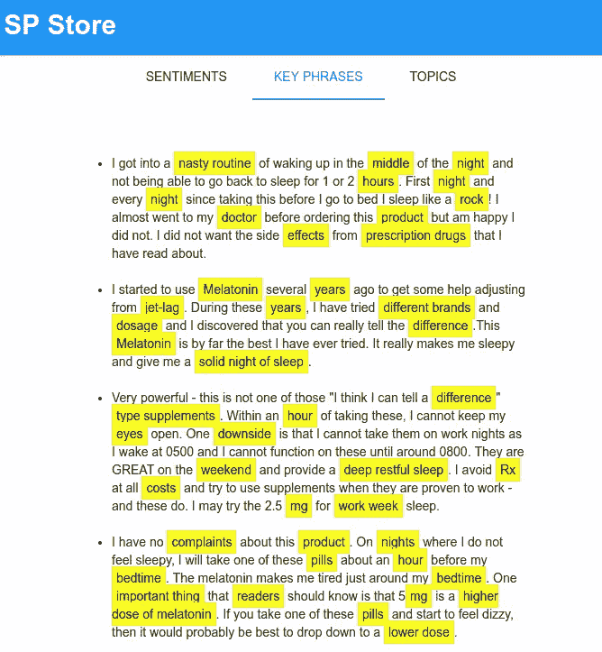
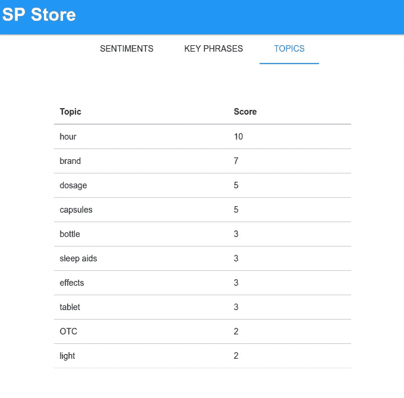

# 使用微软的文本分析软件来挖掘客户的智慧

> 原文：<https://www.sitepoint.com/picking-the-brains-of-your-customers-with-microsofts-text-analytics/>

*这篇文章由[海达·külekci̇](https://github.com/hkulekci)进行了同行评审。感谢 SitePoint 的所有同行评审员使 SitePoint 的内容尽可能做到最好！*

随着近年来[机器](https://www.sitepoint.com/voice-controlled-php-apps-with-api-ai/) [学习](https://www.sitepoint.com/predictionio-bootstrapping-a-movie-recommendation-app/) [服务](https://www.sitepoint.com/how-to-make-your-web-app-smarter-with-image-recognition/)的[爆炸](https://www.sitepoint.com/five-simple-ways-to-build-artificial-intelligence-in-2016/)，开发者创建“智能应用”变得比以往任何时候都容易。在本文中，我将向您介绍微软为应用程序提供机器学习功能的产品。具体来说，您将了解文本分析 API，并构建一个应用程序来增强在线卖家对其客户的了解。


## Microsoft 文本分析 API

文本分析 API 是[微软认知服务](https://www.microsoft.com/cognitive-services/)的一部分，这是一个 API 集合，旨在赋予应用人性化的一面。文本分析 API 包括以下特性:

*   **情感分析**–返回 0 到 1 之间的分数，以识别和提取对给定文本的主观意见。最接近 0 的数字表示负面情绪，最接近 1 的数字表示正面情绪。
*   **关键短语提取(术语提取)**–返回所提供文本中表示关键话题的字符串列表。
*   **主题检测**–检测一组文本记录中的主题。这至少需要 100 条文本记录才能工作。
*   **语言检测**–返回检测到的语言及其可信度分数，表示引擎对语言检测的可信度。

## 获取 API 密钥？

微软认知服务是作为微软 Azure 平台的一部分提供的，所以如果你还没有一个帐户，你必须在 Azure 网站上注册一个。在此之前，你必须注册一个 Microsoft Live 帐户，然后用它来注册 Azure。

*   [创建 Microsoft Live 帐户](https://signup.live.com/signup)
*   [微软 Azure 网站](https://azure.microsoft.com/en-us/pricing/free-trial/)–点击*立即尝试*按钮或任何注册按钮。

一旦你提供了所有需要的信息，你可能还需要提供你的信用卡信息。注册后一个月内，您将获得一些可用的免费点数。文本分析应用编程接口也应该是免费的，每个月有 5000 笔交易。这对于测试来说应该足够了。

一旦你的帐户被创建，你应该被重定向到 [Azure 门户](https://portal.azure.com/)。到了那里，去搜索栏输入*认知服务*。点击显示*认知服务账户(预览版)*的那个。



这将向您显示一个类似于下图的界面:


点击*添加*按钮，填写以下字段:

*   **账户名**–你可以选择任何你想要的名字。
*   **API 类型**–选择文本分析。
*   **定价等级**–选择免费等级，即每月 5000 次通话。
*   **订阅**–免费试用。
*   **资源组**–如果您已经有一个资源组，请选择现有的资源组，否则通过选择*新建*选项创建一个新的资源组，然后输入您想要的名称。
*   **位置**–选择美国西部。

同意法律条款后，点击*创建*按钮。给它几秒钟时间来部署，一旦收到通知说服务已经部署，就点击*刷新*按钮。这将列出新的服务。点击它查看其一般详情。在那里，您可以点击*键*来查看您在发出请求时可以使用的 API 键。



## 使用 API

现在您已经有了一个 API 密钥，您可以从这些页面中的每一页使用 API:

*   关键词
*   [感悟](https://westus.dev.cognitive.microsoft.com/docs/services/TextAnalytics.V2.0/operations/56f30ceeeda5650db055a3c9/console)
*   [检测话题](https://westus.dev.cognitive.microsoft.com/docs/services/TextAnalytics.V2.0/operations/56f30ceeeda5650db055a3ca/console)
*   [运行状态](https://westus.dev.cognitive.microsoft.com/docs/services/TextAnalytics.V2.0/operations/56f30ceeeda5650db055a3c8/console)

这里有一个例子:



您所要做的就是提供您的 API 密钥作为**Ocp-Apim-Subscription-Key**头的值。如果端点需要任何额外的标题，您也可以点击**添加标题**。然后为请求正文添加以下内容:

```
{
  "documents": [
    {
      "id": 1,
      "text": "this is so very nice for getting good quality sleep"
    }
  ]
} 
```

这是请求正文的通用结构。只要提供一个包含名为`documents`的属性的对象，它就会有一个对象数组作为它的值。对象应该只包含两个属性:`id`和`text`。`id`应该是唯一的，这样您提供的每个`text`值都将被唯一地标识。

点击*发送*按钮发送请求。它应该会给您以下响应:



如您所见，它提供了与您在请求正文中指定的相同的结构。只是这次它已经有了一个数组`keyPhrases`而不是`text`。

还有一个[操作状态 API](https://westus.dev.cognitive.microsoft.com/docs/services/TextAnalytics.V2.0/operations/56f30ceeeda5650db055a3c8/console) ，只有当您发送给 API 的请求中有挂起的操作时，才能使用它。当您在请求的响应体中没有获得预期的数据时，操作被认为是挂起的。在那些情况下，API 返回 *202 接受*作为状态码。这就是操作状态端点发挥作用的地方。此端点响应对该 URL 的`GET`请求:

```
https://westus.api.cognitive.microsoft.com/text/analytics/v2.0/operations/{operationId} 
```

`operationId`是返回 202 状态码的请求的 ID。您可以在`x-aml-ta-request-id`响应头中找到它。

## 设置项目

正如在前面的介绍中提到的，你将构建一个应用程序来增强在线卖家对其客户的了解。你将建立一个在线商店后端的一小部分，在这里卖家可以洞察他们的客户对他们产品的看法。这就是文本分析 API 发挥作用的地方。您将从这个[亚马逊产品](http://www.amazon.com/NOW-Foods-Melatonin-Vcaps-Capsules/dp/B003KLROVY)获得客户评论，并将它们发送给 API 进行分析。然后，您将在网站的前端呈现结果。这里有一些关于这个应用程序的截图。

“评价”选项卡显示客户对特定产品的平均评价。



“关键短语”选项卡突出显示特定评论文本中的关键词和短语。



“主题”选项卡显示了客户谈论最多的十个主题。



### 安装依赖项

你将在这个项目中使用斯利姆的骨骼。您可以使用以下命令安装它:

```
composer create-project -n -s dev akrabat/slim3-skeleton sp_store 
```

这将创建一个`sp_store`文件夹。在该文件夹中导航并使用 [Composer](https://www.sitepoint.com/php-dependency-management-with-composer/) 安装以下库:

*   [`slim/pdo`](https://github.com/FaaPz/Slim-PDO)–用于 Slim 框架的 PDO 数据库。
*   [`vlucas/phpdotenv`](https://github.com/vlucas/phpdotenv)–加载应用程序的环境变量。
*   [`guzzlehttp/guzzle`](https://github.com/guzzle/guzzle)–用于执行对 API 的请求。
*   [`maximebf/consolekit`](https://github.com/maximebf/ConsoleKit)–用于创建将从 API 获得结果的命令。

### 数据库ˌ资料库

该应用程序还将使用一个数据库。您可以在本要点的[中找到数据库模式的 SQL 转储。下面是每个表的作用:](https://gist.github.com/anchetaWern/0901a8db5b595ec6d740ed050b5b3fdd)

*   **请求**–存储尚未返回响应的操作。
*   **评论**–存储每个产品的评论。
*   **review _ key _ phrases**–存储每个评论文本的关键短语。
*   **点评 _ 观点**–存储每次点评的分数。
*   **主题**–存储从一组评论中确定的主题。
*   **review _ topics**–存储每次审查确定的主题及其对应的距离。

如果您不想麻烦获取产品评论并将其发送给 API，这里有一个我用于测试的 reviews 表的[数据转储。所有的荣誉都归于亚马逊和所有给](https://gist.github.com/anchetaWern/05f588ed5cfd3a6a46dd959cf4313ba9)[这个产品](http://www.amazon.com/NOW-Foods-Melatonin-Vcaps-Capsules/dp/B003KLROVY)留下评论的顾客。

### 配置项目

在项目目录的根目录下，创建一个`.env`文件，并添加以下内容:

```
APP_NAME="SP Store"
APP_BASE_URL=http://spstore.dev
DB_HOST=localhost
DB_NAME=sp_store
DB_USER=user
DB_PASS=secret
CS_KEY="YOUR API KEY" 
```

确保将`APP_BASE_URL`替换为您分配给应用的 url，将所有`DB_`配置替换为您的数据库凭证，将`CS_KEY`替换为您从 Microsoft Azure Portal 获得的 API 密钥。

转到`app`目录，编辑`settings.php`文件，并将`displayErrorDetails`设置为`true`，这样你就能确切地知道发生了什么，以防出错。

```
'displayErrorDetails' => true, 
```

将`cache`和`log`文件夹的文件夹权限更改为`755`。这允许 Slim 写入这些目录。

```
sudo chmod -R 755 cache log 
```

## 构建项目

现在您已经准备好构建项目了。首先，您将处理向 API 发出请求的部分。

### 实用程序类别

在`app/src/Lib`目录中创建以下文件:

*   使用 Guzzle 轻松执行 http 请求的助手类。
*   `Reviews.php`–用于与数据库交互。
*   `TextAnalyzer.php`–用于向 API 发出请求。

打开`HttpRequest.php`文件并添加以下代码:

```
<?php
namespace App\Lib;

class HttpRequest 
{
    private $headers;
    private $client;

    public function __construct()
    {
        $this->headers = [
            'Ocp-Apim-Subscription-Key' => getenv('CS_KEY'),
            'Content-Type' => 'application/json',
            'Accept' => 'application/json'
        ];
        $this->client = new \GuzzleHttp\Client(
            ['base_uri' => 'https://westus.api.cognitive.microsoft.com']
        );
    }

    public function make($type, $endpoint, $body)
    {
        try{
            $response = $this->client->request(
                $type, $endpoint, 
                [
                    'headers' => $this->headers, 
                    'body' => $body
                ]
            );
            $response_body = json_decode($response->getBody()->getContents(), true);

            if($response->getStatusCode() == 202){
                $operation_id = $response->getHeaderLine('x-aml-ta-request-id');
                return [
                    'operation_id' => $operation_id
                ];
            }

            return $response_body;

        } catch (RequestException $e) {
            if($e->hasReponse()){
                $error_data = json_decode($e->getResponse()->getBody()->getContents(), true);
                return ['error' => $error_data];
            }
        }
    }
} 
```

分解上面的代码，在构造函数内部，在头文件中提供 API 所需的数据。这包括您拥有的 API 密钥`Ocp-Apim-Subscription-Key`。`Content-Type`和`Accept`头被设置为 json，这意味着请求体应该是 json 格式的。

```
$this->headers = [
    'Ocp-Apim-Subscription-Key' => getenv('CS_KEY'),
    'Content-Type' => 'application/json',
    'Accept' => 'application/json'
];
$this->client = new \GuzzleHttp\Client(
    ['base_uri' => 'https://westus.api.cognitive.microsoft.com']
); 
```

`make`方法接受 http 请求方法(`$type`)、执行请求的 API 中的端点(`$endpoint`)以及想要发送的数据(`$body`)。

```
public function make($type, $endpoint, $body)
{
  ...
} 
```

在请求中设置这些:

```
$response = $this->client->request(
    $type, $endpoint, 
    [
        'headers' => $this->headers, 
        'body' => $body
    ]
); 
```

一旦响应返回，从`$response`对象调用几个方法，以获得您想要的数据。API 返回一个 json 字符串，这就是为什么您必须使用`json_decode`将其转换为一个数组。

```
$response_body = json_decode($response->getBody()->getContents(), true); 
```

检查“已接受”状态代码(202)。如果这是响应的状态代码，则意味着您请求的操作尚未完成。所以不返回`$response_body`，而是从头部提取`x-aml-ta-request-id`。这是您请求的操作的 ID。稍后，您可以通过调用*获取操作状态*端点来获取具有该 ID 的数据。

```
if ($response->getStatusCode() == 202) {
    $operation_id = $response->getHeaderLine('x-aml-ta-request-id');
    return [
        'operation_id' => $operation_id
    ];
}

return $response_body; 
```

接下来打开`TextAnalyzer.php`文件并添加以下代码:

```
<?php
namespace App\Lib;

class TextAnalyzer 
{
    private $HttpRequest;

    public function __construct()
    {
        $this->HttpRequest = new HttpRequest();
    }

    public function formatDocs($docs)
    {
        $body = [
          'documents' => $docs
        ];
        return json_encode($body);
    }

    public function requestSentiments($docs)
    {
        $body = $this->formatDocs($docs);
        return $this->HttpRequest->make('POST', '/text/analytics/v2.0/sentiment', $body);
    }

    public function requestKeyPhrases($docs)
    {
        $body = $this->formatDocs($docs);
        return $this->HttpRequest->make('POST', '/text/analytics/v2.0/keyPhrases', $body);
    }

    public function requestTopics($docs)
    {
        $body = $this->formatDocs($docs);
        return $this->HttpRequest->make('POST', '/text/analytics/v2.0/topics', $body);
    }

    public function getAnalysis($request_id)
    {
        return $this->HttpRequest->make('GET', "/text/analytics/v2.0/operations/{$request_id}");
    }
} 
```

上面的代码非常简单明了，所以我不会详细介绍每一行的功能。只需知道每个方法通过使用您之前创建的`HttpRequest`类来执行对 API 中不同端点的请求。`formatDocs`方法负责以 API 要求的方式格式化文本文档。除了`getAnalysis`方法之外，这个方法在每个方法中都被调用，因为它不需要请求体的任何东西。

打开`Reviews.php`文件并添加以下内容:

```
<?php
namespace App\Lib;

class Reviews 
{
    private $db;

    public function __construct()
    {
        $db_host = getenv('DB_HOST');
        $db_name = getenv('DB_NAME');
        $dsn = "mysql:host={$db_host};dbname={$db_name};charset=utf8";
        $pdo = new \Slim\PDO\Database($dsn, getenv('DB_USER'), getenv('DB_PASS'));

        $this->db = $pdo;
    }

    public function getReviews()
    {
        $select_statement = $this->db->select(['id', 'review AS text'])
                   ->from('reviews')
                   ->where('analyzed', '=', 0)
                   ->limit(100);

        $stmt = $select_statement->execute();
        $data = $stmt->fetchAll();
        return $data;
    }

    public function getSentiments()
    {
        //gets sentiments from DB
        $select_statement = $this->db->select()
            ->from('review_sentiments');

        $stmt = $select_statement->execute();
        $data = $stmt->fetchAll();
        return $data;       
    }

    public function getTopics()
    {
        $select_statement = $this->db->select(['topic', 'score'])
            ->from('topics')
            ->orderBy('score', 'DESC')
            ->limit(10);

        $stmt = $select_statement->execute();
        $data = $stmt->fetchAll();
        return $data;       
    }

    public function getKeyPhrases()
    {
        $select_statement = $this->db->select(['review', 'key_phrases'])
            ->from('review_key_phrases')
            ->join('reviews', 'review_key_phrases.review_id', '=', 'reviews.id')
            ->where('analyzed', '=', 1)
            ->limit(10);

        $stmt = $select_statement->execute();
        $data = $stmt->fetchAll();
        return $data;   
    }

    public function saveSentiments($sentiments)
    {   
        foreach ($sentiments as $row) {
            $review_id = $row['id'];
            $score = $row['score'];
            $insert_statement = $this->db->insert(['review_id', 'score'])
                ->into('review_sentiments')
                ->values([$review_id, $score]);
            $insert_statement->execute();
        }
    }

    public function saveRequest($request_id, $request_type)
    {
        $insert_statement = $this->db->insert(['request_id', 'request_type', 'done'])
                ->into('requests')
                ->values([$request_id, $request_type, 0]);
        $insert_statement->execute();
    }

    public function updateRequest($request_id)
    {
        $update_statement = $this->db->update(['done' => 1])
                ->table('requests')
                ->where('request_id', '=', $request_id);
        $update_statement->execute();
    }

    public function saveTopics($topics_data)
    {
        $topics = $topics_data['topics'];
        foreach ($topics as $row) {
            $topic_id = $row['id'];
            $topic = $row['keyPhrase'];
            $score = $row['score'];
            $insert_statement = $this->db->insert(['topic_id', 'topic', 'score'])
                ->into('topics')
                ->values([$topic_id, $topic, $score]);
            $insert_statement->execute();
        }

        $review_topics = $topics_data['review_topics'];
        foreach ($review_topics as $row) {
            $review_id = $row['documentId'];
            $topic_id = $row['topicId'];
            $distance = $row['distance'];
            $insert_statement = $this->db->insert(['review_id', 'topic_id', 'distance'])
                ->into('review_topics')
                ->values([$review_id, $topic_id, $distance]);
            $insert_statement->execute();
        }
    }

    public function saveKeyPhrases($key_phrases)
    {
        foreach ($key_phrases as $row) {
            $review_id = $row['id'];
            $phrases = json_encode($row['keyPhrases']);
            $insert_statement = $this->db->insert(['review_id', 'key_phrases'])
                ->into('review_key_phrases')
                ->values([$review_id, $phrases]);
            $insert_statement->execute();
        }
    }

    public function getPendingRequests()
    {
        $select_statement = $this->db->select()
            ->from('requests')
            ->where('done', '=', 0);

        $stmt = $select_statement->execute();
        $data = $stmt->fetchAll();
        return $data;   
    }

    public function setDone($from_id, $to_id)
    {
        $update_statement = $this->db->update(['analyzed' => 1])
            ->table('reviews')
            ->whereBetween('id', [$from_id, $to_id]);
        $update_statement->execute();
    }

    public function getAverageSentiment()
    {
        $select_statement = $this->db->select()
           ->from('review_sentiments')
           ->avg('score', 'avg_sentiment');
        $stmt = $select_statement->execute();
        $data = $stmt->fetch();
        return $data['avg_sentiment'];
    }
} 
```

同样，这是不言自明的。在构造函数内部，您连接到数据库。该类中的每个方法对数据库中的特定表执行选择、更新或插入查询。

### 命令类

在本节中，您将创建一个扩展控制台工具包库的类。这允许您在特定时间使用 cron 执行对 API 的请求。
首先在`app/src`目录下创建一个`Commands/Analyze.php`文件，并添加以下代码:

```
<?php
require 'vendor/autoload.php';

use \App\Lib\TextAnalyzer;
use \App\Lib\Reviews;

class AnalyzeCommand extends ConsoleKit\Command 
{
    public function execute(array $args, array $options = array())
    {
        $dotenv = new \Dotenv\Dotenv(__DIR__ . '/../../..');
        $dotenv->load();

        $reviews = new Reviews();
        $text_analyzer = new TextAnalyzer();

        //check if there are pending requests
        $pending_requests = $reviews->getPendingRequests();
        foreach ($pending_requests as $request) {

            $request_id = $request['request_id'];
            $from_id = $request['from_review'];
            $to_id = $request['to_review'];

            $response = $text_analyzer->getAnalysis($request_id);
            if (strtolower($response['status']) == 'succeeded') {
                $result = $response['operationProcessingResult'];
                $topics = $result['topics'];
                $review_topics = $result['topicAssignments'];

                $reviews->saveTopics([
                    'topics' => $topics,
                    'review_topics' => $review_topics
                ]);

                $reviews->setDone($from_id, $to_id);
                $reviews->updateRequest($request_id);
            }
        }

        $docs = $reviews->getReviews();
        $total_docs = count($docs);

        if ($total_docs == 100) { 
            $from_review = $docs[0]['id'];
            $to_review = $docs[$total_docs - 1]['id'];

            $sentiments_response = $text_analyzer->requestSentiments($docs);    
            $reviews->saveSentiments($sentiments_response['documents']);
            $this->writeln('saved sentiments!');

            $key_phrases_response = $text_analyzer->requestKeyPhrases($docs);
            $reviews->saveKeyPhrases($key_phrases_response['documents']);   
            $this->writeln('saved key phrases!');

            $topics_request_id = $text_analyzer->requestTopics($docs);
            $reviews->saveRequest($topics_request_id, 'topics', $from_review, $to_review);  
            $this->writeln('topics requested! request ID: ' . $topics_request_id);
        }

        $this->writeln('Done!', ConsoleKit\Colors::GREEN);
    }
}

$console = new ConsoleKit\Console();
$console->addCommand('AnalyzeCommand');
$console->run(); 
```

分解上面的代码。首先，需要`vendor/autoload.php`文件，这样您就可以使用所有的库以及您之前创建的实用程序类。

```
require 'vendor/autoload.php';
use \App\Lib\TextAnalyzer;
use \App\Lib\Reviews; 
```

在`execute`方法中，初始化 dotenv 库，这样就可以获得配置变量。

```
$dotenv = new \Dotenv\Dotenv(__DIR__ . '/../../..');
$dotenv->load(); 
```

初始化两个实用程序类:

```
$reviews = new Reviews();
$text_analyzer = new TextAnalyzer(); 
```

获取所有尚未完成的操作。在数据库中，这些请求存储在**请求**表中。返回在`done`列中具有值`0`的所有行。

```
$pending_requests = $reviews->getPendingRequests(); 
```

遍历所有挂起的请求，并通过从`$text_analyzer`对象调用`getAnalysis`方法来请求分析。注意，`$request_id`是当您向特定的 API 端点发出请求时，API 返回的操作 ID。只有当状态为*成功*时，您才能继续保存结果。这意味着请求已经被处理，分析数据已经准备好被获取。下面，您只考虑话题检测端点的结果。这是因为当您发出请求时，情感和关键词端点会立即返回数据。您想要的数据隐藏在`topics`和`topicAssignments`键下，因此通过从`$reviews`对象调用`saveTopics`方法提取这些数据并保存到数据库中。之后，您调用`setDone`方法来翻转所有被分析的评论的 *done* 开关，这样它们就不会在下一次命令运行时被再次选中进行分析。操作也是如此，`updateRequest`方法将操作设置为 *done* ，这样您就不会在以后对同一个操作发出请求。

```
foreach ($pending_requests as $request) {

    $request_id = $request['request_id'];
    $from_id = $request['from_review'];
    $to_id = $request['to_review'];

    $response = $text_analyzer->getAnalysis($request_id);
    if (strtolower($response['status']) == 'succeeded') {
        $result = $response['operationProcessingResult'];
        $topics = $result['topics'];
        $review_topics = $result['topicAssignments'];

        $reviews->saveTopics([
            'topics' => $topics,
            'review_topics' => $review_topics
        ]);

        $reviews->setDone($from_id, $to_id);
        $reviews->updateRequest($request_id);
    }
} 
```

从数据库中获取产品评论。`getReviews`方法将结果限制为 100 行。这是因为主题端点至少需要 100 条记录才能工作。这就是为什么在继续之前还要检查返回的文档总数是否为 100。如果条件返回`true`，确定返回的第一行和最后一行的 ID。通过调用`saveRequest`方法将该信息保存在**请求**表中。这些 ID 与您之前在代码中用于处理挂起操作的 ID 相同。

接下来，通过调用`requestSentiments`方法从情感端点请求数据。如前所述，这个端点会立即返回分析数据，这样您就可以通过调用`saveSentiments`方法将数据保存到**review _ opinions**表中。您也可以对关键短语 endpoint 进行同样的操作。至于主题端点，您只希望在调用`requestTopics`方法时获得操作 ID，所以将它存储在`$topics_request_id`变量中，并将操作保存到数据库中。这样，下次运行该命令时，它将被选中进行处理。

```
$docs = $reviews->getReviews();
$total_docs = count($docs);

if ($total_docs == 100) { 
    $from_review = $docs[0]['id'];
    $to_review = $docs[$total_docs - 1]['id'];

    $sentiments_response = $text_analyzer->requestSentiments($docs);    
    $reviews->saveSentiments($sentiments_response['documents']);
    $this->writeln('saved sentiments!');

    $key_phrases_response = $text_analyzer->requestKeyPhrases($docs);
    $reviews->saveKeyPhrases($key_phrases_response['documents']);   
    $this->writeln('saved key phrases!');

    $topics_request_id = $text_analyzer->requestTopics($docs);
    $reviews->saveRequest($topics_request_id, 'topics', $from_review, $to_review);  
    $this->writeln('topics requested! request ID: ' . $topics_request_id);
} 
```

完成后，保存文件并从项目目录的根目录运行以下命令:

```
php app/src/Commands/Analyze.php analyze 
```

确保在 **reviews** 表上至少有 100 条记录，并且在这样做的时候在`.env`文件中提供了一个有效的 API 键。

### 路线

在调用`$app->run`之前，打开`public/index.php`文件并初始化 dotenv 库。

```
$dotenv = new Dotenv\Dotenv('../');
$dotenv->load();

// Run!
$app->run(); 
```

打开`app/routes.php`文件。它应该包含以下代码:

```
<?php
// Routes

$app->get('/', App\Action\HomeAction::class)
    ->setName('homepage'); 
```

默认路径使用`app/src/Action`目录中的`HomeAction.php`文件。打开它并添加以下代码:

```
<?php
namespace App\Action;

use Slim\Views\Twig;
use Psr\Log\LoggerInterface;
use Psr\Http\Message\ServerRequestInterface as Request;
use Psr\Http\Message\ResponseInterface as Response;
use \App\Lib\Reviews;
use \App\Lib\TextAnalyzer;
use \App\Lib\TextFormatter;

final class HomeAction
{
    private $view;
    private $logger;

    public function __construct(Twig $view, LoggerInterface $logger)
    {
        $this->view = $view;
        $this->logger = $logger;

        $filter = new \Twig_SimpleFilter('highlight', function ($item) {
           $key_phrases = json_decode($item['key_phrases'], true);

           $highlighted_key_phrases = array_map(function($value){
             return "<span class='highlight'>{$value}</span>";
           }, $key_phrases);

           return str_replace($key_phrases, $highlighted_key_phrases, $item['review']);

        });

        $this->view->getEnvironment()->addFilter($filter);
    }

    public function __invoke(Request $request, Response $response, $args)
    {
        $reviews = new Reviews();
        $text_analyzer = new TextAnalyzer();

        $avg_sentiment = $reviews->getAverageSentiment();
        $key_phrases = $reviews->getKeyPhrases();
        $topics = $reviews->getTopics();

        $labels = ['Good', 'Bad'];
        $colors = ['#46BFBD', '#F7464A'];
        $highlights = ['#5AD3D1', '#FF5A5E'];

        $first_value = $avg_sentiment;
        $second_value = 1 - $avg_sentiment;

        if($second_value > $first_value){
            $labels = array_reverse($labels);
            $colors = array_reverse($colors);
            $highlights = array_reverse($highlights);
        }

        $sentiments_data = [
            [
                'value' => $first_value,
                'label' => $labels[0],
                'color' => $colors[0],
                'highlight' => $highlights[0]
            ],
            [
                'value' => $second_value,
                'label' => $labels[1],
                'color' => $colors[1],
                'highlight' => $colors[1]
            ]
        ];

        $page_data = [
            'app_name' => getenv('APP_NAME'),
            'sentiments_data' => json_encode($sentiments_data),
            'key_phrases' => $key_phrases,
            'topics' => $topics
        ];
        $this->view->render($response, 'home.twig', $page_data);

    }
} 
```

分解上面的代码，首先需要您需要的所有库:

```
use Slim\Views\Twig;
use Psr\Log\LoggerInterface;
use Psr\Http\Message\ServerRequestInterface as Request;
use Psr\Http\Message\ResponseInterface as Response;
use \App\Lib\Reviews;
use \App\Lib\TextAnalyzer;
use \App\Lib\TextFormatter; 
```

在构造函数中，添加一个自定义的小枝过滤器，允许您突出显示文本块中的特定单词或短语。这个自定义过滤器接受每个包含关键短语和评论文本的`$item`。

`$key_phrases`的值来自数据库中的 **review_key_phrases** 表，如果您记得的话，它是一个 json 字符串。这就是为什么您需要使用`json_decode`将其转换回数组。接下来，使用`array_map`将数组中的项目用一个高亮类包装起来。然后使用 CSS 突出显示文本。最后，使用`str_replace`将评论文本中所有出现的`$key_phrases`替换为`$highlighted_key_phrases`。

```
$filter = new \Twig_SimpleFilter('highlight', function ($item) {
   $key_phrases = json_decode($item['key_phrases'], true);

   $highlighted_key_phrases = array_map(function($value){
     return "<span class='highlight'>{$value}</span>";
   }, $key_phrases);

   return str_replace($key_phrases, $highlighted_key_phrases, $item['review']);

}); 
```

在`__invoke`方法中是您希望在访问主页时执行的代码。这是获取和格式化页面所需的所有数据的地方。

```
$reviews = new Reviews();
$text_analyzer = new TextAnalyzer();

$avg_sentiment = $reviews->getAverageSentiment();
$key_phrases = $reviews->getKeyPhrases();
$topics = $reviews->getTopics();

$labels = ['Good', 'Bad'];
$colors = ['#46BFBD', '#F7464A'];
$highlights = ['#5AD3D1', '#FF5A5E'];

$first_value = $avg_sentiment;
$second_value = 1 - $avg_sentiment;

if ($second_value > $first_value) {
    $labels = array_reverse($labels);
    $colors = array_reverse($colors);
    $highlights = array_reverse($highlights);
}

$sentiments_data = [
    [
        'value' => $first_value,
        'label' => $labels[0],
        'color' => $colors[0],
        'highlight' => $highlights[0]
    ],
    [
        'value' => $second_value,
        'label' => $labels[1],
        'color' => $colors[1],
        'highlight' => $colors[1]
    ]
];

$page_data = [
    'app_name' => getenv('APP_NAME'),
    'sentiments_data' => json_encode($sentiments_data),
    'key_phrases' => $key_phrases,
    'topics' => $topics
];
$this->view->render($response, 'home.twig', $page_data); 
```

分解上面的代码，首先，请求当前存储在数据库中的平均情绪、关键短语和主题。

```
$avg_sentiment = $reviews->getAverageSentiment();
$key_phrases = $reviews->getKeyPhrases();
$topics = $reviews->getTopics(); 
```

声明页面中图表要使用的数据。你将使用一个饼图来代表买家在评论中的情绪。下面有三个数组，每个数组有两个项目。这是因为一个产品只能有两种可能的情绪:好的或坏的。这里，你假设从数据库中得到的平均情绪代表好的一面。

```
$labels = ['Good', 'Bad'];
$colors = ['#46BFBD', '#F7464A'];
$highlights = ['#5AD3D1', '#FF5A5E']; 
```

计算 1 和你得到的平均情绪之间的差值。这将给出馅饼另一半(坏的一面)的百分比。

```
$first_value = $avg_sentiment;
$second_value = 1 - $avg_sentiment; 
```

如果馅饼的另一半比平均情绪大，则反转您之前声明的每个数组。这是因为默认数据假设平均情绪是好的一面。

```
if ($second_value > $first_value) {
  $labels = array_reverse($labels);
  $colors = array_reverse($colors);
  $highlights = array_reverse($highlights);
} 
```

以一种客户端脚本可以轻松使用的方式格式化数据。

```
$sentiments_data = [
    [
        'value' => $first_value,
        'label' => $labels[0],
        'color' => $colors[0],
        'highlight' => $highlights[0]
    ],
    [
        'value' => $second_value,
        'label' => $labels[1],
        'color' => $colors[1],
        'highlight' => $colors[1]
    ]
]; 
```

构造要提供给页面的数据，然后呈现页面。注意，您正在将`$sentiments_data`转换为 json，这样您就可以在页面中将它呈现为 JavaScript 变量的值。

```
$page_data = [
    'app_name' => getenv('APP_NAME'),
    'sentiments_data' => json_encode($sentiments_data),
    'key_phrases' => $key_phrases,
    'topics' => $topics
];

$this->view->render($response, 'home.twig', $page_data); 
```

### 前端

打开`app/templates/home.twig`文件并添加以下内容:

```
<!DOCTYPE html>
<html lang="en">
<head>
  <meta charset="UTF-8">
  <title>{{ app_name }}</title>
  <link rel="stylesheet" href="/lib/mui/packages/cdn/css/mui.min.css">
  <link rel="stylesheet" href="/css/style.css">
  <script src="/lib/mui/packages/cdn/js/mui.min.js"></script>
  <script src="/lib/Chart.min.js"></script>
  <script> var sentiments_data = {{ sentiments_data|raw }} </script>
</head>
<body>
  <header class="mui-appbar mui--z1">
    <strong id="app-name">{{ app_name }}</strong>
  </header>

  <div id="content-wrapper" class="mui--text-center">
    <ul class="mui-tabs__bar">
      <li class="mui--is-active">
        <a data-mui-toggle="tab" data-mui-controls="pane-default-1">Sentiments</a>
      </li>
      <li>
        <a data-mui-toggle="tab" data-mui-controls="pane-default-2">Key Phrases</a>
      </li>
      <li>
        <a data-mui-toggle="tab" data-mui-controls="pane-default-3">Topics</a>
      </li>
    </ul>

    <div class="mui-tabs__pane mui--is-active" id="pane-default-1">
      <canvas id="sentiments_chart" width="400" height="400"></canvas>
    </div>

    <div class="mui-tabs__pane" id="pane-default-2">
      <ul class="align-left">
      
        <li>{{ row | highlight|raw }}</li>
      
      </ul>
    </div>

    <div class="mui-tabs__pane" id="pane-default-3">
      <table class="mui-table mui-table--bordered">
        <thead>
          <tr>
            <th>Topic</th>
            <th>Score</th>
          </tr>
        </thead>
        <tbody>
          
          <tr>
            <td>{{ row.topic }}</td>
            <td>{{ row.score }}</td>
          </tr>
            
        </tbody>
      </table>   
    </div>
  </div>

  <script src="/js/main.js"></script>
</body>
</html> 
```

[材质 UI](https://www.muicss.com/) 用于 app 的样式化:

```
<link rel="stylesheet" href="/lib/mui/packages/cdn/css/mui.min.css"> 
```

[Chart.js](http://www.chartjs.org/) 用于饼状图。可以从 cloudflare 下载 [Chart.js。你也可以通过](https://cdnjs.cloudflare.com/ajax/libs/Chart.js/1.1.1/Chart.min.js) [bower](http://bower.io/) 或者 [npm](https://www.npmjs.com/) 获取 Chart.js，但是注意本教程使用的版本是 1.1.1。还要注意的是，在撰写本文时，新版本的 API 有一些变化，目前还处于测试阶段。如果你想使用它，你必须更新`main.js`文件的代码。

```
<script src="/lib/Chart.min.js"></script> 
```

这些是前端的唯一依赖项。

在内部脚本中，将`sentiments_data`变量的值赋给之前从控制器传递过来的 json 字符串。注意使用了`raw`过滤器 by Twig。这允许您按原样呈现 json 字符串。

```
<script> var sentiments_data = {{ sentiments_data|raw }} </script> 
```

对于页面的主要内容，有三个选项卡:一个用于情绪饼图，一个用于关键短语，一个用于主题。

对于情绪饼图，我们有一个预定义宽度和高度的画布。

```
<div class="mui-tabs__pane mui--is-active" id="pane-default-1">
  <canvas id="sentiments_chart" width="400" height="400"></canvas>
</div> 
```

在 key phrases 选项卡中，遍历数据库返回的结果。然后在循环内部，应用`highlight`和`raw`过滤器。你已经看到了`highlight`滤镜是如何工作的，所以不需要解释了。至于`raw`过滤器，您需要它，因为`highlight`过滤器输出 html，所以您使用它来防止 html 逸出。

```
<div class="mui-tabs__pane" id="pane-default-2">
  <ul class="align-left">
  
    <li>{{ row | highlight|raw }}</li>
  
  </ul>
</div> 
```

对于主题选项卡，使用表格显示前十个主题以及每个分数。

```
<div class="mui-tabs__pane" id="pane-default-3">
  <table class="mui-table mui-table--bordered">
    <thead>
      <tr>
        <th>Topic</th>
        <th>Score</th>
      </tr>
    </thead>
    <tbody>
      
      <tr>
        <td>{{ row.topic }}</td>
        <td>{{ row.score }}</td>
      </tr>
        
    </tbody>
  </table>   
</div> 
```

创建`public/js/main.js`文件并添加以下内容:

```
var sentiments_ctx = document.getElementById('sentiments_chart').getContext("2d");
var sentiments_chart = new Chart(sentiments_ctx).Pie(sentiments_data); 
```

这是基于存储在`sentiments_data`变量中的数据创建饼图的代码。

最后，创建`public/css/main.css`文件。它包含以下代码:

```
#content-wrapper {
  width: 500px;
  margin: 0 auto;
}

li {
  margin-bottom: 20px;
}

.mui-table {
  text-align: left;
}

#app-name {
  font-size: 30px;
}

header {
  padding: 10px;
}

.mui-tabs__pane {
  padding-top: 40px;
}

.align-left {
  text-align: left;
}

span.highlight {
  background-color: #FAFA22;
  padding: 5px;
} 
```

## 结论

就是这样！在本教程中，你已经学会了如何利用微软的文本分析 API，让在线卖家更好地了解他们的产品做得如何。具体来说，您已经使用了 API 的情感、关键短语和主题检测功能。

你可以在其 [Github repo](https://github.com/sitepoint-editors/sp_store) 中找到该项目的源代码。

我建议你去看看微软认知服务网站,看看他们还提供什么机器学习的好处。你使用过这些认知服务吗？你觉得怎么样？我们如何进一步改进我们的应用程序？请在评论中告诉我们！

## 分享这篇文章