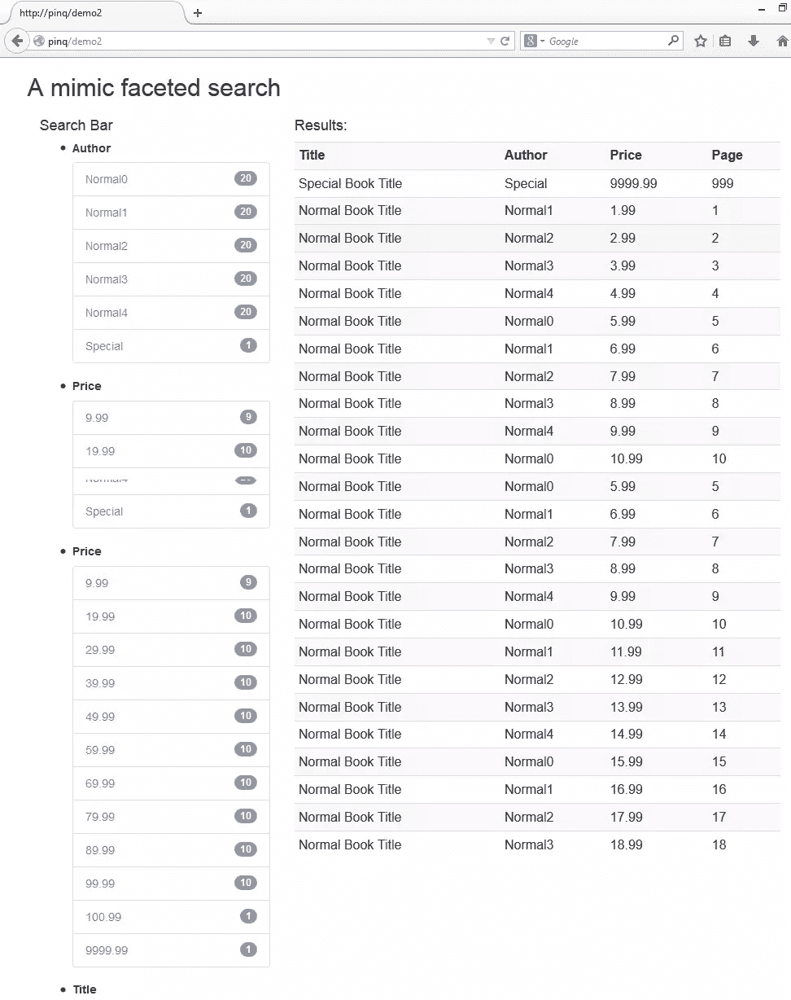

# PINQ–查询您的数据集–分面搜索

> 原文：<https://www.sitepoint.com/pinq-querify-datasets-faceted-search/>

在[第 1 部分](https://www.sitepoint.com/pinq-querify-datasets-introduction/?preview=1&_ppp=045412fef2)中，我们简要介绍了 PHP LINQ 端口 PINQ 的安装和基本语法。在本文中，我们将看到如何使用 PINQ 模仿 MySQL 的多面搜索特性。

在本系列中，我们不打算涵盖分面搜索的所有方面。有兴趣的人士可参考 Sitepoint 及其他互联网刊物发表的相关文章。

一个典型的分面搜索在网站中是这样工作的:

*   用户提供一个或几个关键词进行搜索。例如，“路由器”搜索在描述、关键字、类别、标签等中包含“路由器”的产品。
*   该网站将返回符合标准的产品。
*   该网站将提供一些链接来微调搜索。例如，它可能会提示某个路由器有不同的品牌，可能会有不同的价格范围和不同的功能。
*   用户可以通过单击提供的不同链接来进一步筛选结果，并最终获得更加定制的结果集。

分面搜索是如此流行和强大，你可以在几乎每一个电子商务网站上体验它。

不幸的是，刻面搜索还不是 MySQL 提供的内置特性。如果我们正在使用 MySQL，但也想为我们的用户提供这样的功能，我们该怎么办？

使用 PINQ，我们将看到有一种与使用其他 DB 引擎一样强大和简单的方法来实现这一点——至少在某种程度上是这样。

### 扩展第 1 部分演示

**注:**本部分和第 1 部分演示的所有代码都可以在[回购](https://github.com/taylorren/pinq)中找到。

在本文中，我们将扩展第 1 部分中展示的演示，并添加一些基本的分面搜索特性。

让我们从`index.php`开始，添加以下几行:

```
$app->get('demo2', function () use ($app)
{
    global $demo;
    $test2 = new pinqDemo\Demo($app);
    return $test2->test2($app, $demo->test1($app));
}
);

$app->get('demo2/facet/{key}/{value}', function ($key, $value) use ($app)
{
    global $demo;
    $test3 = new pinqDemo\Demo($app);
    return $test3->test3($app, $demo->test1($app), $key, $value);
}
);
```

我们刚刚在演示应用程序中创建了两条以上的路线(使用 Silex)。

第一个途径是将我们带到显示所有匹配我们的第一个搜索行为的记录的页面，即通过提供关键字进行搜索。为了简化演示，我们从示例`book_book`表中选择所有书籍。它还将显示结果集和分面链接，以便进一步导航。

第二条路线将我们带到另一个页面，该页面显示了在上述步骤中产生的结果集中与进一步的方面搜索标准相匹配的记录。它还会显示分面搜索链接。

在现实世界的实现中，在点击分面链接之后，结果页面中的任何分面过滤将被调整以反映结果数据集的统计信息。通过这样做，用户可以应用“附加”筛选，首先添加“品牌”,然后添加“价格范围”等。

但是在这个简单的演示中，我们将跳过这种方法，所有分面搜索和链接将只反映原始数据集上的信息。这是我们演示中的第一个限制和第一个需要改进的地方。

正如我们从上面的代码中看到的，真正的函数驻留在另一个名为`pinqDemo.php`的文件中。让我们看看提供分面搜索特性的相关代码。

#### 分面类

首先，我们创建一个类来表示一个方面。通常，方面应该具有一些属性:

*   它操作的数据(`$data`)
*   它分组的键(`$key`)
*   按键类型(`$type`)。它可以是下列之一:
    *   指定一个完整的字符串进行精确匹配
    *   指定字符串的一部分(通常是开头)以进行模式匹配
    *   指定一个值范围，以便按值范围进行分组
*   如果关键类型是范围，则需要指定一个值步长来确定范围的上/下限；或者如果键类型是部分字符串，我们需要提供一个数字来指定多少个首字母将用于分组(`$range`)

**分组**是刻面中最关键的部分。一个方面可能返回的所有聚合信息都取决于“分组”标准。通常，“完整字符串”、“部分字符串”和“值范围”是最常用的。

```
namespace classFacet
{
    use Pinq\ITraversable,
        Pinq\Traversable;

    class Facet
    {

        public $data; // Original data
        public $key; // the field to be grouped on
        public $type; // F: full string; S: start of a string; R: range;
        public $range; // Only valid if $type is not F

		...

        public function getFacet()
        {
            $filter = '';

            if ($this->type == 'F') // Full string 
            {
				...
            }
            elseif ($this->type == "S") //Start of string
            {
				...
            }
            elseif ($this->type == "R") // A value range
            {
                $filter = $this->data
                        ->groupBy(function($row)
                        {
                            return floor($row[$this->key] / $this->range) * $this->range;
                        })
                        ->select(function (ITraversable $data)
                {
                    return ['key' => $data->last()[$this->key], 'count' => $data->count()];
                });
            }

            return $filter;
        }
    }
}
```

在这个类中，关键的功能是根据数据和方面键属性返回方面结果集。我们注意到，对于不同类型的键，有不同的数据分组方式。在上面，我们已经展示了如果我们在由`$range`指定的步骤中按照一个值范围对数据进行分组，那么代码看起来会是什么样子。

#### 制作刻面并显示原始数据

```
public function test2($app, $data)
        {
            $facet = $this->getFacet($data);
            return $app['twig']->render('demo2.html.twig', array('facet' => $facet, 'data' => $data));
        }

		private function getFacet($originalData)
        {
            $facet = array();

            $data = \Pinq\Traversable::from($originalData);

            // 3 samples on constructing different Facet objects and return the facet
            $filter1 = new \classFacet\Facet($data, 'author', 'F');
            $filter2 = new \classFacet\Facet($data, 'title', 'S', 6);
            $filter3 = new \classFacet\Facet($data, 'price', 'R', 10);

            $facet[$filter1->key] = $filter1->getFacet();
            $facet[$filter2->key] = $filter2->getFacet();
            $facet[$filter3->key] = $filter3->getFacet();
            return $facet;
        }
```

在`getFacet()`功能中，我们执行以下步骤:

*   将原始数据转换成一个`Pinq\Traversable`对象，以便进一步处理。
*   我们创建 3 个方面。“author”方面将在字段`author`上分组，并且它是一个完整的字符串分组；字段`title`上的‘title’方面和部分字符串分组(起始的 6 个字母计算在内)；字段`price`上的“价格”方面和一个范围分组(步进为 10)。
*   最后，我们获取刻面并将它们返回给`test2`函数，以便模板可以呈现数据和刻面。

#### 显示面和过滤的数据

大多数情况下，facets 会显示为一个链接，将我们带到一个经过过滤的数据集。

我们已经创建了一个路线(`'demo2/facet/{key}/{value}'`)来显示分面搜索结果和分面链接。

该路由有两个参数，反映了我们所面对的键和该键的值。最终从该路径调用的`test3`函数摘录如下:

```
public function test3($app, $originalData, $key, $value)
        {
            $data = \Pinq\Traversable::from($originalData);
            $facet = $this->getFacet($data);

            $filter = null;

            if ($key == 'author')
            {
                $filter = $data
                        ->where(function($row) use ($value)
                        {
                            return $row['author'] == $value;
                        })
                        ->orderByAscending(function($row) use ($key)
                {
                    return $row['price'];
                })
                ;
            }
            elseif ($key == 'price')
            {
				...
            }
            else //$key==title
            {
                ...
            }

            return $app['twig']->render('demo2.html.twig', array('facet' => $facet, 'data' => $filter));
        }
```

基本上，根据键，我们应用与传入的值相对应的过滤(在`where`子句中的匿名函数),并获得进一步筛选的数据。我们还可以指定分面数据的顺序。

最后，我们在模板中显示数据(以及方面)。该路线呈现的模板与路线`'demo2'`使用的模板相同。

接下来，让我们看一下模板，看看 facet 链接是如何显示的。我使用 Bootstrap，所以这里使用的 CSS 组件应该很熟悉:

```
<div class="col col-md-4">
                <h4>Search Bar</h4>
                <ul>
                    
                        <li><h5><strong>{{k|capitalize}}</strong></h5></li>
                        <ul class="list-group">
                            
                                <li class="list-group-item"><span class="badge">{{vv.count}}</span><a href="/demo2/facet/{{k}}/{{vv.key}}">{{vv.key}}</a></li>
                            
                        </ul>
                    
                </ul>
</div>
```

我们必须记住，我们的应用程序生成的 facet 是一个嵌套数组。在第一层中，它是所有刻面的数组，在我们的例子中，我们总共有 3 个刻面(分别对应于`author`、`title`、`author`)。

对于每个方面，它都是一个“键-值”成对数组，这样我们就可以以传统的方式进行迭代。

请注意我们如何构建链接的 URIs。我们使用外循环的键(`k`)和内循环的键(`vv.key`)作为路由(`'demo2/facet/{key}/{value}'`)中的参数。按键计数(`vv.count`)用于触发模板中的显示(作为引导徽章)。

模板将呈现如下:




(第一个显示初始入口页面，第二个显示价格在 0 美元到 10 美元之间并按`author`排序的分面结果)

好了，到目前为止，我们已经成功地在我们的 web 应用程序中模拟了一个分面搜索功能！

在我们结束这个系列之前，我们将最后看一下这个演示，看看可以做些什么来改进它以及它的局限性是什么。

#### 有待改进的地方

总的来说，这是一个非常初级的演示。我们只是浏览了基本的语法和概念，并把它们锻造成一个可以运行的例子。正如我们前面看到的，有几个方面可以改进，使它更加灵活。

我们需要考虑提供“附加”标准搜索能力。我们当前的实现将方面搜索限制为仅应用于原始数据，而不是筛选的数据。这是我能想到的最重要的改进。

#### 限制

这里实现的分面搜索有一个根深蒂固的限制(对于其他分面搜索实现可能也是如此):

我们每次都从 MySQL 服务器检索数据。

这个应用程序使用 Silex 作为框架。对于任何像 Silex、Symfony、Laravel 这样的单入口框架，每当要分析一条路径和调用一个控制器的功能时，它的`index.php`(或`app.php`)都会被调用。

查看我们的`index.php`中的代码，我们会发现这也意味着下面一行代码:

```
$demo = new pinqDemo\Demo($app);
```

每次显示应用程序中的页面时都会调用，这意味着每次都会执行以下行:

```
class Demo
    {

        private $books = '';

        public function __construct($app)
        {
            $sql = 'select * from book_book order by id';
            $this->books = $app['db']->fetchAll($sql);
        }
```

如果我们避免使用框架是否会更好？嗯，除了开发一个没有框架的应用程序不是一个好主意这一事实之外，我们还面临着同样的问题:从一个 HTTP 调用到另一个 HTTP 调用，数据(和状态)不是持久的。这是 HTTP 的根本特征。这应该通过使用缓存引擎来避免。

当我们构造方面时，我们确实保存了一些在服务器端执行的 SQL 语句。我们没有用同一个`where`语句传递 1 个`select`查询和 3 个不同的`group by`查询，而是用`where`语句发出一个`select`查询，并使用 PINQ 提供聚合信息。

### 结论

在这一部分中，我们设法为我们的图书收藏站点模拟了一个 facet 搜索功能。正如我所说的，这仅仅是一个可以运行的演示，有很大的改进空间和一些默认的限制。让我们知道你是否建立在这个例子上，并能向我们展示一些更高级的用例！

PINQ 的作者现在正在开发下一个主要版本(版本 3)。我真的希望它能变得更强大。

欢迎在下面留下你的评论和想法！

## 分享这篇文章