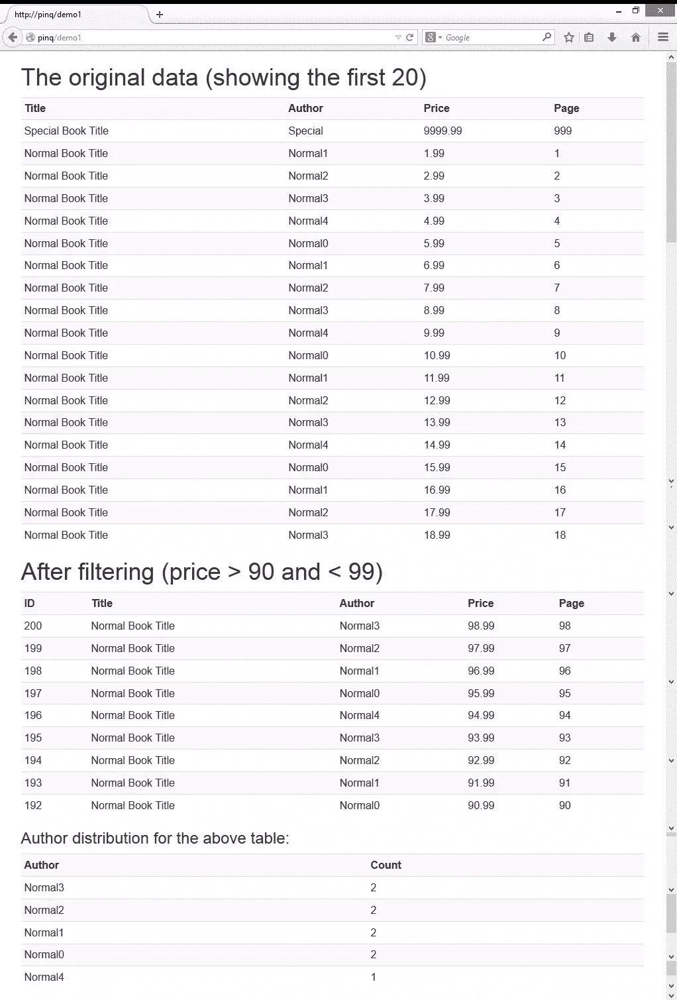

# PINQ–查询您的数据集–简介

> 原文：<https://www.sitepoint.com/pinq-querify-datasets-introduction/>

你可能听说过 [LINQ](http://msdn.microsoft.com/en-us/library/bb397926.aspx) (语言集成查询)，这是“Visual Studio 2008 中引入的一组功能，将强大的查询功能扩展到 C#和 Visual Basic 的语言语法”。

它提供了必要的接口和语法来对给定的数据集执行各种查询，从而可以执行过滤、排序、分组、聚合等操作。

PINQ (PHP 集成查询)是“基于。NET 的 Linq，并将跨数组/迭代器和外部数据源的查询统一在一个简单易读的流畅 API 中。(摘自 [PINQ 官网](http://timetoogo.github.io/Pinq/))

### 为什么是另一种查询语言？

PHPers 非常擅长使用原始 SQL 语句或通过 ORM 执行查询。我们从数据库中选择数据，对其进行处理，并以选定的格式(比如表格)显示出来。如果我们需要另一组数据，我们发出另一个语句，处理返回的数据集并显示它。

在正常情况下，这个过程既充分又有效。

但是在有些情况下，这个过程根本行不通。以一个典型的电子商务网站为例。用户输入一个搜索关键词(比如“路由器”)，网站就会显示所有匹配的项目。初始搜索可能只搜索其描述、类别或标签包含关键字的项目。接下来，用户将开始通过选择品牌、价格范围等来微调搜索结果。

这种微调过程称为“分面”搜索。一些数据库引擎(如 SOLR)内置了这种功能(如本系列文章所述:[使用 Solarium 进行 SOLR 搜索](https://www.sitepoint.com/series/using-solarium-for-solr-search/)),但显然 MySQL 没有这种功能。

然而，这并不意味着 MySQL 不能提供这样的特性。毕竟，这都是关于构造一个新的 SQL 语句并再次获取数据。然而，这也有一些缺点:

1.  SQL 语句的标准，即“where”和/或“group by”部分，在 SQL 构造之后会变得非常复杂。
2.  由于 SQL 语句将非常动态，它不能被优化，并且将使索引更加困难。
3.  当将 SQL 语句传送回数据库服务器时，会产生巨大的开销。

在这些情况下， [PINQ](http://timetoogo.github.io/Pinq/) 可能会派上用场。这是一个 PHP 版本的 LINQ 库，提供了对给定数据集的过滤、排序、分组、聚合和索引。

### 准备

在这个由两部分组成的系列中，我们将演示如何使用 PINQ 来模拟“分面”搜索。我们将使用样本图书收集应用程序的数据(关于如何转储样本数据，请参见 Symfony2 中的 [Data Fixtures ),但稍作修改。](https://www.sitepoint.com/data-fixtures-symfony2/)

此外，我们将使用 [Silex](http://silex.sensiolabs.org/) ，一个非常轻量级的 PHP 框架和 [Bootstrap](http://getbootstrap.com/) CSS 来简化应用程序的设置。请按照他们各自网站上关于如何设置 Silex web app 和集成 Bootstrap CSS 的说明进行操作。

我们在这个演示中使用的样本数据稍加修改，我已经将它上传到[这个演示的 repo】。源代码也可以在那里找到。](https://github.com/sitepoint-examples/pinq)

### PINQ 安装

推荐的 PINQ 安装是修改 Silex 附带的`composer.json`文件，并在其`require`部分增加一行:

```
{
    "require": {
        "silex/silex": "~1.1",
        "twig/twig": ">=1.8,<2.0-dev",
        "doctrine/dbal": "2.2.*",
        "symfony/twig-bridge": "~2.3",
        "timetoogo/pinq": "~2.0"
    }
}
```

请注意，我还添加了一些依赖项:Twig(和 Twig-Bridge)来显示结果，以及 Doctrine as I 从数据库中获取数据以进行进一步处理。

在这之后，我们可以运行一个`composer.phar update`命令来安装所有必需的包。

### 演示 1:基本用法

我们将首先展示几行代码来演示 PINQ 的基本用法。我将按原样抓取书籍，做一个简单的过滤(价格在 90 到 99 之间),然后显示不同作者的汇总信息。

显示将如下所示:



让我们来看看如何制作这个演示页面。

**注意:**我不打算在这篇文章中讲述 Silex 应用程序设置的基础知识。Silex 的默认`index.php`不包括对 Twig/Twig-bridge 和 Doctrine-DBAL 的支持。您需要在应用程序的`index.php`文件中启用这两个模块。请参考 Silex 的官方网站了解如何操作。

我们首先在`pinqDemo.php`中创建一个`Demo`类，作为我们应用程序的数据提供者:

```
<?php

namespace pinqDemo
{

    class Demo
    {

        private $books = '';

        public function __construct($app)
        {
            $sql = 'select * from book_book order by id';
            $this->books = $app['db']->fetchAll($sql);
        }

        public function test1($app)
        {
            return $this->books;
        }

    }

}
```

这个文件非常简单。在类声明中，我们有一个从 db 服务器检索数据的构造函数和一个将数据集返回给调用函数的函数。

这个类当然可以被增强，例如，通过引入一些典型的设计模式。

接下来，我们将转到`index.php`文件，看看在我们检索的数据上应用的一些基本 PINQ 用法。

```
// Excerpt of index.php
use Pinq\ITraversable,
    Pinq\Traversable;

... ...

$app->get('/demo1', function () use ($app)
{
    global $demo;
    $books = $demo->test1($app);
    $data = Traversable::from($books);

    //Apply first filter
    $filter1 = $data
            ->where(function($row)
            {
                return $row['price'] > 90 && $row['price'] < 99;
            })
            ->orderByDescending(function($row)
    {
        return $row['id'];
    });

    $filter2 = $filter1
            ->groupBy(function($row)
            {
                return $row['author'];
            })
            ->select(
            function(ITraversable $filter1)
    {
        return ['author' => $filter1->first()['author'], 'count' => $filter1->count()];
    }
    );

    return $app['twig']->render('demo1.html.twig', array('orig' => $data, 'filter1' => $filter1, 'filter2'=>$filter2));
}
);
```

我们将 URI `/demo1`映射到第一个样本。在这条路线的处理功能中，我们主要做 4 件事:

1.  从我们的`pinqDemo\Demo`类中获取数据
2.  应用第一个过滤器。在我们的例子中，我们对原始数据应用一个价格范围
3.  对步骤 2 中生成的数据应用另一个操作(分组)。
4.  显示步骤 2 和 3 中生成的数据。

#### 深入了解 PINQ 相关陈述

最重要的是，如果我们要使用 PINQ，我们需要提供一个数据集。

在 PINQ 的术语中，要操作的数据集是“可遍历的”。正如所料，我们可以从 SQL 查询返回的数据集构造一个“可遍历的”:

```
$data = Traversable::from($books);
```

为了对新创建的“可遍历”对象应用操作——我将从“数据集”开始使用——PINQ 提供了一组丰富的函数:

*   过滤，`where`子句；
*   排序，如`orderByAscending`和`orderByDescending`子句；
*   分组，`groupBy`子句；
*   聚合，如`count`、`average`子句；
*   选择，在结果数据集中选择和/或构造字段，如`select`子句；
*   还有的喜欢加盟等。

完整的 API 参考可以在 PINQ 的官方文档网站中找到。

在我们的`demo1`中，我们应用的第一个操作是过滤和排序:

```
$filter1 = $data
            ->where(function($row)
            {
                return $row['price'] > 90 && $row['price'] < 99;
            })
            ->orderByDescending(function($row)
    {
        return $row['id'];
    });
```

PINQ 使用闭包和匿名函数等高级 PHP 特性来执行这些任务。

该语法与我们使用 ORM 时看到的语法非常相似:命令可以链接起来，每个命令都继续链接到下一个命令。

这与 ORM 的主要区别在于:

1.  我们不是在数据库连接或“实体管理器”上操作，而是直接在数据集上操作
2.  过滤标准(和其他函数)不是用类似 SQL 的语法表达的，而是用 PHP

在我们应用了过滤器(这是一个`where`子句)之后，我们还通过`id`按照降序对过滤后的数据进行了排序。

如果您使用与我相同的样本数据，那么结果数据集(`$filter1`)将包含 9 条记录，它们将显示在最终呈现页面的第二部分，如上所示。

PINQ 的卖点之一是生成的数据集可以重复使用。这为我们提供了在同一数据集上应用多种操作的灵活性，但提供了不同的子数据集和/或聚合信息，而不会破坏原始数据集。

在上面的示例代码中，在应用了第一个过滤器之后，我们立即执行聚合工作，以找出有多少不同的作者以及他们写了多少本书:

```
$filter2 = $filter1
            ->groupBy(function($row)
            {
                return $row['author'];
            })
            ->select(
    function(ITraversable $filter1)
    {
        return ['author' => $filter1->first()['author'], 'count' => $filter1->count()];
    }
    );
```

`groupBy`函数很熟悉，但是`select`函数需要更详细的描述。

对于典型的`group by`聚合，我们期望从执行中返回至少两个值:一个是用于分组的键(`author`)和与该键相关的聚合信息(`count`)。

因此，`function(ITraversable $filter1)`中的上述语句从每个组的第一条记录中选择`author`值，并计算该组的计数。这正是我们所需要的。

结果显示在页面的底部，如上所示:在过滤的总共 9 本书中，作者 0/1/23 各有 2 本书，作者 4 有 1 本书。

如果我们想在这个分组中显示总价，我们可以进一步扩展`select`函数语句:

```
->select(
    function(ITraversable $filter1)
    {
        return
		 ['author' => $filter1->first()['author'],
 		  'count' => $filter1->count(),
		   'sum'=>$filter1->sum(
				function($row)
                {
                    return $row['price'];
                }
           )
           ];
    }
    )
```

匿名函数被嵌入并返回正确的结果。

然后，我们可以将另一个`orderByAscending`链接到`select`语句，按照`sum`对数据集进行排序:

```
->orderByAscending(function($row){return $row['sum'];});
```

这是非常方便和一致的。

有些人可能会认为，在上面的`groupBy`和`select`语句中，使用的语法可能不够直观。比方说，为什么不使用下面更简单的语法呢？

```
groupBy(function(return $row['author'];), $filter1->count());
```

嗯，作者回答说，这样的分组是不可能的。而在 PINQ 目前的版本(2.1)中，我的做法是最好的。然而，作者在给我的回复中暗示，在 PINQ (3.0)的下一个主要版本中，将为这样一个常见的任务引入一个改进的语法，即，通过一个键进行分组，并获得各自的聚合信息。让我们继续关注它。

### 结论和前进

在本文中，我们简要介绍了 PINQ 的基本功能以及如何在 web 应用程序中使用它。

PINQ 正在大量开发中，因此它的文档还没有完全准备好。几乎所有的功能都缺乏扎实实用的论证。我希望这篇文章能在这个意义上有所帮助，但是我也希望 PINQ 的作者也能在文档方面下点功夫。

在接下来的文章中，我将尝试说明如何使用它来模拟一种“多面”搜索功能。

欢迎评论并给我们你的想法！

## 分享这篇文章