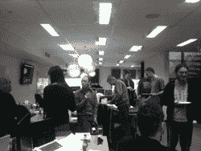

# 微软网络平台上的披萨、啤酒和 PHP

> 原文：<https://www.sitepoint.com/pizza-beer-and-php-on-microsoft-web-platform/>

对于 SitePoint 社区来说，过去的一周是忙碌的一周，但并没有忙到我不能在周五抽出一些时间和我的同事一起吃披萨和喝啤酒。这可能会让那些知道我在新西兰远程工作的人感到惊讶，但由于技术的发展，距离不再是一个障碍。我们的办公室经理弗林安排将比萨饼送到我的住处，我们通过 Skyped 进入办公室。我有点担心我的孩子似乎有多喜欢披萨。看看这个…

墨尔本办公室

SitePoint 论坛在人员配备方面发生了一些重大变化。我很高兴向你们介绍两位新的团队领导。[请和我一起祝贺 Mittineague 和 Paul O'B](https://www.sitepoint.com/forums/showthread.php?t=701145) 分别在编程和设计团队中担任新职务。Dave Maxwell 已经离开设计部门，接管发展和管理团队。

当我们谈到论坛的主题时，本周我们的

奥克兰办事处

[Software Personification Contest](https://www.sitepoint.com/forums/showthread.php?t=701024) into it’s second (and final) week. This one should be good for a laugh. If you’re creative, why not give it a shot. Hell, why not give it a shot anyway?

我们最新的分论坛上周迎来了一位来自微软马克·布朗的嘉宾。Mark 走进微软 Web 平台上的 [PHP，回答您关于在微软平台上配置和运行 PHP 应用程序的问题。如果你上周没见到他，下个月他会再来的。](https://www.sitepoint.com/forums/forumdisplay.php?f=382)

本周我们脸书粉丝页面上的讨论都是关于我们的系统管理员 Adam Bolte 的。Adam 解释了他的工作需要什么，以及他如何利用 IaaS 来完成这项工作。下周标志着九月份*了解我们*活动的结束，我们将根据 Kev、Mal 和 Adam 在过去一个月中提供的信息进行一次小测验。你可以拿一本我们即将发行的书《在云中托管你的网站》。

本周的最后一项提醒大家，2010 年的投票。网络杂志奖几周后结束。我们被提名为**年度社区网站**和**年度播客**。请务必投下您的一票(不，不一定是我们)。

**本周热点话题**

你是如何组织你的 CSS 的？这是现在我们 [CSS 论坛](https://www.sitepoint.com/forums/forumdisplay.php?f=53)中每个人都在谈论的问题。让我们听听你的方法。

在[中。网络论坛](https://www.sitepoint.com/forums/forumdisplay.php?f=141)有一个有趣的主题叫做‘万金油’。顾名思义，讨论围绕的是你是否应该专注于一门语言或编程领域，或者[是否对所有事情都略知一二更通用。](https://www.sitepoint.com/forums/showthread.php?t=701448)

[对于想成为高级开发人员的网页设计师，你会推荐什么书](https://www.sitepoint.com/forums/showthread.php?t=700298)？如果你认为你能帮上忙，去[问题论坛](https://www.sitepoint.com/forums/showthread.php?t=700298)。

最后， [Javascript](https://www.sitepoint.com/forums/forumdisplay.php?f=15) 极客们正在谈论[巨型下拉菜单](https://www.sitepoint.com/forums/showthread.php?t=702268)(这将成为一个伟大的恐龙名字)。

无论如何，我正在和感冒做一场艰苦的战斗，所以我需要睡觉。保重。

## 分享这篇文章