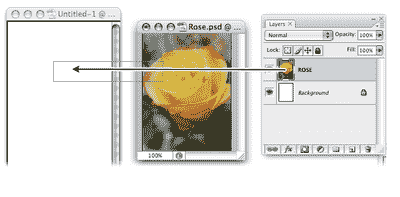
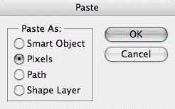
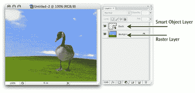
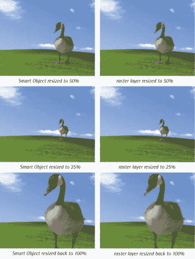

# 将图形放入 Photoshop 文件中

> 原文：<https://www.sitepoint.com/placing-graphic-photoshop-file/>

通常，您会希望将现有的图形和插图导入到 Photoshop 文档中。Photoshop 的问题？一点也不——事实上，有几种方法可以做到这一点！

外部图形可以作为光栅图层或智能对象放入 Photoshop 中。在这个解决方案中，我将向你展示如何放置这些图形，然后我们将讨论光栅图层和智能对象之间的区别。

##### 解决办法

 *从网页中复制图稿，然后选择“编辑”>“粘贴”或按 Ctrl-V(在 Mac 上按 Command-V)将其粘贴到 Photoshop 文档中。Photoshop 将创建一个包含图稿的新图层，或者将其放入选定的空白图层中。艺术品将位于栅格图层上。

***从展平的图像文件中置入图稿***

展平的图像文件(如 GIF、JPEG 或 PNG)在单个图层上包含图稿。在 Photoshop 中打开文件，并使用“选择”>“全部”或按 Ctrl-A (Command-A)来创建整个文档的选区。单击您的 Photoshop 文档，然后选择“编辑”>“粘贴”或按 Ctrl-V (Command-V)来粘贴它。Photoshop 会将文档粘贴到一个新的或选定的空图层中，就像从网页中粘贴图稿一样。艺术品将位于栅格图层上。

***放置不同 Photoshop 文档中的图层***

定位文档窗口，使两个窗口都可见。选择要从中导入的文档的窗口，以显示其图层面板。选择并拖动必要的层到新窗口，当你看到窗口周围有一个粗黑的轮廓时，松开鼠标按钮。这将复制层，如下一页顶部的例子所示。复制的层将保留其原始属性。

***放置插画师*的作品**

打开 Illustrator 并选择要导出到 Photoshop 的图稿。使用 Ctrl-C 复制插图。在 Illustrator 仍然打开的情况下切换到 Photoshop，并使用 Ctrl-V (Command-V)粘贴复制的图稿。将出现一个对话框，询问您是否希望将图稿粘贴为智能对象、像素、路径或形状图层。

***将图稿放置为智能对象***

选择“文件”>“置入”,然后选择要导入的文件。单击“置入”将文件作为智能对象导入到 Photoshop 文档中。对于 PDF 和 Illustrator 文件，Photoshop 将显示一个对话框，要求您选择要放置的页面。选择您想要的页面，然后单击“确定”。

智能对象最初将被放置在一个包围它的边界框中，如下所示。您可以使用此边界框来移动、旋转、缩放或对对象进行其他变换。完成后，在边框内双击，将智能对象提交到其图层。

##### 讨论

***智能物体***

智能对象是一种嵌入文件，出现在 Photoshop 中它自己的图层中。智能对象图层通过一个图标来区分，该图标覆盖在“图层”调板中显示的缩略图图像上，如下例所示。

智能对象不同于其他图层，因为它们链接到源文件(例如，Illustrator 文件、JPEG、GIF 或其他 Photoshop 文件)。如果您对源文件进行了更改，智能对象层也将随着这些更改而更新。

相比之下，栅格图层(或常规图层)是完全可编辑的，因此您可以在其上绘图、涂色、填充颜色或擦除像素。与保留图像质量的智能对象不同，如果缩小栅格图层的大小，将会丢失信息。

下一页的示例演示了这一点，该示例显示了缩小智能对象的大小，然后将其调整回原始尺寸的结果。将相同的步骤应用于栅格图层时，会产生模糊且质量较低的图像。

因为智能对象链接到外部文档，所以您可以调整它们的大小，而不会丢失原始图像数据。虽然您可以将图层效果和一些变换应用到智能对象图层，但您实际上不能操纵(绘画、绘制、擦除)它们的像素，因为它们不能从外部文档中编辑。双击智能对象图标，可以打开原始源文件进行编辑。

***栅格化***

您可以通过右键单击智能对象图层的名称并选择“栅格化图层”来栅格化智能对象。这将断开与原始源文件的链接，并将该图层视为普通栅格图层。* 

## *分享这篇文章*