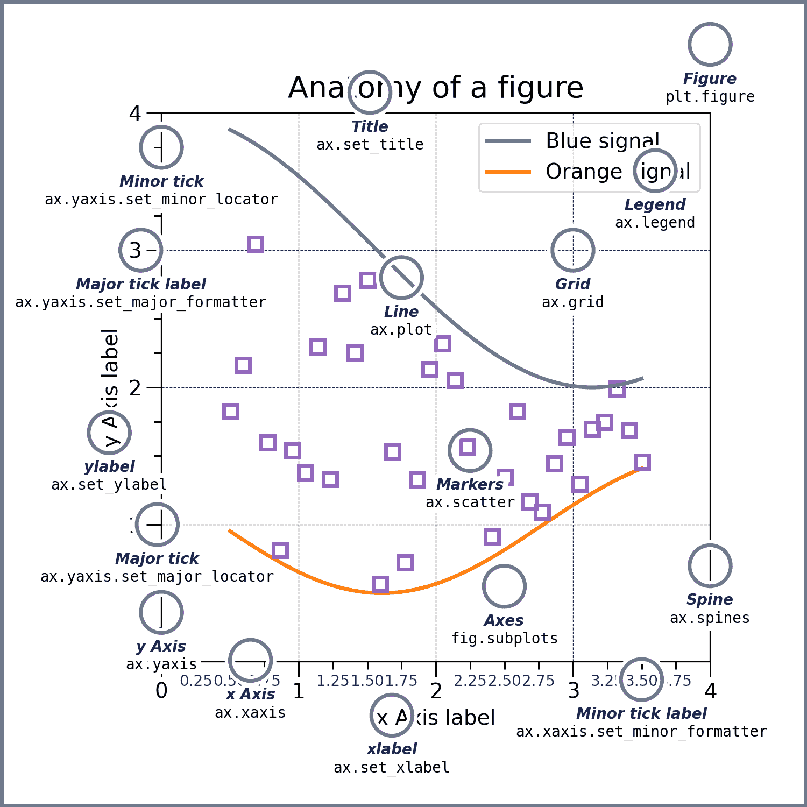
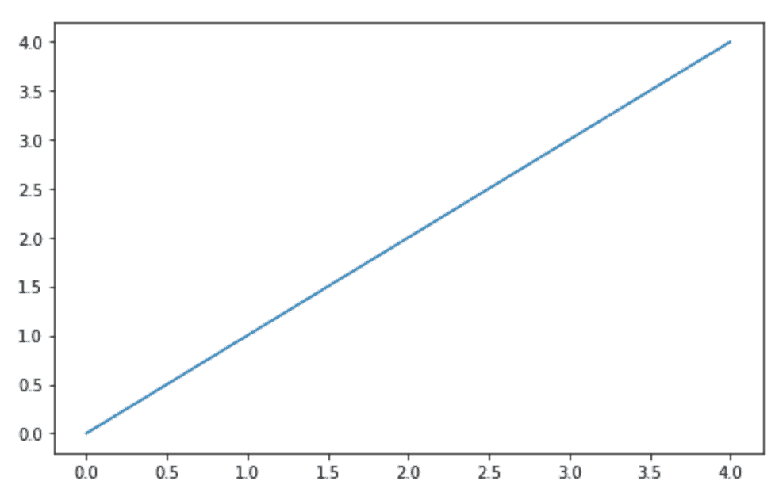
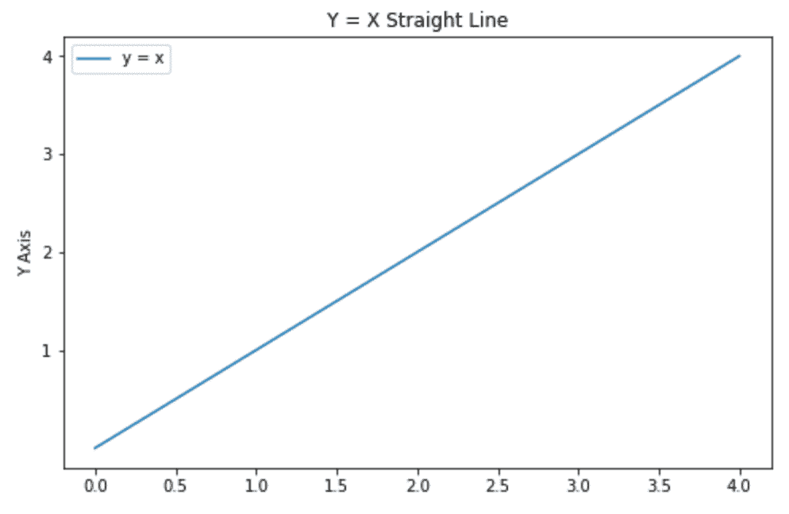
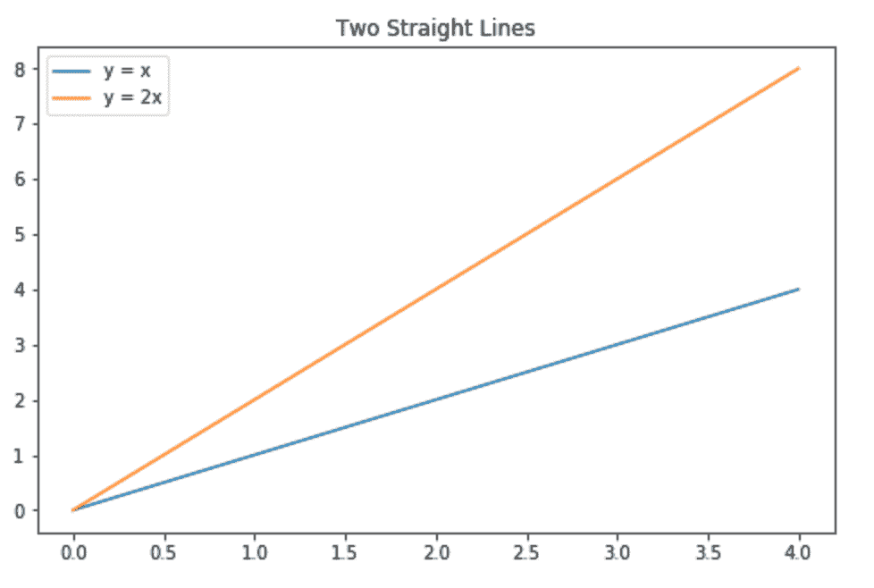
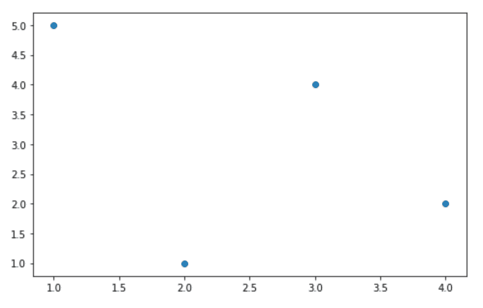

# 如何用 Matplotlib 在 Python 中绘制图表

> 原文：<https://www.sitepoint.com/plot-charts-python-matplotlib/>

你每天都会产生大量的数据。数据分析的一个关键部分是可视化。在过去的几年中，已经开发了各种各样的绘图工具。鉴于 Python 作为数据分析语言的流行程度，本教程重点介绍使用流行的 Python 库 Matplotlib 创建图表。

Matplotlib 是一个巨大的库，对于初学者来说可能有点难以理解——即使你对 Python 相当熟悉。虽然使用几行代码生成一个图很容易，但是理解这个库的后端到底发生了什么可能很困难。本教程解释了 Matplotlib 的核心概念，以便人们可以探索其全部潜力。

我们开始吧！

## 先决条件

我们将在本教程中用来创建图表的库是 Python 的`matplotlib`。这篇文章假设你使用的是版本`3.0.3`。要安装它，在终端中运行下面的`pip`命令。

```
pip install matplotlib==3.0.3 
```

要验证已安装的库的版本，请在 Python 解释器中运行以下命令。

```
>>> import matplotlib
>>> print(matplotlib.__version__)
'3.0.3' 
```

如果你正在使用 Jupyter 笔记本，你可以使用下面的[魔法命令](https://ipython.readthedocs.io/en/stable/interactive/magics.html)显示 Matplotlib 图形。

```
%matplotlib inline 
```

### Pyplot 和 Pylab:一个注释

在其开发的初始阶段，Mathworks 的 MATLAB 影响了 Matplotlib 的创建者 John Hunter。MATLAB 和 Python 中命令的使用有一个关键区别。在 MATLAB 中，所有的函数都可以在顶层使用。本质上，如果你从`matplotlib.pylab`导入所有东西，像`plot()`这样的函数就可以使用了。

这个特性对于那些习惯了 MATLAB 的人来说很方便。但是，在 Python 中，这可能会与其他函数产生冲突。

因此，使用`pyplot`源是一个很好的做法。

```
from matplotlib import pyplot as plt 
```

`plot()`等所有功能在`pyplot`内可用。您可以在导入之前使用`plt.plot()`后使用相同的`plot()`功能。

## 剖析 Matplotlib 图

Matplotlib 文档描述了[图](https://matplotlib.org/examples/showcase/anatomy.html)的结构，这对于理解库的各种特性是必不可少的。


[来源](https://matplotlib.org/_images/anatomy.png)

Matplotlib 图的主要部分如下:

*   图:完整地块及其各部分的容器
*   标题:情节的标题
*   轴:X 轴和 Y 轴(有些图可能还有第三个轴！)
*   图例:包含每个地块的标签

在 Matplotlib 中，一个情节的每个元素都可以被操纵，我们将在后面看到。

不再拖延，让我们创造我们的第一个情节！

## 创造一个情节

创造一个情节并不是一件困难的事情。首先，导入`pyplot`模块。虽然没有约定俗成，但一般都是以简称& mdash `plt`的形式进口。使用`.plot()`方法，并提供一个数字列表来创建一个情节。然后，使用`.show()`方法显示绘图。

```
from matplotlib import pyplot as plt
plt.plot([0,1,2,3,4])
plt.show() 
```



请注意，默认情况下，Matplotlib 会创建一个线图。提供给`.plot()`方法的数字被解释为创建绘图的 y 值。这里是[关于`.plot()`方法](https://matplotlib.org/3.1.0/api/_as_gen/matplotlib.pyplot.plot.html)的文档，供你进一步探索。

既然您已经成功地创建了您的第一个图，让我们探索在 Matplotlib 中定制您的图的各种方法。

## 自定义绘图

让我们讨论一下 Matplotlib 图中最流行的定制。这里讨论的每个选项都是`pyplot`的方法，您可以调用它们来设置参数。

*   `title`:设置图表的标题，作为参数传递。
*   `ylabel`:设置 Y 轴的标签。`xlabel`可用于设置 X 轴的标签。
*   `yticks`:设置在 Y 轴上显示哪些刻度。`xticks`是在 X 轴上显示刻度的相应选项。
*   `legend`:显示图上的图例。`.legend()`方法的`loc`参数设置图例在图上的位置。`loc`参数的`best`选项让 Matplotlib 决定图例在图形上的最小干扰位置。

让我们在绘图中使用这些选项。

```
plt.plot([0,1,2,3,4], label='y = x')
plt.title('Y = X Straight Line')
plt.ylabel('Y Axis')
plt.yticks([1,2,3,4])
plt.legend(loc = 'best')
plt.show() 
```

下面是上面代码的输出。请注意，图中出现了一个标题，Y 轴标有标签，Y 轴上的刻度数少于 X 轴上的刻度数，并且在左上角显示了一个图例。



在修补了一个地块的基本选项之后，让我们在同一个图形中创建多个地块。让我们试着在图中画两条直线。

为此，对不同的数据集使用两次`.plot()`方法。您可以使用`.plot()`方法的`label`参数为每个线图设置标签，以使代码更短。

```
plt.plot([0,1,2,3,4], label='y = x')
plt.plot([0,2,4,6,8], label='y = 2x')
plt.title('Two Straight Lines')
plt.legend(loc = 'best')
plt.show() 
```



接下来，让我们尝试创建一个不同类型的情节。要在 XY 平面上创建点的散点图，使用`.scatter()`方法。

```
plt.scatter([1,2,3,4], [5,1,4,2])
plt.show() 
```

这是散点图的样子。



可以在 Matplotlib 上创建许多其他图。你可以使用`.hist()`方法创建一个[直方图](https://matplotlib.org/3.1.0/api/_as_gen/matplotlib.pyplot.hist.html)。您可以使用`.subplot()`方法[向图形](https://matplotlib.org/3.1.0/api/_as_gen/matplotlib.pyplot.subplot.html#matplotlib.pyplot.subplot)添加多个图。你甚至可以使用`pyplot` 的 [`path`模块创建矢量路径。](https://matplotlib.org/3.1.0/api/path_api.html#module-matplotlib.path)

## 使用 Matplotlib 导出图

在使用 Matplotlib 创建地块时探索了各种选项之后，下一步是导出您已经创建的地块。要将图形保存为图像，可以使用`.savefig()`方法。应该将带有文件路径的文件名作为此方法的参数提供。

```
plt.savefig('my_figure.png') 
```

虽然[`savefig`](https://matplotlib.org/api/_as_gen/matplotlib.pyplot.savefig.html)的文档列出了各种参数，但下面列出了两个最重要的参数:

*   `dpi`:该参数用于设置最终图像的分辨率，单位为 DPI(每英寸点数)。
*   `transparent`:如果设置为 True，图形的背景是透明的。

虽然上面的代码保存了一个图形，但是您可能需要在同一个文件中保存多个图形。Matplotlib 允许您使用`PdfPages`类将多个图形保存到一个 PDF 文件中。创建包含多个图的 PDF 文件的步骤如下:

*   首先，从`matplotlib.backends.backend_pdf`导入`PdfPages`类，并将其初始化为一个空的 PDF 文件。
*   使用`.figure()`类初始化一个图形对象并创建绘图。一旦创建了图形，使用`PdfPages`类的`.savefig()`方法保存图形。
*   添加完所有图形后，使用`.close()`方法关闭 PDF 文件。

为了总结这个过程，下面的代码片段用我们上面创建的两个图创建了一个 PDF。

```
from matplotlib.backends.backend_pdf import PdfPages
pdf = PdfPages('multipage.pdf')

fig1 = plt.figure()
plt.plot([0,1,2,3,4])
plt.close()
pdf.savefig(fig1)

fig2 = plt.figure()
plt.plot([0,2,4,6,8])
plt.close()
pdf.savefig(fig2)

pdf.close() 
```

## 结论

在本教程中，我们用 Python 和`matplotlib`库创建了绘图。我们讨论了理解 Matplotlib 如何工作需要知道的概念，并着手创建和定制真实的绘图。我们还向您展示了如何导出您的绘图以用于真实场景，如报告和演示。

你是如何用 Python 创作情节的？请在下面的评论中告诉我们。

## 分享这篇文章