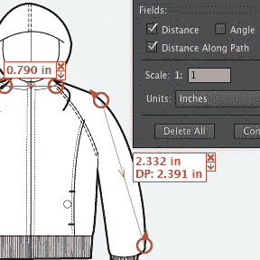
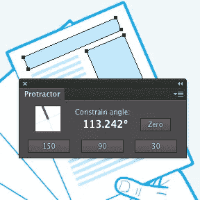
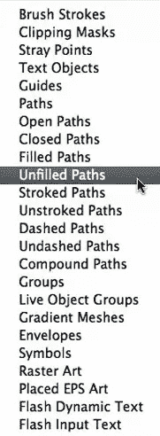
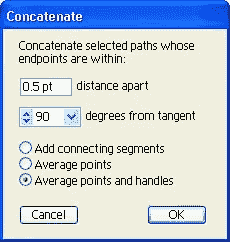
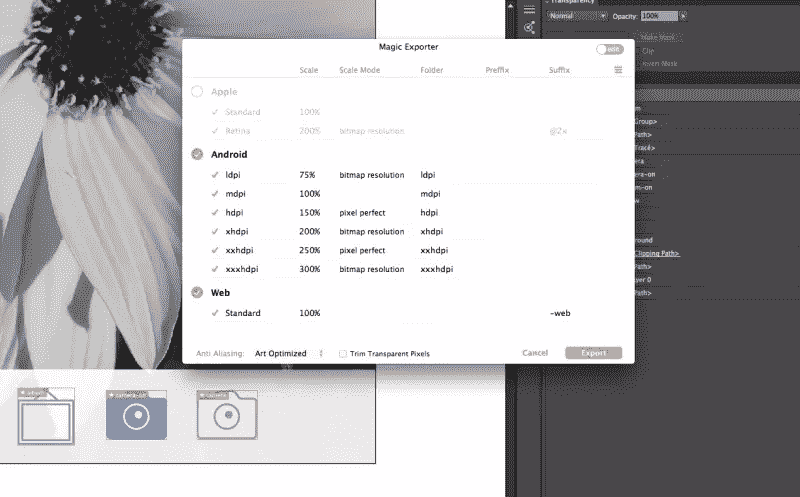

# Adobe Illustrator 的 5 个最佳生产力插件

> 原文：<https://www.sitepoint.com/plugins-for-adobe-illustrator/>

多年来，Adobe Illustrator 一直是开发矢量图形最流行的应用程序。就像许多强大的工具一样，它总是伴随着某种学习曲线。

幸运的是，有一些有用的插件可以帮助我们加快工作流程。虽然 Illustrator 不能像 Photoshop 一样拥有丰富的插件生态系统，但你的工具箱中仍然有非常值得一提的东西。

同样值得注意的是，SVG 在过去两年中的稳步上升也将 Illustrator 牢牢地推回到许多 web 开发人员的脑海中。

在这篇文章中，我将向你展示 5 个插件，它们将通过改进常见操作来节省你的大量时间。

我们开始吧。

## 向量划线 2

我们要分析的第一个插件是“Vector Scribe 2”，由机敏图形公司开发。它不仅为您带来了一套新的工具，还增强了 Illustrator 的现有功能，为您提供了更强大的开发和编辑图形元素的手段。

在这些新功能中，您可以找到:

*   智能删除画笔工具:一个画笔，只需在路径上移动鼠标，就可以自动删除无用的锚点。
*   路径扩展工具:这个工具可以让你以非常高的精度将路径扩展或缩减到精确的长度。
*   动态角工具:这个工具允许你用有限的控制将方形角转换成圆形角。
*   动态形状工具:此功能可识别最常见的路径形状，如正方形、圆形或星形，并使您能够控制点数或修改形状。
*   动态测量工具:一个强大的工具，可用于以不同的测量单位进行极其精确的长度或角度测量。
*   Protactor:这是一个非常简单但有用的工具，用于为你的绘图定义自定义角度。

Vector Scribe 可以让您自动完成许多您一直手工完成的过程。使用矢量或创建新字体变得比以前容易得多，最重要的是，速度更快。

我当然是个粉丝，我怀疑一旦你用了一段时间 Vector Scribe 2，你就离不开它了。

该插件既适用于 Windows，也适用于 MacOS，售价均为 79 美元。

**下载链接:**【http://www.astutegraphics.com/ 

## 选择菜单

选择菜单是一个节省时间的插件，由 Rick Johnson 开发。它为您的“选择”下拉菜单增加了 18 个 Illustrator 基本版本中没有的额外功能。

起初，您可能不太清楚 Illustrator 的默认设置中缺少哪些选择类型，但实际上“选择菜单”肯定会为您节省大量时间。

通常，您可能只需要从您的项目中选择“开放的路径”或者“封闭的誓言”。当然，您可以手动完成这项工作，但在复杂的插图中，这可能需要相当大的努力。问题是，在“选择”菜单中，Illustrator 无法确定开放路径和封闭路径之间的区别。

但是，使用“选择菜单”,您将能够轻松地选择参考线、填充、开放甚至取消描边的路径以及路径上的许多其他变体。此外，只需点击几下鼠标，您就可以选择要选择的内容。

这对于自动转换器生成的一些杂乱的线条特别有用。

考虑到所有的事情，很明显“选择菜单”足够有用，可以在任何矢量设计者的工具箱中获得一席之地。更令人印象深刻的是，该插件可以免费下载，并且可以在 Windows 和 Mac OS 上运行。

**下载链接:**【http://rj-graffix.com/software/plugins.html 

## 连锁的

我们要关注的下一个插件是“Concatenate ”,和上一个插件一样，是由 Rick Johnson 创建的。

“Concatenate”有一个简单的概括:为您提供将两条或多条不同路径连接成一条唯一路径的能力。

执行此操作时，您可以精确设置这些路径的端点应该有多近，以便组合它们，以及这些点需要有多接近切线。

“连接”与其他类似插件的区别在于，它还具有“同化”和“连接”功能。

第一种方法有助于定位和连接距离某一点固定距离内的任何未选择的路径。第二个功能是添加线段，以连接选定的开放路径。

Rick 再次免费向我们提供了“Concatenate ”,因此我建议您获取一份副本——特别是如果您使用 Illustrator 处理导入的 EPS 文件。

**下载链接:**【http://www.rj-graffix.com/software/plugins.html 

## 魔法出口商

“Magic Exporter”是由 Jeremy Marchand 开发的一个插件，旨在简化从 Illustrator 向 web 就绪的 PNG 文件导出插图的过程。

设计师很容易在导出对象时浪费宝贵的时间，因为他们必须手动切片或隐藏层，以便只导出他们需要的对象。魔法输出者已经被设计来解决这个问题。它使您能够只快速导出您想要的文档组件。你只需要标记你需要的对象，使用专用菜单导出。

但这并没有结束。

如今，设计师需要为不同屏幕尺寸的不同设备生成图形。“魔术出口商”包括一个重要的功能，允许您自动创建相同对象的几个 PNG 副本缩放到屏幕大小。

虽然“魔法出口器”的价格是 25 美元，但我认为如果你在 Illustrator 中创建 web UI 元素，它是值得的，因为它会节省你很多时间和许多无用的点击。

“魔法出口器”是为 Mac OS 开发的。

**下载链接:**

在 Illustrator 中生成简单的矩形图案通常相对容易，但如果没有合适的工具，创建更复杂的图案可能会成为一场噩梦。

使用 Symmetry Works，您只需创建一个对象，并使用“确定图案类型”中的插件来定制它。您可以决定主要元素是否以某种对称或没有任何逻辑的方式重复，并且由于“插入模式”,您还可以直接在图案上绘图，该图案会立即修改。

很明显，Symmetry Works 属于专业插件的范畴，它为你在非常特殊的任务上节省了大量的时间。然而，我们也必须考虑到一个消极的方面:价格。

Artlandia Symmetry Works 不是冲动购买，最低售价 364 美元。出于这个原因，我建议只给更有经验的专业用户。

当然，它是为 Mac OS 和 Windows 开发的。

**下载链接:**【https://secure.artlandia.com/ns/store/order.cgi? 对称工程

## 分享这篇文章