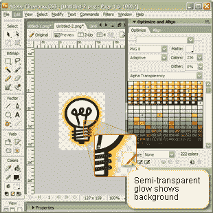
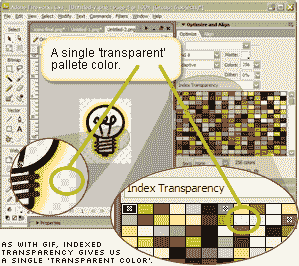
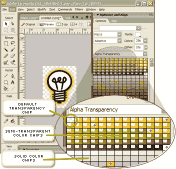
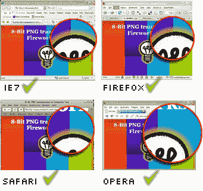
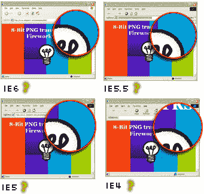

# PNG8 明显的赢家

> 原文：<https://www.sitepoint.com/png8-the-clear-winner/>

今天早上，我在设计视图中浏览了这个小小的 Fireworks PNG 技巧，认为它也值得在博客中发布。这是一种已经存在多年的方法，但是我经常惊讶于有这么多的人不知道它。即使在这间办公室里，我也有网络专家皱着眉头坚持说“*不，不…这不可能是对的…不是吗？*

所以，冒着让长期使用 Fireworks 的人打哈欠的风险，翻着白眼想废话！，在这里。

你可能已经知道， [PNG 有两种风格——8 位和 32 位](http://en.wikipedia.org/wiki/Portable_Network_Graphics)。最受欢迎的是 32 位版本。

**PNG32 的主要特点是:**

*   它使用灵活的“类似 JPEG”的 RGB 颜色模型，而不是像 GIF 那样使用有限的调色板。
*   它采用了完全无损的压缩方法，允许您保存和重新保存您的图像没有质量损失。
*   无损压缩确实要付出一些代价——PNG 图像总是比 JPEG 图像胖得多。
*   它可以复制复杂的、分级的透明度设置，类似于 PSD 或 TIF 文件。

当然，微软对 PNG 规范的不重视([早在 1996 年](http://en.wikipedia.org/wiki/Portable_Network_Graphics#History_and_development)就制定了)意味着辉煌的 PNG 格式的宣布被置若罔闻。事实也的确如此——随着 Internet Explorer 稳步占据浏览器市场 95%的份额，对于大多数用户来说，这种图像格式呈现出透明的固体，而对于大多数开发人员来说，这种图像格式完全不是问题。

不要低头，许多血腥的开发者开始发明各种各样的黑客手段、技巧和变通方法，旨在迫使 IE 表现良好。其中包括许多基于 JavaScript 的解决方案 / [、基于过滤器的解决方案](http://www.alistapart.com/stories/pngopacity/)，甚至[一个 Flash 驱动的 PNG 渲染器](http://blog.psyrendust.com/pngpong/)。

虽然这些方法大多有效，但它们都很复杂，完全依赖于另一种技术(Flash、JavaScript 等)。)，而且在老款浏览器上还是很失败。

然而，这些努力是在糟糕的情况下尽力而为的良好尝试。

**PNG8 的主要特点是:**

*   它采用了基于调色板的颜色模型(有时称为索引调色板)，就像 GIF 使用的那种。
*   它不能像 GIF 一样动画。
*   它提供类似 GIF 的 1 位透明度。像素要么是实心的，要么是完全透明的，但绝不会部分透明。

虽然最后一点被普遍接受为事实，但严格来说并不正确，这也是我们今天要探讨的话题。

所有 png 的透明度信息包含在文件的一个部分中，称为块，[，根据规范，对于索引图像，它存储一个或多个调色板条目](http://en.wikipedia.org/wiki/Portable_Network_Graphics#Ancillary_chunks)**的 alpha 通道值。**

换句话说，块允许有一种以上的透明色。

现在，正如我们所知，官方规范可以展示各种各样的美好理想，包括彩虹、独角兽和毛茸茸的小猫——只要看看大多数的 W3C 规范——但真正重要的是在这个又大又广又脏的世界里发生的事情。

让我们看一个例子。

我们将从一个简单的烟花开始，我给了它一个黄色半透明的光。正如你在下面的截图中看到的，背景可以透过光晕看到。

如果我们将文件格式设置为 png 8-indexed transparency，我们得到的结果与您可能看到的任何透明 GIF 非常相似。我们调色板中的一个色卡是为 alpha 通道留出的，所有半透明的颜色都被展平到背景色中，并呈现为不透明。

然而，如果我们从指数透明度转换到阿尔法透明度，事情就变得有趣了。

虽然我们的默认 alpha 芯片仍然在左上角，但我们的 PNG8 调色板预览现在显示了一种新类型的色卡，左上角剪切了一个透明的小芯片。这些是我们半透明的颜色。

让我们导出图形，看看我们的 web 浏览器是如何制作的。如果您想尝试自己的快速测试，[页面在这里](https://www.sitepoint.com/examples/8bit/)。

正如你在上面的图表中所看到的，所有四种现代浏览器都很好地呈现了黄色光晕效果，透明度水平略有不同。没有问题。

但是那些暴躁的老年人呢？他们是不是又要让派对失去活力了？

答案是:不一定。

当然，旧的浏览器不会渲染柔和的光晕效果，他们会愉快地忽略它，同时继续以光辉的、类似 GIF 的 1 位 alpha 渲染 100%透明的部分。不完美，但也不悲惨——特别是与老版本 IE 上无附件的 PNG32s 的难看的灰色盒子相比。请记住，在 IE5 中，所有基于 IE 过滤器的 PNG 黑客仍然会留下一个灰框。

令人惊讶的是，Fireworks 似乎是唯一支持这种半透明 PNG8 导出功能的图形应用程序，而且至少从版本 3 开始就这样做了。

我可以确定 PhotoShop、Gimp、Paintshop Pro 或 Xara 都没有内置这个功能。自从我第一次在 DV 中发表这篇文章以来，论坛成员丹尼尔·詹姆斯报告说，两个小应用程序——[png quant](http://www.libpng.org/pub/png/apps/pngquant.html)和[png NQ](http://www.cybertherial.com/pngnq/pngnq.html)——可以模仿这个技巧。然而，[Fireworks 似乎做得更好](http://jedisthlm.com/testarea/pnq-quant-vs-firefox/)，所以很明显，如果你有一个更老版本的 Fireworks，它可能值得保留这个功能！

**总结**

似乎没有什么理由不在我们的工作中使用更多的 8 位 Fireworks PNGs。在许多典型情况下，60%到 80%的用户将使用完全支持这些文件的浏览器。

其余的 IE5-6 用户将会看到同一张图片的一个稍微有点锯齿但通常非常容易接受的版本。右边的例子用在 sitepoint.com 主页上，我怀疑 IE6 用户意识到他们错过了什么。

生成的文件很小，上面示例中使用的灯光球图像小于 6k。我生成了相同图像的 PNG32 版本，它的大小是原来的 3 倍。

由于他们不依赖于浏览器黑客、JavaScript、Flash、DirectX 或任何其他第三方技术，他们很难失败。

虽然仍有可能在所有浏览器中实现完全透明控制需要 PNG32 hacks，但我个人认为 PNG8 应该成为网页透明效果的默认选择。

## 分享这篇文章