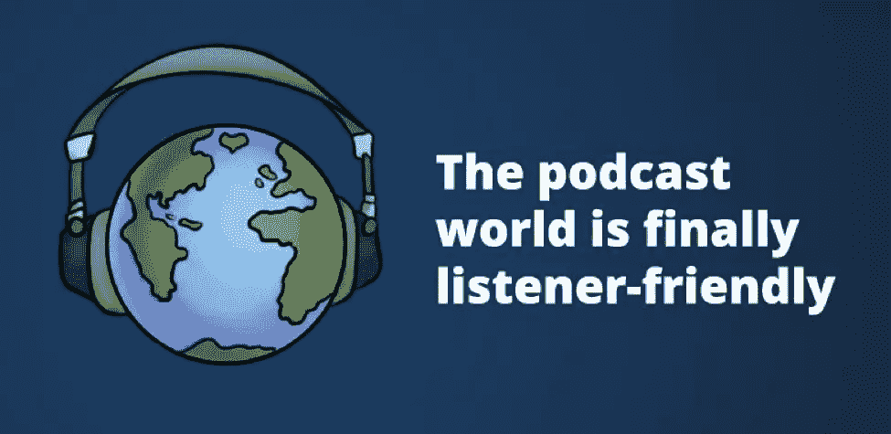
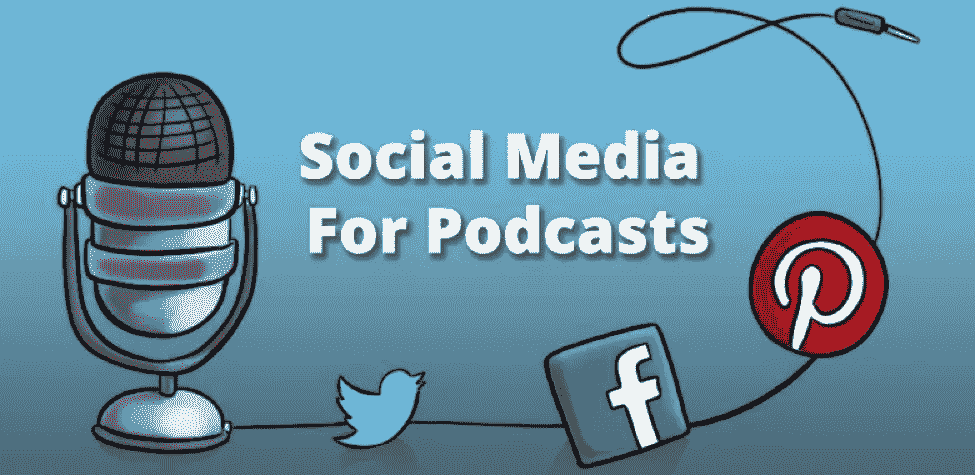

# 为什么播客推广是建立观众群的最快方式

> 原文：<https://www.sitepoint.com/podcast-promotion/>

> 播客是下一件大事。

我们知道你听过这句话的次数比你想承认的要多。你明白了。但是你知道为什么吗？

## 为什么你应该创建和推广播客

播客业务正在蓬勃发展。三年前，包括《纽约时报》在内的一些主要媒体放弃了音频。他们声称观众缺乏兴趣；播客看起来像昙花一现。不过，较小的媒体仍保持着音频参与，许多前业余无线电节目主持人和博客作者也是如此。他们的观众很少，很投入，而且在稳步增长……但是应用程序很笨重，收听选择有限，而且大多数设备都不支持播客。

根据一篇关于[快速公司](http://www.fastcompany.com/3035954/most-creative-people/the-surprisingly-profitable-rise-of-podcast-networks)的文章，干扰实际上可以为企业带来金钱，更多的广告空间，是的——比视频媒体更少的投资。播客广告的转化率也出乎意料的好。最棒的是，据《华盛顿邮报》报道，下载量在 2014 年 8 月突破了 10 亿大关。

如果你不推广你的内容，不管你有多努力想赚些钱并对广播产生影响，你永远也不会。你必须推广你的内容，使其可见。不管有多少人愿意听你的，渴望你的内容，如果它从未被推广，没有人会知道它的存在。

幸运的是，我得到了一些建议来帮助你使你的播客成为热门。

## 使用播客目录获得更多听众

拥有播客是朝着正确方向迈出的一步，但你也需要被倾听。现有的还不够。你是怎么做到的？

### 在 iTunes 中获得特色

在 iTunes 中获得特色。这曾经更有效，但它仍然可以为你带来很多新听众，而且是免费的，对你的播客有持久的影响。在你的播客简历上加一个很好的小说明:“iTunes 精选”…是的。你明白我的意思。

**查看这些文章，了解让 iTunes 爱上你的播客的技巧:**

*   如何让你的播客在 iTunes 中排名第一！(克里斯·达克的个人发射策略)
*   [如何让您的播客成为 iTunes 中新的值得关注的内容](http://eventualmillionaire.com/how-to-get-your-podcast-into-new-and-noteworthy-in-itunes/)

### 在顶级目录中列出您的播客

去一个人们能找到你的地方。将你的播客列在顶级目录中。也为你的领域列出一个顶级目录——一些博客为特定的领域收集播客综述。如果你找到一个与你的播客相匹配的，给他们发一个你节目的链接，问问他们是否会考虑让你做主角。不能伤害！

有一些目录是每个播客应该知道的。

让我们来回顾一些我们最喜欢的:

*   iTunes-这是迄今为止最大的播客平台。iTunes 早在播客和 iPod 同义的时候就进入了这个领域，并且从第一天起就统治了这个领域。好处？巨大的潜在观众。
*   这个神奇的小应用通过让潜在听众搜索符合他们兴趣的流媒体音频来增加你的播客流量。撰写一流的描述是在这里取得成功的关键。
*   [iHeart Radio](http://www.iheart.com/)-流媒体广播服务，通过结合 iTunes 和 Stitcher 使用的策略而名列榜首。他们已经存在了一段时间，拥有大量的观众，并且拥有稳定的高质量播客。
*   Audioboom——迎合大众 audio boom 让你的播客赚钱——甚至通过脸书和 Pinterest。这个用户友好的应用程序是许多听众的热门选择。
*   SoundCloud 是一个以音乐和音频表演艺术为中心的平台，稳步发展。它并不适合每个人，但对音乐家来说是一个很好的选择。
*   TuneIn 拥有超过 400 万个音频节目和播客以及 10，000 个广播频道，是一个音频怪兽。确保能在这里找到你。
*   mix cloud–对听众免费，移动友好，以电台为中心，这是另一个你不能跳过的平台。

有数百个独特的机会和策略来推广你的播客，所以不要局限于我在这里提到的。测试一切，如果你想出了一个新的策略，也测试它！查看[这篇关于基本博客技巧的文章](http://basicblogtips.com/promote-your-podcast.html)了解更多信息。

要获得应用程序列表和其他可以列出您的播客的位置，请查看[播客位置](http://podcastplaces.com)。

## 播客成长黑客

现在你已经有了基本的东西，让我们更深入地看看播客推广。我们的建议？不要在营销上花大钱。走基层。方法如下:

### 挖掘流行播客的受众

听起来是个挑战，对吧？不是的。寻找机会和一个知名的播客共同主持一集。确保你能为他们的观众提供一些不直接与播客专业领域重叠的东西，但会强烈吸引相同的人群。通过减少一个播客来节省他们的时间和精力，给你一个新的行业接触，并有助于增加你的观众。

与已经拥有大量观众的类似播客的社交媒体直接互动。不要直接为你的播客做广告，但要积极参与，并提供高价值的评论和见解。很快，你就会让他们的观众来看你。

### 请便

在您的播客中包括客人。人们喜欢新的声音、新的内容和新鲜的感觉。如果你总是提供很棒的内容，并邀请偶尔的(甚至是固定的)客人，你会让你的听众乞求更多。此外，谈话通常比独白更有趣。你的客人是很好的推广者——他们会与朋友和家人分享你节目的链接，以帮助他们主演的播客被听到。

哪里可以找到值得播出的人？查看你的朋友、家人、同事名单，也问问他们认识谁。还记得六度连接的概念吗？用在你喜欢的地方。也去看看 HARO。发布一个查询，看看会发生什么…

你也可以在谷歌上使用以下搜索查询来寻找你所在领域的专家，他们愿意接受采访:

*   《小众》书名:采访
*   “利基”标题:“问答与”
*   标题中的“利基”:“来自……的提示”或“来自……的建议”或“与……聊天”

所以，如果你的播客是关于网页设计的，在谷歌里用“网页设计”代替“小众”。结果会是你所在行业的人愿意接受采访。下一步是接触他们。

### 做他们的客人

想办法兴风作浪？听到你的节目了吗？

*做客*。

没错。和邀请嘉宾参加你的节目一样重要的是，出现在其他人的播客上也同样重要。你可以四处打听，看看谁需要一两个客人，或者你可以使用 [SpeakPipe](http://www.speakpipe.com/) 收听其他人的播客，留下语音留言评论或问题，开始为自己建立广播声誉。

这个技巧你可以在很多网站上找到，很多优秀的播客积极地使用它。说到这里，我还建议你亲自去看看 SpeakPipe。将它添加到您的播客中，让您的听众也可以打电话来提出评论、问题等等。公平就是公平，对吧？

### 写一篇综述博客

是的，实际上是写博客。你会发现专业博主、内容营销者和其他内容专业人士会更乐意分享你的内容，如果你在里面提到他们的话…当然是正面的。许多人甚至会给你一个小片段，在文章中引用他们的话。我知道这种策略行得通，因为[我们已经试过了](http://www.buzzsprout.com/blog/2014/12/22/podcasting-tips/)。

以下是来自 Quick Sprout 网站的布莱恩·迪恩(Brian Dean)关于如何创建一个杀手级综述帖子的一些关键建议:

*   给那些你在其他综述文章中读到过的专家们一点鼓励。他们已经引用了别人的话，并为其他帖子发声——这让他们比你从未见过的人更有可能同意被引用。
*   使用 [FollowerWonk](http://followerwonk.com) 寻找你所在领域的专家。只有当你包含的人与你的听众相关时，综述才是有价值的。确保你向你的目标贡献者推销，就像你的生命依赖于它一样——如果你不能向他们推销它的价值，你就不会让他们参与进来。
*   在帖子里附上他们的头像，给他们应得的赞扬。让自己保持有条理，关注每个投稿人，并将链接发送给他们，以便与他们的关注者分享。这是值得的。

## 让您的播客获得更多搜索流量

确保遵循我提到的最佳实践。它们服务于一个主要目的——让搜索引擎爱你。每个人都喜欢被爱。尤其是当这种感情带来更多观众的时候。

### 用 SEO 吸引流量

想要更多的听众，一个好的名声，和来自搜索引擎的尊重？遵循图像、标记等的最佳实践。不要跳过搜索引擎优化，这对播客很重要。通过适当地标记文件和图像，确保你的播客对搜索引擎友好。你需要知道的是:

*   SEO 通常适用于书面内容，但在不久的将来，它也可能适用于视频和音频内容。这项技术已经存在。
*   谷歌不是唯一重要的搜索引擎，同样的搜索引擎优化技术几乎适用于所有播客需要了解的搜索引擎。iTunes，Yahoo，Bing，YouTube，当然还有 Google 是你在播客中需要记住的搜索引擎。
*   使用能吸引观众注意力的标题。想想他们在寻找什么，并努力做到相关。标题是你书面描述中最重要的部分。专注于它。
*   给你的图片文件起一个与文章相匹配的名字——并挑选与你的播客内容相匹配的图片。例如，一个关于切达奶酪对健康有益的帖子可能会有一张切达奶酪轮子的照片。不要将它命名为“ch1753_2013.jpg”，而是将名称改为“cheddar-cheddar-cheese-is-deliciously-healthy . jpg”。在 HTML 中使用 alt 标签。
*   不要在你的文章中塞满不必要的关键词。会适得其反。高质量的内容永远是比关键词汤更好的选择。关注你的听众想要什么，而不仅仅是搜索算法和机器人。
*   使用同义词，长尾关键词短语，以及吸引听众搜索目标的关键词。从你的关键词中去掉“播客”这个词，看看会发生什么——大多数人并不是一开始就寻找播客，而是想要在你的音频广播中找到信息。
*   确保你的帖子中包含了节目笔记或播客的文字记录，并且文本包含了一些与播客内容相关的关键词。

## 让听众分享你的节目

你好。社交媒体是关于对话的，而你正在主持一个播客。这两者相辅相成。确保你的社交媒体社区得到很好的管理。与你的听众直接互动，保持开放，保持你的品牌形象在不同平台上的一致性。(没错，你就是品牌！)

偶尔发布一个你播客的链接。新的社区成员、关注者或喜欢者可能会出于好奇点击它。

### 在脸书获得追随者

脸书是一个社区空间。这是一个与观众互动的好地方。你可以使用 Buffer 或 HootSuite 之类的服务自动发布帖子，但也要确保亲自与你的听众互动。发布原创迷因和视觉内容、视频，甚至偶尔的音频文件，以帮助吸引新的听众、分享和喜欢。

### 为蠢人准备的

140 个字符或更少可能是一个挑战，但一张图片胜过一千个单词。记得发布各种推文，包括视觉帖子。tweets 中指向您的播客的超链接，带有与内容相对应的标签。关注你所在地区的有影响力的人，并与他们互动。风度翩翩，转发你的听众会喜欢的内容，并遵循 Twitter 的礼仪。Buffer 和 [Hootsuite](http://hootsuite.com) 在这里也能帮到你。

### 你的播客的 Pinterest

Pinterest 的用户群充满了视觉思维的人，女性占大多数。如果你的播客内容有视觉效果，或者很受女性欢迎，那么进入 Pinterest 是一个不错的选择。通过张贴与你的播客内容相关的原始图片，你可以很快找到新的关注者。在公开之前，确保你有至少五个包含五张图片的公告板，并发布相关影响者的帖子。

## 如何分析你的播客的成功

播客上传？检查。

正在促销？检查。

有用吗？嗯…

你在创建、发布和推广你的播客上投入了大量的精力。坚持到底。你需要分析你的努力。跟踪这些统计数据，了解您的促销效果:

*   站点流量——有多少人访问你的网站？谷歌分析是寻找这些数据的地方。

*   **订阅源** —有多少人认为你值得订阅？无论您使用什么样的 feed 服务，都应该很容易获得这些数据。不过，不要相信它会让你对播客的表现有太多的了解。[订户的数量可能会产生误导。使用它们给你一个大概的数字和趋势，仅此而已。](https://medium.com/for-the-love-of-podcast/podcast-subscribers-these-are-not-the-statistics-youre-looking-for-3c0ddff25132)

*   一旦有人出现在你的页面上，他们会留下来吗？再次求助于谷歌分析。他们有一些关于跳出率的可靠数据，这将让你知道有多少人查看你的页面，有多少人在看到你的页面时逃之夭夭。

*   **媒体下载** —你的网站访问者在你的页面上做了什么？他们下载你的播客吗？像跳出率一样，这个统计数据告诉你的不仅仅是你的推广工作做得有多好。如果您在自己的网站上跟踪这种转换，您还会了解到您的网页表现有多好。

大多数目录也会给出媒体下载的总数。完善你的播客的书面描述，以提高目录下载率，并寻找网页复制问题和设计问题，以解决网站下载量低的问题。

*   **奖金** —使用[提及](https://en.mention.com/)或[社交提及](http://www.socialmention.com/)来查看谁在谈论你，以及何时谈论。社交提及甚至会让你知道他们说的是正面的还是负面的！

## 准备好开始推广你的播客了吗？

开始任何事情的最佳时间是昨天。下一个最好的时间是今天。如果你已经有一个播客，把这些技巧用起来，看看它们如何影响你的关注和分析。

## 分享这篇文章