# 使用我们的脸书 Photoshop 模板美化您的品牌在脸书的形象

> 原文：<https://www.sitepoint.com/polish-your-brands-facebook-presence-using-our-facebook-photoshop-template/>

脸书终于推出了他们的品牌时间表页面版本，所以是时候制作一个模板了！有了这个模板，你可以快速为你的品牌创建一个构图良好的脸书形象，将封面照片和个人资料照片结合在一起，产生令人惊叹的效果。

不幸的是，脸书让调整设计变得非常痛苦。在上传的过程中，图片被缩小了，但是更烦人的是定位图片是多么的困难。为了让你避免浪费一个下午的时间，对脸书的开发者说一些脏话(很可能伴随着大量的头痛)，使用下面的模板和说明来更快更容易地标记你的脸书时间表。

### 步骤 1:下载模板

首先，你需要[下载脸书时间轴](https://www.sitepoint.com/wp-content/uploads/2012/05/fb-brand-template.psd_.zip)的模板，并在 Photoshop 中打开它。你会看到方便标记的层和脸书品牌的颜色已经到位。

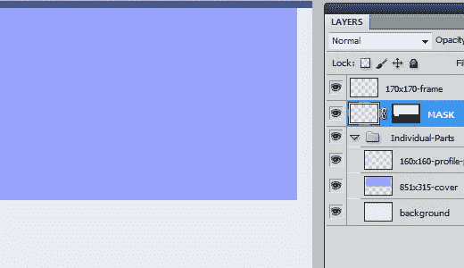

### 第二步:了解情况

我们将讨论的时间表的唯一区域是封面照片(页面顶部的大横幅区域)和个人资料图片(封面区域左下方的小图形)。

封面照片是 851 x 315 像素，因此相应地设计你的想法。个人资料图片是 170 x 170，有 10 个像素的边界和 1 个像素的投影/描边效果。你被边框和阴影/描边卡住了。抱歉。

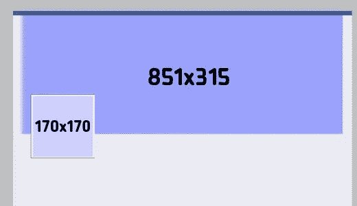

### 步骤 3:选择正确的层

当您准备好将自己的设计放入模板时，复制展平的设计(CTRL/CMD + "C ")，并通过 CTRL/CMD +单击“蒙版”层上的图层蒙版开始。我知道这可能会令人困惑，所以我准备了一张图片:

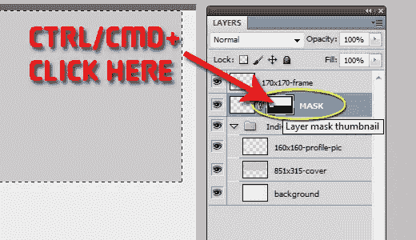

对许多人来说，这将是本教程中最难的部分。好消息是:从这里开始会变得更容易。

### 第四步:粘贴到

现在，我们将使用 Photoshop 的一个不太常用的功能。这是“粘贴到”命令。在图层蒙版仍然选中的情况下，进入“编辑”>“选择性粘贴”>“粘贴到”

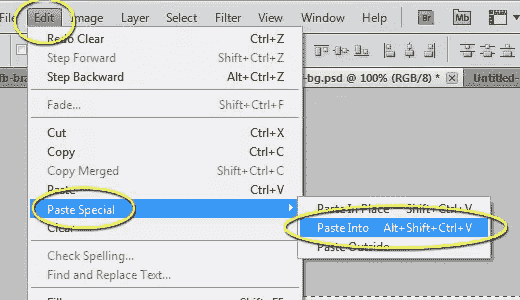

### 第五步:根据需要调整

现在，您可以简单地使用移动工具和刚刚粘贴的层来根据需要定位设计。

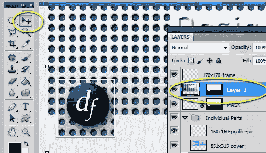

### 第六步:封面照片

在图层面板中选择粘贴的图层(下面的“我的图层 1”)，按住 CTRL/CMD 键单击“851×315-cover”图层，选择模板的封面照片区域。

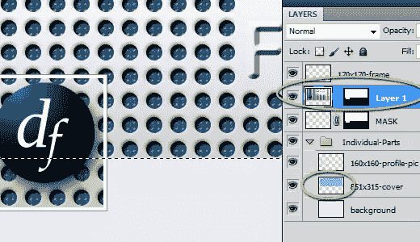

按 CTRL/CMD + "C "复制此选择，打开一个尺寸为 851 x 315 的新文件，然后粘贴您的选择(CTRL/CMD + "V "或"编辑" > "粘贴")。将您的选择保存到一个方便的位置。现在你有了一张封面照片，尺寸正好符合你的脸书时间表。

***进阶一步***

你的封面照片可能会像我一样有一个半切掉的标志。为了避免这种情况，您需要以稍微不同的方式处理第 6 步。你将把一张封面照片放入模板中，该模板在个人资料图片区域没有徽标或设计，然后执行步骤 6。然后当你到第 7 步，粘贴完整的设计。

或者，通过重复步骤 4 将两个层放入模板中，对齐它们，并在执行步骤 6 时隐藏轮廓 pic 区域。

### 第七步:个人资料图片

重复上面的步骤 6，但是这次 CTRL/CMD +点击“160×160-profile-pic”图层。(对于那些遵循高级步骤的人:确保 profile pic 区域已经准备好适当的设计。)

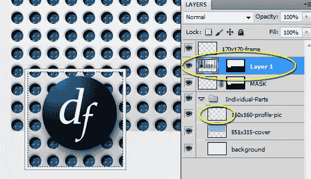

这就是事情变得有点棘手的地方。脸书要求个人资料图片的最小尺寸为 180 x 180px 像素。你可能注意到我有一个 160 x 160px 像素的选择区域。那是因为脸书会把你的 180 像素缩小到 160 像素。这真的很烦人，但这是我们必须面对的。

所以，打开一个 180 x 180 的新文件，把你的 160 x 160 的图片粘贴进去。它应该是这样的:

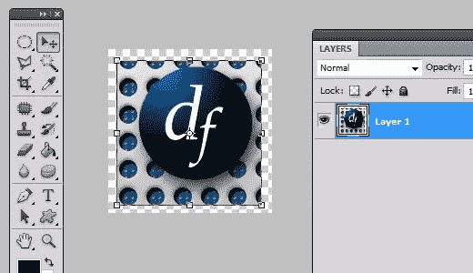

使用移动工具，按住 Shift 键并拖动它来填充图层。保存它，你就可以开始了。

### 第八步:上传封面照片

要上传你的封面照片，请登录脸书，然后进入你的页面。将鼠标悬停在封面照片区域，在封面照片的右下方，您会看到一个方框，上面写着“更换封面”

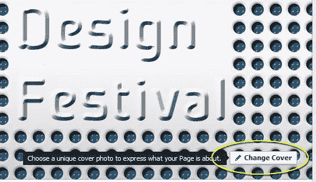

单击它并选择上传照片。导航到保存封面照片的位置并上传。你不需要重新定位它，因为它的大小已经很好了。

### 步骤 9:上传个人资料图片

将鼠标悬停在个人资料图片区域，然后单击“编辑个人资料图片”按钮。选择“上传照片”并选择您的个人资料图片(这是 180 x 180，但它将呈现为 160 x 160)。

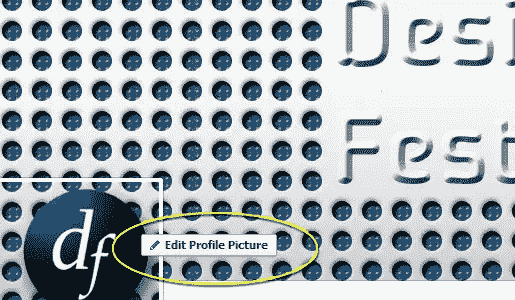

就是这样！你都准备好了！现在，您的页面已经打上了您的个人资料照片和封面照片的烙印，并共享了一个协调的设计。现在，把评论中你的 FB 品牌页面的链接发给我，炫耀你的作品！

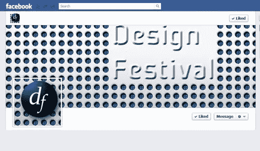

## 分享这篇文章