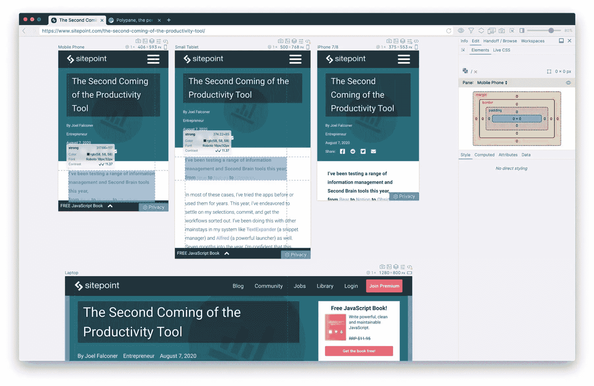
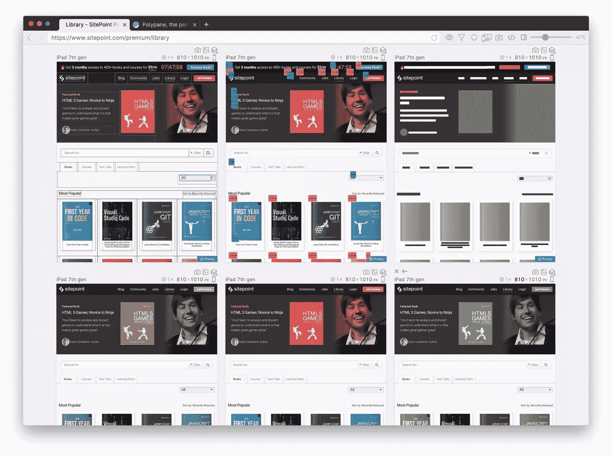
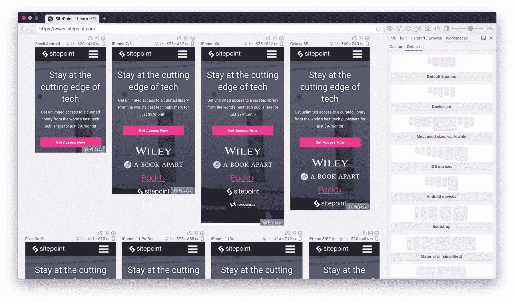

# 认识一下 Polypane，一个让你速度提高五倍的浏览器

> 原文：<https://www.sitepoint.com/polypane-developer-browser/>

作为开发人员，我们喜欢使用专门制作的工具，尽可能提高我们的效率。我们过度研究并得到完美的键盘，我们的代码编辑器或 IDE 是精心挑选的，并使用完美的编码主题和编码字体(在我的例子中是 Fira 代码)。我们有工作流来优化我们的 CSS 和图像，我们的构建工具也进行了优化，以尽可能快地完成尽可能多的工作。

然后我们使用其他人在脸书上喜欢猫视频时使用的浏览器。

这不是很奇怪吗？我们专门从几十个可用的编辑器中挑选代码编辑器；我们的键盘对我们的手指来说有着完美的点击感；然而，我们和其他人使用相同的浏览器。就像我们不会因为每个人都用 Word 来写东西就用 Word 来写代码一样，我们也不应该接受用普通浏览器来建网站。

* * *

这篇文章是**路线图**的一部分，我们从开发者的角度来看产品的创造和推广。我们将分享产品领导者的顶级经验，并给技术创始人一个空间来与您分享他们的早期产品。如果你有兴趣成为特色，[让我们知道](https://sitepoint.typeform.com/to/dDQrtqzy)。

* * *

## 普通浏览器

使用常规浏览器的典型工作流程看起来有点像这样:以一种尺寸构建网站，然后调整浏览器的大小并为其构建设计。然后再次调整浏览器的大小，并为其构建设计。那么…好吧，你明白了。你一个接一个地做着，一遍又一遍地重复着自己。如果你运气不好，你可以在构建的时候从头到尾做几次，新的页面会带来新的需求，影响到你已经完成的页面。

除了构建页面的视觉效果之外，您可能还想做更多的事情。你想一边走一边检查你的网页的可访问性吗？添加浏览器扩展。你想创建一个完整的页面截图发送给你的老板或客户吗？添加浏览器扩展。您想检查您的 meta 标签是否正确吗？你猜对了，加个浏览器扩展。只需要一些基本的东西，你就已经需要半打浏览器扩展了。你用过半打扩展名的浏览器吗？它让 IE11 相比之下显得很快。

## 聚烷的工作原理不同

当你打开 [Polypane](https://polypane.app) 时，你看到的不仅仅是一个网站。您可以同时以多种屏幕尺寸查看您的网站，就好像您的桌子上有一堆设备一样。不过，更好的是，所有这些屏幕尺寸都是同步的:如果你与一个屏幕互动，你就会与所有屏幕互动，无论你是滚动、点击、悬停还是打字。你正在与一个网站互动；你只是碰巧同时看到多个尺寸的。

<video controls="" width="100%"><source src="https://polypane.app/static/68568dbc740e534e7273939343f00331/intro.mp4" type="video/mp4"></video>

并排查看所有屏幕尺寸意味着您不再需要调整浏览器的大小并逐个浏览它们。这些屏幕尺寸由您选择:您可以从 20 多种预配置的设备中选择，如手机、平板电脑和笔记本电脑尺寸，或者您可以随意调整它们的大小。

或者你可以让 Polypane 解析页面的 CSS，找到所有的 CSS 媒体查询，并从中创建屏幕尺寸，确保你总是在测试你想要支持的所有尺寸。

仅此一点就使得 Polypane 的生产率大幅提高。但是，如果你消除调整你的浏览器的所有时间，我们还能做什么？

好吧，那重新装弹呢？

Polypane 可以与任何热重装或实时重装系统一起工作，就像任何其他现代浏览器一样。但是 Polypane 还有一个内置的 live reloading 服务器，需要零配置。只要告诉它要检查哪个文件夹，就大功告成了。它甚至可以处理普通的 HTML 文件！最棒的是，如果你更新一个 CSS 文件或图片，Polypane 只是刷新它，而不是重新加载整个页面。

## 你的浏览器变成了开发工具

此时你可能会问:*但是开发者工具*呢？普通浏览器附带的开发者工具令人惊叹，Polypane 使用了与谷歌 Chrome 和微软 Edge 一样强大的开发者工具(包括开发者工具扩展)。但是浏览器中的开发工具最好也是一个附加组件。一个浏览器 99%的目标受众都是非开发者，所以我们真正得到的只是这一小盒开发者工具作为我们的领地。

但是如果我们将整个浏览器视为开发工具，我们不仅可以解锁更多的新功能，还可以优化它，使每个新功能不会像浏览器扩展那样减慢浏览器的其余部分。

这就是为什么 Polypane 有如此多的内置功能:

*   整页截图
*   设备仿真
*   实时预览您的页面在社交媒体上共享时的外观
*   内置可访问性测试
*   黑暗模式和减少运动的媒体查询仿真
*   所有屏幕中的实时 CSS 编辑
*   自定义标题
*   触摸仿真
*   色盲模拟器
*   一个侧边浏览器，这样你就可以在你的站点旁边显示你的移交工具、文档或设计
*   一个 CSS 颜色对比检查器，为您建议颜色，然后您可以实时预览
*   用于视觉回归测试或像素完美设计的图像叠加

## 高级测试工具

我们才刚刚开始。有没有一个元素检查器可以让你同时在所有的屏幕上编辑你的页面，并且让测试新的样式和内容变得非常容易？这就是 Polypane 元素检查器允许您做的事情。

没有其他浏览器能让你以如此直观和快速的方式同时编辑多个屏幕尺寸。我们也有面板让你检查你的页面的轮廓(显示所有的标题和它们的层次)，一个让你编辑所有的本地存储和 cookie 信息，或者一个让你写 CSS 或 Sass，然后插入到超快速原型的每个屏幕。

Polypane 中的覆盖层让您可以在单个屏幕上快速尝试各种各样的事情，如模拟色盲或其他视觉障碍，检查您的布局问题或列出页面上的所有 z 索引。

所有这些工具都可以帮助你开发你的网页的不同部分，在我们对 Polypane 用户的研究中，我们发现开发者在使用 Polypane 时，根据任务的不同，工作效率会提高 3 到 10 倍。此外，由于 Polypane 使得检查元信息和所有浏览器大小变得非常容易，发布后的错误修复数量大幅下降。

在以后的文章中，我们将探索如何使用 Polypane 做一个完整的网站审计，以及如何使用 Polypane 提供的一切从头构建一个响应式设计。

[Polypane 有一个免费试用版](https://polypane.app)，你可以在 14 天内试用。

## 分享这篇文章