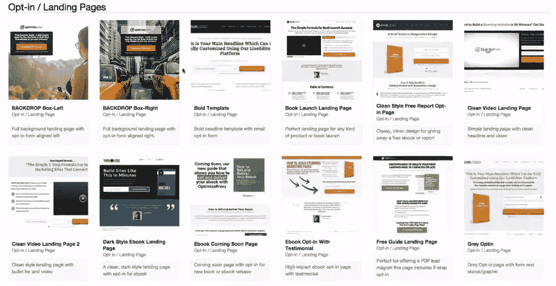
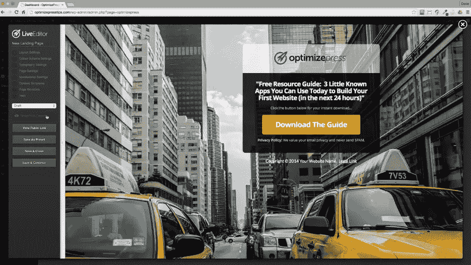
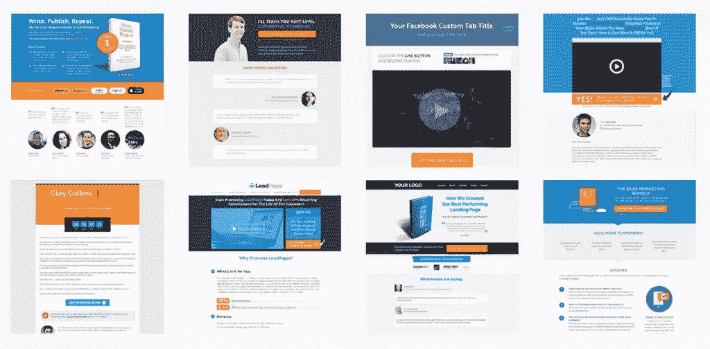
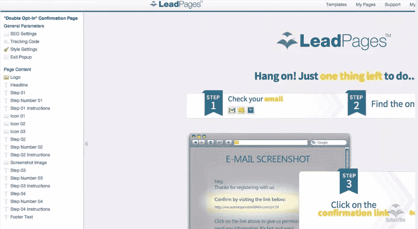
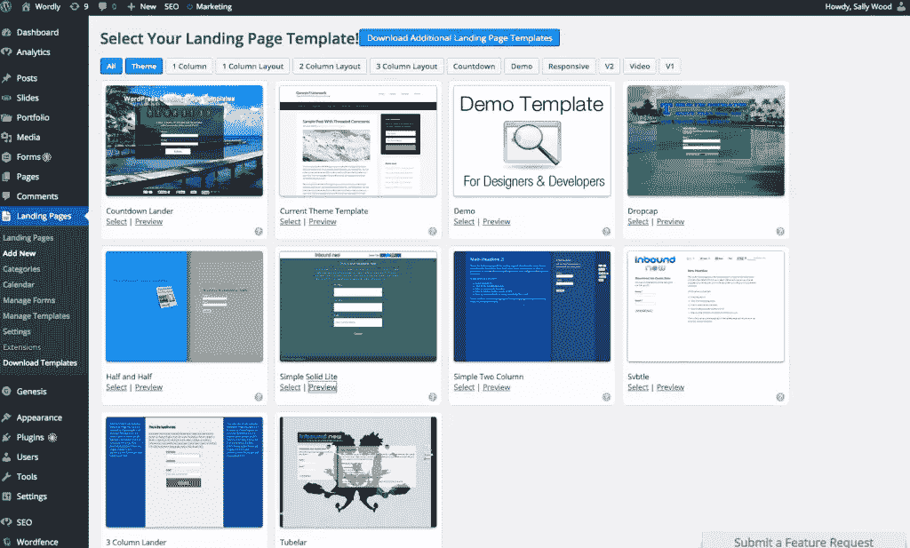
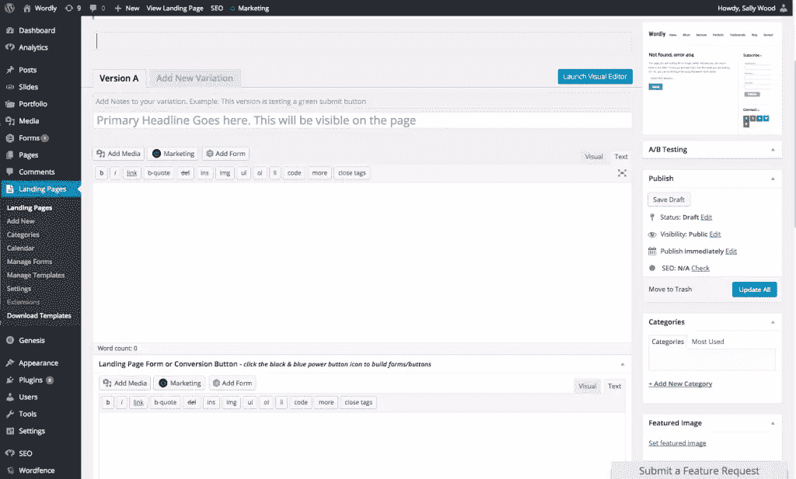
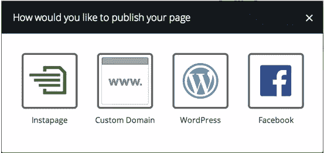
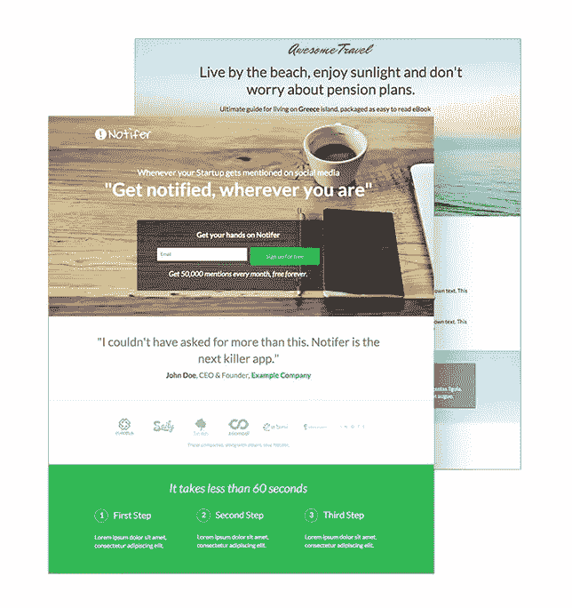

# 最受欢迎的 WordPress 登录页面插件

> 原文：<https://www.sitepoint.com/popular-wordpress-landing-page-plugins/>

登陆页面是任何成功营销活动的基础。他们充满了定制的内容，对你的网站访问者说话。这些内容与你的网站访问者交流，因为它提供了你的访问者所期望的准确、具体的信息。登陆页面与你的营销信息 110%一致，并且始终有一个明确的目标:让你的网站访问者采取特定的行动。

当谈到在 WordPress 中创建登陆页面时，有许多插件可供选择，它们都有自己独特的优势。在这篇文章中，我将介绍一些最流行的 WordPress 登录页面插件。

## 什么是登录页面？

登录页面是一个独立的网页，设计时考虑了特定的目标。这个目标通常集中在用户行为上，激励你的登陆页面访问者采取行动，做一些事情，转化。通常，这可能是请求报价，或注册邮件列表，或提供联系方式以换取免费赠品(如电子书或白皮书或某种描述的模板)。

登录页面完全独立于您的主网站。而且，一般来说，完全没有主菜单导航，否则会将登录页面绑定到您的网站。这种缺乏导航的主要原因是在行动方面给游客较少的选择。选项越少，你的登陆页面访问者就越有可能采取你希望他们采取的行动，让他们越来越接近你的预期转换。

## 为什么要使用登录页面？

因为他们提高了你的转化率。

真的就这么简单。事实上，根据 Unbounce 的说法，使用登陆页面的在线广告活动通常会看到至少 25%的转化率增加。而且，在一些 A/B 分割测试中，这个数字可能会更高。

登陆页面转换如此之好的主要原因是因为你可以设计、构建和起草与你的广告特别匹配的引人注目的文案。例如，如果你正在为“墨尔本最具创意的文案”开展谷歌 AdWords 活动，并为新客户提供 20%的介绍性优惠，那么你的用户(当他们点击你的谷歌 AdWords 广告时)被导向的登陆页面就能准确反映这一点。当你不把人们引导到你的网站主页时，维护你的广告信息就容易得多，因为在那里他们可能找不到他们期望从你的广告中得到的 20%的折扣。

## 登录页面的类型

有两种主要类型的登录页面:

*   **点击进入**:正如你可能已经猜到的，第一种类型的登陆页面是鼓励用户“点击进入”另一个页面。这一过程旨在引导访客越来越深入销售漏斗。因此，可能会有第一个描述你的产品或服务的点击登陆页面，然后是第二个强调你必须提供的好处，第三个是社交证明(来自其他客户的评论)。然后，最后，您将关闭购物车页面，访问者可以在这里购买您的产品或服务。
*   **销售线索生成**:这种类型的登陆页面采用一种更柔和的方式。它不是鼓励访问者购买，而是鼓励访问者提供他们的联系方式(姓名和电子邮件通常就足够了)，从而允许你向他们营销，并可能在以后向他们销售。

## WordPress 登录页面插件

既然我们已经建立了什么是登录页面，以及为什么你应该使用它们，让我们找出目前可用的主要登录页面插件。

### [优化选项](http://www.optimizepress.com)

有了 OptimizePress，你可以为你的 WordPress 网站创建任何类型的页面，当然包括登陆页面。OptimizePress 有 WordPress 主题和插件两种形式。

#### 优势

*   实时网站建设及其 LiveEditor 功能。
*   它基于一个非常灵活、易于使用的拖放功能，与 WordPress 本身没有什么不同。
*   它提供了 30 多种不同的设计模板。
*   它配有一个全面的元素库(包括订购箱、推荐模块、视频和音频播放器)。
*   如果您选择使用 OptimizePress 的插件版本，那么您可以保留(并预先填充)您的新登录页面，使其具有与您的主网站相同的外观和感觉。
*   所有使用 OptimizePress 构建的页面都具有充分的响应性和移动就绪性。
*   它可以轻松地与许多其他平台集成，包括:Google Analytics、Google Content Experiments、Optimizely、MailChimp、Infusionsoft 和各种会员订阅服务。

#### 费用

如果您是开发人员，那么您需要购买 OptimizePress 核心许可证。5 个 API 密钥的许可价格为 249 美元。

如果你想在自己运营的个人网站上使用这个插件，那么它会便宜一些。有三个选项可供选择:

*   **核心包**:你可以在 3 个网站上安装插件，费用为 97 美元
*   发布包:你可以在 10 个网站上安装该插件，费用为 197 美元
*   Pro 包:你可以在 30 个网站上安装该插件，费用为 297 美元

所有这些都是一次性费用(您将终身拥有该软件)，但该费用仅包括 12 个月的支持。在前 12 个月之后，您可以以较低的费用购买额外的年度支持。如果您对产品不完全满意，OptimizePress 还提供 30 天退款保证。

### [首页](http://www.leadpages.net)

LeadPages 不仅仅是一个 WordPress 插件，它是一个独立的登陆页面优化平台，提供了一个 WordPress“连接器”插件，使得将你的登陆页面添加到你的网站变得轻而易举。

LeadPages 背后的营销团队肯定很在行。他们的网站宣称:“用 LeadPages 在不到五分钟的时间内将你的下一个想法变成一个公开的登陆页面。我们设计了业内最简单的登录页面生成器，因此您可以创建、编辑和部署下一个高转化率页面，而无需接触任何代码。”

那当然激起了我的兴趣。不到五分钟就能建立一个完整的登录页面？我不得不检查这个…

#### 优势

*   这个平台最出名的地方在于它简化并自动化了整个营销过程。你不仅可以在眨眼之间创建登陆页面，你甚至可以设置一个系统，让 LeadPages 自动向你的新订户发送你的免费内容。
*   它提供了 70 多个免费模板，为了让你浏览愉快，这些模板根据选择加入的成功率进行了排序。如果您对现有的库不满意，LeadPages 还允许您创建自己的模板。
*   它内置了 A/B 分割测试功能。
*   您可以使用 LeadPages 将 404 错误页面转换为登录页面。
*   使用该平台构建的所有页面都是完全移动响应的
*   它与脸书兼容并能很容易地集成在一起，因此很容易构建与脸书营销活动结合使用的登录页面。
*   它还兼容并集成了所有主要的电子邮件软件平台。
*   LeadPages 内置了一系列报告指标，包括对话率分析和统计。

#### 费用

对于 LeadPages，有三种不同的价位:

*   **标准套餐**:每月 25 美元(每年支付 300 美元)
*   **专业套餐**:每月 40 美元(每年支付 480 美元)
*   **高级套餐**:每月 67 美元(按年支付，每年 804 美元)

有了这些软件包，您可以在无限数量的网站和域名上使用 LeadPages。差异化是您有权使用的功能。如需完整的功能列表，请访问:[http://www.leadpages.net/pricing](http://www.leadpages.net/pricing)。

### [WordPress 登陆页面](https://wordpress.org/plugins/landing-pages/)现在由入站

这是 WordPress 插件目录中最受欢迎的登陆页面插件。它已经有大约 400，000 次(所有时间)下载，并且兼容 WordPress 4 . 2 . 3 版本，最新的软件更新已经在 2015 年 7 月中旬进行。它的星级是 3.6。

#### 优势

*   这个插件很容易使用，特别是对于非开发人员来说，它的可视化编辑器功能可以让你实时看到你对登陆页面所做的修改。
*   它提供了一系列的报告功能，包括跟踪您的登录页面转换率的能力。
*   除了报告和跟踪选项，您还可以克隆您的登录页面，使您能够运行 A/B 分割测试，以确定最有效的登录页面设计选项。
*   和其他登陆页面插件一样，你可以使用现有的 WordPress 主题，也可以从大量的模板库中选择。
*   用访问者信息预先填充表单，以提高转化率。
*   它集成了 [WordPress Leads 插件](https://wordpress.org/plugins/leads/)，允许你追踪所有登陆页面访问者的路径。
*   对于开发者来说，这个插件提供了一系列的动作、过滤器和钩子。而且，如果你正在寻找的功能还不存在，这个插件背后的团队很乐意进行定制修改。

#### 费用

Inbound Now 插件提供三种不同的价位，具体取决于您想要安装软件的站点数量:

*   设计师:每年 100 美元(仅 1 个站点)
*   网站管理员:每年 150 美元(仅限 1 个站点)
*   **机构**:每年 200 美元(5 个站点)
*   开发者:每年 250 美元(网站数量不限)

### 安装

这个插件已经有了 35，000 次下载，星级为 4.1，兼容 WordPress 的最新版本。它的工作方式与其他插件略有不同，因为你实际上是在 Instapage 中构建你的登陆页面。完成后，你选择“推送至 WordPress”选项。所有使用 Instapage 建立的登陆页面被发送到 WordPress，然后作为主网站的子目录发布。

#### 优势

*   Instapage 提供了一个超过 80 种不同模板的库，就其外观和感觉而言，这些模板看起来非常现代、干净和新鲜。此外，它们还根据用途进行了分类:点击页面、潜在客户页面、网上研讨会注册、移动应用，甚至致谢。
*   另一个拖放界面，使建立登陆页面简单快捷(根据他们的网站，应该只需要三分钟)。
*   正如预期的那样，它整合了所有常见的嫌疑人:电子邮件营销平台、分析平台、社交媒体网站、会员订阅基础和购物车。
*   它提供了 A/B 分割测试功能，以便您可以确定什么在工作，什么需要放在砧板上。

#### 费用

Instapage 收取月租费:

*   **免费**:这允许你创建一个最多可容纳 100 名访客的登陆页面(非移动响应)
*   **基础版**:每月 29 美元，你就可以创建无限的移动响应登陆页面，每个月有多达 5000 个不同的访问者
*   专业人士:每月 79 美元，你就可以拥有无限的登陆页面和 25000 名访客
*   无限量:每月 179 美元，你就可以疯狂登陆页面(尽可能多地吸引访客登陆页面)

### 结论

虽然这篇文章的重点是 WordPress 登录页面插件，但是我也应该注意，使用页面模板来创建 WordPress 登录页面是完全可能的。事实上，许多 WordPress 主题提供了一系列的选项和功能，非常适合转换优化。此外，许多 WordPress 主题都带有特定的、定制设计的登陆页面模板，这些模板和这些插件一样好用。

登陆页面为营销活动带来的好处是显而易见的，没有太多其他工具可以将转化率提高 25%。因此，不管你选择哪个 WordPress 登录页面插件，你越早开始构建、测试和优化你的登录页面，你就能越早收获营销投资的回报。

如果你正在寻找更多关于如何让你的 WordPress 网站更上一层楼的技巧，你可能会对这些文章感兴趣:

*   [热门 WordPress SEO 插件点评](/top-wordpress-seo-plugins-reviewed)
*   [让你在 WordPress 中的视觉内容更上一层楼](/visual-content-in-wordpress)
*   [选择合适的 WordPress 编辑日历插件](/wordpress-editorial-calendar-plugins)
*   [WordPress 登录页面创建变得简单](/wordpress-landing-page-creation-made-easy)

## 分享这篇文章