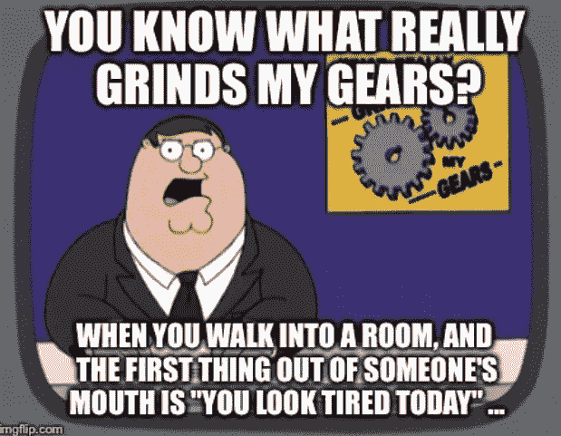
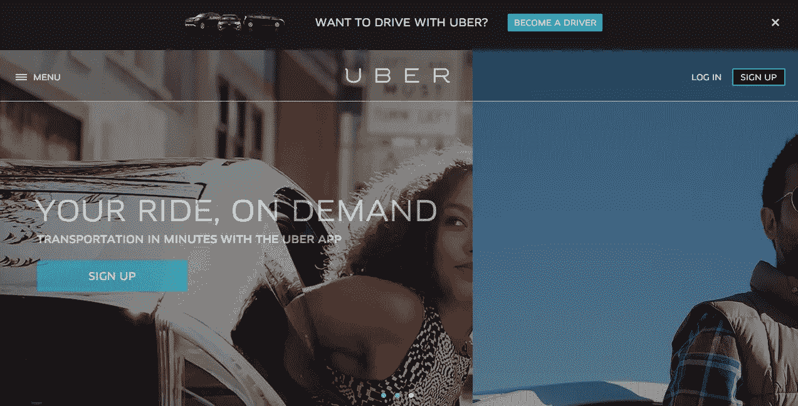
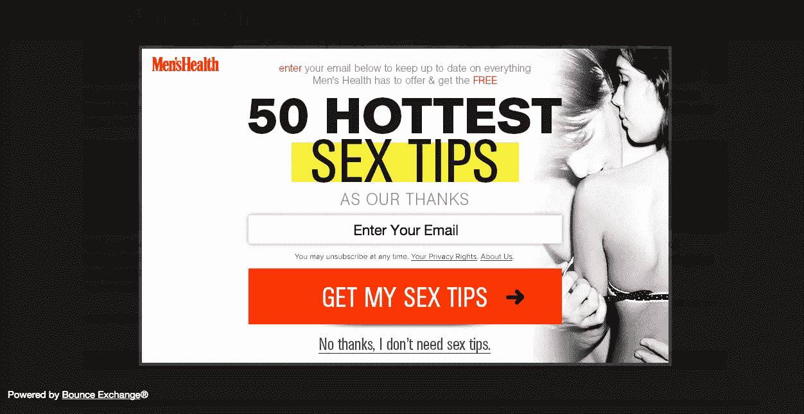
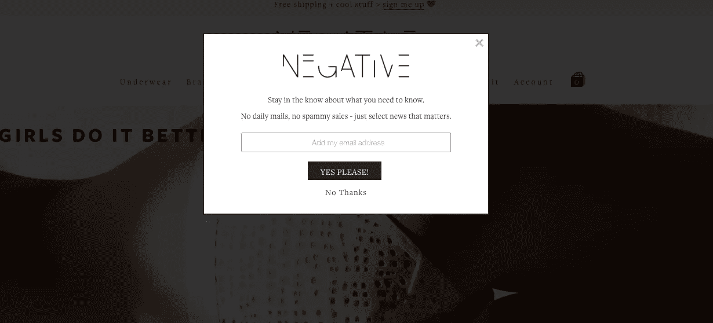
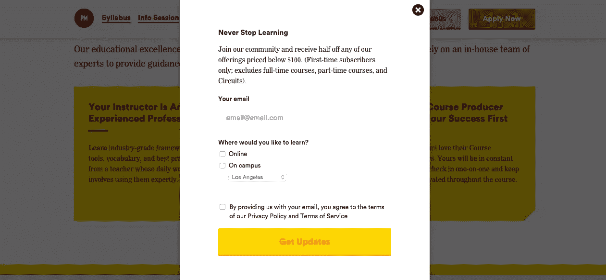

# 4 个让性感回归的弹出窗口的例子

> 原文：<https://www.sitepoint.com/popup-ad-examples/>

弹出窗口有着邪恶的名声。

作为一个互联网浏览器，你可能会毫不停顿地关闭你应得的盒子——所以作为一个设计师或企业家，抵制把它们放在你自己的网站上是可以理解的。

然而，你可能需要重新考虑一下。

弹出窗口——做得好的话——不仅有益于你，也有益于你的网站访问者。

让我们看看一些奇妙的弹出窗口的例子。

## 1.超级的

优步的主页是针对乘客的。

迎接我们的是“按需乘车”和一个敦促我们注册服务的按钮。

然而，优步不仅仅需要吸引用户，还需要招募司机。

为此，一个小的、非侵入性的黑框会在屏幕上方弹出，询问“想和优步一起开车吗？成为一名司机。”

点击行动号召(CTA)按钮，您将进入一个登录页面，了解成为优步“合作伙伴”的好处以及创建驾驶员帐户的选项。

但是，如果您选择关闭窗口，它将不会再次出现，至少在您清除浏览数据之前不会出现。这确保了对成为司机不感兴趣的人不会被重复出现的弹出窗口所困扰。

### 要点:

如果像优步一样，你是一个双边市场(意味着你在消费者和生产者之间充当中间人)，使用弹出窗口是一个很好的方式来锁定双方，同时保持你的网站简单易懂。

此外，考虑使用滑动到页面顶部或底部的弹出窗口。人们讨厌弹出窗口的原因之一是因为他们不得不停止他们正在做的事情来关闭窗口。但是，如果你的弹出窗口是微妙的，不中断的，你的访问者不会感到恼火。

最后，如果可以的话，创建一个弹出窗口，每个用户只显示一次。这样，你就不会强迫那些对优惠不感兴趣的人一次又一次地取消窗口。

## 2.*男性健康*

营销人员通常使用恐惧作为激励手段。例如，好事达向你展示[昂贵而痛苦的事故](https://www.allstate.com/advertising.aspx)的片段，让你购买保险，而佳洁士提醒你口腔中的[牙菌斑和细菌](http://crest.com/en-us/products/mouthwash)，鼓励你购买漱口水。

这个*男性健康*弹出窗口也是用同样的手法达到辉煌的效果。要关闭弹出窗口，你必须拒绝“免费性提示”的提议——你必须承认“不，我不想要免费的性提示。”

这是无耻的企图羞辱你；毕竟谁不想在床上更好呢？暗示一个人不是一个令人满意的爱人会促使许多访问者输入他们的电子邮件地址，从而获得性提示(并订阅男性健康通讯)。

### 要点:

使点击弹出窗口不受欢迎。最简单的方法是创建一个 CTA，让人们觉得不好拒绝。

假设你的创业公司提供项目管理软件。您的弹出窗口显示:

**在此输入您的电子邮件地址，免费试用我们的产品 14 天，让您事半功倍！**

要让弹出窗口消失，必须单击:

不，谢谢，我不想做得更快。

不含蓄，但是会提高你的报名率。

男性健康的弹出窗口也做得很好，因为它只在访问者在网站上停留 5-10 秒后才会出现。这让人们有机会在面对广告之前读一点。

因为在一个页面上花 5 秒钟意味着访问者通常对内容感兴趣，所以他或她比只在页面上呆了一秒钟的人更有可能对弹出窗口感兴趣。

## 3.阴性内衣

对于一个完美的品牌弹出窗口的例子，只需看看消极的内衣。这个内衣系列以其极简主义和轻松的酷来定义自己，说:“在一个被抬高和过度的世界里，我们不是。”

它的弹出窗口扩展了“负面比其他品牌更真实”的理念，承诺“没有每日邮件，没有垃圾销售——只选择重要的新闻。”

因此，客户的信任是负面的。她并不觉得自己被操纵和迎合，而是觉得自己被允许加入一个高级俱乐部。请注意:该公司特别使用“新闻”而不是“公告”或“更新”，因为这个词意味着重要、严肃的信息。

### 要点:

当你创建弹出窗口时，不要忘记它是你网站的一个组成部分，比如说，你的博客或者关于页面。这意味着弹出窗口应该用和你的文案的其他部分一样的声音、语调和价值观来写。

此外，要立即与站点访问者建立信任，请明确弹出窗口的目的。如果你正在收集简讯注册，告诉人们你的简讯包括什么，以及他们大概多久来一次。如果你要赠送一本电子书，包括人们将如何访问它——通过下载一个 PDF，通过点击进入专用网址，通过收到一封附有电子书的电子邮件，等等。如果作为电子书的交换，你要给人们发送关于你公司的每周更新，确保也包括这一点。

## 4.联合国大会

折扣或优惠代码弹出窗口是最常见的一种，这是有充分理由的:如果有人对你的产品或服务感兴趣，他或她可能会抓住机会节省一些钱。

这不仅是获得合格销售线索的好方法，而且还能鼓励购买。[三分之一的零售商](http://www.emarketer.com/Article/Online-Discounts-vs-Free-Shipping-Battle-of-Ages/1011219)表示，这些折扣是最有效的顾客激励措施， [83%的消费者](http://www.businesswire.com/news/home/20130822005390/en/National-Study-Finds-Retailers-Shopper-Motivation-Loyalty#.VetUWdNViko)表示，他们会因为得到折扣而自发购买商品， [68%的人表示](http://retailmenot.mediaroom.com/2014-09-08-We-Are-a-Coupon-Nation)促销和优惠券会提高他们的品牌忠诚度。

但是宣传片背后的心理学并不是 GA 的弹出窗口如此成功的唯一原因。该公司还利用该表格收集访问者的重要信息，包括他们对哪种课程感兴趣，以及他们住在哪个城市。GA 将使用这些详细信息创建个性化电子邮件。

### 要点:

使用您的弹出窗口与潜在客户达成交易。你将增加他们点击“购买”的可能性——即使你没有，如果你得到了他们的电子邮件地址，你也有机会在将来转化他们。

弹出窗口也是了解网站访问者更多信息的好方法。您可以使用这些数据来完善和改进您的产品或发送有针对性的公告和优惠。你对你的受众了解得越多，你就能更好地向他们推销。

在你的网站上放一个弹出窗口不会让你变得邪恶——事实上，它会让你成为一个很好的伙伴。当你弹出正确，每个人都赢了。

## 分享这篇文章