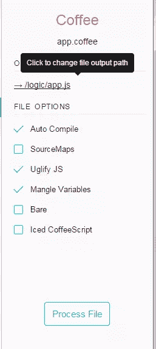

# 实用咖啡脚本:制作井字游戏

> 原文：<https://www.sitepoint.com/practical-coffeescript-tic-tac-toe/>

CoffeeScript 是一种编译成 JavaScript 的小型语言。运行时没有解释，因为你写 CoffeeScript，把它编译成 JavaScript，然后把结果 JavaScript 文件用于你的应用。您可以在 CoffeeScript 中使用任何 JavaScript 库(例如 jQuery ),只需通过适当的 CoffeeScript 语法使用它的特性。CoffeeScript 既可以用于前端编写 JavaScript，也可以用于后端编写 JavaScript。

## 那么为什么是 CoffeeScript 呢？

### 较少代码

根据关于 CoffeeScript 的小书，CoffeeScript 的语法减少了你需要输入的字符数量，使你的 JS 工作减少了大约 33%到 50%。我将展示一个使用 CoffeeScript 创建的简单井字游戏(您可能已经从标题中猜到了)，它的原始 CoffeeScript 格式包含 4963 个字符，而编译后的 JavaScript 代码包含 7669 个字符。相差 2706 个字符或 36%！

### 更快的开发时间

因为你写得更短，更不容易出错(例如，变量是自动作用域的，这意味着你不会因为省略`var`而意外覆盖全局变量)，你可以更快地完成你的项目。CoffeeScript 简洁的语法也使得代码更加可读，最终代码更容易维护。

## 入门指南

在本文中，我们将使用 CoffeeScript 和 jQuery 构建一个简单的井字游戏。如果您想在研究实际案例之前阅读语法，我建议我的文章用 CoffeeScript 加速您的 JavaScript 开发。这也详细说明了如何通过 npm(节点包管理器)安装 CoffeeScript。

与以往一样，本教程的所有代码都可以在 GitHub 上[获得，演示可以在](https://github.com/sitepoint-editors/tic-tac-toe) [CodePen](http://codepen.io/SitePoint/pen/VLxypw) 或教程的结尾获得。

您将使用的最常见 CoffeeScript 命令是:

`coffee -c fileName`将把 CoffeeScript 文件编译成一个文件名相同但扩展名为`.js`的文件(CoffeeScript 文件通常扩展名为`.coffee`)。

`coffee -cw fileName`将监视文件中的变化(无论何时保存文件)并编译它。

`coffee -cw folderName/`将监视文件夹中所有`.coffee`文件的更改，并在有任何更改时将它们编译到同一目录中。

最后，将 CoffeeScript 从包含`.coffee`文件的文件夹编译到只包含`.js`文件的文件夹是很方便的。

`coffee -o js/ -cw /coffee`将监视位于`coffee`文件夹中的所有`.coffee`文件的变化，并将输出(JavaScript)放在`js`文件夹中。

如果您对终端不感兴趣，可以使用带有 GUI 的工具来处理 CoffeeScript 文件。例如，你可以免费无限制试用 [Prepros](https://prepros.io/) (尽管如果你喜欢，你必须购买)。下图显示了它提供的一些选项:



你可以看到 Prepros 为你做了所有的工作——它设置了观察器，所以你的`.coffee`文件将被编译成 JS，它允许你使用丑陋的 JS 来缩小/压缩你的代码，它可以自动破坏变量，它支持[冰咖啡脚本](http://maxtaco.github.io/coffee-script/)。Prepros 也可以用于 Less 和 Sass 等 CSS 预处理程序和 Jade 等模板引擎。

## 游戏

让我们从标记开始:

```
<div class="wrapper">
  <header class="text-center">
    <h1>Tic Tac Toe</h1>
  </header>

  <div id="board"></div>
  <div class="alerts welcome"></div>
  <div class="notifications"></div>

  <form action="" method="POST">
    ...
  </form>
</div>

<script src="jquery.min.js"></script>
<script src="logic/app.js"></script>
```

游戏的界面包括以下内容:

*   简要描述游戏的标题
*   一个 id 为`board`的 div 元素，它是 3×3 个正方形的位置
*   一个 div 元素，带有一个显示游戏状态的类`alerts`
*   一个 div 元素，带有一个类`notifications`，它将显示谁在玩 X 和 O，以及一般的玩家统计数据。
*   一个只有在游戏加载时才会显示的表单，它会提示玩家输入他们的名字。

根据最佳实践，jQuery 和使我们的应用程序运行的脚本都在结束 body 标记之前加载。

## 造型

使用 CSS，我们可以通过浮动每个正方形并每隔四个清除一个正方形，使所涉及的九个正方形出现在一个 3×3 的网格中。

```
.square:nth-of-type(3n + 1) {
  clear: both;
}
```

我们还可以根据方块是否有类`x`或`o`(使用 JavaScript 添加)来添加不同的颜色。

```
.square.x {
  color: crimson;
}

.square.o {
  color: #3997ff;
}
```

## CoffeeScript 正在运行

作为参考，你可以在这里找到主 CoffeeScript 文件[。](https://github.com/sitepoint-editors/tic-tac-toe/blob/master/logic/app.coffee)

你可以看到我们的井字游戏应用程序以`$ ->`开始，这相当于 jQuery 在 DOM 准备就绪时执行代码的函数的简写:`$(function() { ... });`。

CoffeeScript 不依赖分号和大括号，而是依赖缩进。告诉 CoffeeScript 您正在定义一个函数，这样您就可以在下一行开始函数体，并将函数体缩进两个空格。

接下来，我们创建一个名为`Tic`的对象，它本身包含一个名为`data`的对象。您可以看到，在创建对象时，大括号或逗号不是必需的，只要您正确地缩进属性。

```
$ ->
  Tic =
    data:
      turns: 0
      x: {}
      o: {}
      gameOver: false
```

属性将保存游戏中的总回合数。我们可以检查它是偶数还是奇数，这样就可以确定是轮到 X 还是 o。

`x`和`o`属性是对象，将包含与对游戏重要的三个轴上的 X 或 O 的数量相关的数据:水平、垂直和对角线。它们将通过`checkEnd`方法在每次移动时更新，以表示 X 和 O 在棋盘上的分布。然后，`checkEnd`方法将调用`checkWin`来确定是否有赢家。

之后，我们在`Tic`对象中有了一个方法，它将启动并运行一切:

```
initialize: ->
  @data.gameOver = false
  @.setPlayerNames()
  @.retrieveStats()
  @.assignRoles()
  @.prepareBoard()
  @.updateNotifications()
  @.addListeners()
```

注意`@`的使用，它编译成 JavaScript 关键字`this`。如`initialize`的第一个属性所示，在设置或调用属性或方法时，可以跳过`@`关键字后的点。

通过给这些方法起合理的名字，我们对它们在做什么有了一个相当清楚的概念:

*   `setPlayerNames`将用户在输入中输入的值存储到`data`对象中。
*   `retrieveStats`从 localStorage 中检索玩家的统计数据，并在`data`对象中设置它们。
*   `assignRoles`决定谁在玩 X，谁在玩 o。
*   隐藏表单，删除任何通知，清空面板并用九个空方块填充。
*   `updateNotifications`用谁在玩 X，谁在玩 O 的信息，以及玩家的统计数据更新 UI。
*   附加事件监听器，这样我们就可以对玩家的行动做出响应。

### 潜得更深

让我们更详细地看看其中的一些方法。

```
prepareBoard: ->
  ...
  $("<div>", {class: "square"}).appendTo("#board") for square in [0..8]
```

这里我们迭代了九次，将九个带有类`square`的 div 添加到空白板上，以便填充它。这演示了 CoffeeScript 如何让您编写一行循环，并在编写条件本身之前声明循环体。

```
updateNotifications: ->
  $(".notifications").empty().show()
  @.addNotification "#{@data.player1} is playing #{@data.rolep1}"
  ...
```

CoffeeScript 允许字符串插值，这增加了可读性，降低了复杂性和代码长度。您可以在任何字符串中添加一个`#{}`，并在括号中插入任何变量或函数调用的返回值。

```
addNotification: (msg) ->
  $(".notifications").append($("<p>", text: msg));
```

`addNotification`方法演示了如何在 CoffeeScript 中定义参数。你把它们写在箭头前(`->`):

您可以为类似 PHP 的参数提供默认值:

```
addNotification: (msg = "I am a message") ->
```

当编译带有默认参数的函数时，它被转换为:

```
if (msg == null) { msg = "I am a message"; }
```

最后，让我们转向`addListeners`方法:

```
addListeners: ->
  $(".square").click ->
    if Tic.data.gameOver is no and not $(@).text().length
      if Tic.data.turns % 2 is 0 then $(@).html("X").addClass("x moved")
      else if Tic.data.turns % 2 isnt 0 then $(@).html("O").addClass("o moved")
      ...
```

这里我们看到 CoffeeScript 提供了额外的关键字来表示真值和假值，例如`no`、`yes`、`off`和`on`。另外，`!==`、`===`、`&&`、`!`可以分别用`isnt`、`is`、`and`和`not`来表示。

您可以使用`if ... then ... else ...`语法创建可读的单行条件语句。

## 游戏的机制

最有效的方法`checkEnd`是在玩家每次移动时检查是否有赢家。它通过在棋盘上迭代并计算属于 X 和 o 的方格来实现这一点。它首先检查对角线轴，然后是垂直轴，然后是水平轴。

```
checkEnd : ->
  @.data.x = {}
  @.data.o = {}

  #diagonal check
  diagonals = [[0,4,8], [2,4,6]]
  for diagonal in diagonals
    for col in diagonal
      @.checkField(col, 'diagonal')
    @.checkWin()
    @.emptyStorageVar('diagonal')
  for row in [0..2]
    start = row * 3
    end = (row * 3) + 2
    middle = (row * 3) + 1

    #vertical check
    @checkField(start, 'start')
    @checkField(middle, 'middle')
    @checkField(end, 'end')
    @checkWin()

    #horizontal check
    for column in [start..end]
      @checkField(column, 'horizontal')
    @checkWin()
    @emptyStorageVar('horizontal')
```

如您所见，这利用了另一个方便的 CoffeeScript 特性——ranges。

```
for row in [0..2]
```

这将循环三次，依次设置 row 等于 0、1 和 2。或者，`[0...2]`(独占范围)将导致两次迭代，将 row 设置为 0 和 1。

在水平检查中，我们再次看到缩进是如何决定什么是循环的一部分，什么是循环外的——只有`checkField`调用在内部循环中。

这是`checkField`的样子:

```
checkField: (field, storageVar) ->
  if $(".square").eq(field).hasClass("x")
    if @.data.x[storageVar]? then @.data.x[storageVar]++ else @.data.x[storageVar] = 1
    else if $(".square").eq(field).hasClass("o")
      if @.data.o[storageVar]? then @.data.o[storageVar]++ else @.data.o[storageVar] = 1
```

这个方法演示了`?`关键字的用法，当它被插入到一个条件变量的旁边时，编译成:

```
if (typeof someVariable !== "undefined" && someVariable  !== null) {
```

这显然非常方便。

`checkField`方法的作用是根据被点击的方块的类名，在`x`或`o`属性的适当轴上加一。当用户点击`addListeners`方法中的一个空白方格时，类名被添加。

这就把我们带到了`checkWin`方法，该方法用于检查一个玩家是否赢得了游戏:

```
checkWin: ->
    for key,value of @.data.x
      if value >= 3
        localStorage.x++
        @showAlert "#{@.getPlayerName("X")} wins"
        @data.gameOver = true
        @addToScore("X")
    for key,value of @.data.o
      if value >= 3
        localStorage.o++
        @showAlert "#{@.getPlayerName("O")} wins"
        @data.gameOver = true
        @addToScore("O")
```

在 CoffeeScript 中，您可以使用`for ... in array`遍历数组值，使用`for key,value of object`遍历对象的属性。`checkWin`利用这个来检查`x`和`o`对象内部的所有属性。如果他们中的任何一个拥有大于或等于 3 的数字，那么我们就有一个赢家，游戏应该结束。在这种情况下，我们调用`addToScore`方法，该方法通过`localStorage`持久化玩家的结果。

### 关于本地存储的一句话

LocalStorage 是 [Web 存储规范](https://www.w3.org/TR/webstorage/)的一部分，并且有一个非常好的[浏览器支持](http://caniuse.com/#search=localstorage)。它允许你在用户的机器上存储数据(类似于 cookies ),并在你需要的时候访问它。

您可以通过多种方式访问 API，例如，就像访问常规对象的属性一样:

```
//fetch item
localStorage.myProperty 

// set item
localStorage.myProperty = 123
```

本地存储总是保存字符串，所以如果你想存储一个对象或一个数组，你必须在存储数组/对象时使用`JSON.stringify`,在检索时使用`JSON.parse`。

我们的`addToScore`方法利用了这一事实:

```
addToScore: (winningParty) ->
  ...
  if winningParty is "none"
    @.showAlert "The game was a tie"
  else
    ...
    localStorage[@data.player1] = JSON.stringify @data.p1stats
```

它还演示了如何在 CoffeeScript ( `JSON.stringify`)中省略括号，尽管建议只对最外层的函数调用这样做。

接下来，我们有几个实用方法。我们使用`emptyStorageVar`来清除特定水平行或对角线的内容。这是必要的，因为棋盘上有两条对角线，在我们的`chekEnd`方法中，我们对两条对角线使用相同的数据属性。因此，我们必须在检查第二条对角线之前清除属性。水平行也是如此。

```
emptyStorageVar: (storageVar) ->
    @.data.x[storageVar] = null
    @.data.o[storageVar] = null
```

## 获取玩家姓名

当在游戏开始时提交带有玩家姓名的表单时，我们可以阻止它的默认动作，并使用 JavaScript 处理提交。我们检查是否有一个空名称或者两个名称是否相同，如果是，显示一个友好的警告。否则，我们通过调用`Tic.initialize()`开始游戏。

```
$("form").on "submit", (evt) ->
  evt.preventDefault()
  $inputs = $("input[type='text']")
  namesNotEntered = $inputs.filter(->
    return @.value.trim() isnt ""
  ).length isnt 2
  namesIndentical = $inputs[0].value is $inputs[1].value
  if namesNotEntered then Tic.showAlert("Player names cannot be empty")
  else if namesIndentical then Tic.showAlert("Player names cannot be identical")
  else Tic.initialize()
```

最后一行使用事件委托让类为`play-again`的任何元素响应一次点击。事件委托是必要的，因为这个元素只有在游戏结束后才会添加到页面中。首次呈现 DOM 时，它不存在。

```
$("body").on("click", ".play-again", -> Tic.initialize())
```

## 把所有的放在一起

仅此而已。在不到 150 行的 CoffeeScript 中，我们有一个可用的游戏。别忘了，你可以从 GitHub 下载本教程[的代码。](https://github.com/sitepoint-editors/tic-tac-toe)

通过[码笔](http://codepen.io)上的 SitePoint ( [@SitePoint](http://codepen.io/SitePoint) )看笔[井字](http://codepen.io/SitePoint/pen/VLxypw/)。