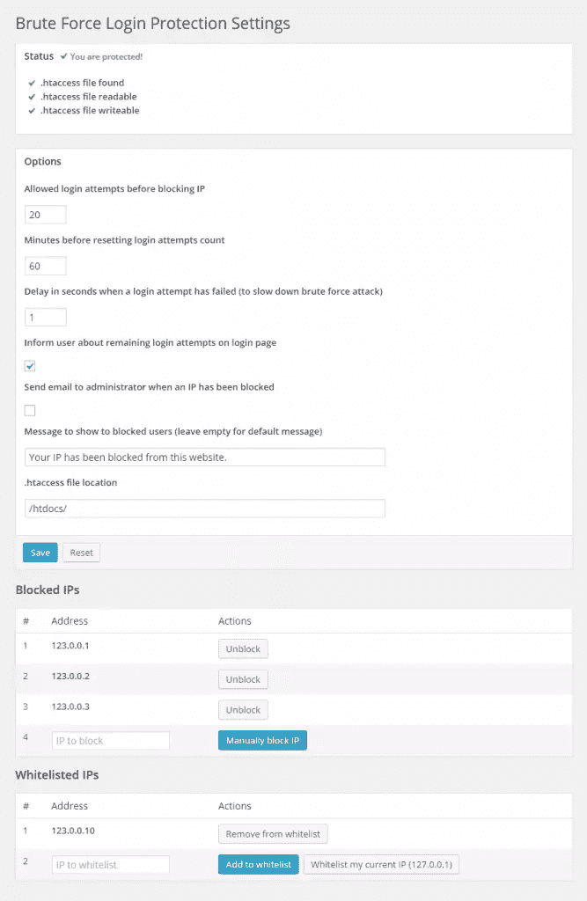
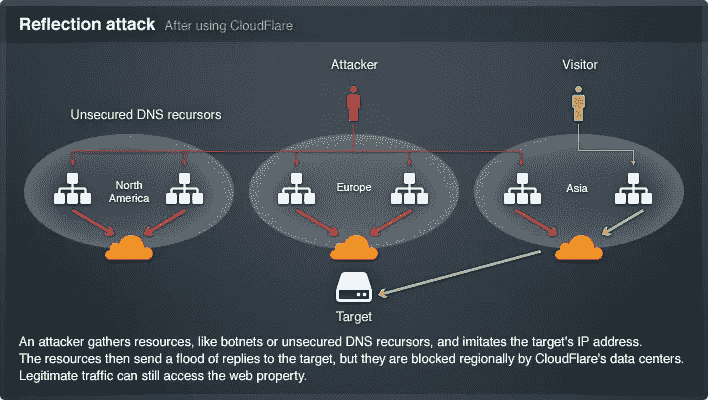

# 防止对 WordPress 网站的暴力攻击

> 原文：<https://www.sitepoint.com/preventing-brute-force-attacks-against-wordpress-websites/>

“暴力”登录攻击是一种针对网站的攻击，通过反复猜测用户名和密码来获得对网站的访问权限。其他类型的黑客依靠网站漏洞，而暴力攻击是一种简单的碰运气方法，可以在任何网站上尝试。

在本教程中，我们将介绍一些方法和插件，可以用来防止对 WordPress 站点的暴力攻击。WordPress 是最流行的 CMS，因此它是这类攻击的常见目标。

## 暴力攻击和 DDoS 攻击有什么区别？

进行暴力攻击是为了获得对网站上其他人的帐户的访问权限，而 DDoS 攻击通常是为了关闭网站(通常通过消耗资源)。也就是说，大规模暴力攻击也可以让一个网站瘫痪。

DDoS 攻击通常使用机器人来执行，而暴力攻击可以使用机器人或由人来进行。人类可以发动更有针对性的攻击，特别是如果他们知道用户名或有其他情报来缩小可能的凭据。

这两种攻击都不依赖于网站漏洞，可以应用于任何网站。

WordPress 没有任何内置功能来防止这两种类型的攻击。因此，您有责任在自己的网站上阻止它们。

本教程将向您展示如何防止暴力攻击。

## 如何对 WordPress 站点发起暴力攻击？

对一个站点发起暴力攻击相对来说比其他任何类型的攻击都要容易。要对登录用户帐户的站点发起暴力攻击，您只需发送带有猜测的用户名和密码的登录表单 POST 请求。

在 WordPress 的情况下，带有猜测的用户名和密码的 POST 请求被一次又一次地发送到`wp-login.php`文件。

让我们来看看一些防止暴力攻击的方法。

## 验证你是人类

大多数时候，暴力攻击是使用机器人进行的。我们可以简单地验证表单是否是由人提交的。如果它是由机器人提交的，我们就不会处理它。

Agbonghama Collins 在 SitePoint 上写了一篇文章，介绍如何在 WordPress 登录表单中集成 Google 的无验证码 reCAPTCHA。没有验证码 reCAPTCHA 是一个简单和用户友好的方式，要求网站访问者在提交表单时验证他们是否是人类。

使用这种方法存在以下问题:

1.  WordPress 无论如何都会处理这个请求，因此，如果机器人大规模地进行暴力攻击，那么仍然会消耗资源，从而导致网站瘫痪。
2.  这种方法可以防止接触机器人，但不能防止接触人类。

## 密码保护`wp-login.php`

您可以使用 HTTP 基本认证来保护对您的`wp-login.php`文件的访问。这只是增加了一个额外的安全层。虽然可以对 HTTP 基本认证发起暴力攻击，但是破解这两个层是困难且费时的。

要在 Apache 中用密码保护对`wp-login.php`文件的访问，请遵循以下步骤:

1.  使用 [htpasswd 生成器](http://www.htaccesstools.com/htpasswd-generator/)生成一个`.htpasswd`文件。
2.  将该文件放在与您的`.htaccess`文件相同的位置。
3.  假设您的`.htpasswd`文件包含用户名`narayanprusty`，将下面的代码放到您的`.htaccess`文件中

```
## Stop Apache from serving .htpasswd files
<Files ~ "^\.ht"> Order allow,deny Deny from all </Files>

<Files wp-login.php>
AuthUserFile ~/.htpasswd
AuthName "Private access"
AuthType Basic
require user narayanprusty
</Files>
```

使用这种方法存在以下问题:

1.  如果你的 WordPress 站点有多个作者，那么你可能不想共享基本认证的用户名和密码。
2.  机器人或人类有可能成功猜出两个密码。
3.  虽然 WordPress 在基本认证期间没有加载，但是 web 服务器会启动一个过程来验证凭证，因此会消耗内存和 CPU，如果请求量很大的话，这可能会杀死一个站点。

## 强力登录保护插件

[暴力登录保护](https://wordpress.org/plugins/brute-force-login-protection/)是一个 WordPress 插件，它通过考虑几个因素来保护暴力登录企图。

插件是这样工作的:

1.  限制 IP 地址允许的登录尝试次数。
2.  它允许你手动阻止一个 IP 地址登录 WordPress
3.  它在登录尝试失败后延迟执行，以减缓暴力攻击。这样可以防止站点被杀。
4.  它还通知用户在被阻止之前剩余的登录尝试次数。

这是插件设置页面的外观:



以下是使用该插件时出现的问题:

1.  它将不能很好地处理分布式暴力攻击，因为这个插件完全依赖于 IP 地址。分布式暴力攻击是由许多不同的计算机(即不同的 IP 地址)发起的攻击。
2.  如果之前登录失败，它会延迟 IP 地址的脚本执行。虽然这样可以节省计算时间，但是由于进程是在内存中创建的，所以仍然需要使用内存。

## 布鲁特保护

[BruteProtect](https://wordpress.org/plugins/bruteprotect/) 是一款云端暴力攻击防御插件，旨在为僵尸网络攻击提供最佳防护。

每一个安装了 BruteProtect 的 WordPress 网站都将成为 BruteProtect 网络的一部分。当一个 IP 地址由于恶意活动(例如多次失败的登录尝试)而被阻止时，它会在所有站点之间共享，以便它们可以在它开始危害任何站点之前阻止它。

你可以把 BruteProtect 看作是上述暴力登录保护插件的高级版本，因为它有一个更大的坏机器人列表，因此在分布式暴力攻击的情况下可能做得很好。

BruteProtect 插件没有的一个功能是针对失败的登录尝试减慢脚本执行速度。然而，这并不重要，因为额外的时间会占用内存。

使用这个插件的问题是，WordPress 在每次请求 IP 地址验证时都会被加载。因此，如果暴力攻击的规模足够大，网站仍然会不堪重负而倒下。

## 云耀斑

[CloudFlare](https://support.cloudflare.com/hc/en-us) 保护和加速任何在线网站。一旦您的网站成为 CloudFlare 的一部分，其 web 流量将通过其智能全球网络进行路由。它们会自动优化您的网页的交付，让您的访问者获得最快的页面加载时间和最佳性能。

重要的是它可以防止暴力攻击。它有免费和高级计划。免费计划足以获得相当数量的蛮力保护。我们在上面看到的所有方法都是让我们的 web 服务器做防止暴力攻击的工作，正如我们提到的，暴力攻击仍然会消耗内存和 CPU。但另一方面，CloudFlare 可以在恶意请求攻击您的服务器之前阻止它们。

下图显示了 CloudFlare 如何阻止恶意请求:



以下是使用该服务的问题:
1。您需要更改 DNS 以将 CloudFlare 与您的站点集成。如果你不太懂技术，这可能会很难。
2。它无法阻止人类的暴力攻击。它擅长识别恶意机器人，但不擅长识别恶意人类。

## 结论

你一定想知道哪一个是最好的解决方案？这真的取决于你认为哪一个最符合你的需求。就我个人而言，我使用 CloudFlare 和 BruteProtect 来阻止对我网站的暴力攻击。

让我知道你认为哪一个是防止暴力攻击的最佳解决方案。请在下面留下您的想法和建议。

## 分享这篇文章