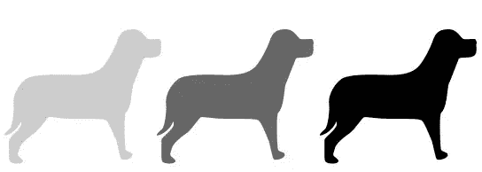
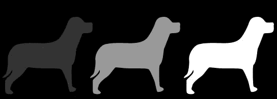
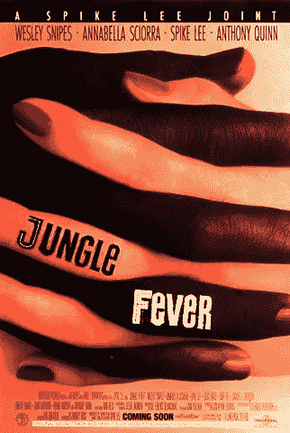
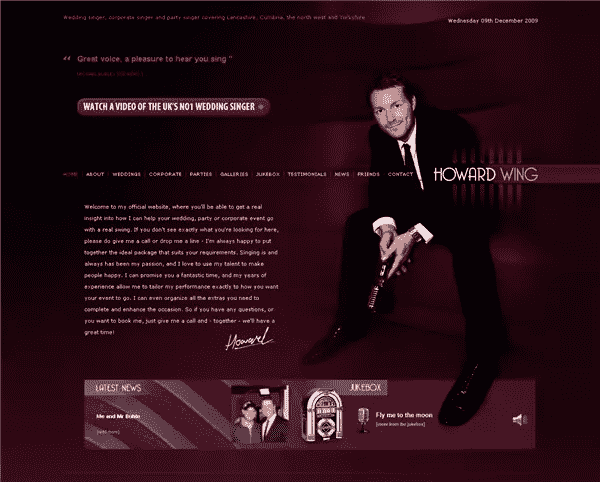
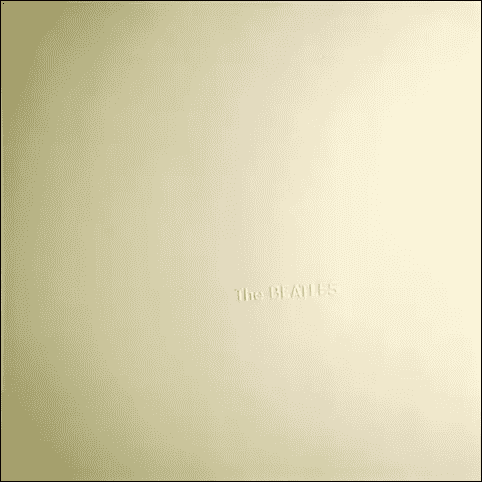

# 设计的原则:价值

> 原文：<https://www.sitepoint.com/principles-of-design-value/>

到目前为止，在这个系列中，我们已经将[平衡](https://www.sitepoint.com/principles-of-good-design-balance/)、[接近](https://www.sitepoint.com/principles-of-design-proximity/)和[对比](https://www.sitepoint.com/principles-of-design-contrast/)作为设计原则。您已经看到了应用这些概念如何帮助您组织信息并使其引人注目。今天我们关注的是价值。价值和色彩作为设计原则是相互关联的，但不是每个设计都有色彩，但每个设计都有价值。那么值是什么*？*

值，有时也称为色调，是对象的相对亮度和暗度。和设计的价格无关！一旦你在空白画布上放置了一个对象(无论是印刷还是网页)，这个元素就有了价值。在下图中，每只狗的轮廓值给人不同的印象。左边的狗有金色的毛吗？他在雾里吗？

**值是相对的**

设计中的每个元素都有一个从 1%黑色到 100%黑色的值。不过，你不会总是在白色或灰色的背景下工作。如果您在黑色背景上工作，该值将是 1%白色到 100%白色。这暗示了价值的另一个品质。价值是相对的。

正如你在上面的例子中看到的，每只狗的值是相对于其他狗的，也是相对于它们所在的背景的。对象与其背景之间的差值越大，[对比度](https://www.sitepoint.com/principles-of-design-contrast/)就越大。在创建设计的外观和感觉时，价值是一个非常强大的工具。

**数值和颜色**

尽管颜色在设计中非常重要(下周我们会谈到颜色)，但是最好的设计并不仅仅依靠颜色来产生影响。一个成功的设计首先应该是黑白分明的，这就是价值发挥的地方。让我们以几个徽标为例。我从 [Logopond](http://logopond.com) 中提取了两个 logos，并对它们进行了去饱和处理。第一个标志在颜色上看起来不错，但在黑白效果上部分消失，标志看起来很弱。

这第二个标志，虽然看起来不像彩色的那么鲜艳，但仍然保持得很好。

你可能会争辩说，也许第一个标志是为了只在网站上使用而设计的，如果是这样的话，没关系。但是你应该经常思考(并尝试)你的设计只用一种颜色会是什么样子。如果设计出现在报纸或传真上，它会崩溃吗？

值可以用来强调。《丛林狂热》的海报展示了两只手紧握在一起，浅色和深色皮肤的手指形成对比。我在以前的设计原则文章中提到过，这些原则很少单独起作用。这张海报也利用平衡和重复来创造引人注目的设计。

Howard Wing 网站简洁优雅，非常有效地运用价值观。整个网站使用的大型深色摄影背景与浅色文本配合得很好。

正如我们在迄今为止的例子中所看到的，价值最常用于创造对比。但是，如果你想创造一个完全不同的心情，用价值观来创造一个缺乏对比。甲壳虫乐队的白色专辑使用白色背景上的白色浮雕文字。没有比这更微妙的了。该值来自浮雕字母投射的阴影暗示。

图片来源:[披头士圣经](http://www.beatlesbible.com)

总而言之，在设计中运用价值时需要考虑的事情。

1.值出现在每个设计的**中。仅仅通过在页面上放置一个元素，就创造了价值。价值观是你选的还是偶然？**

2.想要达到对比，各元素的数值是否足够不同？

3.你选择的价值观引人注目吗？他们是否有助于移动观众的眼睛通过设计。

4.你用你选择的价值观创造了正确的情绪吗？设计应该微妙还是在你脸上？

下周我将通过观察颜色来结束这个系列。我希望你能加入我。

## 分享这篇文章