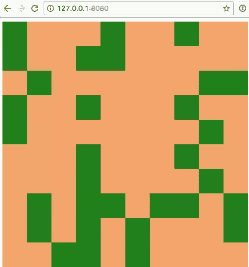
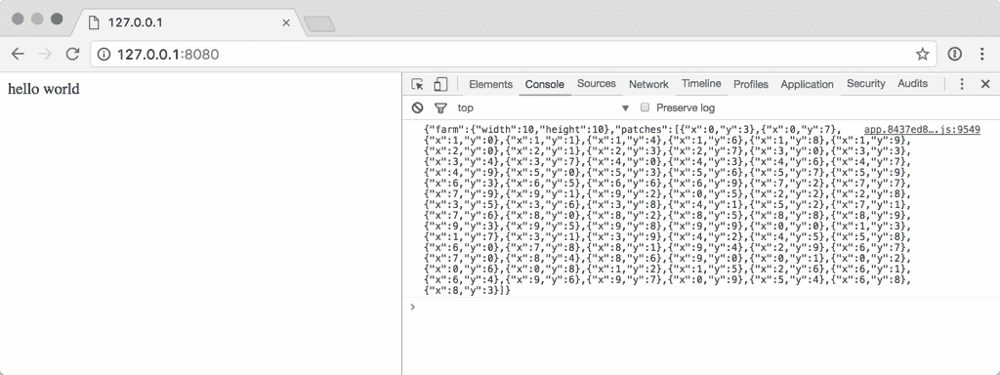
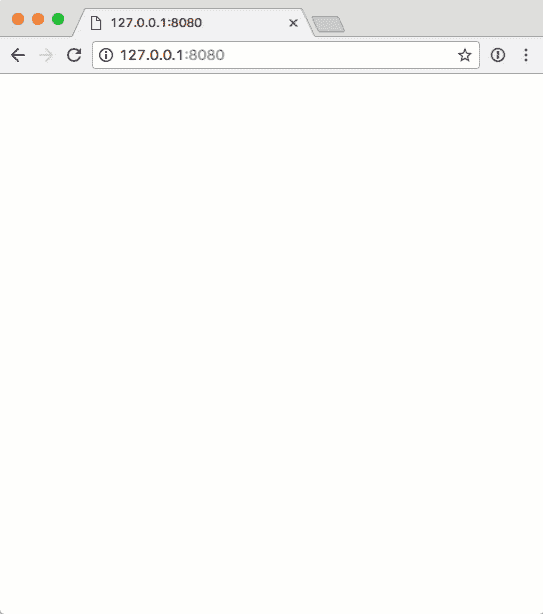

# 用 React、PHP 和 WebSockets 程序化生成游戏地形

> 原文：<https://www.sitepoint.com/procedurally-generated-game-terrain-reactjs-php-websockets/>

**[上次](https://www.sitepoint.com/game-development-with-reactjs-and-php-how-compatible-are-they)，我开始告诉你我想做一个游戏的故事。我描述了如何设置异步 PHP 服务器、Laravel Mix 构建链、React 前端和连接所有这些的 WebSockets。现在，让我告诉你当我开始混合使用 React、PHP 和 WebSockets 构建游戏机制时发生了什么…**

* * *

*这部分的代码可以在[github . com/assert Chris-tutorials/site point-making-games/tree/part-2](https://github.com/assertchris-tutorials/sitepoint-making-games/tree/part-2)找到。我在谷歌浏览器的最新版本中用 PHP `7.1`测试过。*

* * *



## 建造农场

*“让我们从简单的开始。我们有一个 10×10 的瓷砖网格，里面装满了随机生成的东西。”*

我决定将农场表示为一个`Farm`，将每块瓷砖表示为一个`Patch`。来自`app/Model/FarmModel.pre`:

```
namespace App\Model;

class Farm
{
  private $width
  {
    get { return $this->width; }
  }

  private $height
  {
    get { return $this->height; }
  }

  public function __construct(int $width = 10,
    int $height = 10)
  {
    $this->width = $width;
    $this->height = $height;
  }
} 
```

我认为通过用公共 getters 声明私有属性来尝试一下[类访问器宏](https://www.sitepoint.com/how-to-make-modern-php-more-modern-with-preprocessing)会很有趣。为此，我必须安装`pre/class-accessors`(通过`composer require`)。

然后，我更改了套接字代码，允许根据请求创建新的农场。从`app/Socket/GameSocket.pre`开始:

```
namespace App\Socket;

use Aerys\Request;
use Aerys\Response;
use Aerys\Websocket;
use Aerys\Websocket\Endpoint;
use Aerys\Websocket\Message;
use App\Model\FarmModel;

class GameSocket implements Websocket
{
  private $farms = [];

  public function onData(int $clientId,
    Message $message)
  {
    $body = yield $message;

    if ($body === "new-farm") {
      $farm = new FarmModel();

      $payload = json_encode([
        "farm" => [
          "width" => $farm->width,
          "height" => $farm->height,
        ],
      ]);

      yield $this->endpoint->send(
        $payload, $clientId
      );

      $this->farms[$clientId] = $farm;
    }
  }

  public function onClose(int $clientId,
    int $code, string $reason)
  {
    unset($this->connections[$clientId]);
    unset($this->farms[$clientId]);
  }

  // …
} 
```

我注意到这个`GameSocket`与我的前一个非常相似——除了，我没有广播回应，而是检查了`new-farm`,并且只向发出请求的客户端发回了一条消息。

*“也许现在是 React 代码变得不那么通用的时候了。我准备把`component.jsx`改名为`farm.jsx`。”*

从`assets/js/farm.jsx`开始:

```
import React from "react"

class Farm extends React.Component
{
  componentWillMount()
  {
    this.socket = new WebSocket(
      "ws://127.0.0.1:8080/ws"
    )

    this.socket.addEventListener(
      "message", this.onMessage
    )

    // DEBUG

    this.socket.addEventListener("open", () => {
      this.socket.send("new-farm")
    })
  }
}

export default Farm 
```

事实上，我唯一改变的是发送了`new-farm`而不是`hello world`。其他一切都是一样的。不过，我确实不得不修改了`app.jsx`代码。从`assets/js/app.jsx`开始:

```
import React from "react"
import ReactDOM from "react-dom"
import Farm from "./farm"

ReactDOM.render(
  <Farm />,
  document.querySelector(".app")
) 
```

这离我需要的地方还很远，但是使用这些更改，我可以看到类访问器的作用，以及为将来的 WebSocket 交互设计一种请求/响应模式的原型。我打开控制台，看到了`{"farm":{"width":10,"height":10}}`。

*“太好了！”*

然后，我创建了一个`Patch`类来表示每个瓷砖。我认为这是游戏逻辑发生的地方。来自`app/Model/PatchModel.pre`:

```
namespace App\Model;

class PatchModel
{
  private $x
  {
    get { return $this->x; }
  }

  private $y
  {
    get { return $this->y; }
  }

  public function __construct(int $x, int $y)
  {
    $this->x = $x;
    $this->y = $y;
  }
} 
```

我需要创建和新的`Farm`中的空间一样多的补丁。我可以将此作为`FarmModel`建设的一部分。来自`app/Model/FarmModel.pre`:

```
namespace App\Model;

class FarmModel
{
  private $width
  {
    get { return $this->width; }
  }

  private $height
  {
    get { return $this->height; }
  }

  private $patches
  {
    get { return $this->patches; }
  }

  public function __construct($width = 10, $height = 10)
  {
    $this->width = $width;
    $this->height = $height;

    $this->createPatches();
  }

  private function createPatches()
  {
    for ($i = 0; $i < $this->width; $i++) {
      $this->patches[$i] = [];

      for ($j = 0; $j < $this->height; $j++) {
        $this->patches[$i][$j] =
        new PatchModel($i, $j);
      }
    }
  }
} 
```

对于每个单元格，我创建了一个新的`PatchModel`对象。开始时这些都很简单，但它们需要一点随机性——一种种植树木、杂草、花卉的方法……至少在开始时是这样。来自`app/Model/PatchModel.pre`:

```
public function start(int $width, int $height,
array $patches)
{
  if (!$this->started && random_int(0, 10) > 7) {
    $this->started = true;
    return true;
  }

  return false;
} 
```

我想我可以从随机种植一块开始。这并没有改变补丁的外部状态，但它确实给了我一种方法来测试它们是如何被服务器场启动的。从`app/Model/FarmModel.pre`开始:

```
namespace App\Model;

use Amp;
use Amp\Coroutine;
use Closure;

class FarmModel
{
  private $onGrowth
  {
    get { return $this->onGrowth; }
  }

  private $patches
  {
    get { return $this->patches; }
  }

  public function __construct(int $width = 10,
  int $height = 10, Closure $onGrowth)
  {
    $this->width = $width;
    $this->height = $height;
    $this->onGrowth = $onGrowth;
  }

  public async function createPatches()
  {
    $patches = [];

    for ($i = 0; $i < $this->width; $i++) {
      $this->patches[$i] = [];

      for ($j = 0; $j < $this->height; $j++) {
        $this->patches[$i][$j] = $patches[] =
        new PatchModel($i, $j);
      }
    }

    foreach ($patches as $patch) {
      $growth = $patch->start(
        $this->width,
        $this->height,
        $this->patches
      );

      if ($growth) {
        $closure = $this->onGrowth;
        $result = $closure($patch);

        if ($result instanceof Coroutine) {
          yield $result;
        }
      }
    }
  }

  // …
} 
```

这里发生了很多事。首先，我使用宏引入了一个`async`函数关键字。你看，Amp 通过解析承诺来处理`yield`关键字。更重要的是:当 Amp 看到`yield`关键字时，它认为输出的是一个协程(在大多数情况下)。

我本可以让`createPatches`函数成为一个普通的函数，并从中返回一个协程，但这是一段如此普通的代码，我还不如为它创建一个特殊的宏。同时，我可以替换我在上一部分中编写的代码。来自`helpers.pre`:

```
async function mix($path) {
  $manifest = yield Amp\File\get(
    .."/public/mix-manifest.json"
  );

  $manifest = json_decode($manifest, true);

  if (isset($manifest[$path])) {
    return $manifest[$path];
  }

  throw new Exception("{$path} not found");
} 
```

以前，我不得不制作一个发电机，然后把它包在一个新的`Coroutine`:

```
use Amp\Coroutine;

function mix($path) {
  $generator = () => {
    $manifest = yield Amp\File\get(
      .."/public/mix-manifest.json"
    );

    $manifest = json_decode($manifest, true);

    if (isset($manifest[$path])) {
      return $manifest[$path];
    }

    throw new Exception("{$path} not found");
  };

  return new Coroutine($generator());
} 
```

我像以前一样开始使用`createPatches`方法，为网格中的每个`x`和`y`创建新的`PatchModel`对象。然后我开始了另一个循环，在每个补丁上调用`start`方法。我会在同一个步骤中完成这些，但是我希望我的`start`方法能够检查周围的补丁。这意味着我必须首先创建所有的补丁，然后才能确定哪些补丁是相互关联的。

我还修改了`FarmModel`来接受一个`onGrowth`闭包。这个想法是，如果一个补丁增长了(即使在引导阶段)，我可以调用这个闭包。

每次补丁增长时，我都会重置`$changes`变量。这确保了补丁将保持增长，直到整个农场没有产生任何变化。我还调用了`onGrowth`闭包。我想让`onGrowth`成为一个正常的闭包，或者甚至返回一个`Coroutine`。这就是为什么我需要让`createPatches`成为一个`async`函数。

注意:不可否认，允许协程有点复杂，但是我认为当补丁增加时，允许其他异步操作是必要的。也许以后我会想发送一个套接字消息，只有当`yield`在`onGrowth`内部工作时，我才能这么做。如果`createPatches`是一个`async`函数，我只能给出`onGrowth`。因为`createPatches`是一个`async`函数，所以我需要在`GameSocket`内部放弃它。

当开发第一个异步 PHP 应用程序时，很容易对所有需要学习的东西感到厌烦。不要太早放弃！”

我需要编写的最后一点代码在`GameSocket`中，以检查这一切是否正常。来自`app/Socket/GameSocket.pre`:

```
if ($body === "new-farm") {
  $patches = [];

  $farm = new FarmModel(10, 10,
  function (PatchModel $patch) use (&$patches) {
    array_push($patches, [
      "x" => $patch->x,
      "y" => $patch->y,
    ]);
  }
);

yield $farm->createPatches();

$payload = json_encode([
  "farm" => [
    "width" => $farm->width,
    "height" => $farm->height,
  ],
  "patches" => $patches,
]);

yield $this->endpoint->send(
  $payload, $clientId
);

$this->farms[$clientId] = $farm;
} 
```

这只是比我之前的代码稍微复杂一点。我需要向`FarmModel`构造函数提供第三个参数，并产生`$farm->createPatches()`，这样每个人都有机会随机化。之后，我只需要将补丁的快照传递给套接字负载。



每个农场的随机补丁

“如果我把每一片都当成干燥的泥土，会怎么样？然后我可以让一些地方有杂草，而另一些地方有树…”

我开始定制补丁。从`app/Model/PatchModel.pre`开始:

```
private $started = false;

private $wet {
  get { return $this->wet ?: false; }
};

private $type {
  get { return $this->type ?: "dirt"; }
};

public function start(int $width, int $height,
array $patches)
{
  if ($this->started) {
    return false;
  }

  if (random_int(0, 100) < 90) {
    return false;
  }

  $this->started = true;
  $this->type = "weed";

  return true;
} 
```

我稍微改变了一下逻辑的顺序，如果补丁已经启动，就提前退出。我也减少了成长的机会。如果这两种早期退出都没有发生，那么斑块类型将变为杂草。

然后，我可以将此类型用作套接字消息有效载荷的一部分。从`app/Socket/GameSocket.pre`开始:

```
$farm = new FarmModel(10, 10,
function (PatchModel $patch) use (&$patches) {
  array_push($patches, [
    "x" => $patch->x,
    "y" => $patch->y,
    "wet" => $patch->wet,
    "type" => $patch->type,
  ]);
}
); 
```

## 渲染农场

是时候使用我之前设置的 React 工作流显示农场了。我已经得到了农场的`width`和`height`，所以我可以让每一个地块都变干(除非它应该长杂草)。来自`assets/js/app.jsx`:

```
import React from "react"

class Farm extends React.Component
{
  constructor()
  {
    super()

    this.onMessage = this.onMessage.bind(this)

    this.state = {
      "farm": {
        "width": 0,
        "height": 0,
      },
      "patches": [],
    };
  }

  componentWillMount()
  {
    this.socket = new WebSocket(
      "ws://127.0.0.1:8080/ws"
    )

    this.socket.addEventListener(
      "message", this.onMessage
    )

    // DEBUG

    this.socket.addEventListener("open", () => {
      this.socket.send("new-farm")
    })
  }

  onMessage(e)
  {
    let data = JSON.parse(e.data);

    if (data.farm) {
      this.setState({"farm": data.farm})
    }

    if (data.patches) {
      this.setState({"patches": data.patches})
    }
  }

  componentWillUnmount()
  {
    this.socket.removeEventListener(this.onMessage)
    this.socket = null
  }

  render() {
    let rows = []
    let farm = this.state.farm
    let statePatches = this.state.patches

    for (let y = 0; y < farm.height; y++) {
      let patches = []

      for (let x = 0; x < farm.width; x++) {
        let className = "patch"

        statePatches.forEach((patch) => {
          if (patch.x === x && patch.y === y) {
            className += " " + patch.type

            if (patch.wet) {
              className += " " + wet
            }
          }
        })

        patches.push(
          <div className={className}
          key={x + "x" + y} />
        )
      }

      rows.push(
        <div className="row" key={y}>
        {patches}
        </div>
      )
    }

    return (
      <div className="farm">{rows}</div>
    )
  }
}

export default Farm 
```

我忘了解释前面的`Farm`组件在做什么。React 组件是一种思考如何构建接口的不同方式。他们改变了一个人的思维过程，从“当我想改变一些东西时，我如何与 DOM 交互？”到“对于任何给定的上下文，DOM 应该是什么样子？”

我的意思是认为`render`方法只执行一次，它产生的所有东西都将被转储到 DOM 中。我可以使用像`componentWillMount`和`componentWillUnmount`这样的方法来挂钩其他数据点(比如 WebSockets)。当我通过 WebSocket 接收更新时，我可以更新组件的状态，只要我已经在构造函数中设置了初始状态。

这导致了一个丑陋的，尽管功能强大的 div 集。我开始添加一些样式。从`app/Action/HomeAction.pre`开始:

```
namespace App\Action;

use Aerys\Request;
use Aerys\Response;

class HomeAction
{
  public function __invoke(Request $request,
  Response $response)
  {
    $js = yield mix("/js/app.js");
    $css = yield mix("/css/app.css");

    $response->end("
    <link rel='stylesheet' href='{$css}' />
    <div class='app'></div>
    <script src='{$js}'></script>
    ");
  }
} 
```

从`assets/scss/app.scss`开始:

```
.row {
  width: 100%;
  height: 50px;

  .patch {
    width: 50px;
    height: 50px;
    display: inline-block;
    background-color: sandybrown;

    &.weed {
      background-color: green;
    }
  }
} 
```

生成的农场现在有了一点颜色:



你得到一个农场，你得到一个农场…

## 摘要

这绝不是一场完整的游戏。它缺乏重要的东西，如玩家输入和玩家角色。这不是很多人。但是这次会议加深了对 React 组件、WebSocket 通信和预处理程序宏的理解。

我期待着下一部分，在那里我可以开始接受玩家的输入，并改变农场。也许我甚至会从玩家登录系统开始。也许有一天！

## 分享这篇文章