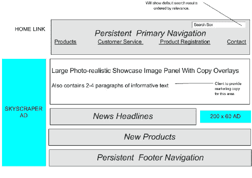
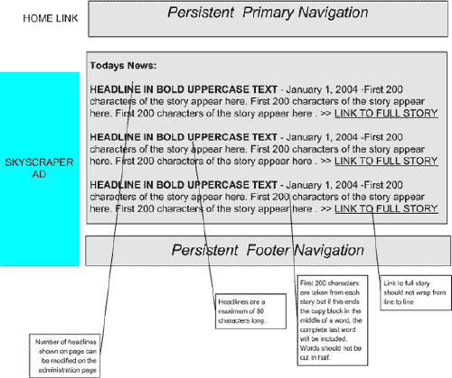

# 流程和文件简介第 1-5 部分

> 原文：<https://www.sitepoint.com/process-and-documentation/>

访问一般网络开发公司的网站，你肯定会发现有一个部分专门介绍“我们的过程”或“我们的方法”，通常由一个简单的图表组成，显示 3 或 4 个“成功的简单步骤”之间的关系。一些网络公司试图通过让所有步骤都以同一个字母开始——定义、开发、交付——或者创造一个友好的缩写词，让他们的流程看起来更容易记。

这种方法可能看起来对潜在客户很有吸引力，但是在文字游戏之下，绝大多数小型、中型和精品网站开发人员没有真正的过程可言。管理 Web 项目几乎总是一项具有挑战性且不可预测的工作。尽管如此，大多数网页设计和开发公司仍然依赖随意的电子邮件和 word 文档来管理他们的项目。

本系列面向那些希望通过将业内成熟的方法整合到开发过程中来增强其服务产品、专业性和收入能力的开发人员。

通过这个系列，我们将探索 Web 项目文档化和管理的现实，比较一些典型的方法和过程系统，并学习如何应用它们来最大化它们对您和您的客户的价值。我们还将看一些概念，这些概念应该有助于使您相信，您在过程、文档和最佳实践上投入的时间和精力，绝对是确保您的客户满意和您自己的利润的最佳投资。

以下是我们将在本系列的每一部分中讨论的内容:

1.  Web 开发人员的文档技术(从下面开始)

3.  [Web 和软件开发的通用流程](https://www.sitepoint.com/process-and-documentation/)

5.  [工艺规划的平衡方法](https://www.sitepoint.com/process-and-documentation/)

7.  [编写有效的规范](https://www.sitepoint.com/process-and-documentation/)

9.  [连接各个点——真实世界的实施](https://www.sitepoint.com/process-and-documentation/)

##### 第 1 部分 Web 开发人员的文档技术

如果你以制作 1000 美元的宣传册类网站为生，你不会同时处理多个项目，你只有友好合作的客户，你可能不需要这些信息。有很多独立的承包商使用很少或没有文档或方法成功地交付项目，但是这些人是很少的。

许多开发人员选择在一个又一个项目中“游刃有余”,并对过程系统的价值持怀疑态度。然而，大多数 Web 开发人员和设计人员希望发展他们的业务，提高他们的客户保持率和产品质量，并赚更多的钱。

如果您属于后一类，请继续阅读，我们将探索过程和文档的可能性和好处。

##### 为什么记录？信念的飞跃

相信优秀文档的价值通常是长时间“辛苦工作”的结果。糟糕的文档是非常非常昂贵的，一旦你学会将糟糕的文档的影响与你的底线联系起来，这一点就会变得非常明显。

谁“相信”,谁只是说说而已，这总是显而易见的。坚持使用真实过程的供应商通常是为他们自己，而不是为他们的客户。他们想节省时间和金钱。他们希望通过高质量的工作来提高盈利能力，并最大限度地留住客户。做好质量工作的最好方法是实施一个过程，允许客户和供应商有清晰的沟通，在项目中有共同的角色，明确的目标，以及处理问题的灵活性。

良好的流程和文档实践有助于通过以下方式实现这一目标:

1.  良好的需求和规范通过“锁定”项目范围来确保项目保持足够的利润空间，从而避免由于项目计划中的模糊性或差距而导致的代价高昂的变更。

*   一份好的书面记录加上强制性的客户签字认可，可以鼓励客户阅读和理解项目的细节，或者至少签字认可文档，并对达成的协议负责。*   文档跟踪建立并实施一致的命名，通过为每个页面、数据类型或其他结构指定名称，提供特定于项目的参考框架。随着项目的进展，这使得交流想法、变更、错误或其他问题变得更加容易。*   伟大的文件在法律纠纷中保护双方。在法庭上，没有任何东西可以替代全面的书面记录。*   在开发开始之前，早期文档阶段通过阐明风险区域、需要进一步讨论的元素、不明确的功能或项目早期的其他沟通错误来降低风险。*   一个记录良好的项目对参与的每个人来说压力更小，更有趣，减少员工流动和倦怠。当第一次做对了，开发人员总是对他们的工作有更高的满意度，并且不需要在项目期间重复“重做”。*   来自一个项目的写得很好的文档可以很容易地重新用于以后类似范围的项目，随着时间的推移，允许文档和过程对每个人来说变得更容易。*   随着业务的增长，你会希望从更成熟、更合法、更成熟的客户那里赢得更多的工作。这些较大的客户将更加熟悉过程系统，并期望从第一天开始就看到良好执行的开发过程。一个成熟的客户可以马上发现一个伪造的过程。

##### 向前支付

如此多的 Web 开发人员为了“牛仔风格”的过程(即根本没有过程)而放弃上述好处的原因很简单:他们只是不相信文档阶段的好处会超过对他们的时间表和预算的影响，并且他们不认为开始一个看起来没有什么价值的漫长的文档阶段是合适的。

他们可能相信过程和文档在概念上的价值，但是真正坐下来花 12 个小时编写规范需要的不仅仅是对文档概念的认同。

不幸的是，目光短浅的方法通常会导致昂贵的开发阶段，客户不太满意，甚至会导致可怕的 90-10 动态。90-10 动态是指许多项目的后期阶段，其中 90%的工作投入到项目的最后 10%,通常是由于“意外”需求、误解和对要执行的工作的普遍混淆。毕竟，如果你没有一个写得很好的项目路线图，你真的不知道项目什么时候结束！

许多网络专业人士艰难地(也是昂贵地)认识到，一个记录良好的项目更有利可图，因此他们会开始在过程中投入时间。一旦下定决心在你的项目中使用 real process，事情会慢慢变得越来越好，花时间编写规范的想法突然看起来是个好主意。最后，如果你想最大化以过程为导向的工作方式的好处，你还需要让你的客户参与进来，这可能比听起来更棘手。

##### 说服客户

有时候，客户会抵制甚至拒绝参与你推荐的过程。这有时是因为客户说‘我付钱给你，你把事情做完，那你还需要我做什么？’态度，有时是他们被你的过程吓倒或压倒的结果。不幸的是，这种态度与最佳实践相矛盾，一些温和的劝说可能有助于让客户以你的方式看待事情。

当你对拒绝参与你的开发过程的客户感到沮丧时，有两条规则要记住:

1.  即使客户根本不参与，全力以赴地继续你的过程仍然非常符合你的最大利益(和你钱包的最大利益)。当客户 100%致力于这个过程时，结果是最好的，但是即使客户不认真对待文档，这仍然是值得的。

*   从第一天起，就将流程与客户的满意度挂钩。让客户明白，他或她参与你的过程对项目的成功至关重要，你准备好提供帮助，或在任何时候解释过程的任何方面的目的。如果大多数客户相信他们会得到一个更好的产品，他们就会被这个过程所吸引。

##### 结论

大胆地接受过程和文档的概念可能不容易，但肯定是值得的。

它不仅保护所有各方的利益，文档还可以节省您的业务资金(短期和长期)，帮助您在项目期间获得客户的认可和合作，并允许您实施最佳实践，将您的业务专业水平提升到一个新的水平。

简而言之，接受项目文档的决定是更好的业务的第一步。

接下来，该说流程了。我们将剖析 Web 开发和软件行业中一些更常见的流程，看看我们能从它们身上学到什么——以及它们如何应用到我们自己的运营中。

##### 第 2 部分-通用过程方法

Web 开发和软件开发密切相关，但却是截然不同的行业。尽管 Web 开发人员使用的工具、语言、应用程序和技能与软件开发人员不同，但两个行业都依赖于对项目的正确规划、澄清和理解来取得成功，这一点有很大的相似性。

在这一节中，我们将看看软件和 Web 开发行业使用的几种方法，看看从这两个行业中可以学到什么。

由于各自吸引的客户类型不同，这两个行业的运作相当独立，很少进行比较。对于 Web 开发人员来说，这是一个不幸的现实，因为从软件行业可以学到很多东西，即被证明有效的开发过程，并且可以直接应用到 Web 开发人员的工作中。

请记住，软件行业自 60 年代末以来一直在发展——在大多数 Web 开发人员诞生之前。而且，事实上，大多数 Web 应用程序可以很容易地归类为具有基于浏览器的客户端的软件产品。

##### 电子邮件、Excel 和 Word

到目前为止，Microsoft Office 是最容易访问、使用最多、但利用最少的项目管理工具。如果正确使用，Outlook、Excel 和 Word 的组合可能会令人生畏，但是绝大多数 Office 用户以敷衍的方式操作这些工具，根本没有战略性地使用它们。

到目前为止，获取项目需求和规范的最常见的方法是在电子邮件线程中。虽然很方便，但这种技术通常会导致杂乱无章的成批信息，随意地存储在不同的收件箱文件夹中。不足为奇的是，大多数开发人员将所有信息都留在电子邮件格式中，因为大多数通信首先是通过电子邮件进行的。然而，这是一个陷阱。虽然电子邮件在有效组织的情况下肯定可以提供有用的参考，但是项目需求和规范应该总是被更正式地记录下来。

必须将电子邮件中存储的所有信息迁移到适当的文档中，以消除在过去的电子邮件中搜寻项目信息的需要(或者至少使其变得罕见)。电子邮件绝不应被用作属于特定项目文档的信息的“存储”机制。然而，这是一种长期被动地记录所有项目活动和交流的便捷方式。将信息从电子邮件中提取出来并转换成更有用的文档格式需要一些训练，但是一旦一个记录良好的项目的好处开始显现，你的努力将会得到丰厚的回报。

Excel 的使用也很广泛——我们为从需求文档到 bug 跟踪的所有内容创建电子表格。与 Word 不同，Excel 在 Web 开发领域几乎没有真正有用的功能，除非您确实需要电子表格功能，否则应该避免使用。一般来说，如果你不是在加数字或者用公式创建复杂的图表，就不要冲动地用 Excel 记录你的项目。例外情况包括项目评估、预算和其他面向数学的应用。

##### 瀑布技术

直到 90 年代中期，瀑布或“传统”方法一直非常流行，它提供了一种健壮但不灵活的开发方法，在这种方法中，一系列的阶段被完成，导致最终的发布。每个阶段都会产生一个里程碑和可交付成果，通常由一个文档和一些讨论下一阶段的会议组成。项目从规划，到设计，到构建，到测试，到迁移，到发布，并且只有在所有阶段完成之后才是实际可用的。

尽管瀑布技术通过建立一个僵化、不灵活的开发过程而违背了当前的想法，但是它也提供了一些好处。考虑到过程的本质，使用瀑布技术遇到范围蔓延或项目时间线的其他扩展要困难得多。这导致了更短的开发周期，但是经常迫使开发团队在过程中错过有用的增强、重新设计或者质量改进。整个团队在第一次构建应用程序时有一个缓慢而稳定的机会，而且没有第二次机会。

在我看来，这种方法的缺点远大于优点，瀑布技术应该只用于中小型项目，在这些项目中，需求非常清楚，并且不太可能有任何改变——在这种情况下，瀑布技术将导致最早可能的发布。

然而，大多数开发人员都知道，在项目的第一天，任何事情都是“清晰明了”的，这是多么的不可思议。因此，在构建 Web 应用程序时，通常应该避免瀑布技术的潜在风险。这些风险包括:

*   一般不灵活
*   缺乏早期原型来证明设计概念并获得客户的认可
*   夸大且有时不必要的文书工作量
*   一旦开发开始，就无法添加功能

当使用这种技术时，变更单可能特别棘手，因为即使每个人都同意一个期望的变更，如果不将整个项目向后移动，就没有时间来实现它。

##### 俄罗斯风格

参考俄罗斯太空计划所采用的技术，这种开发方法是基于“早期和经常原型”的思想。与大多数其他方法相反，这种方法敦促开发人员在开始有限的原型开发工作之前，执行有意义但“尽可能短”的文档和规划阶段。

实际上，当以这种方式工作时，在开发的早期阶段仍然有大量的文档。然而，在编程阶段之前，没有试图获取所有需要的信息。因此，设计缺陷和其他不可预测的问题会在早期被发现，并得到相应的处理——所有这些都在高度灵活的心态下进行，在这种心态下，所有开发人员都希望重复构建相同的东西，每次迭代都会看到改进。

早期的原型显然功能不全，并且通常局限于一个领域，而不是成熟的应用程序。然而，学习曲线在项目的早期充分发挥作用，开发人员比用其他方法更早地获得项目及其预期功能的深入知识。这允许有明确目标的项目(如“登陆月球”)但没有明确任务的项目(如“建造宇航服”)在过程中进行实验和研究。
尽管这种方法与传统的瀑布方法有违直觉，但它对某些类型的项目有几个好处:

1.  当具体需求未知且无法记录时，这非常有用。早期的原型开发通常允许开发人员试验各种技术，而无需在任何特定的解决方案上投入大量资金。

*   它在用于非常复杂的项目时非常有效，除非创建一个原型用于讨论和比较，否则很少有机会记录完整的需求。如果应用程序足够复杂，给涉众提供一个测试版并允许他们说‘它缺少这个按钮’会非常有帮助。这通常揭示了在纯文档阶段可能没有考虑到的需求。*   与其他方法相比，开发人员的学习曲线要快得多，并且知识在项目团队中积累得更快。

俄罗斯风格也有其缺陷，对于许多应用程序来说，它可能是一种昂贵而冗长的方法。一般来说，如果项目经理觉得在文档阶段有很好的机会获得大部分的需求和规范，就没有理由使用俄罗斯的技术。另一方面，如果对应用程序架构和平台承诺提出绝对的建议令人望而生畏，一些早期的原型可能是合适的，俄罗斯风格可能是有用的。

##### 迭代:Rational 统一过程

由 Rational 软件公司开发，RUP 是一个基于 UML 文档系统的项目方法论，并且由大量的 Rational 软件工具支持，例如 ClearQuest，ClearCase，Rational Rose，RequisitePro 等等。

什么是 UML？UML 代表统一建模语言。简而言之，UML 是一个标记和符号系统，它允许软件开发人员、Web 开发人员和其他人员为系统、应用程序、过程等创建清晰、简明、易于理解的图表和文档。UML 在任何层次上都是有用的，甚至基本的流程图类型的图标也是非常有用的。有许多工具来促进 UML 和丰富的在线和印刷资源，使其易于采用。这是提高文档质量和节省时间的可靠方法。在这里了解更多关于 UML 的知识:uml.org

关于 Rational 工具集的优点有持续的争论，它是当今最昂贵、最复杂和高度集成的产品套件之一。尽管如此，Rational Software 仍然是企业级软件过程基础设施工具领域的领导者，并且没有放缓的迹象。抛开工具不谈，Rational 已经成功地将软件开发的整个范式转变为迭代开发周期的心态。

迭代是软件行业的新咒语，并且已经取代了僵化的瀑布技术，成为大多数编程团队选择的过程范例。迭代方法有许多形式(包括 RUP ),但是也可以由个人简单地通过多个规划/编程/发布周期来规划项目。UML 也已经发展成为文档的世界标准，对于大型复杂的文档需求非常有用。

具有讽刺意味的是，软件过程系统(RUP)给项目管理领域带来了一些最有用的经验，但却是最不适合 Web 开发的，因为 RUP 和 Rational 工具对于大多数 Web 开发人员来说太贵了，很难有效地使用。

##### 极限编程

极限编程提供了一种简化的开发方法，并且自称为“轻量级”方法。它高度关注敏捷性和灵活性，很少有关键的实践，并强调迭代。在拥有大量正式方法经验的专业程序员手中，它非常强大，但是对于自学或初级技术人员来说，就有点棘手了。然而，XP 为许多团队工作，并且越来越受欢迎。XP 是面向通用软件开发而不是 Web 应用程序的，这是有争议的，但是它已经被全世界所有类型的团队所采用。

评估 XP 技术的理想方式是访问[极限编程](http://www.extremeprogramming.org)并点击交互式“地图”，它直观地解释了项目的总体结构。它提供了一种智能的方法，围绕着关键文档和过程的组合，并且最适合一个有进取心的、面向过程的程序员。

##### 牛仔技巧(又名“假装”)

牛仔技术仍然是独立和精品 Web 开发人员中最流行的技术，它通常由一个简单的合同、某种规格文档组成，仅此而已。一个项目开始，供应商使用电子邮件和电话来保持事情的进行，得到一个偶然的签署，也许，只是推进到最后，没有一个清晰的路径。

牛仔技术的支持者也倾向于低估项目的价值，并提供有风险的时间表和激进的截止日期。

项目管理的牛仔技术总是会导致最大程度的混乱，这是由项目的范围决定的。在一个小册子软件项目中，几乎没有出错的地方，牛仔技巧也不会引起什么问题。在一个大型项目中，牛仔技术通常会扼杀利润空间，耗尽员工精力，让客户失望。

##### 没有最佳方法，只有最佳实践

现在已经回顾了一系列流行的方法，重要的是指出这些方法都不是完美的，因为每个项目都有自己独特的需求，这是项目类型、客户个性和供应商技能的产物。

对您和您的客户来说，最佳的方法将根据具体的项目来确定，并且可能涉及上述任何方法的修改或变化。有更多的可以学习，而且大多数都有独特的东西可以提供。在本系列的下一部分，我们将讨论一些概念，这些概念将帮助您采用标准文档和过程系统，并使它们适应您的需求。

##### 第 3 部分–选择平衡的方法

一个 Web 开发项目就像一盘棋:你必须计划好每一步才能赢，但是你也需要能够随时改变计划。获胜的唯一方法是理解所有选项，并在每一步都应用最佳实践。

在这一节中，我们将研究各种过程系统的基本要素，并学习在规划开发项目时如何选择最佳方法。

##### 保持灵活性和最佳速度

灵活性和速度是任何项目的基本要素。然而，请记住，这些不是唯一的目标——一个过于灵活的过程可能会导致一个永无止境的项目，在这个项目中，计划继续发展，阻止您达到发布。一些客户受益于严格的流程；其他人可以处理一个更加灵活和进步的系统。

成功的方法是有意识地决定适合你的客户的灵活程度。如果客户的操作，或者他们与你的交易，通常倾向于意想不到的变化和范围蔓延，并且你希望保持对项目的严格控制，你应该尝试做一个非常全面的文档跟踪。在关键的决策点创建一系列的签署，并预先同意在开发期间允许的迭代次数的特定限制。

相反，如果你有一个值得信任的客户，他支付账单，理解变更单将影响项目预算和进度，并且很好地参与过程驱动的管理，你可能会采取完全不同的方法。一个好的客户应该被邀请参与许多应用程序迭代的评审，并且通常能够在没有被大量文档“锁定”的情况下做出决策。

对于每个客户，都有一个项目管理元素的理想组合，例如领导、文档、签署里程碑和进度报告。不考虑客户的观点、历史和商业利益，永远不要开始一个项目，这样你才能制定成功的理想计划。

##### 让它变得简单

说起来容易做起来难！“让客户轻松”是一个自学成才的课程，因为我们试图用一个对他们来说太令人畏惧、无聊或复杂的过程与客户合作。客户来自各行各业，许多人可能从来没有经历过 Web 开发过程。其他人可能不感兴趣，受到威胁，或者可能以“完成它”的态度轻视这个过程。

客户总是可以接受教育的——他们可以学会看到正式流程和文档的价值——但是记住他们是买单的人。在不影响项目成功的情况下，应尽可能满足这些要求。

通常，如果你在让客户参与你的过程中遇到困难，这个过程可能对他们来说太难了，或者他们可能不喜欢。在这种情况下，转换思路，利用这些关于你客户的新信息来建立一个创造性的解决方案，在这个方案中，他们的会议、交流或工作方式都可以被采纳，这样他们就可以为项目做出积极的贡献。

##### 迭代，迭代，迭代

每当我看到一个项目计划包括一个长时间的开发和随后的发布，我就会紧张。我已经艰难地认识到，无论你喜欢与否，你都可能要发布你的应用程序的多个迭代。毕竟，大多数发布日期都是由应用程序的几个混乱版本组成，然后是早期的一些修补。文件也一样，在有人最终在虚线上签字之前，往往会被传递几次。

争论？不会吧。迭代是生活的一部分，也是增强 Web 开发项目的一个好方法。利用它们成为你的优势。

假设您正在领导一个为期 6 个月的项目，其中第 2、3 和 4 个月致力于开发，最终版本将在第 6 个月初发布。除了最终版本，你还希望看到多少版本？就个人而言，我希望在第 2 个月之后看到某种形式的测试版，在第 3、4 和 5 个月期间看到 2 到 5 个版本。

看着屏幕上半完整的应用程序，并试图判断一切是否朝着正确的方向发展，这是无可替代的。迭代方法允许每个人，从客户到开发人员，从一开始就参与到项目中，并给参与带来一种“一步一步”的感觉，而不是太典型的“大推进”。迭代还为项目带来了更多的可见性，因为每个人都可以随时看到项目在哪里。

尽管不可能总是在项目计划中计划发布迭代的数量，但是在项目的构建阶段包含一个重要的“迭代开发”阶段是非常明智的。这给了开发人员一个机会来完成小的发布，获得应用程序迁移和客户反馈过程的经验，并保持正轨。迭代开发是一种成熟的、经过验证的技术，对于当今最流行的开发方法来说至关重要。

##### 电子邮件是你最好的朋友

难道你不想要一个什么都不做的员工，一天 24 小时记录你商务交流中的每一个字吗？您的电子邮件客户端和收件箱已准备好处理该任务。

最简单的文档是“被动文档”,在这种文档中，您只需捕获普通的项目交流，并将其保存在手边以备将来参考。当你专注于使用电子邮件交流所有重要的信件时，你甚至不用尝试就已经为你的项目创建了一个有用的“书面记录”。

如果你能组织你的收件箱，并且是一个体面的打字员，你就拥有了你所需要的一切，以确保你总是拥有整个项目的完整文档，以防以后出现任何误解、混乱或法律问题。尽可能(适当)使用电子邮件，并保持一个结构良好、组织清晰的收件箱，在其中你可以很容易地找到你需要的任何东西——这将帮助你避免在电话中做决定，然后意识到你需要讨论细节而不记得确切的原始协议的情况。

有许多方法可以最大限度地提高电子邮件归档的效率:

1.  写每一封电子邮件，就好像有一天它会被法庭上的法官读到一样。避免过于非正式，确保你的交流清晰明了。

3.  不要让长长的邮件串变成一封长长的滚动邮件——这只会让未来更加混乱。确保每封邮件都停留在一个主题上，如果主题发生变化，在发送回复之前，一定要删除现有的主题。如果你在一封邮件中有两个想法，考虑把它们分开。

5.  好好利用主题行。这可能是列表中最简单也是最有效的技巧。一个写得好的主题会让读者更舒服，为邮件定下基调，并且在将来容易找到和参考。好的主题是简单地总结邮件，如“对 2003 年 1 月 3 日变更单的回复”或“商家账户选项”。避免无意义、随意或不相关的话题，如“好吧”、“再来一次”或“向前看”等。

##### 签署和版本控制

签署服务于所有人。许多供应商将客户的签署视为应该在项目结束时进行的事情。虽然肯定应该有一个签署的“验收文档”来表示项目的结束，但如果在开始时没有签署的项目计划，则很难就结束的位置达成一致！

签署使项目中的每个人都能够了解关键里程碑或文档何时被批准。这向客户表明你是有组织的，并认真对待他们的意见，并帮助他们区分做出最终决定和仅仅提供意见。

签署在法庭或任何法律程序中也会产生严重影响。虽然签署的文件仍然可能有争议，但人们期望签署文件的人已经花时间阅读并理解了该文件。这可以让你非常清楚项目决策是如何做出的，是谁做出的，以及谁在何时承担了什么责任。

如果没有其他情况，项目应始终包括以下几点的签署，无论项目有多小:

1.  合同

3.  项目规范(可以是单个文档，也可以是多个文档)

5.  时间表/工作流程/里程碑

7.  验收(项目竣工)

##### 只有一个人负责

“由委员会”来管理一个项目极其困难。

团队领导的努力通常会导致漫长、低效的项目流程和糟糕的结果。大多数组织没有能力作为一个团队来管理一个项目，如果提供一个领导者和过程的解决方案，他们会倾向于这个解决方案。作为开发人员，你有责任承担这个角色，并从头到尾保持对项目所有方面的控制。很少有客户有能力或者知道如何有效地管理一个技术供应商，那些试图这样做的人通常只是为了保持控制，或者因为他们被以前的供应商害惨了。

良好的文档实践为这种动态提供了一种解决方案，因为每个文档的所有者是唯一能够决定文档的结构、内容以及文档何时是最终版本并可以签署的人。因此，文档的所有者(或控制文档的人)很可能被视为项目的领导者，或者至少是最了解细节的人。

建立对约定控制的另一种方法是在参加所有会议(包括电话会议)时，带着精心编写和打印的议程，以确定会议的目标、参与者和要点。会议结束后，可以通过电子邮件向所有与会者发送会议报告，总结会议得出的结论和“行动项目”。

最终，成为项目单点控制的最佳方式是证明你知道你在做什么，你有一个合适的流程，并且你是领导项目的最佳人选。如果每个人都希望项目成功，他们通常会听从最有前途的领导。你可以把自己定位成那样的人，带着强烈的领导态度和对未来步骤的清晰想法参与到项目中来。

##### 第 4 部分——编写优秀的规范

每个过程的基础是写在文档中的实际文字，而不是使用的文档格式或方法。在接下来的几页中，我们将探索获取需求和其他重要数据的有效方法。首先，我们将看看经典的文档类型，然后，我们将讨论一些可以用来最大化文档工作效率的实践。

##### 标准文档类型

***功能需求文档***

也许是文档类型中最重要的一类，功能规范文档概述了应用程序将做什么。它包含应用程序可以执行的每个行为、活动、反应、事件或其他动作。在很高的层面上，这些可能包括:

*“应用程序将在每晚进行自我备份”*

或者:

JavaScript 验证系统会阻止用户预订已经过去的日期

显然，这些都是简单的例子，上面的要求可以扩展成大量的注释和细节。但是，它们确实有助于说明功能规范(应用程序的一般功能需求的一部分)和其他类型的信息之间的区别，这些信息记录了应用程序是什么、应该如何构建或者由谁来构建。例如，以下信息很有用，但不会成为功能规格文档的一部分:

系统将建立在一个由 RedHat 9.0、PHP、MySQL 和 Apache 组成的平台上(这属于技术规格。)

“客户必须在开发前批准所有技术和功能文件。”(这属于原始合同/协议。)

“可以通过添加更多的服务器来扩展应用程序。”(如果本规范继续解释系统将如何对这种扩展做出反应，它可以保留下来。然而，它可能最好在技术规范文档中作为平台讨论的一部分提及。)

虽然对术语“功能需求”进行这样的限制性解释似乎有些武断，但事实证明，有一个集中的规范文档可以提高文档质量，因为它使每个文档都简洁、易读，并针对其特定目的进行格式化。需求和规范，作为整个项目中最重要的信息，应该有一个他们自己的文档，如果这个文档保持清晰和有针对性，它会更有用。

一般来说，记录需求的练习将引导参与者进入一个持续的探索和发现阶段，在此期间，每个需求都会引出更多的问题，而这些问题又会引出更多的需求。动力可能很难启动，学习曲线需要一点努力来克服。然而，一个适当管理的需求文档阶段总是会导致一个快节奏的发现过程，在这个过程中，在任何开发开始之前，无数的细节都会被揭示、考虑和处理。当然，这种方法有很多好处:

*   在编程之前进行修改和变更，因为这仍然很容易，并且对项目预算和时间表的影响较小。
*   开发人员面临更少的动态变化，这提高了士气和代码质量。
*   客户有机会提问，而不会影响开发人员，也不会冒与变更单相关的风险。

为了充分利用规范文档，您需要创建一个工作流场景，在这个场景中，文档在人与人之间传递，其中一个人作为文档的主要管理者和所有者。首先，你需要自己完成大部分工作，因为大多数客户不知道从哪里开始这种过程。然而，你很快会发现，通过阅读文档，客户开始考虑细节，并为你提供有用的信息和对他们真正目标的洞察。

例如，我最近为一个基于 Web 的应用程序创建了一个需求文档，该应用程序旨在自动化加利福尼亚州一个县医疗机构的各种功能。在最初的 10 天左右，我自己埋头于需求文档，尽可能地添加更多的信息和细节。当文档达到大约 35 页的时候，我开始偶尔收到客户的问题，通常是关于客户友好的问题，比如点击路径或者修饰。

一天，客户打电话问我，为什么有要求说“新病人”表单必须有一个名为“保险信息”的按钮，为什么单击该按钮会导致“添加保险信息”表单。我向客户解释说，我被告知每个客户都有保险信息，这些信息是要被记录的。

很快，客户澄清了要求，我了解到 95%的病人都默认了一种特定类型的保险，真正需要收集保险信息的病人是由特定的县机构推荐的病人。

因此，我们决定，如果用户在该页面的“referring agency”字段中输入某个值，保险表单将作为弹出窗口出现。我想知道这种类型的依赖有多少个实例，于是我让客户考虑在某些情况下还有哪些页面也需要以某种方式运行。第二天，我们收到了大约 10 个类似需求的列表，其中一些非常复杂，如果构建不正确，程序员修复起来会非常不愉快。

关于一个小细节的一个问题导致了一个有用的对话，通过允许我的团队第一次就做对，节省了许多开发时间。

随着时间的推移和实践，您可以教育您的客户留意和意识到表单验证、分页、字段长度、导航和其他通常被忽略的细节。树立榜样是你的责任，但是通过“指导”你的客户更有效地参与进来会有很多收获。一旦你围绕文档建立了一些动力，并且所有的项目涉众都做出了贡献，简单地继续直到进度下降，然后停止。收益递减点是突然出现的，如果你强迫客户参与超过这个点的文档，你就有让他们疲劳的风险。

***网站地图之痛***

我认为网站地图不好。没错——非常糟糕。

我不只是说它们不如线框文档(在下一节描述)，或者它们没有完成多少。我是说，它们实际上对项目不利，具有误导性，并且通常会导致浪费时间和混乱。

网站地图提供了一种为规划目的绘制网站中每个页面的方法。这似乎是一个好主意，但是在实践中，站点地图总是达不到这个目标，通常除了给客户一个令人印象深刻的图表以供批准之外，没有其他用途。

站点地图试图详细描述一个站点中的所有页面，大概的导航和页面流，并可视化地表现这些信息。然而，如果你拿一个普通的网站地图，试着在每一对链接的页面之间画一条线，你很快就会有一个难以辨认的线和框的蜘蛛网。由于大多数网站在每个页面上都有持久导航(甚至是二级导航，比如页脚和侧边栏)，所以框之间的线条通常是任意的，只用来显示一个部分内页面之间的一般关系——这是我们直觉上已经知道的。一个被认可的站点地图会让人们认为他们已经记录了所有的导航细节和页面流，而事实上一旦站点地图被认可，通常还有很多页面和功能需要讨论。

站点地图也完全不能捕获与动态页面相关的信息，并且通常会忽略反馈/响应页面等内容。根据用户是否登录，一些页面的行为会有所不同——这是另一个在普通网站地图上很少提到的特性。此外，大多数站点地图的作者试图将整个站点地图压缩在一个页面上，结果是一个看起来不错但相当无用的文档。

甚至像“当你点击这里时，会发生这种情况”这样的基本信息在网站地图中也完全丢失了，网站地图往往过于混乱，不允许在页面上添加标注或其他注释。(标注是一种小型文本注释，带有一条指向注释所指元素的线。)可以理解的是，网站地图并不打算提供任何令人难以置信的细节，但它似乎提供的唯一东西就是一堆输入了各个页面名称的框。

那么，有什么比网站地图更好呢？当然是线框了！

***线框之乐***

如果使用得当，线框可以成为 Web 开发人员项目管理技术中最有效的工具之一。虽然制作起来单调乏味，但在记录显而易见的事物时，线框可能看起来是一项痛苦费力的工作。然而，你可能很快会发现一个 10 页的线框文档揭示了你的项目团队和你的客户之间的信息脱节，并提供了一个方便的文档结构来捕捉、讨论和澄清手头的事情。

什么是线框？

线框文档是用 Microsoft Visio 或 Inspiration(针对 Mac 用户)或手工创建的简单图表，它显示了网页上包含的功能元素，但完全忽略了文本、图形、字体、颜色、布局和其他美学元素。

线框的目标是记录和阐明什么元素(页眉、页脚、表单、按钮、广告、复制块、搜索框等)。)将包含在一个页面上，以及该页面在被单击时的行为(“单击此处将按日期对结果进行重新排序”)，以便项目团队和客户可以有效地交流网站的具体要求。

为什么没有任何图形？

在线框上使用图形破坏了线框的目的，线框的目的是让你的客户和你自己真正考虑页面的具体功能(而不是装饰)需求。因此，任何颜色、字体或图形都会分散客户的注意力，让他们更难专注于手头的事情。装饰信息最好留在创意简报或其他文件中，以免干扰发现过程，因为线框很容易实现。

一个简单的，未经修饰的外观通常是最好的线框。保持线框略显“粗糙”,向客户表明文档并不是为了好看——它是一个工作的、活的文档，是重要的非图形信息的载体，不需要修饰。

为了说明这一点，让我们假设你正在设计一个网站，其中包括一个“新闻模块”，允许客户轻松地添加/更新/删除新闻故事，并修改它们在主页上的显示方式。

最初的主页线框会显示页面的基本元素，包括像“持久顶部导航”或“页脚”重复元素的大块。这些经常使用的元素将在线框图文档的单个页面上用图表表示，并在其他页面中简单地引用，类似于 HTML 页面中使用 includes 的方式。线框将显示任何广告、复制块或其他应包含在页面上的元素，如以下示例所示:

这看起来很简单，事实也的确如此——直到客户看了之后(希望如此)开始提问。很快，可以创建线框文档的附加页面，并且可以使用标注来记录简单的规范。由于文档将由客户签署，因此为了您的利益，请尽可能详细地填写标注，确保每个人都清楚项目规范，并避免潜在的误解。

如果要创建一个“新闻标题”页面，在开发之前记录标题的一些字符限制可能是一个好主意，以确保客户可以接受这些规范。线框可能看起来像这样:

在几天或几周的时间里，这个文档可以继续扩展，成为项目定义的决定性部分——允许客户、项目经理和开发人员准确地了解要执行的工作。这为项目提供了以下好处:

1.  它为站点中的每个页面建立名称，使得整个项目中的交流更加简单。

3.  它为客户批准项目规范提供了一个非常清晰、简单的机制，易于阅读，不易误解。

5.  它有助于识别混乱的区域(“当你点击这里时会发生什么”，或者“我以为它会自动按日期排序”，或者“文章作者不应该出现在每一页上”等等)。).

7.  它提供了一种简单的方式来积累与单个页面相关的注释和评论——如果在线框图页面上有太多注释，您只需添加另一个页面。

9.  它有助于项目的一般文档，这使得过程和变更单管理更容易，并在项目结束时更好地被用户接受。通常不值得为网站的每一个页面建立线框，但是一旦主页建立了线框，剪切/粘贴新的线框并在大多数页面上获得签署就非常简单了。

11.  它迫使参与项目的每个人都好好看看他们在创造什么，以及它会做什么。它让每个人都去解决一些问题，比如“如果你点击这里会发生什么，是弹出窗口还是只是一个新页面？”

13.  它有助于客户考虑功能需求，而不受颜色和字体等视觉元素的干扰，节省宝贵的会议时间，并确保客户真正理解他们得到的东西。

15.  它提供了获取项目计划并将其交给开发团队的最佳方式之一。它很容易理解，并帮助每个人快速上手，节省宝贵的开发资金。

***技术规范文件***

技术需求文档类似于功能需求文档，但针对不同的受众回答不同的问题。这个文档应该回答这个问题，*它是如何工作的？*，与职能文件不同，应仅限于以对技术人员或其他 IT 提供商有用的方式回答该问题。

因为“技术规范”是面向技术读者的，不包含需要非技术读者认可或理解的功能概念，所以这种语言在本质上是高度技术性的，应该包含任何被认为有用的信息。典型的技术规范包括以下信息:

*   数据库模型
*   类图或架构计划
*   平台细节，包括操作系统/语言/编译细节
*   负载平衡和迁移信息
*   使用第三方组件或对象
*   与上述主题相关的许可问题
*   性能预期和限制
*   集成技术和 i/o 映射
*   备份和灾难恢复规划

正如您所看到的，技术文档很少提到应用程序实际做什么。它关注的是它是如何工作的，是什么让它工作，有时是为什么选择这些特定的解决方案。

通过将功能性文档和技术性文档分开，您可以从两个方面简化工作。首先，您只需要在文档阶段与相关方合作。换句话说，你只需要与真正对功能感兴趣的人讨论功能规范，而不是与被要求批准文档的不感兴趣的 IT 人员打交道。

第二，你可以要求你的客户让特定的个人签署每一份文件。我喜欢让客户组织的高层人员(但也包括相关人员)签署功能规范，但我总是寻找我能找到的最懂技术的人来签署技术规范。这种签署方法创造了可能的最舒适的结果，因为最了解不同文档的人是对其内容负责的人。

***其余的:范例、进度、工作流程、测试和里程碑***

*…加上用例、测试用例、部署计划和集成映射、进度报告、风险评估文档和用户验收表…*

根据您在业务中使用的流程系统、方法或个人风格，可以使用多种多样的文档来捕获和阐明功能或技术规范文档中没有的信息。

每个项目都是不同的，完成不同项目所需的关键信息可能会有很大差异。重要的是要考虑在项目过程中你将生成并寻求签署的文档。功能和技术规范具有很强的针对性和简洁性，因为它们是成功的关键路径工具。但是，大多数其他信息都可以使用最适合该时间和场景的格式成功地记录下来。

典型文件包括:

1.  **合同—**这份强制性文件非常有用，为整个项目定下了基调。

*   **项目范围和概述文档—**本文档先于正式的功能文档，为开发人员提供了一个证明他们了解项目的总体参数、范围和一般要求的机会。该文档可以以任何格式创建，并且在合约开始后经常会演变为规范文档。这是一种非常方便的方法，可以在投标前对客户进行“体温检查”。*   项目时间表–所有的客户都想要它们，但是大多数供应商都不愿意制造它们。甘特图(例如由 Microsoft Project 生成的图表)看起来很棒，但是需要做大量的工作来保持更新。一个有效的方法是划分出每个大阶段需要多少天，然后通过将这些天相加并预测未来的日期来创建一个“当前目标日期”。如果时间表发生变化，只需向客户发送一封电子邮件，告知新的“当前目标日期”。这种方法还有助于维护这样一种理解，即客户和供应商共同对日期负责。*   **工作流、角色、&职责–**在一些项目中，尽早确定角色和职责确实很有帮助。当与一个没有 Web 开发经验的客户一起工作时，尤其如此。试着向你的客户解释你需要与谁沟通，他们应该期待什么样的会议、电子邮件和通信，以及你认为应该分配多少时间来使项目成功。*   **阶段和里程碑–**除了提供一个连贯的支付计划，阶段和里程碑文件还可以帮助客户了解将要发生的事情以及发生的顺序。此外，通过详细说明客户可以从 alpha 版本、beta 版本和测试阶段中得到什么来定义里程碑是很有用的。*   **创意和技术简介—**这些文档用于在进行创意或技术工作之前确保大方向是正确的，可以节省大量时间。几页的信息来描述，例如，一个网站的一般创意方面，包括比较网站，字体，颜色，推荐和导航，可以对以后的工作产生巨大的影响。

为什么要写简报？简要的目的是将技术/创意工作的要点写在纸上，以便客户可以在您投入大量时间编写冗长的需求文档之前审查它们。通过在你的简报上签字，你已经和客户确认了你的方向是正确的，并且不太可能错过目标。这种方法在处理一个非常大的项目时是非常宝贵的，但是对于较小的项目可能不需要。

文档类型非常多，不可能在此一一列出。选择相关、有用和实用的文档跟踪将确保您的成功。您可能会发现自己创建了自己的格式或文档类型，或者一遍又一遍地重复使用相同的文档。无论哪种方式，在项目早期建立文档跟踪并与客户分享您的计划都是一个很好的实践。

##### 一致的命名

如果文档要成功，每个人都必须说同一种语言。这包括客户、开发人员和参与项目的任何人。当编写需求时，您可以创建命名约定和术语，以减少整个项目期间的混乱。这要求您在项目早期建立命名约定，并要求所有相关人员都使用它们。

例如，假设我们正在开发一个在线商店。在早期的讨论中，每个人都不停地提到“购物车”、“商店”、“产品页面”、“商店页面”、“首页”、“产品特写页面”等等。虽然我们通常知道引用的是什么，但是通过为页面建立命名约定，可以获得惊人的清晰度。您可以通过在我们的文档中使用一致的术语来实现这一点，例如:

*   产品类别页面:显示 3 行 5 个产品缩略图，价格如下，限于单个类别，通过单击左侧导航中类别列表中的类别来访问。
*   产品详细信息页面:显示单个产品及其详细属性。
*   搜索结果页面:按照产品类别页面建立的格式，显示分页的搜索结果。
*   联系人反馈页面:在用户在反馈表单页面上提交反馈表单后，显示反馈表单的结果

通过以简洁、明确的格式编写需求，你很快就会让整个项目团队使用你选择的术语，并更有效地沟通。这避免了歧义问题，例如客户提到“点击搜索页面后出现的页面，但没有任何结果”，等等。

有效和一致的命名是一个很好的实践，它是优秀文档和成功项目管理的支柱之一。总是尝试在早期命名和标识所有内容，以便其他项目成员能够在计划展开时通过它们的确切名称来引用页面。

##### 数字和 dota

获取需求的最容易和最简单的格式是通过微软的 Word，或者像 OpenOffice 或 Star 这样的竞争产品。尽管许多工具和系统都是专门为需求收集而设计的，但对于那些刚开始使用正式文档并且不准备投资定制工具的项目经理来说，Word 是一个极好的选择。

您将使用的 Word 功能是“样式”功能，它允许作者建立样式，使用大纲模式，并在屏幕上显示编号。制作一个大纲，然后将样式“标题 1”分配给顶层，“标题 2”分配给第二层，依此类推。这将生成一个易于阅读且高度灵活的文档，其格式遵循严格的数字组织方案，如下所示:

*1。商户账户集成
1.1 Authorize.net 必须与 OSCommerce 集成。
1.1.1 供应商必须与 authorize.net 的 John Doe 合作，以证明
安装正确进行。
1.1.2 集成必须在 2003 年 8 月 21 日之前完成
1.2 双向集成必须从管理屏幕
1.2.1 子要求等提供有关收费/授权结果的信息
。*

根据需要添加任意多个级别，并在您认为合适的时候重新排列。Microsoft Word 的其他好处包括自动生成目录、索引和其他客户端友好的外观效果。

要了解如何使用这些技术，请使用 Microsoft Word 中的内置帮助来查找有关下列功能的信息:

*   样式，尤其是标题 1、标题 2、标题 3
*   文档图
*   大纲模式
*   项目符号和编号
*   目录

##### 越多越好

当我写需求的时候，我总是试着遵循两条自我强加的规则:

1.  如果你能提供更多的细节，你就应该提供——也就是说，除非这些细节对所有相关的项目成员来说是直观的，不相关的，不明确的，或者不可能对任何人有任何好处。即使你理解了细节，把它们记录在文档中仍然是明智的。

3.  始终保持你的需求有条理，这样你可以很容易地参考其他部分，消除重复你自己的需要。与 Web 编程中的 SSI/includes 不同，组织良好的文档允许每个部分引用任何其他部分来处理全局细节，如导航和样式。

以在线商店为例，假设您正在捕获一个界面需求，功能规范文档的第 3.x 节正用于捕获界面需求。您可以从一个基本要求开始，例如:

*3.3 产品详情页面将显示一个“放大”按钮，点击该按钮将显示产品照片的放大版本。*

这是一个完全合理的需求，并且遵循了传统的“a 必须做 b”的格式。但是，关于此功能还有很多要说的，如下例所示:

*3.3 产品详情页面将显示一个“放大”按钮，点击该按钮将显示产品照片的放大版本。
3.3.1 缩放图像将通过 DHTML 显示，并将出现在用户屏幕上的设定位置。
3.3.2 有些产品没有变焦图像。对于这些产品，产品详细信息页面上的“放大”按钮将呈灰色显示。
3 . 3 . 3 DHTML 浏览器兼容级别将为 MSIE/NS 4+。浏览器不符合规范的用户将看不到缩放图像。*

扩大的需求变得更加有用。然而，这个特性提出了一个问题，“变焦图像是怎么进来的？”我们将在文档的不同部分添加以下条目，它捕获了管理界面的需求。

*10.1.2 可从产品管理页面上传缩放图像。如果产品没有缩放图像，将出现一个对话框确认“您确定要添加没有缩放图像的产品吗？在保存产品记录之前。*

如果允许管理员上传缩放图像，他们需要知道需要上传什么类型/格式才能正确显示。让我们再添加一个要求来澄清这一点(注意，这是上述要求 10.1.2 的子要求，因为它只与该要求相关):

1.  上传的图像必须是 jpeg 格式，小于 20k，尺寸为 400×350 像素。

3.  管理界面将拒绝任何不符合上述规格的缩放图像，并显示一条错误消息，其中包括图像不符合的规格。

好了，现在要求开始变得清晰了。但是，清晰的需求往往会产生更多的问题。例如，“显示非缩放图像后，用户如何返回？”我们将添加另一个需求，以确保开发人员第一次就构建好它:

*3.3.4 当显示缩放图像时，原来的“放大”按钮将变为“缩小”按钮，因此 oo*

 *访问一般网络开发公司的网站，你肯定会发现有一个部分专门介绍“我们的过程”或“我们的方法”，通常由一个简单的图表组成，显示 3 或 4 个“成功的简单步骤”之间的关系。一些网络公司试图通过让所有步骤都以同一个字母开始——定义、开发、交付——或者创造一个友好的缩写词，让他们的流程看起来更容易记。

这种方法可能看起来对潜在客户很有吸引力，但是在文字游戏之下，绝大多数小型、中型和精品网站开发人员没有真正的过程可言。管理 Web 项目几乎总是一项具有挑战性且不可预测的工作。尽管如此，大多数网页设计和开发公司仍然依赖随意的电子邮件和 word 文档来管理他们的项目。

本系列面向那些希望通过将业内成熟的方法整合到开发过程中来增强其服务产品、专业性和收入能力的开发人员。

通过这个系列，我们将探索 Web 项目文档化和管理的现实，比较一些典型的方法和过程系统，并学习如何应用它们来最大化它们对您和您的客户的价值。我们还将看一些概念，这些概念应该有助于使您相信，您在过程、文档和最佳实践上投入的时间和精力，绝对是确保您的客户满意和您自己的利润的最佳投资。

以下是我们将在本系列的每一部分中讨论的内容:

1.  Web 开发人员的文档技术(从下面开始)

3.  [Web 和软件开发的通用流程](https://www.sitepoint.com/process-and-documentation/)

5.  [工艺规划的平衡方法](https://www.sitepoint.com/process-and-documentation/)

7.  [编写有效的规范](https://www.sitepoint.com/process-and-documentation/)

9.  [连接各个点——真实世界的实施](https://www.sitepoint.com/process-and-documentation/)

##### 第 1 部分 Web 开发人员的文档技术

如果你以制作 1000 美元的宣传册类网站为生，你不会同时处理多个项目，你只有友好合作的客户，你可能不需要这些信息。有很多独立的承包商使用很少或没有文档或方法成功地交付项目，但是这些人是很少的。

许多开发人员选择在一个又一个项目中“游刃有余”,并对过程系统的价值持怀疑态度。然而，大多数 Web 开发人员和设计人员希望发展他们的业务，提高他们的客户保持率和产品质量，并赚更多的钱。

如果您属于后一类，请继续阅读，我们将探索过程和文档的可能性和好处。

##### 为什么记录？信念的飞跃

相信优秀文档的价值通常是长时间“辛苦工作”的结果。糟糕的文档是非常非常昂贵的，一旦你学会将糟糕的文档的影响与你的底线联系起来，这一点就会变得非常明显。

谁“相信”,谁只是说说而已，这总是显而易见的。坚持使用真实过程的供应商通常是为他们自己，而不是为他们的客户。他们想节省时间和金钱。他们希望通过高质量的工作来提高盈利能力，并最大限度地留住客户。做好质量工作的最好方法是实施一个过程，允许客户和供应商有清晰的沟通，在项目中有共同的角色，明确的目标，以及处理问题的灵活性。

良好的流程和文档实践有助于通过以下方式实现这一目标:

1.  良好的需求和规范通过“锁定”项目范围来确保项目保持足够的利润空间，从而避免由于项目计划中的模糊性或差距而导致的代价高昂的变更。

*   一份好的书面记录加上强制性的客户签字认可，可以鼓励客户阅读和理解项目的细节，或者至少签字认可文档，并对达成的协议负责。*   文档跟踪建立并实施一致的命名，通过为每个页面、数据类型或其他结构指定名称，提供特定于项目的参考框架。随着项目的进展，这使得交流想法、变更、错误或其他问题变得更加容易。*   伟大的文件在法律纠纷中保护双方。在法庭上，没有任何东西可以替代全面的书面记录。*   在开发开始之前，早期文档阶段通过阐明风险区域、需要进一步讨论的元素、不明确的功能或项目早期的其他沟通错误来降低风险。*   一个记录良好的项目对参与的每个人来说压力更小，更有趣，减少员工流动和倦怠。当第一次做对了，开发人员总是对他们的工作有更高的满意度，并且不需要在项目期间重复“重做”。*   来自一个项目的写得很好的文档可以很容易地重新用于以后类似范围的项目，随着时间的推移，允许文档和过程对每个人来说变得更容易。*   随着业务的增长，你会希望从更成熟、更合法、更成熟的客户那里赢得更多的工作。这些较大的客户将更加熟悉过程系统，并期望从第一天开始就看到良好执行的开发过程。一个成熟的客户可以马上发现一个伪造的过程。* *##### 向前支付

如此多的 Web 开发人员为了“牛仔风格”的过程(即根本没有过程)而放弃上述好处的原因很简单:他们只是不相信文档阶段的好处会超过对他们的时间表和预算的影响，并且他们不认为开始一个看起来没有什么价值的漫长的文档阶段是合适的。

他们可能相信过程和文档在概念上的价值，但是真正坐下来花 12 个小时编写规范需要的不仅仅是对文档概念的认同。

不幸的是，目光短浅的方法通常会导致昂贵的开发阶段，客户不太满意，甚至会导致可怕的 90-10 动态。90-10 动态是指许多项目的后期阶段，其中 90%的工作投入到项目的最后 10%,通常是由于“意外”需求、误解和对要执行的工作的普遍混淆。毕竟，如果你没有一个写得很好的项目路线图，你真的不知道项目什么时候结束！

许多网络专业人士艰难地(也是昂贵地)认识到，一个记录良好的项目更有利可图，因此他们会开始在过程中投入时间。一旦下定决心在你的项目中使用 real process，事情会慢慢变得越来越好，花时间编写规范的想法突然看起来是个好主意。最后，如果你想最大化以过程为导向的工作方式的好处，你还需要让你的客户参与进来，这可能比听起来更棘手。

##### 说服客户

有时候，客户会抵制甚至拒绝参与你推荐的过程。这有时是因为客户说‘我付钱给你，你把事情做完，那你还需要我做什么？’态度，有时是他们被你的过程吓倒或压倒的结果。不幸的是，这种态度与最佳实践相矛盾，一些温和的劝说可能有助于让客户以你的方式看待事情。

当你对拒绝参与你的开发过程的客户感到沮丧时，有两条规则要记住:

1.  即使客户根本不参与，全力以赴地继续你的过程仍然非常符合你的最大利益(和你钱包的最大利益)。当客户 100%致力于这个过程时，结果是最好的，但是即使客户不认真对待文档，这仍然是值得的。

*   从第一天起，就将流程与客户的满意度挂钩。让客户明白，他或她参与你的过程对项目的成功至关重要，你准备好提供帮助，或在任何时候解释过程的任何方面的目的。如果大多数客户相信他们会得到一个更好的产品，他们就会被这个过程所吸引。

##### 结论

大胆地接受过程和文档的概念可能不容易，但肯定是值得的。

它不仅保护所有各方的利益，文档还可以节省您的业务资金(短期和长期)，帮助您在项目期间获得客户的认可和合作，并允许您实施最佳实践，将您的业务专业水平提升到一个新的水平。

简而言之，接受项目文档的决定是更好的业务的第一步。

接下来，该说流程了。我们将剖析 Web 开发和软件行业中一些更常见的流程，看看我们能从它们身上学到什么——以及它们如何应用到我们自己的运营中。

##### 第 2 部分-通用过程方法

Web 开发和软件开发密切相关，但却是截然不同的行业。尽管 Web 开发人员使用的工具、语言、应用程序和技能与软件开发人员不同，但两个行业都依赖于对项目的正确规划、澄清和理解来取得成功，这一点有很大的相似性。

在这一节中，我们将看看软件和 Web 开发行业使用的几种方法，看看从这两个行业中可以学到什么。

由于各自吸引的客户类型不同，这两个行业的运作相当独立，很少进行比较。对于 Web 开发人员来说，这是一个不幸的现实，因为从软件行业可以学到很多东西，即被证明有效的开发过程，并且可以直接应用到 Web 开发人员的工作中。

请记住，软件行业自 60 年代末以来一直在发展——在大多数 Web 开发人员诞生之前。而且，事实上，大多数 Web 应用程序可以很容易地归类为具有基于浏览器的客户端的软件产品。

##### 电子邮件、Excel 和 Word

到目前为止，Microsoft Office 是最容易访问、使用最多、但利用最少的项目管理工具。如果正确使用，Outlook、Excel 和 Word 的组合可能会令人生畏，但是绝大多数 Office 用户以敷衍的方式操作这些工具，根本没有战略性地使用它们。

到目前为止，获取项目需求和规范的最常见的方法是在电子邮件线程中。虽然很方便，但这种技术通常会导致杂乱无章的成批信息，随意地存储在不同的收件箱文件夹中。不足为奇的是，大多数开发人员将所有信息都留在电子邮件格式中，因为大多数通信首先是通过电子邮件进行的。然而，这是一个陷阱。虽然电子邮件在有效组织的情况下肯定可以提供有用的参考，但是项目需求和规范应该总是被更正式地记录下来。

必须将电子邮件中存储的所有信息迁移到适当的文档中，以消除在过去的电子邮件中搜寻项目信息的需要(或者至少使其变得罕见)。电子邮件绝不应被用作属于特定项目文档的信息的“存储”机制。然而，这是一种长期被动地记录所有项目活动和交流的便捷方式。将信息从电子邮件中提取出来并转换成更有用的文档格式需要一些训练，但是一旦一个记录良好的项目的好处开始显现，你的努力将会得到丰厚的回报。

Excel 的使用也很广泛——我们为从需求文档到 bug 跟踪的所有内容创建电子表格。与 Word 不同，Excel 在 Web 开发领域几乎没有真正有用的功能，除非您确实需要电子表格功能，否则应该避免使用。一般来说，如果你不是在加数字或者用公式创建复杂的图表，就不要冲动地用 Excel 记录你的项目。例外情况包括项目评估、预算和其他面向数学的应用。

##### 瀑布技术

直到 90 年代中期，瀑布或“传统”方法一直非常流行，它提供了一种健壮但不灵活的开发方法，在这种方法中，一系列的阶段被完成，导致最终的发布。每个阶段都会产生一个里程碑和可交付成果，通常由一个文档和一些讨论下一阶段的会议组成。项目从规划，到设计，到构建，到测试，到迁移，到发布，并且只有在所有阶段完成之后才是实际可用的。

尽管瀑布技术通过建立一个僵化、不灵活的开发过程而违背了当前的想法，但是它也提供了一些好处。考虑到过程的本质，使用瀑布技术遇到范围蔓延或项目时间线的其他扩展要困难得多。这导致了更短的开发周期，但是经常迫使开发团队在过程中错过有用的增强、重新设计或者质量改进。整个团队在第一次构建应用程序时有一个缓慢而稳定的机会，而且没有第二次机会。

在我看来，这种方法的缺点远大于优点，瀑布技术应该只用于中小型项目，在这些项目中，需求非常清楚，并且不太可能有任何改变——在这种情况下，瀑布技术将导致最早可能的发布。

然而，大多数开发人员都知道，在项目的第一天，任何事情都是“清晰明了”的，这是多么的不可思议。因此，在构建 Web 应用程序时，通常应该避免瀑布技术的潜在风险。这些风险包括:

*   一般不灵活
*   缺乏早期原型来证明设计概念并获得客户的认可
*   夸大且有时不必要的文书工作量
*   一旦开发开始，就无法添加功能

当使用这种技术时，变更单可能特别棘手，因为即使每个人都同意一个期望的变更，如果不将整个项目向后移动，就没有时间来实现它。

##### 俄罗斯风格

参考俄罗斯太空计划所采用的技术，这种开发方法是基于“早期和经常原型”的思想。与大多数其他方法相反，这种方法敦促开发人员在开始有限的原型开发工作之前，执行有意义但“尽可能短”的文档和规划阶段。

实际上，当以这种方式工作时，在开发的早期阶段仍然有大量的文档。然而，在编程阶段之前，没有试图获取所有需要的信息。因此，设计缺陷和其他不可预测的问题会在早期被发现，并得到相应的处理——所有这些都在高度灵活的心态下进行，在这种心态下，所有开发人员都希望重复构建相同的东西，每次迭代都会看到改进。

早期的原型显然功能不全，并且通常局限于一个领域，而不是成熟的应用程序。然而，学习曲线在项目的早期充分发挥作用，开发人员比用其他方法更早地获得项目及其预期功能的深入知识。这允许有明确目标的项目(如“登陆月球”)但没有明确任务的项目(如“建造宇航服”)在过程中进行实验和研究。
尽管这种方法与传统的瀑布方法有违直觉，但它对某些类型的项目有几个好处:

1.  当具体需求未知且无法记录时，这非常有用。早期的原型开发通常允许开发人员试验各种技术，而无需在任何特定的解决方案上投入大量资金。

*   它在用于非常复杂的项目时非常有效，除非创建一个原型用于讨论和比较，否则很少有机会记录完整的需求。如果应用程序足够复杂，给涉众提供一个测试版并允许他们说‘它缺少这个按钮’会非常有帮助。这通常揭示了在纯文档阶段可能没有考虑到的需求。*   与其他方法相比，开发人员的学习曲线要快得多，并且知识在项目团队中积累得更快。

俄罗斯风格也有其缺陷，对于许多应用程序来说，它可能是一种昂贵而冗长的方法。一般来说，如果项目经理觉得在文档阶段有很好的机会获得大部分的需求和规范，就没有理由使用俄罗斯的技术。另一方面，如果对应用程序架构和平台承诺提出绝对的建议令人望而生畏，一些早期的原型可能是合适的，俄罗斯风格可能是有用的。

##### 迭代:Rational 统一过程

由 Rational 软件公司开发，RUP 是一个基于 UML 文档系统的项目方法论，并且由大量的 Rational 软件工具支持，例如 ClearQuest，ClearCase，Rational Rose，RequisitePro 等等。

什么是 UML？UML 代表统一建模语言。简而言之，UML 是一个标记和符号系统，它允许软件开发人员、Web 开发人员和其他人员为系统、应用程序、过程等创建清晰、简明、易于理解的图表和文档。UML 在任何层次上都是有用的，甚至基本的流程图类型的图标也是非常有用的。有许多工具来促进 UML 和丰富的在线和印刷资源，使其易于采用。这是提高文档质量和节省时间的可靠方法。在这里了解更多关于 UML 的知识:uml.org

关于 Rational 工具集的优点有持续的争论，它是当今最昂贵、最复杂和高度集成的产品套件之一。尽管如此，Rational Software 仍然是企业级软件过程基础设施工具领域的领导者，并且没有放缓的迹象。抛开工具不谈，Rational 已经成功地将软件开发的整个范式转变为迭代开发周期的心态。

迭代是软件行业的新咒语，并且已经取代了僵化的瀑布技术，成为大多数编程团队选择的过程范例。迭代方法有许多形式(包括 RUP ),但是也可以由个人简单地通过多个规划/编程/发布周期来规划项目。UML 也已经发展成为文档的世界标准，对于大型复杂的文档需求非常有用。

具有讽刺意味的是，软件过程系统(RUP)给项目管理领域带来了一些最有用的经验，但却是最不适合 Web 开发的，因为 RUP 和 Rational 工具对于大多数 Web 开发人员来说太贵了，很难有效地使用。

##### 极限编程

极限编程提供了一种简化的开发方法，并且自称为“轻量级”方法。它高度关注敏捷性和灵活性，很少有关键的实践，并强调迭代。在拥有大量正式方法经验的专业程序员手中，它非常强大，但是对于自学或初级技术人员来说，就有点棘手了。然而，XP 为许多团队工作，并且越来越受欢迎。XP 是面向通用软件开发而不是 Web 应用程序的，这是有争议的，但是它已经被全世界所有类型的团队所采用。

评估 XP 技术的理想方式是访问[极限编程](http://www.extremeprogramming.org)并点击交互式“地图”，它直观地解释了项目的总体结构。它提供了一种智能的方法，围绕着关键文档和过程的组合，并且最适合一个有进取心的、面向过程的程序员。

##### 牛仔技巧(又名“假装”)

牛仔技术仍然是独立和精品 Web 开发人员中最流行的技术，它通常由一个简单的合同、某种规格文档组成，仅此而已。一个项目开始，供应商使用电子邮件和电话来保持事情的进行，得到一个偶然的签署，也许，只是推进到最后，没有一个清晰的路径。

牛仔技术的支持者也倾向于低估项目的价值，并提供有风险的时间表和激进的截止日期。

项目管理的牛仔技术总是会导致最大程度的混乱，这是由项目的范围决定的。在一个小册子软件项目中，几乎没有出错的地方，牛仔技巧也不会引起什么问题。在一个大型项目中，牛仔技术通常会扼杀利润空间，耗尽员工精力，让客户失望。

##### 没有最佳方法，只有最佳实践

现在已经回顾了一系列流行的方法，重要的是指出这些方法都不是完美的，因为每个项目都有自己独特的需求，这是项目类型、客户个性和供应商技能的产物。

对您和您的客户来说，最佳的方法将根据具体的项目来确定，并且可能涉及上述任何方法的修改或变化。有更多的可以学习，而且大多数都有独特的东西可以提供。在本系列的下一部分，我们将讨论一些概念，这些概念将帮助您采用标准文档和过程系统，并使它们适应您的需求。

##### 第 3 部分–选择平衡的方法

一个 Web 开发项目就像一盘棋:你必须计划好每一步才能赢，但是你也需要能够随时改变计划。获胜的唯一方法是理解所有选项，并在每一步都应用最佳实践。

在这一节中，我们将研究各种过程系统的基本要素，并学习在规划开发项目时如何选择最佳方法。

##### 保持灵活性和最佳速度

灵活性和速度是任何项目的基本要素。然而，请记住，这些不是唯一的目标——一个过于灵活的过程可能会导致一个永无止境的项目，在这个项目中，计划继续发展，阻止您达到发布。一些客户受益于严格的流程；其他人可以处理一个更加灵活和进步的系统。

成功的方法是有意识地决定适合你的客户的灵活程度。如果客户的操作，或者他们与你的交易，通常倾向于意想不到的变化和范围蔓延，并且你希望保持对项目的严格控制，你应该尝试做一个非常全面的文档跟踪。在关键的决策点创建一系列的签署，并预先同意在开发期间允许的迭代次数的特定限制。

相反，如果你有一个值得信任的客户，他支付账单，理解变更单将影响项目预算和进度，并且很好地参与过程驱动的管理，你可能会采取完全不同的方法。一个好的客户应该被邀请参与许多应用程序迭代的评审，并且通常能够在没有被大量文档“锁定”的情况下做出决策。

对于每个客户，都有一个项目管理元素的理想组合，例如领导、文档、签署里程碑和进度报告。不考虑客户的观点、历史和商业利益，永远不要开始一个项目，这样你才能制定成功的理想计划。

##### 让它变得简单

说起来容易做起来难！“让客户轻松”是一个自学成才的课程，因为我们试图用一个对他们来说太令人畏惧、无聊或复杂的过程与客户合作。客户来自各行各业，许多人可能从来没有经历过 Web 开发过程。其他人可能不感兴趣，受到威胁，或者可能以“完成它”的态度轻视这个过程。

客户总是可以接受教育的——他们可以学会看到正式流程和文档的价值——但是记住他们是买单的人。在不影响项目成功的情况下，应尽可能满足这些要求。

通常，如果你在让客户参与你的过程中遇到困难，这个过程可能对他们来说太难了，或者他们可能不喜欢。在这种情况下，转换思路，利用这些关于你客户的新信息来建立一个创造性的解决方案，在这个方案中，他们的会议、交流或工作方式都可以被采纳，这样他们就可以为项目做出积极的贡献。

##### 迭代，迭代，迭代

每当我看到一个项目计划包括一个长时间的开发和随后的发布，我就会紧张。我已经艰难地认识到，无论你喜欢与否，你都可能要发布你的应用程序的多个迭代。毕竟，大多数发布日期都是由应用程序的几个混乱版本组成，然后是早期的一些修补。文件也一样，在有人最终在虚线上签字之前，往往会被传递几次。

争论？不会吧。迭代是生活的一部分，也是增强 Web 开发项目的一个好方法。利用它们成为你的优势。

假设您正在领导一个为期 6 个月的项目，其中第 2、3 和 4 个月致力于开发，最终版本将在第 6 个月初发布。除了最终版本，你还希望看到多少版本？就个人而言，我希望在第 2 个月之后看到某种形式的测试版，在第 3、4 和 5 个月期间看到 2 到 5 个版本。

看着屏幕上半完整的应用程序，并试图判断一切是否朝着正确的方向发展，这是无可替代的。迭代方法允许每个人，从客户到开发人员，从一开始就参与到项目中，并给参与带来一种“一步一步”的感觉，而不是太典型的“大推进”。迭代还为项目带来了更多的可见性，因为每个人都可以随时看到项目在哪里。

尽管不可能总是在项目计划中计划发布迭代的数量，但是在项目的构建阶段包含一个重要的“迭代开发”阶段是非常明智的。这给了开发人员一个机会来完成小的发布，获得应用程序迁移和客户反馈过程的经验，并保持正轨。迭代开发是一种成熟的、经过验证的技术，对于当今最流行的开发方法来说至关重要。

##### 电子邮件是你最好的朋友

难道你不想要一个什么都不做的员工，一天 24 小时记录你商务交流中的每一个字吗？您的电子邮件客户端和收件箱已准备好处理该任务。

最简单的文档是“被动文档”,在这种文档中，您只需捕获普通的项目交流，并将其保存在手边以备将来参考。当你专注于使用电子邮件交流所有重要的信件时，你甚至不用尝试就已经为你的项目创建了一个有用的“书面记录”。

如果你能组织你的收件箱，并且是一个体面的打字员，你就拥有了你所需要的一切，以确保你总是拥有整个项目的完整文档，以防以后出现任何误解、混乱或法律问题。尽可能(适当)使用电子邮件，并保持一个结构良好、组织清晰的收件箱，在其中你可以很容易地找到你需要的任何东西——这将帮助你避免在电话中做决定，然后意识到你需要讨论细节而不记得确切的原始协议的情况。

有许多方法可以最大限度地提高电子邮件归档的效率:

1.  写每一封电子邮件，就好像有一天它会被法庭上的法官读到一样。避免过于非正式，确保你的交流清晰明了。

3.  不要让长长的邮件串变成一封长长的滚动邮件——这只会让未来更加混乱。确保每封邮件都停留在一个主题上，如果主题发生变化，在发送回复之前，一定要删除现有的主题。如果你在一封邮件中有两个想法，考虑把它们分开。

5.  好好利用主题行。这可能是列表中最简单也是最有效的技巧。一个写得好的主题会让读者更舒服，为邮件定下基调，并且在将来容易找到和参考。好的主题是简单地总结邮件，如“对 2003 年 1 月 3 日变更单的回复”或“商家账户选项”。避免无意义、随意或不相关的话题，如“好吧”、“再来一次”或“向前看”等。

##### 签署和版本控制

签署服务于所有人。许多供应商将客户的签署视为应该在项目结束时进行的事情。虽然肯定应该有一个签署的“验收文档”来表示项目的结束，但如果在开始时没有签署的项目计划，则很难就结束的位置达成一致！

签署使项目中的每个人都能够了解关键里程碑或文档何时被批准。这向客户表明你是有组织的，并认真对待他们的意见，并帮助他们区分做出最终决定和仅仅提供意见。

签署在法庭或任何法律程序中也会产生严重影响。虽然签署的文件仍然可能有争议，但人们期望签署文件的人已经花时间阅读并理解了该文件。这可以让你非常清楚项目决策是如何做出的，是谁做出的，以及谁在何时承担了什么责任。

如果没有其他情况，项目应始终包括以下几点的签署，无论项目有多小:

1.  合同

3.  项目规范(可以是单个文档，也可以是多个文档)

5.  时间表/工作流程/里程碑

7.  验收(项目竣工)

##### 只有一个人负责

“由委员会”来管理一个项目极其困难。

团队领导的努力通常会导致漫长、低效的项目流程和糟糕的结果。大多数组织没有能力作为一个团队来管理一个项目，如果提供一个领导者和过程的解决方案，他们会倾向于这个解决方案。作为开发人员，你有责任承担这个角色，并从头到尾保持对项目所有方面的控制。很少有客户有能力或者知道如何有效地管理一个技术供应商，那些试图这样做的人通常只是为了保持控制，或者因为他们被以前的供应商害惨了。

良好的文档实践为这种动态提供了一种解决方案，因为每个文档的所有者是唯一能够决定文档的结构、内容以及文档何时是最终版本并可以签署的人。因此，文档的所有者(或控制文档的人)很可能被视为项目的领导者，或者至少是最了解细节的人。

建立对约定控制的另一种方法是在参加所有会议(包括电话会议)时，带着精心编写和打印的议程，以确定会议的目标、参与者和要点。会议结束后，可以通过电子邮件向所有与会者发送会议报告，总结会议得出的结论和“行动项目”。

最终，成为项目单点控制的最佳方式是证明你知道你在做什么，你有一个合适的流程，并且你是领导项目的最佳人选。如果每个人都希望项目成功，他们通常会听从最有前途的领导。你可以把自己定位成那样的人，带着强烈的领导态度和对未来步骤的清晰想法参与到项目中来。

##### 第 4 部分——编写优秀的规范

每个过程的基础是写在文档中的实际文字，而不是使用的文档格式或方法。在接下来的几页中，我们将探索获取需求和其他重要数据的有效方法。首先，我们将看看经典的文档类型，然后，我们将讨论一些可以用来最大化文档工作效率的实践。

##### 标准文档类型

***功能需求文档***

也许是文档类型中最重要的一类，功能规范文档概述了应用程序将做什么。它包含应用程序可以执行的每个行为、活动、反应、事件或其他动作。在很高的层面上，这些可能包括:

*“应用程序将在每晚进行自我备份”*

或者:

JavaScript 验证系统会阻止用户预订已经过去的日期

显然，这些都是简单的例子，上面的要求可以扩展成大量的注释和细节。但是，它们确实有助于说明功能规范(应用程序的一般功能需求的一部分)和其他类型的信息之间的区别，这些信息记录了应用程序是什么、应该如何构建或者由谁来构建。例如，以下信息很有用，但不会成为功能规格文档的一部分:

系统将建立在一个由 RedHat 9.0、PHP、MySQL 和 Apache 组成的平台上(这属于技术规格。)

“客户必须在开发前批准所有技术和功能文件。”(这属于原始合同/协议。)

“可以通过添加更多的服务器来扩展应用程序。”(如果本规范继续解释系统将如何对这种扩展做出反应，它可以保留下来。然而，它可能最好在技术规范文档中作为平台讨论的一部分提及。)

虽然对术语“功能需求”进行这样的限制性解释似乎有些武断，但事实证明，有一个集中的规范文档可以提高文档质量，因为它使每个文档都简洁、易读，并针对其特定目的进行格式化。需求和规范，作为整个项目中最重要的信息，应该有一个他们自己的文档，如果这个文档保持清晰和有针对性，它会更有用。

一般来说，记录需求的练习将引导参与者进入一个持续的探索和发现阶段，在此期间，每个需求都会引出更多的问题，而这些问题又会引出更多的需求。动力可能很难启动，学习曲线需要一点努力来克服。然而，一个适当管理的需求文档阶段总是会导致一个快节奏的发现过程，在这个过程中，在任何开发开始之前，无数的细节都会被揭示、考虑和处理。当然，这种方法有很多好处:

*   在编程之前进行修改和变更，因为这仍然很容易，并且对项目预算和时间表的影响较小。
*   开发人员面临更少的动态变化，这提高了士气和代码质量。
*   客户有机会提问，而不会影响开发人员，也不会冒与变更单相关的风险。

为了充分利用规范文档，您需要创建一个工作流场景，在这个场景中，文档在人与人之间传递，其中一个人作为文档的主要管理者和所有者。首先，你需要自己完成大部分工作，因为大多数客户不知道从哪里开始这种过程。然而，你很快会发现，通过阅读文档，客户开始考虑细节，并为你提供有用的信息和对他们真正目标的洞察。

例如，我最近为一个基于 Web 的应用程序创建了一个需求文档，该应用程序旨在自动化加利福尼亚州一个县医疗机构的各种功能。在最初的 10 天左右，我自己埋头于需求文档，尽可能地添加更多的信息和细节。当文档达到大约 35 页的时候，我开始偶尔收到客户的问题，通常是关于客户友好的问题，比如点击路径或者修饰。

一天，客户打电话问我，为什么有要求说“新病人”表单必须有一个名为“保险信息”的按钮，为什么单击该按钮会导致“添加保险信息”表单。我向客户解释说，我被告知每个客户都有保险信息，这些信息是要被记录的。

很快，客户澄清了要求，我了解到 95%的病人都默认了一种特定类型的保险，真正需要收集保险信息的病人是由特定的县机构推荐的病人。

因此，我们决定，如果用户在该页面的“referring agency”字段中输入某个值，保险表单将作为弹出窗口出现。我想知道这种类型的依赖有多少个实例，于是我让客户考虑在某些情况下还有哪些页面也需要以某种方式运行。第二天，我们收到了大约 10 个类似需求的列表，其中一些非常复杂，如果构建不正确，程序员修复起来会非常不愉快。

关于一个小细节的一个问题导致了一个有用的对话，通过允许我的团队第一次就做对，节省了许多开发时间。

随着时间的推移和实践，您可以教育您的客户留意和意识到表单验证、分页、字段长度、导航和其他通常被忽略的细节。树立榜样是你的责任，但是通过“指导”你的客户更有效地参与进来会有很多收获。一旦你围绕文档建立了一些动力，并且所有的项目涉众都做出了贡献，简单地继续直到进度下降，然后停止。收益递减点是突然出现的，如果你强迫客户参与超过这个点的文档，你就有让他们疲劳的风险。

***网站地图之痛***

我认为网站地图不好。没错——非常糟糕。

我不只是说它们不如线框文档(在下一节描述)，或者它们没有完成多少。我是说，它们实际上对项目不利，具有误导性，并且通常会导致浪费时间和混乱。

网站地图提供了一种为规划目的绘制网站中每个页面的方法。这似乎是一个好主意，但是在实践中，站点地图总是达不到这个目标，通常除了给客户一个令人印象深刻的图表以供批准之外，没有其他用途。

站点地图试图详细描述一个站点中的所有页面，大概的导航和页面流，并可视化地表现这些信息。然而，如果你拿一个普通的网站地图，试着在每一对链接的页面之间画一条线，你很快就会有一个难以辨认的线和框的蜘蛛网。由于大多数网站在每个页面上都有持久导航(甚至是二级导航，比如页脚和侧边栏)，所以框之间的线条通常是任意的，只用来显示一个部分内页面之间的一般关系——这是我们直觉上已经知道的。一个被认可的站点地图会让人们认为他们已经记录了所有的导航细节和页面流，而事实上一旦站点地图被认可，通常还有很多页面和功能需要讨论。

站点地图也完全不能捕获与动态页面相关的信息，并且通常会忽略反馈/响应页面等内容。根据用户是否登录，一些页面的行为会有所不同——这是另一个在普通网站地图上很少提到的特性。此外，大多数站点地图的作者试图将整个站点地图压缩在一个页面上，结果是一个看起来不错但相当无用的文档。

甚至像“当你点击这里时，会发生这种情况”这样的基本信息在网站地图中也完全丢失了，网站地图往往过于混乱，不允许在页面上添加标注或其他注释。(标注是一种小型文本注释，带有一条指向注释所指元素的线。)可以理解的是，网站地图并不打算提供任何令人难以置信的细节，但它似乎提供的唯一东西就是一堆输入了各个页面名称的框。

那么，有什么比网站地图更好呢？当然是线框了！

***线框之乐***

如果使用得当，线框可以成为 Web 开发人员项目管理技术中最有效的工具之一。虽然制作起来单调乏味，但在记录显而易见的事物时，线框可能看起来是一项痛苦费力的工作。然而，你可能很快会发现一个 10 页的线框文档揭示了你的项目团队和你的客户之间的信息脱节，并提供了一个方便的文档结构来捕捉、讨论和澄清手头的事情。

什么是线框？

线框文档是用 Microsoft Visio 或 Inspiration(针对 Mac 用户)或手工创建的简单图表，它显示了网页上包含的功能元素，但完全忽略了文本、图形、字体、颜色、布局和其他美学元素。

线框的目标是记录和阐明什么元素(页眉、页脚、表单、按钮、广告、复制块、搜索框等)。)将包含在一个页面上，以及该页面在被单击时的行为(“单击此处将按日期对结果进行重新排序”)，以便项目团队和客户可以有效地交流网站的具体要求。

为什么没有任何图形？

在线框上使用图形破坏了线框的目的，线框的目的是让你的客户和你自己真正考虑页面的具体功能(而不是装饰)需求。因此，任何颜色、字体或图形都会分散客户的注意力，让他们更难专注于手头的事情。装饰信息最好留在创意简报或其他文件中，以免干扰发现过程，因为线框很容易实现。

一个简单的，未经修饰的外观通常是最好的线框。保持线框略显“粗糙”,向客户表明文档不是为了好看——它是一个工作的、活的文档，是重要的非图形信息的载体，不需要修饰。

为了说明这一点，让我们假设你正在设计一个网站，其中包括一个“新闻模块”，允许客户轻松地添加/更新/删除新闻故事，并修改它们在主页上的显示方式。

最初的主页线框会显示页面的基本元素，包括像“持久顶部导航”或“页脚”重复元素的大块。这些经常使用的元素将在线框图文档的单个页面上用图表表示，并在其他页面中简单地引用，类似于 HTML 页面中使用 includes 的方式。线框将显示任何广告、复制块或其他应包含在页面上的元素，如以下示例所示:

这看起来很简单，事实也的确如此——直到客户看了之后(希望如此)开始提问。很快，可以创建线框文档的附加页面，并且可以使用标注来记录简单的规范。由于文档将由客户签署，因此为了您的利益，请尽可能详细地填写标注，确保每个人都清楚项目规范，并避免潜在的误解。

如果要创建一个“新闻标题”页面，在开发之前记录标题的一些字符限制可能是一个好主意，以确保客户可以接受这些规范。线框可能看起来像这样:

在几天或几周的时间里，这个文档可以继续扩展，成为项目定义的决定性部分——允许客户、项目经理和开发人员准确地了解要执行的工作。这为项目提供了以下好处:

1.  它为站点中的每个页面建立名称，使得整个项目中的交流更加简单。

3.  它为客户批准项目规范提供了一个非常清晰、简单的机制，易于阅读，不易误解。

5.  它有助于识别混乱的区域(“当你点击这里时会发生什么”，或者“我以为它会自动按日期排序”，或者“文章作者不应该出现在每一页上”等等)。).

7.  它提供了一种简单的方式来积累与单个页面相关的注释和评论——如果在线框图页面上有太多注释，您只需添加另一个页面。

9.  它有助于项目的一般文档，这使得过程和变更单管理更容易，并在项目结束时更好地被用户接受。通常不值得为网站的每一个页面建立线框，但是一旦主页建立了线框，剪切/粘贴新的线框并在大多数页面上获得签署就非常简单了。

11.  它迫使参与项目的每个人都好好看看他们在创造什么，以及它将会做什么。它让每个人都去解决一些问题，比如“如果你点击这里会发生什么，是弹出窗口还是只是一个新页面？”

13.  它有助于客户考虑功能需求，而不受颜色和字体等视觉元素的干扰，节省宝贵的会议时间，并确保客户真正理解他们得到的东西。

15.  它提供了获取项目计划并将其交给开发团队的最佳方式之一。它很容易理解，并帮助每个人快速上手，节省宝贵的开发资金。

***技术规范文件***

技术需求文档类似于功能需求文档，但针对不同的受众回答不同的问题。这个文档应该回答这个问题，*它是如何工作的？*，与职能文件不同，应仅限于以对技术人员或其他 IT 提供商有用的方式回答该问题。

因为“技术规范”是面向技术读者的，不包含需要非技术读者认可或理解的功能概念，所以这种语言在本质上是高度技术性的，应该包含任何被认为有用的信息。典型的技术规范包括以下信息:

*   数据库模型
*   类图或架构计划
*   平台细节，包括操作系统/语言/编译细节
*   负载平衡和迁移信息
*   使用第三方组件或对象
*   与上述主题相关的许可问题
*   性能预期和限制
*   集成技术和 i/o 映射
*   备份和灾难恢复规划

正如您所看到的，技术文档很少提到应用程序实际做什么。它关注的是它是如何工作的，是什么让它工作，有时是为什么选择这些特定的解决方案。

通过将功能性文档和技术性文档分开，您可以从两个方面简化工作。首先，您只需要在文档阶段与相关方合作。换句话说，你只需要与真正对功能感兴趣的人讨论功能规范，而不是与被要求批准文档的不感兴趣的 IT 人员打交道。

第二，你可以要求你的客户让特定的个人签署每一份文件。我喜欢让客户组织的高层人员(但也包括相关人员)签署功能规范，但我总是寻找我能找到的最懂技术的人来签署技术规范。这种签署方法创造了可能的最舒适的结果，因为最了解不同文档的人是对其内容负责的人。

***其余的:范例、进度、工作流程、测试和里程碑***

*…加上用例、测试用例、部署计划和集成映射、进度报告、风险评估文档和用户验收表…*

根据您在业务中使用的流程系统、方法或个人风格，可以使用多种多样的文档来捕获和阐明功能或技术规范文档中没有的信息。

每个项目都是不同的，完成不同项目所需的关键信息可能会有很大差异。重要的是要考虑在项目过程中你将生成并寻求签署的文档。功能和技术规范具有很强的针对性和简洁性，因为它们是成功的关键路径工具。但是，大多数其他信息都可以使用最适合该时间和场景的格式成功地记录下来。

典型文件包括:

1.  **合同—**这份强制性文件非常有用，为整个项目定下了基调。

*   **项目范围和概述文档—**本文档先于正式的功能文档，为开发人员提供了一个证明他们了解项目的总体参数、范围和一般要求的机会。该文档可以以任何格式创建，并且在合约开始后经常会演变为规范文档。这是一种非常方便的方法，可以在投标前对客户进行“体温检查”。*   项目时间表–所有的客户都想要它们，但是大多数供应商都不喜欢制作它们。甘特图(例如由 Microsoft Project 生成的图表)看起来很棒，但是需要做大量的工作来保持更新。一个有效的方法是划分出每个大阶段需要多少天，然后通过将这些天相加并预测未来的日期来创建一个“当前目标日期”。如果时间表发生变化，只需向客户发送一封电子邮件，告知新的“当前目标日期”。这种方法还有助于维护这样一种理解，即客户和供应商共同对日期负责。*   **工作流、角色、&职责–**在一些项目中，尽早确定角色和职责确实很有帮助。当与一个没有 Web 开发经验的客户一起工作时，尤其如此。试着向你的客户解释你需要与谁沟通，他们应该期待什么样的会议、电子邮件和通信，以及你认为应该分配多少时间来使项目成功。*   **阶段和里程碑–**除了提供一个连贯的支付计划，阶段和里程碑文件还可以帮助客户了解将要发生的事情以及发生的顺序。此外，通过详细说明客户可以从 alpha 版本、beta 版本和测试阶段中得到什么来定义里程碑是很有用的。*   **创意和技术简介—**这些文档用于在进行创意或技术工作之前确保大方向是正确的，可以节省大量时间。几页的信息来描述，例如，一个网站的一般创意方面，包括比较网站，字体，颜色，推荐和导航，可以对以后的工作产生巨大的影响。

为什么要写简报？简要的目的是将技术/创意工作的要点写在纸上，以便客户可以在您投入大量时间编写冗长的需求文档之前审查它们。通过在你的简报上签字，你已经和客户确认了你的方向是正确的，并且不太可能错过目标。这种方法在处理一个非常大的项目时是非常宝贵的，但是对于较小的项目可能不需要。

文档类型非常多，不可能在此一一列出。选择相关、有用和实用的文档跟踪将确保您的成功。您可能会发现自己创建了自己的格式或文档类型，或者一遍又一遍地重复使用相同的文档。无论哪种方式，在项目早期建立文档跟踪并与客户分享您的计划都是一个很好的实践。

##### 一致的命名

如果文档要成功，每个人都必须说同一种语言。这包括客户、开发人员和参与项目的任何人。当编写需求时，您可以创建命名约定和术语，以减少整个项目期间的混乱。这要求您在项目早期建立命名约定，并要求所有相关人员都使用它们。

例如，假设我们正在开发一个在线商店。在早期的讨论中，每个人都不停地提到“购物车”、“商店”、“产品页面”、“商店页面”、“首页”、“产品特写页面”等等。虽然我们通常知道引用的是什么，但是通过为页面建立命名约定，可以获得惊人的清晰度。您可以通过在我们的文档中使用一致的术语来实现这一点，例如:

*   产品类别页面:显示 3 行 5 个产品缩略图，价格如下，限于单个类别，通过单击左侧导航中类别列表中的类别来访问。
*   产品详细信息页面:显示单个产品及其详细属性。
*   搜索结果页面:按照产品类别页面建立的格式，显示分页的搜索结果。
*   联系人反馈页面:在用户在反馈表单页面上提交反馈表单后，显示反馈表单的结果

通过以简洁、明确的格式编写需求，你很快就会让整个项目团队使用你选择的术语，并更有效地沟通。这避免了歧义问题，例如客户提到“点击搜索页面后出现的页面，但没有任何结果”，等等。

有效和一致的命名是一个很好的实践，它是优秀文档和成功项目管理的支柱之一。总是尝试在早期命名和标识所有内容，以便其他项目成员能够在计划展开时通过它们的确切名称来引用页面。

##### 数字和 dota

获取需求的最容易和最简单的格式是通过微软的 Word，或者像 OpenOffice 或 Star 这样的竞争产品。尽管许多工具和系统都是专门为需求收集而设计的，但对于那些刚开始使用正式文档并且不准备投资定制工具的项目经理来说，Word 是一个极好的选择。

您将使用的 Word 功能是“样式”功能，它允许作者建立样式，使用大纲模式，并在屏幕上显示编号。制作一个大纲，然后将样式“标题 1”分配给顶层，“标题 2”分配给第二层，依此类推。这将生成一个易于阅读且高度灵活的文档，其格式遵循严格的数字组织方案，如下所示:

*1。商户账户集成
1.1 Authorize.net 必须与 OSCommerce 集成。
1.1.1 供应商必须与 authorize.net 的 John Doe 合作，以证明
安装正确进行。
1.1.2 集成必须在 2003 年 8 月 21 日之前完成
1.2 双向集成必须从管理屏幕
1.2.1 子要求等提供有关收费/授权结果的信息
。*

根据需要添加任意多个级别，并在您认为合适的时候重新排列。Microsoft Word 的其他好处包括自动生成目录、索引和其他客户端友好的外观效果。

要了解如何使用这些技术，请使用 Microsoft Word 中的内置帮助来查找有关下列功能的信息:

*   样式，尤其是标题 1、标题 2、标题 3
*   文档图
*   大纲模式
*   项目符号和编号
*   目录

##### 越多越好

当我写需求的时候，我总是试着遵循两条自我强加的规则:

1.  如果你能提供更多的细节，你就应该提供——也就是说，除非这些细节对所有相关的项目成员来说是直观的，不相关的，不明确的，或者不可能对任何人有任何好处。即使你理解了细节，把它们记录在文档中仍然是明智的。

3.  始终保持你的需求有条理，这样你可以很容易地参考其他部分，消除重复你自己的需要。与 Web 编程中的 SSI/includes 不同，组织良好的文档允许每个部分引用任何其他部分来处理全局细节，如导航和样式。

以在线商店为例，假设您正在捕获一个界面需求，功能规范文档的第 3.x 节正用于捕获界面需求。您可以从一个基本要求开始，例如:

*3.3 产品详情页面将显示一个“放大”按钮，点击该按钮将显示产品照片的放大版本。*

这是一个完全合理的需求，并且遵循了传统的“a 必须做 b”的格式。但是，关于此功能还有很多要说的，如下例所示:

*3.3 产品详情页面将显示一个“放大”按钮，点击该按钮将显示产品照片的放大版本。
3.3.1 缩放图像将通过 DHTML 显示，并将出现在用户屏幕上的设定位置。
3.3.2 有些产品没有变焦图像。对于这些产品，产品详细信息页面上的“放大”按钮将呈灰色显示。
3 . 3 . 3 DHTML 浏览器兼容级别将为 MSIE/NS 4+。浏览器不符合规范的用户将看不到缩放图像。*

扩大的需求变得更加有用。然而，这个特性提出了一个问题，“变焦图像是怎么进来的？”我们将在文档的不同部分添加以下条目，它捕获了管理界面的需求。

*10.1.2 可从产品管理页面上传缩放图像。如果产品没有缩放图像，将出现一个对话框确认“您确定要添加没有缩放图像的产品吗？在保存产品记录之前。*

如果允许管理员上传缩放图像，他们需要知道需要上传什么类型/格式才能正确显示。让我们再添加一个要求来澄清这一点(注意，这是上述要求 10.1.2 的子要求，因为它只与该要求相关):

1.  上传的图像必须是 jpeg 格式，小于 20k，尺寸为 400×350 像素。

3.  管理界面将拒绝任何不符合上述规格的缩放图像，并显示一条错误消息，其中包括图像不符合的规格。

好了，现在要求开始变得清晰了。但是，清晰的需求往往会产生更多的问题。例如，“显示非缩放图像后，用户如何返回？”我们将添加另一个需求，以确保开发人员第一次就构建好它:

*3.3.4 当显示缩放图像时，原来的“放大”按钮将变为“缩小”按钮，以便用户可以返回到原来的视图。*

并且，仅仅出于可用性的目的:

*3.3.4.1 点击变焦图像也将使用户返回普通视图。*

每个需求阐明更多需求的过程是典型的，并且是文档化过程中良好势头的标志。即使在上面这个简单的例子中，还有更多需要考虑的因素，例如:

*   变焦图像可以添加到现有产品中吗？怎么会？
*   缩放图像如何存储在服务器上？使用什么命名约定？
*   使用什么服务器端流程来评估上传的图像？
*   缩放图像是否显示在产品预览页面中？

一旦你采取了捕捉和扩展需求的心态，你会发现很多小细节被记录下来，否则会导致电话、重复工作或其他耗时的生产力杀手。

如果问题是，“你如何回到主要产品形象？”如果上面没有记录，客户可能会在几个月后打电话来问同样的问题。这可能会占用你打电话的 5 分钟时间，再加上 5 分钟与你的开发人员交流如何修复该功能，再加上开发人员进行修复可能需要的 15 分钟时间。这个小细节花费了你 25 分钟的时间，如果只有 20 个类似的事件，你将浪费 8 小时的时间来避免 30 分钟的文档。

##### 有意义的用例

“用例”是一种已被证明的捕获应用程序所需功能的基本范例的方法。尽管用例可以被认为是功能性需求，但是它们通常在文档的特殊部分被捕获，并且使用编号方案与主要需求相对应。其他方法包括创建一个特殊的用例文档，或者将它们写在主要需求的旁边。

用例只是回答‘应用程序做什么？’的不同方式问题，通过回答这个补充问题，“有人用这个应用程序做什么？”换句话说，用例通过允许作者从实际用户的角度来编写需求，提供了捕获需求的另一种方法。

一些需求最好用“应用程序必须做 x 和 y”的标准格式来捕捉，而其他的则更容易通过用例来描述。一般来说，作为一个跨越多个页面的长期复杂过程的一部分的需求是用例的良好候选。举个例子，下面这个用例描述了一个高级的内容管理工具:

1.4.4 文章作者 Bob 登录系统，点击“提交文章”按钮。他上传了自己的作品，并填写了一个简短的表格，详细说明了文章及其标题信息。第二天，Bob 的编辑在他的收件箱中发现了一封电子邮件通知，告诉他有一个新的提交正在等待他。他登录到系统中，看到一个警告，提示 Bob 的文章正在等待审批。编辑审阅了这篇文章，并决定将它退回给 Bob 进行修改。他在在线表单上添加了几条注释，然后点击“返回作者”按钮。鲍勃得到通知。他后来登录阅读编辑的笔记，修改文章并重新提交。这一次，编辑登录，检查文章，并批准发表。系统自动将文章发送给出版部门(参见用例 1.22.3)

用例可以很好地描述一个长而复杂的过程，就像上面的事件序列。编写子案例来展示流程在不同的批准顺序下是如何工作的将会很简单。

当你描述可以用标准需求格式捕获的简单事物时，用例并不能很好地工作。让我们以“缩放图像”为例，看看它作为一个用例是如何工作的:

潜在客户 Steve 正在浏览电子商务网站，他正在查看产品详情页面上的产品。他看到“放大”按钮并点击它，这导致主图像变成放大的图像。按钮的变化也为他提供了返回主图像的途径。

这个用例是有帮助的，但是与我们在上一节中看到的常规需求相比，它是模糊的并且缺乏简明性。用例与需求需要协同工作，并且每个特性都应该被评估，以确定特定细节的最佳文档方法。

##### 测试案例

另一种方便的信息类型，测试用例回答了这个问题，“我如何证明这是可行的？”测试用例(也称为测试脚本)的目标是提供简单的序列，这些序列可以提供给非开发人员，并且可以被复制以证明应用程序实际上是有效的。

编写测试用例是为了给测试人员一些关于做什么的指示。在网上商店的例子中，一个简单但有效的测试用例可能是这样的:

以管理员/管理员身份登录管理部分。添加没有缩放图像的产品。注销并访问商店页面，确认新产品在那里并正确展示。确认变焦图像是灰色的。作为 admin/admin 返回到管理部分，并尝试上传一个大小不正确的图像作为该产品的缩放图像。确认系统拒绝接受图像并给出有意义的错误信息。添加大小正确的图像，然后注销以确认图像正确显示在该产品的产品详细信息页面上。

如果你认为测试用例与用例没有太大的不同，那你绝对是对的。事实上，测试用例实际上只是反过来的功能需求——将“应用程序必须做 x 和 y”的格式改为“应用程序做 x 和 y 吗？”格式。您在编写好的需求上投入的时间可以使生成测试用例变得容易得多，这一点我们将在接下来讨论。

##### 第 5 部分–将点连接起来

现在我们已经了解了文档和流程的要点，让我们浏览一些基本的最佳实践和实用技巧来帮助您实现它。请记住，如果有价值的话，Web 开发的过程系统需要是灵活的、可管理的、简单的和有效的。

尽管你会在许多网络开发公司的网站上读到一些东西，但是并没有你应该完美遵循的神奇的事件顺序。相反，有效的项目管理是从各种文档和过程技术中进行一系列明智选择的结果。简单的秘诀是花时间考虑项目、客户和目标，然后制定一个伟大的计划。

尝试探索以下问题，并从可用的流程和文档技术中选择适当的方法:

1.  客户的经验如何？他们需要多少文档？他们了解过程的好处吗？

3.  哪些文档是强制性的，应该是原始项目计划的一部分，哪些文档在项目过程中被认为是必要的时可以包括在内？

5.  哪些文件需要客户签字？

7.  谁将为客户进行协作？他们的可用性和技能水平如何？

9.  应该允许大量的迭代，还是项目应该更加严格？

除了早期的一些质量规划之外，理解这些元素如何相互关联和增强也很重要。有了经验，你将很快了解到良好执行的过程会自我反馈，并且效率和时间投资回报会随着你的过程技能的提高而增加。幸运的是，没有必要完全致力于一个过程系统并相应地执行——将好的项目管理的基本支柱作为最佳实践来实现会有难以置信的好处，如下所述。

##### 签字是金

许多人认为签署的目的是为了证明客户在发生法律纠纷时接受了某些东西。然而，真正的好处来自签署请求对客户期望和参与程度的影响。

一个将要在虚线上签字的客户更有可能关注手头的事情。此外，客户将知道该文档是重要的，因此更有可能理解在签署后对内容的更改是不太受欢迎的(或者，更好的是，是可收费的)。

客户的这种理解对每个人都有好处，提高了客户的参与度，并有助于管理期望。在项目的每个合理的点上获得签署，并使客户习惯于不时地签署文件。

##### 用例是测试用例

用例与测试用例是最常被忽略的需求类型，但也是最有用的两种。确保在项目的需求阶段考虑编写用例，并且记住用例有一些你可能没有意识到的额外的好处和灵活性。

大多数情况下，用例很容易转换成测试用例。在某些情况下，一个用例可以被当作一个测试用例。当测试来临时，这是一个巨大的好处，因为测试用例为功能的测试和验证提供了一个框架。

众所周知，开发人员和项目经理不擅长测试他们自己的代码，让一个普通的“用户”全面测试你的应用程序也不容易。通过将您的用例重新调整为测试用例，您将拥有一个简单的活动列表，以一种易于理解的格式提供给您的测试人员。他们只是简单地遵循使用/测试用例中的事件顺序，并记录结果。

##### 要求是验收标准

当编写需求时，总是要记住需求可以(并且应该)在项目结束时被用作“验收标准”。这意味着将建立项目结束的明确定义，减少“无止境项目”的可能性，在“无止境项目”中，未被考虑的细节会持续数月，而不清楚它们是否是原始投标的一部分。

这种心态在编写需求时也很有帮助，因为它迫使作者将需求视为“应用程序不会做的事情”，以及“应用程序必须做的事情”

换句话说，当您在编写需求时考虑到接受标准，您更有可能预测和记录可能的冲突，并在编写需求时考虑这些因素。与部署、安装或迁移相关的技术要求，例如“应用程序将通过光盘交付给客户，所有安装和配置将由客户执行”，有助于明确迁移和项目的最终确定，从而减少混淆。

##### 变更订单

也许一个良好记录和组织的项目最重要的好处，变更单是重要的，因为它直接影响你的底线。

简而言之，一个运行良好的项目是成功项目、满意的客户、简单的变更单以及成功的 Web 开发业务的其他基本要素的温床。

当客户要求对项目中途进行变更、扩展或增强时，您是否能够为自己付出的努力获得合理的价值与两件事直接相关:

1.  客户的期望、理解水平和态度

3.  文件的清晰和完整

大量连贯的、完整的和签署的文档通常可以实现这两个目标。在阅读并签署了多份文件后，客户的期望已经得到了足够的调整，因此他们意识到所要求的变更“不在规格范围内”,需要进行讨论。一旦这个问题被提出，毫无疑问，这个请求是新的，让客户为它付费会容易得多。

编写变更单现在也是一项简单的任务。简单地对原始需求文档进行所要求的补充，并让客户在新的协议上再次签字，声明需求已经改变，项目价值已经改变，或许支付条款也已经改变。

##### 结论

无论您是全力投入到一个完整的文档和流程系统中，还是简单地改进您的基本实践以迈向一个更有效的工作流程，通过提高您的文档技能无疑会有一些好处。

一旦你度过了最初的学习曲线，好的过程的好处将变得不言而喻，你的企业将因此变得更加成功。至少，知道自己已经为任何项目意外或冲突做好了充分准备，晚上可能会睡得更好。

祝你好运，记住最好的流程系统总是在被改进、修改和定制，以更好地适应业务需求。

用户可以返回到原始视图。

并且，仅仅出于可用性的目的:

*3.3.4.1 点击变焦图像也将使用户返回普通视图。*

每个需求阐明更多需求的过程是典型的，并且是文档化过程中良好势头的标志。即使在上面这个简单的例子中，还有更多需要考虑的因素，例如:

*   变焦图像可以添加到现有产品中吗？怎么会？
*   缩放图像如何存储在服务器上？使用什么命名约定？
*   使用什么服务器端流程来评估上传的图像？
*   缩放图像是否显示在产品预览页面中？

一旦你采取了捕捉和扩展需求的心态，你会发现很多小细节被记录下来，否则会导致电话、重复工作或其他耗时的生产力杀手。

如果问题是，“你如何回到主要产品形象？”如果上面没有记录，客户可能会在几个月后打电话来问同样的问题。这可能会占用你打电话的 5 分钟时间，再加上 5 分钟与你的开发人员交流如何修复该功能，再加上开发人员进行修复可能需要的 15 分钟时间。这个小细节花费了你 25 分钟的时间，如果只有 20 个类似的事件，你将浪费 8 小时的时间来避免 30 分钟的文档。

##### 有意义的用例

“用例”是一种已被证明的捕获应用程序所需功能的基本范例的方法。尽管用例可以被认为是功能性需求，但是它们通常在文档的特殊部分被捕获，并且使用编号方案与主要需求相对应。其他方法包括创建一个特殊的用例文档，或者将它们写在主要需求的旁边。

用例只是回答‘应用程序做什么？’的不同方式问题，通过回答这个补充问题，“有人用这个应用程序做什么？”换句话说，用例通过允许作者从实际用户的角度来编写需求，提供了捕获需求的另一种方法。

一些需求最好用“应用程序必须做 x 和 y”的标准格式来捕捉，而其他的则更容易通过用例来描述。一般来说，作为一个跨越多个页面的长期复杂过程的一部分的需求是用例的良好候选。举个例子，下面这个用例描述了一个高级的内容管理工具:

1.4.4 文章作者 Bob 登录系统，点击“提交文章”按钮。他上传了自己的作品，并填写了一个简短的表格，详细说明了文章及其标题信息。第二天，Bob 的编辑在他的收件箱中发现了一封电子邮件通知，告诉他有一个新的提交正在等待他。他登录到系统中，看到一个警告，提示 Bob 的文章正在等待审批。编辑审阅了这篇文章，并决定将它退回给 Bob 进行修改。他在在线表单上添加了几条注释，然后点击“返回作者”按钮。鲍勃得到通知。他后来登录阅读编辑的笔记，修改文章并重新提交。这一次，编辑登录，检查文章，并批准发表。系统自动将文章发送给出版部门(参见用例 1.22.3)

用例可以很好地描述一个长而复杂的过程，就像上面的事件序列。编写子案例来展示流程在不同的批准顺序下是如何工作的将会很简单。

当你描述可以用标准需求格式捕获的简单事物时，用例并不能很好地工作。让我们以“缩放图像”为例，看看它作为一个用例是如何工作的:

潜在客户 Steve 正在浏览电子商务网站，他正在查看产品详情页面上的产品。他看到“放大”按钮并点击它，这导致主图像变成放大的图像。按钮的变化也为他提供了返回主图像的途径。

这个用例是有帮助的，但是与我们在上一节中看到的常规需求相比，它是模糊的并且缺乏简明性。用例与需求需要协同工作，并且每个特性都应该被评估，以确定特定细节的最佳文档方法。

##### 测试案例

另一种方便的信息类型，测试用例回答了这个问题，“我如何证明这是可行的？”测试用例(也称为测试脚本)的目标是提供简单的序列，这些序列可以提供给非开发人员，并且可以被复制以证明应用程序实际上是有效的。

编写测试用例是为了给测试人员一些关于做什么的指示。在网上商店的例子中，一个简单但有效的测试用例可能是这样的:

以管理员/管理员身份登录管理部分。添加没有缩放图像的产品。注销并访问商店页面，确认新产品在那里并正确展示。确认变焦图像是灰色的。作为 admin/admin 返回到管理部分，并尝试上传一个大小不正确的图像作为该产品的缩放图像。确认系统拒绝接受图像并给出有意义的错误信息。添加大小正确的图像，然后注销以确认图像正确显示在该产品的产品详细信息页面上。

如果你认为测试用例与用例没有太大的不同，那你绝对是对的。事实上，测试用例实际上只是反过来的功能需求——将“应用程序必须做 x 和 y”的格式改为“应用程序做 x 和 y 吗？”格式。您在编写好的需求上投入的时间可以使生成测试用例变得容易得多，这一点我们将在接下来讨论。

##### 第 5 部分–将点连接起来

现在我们已经了解了文档和流程的要点，让我们浏览一些基本的最佳实践和实用技巧来帮助您实现它。请记住，如果有价值的话，Web 开发的过程系统需要是灵活的、可管理的、简单的和有效的。

尽管你会在许多网络开发公司的网站上读到一些东西，但是并没有你应该完美遵循的神奇的事件顺序。相反，有效的项目管理是从各种文档和过程技术中进行一系列明智选择的结果。简单的秘诀是花时间考虑项目、客户和目标，然后制定一个伟大的计划。

尝试探索以下问题，并从可用的流程和文档技术中选择适当的方法:

1.  客户的经验如何？他们需要多少文档？他们了解过程的好处吗？

3.  哪些文档是强制性的，应该是原始项目计划的一部分，哪些文档在项目过程中被认为是必要的时可以包括在内？

5.  哪些文件需要客户签字？

7.  谁将为客户进行协作？他们的可用性和技能水平如何？

9.  应该允许大量的迭代，还是项目应该更加严格？

除了早期的一些质量规划之外，理解这些元素如何相互关联和增强也很重要。有了经验，你将很快了解到良好执行的过程会自我反馈，并且效率和时间投资回报会随着你的过程技能的提高而增加。幸运的是，没有必要完全致力于一个过程系统并相应地执行——将好的项目管理的基本支柱作为最佳实践来实现会有难以置信的好处，如下所述。

##### 签字是金

许多人认为签署的目的是为了证明客户在发生法律纠纷时接受了某些东西。然而，真正的好处来自签署请求对客户期望和参与程度的影响。

一个将要在虚线上签字的客户更有可能关注手头的事情。此外，客户将知道该文档是重要的，因此更有可能理解在签署后对内容的更改是不太受欢迎的(或者，更好的是，是可收费的)。

客户的这种理解对每个人都有好处，提高了客户的参与度，并有助于管理期望。在项目的每个合理的点上获得签署，并使客户习惯于不时地签署文件。

##### 用例是测试用例

用例与测试用例是最常被忽略的需求类型，但也是最有用的两种。确保在项目的需求阶段考虑编写用例，并且记住用例有一些你可能没有意识到的额外的好处和灵活性。

大多数情况下，用例很容易转换成测试用例。在某些情况下，一个用例可以被当作一个测试用例。当测试来临时，这是一个巨大的好处，因为测试用例为功能的测试和验证提供了一个框架。

众所周知，开发人员和项目经理不擅长测试他们自己的代码，让一个普通的“用户”全面测试你的应用程序也不容易。通过将您的用例重新调整为测试用例，您将拥有一个简单的活动列表，以一种易于理解的格式提供给您的测试人员。他们只是简单地遵循使用/测试用例中的事件顺序，并记录结果。

##### 要求是验收标准

当编写需求时，总是要记住需求可以(并且应该)在项目结束时被用作“验收标准”。这意味着将建立项目结束的明确定义，减少“无止境项目”的可能性，在“无止境项目”中，未被考虑的细节会持续数月，而不清楚它们是否是原始投标的一部分。

这种心态在编写需求时也很有帮助，因为它迫使作者将需求视为“应用程序不会做的事情”，以及“应用程序必须做的事情”

换句话说，当您在编写需求时考虑到接受标准，您更有可能预测和记录可能的冲突，并在编写需求时考虑这些因素。与部署、安装或迁移相关的技术要求，例如“应用程序将通过光盘交付给客户，所有安装和配置将由客户执行”，有助于明确迁移和项目的最终确定，从而减少混淆。

##### 变更订单

也许一个良好记录和组织的项目最重要的好处，变更单是重要的，因为它直接影响你的底线。

简而言之，一个运行良好的项目是成功项目、满意的客户、简单的变更单以及成功的 Web 开发业务的其他基本要素的温床。

当客户要求对项目中途进行变更、扩展或增强时，您是否能够为自己付出的努力获得合理的价值与两件事直接相关:

1.  客户的期望、理解水平和态度

3.  文件的清晰和完整

大量连贯的、完整的和签署的文档通常可以实现这两个目标。在阅读并签署了多份文件后，客户的期望已经得到了足够的调整，因此他们意识到所要求的变更“不在规格范围内”,需要进行讨论。一旦这个问题被提出，毫无疑问，这个请求是新的，让客户为它付费会容易得多。

编写变更单现在也是一项简单的任务。简单地对原始需求文档进行所要求的补充，并让客户在新的协议上再次签字，声明需求已经改变，项目价值已经改变，或许支付条款也已经改变。

##### 结论

无论您是全力投入到一个完整的文档和流程系统中，还是简单地改进您的基本实践以迈向一个更有效的工作流程，通过提高您的文档技能无疑会有一些好处。

一旦你度过了最初的学习曲线，好的过程的好处将变得不言而喻，你的企业将因此变得更加成功。至少，知道自己已经为任何项目意外或冲突做好了充分准备，晚上可能会睡得更好。

祝你好运，记住最好的流程系统总是在被改进、修改和定制，以更好地适应业务需求。

## 分享这篇文章*